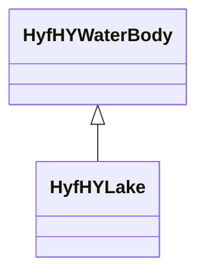

# Class: HyfHYLake


_The HY_Lake feature type defines the existence of body of surface water, participating in a hydrographic network, special due to its considerable size._


This class occurs 60083 times.


URI: [hyf:HY_Lake](https://www.opengis.net/def/schema/hy_features/hyf/HY_Lake)





## Inheritance
* [HyfHYWaterBody](../classes/HyfHYWaterBody.md)
    * **HyfHYLake**


## Slots

| Name | Cardinality and Range | Description | Inheritance | Occurrences |
| ---  | --- | --- | --- | --- |


## Usages

| used by | used in | type | used |
| ---  | --- | --- | --- |
| [B805a9e7d30eaabcb686b8ce670ed1e95](../classes/B805a9e7d30eaabcb686b8ce670ed1e95.md) | [spatial_spatiallyRelatedTo](../slots/spatial_spatiallyRelatedTo.md) | any_of[range] | [HyfHYLake](../classes/HyfHYLake.md) |
| [B805a9e7d30eaabcb686b8ce670ed1e95](../classes/B805a9e7d30eaabcb686b8ce670ed1e95.md) | [spatial_connectedTo](../slots/spatial_connectedTo.md) | any_of[range] | [HyfHYLake](../classes/HyfHYLake.md) |
| [HttpGwml2.orgDefGwml2#GWAquifer](../classes/HttpGwml2.orgDefGwml2#GWAquifer.md) | [spatial_spatiallyRelatedTo](../slots/spatial_spatiallyRelatedTo.md) | any_of[range] | [HyfHYLake](../classes/HyfHYLake.md) |
| [HttpGwml2.orgDefGwml2#GWAquifer](../classes/HttpGwml2.orgDefGwml2#GWAquifer.md) | [spatial_connectedTo](../slots/spatial_connectedTo.md) | any_of[range] | [HyfHYLake](../classes/HyfHYLake.md) |
| [HttpGwml2.orgDefGwml2#GWAquiferSystem](../classes/HttpGwml2.orgDefGwml2#GWAquiferSystem.md) | [spatial_spatiallyRelatedTo](../slots/spatial_spatiallyRelatedTo.md) | any_of[range] | [HyfHYLake](../classes/HyfHYLake.md) |
| [HttpGwml2.orgDefGwml2#GWAquiferSystem](../classes/HttpGwml2.orgDefGwml2#GWAquiferSystem.md) | [spatial_connectedTo](../slots/spatial_connectedTo.md) | any_of[range] | [HyfHYLake](../classes/HyfHYLake.md) |
| [HyfHYElementaryFlowPath](../classes/HyfHYElementaryFlowPath.md) | [spatial_spatiallyRelatedTo](../slots/spatial_spatiallyRelatedTo.md) | any_of[range] | [HyfHYLake](../classes/HyfHYLake.md) |
| [HyfHYElementaryFlowPath](../classes/HyfHYElementaryFlowPath.md) | [spatial_connectedTo](../slots/spatial_connectedTo.md) | any_of[range] | [HyfHYLake](../classes/HyfHYLake.md) |
| [KwgoS2CellLevel13](../classes/KwgoS2CellLevel13.md) | [spatial_spatiallyRelatedTo](../slots/spatial_spatiallyRelatedTo.md) | any_of[range] | [HyfHYLake](../classes/HyfHYLake.md) |
| [KwgoS2CellLevel13](../classes/KwgoS2CellLevel13.md) | [spatial_connectedTo](../slots/spatial_connectedTo.md) | any_of[range] | [HyfHYLake](../classes/HyfHYLake.md) |
| [MeMgsMGS-Well](../classes/MeMgsMGS-Well.md) | [spatial_spatiallyRelatedTo](../slots/spatial_spatiallyRelatedTo.md) | any_of[range] | [HyfHYLake](../classes/HyfHYLake.md) |
| [MeMgsMGS-Well](../classes/MeMgsMGS-Well.md) | [spatial_connectedTo](../slots/spatial_connectedTo.md) | any_of[range] | [HyfHYLake](../classes/HyfHYLake.md) |
| [UsSdwisPWS-ServiceArea](../classes/UsSdwisPWS-ServiceArea.md) | [spatial_spatiallyRelatedTo](../slots/spatial_spatiallyRelatedTo.md) | any_of[range] | [HyfHYLake](../classes/HyfHYLake.md) |
| [UsSdwisPWS-ServiceArea](../classes/UsSdwisPWS-ServiceArea.md) | [spatial_connectedTo](../slots/spatial_connectedTo.md) | any_of[range] | [HyfHYLake](../classes/HyfHYLake.md) |
| [UsSdwisPublicWaterSystem-CWS](../classes/UsSdwisPublicWaterSystem-CWS.md) | [spatial_spatiallyRelatedTo](../slots/spatial_spatiallyRelatedTo.md) | any_of[range] | [HyfHYLake](../classes/HyfHYLake.md) |
| [UsSdwisPublicWaterSystem-CWS](../classes/UsSdwisPublicWaterSystem-CWS.md) | [spatial_connectedTo](../slots/spatial_connectedTo.md) | any_of[range] | [HyfHYLake](../classes/HyfHYLake.md) |
| [UsSdwisPublicWaterSystem-GW](../classes/UsSdwisPublicWaterSystem-GW.md) | [spatial_spatiallyRelatedTo](../slots/spatial_spatiallyRelatedTo.md) | any_of[range] | [HyfHYLake](../classes/HyfHYLake.md) |
| [UsSdwisPublicWaterSystem-GW](../classes/UsSdwisPublicWaterSystem-GW.md) | [spatial_connectedTo](../slots/spatial_connectedTo.md) | any_of[range] | [HyfHYLake](../classes/HyfHYLake.md) |
| [UsSdwisPublicWaterSystem-NTNCWS](../classes/UsSdwisPublicWaterSystem-NTNCWS.md) | [spatial_spatiallyRelatedTo](../slots/spatial_spatiallyRelatedTo.md) | any_of[range] | [HyfHYLake](../classes/HyfHYLake.md) |
| [UsSdwisPublicWaterSystem-NTNCWS](../classes/UsSdwisPublicWaterSystem-NTNCWS.md) | [spatial_connectedTo](../slots/spatial_connectedTo.md) | any_of[range] | [HyfHYLake](../classes/HyfHYLake.md) |
| [UsSdwisPublicWaterSystem-SW](../classes/UsSdwisPublicWaterSystem-SW.md) | [spatial_spatiallyRelatedTo](../slots/spatial_spatiallyRelatedTo.md) | any_of[range] | [HyfHYLake](../classes/HyfHYLake.md) |
| [UsSdwisPublicWaterSystem-SW](../classes/UsSdwisPublicWaterSystem-SW.md) | [spatial_connectedTo](../slots/spatial_connectedTo.md) | any_of[range] | [HyfHYLake](../classes/HyfHYLake.md) |
| [UsSdwisPublicWaterSystem-TNCWS](../classes/UsSdwisPublicWaterSystem-TNCWS.md) | [spatial_spatiallyRelatedTo](../slots/spatial_spatiallyRelatedTo.md) | any_of[range] | [HyfHYLake](../classes/HyfHYLake.md) |
| [UsSdwisPublicWaterSystem-TNCWS](../classes/UsSdwisPublicWaterSystem-TNCWS.md) | [spatial_connectedTo](../slots/spatial_connectedTo.md) | any_of[range] | [HyfHYLake](../classes/HyfHYLake.md) |


## LinkML Source

<!-- TODO: investigate https://stackoverflow.com/questions/37606292/how-to-create-tabbed-code-blocks-in-mkdocs-or-sphinx -->

### Direct

<details>

```yaml
name: hyf_HY_Lake
description: The HY_Lake feature type defines the existence of body of surface water,
  participating in a hydrographic network, special due to its considerable size.
from_schema: okns:hyf
is_a: hyf_HY_WaterBody
class_uri: hyf:HY_Lake

```
</details>

### Induced

<details>

```yaml
name: hyf_HY_Lake
description: The HY_Lake feature type defines the existence of body of surface water,
  participating in a hydrographic network, special due to its considerable size.
from_schema: okns:hyf
is_a: hyf_HY_WaterBody
class_uri: hyf:HY_Lake

```
</details>