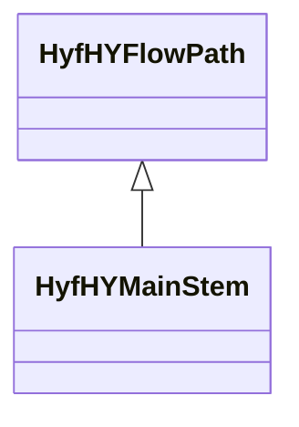

# Class: HyfHYMainStem


URI: [hyf:/HY_MainStem](https://www.opengis.net/def/schema/hy_features/hyf/HY_MainStem)





## Inheritance
* [OwlThing](../classes/OwlThing.md)
    * [HyfHYCatchmentRealization](../classes/HyfHYCatchmentRealization.md)
        * [HyfHYFlowPath](../classes/HyfHYFlowPath.md)
            * **HyfHYMainStem**


## Slots

| Name | Cardinality and Range | Description | Inheritance | Occurrences |
| ---  | --- | --- | --- | --- |


## LinkML Source

<!-- TODO: investigate https://stackoverflow.com/questions/37606292/how-to-create-tabbed-code-blocks-in-mkdocs-or-sphinx -->

### Direct

<details>

```yaml
name: hyf__HY_MainStem
from_schema: okns:hydrology-kg
exact_mappings:
- https://www.opengis.net/def/schema/hy_features/hyf/HY_MainStem
rank: 1000
is_a: hyf__HY_FlowPath
class_uri: hyf:/HY_MainStem

```
</details>

### Induced

<details>

```yaml
name: hyf__HY_MainStem
from_schema: okns:hydrology-kg
exact_mappings:
- https://www.opengis.net/def/schema/hy_features/hyf/HY_MainStem
rank: 1000
is_a: hyf__HY_FlowPath
class_uri: hyf:/HY_MainStem

```
</details>