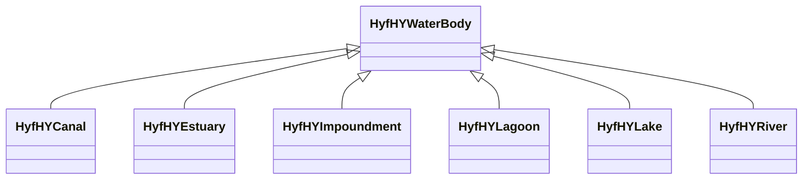

# Class: No class (entity type) name specified -- this class is noted as a superclass of another class in this graph but has not itself been defined. (hyf_HY_WaterBody)


_The HY_WaterBody feature type specializes the general HY_HydroFeature class. A waterbody is part of the hydrographic network and is either standing in a depression or flowing in a channel, which are parts of the channel network. A waterbody may be segmented in vertical sections at right angles to the main (average) direction of flow or along its centerline, and horizontal strata. Conceptually, each waterbody, or a stratum, could be thought of as a reservoir used for storage, regulation or control of water recourses.␊␊Through generalization, HY_WaterBody inherits the name property. It has associations for the hydrographicNetwork in which it participates, the containing waterpool and watercourse, the vertical streamCrossSection, streamLongitudinalSection, a horizontal stratum, and a reservoir for storage of water. Outlet-at-section and outlet-at-landmark constraints emphasize the recognition of a fixed landmark as outlet of the catchment realized by hydrographic network._


This class occurs 12902 times.


URI: [hyf:HY_WaterBody](https://www.opengis.net/def/schema/hy_features/hyf/HY_WaterBody)





## Inheritance
* **HyfHYWaterBody**
    * [HyfHYCanal](../classes/HyfHYCanal.md)
    * [HyfHYEstuary](../classes/HyfHYEstuary.md)
    * [HyfHYImpoundment](../classes/HyfHYImpoundment.md)
    * [HyfHYLagoon](../classes/HyfHYLagoon.md)
    * [HyfHYLake](../classes/HyfHYLake.md)
    * [HyfHYRiver](../classes/HyfHYRiver.md)


## Slots

| Name | Cardinality and Range | Description | Inheritance | Occurrences |
| ---  | --- | --- | --- | --- |


## Usages

| used by | used in | type | used |
| ---  | --- | --- | --- |
| [B805a9e7d30eaabcb686b8ce670ed1e95](../classes/B805a9e7d30eaabcb686b8ce670ed1e95.md) | [spatial_spatiallyRelatedTo](../slots/spatial_spatiallyRelatedTo.md) | any_of[range] | [HyfHYWaterBody](../classes/HyfHYWaterBody.md) |
| [B805a9e7d30eaabcb686b8ce670ed1e95](../classes/B805a9e7d30eaabcb686b8ce670ed1e95.md) | [spatial_connectedTo](../slots/spatial_connectedTo.md) | any_of[range] | [HyfHYWaterBody](../classes/HyfHYWaterBody.md) |
| [HttpGwml2.orgDefGwml2#GWAquifer](../classes/HttpGwml2.orgDefGwml2#GWAquifer.md) | [spatial_spatiallyRelatedTo](../slots/spatial_spatiallyRelatedTo.md) | any_of[range] | [HyfHYWaterBody](../classes/HyfHYWaterBody.md) |
| [HttpGwml2.orgDefGwml2#GWAquifer](../classes/HttpGwml2.orgDefGwml2#GWAquifer.md) | [spatial_connectedTo](../slots/spatial_connectedTo.md) | any_of[range] | [HyfHYWaterBody](../classes/HyfHYWaterBody.md) |
| [HttpGwml2.orgDefGwml2#GWAquiferSystem](../classes/HttpGwml2.orgDefGwml2#GWAquiferSystem.md) | [spatial_spatiallyRelatedTo](../slots/spatial_spatiallyRelatedTo.md) | any_of[range] | [HyfHYWaterBody](../classes/HyfHYWaterBody.md) |
| [HttpGwml2.orgDefGwml2#GWAquiferSystem](../classes/HttpGwml2.orgDefGwml2#GWAquiferSystem.md) | [spatial_connectedTo](../slots/spatial_connectedTo.md) | any_of[range] | [HyfHYWaterBody](../classes/HyfHYWaterBody.md) |
| [HyfHYElementaryFlowPath](../classes/HyfHYElementaryFlowPath.md) | [spatial_spatiallyRelatedTo](../slots/spatial_spatiallyRelatedTo.md) | any_of[range] | [HyfHYWaterBody](../classes/HyfHYWaterBody.md) |
| [HyfHYElementaryFlowPath](../classes/HyfHYElementaryFlowPath.md) | [spatial_connectedTo](../slots/spatial_connectedTo.md) | any_of[range] | [HyfHYWaterBody](../classes/HyfHYWaterBody.md) |
| [KwgoS2CellLevel13](../classes/KwgoS2CellLevel13.md) | [spatial_spatiallyRelatedTo](../slots/spatial_spatiallyRelatedTo.md) | any_of[range] | [HyfHYWaterBody](../classes/HyfHYWaterBody.md) |
| [KwgoS2CellLevel13](../classes/KwgoS2CellLevel13.md) | [spatial_connectedTo](../slots/spatial_connectedTo.md) | any_of[range] | [HyfHYWaterBody](../classes/HyfHYWaterBody.md) |
| [MeMgsMGS-Well](../classes/MeMgsMGS-Well.md) | [spatial_spatiallyRelatedTo](../slots/spatial_spatiallyRelatedTo.md) | any_of[range] | [HyfHYWaterBody](../classes/HyfHYWaterBody.md) |
| [MeMgsMGS-Well](../classes/MeMgsMGS-Well.md) | [spatial_connectedTo](../slots/spatial_connectedTo.md) | any_of[range] | [HyfHYWaterBody](../classes/HyfHYWaterBody.md) |
| [UsSdwisPWS-ServiceArea](../classes/UsSdwisPWS-ServiceArea.md) | [spatial_spatiallyRelatedTo](../slots/spatial_spatiallyRelatedTo.md) | any_of[range] | [HyfHYWaterBody](../classes/HyfHYWaterBody.md) |
| [UsSdwisPWS-ServiceArea](../classes/UsSdwisPWS-ServiceArea.md) | [spatial_connectedTo](../slots/spatial_connectedTo.md) | any_of[range] | [HyfHYWaterBody](../classes/HyfHYWaterBody.md) |
| [UsSdwisPublicWaterSystem-CWS](../classes/UsSdwisPublicWaterSystem-CWS.md) | [spatial_spatiallyRelatedTo](../slots/spatial_spatiallyRelatedTo.md) | any_of[range] | [HyfHYWaterBody](../classes/HyfHYWaterBody.md) |
| [UsSdwisPublicWaterSystem-CWS](../classes/UsSdwisPublicWaterSystem-CWS.md) | [spatial_connectedTo](../slots/spatial_connectedTo.md) | any_of[range] | [HyfHYWaterBody](../classes/HyfHYWaterBody.md) |
| [UsSdwisPublicWaterSystem-GW](../classes/UsSdwisPublicWaterSystem-GW.md) | [spatial_spatiallyRelatedTo](../slots/spatial_spatiallyRelatedTo.md) | any_of[range] | [HyfHYWaterBody](../classes/HyfHYWaterBody.md) |
| [UsSdwisPublicWaterSystem-GW](../classes/UsSdwisPublicWaterSystem-GW.md) | [spatial_connectedTo](../slots/spatial_connectedTo.md) | any_of[range] | [HyfHYWaterBody](../classes/HyfHYWaterBody.md) |
| [UsSdwisPublicWaterSystem-NTNCWS](../classes/UsSdwisPublicWaterSystem-NTNCWS.md) | [spatial_spatiallyRelatedTo](../slots/spatial_spatiallyRelatedTo.md) | any_of[range] | [HyfHYWaterBody](../classes/HyfHYWaterBody.md) |
| [UsSdwisPublicWaterSystem-NTNCWS](../classes/UsSdwisPublicWaterSystem-NTNCWS.md) | [spatial_connectedTo](../slots/spatial_connectedTo.md) | any_of[range] | [HyfHYWaterBody](../classes/HyfHYWaterBody.md) |
| [UsSdwisPublicWaterSystem-SW](../classes/UsSdwisPublicWaterSystem-SW.md) | [spatial_spatiallyRelatedTo](../slots/spatial_spatiallyRelatedTo.md) | any_of[range] | [HyfHYWaterBody](../classes/HyfHYWaterBody.md) |
| [UsSdwisPublicWaterSystem-SW](../classes/UsSdwisPublicWaterSystem-SW.md) | [spatial_connectedTo](../slots/spatial_connectedTo.md) | any_of[range] | [HyfHYWaterBody](../classes/HyfHYWaterBody.md) |
| [UsSdwisPublicWaterSystem-TNCWS](../classes/UsSdwisPublicWaterSystem-TNCWS.md) | [spatial_spatiallyRelatedTo](../slots/spatial_spatiallyRelatedTo.md) | any_of[range] | [HyfHYWaterBody](../classes/HyfHYWaterBody.md) |
| [UsSdwisPublicWaterSystem-TNCWS](../classes/UsSdwisPublicWaterSystem-TNCWS.md) | [spatial_connectedTo](../slots/spatial_connectedTo.md) | any_of[range] | [HyfHYWaterBody](../classes/HyfHYWaterBody.md) |


## LinkML Source

<!-- TODO: investigate https://stackoverflow.com/questions/37606292/how-to-create-tabbed-code-blocks-in-mkdocs-or-sphinx -->

### Direct

<details>

```yaml
name: hyf_HY_WaterBody
description: The HY_WaterBody feature type specializes the general HY_HydroFeature
  class. A waterbody is part of the hydrographic network and is either standing in
  a depression or flowing in a channel, which are parts of the channel network. A
  waterbody may be segmented in vertical sections at right angles to the main (average)
  direction of flow or along its centerline, and horizontal strata. Conceptually,
  each waterbody, or a stratum, could be thought of as a reservoir used for storage,
  regulation or control of water recourses.␊␊Through generalization, HY_WaterBody
  inherits the name property. It has associations for the hydrographicNetwork in which
  it participates, the containing waterpool and watercourse, the vertical streamCrossSection,
  streamLongitudinalSection, a horizontal stratum, and a reservoir for storage of
  water. Outlet-at-section and outlet-at-landmark constraints emphasize the recognition
  of a fixed landmark as outlet of the catchment realized by hydrographic network.
title: No class (entity type) name specified -- this class is noted as a superclass
  of another class in this graph but has not itself been defined.
from_schema: okns:hyf
class_uri: hyf:HY_WaterBody

```
</details>

### Induced

<details>

```yaml
name: hyf_HY_WaterBody
description: The HY_WaterBody feature type specializes the general HY_HydroFeature
  class. A waterbody is part of the hydrographic network and is either standing in
  a depression or flowing in a channel, which are parts of the channel network. A
  waterbody may be segmented in vertical sections at right angles to the main (average)
  direction of flow or along its centerline, and horizontal strata. Conceptually,
  each waterbody, or a stratum, could be thought of as a reservoir used for storage,
  regulation or control of water recourses.␊␊Through generalization, HY_WaterBody
  inherits the name property. It has associations for the hydrographicNetwork in which
  it participates, the containing waterpool and watercourse, the vertical streamCrossSection,
  streamLongitudinalSection, a horizontal stratum, and a reservoir for storage of
  water. Outlet-at-section and outlet-at-landmark constraints emphasize the recognition
  of a fixed landmark as outlet of the catchment realized by hydrographic network.
title: No class (entity type) name specified -- this class is noted as a superclass
  of another class in this graph but has not itself been defined.
from_schema: okns:hyf
class_uri: hyf:HY_WaterBody

```
</details>