# Class: No class (entity type) name specified -- this class is noted as a superclass of another class in this graph but has not itself been defined. (hyf__HY_WaterBody)


This class occurs 12902 times.


URI: [hyf:/HY_WaterBody](https://www.opengis.net/def/schema/hy_features/hyf/HY_WaterBody)

```mermaid
 classDiagram
    class HyfHYWaterBody
    click HyfHYWaterBody href "../HyfHYWaterBody"
      HyfHYHydroFeature <|-- HyfHYWaterBody
        click HyfHYHydroFeature href "../HyfHYHydroFeature"
      

      HyfHYWaterBody <|-- HyfHYCanal
        click HyfHYCanal href "../HyfHYCanal"
      HyfHYWaterBody <|-- HyfHYEstuary
        click HyfHYEstuary href "../HyfHYEstuary"
      HyfHYWaterBody <|-- HyfHYImpoundment
        click HyfHYImpoundment href "../HyfHYImpoundment"
      HyfHYWaterBody <|-- HyfHYLagoon
        click HyfHYLagoon href "../HyfHYLagoon"
      HyfHYWaterBody <|-- HyfHYLake
        click HyfHYLake href "../HyfHYLake"
      HyfHYWaterBody <|-- HyfHYRiver
        click HyfHYRiver href "../HyfHYRiver"
      
      
      HyfHYWaterBody : dct_title
        
          
    
    
    HyfHYWaterBody --> "0..1" Any : dct_title
    click Any href "../Any"

        
      HyfHYWaterBody : geo_defaultGeometry
        
          
    
    
    HyfHYWaterBody --> "0..1" GeoGeometry : geo_defaultGeometry
    click GeoGeometry href "../GeoGeometry"

        
      HyfHYWaterBody : geo_hasGeometry
        
          
    
    
    HyfHYWaterBody --> "0..1" GeoGeometry : geo_hasGeometry
    click GeoGeometry href "../GeoGeometry"

        
      HyfHYWaterBody : http___nhdplusv2.spatialai.org_v1_nhdplusv2#hasCOMID
        
          
    
    
    HyfHYWaterBody --> "0..1" String : http___nhdplusv2.spatialai.org_v1_nhdplusv2#hasCOMID
    click String href "../String"

        
      HyfHYWaterBody : http___nhdplusv2.spatialai.org_v1_nhdplusv2#hasFCODE
        
          
    
    
    HyfHYWaterBody --> "0..1" String : http___nhdplusv2.spatialai.org_v1_nhdplusv2#hasFCODE
    click String href "../String"

        
      HyfHYWaterBody : http___nhdplusv2.spatialai.org_v1_nhdplusv2#hasFTYPE
        
          
    
    
    HyfHYWaterBody --> "0..1" String : http___nhdplusv2.spatialai.org_v1_nhdplusv2#hasFTYPE
    click String href "../String"

        
      HyfHYWaterBody : http___nhdplusv2.spatialai.org_v1_nhdplusv2#hasReachCode
        
          
    
    
    HyfHYWaterBody --> "0..1" String : http___nhdplusv2.spatialai.org_v1_nhdplusv2#hasReachCode
    click String href "../String"

        
      HyfHYWaterBody : kwgo_sfContains
        
          
    
    
    HyfHYWaterBody --> "0..1" Any : kwgo_sfContains
    click Any href "../Any"

        
      HyfHYWaterBody : kwgo_sfCrosses
        
          
    
    
    HyfHYWaterBody --> "0..1" Any : kwgo_sfCrosses
    click Any href "../Any"

        
      HyfHYWaterBody : kwgo_sfOverlaps
        
          
    
    
    HyfHYWaterBody --> "0..1" Any : kwgo_sfOverlaps
    click Any href "../Any"

        
      HyfHYWaterBody : kwgo_sfTouches
        
          
    
    
    HyfHYWaterBody --> "0..1" Any : kwgo_sfTouches
    click Any href "../Any"

        
      HyfHYWaterBody : kwgo_spatialRelation
        
          
    
    
    HyfHYWaterBody --> "0..1" Any : kwgo_spatialRelation
    click Any href "../Any"

        
      HyfHYWaterBody : owl_sameAs
        
          
    
    
    HyfHYWaterBody --> "0..1" OwlThing : owl_sameAs
    click OwlThing href "../OwlThing"

        
      HyfHYWaterBody : rdfs_label
        
          
    
    
    HyfHYWaterBody --> "0..1" Any : rdfs_label
    click Any href "../Any"

        
      HyfHYWaterBody : sdos_name
        
          
    
    
    HyfHYWaterBody --> "0..1" SdosText : sdos_name
    click SdosText href "../SdosText"

        
      HyfHYWaterBody : spatial_connectedTo
        
          
    
    
    HyfHYWaterBody --> "0..1" Any : spatial_connectedTo
    click Any href "../Any"

        
      HyfHYWaterBody : spatial_spatiallyRelatedTo
        
          
    
    
    HyfHYWaterBody --> "0..1" Any : spatial_spatiallyRelatedTo
    click Any href "../Any"

        
      
```





## Inheritance
* [OwlThing](../classes/OwlThing.md)
    * [HyfHYHydroFeature](../classes/HyfHYHydroFeature.md)
        * **HyfHYWaterBody**
            * [HyfHYCanal](../classes/HyfHYCanal.md)
            * [HyfHYEstuary](../classes/HyfHYEstuary.md)
            * [HyfHYImpoundment](../classes/HyfHYImpoundment.md)
            * [HyfHYLagoon](../classes/HyfHYLagoon.md)
            * [HyfHYLake](../classes/HyfHYLake.md)
            * [HyfHYRiver](../classes/HyfHYRiver.md)


## Slots

| Name | Cardinality and Range | Description | Inheritance | Occurrences |
| ---  | --- | --- | --- | --- |
| [kwgo_sfOverlaps](../slots/kwgo_sfOverlaps.md) | 0..1 <br/> [Any](../classes/Any.md) | KWG's spatial overlap relation <br/> No occurrences of this slot in the graph. | direct | 80706 |
| [http___nhdplusv2.spatialai.org_v1_nhdplusv2#hasCOMID](../slots/http___nhdplusv2.spatialai.org_v1_nhdplusv2#hasCOMID.md) | 0..1 <br/> [xsd:string](http://www.w3.org/2001/XMLSchema#string) |  <br/>  | direct | 12902 |
| [kwgo_sfContains](../slots/kwgo_sfContains.md) | 0..1 <br/> [Any](../classes/Any.md) | KWG's spatial contains relation <br/> No occurrences of this slot in the graph. | direct | 2905 |
| [http___nhdplusv2.spatialai.org_v1_nhdplusv2#hasReachCode](../slots/http___nhdplusv2.spatialai.org_v1_nhdplusv2#hasReachCode.md) | 0..1 <br/> [xsd:string](http://www.w3.org/2001/XMLSchema#string) |  <br/>  | direct | 12902 |
| [owl_sameAs](../slots/owl_sameAs.md) | 0..1 <br/> [OwlThing](../classes/OwlThing.md) | The property that determines that two given individuals are equal <br/> No occurrences of this slot in the graph. | direct | 12902 |
| [rdfs_label](../slots/rdfs_label.md) | 0..1 <br/> [RdfsLiteral](../classes/RdfsLiteral.md)&nbsp;or&nbsp;<br />[xsd:string](http://www.w3.org/2001/XMLSchema#string) | A human-readable name for the subject <br/>  | direct | 624 |
| [geo_hasGeometry](../slots/geo_hasGeometry.md) | 0..1 <br/> [GeoGeometry](../classes/GeoGeometry.md) | A spatial representation for a given Feature <br/> source: http://www.opengis.net/spec/geosparql/1.0/req/geometry-extension/feature-properties<br/>source: http://www.opengis.net/spec/geosparql/1.1/req/geometry-extension/feature-properties<br/>source: http://www.opengis.net/ont/geosparql#<br/>source: http://www.opengis.net/spec/geosparql/1.0/req/geometry-extension/feature-properties<br/>source: http://www.opengis.net/spec/geosparql/1.1/req/geometry-extension/feature-properties<br/>description: A spatial representation for a given Feature.<br/>No occurrences of this slot in the graph. | direct | 25804 |
| [spatial_connectedTo](../slots/spatial_connectedTo.md) | 0..1 <br/> [HttpGwml2.orgDefGwml2#GWAquiferSystem](../classes/HttpGwml2.orgDefGwml2#GWAquiferSystem.md)&nbsp;or&nbsp;<br />[KwgoAdministrativeRegion3](../classes/KwgoAdministrativeRegion3.md)&nbsp;or&nbsp;<br />[HyfHYElementaryFlowPath](../classes/HyfHYElementaryFlowPath.md)&nbsp;or&nbsp;<br />[UsSdwisPublicWaterSystem-NTNCWS](../classes/UsSdwisPublicWaterSystem-NTNCWS.md)&nbsp;or&nbsp;<br />[UsSdwisPublicWaterSystem-TNCWS](../classes/UsSdwisPublicWaterSystem-TNCWS.md)&nbsp;or&nbsp;<br />[MeMgsMGS-Well](../classes/MeMgsMGS-Well.md)&nbsp;or&nbsp;<br />[KwgoS2CellLevel13](../classes/KwgoS2CellLevel13.md)&nbsp;or&nbsp;<br />[UsSdwisPublicWaterSystem-SW](../classes/UsSdwisPublicWaterSystem-SW.md)&nbsp;or&nbsp;<br />[KwgoAdministrativeRegion](../classes/KwgoAdministrativeRegion.md)&nbsp;or&nbsp;<br />[GeoSpatialObject](../classes/GeoSpatialObject.md)&nbsp;or&nbsp;<br />[UsSdwisPWS-ServiceArea](../classes/UsSdwisPWS-ServiceArea.md)&nbsp;or&nbsp;<br />[HyfHYWaterBody](../classes/HyfHYWaterBody.md)&nbsp;or&nbsp;<br />[KwgoRegion](../classes/KwgoRegion.md)&nbsp;or&nbsp;<br />[UsSdwisPublicWaterSystem-CWS](../classes/UsSdwisPublicWaterSystem-CWS.md)&nbsp;or&nbsp;<br />[KwgoAdministrativeRegion2](../classes/KwgoAdministrativeRegion2.md)&nbsp;or&nbsp;<br />[OwlThing](../classes/OwlThing.md)&nbsp;or&nbsp;<br />[UsSdwisPublicWaterSystem-GW](../classes/UsSdwisPublicWaterSystem-GW.md)&nbsp;or&nbsp;<br />[HttpGwml2.orgDefGwml2#GWAquifer](../classes/HttpGwml2.orgDefGwml2#GWAquifer.md)&nbsp;or&nbsp;<br />[HyfHYLake](../classes/HyfHYLake.md) |  <br/>  | direct | 90200 |
| [http___nhdplusv2.spatialai.org_v1_nhdplusv2#hasFTYPE](../slots/http___nhdplusv2.spatialai.org_v1_nhdplusv2#hasFTYPE.md) | 0..1 <br/> [xsd:string](http://www.w3.org/2001/XMLSchema#string) |  <br/>  | direct | 12902 |
| [spatial_spatiallyRelatedTo](../slots/spatial_spatiallyRelatedTo.md) | 0..1 <br/> [HttpGwml2.orgDefGwml2#GWAquiferSystem](../classes/HttpGwml2.orgDefGwml2#GWAquiferSystem.md)&nbsp;or&nbsp;<br />[KwgoAdministrativeRegion3](../classes/KwgoAdministrativeRegion3.md)&nbsp;or&nbsp;<br />[HyfHYElementaryFlowPath](../classes/HyfHYElementaryFlowPath.md)&nbsp;or&nbsp;<br />[UsSdwisPublicWaterSystem-NTNCWS](../classes/UsSdwisPublicWaterSystem-NTNCWS.md)&nbsp;or&nbsp;<br />[UsSdwisPublicWaterSystem-TNCWS](../classes/UsSdwisPublicWaterSystem-TNCWS.md)&nbsp;or&nbsp;<br />[MeMgsMGS-Well](../classes/MeMgsMGS-Well.md)&nbsp;or&nbsp;<br />[KwgoS2CellLevel13](../classes/KwgoS2CellLevel13.md)&nbsp;or&nbsp;<br />[UsSdwisPublicWaterSystem-SW](../classes/UsSdwisPublicWaterSystem-SW.md)&nbsp;or&nbsp;<br />[KwgoAdministrativeRegion](../classes/KwgoAdministrativeRegion.md)&nbsp;or&nbsp;<br />[GeoSpatialObject](../classes/GeoSpatialObject.md)&nbsp;or&nbsp;<br />[UsSdwisPWS-ServiceArea](../classes/UsSdwisPWS-ServiceArea.md)&nbsp;or&nbsp;<br />[HyfHYWaterBody](../classes/HyfHYWaterBody.md)&nbsp;or&nbsp;<br />[KwgoRegion](../classes/KwgoRegion.md)&nbsp;or&nbsp;<br />[UsSdwisPublicWaterSystem-CWS](../classes/UsSdwisPublicWaterSystem-CWS.md)&nbsp;or&nbsp;<br />[KwgoAdministrativeRegion2](../classes/KwgoAdministrativeRegion2.md)&nbsp;or&nbsp;<br />[OwlThing](../classes/OwlThing.md)&nbsp;or&nbsp;<br />[UsSdwisPublicWaterSystem-GW](../classes/UsSdwisPublicWaterSystem-GW.md)&nbsp;or&nbsp;<br />[HttpGwml2.orgDefGwml2#GWAquifer](../classes/HttpGwml2.orgDefGwml2#GWAquifer.md)&nbsp;or&nbsp;<br />[HyfHYLake](../classes/HyfHYLake.md) |  <br/>  | direct | 90200 |
| [http___nhdplusv2.spatialai.org_v1_nhdplusv2#hasFCODE](../slots/http___nhdplusv2.spatialai.org_v1_nhdplusv2#hasFCODE.md) | 0..1 <br/> [xsd:string](http://www.w3.org/2001/XMLSchema#string) |  <br/>  | direct | 12902 |
| [kwgo_spatialRelation](../slots/kwgo_spatialRelation.md) | 0..1 <br/> [Any](../classes/Any.md) | KWG's general spatial relation <br/> No occurrences of this slot in the graph. | direct | 90200 |
| [dct_title](../slots/dct_title.md) | 0..1 <br/> [RdfsLiteral](../classes/RdfsLiteral.md)&nbsp;or&nbsp;<br />[xsd:string](http://www.w3.org/2001/XMLSchema#string) | A name given to the resource <br/>  | direct | 624 |
| [geo_defaultGeometry](../slots/geo_defaultGeometry.md) | 0..1 <br/> [GeoGeometry](../classes/GeoGeometry.md) | The default Geometry to be used in spatial calculations <br/> source: http://www.opengis.net/spec/geosparql/1.1/req/geometry-extension/feature-properties<br/>source: http://www.opengis.net/ont/geosparql#<br/>source: http://www.opengis.net/spec/geosparql/1.1/req/geometry-extension/feature-properties<br/>description: The default Geometry to be used in spatial calculations. It is usually the most detailed Geometry.<br/>No occurrences of this slot in the graph. | direct | 25804 |
| [kwgo_sfCrosses](../slots/kwgo_sfCrosses.md) | 0..1 <br/> [Any](../classes/Any.md) | KWG's spatial comment relation <br/> No occurrences of this slot in the graph. | direct | 4051 |
| [kwgo_sfTouches](../slots/kwgo_sfTouches.md) | 0..1 <br/> [Any](../classes/Any.md) | KWG's spatial touches relation <br/> No occurrences of this slot in the graph. | direct | 2580 |
| [sdos_name](../slots/sdos_name.md) | 0..1 <br/> [SdosText](../classes/SdosText.md) | The name of the item <br/> No occurrences of this slot in the graph. | direct | 624 |


## Usages

| used by | used in | type | used |
| ---  | --- | --- | --- |
| [HttpGwml2.orgDefGwml2#GWAquifer](../classes/HttpGwml2.orgDefGwml2#GWAquifer.md) | [spatial_connectedTo](../slots/spatial_connectedTo.md) | any_of[range] | [HyfHYWaterBody](../classes/HyfHYWaterBody.md) |
| [HttpGwml2.orgDefGwml2#GWAquifer](../classes/HttpGwml2.orgDefGwml2#GWAquifer.md) | [spatial_spatiallyRelatedTo](../slots/spatial_spatiallyRelatedTo.md) | any_of[range] | [HyfHYWaterBody](../classes/HyfHYWaterBody.md) |
| [HttpGwml2.orgDefGwml2#GWAquiferSystem](../classes/HttpGwml2.orgDefGwml2#GWAquiferSystem.md) | [spatial_connectedTo](../slots/spatial_connectedTo.md) | any_of[range] | [HyfHYWaterBody](../classes/HyfHYWaterBody.md) |
| [HttpGwml2.orgDefGwml2#GWAquiferSystem](../classes/HttpGwml2.orgDefGwml2#GWAquiferSystem.md) | [spatial_spatiallyRelatedTo](../slots/spatial_spatiallyRelatedTo.md) | any_of[range] | [HyfHYWaterBody](../classes/HyfHYWaterBody.md) |
| [HyfHYCanal](../classes/HyfHYCanal.md) | [spatial_connectedTo](../slots/spatial_connectedTo.md) | any_of[range] | [HyfHYWaterBody](../classes/HyfHYWaterBody.md) |
| [HyfHYCanal](../classes/HyfHYCanal.md) | [spatial_spatiallyRelatedTo](../slots/spatial_spatiallyRelatedTo.md) | any_of[range] | [HyfHYWaterBody](../classes/HyfHYWaterBody.md) |
| [HyfHYElementaryFlowPath](../classes/HyfHYElementaryFlowPath.md) | [spatial_connectedTo](../slots/spatial_connectedTo.md) | any_of[range] | [HyfHYWaterBody](../classes/HyfHYWaterBody.md) |
| [HyfHYElementaryFlowPath](../classes/HyfHYElementaryFlowPath.md) | [spatial_spatiallyRelatedTo](../slots/spatial_spatiallyRelatedTo.md) | any_of[range] | [HyfHYWaterBody](../classes/HyfHYWaterBody.md) |
| [HyfHYEstuary](../classes/HyfHYEstuary.md) | [spatial_connectedTo](../slots/spatial_connectedTo.md) | any_of[range] | [HyfHYWaterBody](../classes/HyfHYWaterBody.md) |
| [HyfHYEstuary](../classes/HyfHYEstuary.md) | [spatial_spatiallyRelatedTo](../slots/spatial_spatiallyRelatedTo.md) | any_of[range] | [HyfHYWaterBody](../classes/HyfHYWaterBody.md) |
| [HyfHYImpoundment](../classes/HyfHYImpoundment.md) | [spatial_connectedTo](../slots/spatial_connectedTo.md) | any_of[range] | [HyfHYWaterBody](../classes/HyfHYWaterBody.md) |
| [HyfHYImpoundment](../classes/HyfHYImpoundment.md) | [spatial_spatiallyRelatedTo](../slots/spatial_spatiallyRelatedTo.md) | any_of[range] | [HyfHYWaterBody](../classes/HyfHYWaterBody.md) |
| [HyfHYLagoon](../classes/HyfHYLagoon.md) | [spatial_connectedTo](../slots/spatial_connectedTo.md) | any_of[range] | [HyfHYWaterBody](../classes/HyfHYWaterBody.md) |
| [HyfHYLagoon](../classes/HyfHYLagoon.md) | [spatial_spatiallyRelatedTo](../slots/spatial_spatiallyRelatedTo.md) | any_of[range] | [HyfHYWaterBody](../classes/HyfHYWaterBody.md) |
| [HyfHYLake](../classes/HyfHYLake.md) | [spatial_connectedTo](../slots/spatial_connectedTo.md) | any_of[range] | [HyfHYWaterBody](../classes/HyfHYWaterBody.md) |
| [HyfHYLake](../classes/HyfHYLake.md) | [spatial_spatiallyRelatedTo](../slots/spatial_spatiallyRelatedTo.md) | any_of[range] | [HyfHYWaterBody](../classes/HyfHYWaterBody.md) |
| [HyfHYRiver](../classes/HyfHYRiver.md) | [spatial_connectedTo](../slots/spatial_connectedTo.md) | any_of[range] | [HyfHYWaterBody](../classes/HyfHYWaterBody.md) |
| [HyfHYRiver](../classes/HyfHYRiver.md) | [spatial_spatiallyRelatedTo](../slots/spatial_spatiallyRelatedTo.md) | any_of[range] | [HyfHYWaterBody](../classes/HyfHYWaterBody.md) |
| [HyfHYWaterBody](../classes/HyfHYWaterBody.md) | [spatial_connectedTo](../slots/spatial_connectedTo.md) | any_of[range] | [HyfHYWaterBody](../classes/HyfHYWaterBody.md) |
| [HyfHYWaterBody](../classes/HyfHYWaterBody.md) | [spatial_spatiallyRelatedTo](../slots/spatial_spatiallyRelatedTo.md) | any_of[range] | [HyfHYWaterBody](../classes/HyfHYWaterBody.md) |
| [KwgoS2CellLevel13](../classes/KwgoS2CellLevel13.md) | [spatial_connectedTo](../slots/spatial_connectedTo.md) | any_of[range] | [HyfHYWaterBody](../classes/HyfHYWaterBody.md) |
| [KwgoS2CellLevel13](../classes/KwgoS2CellLevel13.md) | [spatial_spatiallyRelatedTo](../slots/spatial_spatiallyRelatedTo.md) | any_of[range] | [HyfHYWaterBody](../classes/HyfHYWaterBody.md) |
| [MeMgsMGS-Well](../classes/MeMgsMGS-Well.md) | [spatial_connectedTo](../slots/spatial_connectedTo.md) | any_of[range] | [HyfHYWaterBody](../classes/HyfHYWaterBody.md) |
| [MeMgsMGS-Well](../classes/MeMgsMGS-Well.md) | [spatial_spatiallyRelatedTo](../slots/spatial_spatiallyRelatedTo.md) | any_of[range] | [HyfHYWaterBody](../classes/HyfHYWaterBody.md) |
| [UsSdwisPWS-ServiceArea](../classes/UsSdwisPWS-ServiceArea.md) | [spatial_connectedTo](../slots/spatial_connectedTo.md) | any_of[range] | [HyfHYWaterBody](../classes/HyfHYWaterBody.md) |
| [UsSdwisPWS-ServiceArea](../classes/UsSdwisPWS-ServiceArea.md) | [spatial_spatiallyRelatedTo](../slots/spatial_spatiallyRelatedTo.md) | any_of[range] | [HyfHYWaterBody](../classes/HyfHYWaterBody.md) |
| [UsSdwisPublicWaterSystem-CWS](../classes/UsSdwisPublicWaterSystem-CWS.md) | [spatial_connectedTo](../slots/spatial_connectedTo.md) | any_of[range] | [HyfHYWaterBody](../classes/HyfHYWaterBody.md) |
| [UsSdwisPublicWaterSystem-CWS](../classes/UsSdwisPublicWaterSystem-CWS.md) | [spatial_spatiallyRelatedTo](../slots/spatial_spatiallyRelatedTo.md) | any_of[range] | [HyfHYWaterBody](../classes/HyfHYWaterBody.md) |
| [UsSdwisPublicWaterSystem-GW](../classes/UsSdwisPublicWaterSystem-GW.md) | [spatial_connectedTo](../slots/spatial_connectedTo.md) | any_of[range] | [HyfHYWaterBody](../classes/HyfHYWaterBody.md) |
| [UsSdwisPublicWaterSystem-GW](../classes/UsSdwisPublicWaterSystem-GW.md) | [spatial_spatiallyRelatedTo](../slots/spatial_spatiallyRelatedTo.md) | any_of[range] | [HyfHYWaterBody](../classes/HyfHYWaterBody.md) |
| [UsSdwisPublicWaterSystem-NTNCWS](../classes/UsSdwisPublicWaterSystem-NTNCWS.md) | [spatial_connectedTo](../slots/spatial_connectedTo.md) | any_of[range] | [HyfHYWaterBody](../classes/HyfHYWaterBody.md) |
| [UsSdwisPublicWaterSystem-NTNCWS](../classes/UsSdwisPublicWaterSystem-NTNCWS.md) | [spatial_spatiallyRelatedTo](../slots/spatial_spatiallyRelatedTo.md) | any_of[range] | [HyfHYWaterBody](../classes/HyfHYWaterBody.md) |
| [UsSdwisPublicWaterSystem-SW](../classes/UsSdwisPublicWaterSystem-SW.md) | [spatial_connectedTo](../slots/spatial_connectedTo.md) | any_of[range] | [HyfHYWaterBody](../classes/HyfHYWaterBody.md) |
| [UsSdwisPublicWaterSystem-SW](../classes/UsSdwisPublicWaterSystem-SW.md) | [spatial_spatiallyRelatedTo](../slots/spatial_spatiallyRelatedTo.md) | any_of[range] | [HyfHYWaterBody](../classes/HyfHYWaterBody.md) |
| [UsSdwisPublicWaterSystem-TNCWS](../classes/UsSdwisPublicWaterSystem-TNCWS.md) | [spatial_connectedTo](../slots/spatial_connectedTo.md) | any_of[range] | [HyfHYWaterBody](../classes/HyfHYWaterBody.md) |
| [UsSdwisPublicWaterSystem-TNCWS](../classes/UsSdwisPublicWaterSystem-TNCWS.md) | [spatial_spatiallyRelatedTo](../slots/spatial_spatiallyRelatedTo.md) | any_of[range] | [HyfHYWaterBody](../classes/HyfHYWaterBody.md) |


## LinkML Source

<!-- TODO: investigate https://stackoverflow.com/questions/37606292/how-to-create-tabbed-code-blocks-in-mkdocs-or-sphinx -->

### Direct

<details>

```yaml
name: hyf__HY_WaterBody
title: No class (entity type) name specified -- this class is noted as a superclass
  of another class in this graph but has not itself been defined.
from_schema: okns:hydrology-kg
exact_mappings:
- https://www.opengis.net/def/schema/hy_features/hyf/HY_WaterBody
rank: 1000
is_a: hyf__HY_HydroFeature
slots:
- kwgo_sfOverlaps
- http___nhdplusv2.spatialai.org_v1_nhdplusv2#hasCOMID
- kwgo_sfContains
- http___nhdplusv2.spatialai.org_v1_nhdplusv2#hasReachCode
- owl_sameAs
- rdfs_label
- geo_hasGeometry
- spatial_connectedTo
- http___nhdplusv2.spatialai.org_v1_nhdplusv2#hasFTYPE
- spatial_spatiallyRelatedTo
- http___nhdplusv2.spatialai.org_v1_nhdplusv2#hasFCODE
- kwgo_spatialRelation
- dct_title
- geo_defaultGeometry
- kwgo_sfCrosses
- kwgo_sfTouches
- sdos_name
class_uri: hyf:/HY_WaterBody

```
</details>

### Induced

<details>

```yaml
name: hyf__HY_WaterBody
title: No class (entity type) name specified -- this class is noted as a superclass
  of another class in this graph but has not itself been defined.
from_schema: okns:hydrology-kg
exact_mappings:
- https://www.opengis.net/def/schema/hy_features/hyf/HY_WaterBody
rank: 1000
is_a: hyf__HY_HydroFeature
attributes:
  kwgo_sfOverlaps:
    name: kwgo_sfOverlaps
    description: KWG's spatial overlap relation
    title: overlaps (simple feature)
    comments:
    - No occurrences of this slot in the graph.
    from_schema: okns:kwg
    slot_uri: kwgo:sfOverlaps
    alias: kwgo_sfOverlaps
    owner: hyf__HY_WaterBody
    domain_of:
    - http___gwml2.org_def_gwml2#GW_Aquifer
    - http___gwml2.org_def_gwml2#GW_AquiferSystem
    - hyf__HY_Lake
    - hyf__HY_WaterBody
    - kwgo_S2Cell_Level13
    - us_sdwis_PWS-ServiceArea
    - us_sdwis_PublicWaterSystem-CWS
    - us_sdwis_PublicWaterSystem-GW
    - us_sdwis_PublicWaterSystem-NTNCWS
    - us_sdwis_PublicWaterSystem-SW
    - us_sdwis_PublicWaterSystem-TNCWS
    subproperty_of: kwgo_spatialRelation
    range: Any
  http___nhdplusv2.spatialai.org_v1_nhdplusv2#hasCOMID:
    name: http___nhdplusv2.spatialai.org_v1_nhdplusv2#hasCOMID
    from_schema: okns:hydrology-kg
    exact_mappings:
    - http://nhdplusv2.spatialai.org/v1/nhdplusv2#hasCOMID
    rank: 1000
    slot_uri: http://nhdplusv2.spatialai.org/v1/nhdplusv2#hasCOMID
    alias: http___nhdplusv2.spatialai.org_v1_nhdplusv2#hasCOMID
    owner: hyf__HY_WaterBody
    domain_of:
    - hyf__HY_ElementaryFlowPath
    - hyf__HY_Lake
    - hyf__HY_WaterBody
    range: string
  kwgo_sfContains:
    name: kwgo_sfContains
    description: KWG's spatial contains relation
    title: contains (simple feature)
    comments:
    - No occurrences of this slot in the graph.
    from_schema: okns:kwg
    slot_uri: kwgo:sfContains
    alias: kwgo_sfContains
    owner: hyf__HY_WaterBody
    domain_of:
    - http___gwml2.org_def_gwml2#GW_Aquifer
    - http___gwml2.org_def_gwml2#GW_AquiferSystem
    - hyf__HY_Lake
    - hyf__HY_WaterBody
    - kwgo_S2Cell_Level13
    - us_sdwis_PWS-ServiceArea
    subproperty_of: kwgo_spatialRelation
    range: Any
  http___nhdplusv2.spatialai.org_v1_nhdplusv2#hasReachCode:
    name: http___nhdplusv2.spatialai.org_v1_nhdplusv2#hasReachCode
    from_schema: okns:hydrology-kg
    exact_mappings:
    - http://nhdplusv2.spatialai.org/v1/nhdplusv2#hasReachCode
    rank: 1000
    slot_uri: http://nhdplusv2.spatialai.org/v1/nhdplusv2#hasReachCode
    alias: http___nhdplusv2.spatialai.org_v1_nhdplusv2#hasReachCode
    owner: hyf__HY_WaterBody
    domain_of:
    - hyf__HY_ElementaryFlowPath
    - hyf__HY_Lake
    - hyf__HY_WaterBody
    range: string
  owl_sameAs:
    name: owl_sameAs
    description: The property that determines that two given individuals are equal.
    title: sameAs
    comments:
    - No occurrences of this slot in the graph.
    from_schema: okns:owl-rdf-rdfs
    source: http://www.w3.org/2002/07/owl#
    domain: owl_Thing
    slot_uri: owl:sameAs
    alias: owl_sameAs
    owner: hyf__HY_WaterBody
    domain_of:
    - http___gwml2.org_def_gwml2#GW_Aquifer
    - http___gwml2.org_def_gwml2#GW_AquiferSystem
    - http___nhdplusv2.spatialai.org_v1_nhdplusv2#FlowPathLength
    - hyf__HY_ElementaryFlowPath
    - hyf__HY_Lake
    - hyf__HY_WaterBody
    - il_isgs_ISGS-Well
    - il_isgs_WellDepthInFt
    - il_isgs_WellPurpose
    - il_isgs_WellYield
    - kwgo_S2Cell_Level13
    - me_mgs_MGS-Well
    - me_mgs_WellDepthInFt
    - me_mgs_WellOverburdenThicknessInFt
    - me_mgs_WellType
    - me_mgs_WellUse
    - owl_DataProperty
    - sf_#MultiPolygon
    - sf_#Polygon
    - us_sdwis_PWS-ServiceArea
    - us_sdwis_PWS-ServiceAreaType
    - us_sdwis_PWS-SourceWaterType
    - us_sdwis_PWS-SubFeatureActivity
    - us_sdwis_PWS-SubFeatureType
    - us_sdwis_PublicWaterSystem-CWS
    - us_sdwis_PublicWaterSystem-GW
    - us_sdwis_PublicWaterSystem-NTNCWS
    - us_sdwis_PublicWaterSystem-SW
    - us_sdwis_PublicWaterSystem-TNCWS
    range: owl_Thing
  rdfs_label:
    name: rdfs_label
    description: A human-readable name for the subject.
    title: label
    from_schema: okns:owl-rdf-rdfs
    source: http://www.w3.org/2000/01/rdf-schema#
    domain: rdfs_Resource
    slot_uri: rdfs:label
    alias: rdfs_label
    owner: hyf__HY_WaterBody
    domain_of:
    - dcam_VocabularyEncodingScheme
    - qudt_AspectClass
    - qudt_BitEncodingType
    - qudt_BooleanEncodingType
    - qudt_ByteEncodingType
    - qudt_CardinalityType
    - qudt_CharEncodingType
    - qudt_DateTimeStringEncodingType
    - qudt_EndianType
    - qudt_FloatingPointEncodingType
    - qudt_IntegerEncodingType
    - qudt_OrderedType
    - qudt_SignednessType
    - owl_OntologyProperty
    - rdf_List
    - rdfs_Datatype
    - time_DayOfWeek
    - time_TemporalUnit
    - sdos_ActionStatusType
    - sdos_AdultOrientedEnumeration
    - sdos_BoardingPolicyType
    - sdos_BodyMeasurementTypeEnumeration
    - sdos_BookFormatType
    - sdos_Boolean
    - sdos_CarUsageType
    - sdos_CertificationStatusEnumeration
    - sdos_ContactPointOption
    - sdos_DayOfWeek
    - sdos_DeliveryMethod
    - sdos_DigitalDocumentPermissionType
    - sdos_DigitalPlatformEnumeration
    - sdos_DriveWheelConfigurationValue
    - sdos_DrugCostCategory
    - sdos_DrugPregnancyCategory
    - sdos_DrugPrescriptionStatus
    - sdos_EUEnergyEfficiencyEnumeration
    - sdos_EnergyStarEnergyEfficiencyEnumeration
    - sdos_EventAttendanceModeEnumeration
    - sdos_EventStatusType
    - sdos_FulfillmentTypeEnumeration
    - sdos_GameAvailabilityEnumeration
    - sdos_GamePlayMode
    - sdos_GameServerStatus
    - sdos_GenderType
    - sdos_GovernmentBenefitsType
    - sdos_HealthAspectEnumeration
    - sdos_IPTCDigitalSourceEnumeration
    - sdos_IncentiveQualifiedExpenseType
    - sdos_IncentiveStatus
    - sdos_IncentiveType
    - sdos_InfectiousAgentClass
    - sdos_ItemAvailability
    - sdos_ItemListOrderType
    - sdos_LegalForceStatus
    - sdos_LegalValueLevel
    - sdos_MapCategoryType
    - sdos_MeasurementMethodEnum
    - sdos_MediaManipulationRatingEnumeration
    - sdos_MedicalAudienceType
    - sdos_MedicalDevicePurpose
    - sdos_MedicalEvidenceLevel
    - sdos_MedicalImagingTechnique
    - sdos_MedicalObservationalStudyDesign
    - sdos_MedicalProcedureType
    - sdos_MedicalSpecialty
    - sdos_MedicalStudyStatus
    - sdos_MedicalTrialDesign
    - sdos_MedicineSystem
    - sdos_MerchantReturnEnumeration
    - sdos_MusicAlbumProductionType
    - sdos_MusicAlbumReleaseType
    - sdos_MusicReleaseFormatType
    - sdos_NLNonprofitType
    - sdos_OfferItemCondition
    - sdos_OrderStatus
    - sdos_PaymentMethodType
    - sdos_PaymentStatusType
    - sdos_PhysicalActivityCategory
    - sdos_PhysicalExam
    - sdos_PriceComponentTypeEnumeration
    - sdos_PriceTypeEnumeration
    - sdos_ProductReturnEnumeration
    - sdos_PurchaseType
    - sdos_RefundTypeEnumeration
    - sdos_ReservationStatusType
    - sdos_RestrictedDiet
    - sdos_ReturnFeesEnumeration
    - sdos_ReturnLabelSourceEnumeration
    - sdos_ReturnMethodEnumeration
    - sdos_RsvpResponseType
    - sdos_SizeSystemEnumeration
    - sdos_SteeringPositionValue
    - sdos_TierBenefitEnumeration
    - sdos_UKNonprofitType
    - sdos_USNonprofitType
    - sdos_WearableMeasurementTypeEnumeration
    - sdos_WearableSizeGroupEnumeration
    - sdos_WearableSizeSystemEnumeration
    - rdf_DatatypeProperty
    - vaem_GraphMetaData
    - vaem_GraphRole
    - vaem_Party
    - vaem_CatalogEntry
    - voag_Attribution
    - voag_AttributionLogo
    - voag_ChangeFrequency
    - voag_ChangeType
    - voag_ConfidentialityLevel
    - voag_CreativeCommonsPermission
    - voag_CreativeCommonsProhibition
    - voag_CreativeCommonsRequirement
    - voag_Governance
    - voag_GovernanceRole
    - voag_Icon
    - voag_IssueStatus
    - voag_LicenseModel
    - voag_Logo
    - voag_Maturity
    - voag_OrganizationLogo
    - voag_Pedigree
    - voag_PriorityValue
    - voag_ProductLogo
    - voag_Provenance
    - voag_PublicationStatus
    - voag_SchemaGraph
    - kwgo_AirPollutant
    - kwgo_BlueskyWildfireObservableProperty
    - kwgo_CensusObservableProperty
    - kwgo_ClimateObservableProperty
    - kwgo_CroplandObservableProperty
    - kwgo_DroughtIntensity
    - kwgo_FireCause
    - kwgo_HelipadAvailability
    - kwgo_HospitalStatus
    - kwgo_HospitalType
    - kwgo_ImpactObservableProperty
    - kwgo_LSADArea
    - kwgo_MTBSFireObservableProperty
    - kwgo_MagnitudeObservableProperty
    - kwgo_NIFCFireObservableProperty
    - kwgo_PublicHealthObservableProperty
    - kwgo_RoadType
    - kwgo_SmokePlumeObservableProperty
    - kwgo_SoilMapUnitObservableProperty
    - kwgo_StormTrackObservableProperty
    - kwgo_StormTrackletObservableProperty
    - kwgo_VulnerabilityObservableProperty
    - http___gwml2.org_def_gwml2#GW_Aquifer
    - http___gwml2.org_def_gwml2#GW_AquiferSystem
    - hyf__HY_ElementaryFlowPath
    - hyf__HY_Lake
    - hyf__HY_WaterBody
    - il_isgs_ISGS-Well
    - il_isgs_WellPurpose
    - me_mgs_MGS-Well
    - us_sdwis_PWS-ServiceAreaType
    - us_sdwis_PWS-SubFeatureActivity
    - us_sdwis_PWS-SubFeatureType
    - us_sdwis_PublicWaterSystem-CWS
    - us_sdwis_PublicWaterSystem-GW
    - us_sdwis_PublicWaterSystem-NTNCWS
    - us_sdwis_PublicWaterSystem-SW
    - us_sdwis_PublicWaterSystem-TNCWS
    range: Any
    any_of:
    - range: rdfs_Literal
    - range: string
  geo_hasGeometry:
    name: geo_hasGeometry
    description: A spatial representation for a given Feature.
    title: No slot (predicate) name specified -- this slot is noted as a subproperty
      of another slot in this graph but has not itself been defined.
    comments:
    - 'source: http://www.opengis.net/spec/geosparql/1.0/req/geometry-extension/feature-properties'
    - 'source: http://www.opengis.net/spec/geosparql/1.1/req/geometry-extension/feature-properties'
    - 'source: http://www.opengis.net/ont/geosparql#'
    - 'source: http://www.opengis.net/spec/geosparql/1.0/req/geometry-extension/feature-properties'
    - 'source: http://www.opengis.net/spec/geosparql/1.1/req/geometry-extension/feature-properties'
    - 'description: A spatial representation for a given Feature.'
    - No occurrences of this slot in the graph.
    from_schema: okns:geo
    source: http://www.opengis.net/ont/geosparql#
    domain: geo_Feature
    slot_uri: geo:hasGeometry
    alias: geo_hasGeometry
    owner: hyf__HY_WaterBody
    domain_of:
    - http___gwml2.org_def_gwml2#GW_Aquifer
    - http___gwml2.org_def_gwml2#GW_AquiferSystem
    - hyf__HY_ElementaryFlowPath
    - hyf__HY_Lake
    - hyf__HY_WaterBody
    - il_isgs_ISGS-Well
    - me_mgs_MGS-Well
    - us_sdwis_PWS-ServiceArea
    range: geo_Geometry
  spatial_connectedTo:
    name: spatial_connectedTo
    title: topological connection (spatial contact) (sawgraph)
    from_schema: okns:hydrology-kg
    exact_mappings:
    - http://purl.org/spatialai/spatial/spatial-full#connectedTo
    rank: 1000
    slot_uri: spatial:connectedTo
    alias: spatial_connectedTo
    owner: hyf__HY_WaterBody
    domain_of:
    - http___gwml2.org_def_gwml2#GW_Aquifer
    - http___gwml2.org_def_gwml2#GW_AquiferSystem
    - hyf__HY_ElementaryFlowPath
    - hyf__HY_Lake
    - hyf__HY_WaterBody
    - kwgo_S2Cell_Level13
    - me_mgs_MGS-Well
    - us_sdwis_PWS-ServiceArea
    - us_sdwis_PublicWaterSystem-CWS
    - us_sdwis_PublicWaterSystem-GW
    - us_sdwis_PublicWaterSystem-NTNCWS
    - us_sdwis_PublicWaterSystem-SW
    - us_sdwis_PublicWaterSystem-TNCWS
    subproperty_of: kwgo_spatialRelation
    union_of:
    - owl_Thing
    - geo_SpatialObject
    range: Any
    any_of:
    - range: http___gwml2.org_def_gwml2#GW_AquiferSystem
    - range: kwgo_AdministrativeRegion_3
    - range: hyf__HY_ElementaryFlowPath
    - range: us_sdwis_PublicWaterSystem-NTNCWS
    - range: us_sdwis_PublicWaterSystem-TNCWS
    - range: me_mgs_MGS-Well
    - range: kwgo_S2Cell_Level13
    - range: us_sdwis_PublicWaterSystem-SW
    - range: kwgo_AdministrativeRegion
    - range: geo_SpatialObject
    - range: us_sdwis_PWS-ServiceArea
    - range: hyf__HY_WaterBody
    - range: kwgo_Region
    - range: us_sdwis_PublicWaterSystem-CWS
    - range: kwgo_AdministrativeRegion_2
    - range: owl_Thing
    - range: us_sdwis_PublicWaterSystem-GW
    - range: http___gwml2.org_def_gwml2#GW_Aquifer
    - range: hyf__HY_Lake
  http___nhdplusv2.spatialai.org_v1_nhdplusv2#hasFTYPE:
    name: http___nhdplusv2.spatialai.org_v1_nhdplusv2#hasFTYPE
    from_schema: okns:hydrology-kg
    exact_mappings:
    - http://nhdplusv2.spatialai.org/v1/nhdplusv2#hasFTYPE
    rank: 1000
    slot_uri: http://nhdplusv2.spatialai.org/v1/nhdplusv2#hasFTYPE
    alias: http___nhdplusv2.spatialai.org_v1_nhdplusv2#hasFTYPE
    owner: hyf__HY_WaterBody
    domain_of:
    - hyf__HY_ElementaryFlowPath
    - hyf__HY_Lake
    - hyf__HY_WaterBody
    range: string
  spatial_spatiallyRelatedTo:
    name: spatial_spatiallyRelatedTo
    title: topological connection (spatial contact) (sawgraph)
    from_schema: okns:hydrology-kg
    exact_mappings:
    - http://purl.org/spatialai/spatial/spatial-full#spatiallyRelatedTo
    - http://stko-kwg.geog.ucsb.edu/lod/ontology/spatialRelation
    rank: 1000
    slot_uri: spatial:spatiallyRelatedTo
    alias: spatial_spatiallyRelatedTo
    owner: hyf__HY_WaterBody
    domain_of:
    - http___gwml2.org_def_gwml2#GW_Aquifer
    - http___gwml2.org_def_gwml2#GW_AquiferSystem
    - hyf__HY_ElementaryFlowPath
    - hyf__HY_Lake
    - hyf__HY_WaterBody
    - kwgo_S2Cell_Level13
    - me_mgs_MGS-Well
    - us_sdwis_PWS-ServiceArea
    - us_sdwis_PublicWaterSystem-CWS
    - us_sdwis_PublicWaterSystem-GW
    - us_sdwis_PublicWaterSystem-NTNCWS
    - us_sdwis_PublicWaterSystem-SW
    - us_sdwis_PublicWaterSystem-TNCWS
    subproperty_of: kwgo_spatialRelation
    union_of:
    - owl_Thing
    - geo_SpatialObject
    range: Any
    any_of:
    - range: http___gwml2.org_def_gwml2#GW_AquiferSystem
    - range: kwgo_AdministrativeRegion_3
    - range: hyf__HY_ElementaryFlowPath
    - range: us_sdwis_PublicWaterSystem-NTNCWS
    - range: us_sdwis_PublicWaterSystem-TNCWS
    - range: me_mgs_MGS-Well
    - range: kwgo_S2Cell_Level13
    - range: us_sdwis_PublicWaterSystem-SW
    - range: kwgo_AdministrativeRegion
    - range: geo_SpatialObject
    - range: us_sdwis_PWS-ServiceArea
    - range: hyf__HY_WaterBody
    - range: kwgo_Region
    - range: us_sdwis_PublicWaterSystem-CWS
    - range: kwgo_AdministrativeRegion_2
    - range: owl_Thing
    - range: us_sdwis_PublicWaterSystem-GW
    - range: http___gwml2.org_def_gwml2#GW_Aquifer
    - range: hyf__HY_Lake
  http___nhdplusv2.spatialai.org_v1_nhdplusv2#hasFCODE:
    name: http___nhdplusv2.spatialai.org_v1_nhdplusv2#hasFCODE
    from_schema: okns:hydrology-kg
    exact_mappings:
    - http://nhdplusv2.spatialai.org/v1/nhdplusv2#hasFCODE
    rank: 1000
    slot_uri: http://nhdplusv2.spatialai.org/v1/nhdplusv2#hasFCODE
    alias: http___nhdplusv2.spatialai.org_v1_nhdplusv2#hasFCODE
    owner: hyf__HY_WaterBody
    domain_of:
    - hyf__HY_ElementaryFlowPath
    - hyf__HY_Lake
    - hyf__HY_WaterBody
    range: string
  kwgo_spatialRelation:
    name: kwgo_spatialRelation
    description: KWG's general spatial relation
    title: spatial relation
    comments:
    - No occurrences of this slot in the graph.
    from_schema: okns:kwg
    slot_uri: kwgo:spatialRelation
    alias: kwgo_spatialRelation
    owner: hyf__HY_WaterBody
    domain_of:
    - http___gwml2.org_def_gwml2#GW_Aquifer
    - http___gwml2.org_def_gwml2#GW_AquiferSystem
    - hyf__HY_ElementaryFlowPath
    - hyf__HY_Lake
    - hyf__HY_WaterBody
    - kwgo_S2Cell_Level13
    - me_mgs_MGS-Well
    - us_sdwis_PWS-ServiceArea
    - us_sdwis_PublicWaterSystem-CWS
    - us_sdwis_PublicWaterSystem-GW
    - us_sdwis_PublicWaterSystem-NTNCWS
    - us_sdwis_PublicWaterSystem-SW
    - us_sdwis_PublicWaterSystem-TNCWS
    range: Any
  dct_title:
    name: dct_title
    description: A name given to the resource.
    title: Title
    from_schema: okns:dc
    source: http://purl.org/dc/terms/
    slot_uri: dct:title
    alias: dct_title
    owner: hyf__HY_WaterBody
    domain_of:
    - vaem_GraphMetaData
    - hyf__HY_ElementaryFlowPath
    - hyf__HY_Lake
    - hyf__HY_WaterBody
    subproperty_of: dc_title
    range: Any
    any_of:
    - range: rdfs_Literal
    - range: string
  geo_defaultGeometry:
    name: geo_defaultGeometry
    description: The default Geometry to be used in spatial calculations. It is usually
      the most detailed Geometry.
    notes:
    - Duplicate properties defaultGeometry and hasDefaultGeometry exist because of
      an inconsistency between ontology and documentation in GeoSPARQL 1.0. Only hasDefaultGeometry
      is described in the documention.
    comments:
    - 'source: http://www.opengis.net/spec/geosparql/1.1/req/geometry-extension/feature-properties'
    - 'source: http://www.opengis.net/ont/geosparql#'
    - 'source: http://www.opengis.net/spec/geosparql/1.1/req/geometry-extension/feature-properties'
    - 'description: The default Geometry to be used in spatial calculations. It is
      usually the most detailed Geometry.'
    - No occurrences of this slot in the graph.
    from_schema: okns:geo
    source: http://www.opengis.net/ont/geosparql#
    exact_mappings:
    - http://www.opengis.net/ont/geosparql#hasDefaultGeometry
    domain: geo_Feature
    slot_uri: geo:defaultGeometry
    alias: geo_defaultGeometry
    owner: hyf__HY_WaterBody
    domain_of:
    - http___gwml2.org_def_gwml2#GW_Aquifer
    - http___gwml2.org_def_gwml2#GW_AquiferSystem
    - hyf__HY_ElementaryFlowPath
    - hyf__HY_Lake
    - hyf__HY_WaterBody
    subproperty_of: geo_hasGeometry
    range: geo_Geometry
  kwgo_sfCrosses:
    name: kwgo_sfCrosses
    description: KWG's spatial comment relation
    title: crosses (simple feature)
    comments:
    - No occurrences of this slot in the graph.
    from_schema: okns:kwg
    slot_uri: kwgo:sfCrosses
    alias: kwgo_sfCrosses
    owner: hyf__HY_WaterBody
    domain_of:
    - hyf__HY_ElementaryFlowPath
    - hyf__HY_Lake
    - hyf__HY_WaterBody
    - kwgo_S2Cell_Level13
    subproperty_of: kwgo_spatialRelation
    range: Any
  kwgo_sfTouches:
    name: kwgo_sfTouches
    description: KWG's spatial touches relation
    title: touches (simple feature)
    comments:
    - No occurrences of this slot in the graph.
    from_schema: okns:kwg
    slot_uri: kwgo:sfTouches
    alias: kwgo_sfTouches
    owner: hyf__HY_WaterBody
    domain_of:
    - hyf__HY_ElementaryFlowPath
    - hyf__HY_Lake
    - hyf__HY_WaterBody
    subproperty_of: kwgo_spatialRelation
    range: Any
  sdos_name:
    name: sdos_name
    description: The name of the item.
    title: name
    comments:
    - No occurrences of this slot in the graph.
    from_schema: okns:sdo
    exact_mappings:
    - http://purl.org/dc/terms/title
    domain: sdos_Thing
    slot_uri: sdos:name
    alias: sdos_name
    owner: hyf__HY_WaterBody
    domain_of:
    - hyf__HY_ElementaryFlowPath
    - hyf__HY_Lake
    - hyf__HY_WaterBody
    subproperty_of: rdfs_label
    range: sdos_Text
class_uri: hyf:/HY_WaterBody

```
</details>