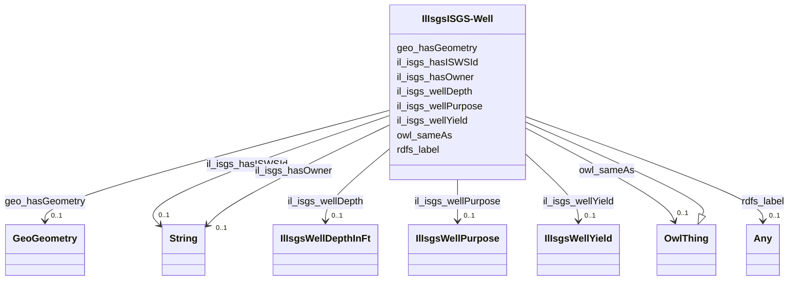

# Class: IlIsgsISGS-Well


This class occurs 379496 times.


URI: [il_isgs:ISGS-Well](http://sawgraph.spatialai.org/v1/il-isgs#ISGS-Well)





## Inheritance
* [OwlThing](../classes/OwlThing.md)
    * **IlIsgsISGS-Well**


## Slots

| Name | Cardinality and Range | Description | Inheritance | Occurrences |
| ---  | --- | --- | --- | --- |
| [il_isgs_wellYield](../slots/il_isgs_wellYield.md) | 0..1 <br/> [IlIsgsWellYield](../classes/IlIsgsWellYield.md) |  <br/>  | direct | 265368 |
| [il_isgs_hasOwner](../slots/il_isgs_hasOwner.md) | 0..1 <br/> [xsd:string](http://www.w3.org/2001/XMLSchema#string) |  <br/>  | direct | 377323 |
| [owl_sameAs](../slots/owl_sameAs.md) | 0..1 <br/> [OwlThing](../classes/OwlThing.md) | The property that determines that two given individuals are equal <br/>  | direct | 379496 |
| [il_isgs_wellDepth](../slots/il_isgs_wellDepth.md) | 0..1 <br/> [IlIsgsWellDepthInFt](../classes/IlIsgsWellDepthInFt.md) |  <br/>  | direct | 376687 |
| [rdfs_label](../slots/rdfs_label.md) | 0..1 <br/> [RdfsLiteral](../classes/RdfsLiteral.md)&nbsp;or&nbsp;<br />[xsd:string](http://www.w3.org/2001/XMLSchema#string) | A human-readable name for the subject <br/>  | direct | 163029 |
| [il_isgs_hasISWSId](../slots/il_isgs_hasISWSId.md) | 0..1 <br/> [xsd:string](http://www.w3.org/2001/XMLSchema#string) |  <br/>  | direct | 152051 |
| [il_isgs_wellPurpose](../slots/il_isgs_wellPurpose.md) | 0..1 <br/> [IlIsgsWellPurpose](../classes/IlIsgsWellPurpose.md) |  <br/>  | direct | 379496 |
| [geo_hasGeometry](../slots/geo_hasGeometry.md) | 0..1 <br/> [GeoGeometry](../classes/GeoGeometry.md) | A spatial representation for a given Feature <br/> source: http://www.opengis.net/spec/geosparql/1.1/req/geometry-extension/feature-properties<br/>source: http://www.opengis.net/ont/geosparql#<br/>source: http://www.opengis.net/spec/geosparql/1.0/req/geometry-extension/feature-properties<br/>description: A spatial representation for a given Feature. | direct | 379496 |


## LinkML Source

<!-- TODO: investigate https://stackoverflow.com/questions/37606292/how-to-create-tabbed-code-blocks-in-mkdocs-or-sphinx -->

### Direct

<details>

```yaml
name: il_isgs_ISGS-Well
from_schema: okns:hydrology-kg
rank: 1000
is_a: owl_Thing
slots:
- il_isgs_wellYield
- il_isgs_hasOwner
- owl_sameAs
- il_isgs_wellDepth
- rdfs_label
- il_isgs_hasISWSId
- il_isgs_wellPurpose
- geo_hasGeometry
class_uri: il_isgs:ISGS-Well

```
</details>

### Induced

<details>

```yaml
name: il_isgs_ISGS-Well
from_schema: okns:hydrology-kg
rank: 1000
is_a: owl_Thing
attributes:
  il_isgs_wellYield:
    name: il_isgs_wellYield
    from_schema: okns:hydrology-kg
    rank: 1000
    slot_uri: il_isgs:wellYield
    alias: il_isgs_wellYield
    owner: il_isgs_ISGS-Well
    domain_of:
    - il_isgs_ISGS-Well
    range: il_isgs_WellYield
  il_isgs_hasOwner:
    name: il_isgs_hasOwner
    from_schema: okns:hydrology-kg
    rank: 1000
    slot_uri: il_isgs:hasOwner
    alias: il_isgs_hasOwner
    owner: il_isgs_ISGS-Well
    domain_of:
    - il_isgs_ISGS-Well
    range: string
  owl_sameAs:
    name: owl_sameAs
    description: The property that determines that two given individuals are equal.
    title: sameAs
    notes:
    - No occurrences of this slot in the graph.
    from_schema: okns:owl-rdf-rdfs
    source: http://www.w3.org/2002/07/owl#
    domain: owl_Thing
    slot_uri: owl:sameAs
    alias: owl_sameAs
    owner: il_isgs_ISGS-Well
    domain_of:
    - __B805a9e7d30eaabcb686b8ce670ed1e95
    - http___gwml2.org_def_gwml2#GW_Aquifer
    - http___gwml2.org_def_gwml2#GW_AquiferSystem
    - http___nhdplusv2.spatialai.org_v1_nhdplusv2#FlowPathLength
    - hyf_HY_ElementaryFlowPath
    - il_isgs_ISGS-Well
    - il_isgs_WellDepthInFt
    - il_isgs_WellPurpose
    - il_isgs_WellYield
    - kwgo_S2Cell_Level13
    - me_mgs_MGS-Well
    - me_mgs_WellDepthInFt
    - me_mgs_WellOverburdenThicknessInFt
    - me_mgs_WellType
    - me_mgs_WellUse
    - owl_DataProperty
    - us_sdwis_PWS-ServiceArea
    - us_sdwis_PWS-ServiceAreaType
    - us_sdwis_PWS-SourceWaterType
    - us_sdwis_PWS-SubFeatureActivity
    - us_sdwis_PWS-SubFeatureType
    - us_sdwis_PublicWaterSystem-CWS
    - us_sdwis_PublicWaterSystem-GW
    - us_sdwis_PublicWaterSystem-NTNCWS
    - us_sdwis_PublicWaterSystem-SW
    - us_sdwis_PublicWaterSystem-TNCWS
    range: owl_Thing
  il_isgs_wellDepth:
    name: il_isgs_wellDepth
    from_schema: okns:hydrology-kg
    rank: 1000
    slot_uri: il_isgs:wellDepth
    alias: il_isgs_wellDepth
    owner: il_isgs_ISGS-Well
    domain_of:
    - il_isgs_ISGS-Well
    range: il_isgs_WellDepthInFt
  rdfs_label:
    name: rdfs_label
    description: A human-readable name for the subject.
    title: label
    from_schema: okns:owl-rdf-rdfs
    source: http://www.w3.org/2000/01/rdf-schema#
    domain: rdfs_Resource
    slot_uri: rdfs:label
    alias: rdfs_label
    owner: il_isgs_ISGS-Well
    domain_of:
    - rdf_List
    - rdfs_Datatype
    - dcam_VocabularyEncodingScheme
    - dct_AgentClass
    - qudt_AspectClass
    - qudt_BinaryPrefix
    - qudt_BitEncodingType
    - qudt_BooleanEncodingType
    - qudt_ByteEncodingType
    - qudt_CardinalityType
    - qudt_CharEncodingType
    - qudt_ContextualUnit
    - qudt_CountingUnit
    - qudt_CurrencyUnit
    - qudt_DateTimeStringEncodingType
    - qudt_DecimalPrefix
    - qudt_DerivedUnit
    - qudt_DimensionlessUnit
    - qudt_EndianType
    - qudt_FloatingPointEncodingType
    - qudt_IntegerEncodingType
    - qudt_LogarithmicUnit
    - qudt_OrderedType
    - qudt_SignednessType
    - qudt_Unit
    - sdos_ActionStatusType
    - sdos_AdultOrientedEnumeration
    - sdos_BoardingPolicyType
    - sdos_BodyMeasurementTypeEnumeration
    - sdos_BookFormatType
    - sdos_Boolean
    - sdos_CarUsageType
    - sdos_CertificationStatusEnumeration
    - sdos_ContactPointOption
    - sdos_DataType
    - sdos_DayOfWeek
    - sdos_DeliveryMethod
    - sdos_DigitalDocumentPermissionType
    - sdos_DigitalPlatformEnumeration
    - sdos_DriveWheelConfigurationValue
    - sdos_DrugCostCategory
    - sdos_DrugPregnancyCategory
    - sdos_DrugPrescriptionStatus
    - sdos_EUEnergyEfficiencyEnumeration
    - sdos_EnergyStarEnergyEfficiencyEnumeration
    - sdos_EventAttendanceModeEnumeration
    - sdos_EventStatusType
    - sdos_FulfillmentTypeEnumeration
    - sdos_GameAvailabilityEnumeration
    - sdos_GamePlayMode
    - sdos_GameServerStatus
    - sdos_GenderType
    - sdos_GovernmentBenefitsType
    - sdos_HealthAspectEnumeration
    - sdos_IPTCDigitalSourceEnumeration
    - sdos_IncentiveQualifiedExpenseType
    - sdos_IncentiveStatus
    - sdos_IncentiveType
    - sdos_InfectiousAgentClass
    - sdos_ItemAvailability
    - sdos_ItemListOrderType
    - sdos_LegalForceStatus
    - sdos_LegalValueLevel
    - sdos_MapCategoryType
    - sdos_MeasurementMethodEnum
    - sdos_MediaManipulationRatingEnumeration
    - sdos_MedicalAudienceType
    - sdos_MedicalDevicePurpose
    - sdos_MedicalEvidenceLevel
    - sdos_MedicalImagingTechnique
    - sdos_MedicalObservationalStudyDesign
    - sdos_MedicalProcedureType
    - sdos_MedicalSpecialty
    - sdos_MedicalStudyStatus
    - sdos_MedicalTrialDesign
    - sdos_MedicineSystem
    - sdos_MerchantReturnEnumeration
    - sdos_MusicAlbumProductionType
    - sdos_MusicAlbumReleaseType
    - sdos_MusicReleaseFormatType
    - sdos_NLNonprofitType
    - sdos_OfferItemCondition
    - sdos_OrderStatus
    - sdos_PaymentMethodType
    - sdos_PaymentStatusType
    - sdos_PhysicalActivityCategory
    - sdos_PhysicalExam
    - sdos_PriceComponentTypeEnumeration
    - sdos_PriceTypeEnumeration
    - sdos_ProductReturnEnumeration
    - sdos_PurchaseType
    - sdos_RefundTypeEnumeration
    - sdos_ReservationStatusType
    - sdos_RestrictedDiet
    - sdos_ReturnFeesEnumeration
    - sdos_ReturnLabelSourceEnumeration
    - sdos_ReturnMethodEnumeration
    - sdos_RsvpResponseType
    - sdos_SizeSystemEnumeration
    - sdos_SteeringPositionValue
    - sdos_TierBenefitEnumeration
    - sdos_UKNonprofitType
    - sdos_USNonprofitType
    - sdos_WearableMeasurementTypeEnumeration
    - sdos_WearableSizeGroupEnumeration
    - sdos_WearableSizeSystemEnumeration
    - vaem_GraphMetaData
    - vaem_GraphRole
    - vaem_Party
    - time_DayOfWeek
    - time_TemporalUnit
    - rdf_DatatypeProperty
    - vaem_CatalogEntry
    - voag_Attribution
    - voag_AttributionLogo
    - voag_ChangeFrequency
    - voag_ChangeType
    - voag_ConfidentialityLevel
    - voag_CreativeCommonsPermission
    - voag_CreativeCommonsProhibition
    - voag_CreativeCommonsRequirement
    - voag_Governance
    - voag_GovernanceRole
    - voag_Icon
    - voag_IssueStatus
    - voag_LicenseModel
    - voag_Logo
    - voag_Maturity
    - voag_OrganizationLogo
    - voag_Pedigree
    - voag_PriorityValue
    - voag_ProductLogo
    - voag_Provenance
    - voag_PublicationStatus
    - voag_SchemaGraph
    - kwgo_AirPollutant
    - kwgo_BlueskyWildfireObservableProperty
    - kwgo_CensusObservableProperty
    - kwgo_ClimateObservableProperty
    - kwgo_CroplandObservableProperty
    - kwgo_DroughtIntensity
    - kwgo_FireCause
    - kwgo_HelipadAvailability
    - kwgo_HospitalStatus
    - kwgo_HospitalType
    - kwgo_ImpactObservableProperty
    - kwgo_LSADArea
    - kwgo_MTBSFireObservableProperty
    - kwgo_MagnitudeObservableProperty
    - kwgo_NIFCFireObservableProperty
    - kwgo_PublicHealthObservableProperty
    - kwgo_RoadType
    - kwgo_SmokePlumeObservableProperty
    - kwgo_SoilMapUnitObservableProperty
    - kwgo_StormTrackObservableProperty
    - kwgo_StormTrackletObservableProperty
    - kwgo_VulnerabilityObservableProperty
    - __B805a9e7d30eaabcb686b8ce670ed1e95
    - http___gwml2.org_def_gwml2#GW_Aquifer
    - http___gwml2.org_def_gwml2#GW_AquiferSystem
    - hyf_HY_ElementaryFlowPath
    - il_isgs_ISGS-Well
    - il_isgs_WellPurpose
    - me_mgs_MGS-Well
    - us_sdwis_PWS-ServiceAreaType
    - us_sdwis_PWS-SubFeatureActivity
    - us_sdwis_PWS-SubFeatureType
    - us_sdwis_PublicWaterSystem-CWS
    - us_sdwis_PublicWaterSystem-GW
    - us_sdwis_PublicWaterSystem-NTNCWS
    - us_sdwis_PublicWaterSystem-SW
    - us_sdwis_PublicWaterSystem-TNCWS
    range: Any
    any_of:
    - range: rdfs_Literal
    - range: string
  il_isgs_hasISWSId:
    name: il_isgs_hasISWSId
    from_schema: okns:hydrology-kg
    rank: 1000
    slot_uri: il_isgs:hasISWSId
    alias: il_isgs_hasISWSId
    owner: il_isgs_ISGS-Well
    domain_of:
    - il_isgs_ISGS-Well
    range: string
  il_isgs_wellPurpose:
    name: il_isgs_wellPurpose
    from_schema: okns:hydrology-kg
    rank: 1000
    slot_uri: il_isgs:wellPurpose
    alias: il_isgs_wellPurpose
    owner: il_isgs_ISGS-Well
    domain_of:
    - il_isgs_ISGS-Well
    range: il_isgs_WellPurpose
  geo_hasGeometry:
    name: geo_hasGeometry
    description: A spatial representation for a given Feature.
    title: No slot (predicate) name specified -- this slot is noted as a subproperty
      of another slot in this graph but has not itself been defined.
    notes:
    - No occurrences of this slot in the graph.
    comments:
    - 'source: http://www.opengis.net/spec/geosparql/1.1/req/geometry-extension/feature-properties'
    - 'source: http://www.opengis.net/ont/geosparql#'
    - 'source: http://www.opengis.net/spec/geosparql/1.0/req/geometry-extension/feature-properties'
    - 'description: A spatial representation for a given Feature.'
    from_schema: okns:geo
    source: http://www.opengis.net/ont/geosparql#
    domain: geo_Feature
    slot_uri: geo:hasGeometry
    alias: geo_hasGeometry
    owner: il_isgs_ISGS-Well
    domain_of:
    - __B805a9e7d30eaabcb686b8ce670ed1e95
    - http___gwml2.org_def_gwml2#GW_Aquifer
    - http___gwml2.org_def_gwml2#GW_AquiferSystem
    - hyf_HY_ElementaryFlowPath
    - il_isgs_ISGS-Well
    - me_mgs_MGS-Well
    - us_sdwis_PWS-ServiceArea
    range: geo_Geometry
class_uri: il_isgs:ISGS-Well

```
</details>