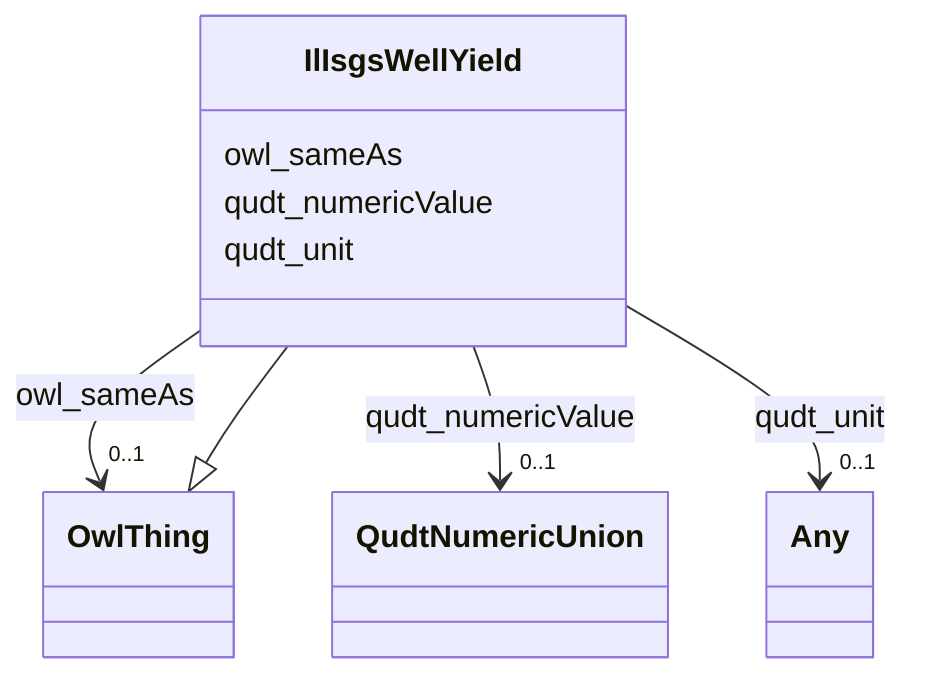

# Class: IlIsgsWellYield


This class occurs 265368 times.


URI: [il_isgs:WellYield](http://sawgraph.spatialai.org/v1/il-isgs#WellYield)





## Inheritance
* [OwlThing](../classes/OwlThing.md)
    * **IlIsgsWellYield**


## Slots

| Name | Cardinality and Range | Description | Inheritance | Occurrences |
| ---  | --- | --- | --- | --- |
| [qudt_unit](../slots/qudt_unit.md) | 0..1 <br/> [Any](../classes/Any.md) |  <br/> No occurrences of this slot in the graph. | direct | 265368 |
| [qudt_numericValue](../slots/qudt_numericValue.md) | 0..1 <br/> [QudtNumericUnion](../types/QudtNumericUnion.md) |  <br/> No occurrences of this slot in the graph. | direct | 265368 |
| [owl_sameAs](../slots/owl_sameAs.md) | 0..1 <br/> [OwlThing](../classes/OwlThing.md) | The property that determines that two given individuals are equal <br/> No occurrences of this slot in the graph. | direct | 265368 |


## Usages

| used by | used in | type | used |
| ---  | --- | --- | --- |
| [IlIsgsISGS-Well](../classes/IlIsgsISGS-Well.md) | [il_isgs_wellYield](../slots/il_isgs_wellYield.md) | range | [IlIsgsWellYield](../classes/IlIsgsWellYield.md) |


## LinkML Source

<!-- TODO: investigate https://stackoverflow.com/questions/37606292/how-to-create-tabbed-code-blocks-in-mkdocs-or-sphinx -->

### Direct

<details>

```yaml
name: il_isgs_WellYield
from_schema: okns:hydrology-kg
exact_mappings:
- http://sawgraph.spatialai.org/v1/il-isgs#WellYield
rank: 1000
is_a: owl_Thing
slots:
- qudt_unit
- qudt_numericValue
- owl_sameAs
class_uri: il_isgs:WellYield

```
</details>

### Induced

<details>

```yaml
name: il_isgs_WellYield
from_schema: okns:hydrology-kg
exact_mappings:
- http://sawgraph.spatialai.org/v1/il-isgs#WellYield
rank: 1000
is_a: owl_Thing
attributes:
  qudt_unit:
    name: qudt_unit
    comments:
    - No occurrences of this slot in the graph.
    from_schema: okns:kwg
    slot_uri: qudt:unit
    alias: qudt_unit
    owner: il_isgs_WellYield
    domain_of:
    - il_isgs_WellYield
    range: Any
  qudt_numericValue:
    name: qudt_numericValue
    title: numeric value
    comments:
    - No occurrences of this slot in the graph.
    from_schema: okns:qudt
    source: http://qudt.org/schema/qudt
    slot_uri: qudt:numericValue
    alias: qudt_numericValue
    owner: il_isgs_WellYield
    domain_of:
    - il_isgs_WellDepthInFt
    - il_isgs_WellYield
    - me_mgs_WellDepthInFt
    - me_mgs_WellOverburdenThicknessInFt
    range: qudt_NumericUnion
  owl_sameAs:
    name: owl_sameAs
    description: The property that determines that two given individuals are equal.
    title: sameAs
    comments:
    - No occurrences of this slot in the graph.
    from_schema: okns:owl-rdf-rdfs
    source: http://www.w3.org/2002/07/owl#
    domain: owl_Thing
    slot_uri: owl:sameAs
    alias: owl_sameAs
    owner: il_isgs_WellYield
    domain_of:
    - http___gwml2.org_def_gwml2#GW_Aquifer
    - http___gwml2.org_def_gwml2#GW_AquiferSystem
    - http___nhdplusv2.spatialai.org_v1_nhdplusv2#FlowPathLength
    - hyf__HY_ElementaryFlowPath
    - hyf__HY_Lake
    - hyf__HY_WaterBody
    - il_isgs_ISGS-Well
    - il_isgs_WellDepthInFt
    - il_isgs_WellPurpose
    - il_isgs_WellYield
    - kwgo_S2Cell_Level13
    - me_mgs_MGS-Well
    - me_mgs_WellDepthInFt
    - me_mgs_WellOverburdenThicknessInFt
    - me_mgs_WellType
    - me_mgs_WellUse
    - owl_DataProperty
    - sf_#MultiPolygon
    - sf_#Polygon
    - us_sdwis_PWS-ServiceArea
    - us_sdwis_PWS-ServiceAreaType
    - us_sdwis_PWS-SourceWaterType
    - us_sdwis_PWS-SubFeatureActivity
    - us_sdwis_PWS-SubFeatureType
    - us_sdwis_PublicWaterSystem-CWS
    - us_sdwis_PublicWaterSystem-GW
    - us_sdwis_PublicWaterSystem-NTNCWS
    - us_sdwis_PublicWaterSystem-SW
    - us_sdwis_PublicWaterSystem-TNCWS
    range: owl_Thing
class_uri: il_isgs:WellYield

```
</details>