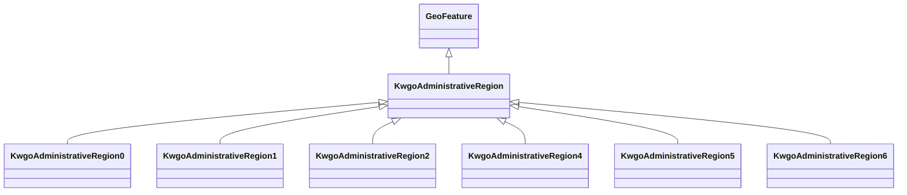

# Class: Administrative Region (kwgo_AdministrativeRegion)


_Source - Global Administrative area database (GADM) (https://gadm.org/data.html)_


This class occurs 35458 times.


URI: [kwgo:AdministrativeRegion](http://stko-kwg.geog.ucsb.edu/lod/ontology/AdministrativeRegion)





## Inheritance
* [GeoSpatialObject](../classes/GeoSpatialObject.md)
    * [GeoFeature](../classes/GeoFeature.md)
        * **KwgoAdministrativeRegion**
            * [KwgoAdministrativeRegion0](../classes/KwgoAdministrativeRegion0.md)
            * [KwgoAdministrativeRegion1](../classes/KwgoAdministrativeRegion1.md)
            * [KwgoAdministrativeRegion2](../classes/KwgoAdministrativeRegion2.md)
            * [KwgoAdministrativeRegion4](../classes/KwgoAdministrativeRegion4.md)
            * [KwgoAdministrativeRegion5](../classes/KwgoAdministrativeRegion5.md)
            * [KwgoAdministrativeRegion6](../classes/KwgoAdministrativeRegion6.md)


## Slots

| Name | Cardinality and Range | Description | Inheritance | Occurrences |
| ---  | --- | --- | --- | --- |


## Usages

| used by | used in | type | used |
| ---  | --- | --- | --- |
| [B805a9e7d30eaabcb686b8ce670ed1e95](../classes/B805a9e7d30eaabcb686b8ce670ed1e95.md) | [spatial_spatiallyRelatedTo](../slots/spatial_spatiallyRelatedTo.md) | any_of[range] | [KwgoAdministrativeRegion](../classes/KwgoAdministrativeRegion.md) |
| [B805a9e7d30eaabcb686b8ce670ed1e95](../classes/B805a9e7d30eaabcb686b8ce670ed1e95.md) | [spatial_connectedTo](../slots/spatial_connectedTo.md) | any_of[range] | [KwgoAdministrativeRegion](../classes/KwgoAdministrativeRegion.md) |
| [HttpGwml2.orgDefGwml2#GWAquifer](../classes/HttpGwml2.orgDefGwml2#GWAquifer.md) | [spatial_spatiallyRelatedTo](../slots/spatial_spatiallyRelatedTo.md) | any_of[range] | [KwgoAdministrativeRegion](../classes/KwgoAdministrativeRegion.md) |
| [HttpGwml2.orgDefGwml2#GWAquifer](../classes/HttpGwml2.orgDefGwml2#GWAquifer.md) | [spatial_connectedTo](../slots/spatial_connectedTo.md) | any_of[range] | [KwgoAdministrativeRegion](../classes/KwgoAdministrativeRegion.md) |
| [HttpGwml2.orgDefGwml2#GWAquiferSystem](../classes/HttpGwml2.orgDefGwml2#GWAquiferSystem.md) | [spatial_spatiallyRelatedTo](../slots/spatial_spatiallyRelatedTo.md) | any_of[range] | [KwgoAdministrativeRegion](../classes/KwgoAdministrativeRegion.md) |
| [HttpGwml2.orgDefGwml2#GWAquiferSystem](../classes/HttpGwml2.orgDefGwml2#GWAquiferSystem.md) | [spatial_connectedTo](../slots/spatial_connectedTo.md) | any_of[range] | [KwgoAdministrativeRegion](../classes/KwgoAdministrativeRegion.md) |
| [HyfHYElementaryFlowPath](../classes/HyfHYElementaryFlowPath.md) | [spatial_spatiallyRelatedTo](../slots/spatial_spatiallyRelatedTo.md) | any_of[range] | [KwgoAdministrativeRegion](../classes/KwgoAdministrativeRegion.md) |
| [HyfHYElementaryFlowPath](../classes/HyfHYElementaryFlowPath.md) | [spatial_connectedTo](../slots/spatial_connectedTo.md) | any_of[range] | [KwgoAdministrativeRegion](../classes/KwgoAdministrativeRegion.md) |
| [KwgoS2CellLevel13](../classes/KwgoS2CellLevel13.md) | [spatial_spatiallyRelatedTo](../slots/spatial_spatiallyRelatedTo.md) | any_of[range] | [KwgoAdministrativeRegion](../classes/KwgoAdministrativeRegion.md) |
| [KwgoS2CellLevel13](../classes/KwgoS2CellLevel13.md) | [spatial_connectedTo](../slots/spatial_connectedTo.md) | any_of[range] | [KwgoAdministrativeRegion](../classes/KwgoAdministrativeRegion.md) |
| [MeMgsMGS-Well](../classes/MeMgsMGS-Well.md) | [spatial_spatiallyRelatedTo](../slots/spatial_spatiallyRelatedTo.md) | any_of[range] | [KwgoAdministrativeRegion](../classes/KwgoAdministrativeRegion.md) |
| [MeMgsMGS-Well](../classes/MeMgsMGS-Well.md) | [spatial_connectedTo](../slots/spatial_connectedTo.md) | any_of[range] | [KwgoAdministrativeRegion](../classes/KwgoAdministrativeRegion.md) |
| [UsSdwisPWS-ServiceArea](../classes/UsSdwisPWS-ServiceArea.md) | [spatial_spatiallyRelatedTo](../slots/spatial_spatiallyRelatedTo.md) | any_of[range] | [KwgoAdministrativeRegion](../classes/KwgoAdministrativeRegion.md) |
| [UsSdwisPWS-ServiceArea](../classes/UsSdwisPWS-ServiceArea.md) | [spatial_connectedTo](../slots/spatial_connectedTo.md) | any_of[range] | [KwgoAdministrativeRegion](../classes/KwgoAdministrativeRegion.md) |
| [UsSdwisPublicWaterSystem-CWS](../classes/UsSdwisPublicWaterSystem-CWS.md) | [spatial_spatiallyRelatedTo](../slots/spatial_spatiallyRelatedTo.md) | any_of[range] | [KwgoAdministrativeRegion](../classes/KwgoAdministrativeRegion.md) |
| [UsSdwisPublicWaterSystem-CWS](../classes/UsSdwisPublicWaterSystem-CWS.md) | [spatial_connectedTo](../slots/spatial_connectedTo.md) | any_of[range] | [KwgoAdministrativeRegion](../classes/KwgoAdministrativeRegion.md) |
| [UsSdwisPublicWaterSystem-GW](../classes/UsSdwisPublicWaterSystem-GW.md) | [spatial_spatiallyRelatedTo](../slots/spatial_spatiallyRelatedTo.md) | any_of[range] | [KwgoAdministrativeRegion](../classes/KwgoAdministrativeRegion.md) |
| [UsSdwisPublicWaterSystem-GW](../classes/UsSdwisPublicWaterSystem-GW.md) | [spatial_connectedTo](../slots/spatial_connectedTo.md) | any_of[range] | [KwgoAdministrativeRegion](../classes/KwgoAdministrativeRegion.md) |
| [UsSdwisPublicWaterSystem-NTNCWS](../classes/UsSdwisPublicWaterSystem-NTNCWS.md) | [spatial_spatiallyRelatedTo](../slots/spatial_spatiallyRelatedTo.md) | any_of[range] | [KwgoAdministrativeRegion](../classes/KwgoAdministrativeRegion.md) |
| [UsSdwisPublicWaterSystem-NTNCWS](../classes/UsSdwisPublicWaterSystem-NTNCWS.md) | [spatial_connectedTo](../slots/spatial_connectedTo.md) | any_of[range] | [KwgoAdministrativeRegion](../classes/KwgoAdministrativeRegion.md) |
| [UsSdwisPublicWaterSystem-SW](../classes/UsSdwisPublicWaterSystem-SW.md) | [spatial_spatiallyRelatedTo](../slots/spatial_spatiallyRelatedTo.md) | any_of[range] | [KwgoAdministrativeRegion](../classes/KwgoAdministrativeRegion.md) |
| [UsSdwisPublicWaterSystem-SW](../classes/UsSdwisPublicWaterSystem-SW.md) | [spatial_connectedTo](../slots/spatial_connectedTo.md) | any_of[range] | [KwgoAdministrativeRegion](../classes/KwgoAdministrativeRegion.md) |
| [UsSdwisPublicWaterSystem-TNCWS](../classes/UsSdwisPublicWaterSystem-TNCWS.md) | [spatial_spatiallyRelatedTo](../slots/spatial_spatiallyRelatedTo.md) | any_of[range] | [KwgoAdministrativeRegion](../classes/KwgoAdministrativeRegion.md) |
| [UsSdwisPublicWaterSystem-TNCWS](../classes/UsSdwisPublicWaterSystem-TNCWS.md) | [spatial_connectedTo](../slots/spatial_connectedTo.md) | any_of[range] | [KwgoAdministrativeRegion](../classes/KwgoAdministrativeRegion.md) |


## LinkML Source

<!-- TODO: investigate https://stackoverflow.com/questions/37606292/how-to-create-tabbed-code-blocks-in-mkdocs-or-sphinx -->

### Direct

<details>

```yaml
name: kwgo_AdministrativeRegion
description: Source - Global Administrative area database (GADM) (https://gadm.org/data.html)
title: Administrative Region
from_schema: okns:kwg
is_a: geo_Feature
class_uri: kwgo:AdministrativeRegion

```
</details>

### Induced

<details>

```yaml
name: kwgo_AdministrativeRegion
description: Source - Global Administrative area database (GADM) (https://gadm.org/data.html)
title: Administrative Region
from_schema: okns:kwg
is_a: geo_Feature
class_uri: kwgo:AdministrativeRegion

```
</details>