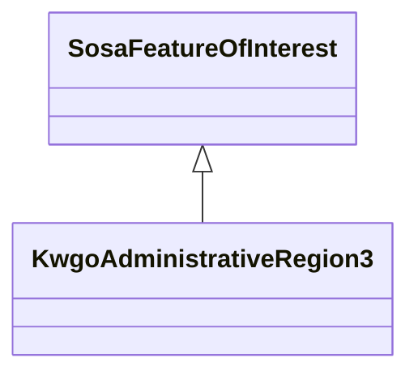

# Class: Administrative Region Level 3 (kwgo_AdministrativeRegion_3)


_Administrative Region Level 3 - county/district/equivalent level_


This class occurs 35458 times.


URI: [kwgo:AdministrativeRegion_3](http://stko-kwg.geog.ucsb.edu/lod/ontology/AdministrativeRegion_3)





## Inheritance
* [SosaFeatureOfInterest](../classes/SosaFeatureOfInterest.md)
    * **KwgoAdministrativeRegion3**


## Slots

| Name | Cardinality and Range | Description | Inheritance | Occurrences |
| ---  | --- | --- | --- | --- |


## Usages

| used by | used in | type | used |
| ---  | --- | --- | --- |
| [B805a9e7d30eaabcb686b8ce670ed1e95](../classes/B805a9e7d30eaabcb686b8ce670ed1e95.md) | [spatial_spatiallyRelatedTo](../slots/spatial_spatiallyRelatedTo.md) | any_of[range] | [KwgoAdministrativeRegion3](../classes/KwgoAdministrativeRegion3.md) |
| [B805a9e7d30eaabcb686b8ce670ed1e95](../classes/B805a9e7d30eaabcb686b8ce670ed1e95.md) | [spatial_connectedTo](../slots/spatial_connectedTo.md) | any_of[range] | [KwgoAdministrativeRegion3](../classes/KwgoAdministrativeRegion3.md) |
| [HttpGwml2.orgDefGwml2#GWAquifer](../classes/HttpGwml2.orgDefGwml2#GWAquifer.md) | [spatial_spatiallyRelatedTo](../slots/spatial_spatiallyRelatedTo.md) | any_of[range] | [KwgoAdministrativeRegion3](../classes/KwgoAdministrativeRegion3.md) |
| [HttpGwml2.orgDefGwml2#GWAquifer](../classes/HttpGwml2.orgDefGwml2#GWAquifer.md) | [spatial_connectedTo](../slots/spatial_connectedTo.md) | any_of[range] | [KwgoAdministrativeRegion3](../classes/KwgoAdministrativeRegion3.md) |
| [HttpGwml2.orgDefGwml2#GWAquiferSystem](../classes/HttpGwml2.orgDefGwml2#GWAquiferSystem.md) | [spatial_spatiallyRelatedTo](../slots/spatial_spatiallyRelatedTo.md) | any_of[range] | [KwgoAdministrativeRegion3](../classes/KwgoAdministrativeRegion3.md) |
| [HttpGwml2.orgDefGwml2#GWAquiferSystem](../classes/HttpGwml2.orgDefGwml2#GWAquiferSystem.md) | [spatial_connectedTo](../slots/spatial_connectedTo.md) | any_of[range] | [KwgoAdministrativeRegion3](../classes/KwgoAdministrativeRegion3.md) |
| [HyfHYElementaryFlowPath](../classes/HyfHYElementaryFlowPath.md) | [spatial_spatiallyRelatedTo](../slots/spatial_spatiallyRelatedTo.md) | any_of[range] | [KwgoAdministrativeRegion3](../classes/KwgoAdministrativeRegion3.md) |
| [HyfHYElementaryFlowPath](../classes/HyfHYElementaryFlowPath.md) | [spatial_connectedTo](../slots/spatial_connectedTo.md) | any_of[range] | [KwgoAdministrativeRegion3](../classes/KwgoAdministrativeRegion3.md) |
| [KwgoS2CellLevel13](../classes/KwgoS2CellLevel13.md) | [spatial_spatiallyRelatedTo](../slots/spatial_spatiallyRelatedTo.md) | any_of[range] | [KwgoAdministrativeRegion3](../classes/KwgoAdministrativeRegion3.md) |
| [KwgoS2CellLevel13](../classes/KwgoS2CellLevel13.md) | [spatial_connectedTo](../slots/spatial_connectedTo.md) | any_of[range] | [KwgoAdministrativeRegion3](../classes/KwgoAdministrativeRegion3.md) |
| [MeMgsMGS-Well](../classes/MeMgsMGS-Well.md) | [spatial_spatiallyRelatedTo](../slots/spatial_spatiallyRelatedTo.md) | any_of[range] | [KwgoAdministrativeRegion3](../classes/KwgoAdministrativeRegion3.md) |
| [MeMgsMGS-Well](../classes/MeMgsMGS-Well.md) | [spatial_connectedTo](../slots/spatial_connectedTo.md) | any_of[range] | [KwgoAdministrativeRegion3](../classes/KwgoAdministrativeRegion3.md) |
| [UsSdwisPWS-ServiceArea](../classes/UsSdwisPWS-ServiceArea.md) | [spatial_spatiallyRelatedTo](../slots/spatial_spatiallyRelatedTo.md) | any_of[range] | [KwgoAdministrativeRegion3](../classes/KwgoAdministrativeRegion3.md) |
| [UsSdwisPWS-ServiceArea](../classes/UsSdwisPWS-ServiceArea.md) | [spatial_connectedTo](../slots/spatial_connectedTo.md) | any_of[range] | [KwgoAdministrativeRegion3](../classes/KwgoAdministrativeRegion3.md) |
| [UsSdwisPublicWaterSystem-CWS](../classes/UsSdwisPublicWaterSystem-CWS.md) | [spatial_spatiallyRelatedTo](../slots/spatial_spatiallyRelatedTo.md) | any_of[range] | [KwgoAdministrativeRegion3](../classes/KwgoAdministrativeRegion3.md) |
| [UsSdwisPublicWaterSystem-CWS](../classes/UsSdwisPublicWaterSystem-CWS.md) | [spatial_connectedTo](../slots/spatial_connectedTo.md) | any_of[range] | [KwgoAdministrativeRegion3](../classes/KwgoAdministrativeRegion3.md) |
| [UsSdwisPublicWaterSystem-GW](../classes/UsSdwisPublicWaterSystem-GW.md) | [spatial_spatiallyRelatedTo](../slots/spatial_spatiallyRelatedTo.md) | any_of[range] | [KwgoAdministrativeRegion3](../classes/KwgoAdministrativeRegion3.md) |
| [UsSdwisPublicWaterSystem-GW](../classes/UsSdwisPublicWaterSystem-GW.md) | [spatial_connectedTo](../slots/spatial_connectedTo.md) | any_of[range] | [KwgoAdministrativeRegion3](../classes/KwgoAdministrativeRegion3.md) |
| [UsSdwisPublicWaterSystem-NTNCWS](../classes/UsSdwisPublicWaterSystem-NTNCWS.md) | [spatial_spatiallyRelatedTo](../slots/spatial_spatiallyRelatedTo.md) | any_of[range] | [KwgoAdministrativeRegion3](../classes/KwgoAdministrativeRegion3.md) |
| [UsSdwisPublicWaterSystem-NTNCWS](../classes/UsSdwisPublicWaterSystem-NTNCWS.md) | [spatial_connectedTo](../slots/spatial_connectedTo.md) | any_of[range] | [KwgoAdministrativeRegion3](../classes/KwgoAdministrativeRegion3.md) |
| [UsSdwisPublicWaterSystem-SW](../classes/UsSdwisPublicWaterSystem-SW.md) | [spatial_spatiallyRelatedTo](../slots/spatial_spatiallyRelatedTo.md) | any_of[range] | [KwgoAdministrativeRegion3](../classes/KwgoAdministrativeRegion3.md) |
| [UsSdwisPublicWaterSystem-SW](../classes/UsSdwisPublicWaterSystem-SW.md) | [spatial_connectedTo](../slots/spatial_connectedTo.md) | any_of[range] | [KwgoAdministrativeRegion3](../classes/KwgoAdministrativeRegion3.md) |
| [UsSdwisPublicWaterSystem-TNCWS](../classes/UsSdwisPublicWaterSystem-TNCWS.md) | [spatial_spatiallyRelatedTo](../slots/spatial_spatiallyRelatedTo.md) | any_of[range] | [KwgoAdministrativeRegion3](../classes/KwgoAdministrativeRegion3.md) |
| [UsSdwisPublicWaterSystem-TNCWS](../classes/UsSdwisPublicWaterSystem-TNCWS.md) | [spatial_connectedTo](../slots/spatial_connectedTo.md) | any_of[range] | [KwgoAdministrativeRegion3](../classes/KwgoAdministrativeRegion3.md) |


## Comments

* description: Source - Global Administrative area database (GADM) (https://gadm.org/data.html)


## LinkML Source

<!-- TODO: investigate https://stackoverflow.com/questions/37606292/how-to-create-tabbed-code-blocks-in-mkdocs-or-sphinx -->

### Direct

<details>

```yaml
name: kwgo_AdministrativeRegion_3
description: Administrative Region Level 3 - county/district/equivalent level
title: Administrative Region Level 3
comments:
- 'description: Source - Global Administrative area database (GADM) (https://gadm.org/data.html)'
from_schema: okns:kwg
is_a: sosa_FeatureOfInterest
class_uri: kwgo:AdministrativeRegion_3

```
</details>

### Induced

<details>

```yaml
name: kwgo_AdministrativeRegion_3
description: Administrative Region Level 3 - county/district/equivalent level
title: Administrative Region Level 3
comments:
- 'description: Source - Global Administrative area database (GADM) (https://gadm.org/data.html)'
from_schema: okns:kwg
is_a: sosa_FeatureOfInterest
class_uri: kwgo:AdministrativeRegion_3

```
</details>