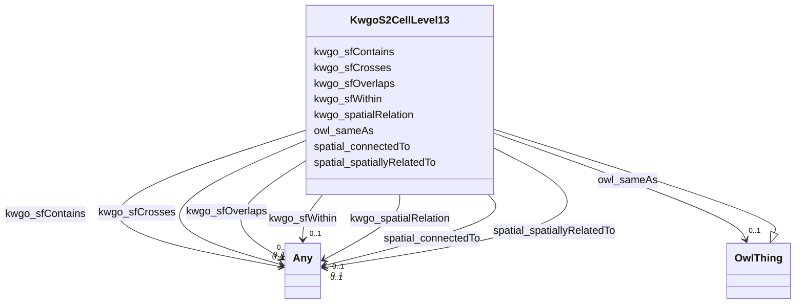

# Class: KwgoS2CellLevel13


This class occurs 7404184 times.


URI: [kwgo:S2Cell_Level13](http://stko-kwg.geog.ucsb.edu/lod/ontology/S2Cell_Level13)





## Inheritance
* [OwlThing](../classes/OwlThing.md)
    * **KwgoS2CellLevel13**


## Slots

| Name | Cardinality and Range | Description | Inheritance | Occurrences |
| ---  | --- | --- | --- | --- |
| [kwgo_spatialRelation](../slots/kwgo_spatialRelation.md) | 0..1 <br/> [Any](../classes/Any.md) | KWG's general spatial relation <br/>  | direct | 5258814 |
| [owl_sameAs](../slots/owl_sameAs.md) | 0..1 <br/> [OwlThing](../classes/OwlThing.md) | The property that determines that two given individuals are equal <br/>  | direct | 7404184 |
| [kwgo_sfCrosses](../slots/kwgo_sfCrosses.md) | 0..1 <br/> [Any](../classes/Any.md) | KWG's spatial comment relation <br/>  | direct | 2783806 |
| [kwgo_sfContains](../slots/kwgo_sfContains.md) | 0..1 <br/> [Any](../classes/Any.md) | KWG's spatial contains relation <br/>  | direct | 83050 |
| [spatial_spatiallyRelatedTo](../slots/spatial_spatiallyRelatedTo.md) | 0..1 <br/> [UsSdwisPublicWaterSystem-GW](../classes/UsSdwisPublicWaterSystem-GW.md)&nbsp;or&nbsp;<br />[HttpGwml2.orgDefGwml2#GWAquiferSystem](../classes/HttpGwml2.orgDefGwml2#GWAquiferSystem.md)&nbsp;or&nbsp;<br />[UsSdwisPublicWaterSystem-SW](../classes/UsSdwisPublicWaterSystem-SW.md)&nbsp;or&nbsp;<br />[UsSdwisPWS-ServiceArea](../classes/UsSdwisPWS-ServiceArea.md)&nbsp;or&nbsp;<br />[HttpGwml2.orgDefGwml2#GWAquifer](../classes/HttpGwml2.orgDefGwml2#GWAquifer.md)&nbsp;or&nbsp;<br />[OwlThing](../classes/OwlThing.md)&nbsp;or&nbsp;<br />[HyfHYWaterBody](../classes/HyfHYWaterBody.md)&nbsp;or&nbsp;<br />[UsSdwisPublicWaterSystem-NTNCWS](../classes/UsSdwisPublicWaterSystem-NTNCWS.md)&nbsp;or&nbsp;<br />[MeMgsMGS-Well](../classes/MeMgsMGS-Well.md)&nbsp;or&nbsp;<br />[KwgoS2CellLevel13](../classes/KwgoS2CellLevel13.md)&nbsp;or&nbsp;<br />[B805a9e7d30eaabcb686b8ce670ed1e95](../classes/B805a9e7d30eaabcb686b8ce670ed1e95.md)&nbsp;or&nbsp;<br />[HyfHYHydroFeature](../classes/HyfHYHydroFeature.md)&nbsp;or&nbsp;<br />[KwgoAdministrativeRegion3](../classes/KwgoAdministrativeRegion3.md)&nbsp;or&nbsp;<br />[UsSdwisPublicWaterSystem-CWS](../classes/UsSdwisPublicWaterSystem-CWS.md)&nbsp;or&nbsp;<br />[GeoFeature](../classes/GeoFeature.md)&nbsp;or&nbsp;<br />[HyfHYLake](../classes/HyfHYLake.md)&nbsp;or&nbsp;<br />[GeoSpatialObject](../classes/GeoSpatialObject.md)&nbsp;or&nbsp;<br />[HyfHYElementaryFlowPath](../classes/HyfHYElementaryFlowPath.md)&nbsp;or&nbsp;<br />[KwgoAdministrativeRegion2](../classes/KwgoAdministrativeRegion2.md)&nbsp;or&nbsp;<br />[UsSdwisPublicWaterSystem-TNCWS](../classes/UsSdwisPublicWaterSystem-TNCWS.md)&nbsp;or&nbsp;<br />[KwgoRegion](../classes/KwgoRegion.md)&nbsp;or&nbsp;<br />[KwgoAdministrativeRegion](../classes/KwgoAdministrativeRegion.md) |  <br/>  | direct | 5258814 |
| [spatial_connectedTo](../slots/spatial_connectedTo.md) | 0..1 <br/> [UsSdwisPublicWaterSystem-GW](../classes/UsSdwisPublicWaterSystem-GW.md)&nbsp;or&nbsp;<br />[HttpGwml2.orgDefGwml2#GWAquiferSystem](../classes/HttpGwml2.orgDefGwml2#GWAquiferSystem.md)&nbsp;or&nbsp;<br />[UsSdwisPublicWaterSystem-SW](../classes/UsSdwisPublicWaterSystem-SW.md)&nbsp;or&nbsp;<br />[UsSdwisPWS-ServiceArea](../classes/UsSdwisPWS-ServiceArea.md)&nbsp;or&nbsp;<br />[HttpGwml2.orgDefGwml2#GWAquifer](../classes/HttpGwml2.orgDefGwml2#GWAquifer.md)&nbsp;or&nbsp;<br />[OwlThing](../classes/OwlThing.md)&nbsp;or&nbsp;<br />[HyfHYWaterBody](../classes/HyfHYWaterBody.md)&nbsp;or&nbsp;<br />[UsSdwisPublicWaterSystem-NTNCWS](../classes/UsSdwisPublicWaterSystem-NTNCWS.md)&nbsp;or&nbsp;<br />[MeMgsMGS-Well](../classes/MeMgsMGS-Well.md)&nbsp;or&nbsp;<br />[KwgoS2CellLevel13](../classes/KwgoS2CellLevel13.md)&nbsp;or&nbsp;<br />[B805a9e7d30eaabcb686b8ce670ed1e95](../classes/B805a9e7d30eaabcb686b8ce670ed1e95.md)&nbsp;or&nbsp;<br />[HyfHYHydroFeature](../classes/HyfHYHydroFeature.md)&nbsp;or&nbsp;<br />[KwgoAdministrativeRegion3](../classes/KwgoAdministrativeRegion3.md)&nbsp;or&nbsp;<br />[UsSdwisPublicWaterSystem-CWS](../classes/UsSdwisPublicWaterSystem-CWS.md)&nbsp;or&nbsp;<br />[GeoFeature](../classes/GeoFeature.md)&nbsp;or&nbsp;<br />[HyfHYLake](../classes/HyfHYLake.md)&nbsp;or&nbsp;<br />[GeoSpatialObject](../classes/GeoSpatialObject.md)&nbsp;or&nbsp;<br />[HyfHYElementaryFlowPath](../classes/HyfHYElementaryFlowPath.md)&nbsp;or&nbsp;<br />[KwgoAdministrativeRegion2](../classes/KwgoAdministrativeRegion2.md)&nbsp;or&nbsp;<br />[UsSdwisPublicWaterSystem-TNCWS](../classes/UsSdwisPublicWaterSystem-TNCWS.md)&nbsp;or&nbsp;<br />[KwgoRegion](../classes/KwgoRegion.md)&nbsp;or&nbsp;<br />[KwgoAdministrativeRegion](../classes/KwgoAdministrativeRegion.md) |  <br/>  | direct | 5258814 |
| [kwgo_sfWithin](../slots/kwgo_sfWithin.md) | 0..1 <br/> [Any](../classes/Any.md) | KWG's spatial within relation <br/>  | direct | 561616 |
| [kwgo_sfOverlaps](../slots/kwgo_sfOverlaps.md) | 0..1 <br/> [Any](../classes/Any.md) | KWG's spatial overlap relation <br/>  | direct | 1833429 |


## Usages

| used by | used in | type | used |
| ---  | --- | --- | --- |
| [B805a9e7d30eaabcb686b8ce670ed1e95](../classes/B805a9e7d30eaabcb686b8ce670ed1e95.md) | [spatial_spatiallyRelatedTo](../slots/spatial_spatiallyRelatedTo.md) | any_of[range] | [KwgoS2CellLevel13](../classes/KwgoS2CellLevel13.md) |
| [B805a9e7d30eaabcb686b8ce670ed1e95](../classes/B805a9e7d30eaabcb686b8ce670ed1e95.md) | [spatial_connectedTo](../slots/spatial_connectedTo.md) | any_of[range] | [KwgoS2CellLevel13](../classes/KwgoS2CellLevel13.md) |
| [HttpGwml2.orgDefGwml2#GWAquifer](../classes/HttpGwml2.orgDefGwml2#GWAquifer.md) | [spatial_spatiallyRelatedTo](../slots/spatial_spatiallyRelatedTo.md) | any_of[range] | [KwgoS2CellLevel13](../classes/KwgoS2CellLevel13.md) |
| [HttpGwml2.orgDefGwml2#GWAquifer](../classes/HttpGwml2.orgDefGwml2#GWAquifer.md) | [spatial_connectedTo](../slots/spatial_connectedTo.md) | any_of[range] | [KwgoS2CellLevel13](../classes/KwgoS2CellLevel13.md) |
| [HttpGwml2.orgDefGwml2#GWAquiferSystem](../classes/HttpGwml2.orgDefGwml2#GWAquiferSystem.md) | [spatial_spatiallyRelatedTo](../slots/spatial_spatiallyRelatedTo.md) | any_of[range] | [KwgoS2CellLevel13](../classes/KwgoS2CellLevel13.md) |
| [HttpGwml2.orgDefGwml2#GWAquiferSystem](../classes/HttpGwml2.orgDefGwml2#GWAquiferSystem.md) | [spatial_connectedTo](../slots/spatial_connectedTo.md) | any_of[range] | [KwgoS2CellLevel13](../classes/KwgoS2CellLevel13.md) |
| [HyfHYElementaryFlowPath](../classes/HyfHYElementaryFlowPath.md) | [spatial_spatiallyRelatedTo](../slots/spatial_spatiallyRelatedTo.md) | any_of[range] | [KwgoS2CellLevel13](../classes/KwgoS2CellLevel13.md) |
| [HyfHYElementaryFlowPath](../classes/HyfHYElementaryFlowPath.md) | [spatial_connectedTo](../slots/spatial_connectedTo.md) | any_of[range] | [KwgoS2CellLevel13](../classes/KwgoS2CellLevel13.md) |
| [KwgoS2CellLevel13](../classes/KwgoS2CellLevel13.md) | [spatial_spatiallyRelatedTo](../slots/spatial_spatiallyRelatedTo.md) | any_of[range] | [KwgoS2CellLevel13](../classes/KwgoS2CellLevel13.md) |
| [KwgoS2CellLevel13](../classes/KwgoS2CellLevel13.md) | [spatial_connectedTo](../slots/spatial_connectedTo.md) | any_of[range] | [KwgoS2CellLevel13](../classes/KwgoS2CellLevel13.md) |
| [MeMgsMGS-Well](../classes/MeMgsMGS-Well.md) | [spatial_spatiallyRelatedTo](../slots/spatial_spatiallyRelatedTo.md) | any_of[range] | [KwgoS2CellLevel13](../classes/KwgoS2CellLevel13.md) |
| [MeMgsMGS-Well](../classes/MeMgsMGS-Well.md) | [spatial_connectedTo](../slots/spatial_connectedTo.md) | any_of[range] | [KwgoS2CellLevel13](../classes/KwgoS2CellLevel13.md) |
| [UsSdwisPWS-ServiceArea](../classes/UsSdwisPWS-ServiceArea.md) | [spatial_spatiallyRelatedTo](../slots/spatial_spatiallyRelatedTo.md) | any_of[range] | [KwgoS2CellLevel13](../classes/KwgoS2CellLevel13.md) |
| [UsSdwisPWS-ServiceArea](../classes/UsSdwisPWS-ServiceArea.md) | [spatial_connectedTo](../slots/spatial_connectedTo.md) | any_of[range] | [KwgoS2CellLevel13](../classes/KwgoS2CellLevel13.md) |
| [UsSdwisPublicWaterSystem-CWS](../classes/UsSdwisPublicWaterSystem-CWS.md) | [spatial_spatiallyRelatedTo](../slots/spatial_spatiallyRelatedTo.md) | any_of[range] | [KwgoS2CellLevel13](../classes/KwgoS2CellLevel13.md) |
| [UsSdwisPublicWaterSystem-CWS](../classes/UsSdwisPublicWaterSystem-CWS.md) | [spatial_connectedTo](../slots/spatial_connectedTo.md) | any_of[range] | [KwgoS2CellLevel13](../classes/KwgoS2CellLevel13.md) |
| [UsSdwisPublicWaterSystem-GW](../classes/UsSdwisPublicWaterSystem-GW.md) | [spatial_spatiallyRelatedTo](../slots/spatial_spatiallyRelatedTo.md) | any_of[range] | [KwgoS2CellLevel13](../classes/KwgoS2CellLevel13.md) |
| [UsSdwisPublicWaterSystem-GW](../classes/UsSdwisPublicWaterSystem-GW.md) | [spatial_connectedTo](../slots/spatial_connectedTo.md) | any_of[range] | [KwgoS2CellLevel13](../classes/KwgoS2CellLevel13.md) |
| [UsSdwisPublicWaterSystem-NTNCWS](../classes/UsSdwisPublicWaterSystem-NTNCWS.md) | [spatial_spatiallyRelatedTo](../slots/spatial_spatiallyRelatedTo.md) | any_of[range] | [KwgoS2CellLevel13](../classes/KwgoS2CellLevel13.md) |
| [UsSdwisPublicWaterSystem-NTNCWS](../classes/UsSdwisPublicWaterSystem-NTNCWS.md) | [spatial_connectedTo](../slots/spatial_connectedTo.md) | any_of[range] | [KwgoS2CellLevel13](../classes/KwgoS2CellLevel13.md) |
| [UsSdwisPublicWaterSystem-SW](../classes/UsSdwisPublicWaterSystem-SW.md) | [spatial_spatiallyRelatedTo](../slots/spatial_spatiallyRelatedTo.md) | any_of[range] | [KwgoS2CellLevel13](../classes/KwgoS2CellLevel13.md) |
| [UsSdwisPublicWaterSystem-SW](../classes/UsSdwisPublicWaterSystem-SW.md) | [spatial_connectedTo](../slots/spatial_connectedTo.md) | any_of[range] | [KwgoS2CellLevel13](../classes/KwgoS2CellLevel13.md) |
| [UsSdwisPublicWaterSystem-TNCWS](../classes/UsSdwisPublicWaterSystem-TNCWS.md) | [spatial_spatiallyRelatedTo](../slots/spatial_spatiallyRelatedTo.md) | any_of[range] | [KwgoS2CellLevel13](../classes/KwgoS2CellLevel13.md) |
| [UsSdwisPublicWaterSystem-TNCWS](../classes/UsSdwisPublicWaterSystem-TNCWS.md) | [spatial_connectedTo](../slots/spatial_connectedTo.md) | any_of[range] | [KwgoS2CellLevel13](../classes/KwgoS2CellLevel13.md) |


## LinkML Source

<!-- TODO: investigate https://stackoverflow.com/questions/37606292/how-to-create-tabbed-code-blocks-in-mkdocs-or-sphinx -->

### Direct

<details>

```yaml
name: kwgo_S2Cell_Level13
from_schema: okns:hydrology-kg
rank: 1000
is_a: owl_Thing
slots:
- kwgo_spatialRelation
- owl_sameAs
- kwgo_sfCrosses
- kwgo_sfContains
- spatial_spatiallyRelatedTo
- spatial_connectedTo
- kwgo_sfWithin
- kwgo_sfOverlaps
class_uri: kwgo:S2Cell_Level13

```
</details>

### Induced

<details>

```yaml
name: kwgo_S2Cell_Level13
from_schema: okns:hydrology-kg
rank: 1000
is_a: owl_Thing
attributes:
  kwgo_spatialRelation:
    name: kwgo_spatialRelation
    description: KWG's general spatial relation
    title: spatial relation
    notes:
    - No occurrences of this slot in the graph.
    from_schema: okns:kwg
    slot_uri: kwgo:spatialRelation
    alias: kwgo_spatialRelation
    owner: kwgo_S2Cell_Level13
    domain_of:
    - __B805a9e7d30eaabcb686b8ce670ed1e95
    - http___gwml2.org_def_gwml2#GW_Aquifer
    - http___gwml2.org_def_gwml2#GW_AquiferSystem
    - hyf_HY_ElementaryFlowPath
    - kwgo_S2Cell_Level13
    - me_mgs_MGS-Well
    - us_sdwis_PWS-ServiceArea
    - us_sdwis_PublicWaterSystem-CWS
    - us_sdwis_PublicWaterSystem-GW
    - us_sdwis_PublicWaterSystem-NTNCWS
    - us_sdwis_PublicWaterSystem-SW
    - us_sdwis_PublicWaterSystem-TNCWS
    range: Any
  owl_sameAs:
    name: owl_sameAs
    description: The property that determines that two given individuals are equal.
    title: sameAs
    notes:
    - No occurrences of this slot in the graph.
    from_schema: okns:owl-rdf-rdfs
    source: http://www.w3.org/2002/07/owl#
    domain: owl_Thing
    slot_uri: owl:sameAs
    alias: owl_sameAs
    owner: kwgo_S2Cell_Level13
    domain_of:
    - __B805a9e7d30eaabcb686b8ce670ed1e95
    - http___gwml2.org_def_gwml2#GW_Aquifer
    - http___gwml2.org_def_gwml2#GW_AquiferSystem
    - http___nhdplusv2.spatialai.org_v1_nhdplusv2#FlowPathLength
    - hyf_HY_ElementaryFlowPath
    - il_isgs_ISGS-Well
    - il_isgs_WellDepthInFt
    - il_isgs_WellPurpose
    - il_isgs_WellYield
    - kwgo_S2Cell_Level13
    - me_mgs_MGS-Well
    - me_mgs_WellDepthInFt
    - me_mgs_WellOverburdenThicknessInFt
    - me_mgs_WellType
    - me_mgs_WellUse
    - owl_DataProperty
    - us_sdwis_PWS-ServiceArea
    - us_sdwis_PWS-ServiceAreaType
    - us_sdwis_PWS-SourceWaterType
    - us_sdwis_PWS-SubFeatureActivity
    - us_sdwis_PWS-SubFeatureType
    - us_sdwis_PublicWaterSystem-CWS
    - us_sdwis_PublicWaterSystem-GW
    - us_sdwis_PublicWaterSystem-NTNCWS
    - us_sdwis_PublicWaterSystem-SW
    - us_sdwis_PublicWaterSystem-TNCWS
    range: owl_Thing
  kwgo_sfCrosses:
    name: kwgo_sfCrosses
    description: KWG's spatial comment relation
    title: crosses (simple feature)
    notes:
    - No occurrences of this slot in the graph.
    from_schema: okns:kwg
    slot_uri: kwgo:sfCrosses
    alias: kwgo_sfCrosses
    owner: kwgo_S2Cell_Level13
    domain_of:
    - __B805a9e7d30eaabcb686b8ce670ed1e95
    - hyf_HY_ElementaryFlowPath
    - kwgo_S2Cell_Level13
    subproperty_of: kwgo_spatialRelation
    range: Any
  kwgo_sfContains:
    name: kwgo_sfContains
    description: KWG's spatial contains relation
    title: contains (simple feature)
    notes:
    - No occurrences of this slot in the graph.
    from_schema: okns:kwg
    slot_uri: kwgo:sfContains
    alias: kwgo_sfContains
    owner: kwgo_S2Cell_Level13
    domain_of:
    - __B805a9e7d30eaabcb686b8ce670ed1e95
    - http___gwml2.org_def_gwml2#GW_Aquifer
    - http___gwml2.org_def_gwml2#GW_AquiferSystem
    - kwgo_S2Cell_Level13
    - us_sdwis_PWS-ServiceArea
    subproperty_of: kwgo_spatialRelation
    range: Any
  spatial_spatiallyRelatedTo:
    name: spatial_spatiallyRelatedTo
    title: topological connection (spatial contact) (sawgraph)
    from_schema: okns:hydrology-kg
    exact_mappings:
    - http://stko-kwg.geog.ucsb.edu/lod/ontology/spatialRelation
    rank: 1000
    slot_uri: spatial:spatiallyRelatedTo
    alias: spatial_spatiallyRelatedTo
    owner: kwgo_S2Cell_Level13
    domain_of:
    - __B805a9e7d30eaabcb686b8ce670ed1e95
    - http___gwml2.org_def_gwml2#GW_Aquifer
    - http___gwml2.org_def_gwml2#GW_AquiferSystem
    - hyf_HY_ElementaryFlowPath
    - kwgo_S2Cell_Level13
    - me_mgs_MGS-Well
    - us_sdwis_PWS-ServiceArea
    - us_sdwis_PublicWaterSystem-CWS
    - us_sdwis_PublicWaterSystem-GW
    - us_sdwis_PublicWaterSystem-NTNCWS
    - us_sdwis_PublicWaterSystem-SW
    - us_sdwis_PublicWaterSystem-TNCWS
    subproperty_of: kwgo_spatialRelation
    union_of:
    - owl_Thing
    - geo_SpatialObject
    range: Any
    any_of:
    - range: us_sdwis_PublicWaterSystem-GW
    - range: http___gwml2.org_def_gwml2#GW_AquiferSystem
    - range: us_sdwis_PublicWaterSystem-SW
    - range: us_sdwis_PWS-ServiceArea
    - range: http___gwml2.org_def_gwml2#GW_Aquifer
    - range: owl_Thing
    - range: hyf_HY_WaterBody
    - range: us_sdwis_PublicWaterSystem-NTNCWS
    - range: me_mgs_MGS-Well
    - range: kwgo_S2Cell_Level13
    - range: __B805a9e7d30eaabcb686b8ce670ed1e95
    - range: hyf_HY_HydroFeature
    - range: kwgo_AdministrativeRegion_3
    - range: us_sdwis_PublicWaterSystem-CWS
    - range: geo_Feature
    - range: hyf_HY_Lake
    - range: geo_SpatialObject
    - range: hyf_HY_ElementaryFlowPath
    - range: kwgo_AdministrativeRegion_2
    - range: us_sdwis_PublicWaterSystem-TNCWS
    - range: kwgo_Region
    - range: kwgo_AdministrativeRegion
  spatial_connectedTo:
    name: spatial_connectedTo
    title: topological connection (spatial contact) (sawgraph)
    from_schema: okns:hydrology-kg
    rank: 1000
    slot_uri: spatial:connectedTo
    alias: spatial_connectedTo
    owner: kwgo_S2Cell_Level13
    domain_of:
    - __B805a9e7d30eaabcb686b8ce670ed1e95
    - http___gwml2.org_def_gwml2#GW_Aquifer
    - http___gwml2.org_def_gwml2#GW_AquiferSystem
    - hyf_HY_ElementaryFlowPath
    - kwgo_S2Cell_Level13
    - me_mgs_MGS-Well
    - us_sdwis_PWS-ServiceArea
    - us_sdwis_PublicWaterSystem-CWS
    - us_sdwis_PublicWaterSystem-GW
    - us_sdwis_PublicWaterSystem-NTNCWS
    - us_sdwis_PublicWaterSystem-SW
    - us_sdwis_PublicWaterSystem-TNCWS
    subproperty_of: kwgo_spatialRelation
    union_of:
    - owl_Thing
    - geo_SpatialObject
    range: Any
    any_of:
    - range: us_sdwis_PublicWaterSystem-GW
    - range: http___gwml2.org_def_gwml2#GW_AquiferSystem
    - range: us_sdwis_PublicWaterSystem-SW
    - range: us_sdwis_PWS-ServiceArea
    - range: http___gwml2.org_def_gwml2#GW_Aquifer
    - range: owl_Thing
    - range: hyf_HY_WaterBody
    - range: us_sdwis_PublicWaterSystem-NTNCWS
    - range: me_mgs_MGS-Well
    - range: kwgo_S2Cell_Level13
    - range: __B805a9e7d30eaabcb686b8ce670ed1e95
    - range: hyf_HY_HydroFeature
    - range: kwgo_AdministrativeRegion_3
    - range: us_sdwis_PublicWaterSystem-CWS
    - range: geo_Feature
    - range: hyf_HY_Lake
    - range: geo_SpatialObject
    - range: hyf_HY_ElementaryFlowPath
    - range: kwgo_AdministrativeRegion_2
    - range: us_sdwis_PublicWaterSystem-TNCWS
    - range: kwgo_Region
    - range: kwgo_AdministrativeRegion
  kwgo_sfWithin:
    name: kwgo_sfWithin
    description: KWG's spatial within relation
    title: within (simple feature)
    notes:
    - No occurrences of this slot in the graph.
    from_schema: okns:kwg
    slot_uri: kwgo:sfWithin
    alias: kwgo_sfWithin
    owner: kwgo_S2Cell_Level13
    domain_of:
    - __B805a9e7d30eaabcb686b8ce670ed1e95
    - http___gwml2.org_def_gwml2#GW_Aquifer
    - hyf_HY_ElementaryFlowPath
    - kwgo_S2Cell_Level13
    - me_mgs_MGS-Well
    subproperty_of: kwgo_spatialRelation
    range: Any
  kwgo_sfOverlaps:
    name: kwgo_sfOverlaps
    description: KWG's spatial overlap relation
    title: overlaps (simple feature)
    notes:
    - No occurrences of this slot in the graph.
    from_schema: okns:kwg
    slot_uri: kwgo:sfOverlaps
    alias: kwgo_sfOverlaps
    owner: kwgo_S2Cell_Level13
    domain_of:
    - __B805a9e7d30eaabcb686b8ce670ed1e95
    - http___gwml2.org_def_gwml2#GW_Aquifer
    - http___gwml2.org_def_gwml2#GW_AquiferSystem
    - kwgo_S2Cell_Level13
    - us_sdwis_PWS-ServiceArea
    - us_sdwis_PublicWaterSystem-CWS
    - us_sdwis_PublicWaterSystem-GW
    - us_sdwis_PublicWaterSystem-NTNCWS
    - us_sdwis_PublicWaterSystem-SW
    - us_sdwis_PublicWaterSystem-TNCWS
    subproperty_of: kwgo_spatialRelation
    range: Any
class_uri: kwgo:S2Cell_Level13

```
</details>