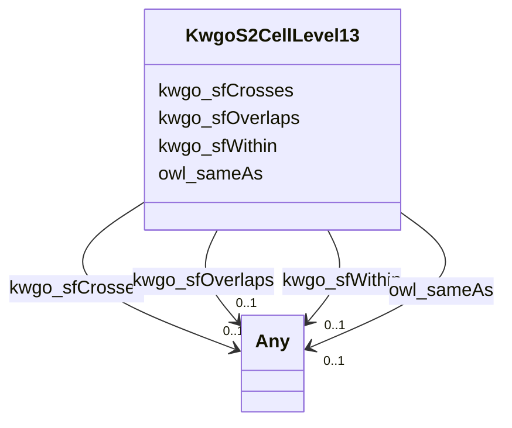

# Class: No class (type) name specified (kwgo_S2Cell_Level13)


_No class (type) description specified_


This class occurs 86332 times.


URI: [kwgo:S2Cell_Level13](http://stko-kwg.geog.ucsb.edu/lod/ontology/S2Cell_Level13)





<!-- no inheritance hierarchy -->


## Slots

| Name | Cardinality and Range | Description | Inheritance | Occurrences |
| ---  | --- | --- | --- | --- |
| [kwgo_sfWithin](../slots/kwgo_sfWithin.md) | 0..1 <br/> [HyfHYWaterBody](../classes/HyfHYWaterBody.md)&nbsp;or&nbsp;<br />[OwlThing](../classes/OwlThing.md)&nbsp;or&nbsp;<br />[Gwml22GWAquifer](../classes/Gwml22GWAquifer.md) | No slot (predicate) description specified <br/>  | direct | 1812 |
| [owl_sameAs](../slots/owl_sameAs.md) | 0..1 <br/> [HyfHYWaterBody](../classes/HyfHYWaterBody.md)&nbsp;or&nbsp;<br />[KwgoS2CellLevel13](../classes/KwgoS2CellLevel13.md)&nbsp;or&nbsp;<br />[OwlThing](../classes/OwlThing.md)&nbsp;or&nbsp;<br />[xsd:anyURI](http://www.w3.org/2001/XMLSchema#anyURI)&nbsp;or&nbsp;<br />[Sf#LineString](../classes/Sf#LineString.md)&nbsp;or&nbsp;<br />[Sf#Polygon](../classes/Sf#Polygon.md)&nbsp;or&nbsp;<br />[Sf#MultiPolygon](../classes/Sf#MultiPolygon.md)&nbsp;or&nbsp;<br />[HyfHYWaterbody](../classes/HyfHYWaterbody.md)&nbsp;or&nbsp;<br />[RdfList](../classes/RdfList.md)&nbsp;or&nbsp;<br />[GeoFeature](../classes/GeoFeature.md)&nbsp;or&nbsp;<br />[GeoGeometry](../classes/GeoGeometry.md)&nbsp;or&nbsp;<br />[HyfHYFlowPath](../classes/HyfHYFlowPath.md)&nbsp;or&nbsp;<br />[SchemaPlace](../classes/SchemaPlace.md)&nbsp;or&nbsp;<br />[Gwml22GWAquifer](../classes/Gwml22GWAquifer.md)&nbsp;or&nbsp;<br />[RdfObjectProperty](../classes/RdfObjectProperty.md) | No slot (predicate) description specified <br/>  | direct | 172664 |
| [kwgo_sfOverlaps](../slots/kwgo_sfOverlaps.md) | 0..1 <br/> [HyfHYWaterBody](../classes/HyfHYWaterBody.md)&nbsp;or&nbsp;<br />[KwgoS2CellLevel13](../classes/KwgoS2CellLevel13.md)&nbsp;or&nbsp;<br />[OwlThing](../classes/OwlThing.md)&nbsp;or&nbsp;<br />[Gwml22GWAquifer](../classes/Gwml22GWAquifer.md) | No slot (predicate) description specified <br/>  | direct | 83040 |
| [kwgo_sfCrosses](../slots/kwgo_sfCrosses.md) | 0..1 <br/> [KwgoS2CellLevel13](../classes/KwgoS2CellLevel13.md)&nbsp;or&nbsp;<br />[OwlThing](../classes/OwlThing.md)&nbsp;or&nbsp;<br />[HyfHYWaterbody](../classes/HyfHYWaterbody.md)&nbsp;or&nbsp;<br />[HyfHYFlowPath](../classes/HyfHYFlowPath.md)&nbsp;or&nbsp;<br />[SchemaPlace](../classes/SchemaPlace.md) | No slot (predicate) description specified <br/>  | direct | 379116 |


## Usages

| used by | used in | type | used |
| ---  | --- | --- | --- |
| [GeoFeature](../classes/GeoFeature.md) | [owl_sameAs](../slots/owl_sameAs.md) | any_of[range] | [KwgoS2CellLevel13](../classes/KwgoS2CellLevel13.md) |
| [GeoGeometry](../classes/GeoGeometry.md) | [owl_sameAs](../slots/owl_sameAs.md) | any_of[range] | [KwgoS2CellLevel13](../classes/KwgoS2CellLevel13.md) |
| [Gwml22GWAquifer](../classes/Gwml22GWAquifer.md) | [owl_sameAs](../slots/owl_sameAs.md) | any_of[range] | [KwgoS2CellLevel13](../classes/KwgoS2CellLevel13.md) |
| [Gwml22GWAquifer](../classes/Gwml22GWAquifer.md) | [kwgo_sfOverlaps](../slots/kwgo_sfOverlaps.md) | any_of[range] | [KwgoS2CellLevel13](../classes/KwgoS2CellLevel13.md) |
| [Gwml22GWAquifer](../classes/Gwml22GWAquifer.md) | [kwgo_sfContains](../slots/kwgo_sfContains.md) | any_of[range] | [KwgoS2CellLevel13](../classes/KwgoS2CellLevel13.md) |
| [HyfHYFlowPath](../classes/HyfHYFlowPath.md) | [owl_sameAs](../slots/owl_sameAs.md) | any_of[range] | [KwgoS2CellLevel13](../classes/KwgoS2CellLevel13.md) |
| [HyfHYFlowPath](../classes/HyfHYFlowPath.md) | [kwgo_sfCrosses](../slots/kwgo_sfCrosses.md) | any_of[range] | [KwgoS2CellLevel13](../classes/KwgoS2CellLevel13.md) |
| [HyfHYWaterBody](../classes/HyfHYWaterBody.md) | [owl_sameAs](../slots/owl_sameAs.md) | any_of[range] | [KwgoS2CellLevel13](../classes/KwgoS2CellLevel13.md) |
| [HyfHYWaterbody](../classes/HyfHYWaterbody.md) | [owl_sameAs](../slots/owl_sameAs.md) | any_of[range] | [KwgoS2CellLevel13](../classes/KwgoS2CellLevel13.md) |
| [HyfHYWaterbody](../classes/HyfHYWaterbody.md) | [kwgo_sfCrosses](../slots/kwgo_sfCrosses.md) | any_of[range] | [KwgoS2CellLevel13](../classes/KwgoS2CellLevel13.md) |
| [KwgoS2CellLevel13](../classes/KwgoS2CellLevel13.md) | [owl_sameAs](../slots/owl_sameAs.md) | any_of[range] | [KwgoS2CellLevel13](../classes/KwgoS2CellLevel13.md) |
| [KwgoS2CellLevel13](../classes/KwgoS2CellLevel13.md) | [kwgo_sfOverlaps](../slots/kwgo_sfOverlaps.md) | any_of[range] | [KwgoS2CellLevel13](../classes/KwgoS2CellLevel13.md) |
| [KwgoS2CellLevel13](../classes/KwgoS2CellLevel13.md) | [kwgo_sfCrosses](../slots/kwgo_sfCrosses.md) | any_of[range] | [KwgoS2CellLevel13](../classes/KwgoS2CellLevel13.md) |
| [OwlNamedIndividual](../classes/OwlNamedIndividual.md) | [kwgo_sfCrosses](../slots/kwgo_sfCrosses.md) | any_of[range] | [KwgoS2CellLevel13](../classes/KwgoS2CellLevel13.md) |
| [OwlNamedIndividual](../classes/OwlNamedIndividual.md) | [owl_sameAs](../slots/owl_sameAs.md) | any_of[range] | [KwgoS2CellLevel13](../classes/KwgoS2CellLevel13.md) |
| [OwlNamedIndividual](../classes/OwlNamedIndividual.md) | [kwgo_sfOverlaps](../slots/kwgo_sfOverlaps.md) | any_of[range] | [KwgoS2CellLevel13](../classes/KwgoS2CellLevel13.md) |
| [OwlNamedIndividual](../classes/OwlNamedIndividual.md) | [kwgo_sfContains](../slots/kwgo_sfContains.md) | any_of[range] | [KwgoS2CellLevel13](../classes/KwgoS2CellLevel13.md) |
| [OwlNothing](../classes/OwlNothing.md) | [kwgo_sfCrosses](../slots/kwgo_sfCrosses.md) | any_of[range] | [KwgoS2CellLevel13](../classes/KwgoS2CellLevel13.md) |
| [OwlNothing](../classes/OwlNothing.md) | [owl_sameAs](../slots/owl_sameAs.md) | any_of[range] | [KwgoS2CellLevel13](../classes/KwgoS2CellLevel13.md) |
| [OwlNothing](../classes/OwlNothing.md) | [kwgo_sfOverlaps](../slots/kwgo_sfOverlaps.md) | any_of[range] | [KwgoS2CellLevel13](../classes/KwgoS2CellLevel13.md) |
| [OwlNothing](../classes/OwlNothing.md) | [kwgo_sfContains](../slots/kwgo_sfContains.md) | any_of[range] | [KwgoS2CellLevel13](../classes/KwgoS2CellLevel13.md) |
| [OwlThing](../classes/OwlThing.md) | [kwgo_sfCrosses](../slots/kwgo_sfCrosses.md) | any_of[range] | [KwgoS2CellLevel13](../classes/KwgoS2CellLevel13.md) |
| [OwlThing](../classes/OwlThing.md) | [owl_sameAs](../slots/owl_sameAs.md) | any_of[range] | [KwgoS2CellLevel13](../classes/KwgoS2CellLevel13.md) |
| [OwlThing](../classes/OwlThing.md) | [kwgo_sfOverlaps](../slots/kwgo_sfOverlaps.md) | any_of[range] | [KwgoS2CellLevel13](../classes/KwgoS2CellLevel13.md) |
| [OwlThing](../classes/OwlThing.md) | [kwgo_sfContains](../slots/kwgo_sfContains.md) | any_of[range] | [KwgoS2CellLevel13](../classes/KwgoS2CellLevel13.md) |
| [RdfList](../classes/RdfList.md) | [owl_sameAs](../slots/owl_sameAs.md) | any_of[range] | [KwgoS2CellLevel13](../classes/KwgoS2CellLevel13.md) |
| [RdfObjectProperty](../classes/RdfObjectProperty.md) | [owl_sameAs](../slots/owl_sameAs.md) | any_of[range] | [KwgoS2CellLevel13](../classes/KwgoS2CellLevel13.md) |
| [SchemaPlace](../classes/SchemaPlace.md) | [owl_sameAs](../slots/owl_sameAs.md) | any_of[range] | [KwgoS2CellLevel13](../classes/KwgoS2CellLevel13.md) |
| [SchemaPlace](../classes/SchemaPlace.md) | [kwgo_sfCrosses](../slots/kwgo_sfCrosses.md) | any_of[range] | [KwgoS2CellLevel13](../classes/KwgoS2CellLevel13.md) |
| [Sf#LineString](../classes/Sf#LineString.md) | [owl_sameAs](../slots/owl_sameAs.md) | any_of[range] | [KwgoS2CellLevel13](../classes/KwgoS2CellLevel13.md) |
| [Sf#MultiPolygon](../classes/Sf#MultiPolygon.md) | [owl_sameAs](../slots/owl_sameAs.md) | any_of[range] | [KwgoS2CellLevel13](../classes/KwgoS2CellLevel13.md) |
| [Sf#Polygon](../classes/Sf#Polygon.md) | [owl_sameAs](../slots/owl_sameAs.md) | any_of[range] | [KwgoS2CellLevel13](../classes/KwgoS2CellLevel13.md) |


## LinkML Source

<!-- TODO: investigate https://stackoverflow.com/questions/37606292/how-to-create-tabbed-code-blocks-in-mkdocs-or-sphinx -->

### Direct

<details>

```yaml
name: kwgo_S2Cell_Level13
conforms_to: No schema conformance document specified
annotations:
  count:
    tag: count
    value: 86332
description: No class (type) description specified
title: No class (type) name specified
from_schema: hydrology-kg
rank: 1000
slots:
- kwgo_sfWithin
- owl_sameAs
- kwgo_sfOverlaps
- kwgo_sfCrosses
slot_usage:
  kwgo_sfCrosses:
    name: kwgo_sfCrosses
    annotations:
      hyf__HY_FlowPath:
        tag: hyf__HY_FlowPath
        value: 94779
      hyf__HY_Waterbody:
        tag: hyf__HY_Waterbody
        value: 94779
      owl_Thing:
        tag: owl_Thing
        value: 94779
      schema_Place:
        tag: schema_Place
        value: 94779
  kwgo_sfOverlaps:
    name: kwgo_sfOverlaps
    annotations:
      gwml22_GW_Aquifer:
        tag: gwml22_GW_Aquifer
        value: 14211
      hyf__HY_WaterBody:
        tag: hyf__HY_WaterBody
        value: 27309
      owl_Thing:
        tag: owl_Thing
        value: 41520
  kwgo_sfWithin:
    name: kwgo_sfWithin
    annotations:
      gwml22_GW_Aquifer:
        tag: gwml22_GW_Aquifer
        value: 395
      hyf__HY_WaterBody:
        tag: hyf__HY_WaterBody
        value: 511
      owl_Thing:
        tag: owl_Thing
        value: 906
  owl_sameAs:
    name: owl_sameAs
    annotations:
      kwgo_S2Cell_Level13:
        tag: kwgo_S2Cell_Level13
        value: 86332
      owl_Thing:
        tag: owl_Thing
        value: 86332
class_uri: kwgo:S2Cell_Level13

```
</details>

### Induced

<details>

```yaml
name: kwgo_S2Cell_Level13
conforms_to: No schema conformance document specified
annotations:
  count:
    tag: count
    value: 86332
description: No class (type) description specified
title: No class (type) name specified
from_schema: hydrology-kg
rank: 1000
slot_usage:
  kwgo_sfCrosses:
    name: kwgo_sfCrosses
    annotations:
      hyf__HY_FlowPath:
        tag: hyf__HY_FlowPath
        value: 94779
      hyf__HY_Waterbody:
        tag: hyf__HY_Waterbody
        value: 94779
      owl_Thing:
        tag: owl_Thing
        value: 94779
      schema_Place:
        tag: schema_Place
        value: 94779
  kwgo_sfOverlaps:
    name: kwgo_sfOverlaps
    annotations:
      gwml22_GW_Aquifer:
        tag: gwml22_GW_Aquifer
        value: 14211
      hyf__HY_WaterBody:
        tag: hyf__HY_WaterBody
        value: 27309
      owl_Thing:
        tag: owl_Thing
        value: 41520
  kwgo_sfWithin:
    name: kwgo_sfWithin
    annotations:
      gwml22_GW_Aquifer:
        tag: gwml22_GW_Aquifer
        value: 395
      hyf__HY_WaterBody:
        tag: hyf__HY_WaterBody
        value: 511
      owl_Thing:
        tag: owl_Thing
        value: 906
  owl_sameAs:
    name: owl_sameAs
    annotations:
      kwgo_S2Cell_Level13:
        tag: kwgo_S2Cell_Level13
        value: 86332
      owl_Thing:
        tag: owl_Thing
        value: 86332
attributes:
  kwgo_sfWithin:
    name: kwgo_sfWithin
    annotations:
      gwml22_GW_Aquifer:
        tag: gwml22_GW_Aquifer
        value: 395
      hyf__HY_WaterBody:
        tag: hyf__HY_WaterBody
        value: 511
      owl_Thing:
        tag: owl_Thing
        value: 906
    description: No slot (predicate) description specified
    title: No slot (predicate) name specified
    examples:
    - object:
        example_object: https://geoconnex.us/nhdplusv2/comid/5194604
        example_object_type: hyf__HY_WaterBody
        example_predicate: kwgo:sfWithin
        example_subject: kwgr:s2.level13.5522837268412235776
        example_subject_type: kwgo_S2Cell_Level13
    - object:
        example_object: https://geoconnex.us/nhdplusv2/comid/5194604
        example_object_type: owl_Thing
        example_predicate: kwgo:sfWithin
        example_subject: kwgr:s2.level13.5522837268412235776
        example_subject_type: kwgo_S2Cell_Level13
    - object:
        example_object: https://geoconnex.us/nhdplusv2/comid/5194604
        example_object_type: hyf__HY_WaterBody
        example_predicate: kwgo:sfWithin
        example_subject: kwgr:s2.level13.5522837268412235776
        example_subject_type: owl_Thing
    - object:
        example_object: https://geoconnex.us/nhdplusv2/comid/5194604
        example_object_type: owl_Thing
        example_predicate: kwgo:sfWithin
        example_subject: kwgr:s2.level13.5522837268412235776
        example_subject_type: owl_Thing
    - object:
        example_object: http://sawgraph.spatialai.org/v1/me_mgs_data#d.MGS-Aquifer.1195
        example_object_type: gwml22_GW_Aquifer
        example_predicate: kwgo:sfWithin
        example_subject: kwgr:s2.level13.5523896132469522432
        example_subject_type: kwgo_S2Cell_Level13
    - object:
        example_object: http://sawgraph.spatialai.org/v1/me_mgs_data#d.MGS-Aquifer.1195
        example_object_type: gwml22_GW_Aquifer
        example_predicate: kwgo:sfWithin
        example_subject: kwgr:s2.level13.5523896132469522432
        example_subject_type: owl_Thing
    from_schema: hydrology-kg
    rank: 1000
    slot_uri: kwgo:sfWithin
    alias: kwgo_sfWithin
    owner: kwgo_S2Cell_Level13
    domain_of:
    - kwgo_S2Cell_Level13
    - owl_Thing
    range: Any
    any_of:
    - range: hyf__HY_WaterBody
    - range: owl_Thing
    - range: gwml22_GW_Aquifer
  owl_sameAs:
    name: owl_sameAs
    annotations:
      kwgo_S2Cell_Level13:
        tag: kwgo_S2Cell_Level13
        value: 86332
      owl_Thing:
        tag: owl_Thing
        value: 86332
    description: No slot (predicate) description specified
    title: No slot (predicate) name specified
    examples:
    - object:
        example_object: memgs2:MGS
        example_object_type: owl_Thing
        example_predicate: owl:sameAs
        example_subject: memgs2:MGS
        example_subject_type: owl_Thing
    - object:
        example_object: http://sawgraph.spatialai.org/v1/me_mgs_data#d.MGS-Aquifer.0001
        example_object_type: gwml22_GW_Aquifer
        example_predicate: owl:sameAs
        example_subject: http://sawgraph.spatialai.org/v1/me_mgs_data#d.MGS-Aquifer.0001
        example_subject_type: gwml22_GW_Aquifer
    - object:
        example_object: http://sawgraph.spatialai.org/v1/me_mgs_data#d.MGS-Aquifer.0001
        example_object_type: owl_Thing
        example_predicate: owl:sameAs
        example_subject: http://sawgraph.spatialai.org/v1/me_mgs_data#d.MGS-Aquifer.0001
        example_subject_type: gwml22_GW_Aquifer
    - object:
        example_object: http://sawgraph.spatialai.org/v1/me_mgs_data#d.MGS-Aquifer.0001
        example_object_type: gwml22_GW_Aquifer
        example_predicate: owl:sameAs
        example_subject: http://sawgraph.spatialai.org/v1/me_mgs_data#d.MGS-Aquifer.0001
        example_subject_type: owl_Thing
    - object:
        example_object: http://sawgraph.spatialai.org/v1/me_mgs_data#d.MGS-Aquifer.Geometry.0001
        example_object_type: sf_#Polygon
        example_predicate: owl:sameAs
        example_subject: http://sawgraph.spatialai.org/v1/me_mgs_data#d.MGS-Aquifer.Geometry.0001
        example_subject_type: owl_Thing
    - object:
        example_object: http://sawgraph.spatialai.org/v1/me_mgs_data#d.MGS-Aquifer.Geometry.0001
        example_object_type: geo_Geometry
        example_predicate: owl:sameAs
        example_subject: http://sawgraph.spatialai.org/v1/me_mgs_data#d.MGS-Aquifer.Geometry.0001
        example_subject_type: owl_Thing
    - object:
        example_object: http://sawgraph.spatialai.org/v1/me_mgs_data#d.MGS-Aquifer.Geometry.0001
        example_object_type: owl_Thing
        example_predicate: owl:sameAs
        example_subject: http://sawgraph.spatialai.org/v1/me_mgs_data#d.MGS-Aquifer.Geometry.0001
        example_subject_type: sf_#Polygon
    - object:
        example_object: http://sawgraph.spatialai.org/v1/me_mgs_data#d.MGS-Aquifer.Geometry.0001
        example_object_type: sf_#Polygon
        example_predicate: owl:sameAs
        example_subject: http://sawgraph.spatialai.org/v1/me_mgs_data#d.MGS-Aquifer.Geometry.0001
        example_subject_type: sf_#Polygon
    - object:
        example_object: http://sawgraph.spatialai.org/v1/me_mgs_data#d.MGS-Aquifer.Geometry.0001
        example_object_type: geo_Geometry
        example_predicate: owl:sameAs
        example_subject: http://sawgraph.spatialai.org/v1/me_mgs_data#d.MGS-Aquifer.Geometry.0001
        example_subject_type: sf_#Polygon
    - object:
        example_object: http://sawgraph.spatialai.org/v1/me_mgs_data#d.MGS-Aquifer.Geometry.0001
        example_object_type: owl_Thing
        example_predicate: owl:sameAs
        example_subject: http://sawgraph.spatialai.org/v1/me_mgs_data#d.MGS-Aquifer.Geometry.0001
        example_subject_type: geo_Geometry
    - object:
        example_object: http://sawgraph.spatialai.org/v1/me_mgs_data#d.MGS-Aquifer.Geometry.0001
        example_object_type: sf_#Polygon
        example_predicate: owl:sameAs
        example_subject: http://sawgraph.spatialai.org/v1/me_mgs_data#d.MGS-Aquifer.Geometry.0001
        example_subject_type: geo_Geometry
    - object:
        example_object: http://sawgraph.spatialai.org/v1/me_mgs_data#d.MGS-Aquifer.Geometry.0001
        example_object_type: geo_Geometry
        example_predicate: owl:sameAs
        example_subject: http://sawgraph.spatialai.org/v1/me_mgs_data#d.MGS-Aquifer.Geometry.0001
        example_subject_type: geo_Geometry
    - object:
        example_object: http://sawgraph.spatialai.org/v1/me_mgs_data#d.MGS-Aquifer.Geometry.0175
        example_object_type: owl_Thing
        example_predicate: owl:sameAs
        example_subject: http://sawgraph.spatialai.org/v1/me_mgs_data#d.MGS-Aquifer.Geometry.0175
        example_subject_type: sf_#MultiPolygon
    - object:
        example_object: http://sawgraph.spatialai.org/v1/me_mgs_data#d.MGS-Aquifer.Geometry.0175
        example_object_type: geo_Geometry
        example_predicate: owl:sameAs
        example_subject: http://sawgraph.spatialai.org/v1/me_mgs_data#d.MGS-Aquifer.Geometry.0175
        example_subject_type: sf_#MultiPolygon
    - object:
        example_object: http://sawgraph.spatialai.org/v1/me_mgs_data#d.MGS-Aquifer.Geometry.0175
        example_object_type: sf_#MultiPolygon
        example_predicate: owl:sameAs
        example_subject: http://sawgraph.spatialai.org/v1/me_mgs_data#d.MGS-Aquifer.Geometry.0175
        example_subject_type: sf_#MultiPolygon
    - object:
        example_object: http://sawgraph.spatialai.org/v1/me_mgs_data#d.MGS-Aquifer.Geometry.0175
        example_object_type: sf_#MultiPolygon
        example_predicate: owl:sameAs
        example_subject: http://sawgraph.spatialai.org/v1/me_mgs_data#d.MGS-Aquifer.Geometry.0175
        example_subject_type: owl_Thing
    - object:
        example_object: http://sawgraph.spatialai.org/v1/me_mgs_data#d.MGS-Aquifer.Geometry.0175
        example_object_type: sf_#MultiPolygon
        example_predicate: owl:sameAs
        example_subject: http://sawgraph.spatialai.org/v1/me_mgs_data#d.MGS-Aquifer.Geometry.0175
        example_subject_type: geo_Geometry
    - object:
        example_object: kwgr:s2.level13.5522341869704445952
        example_object_type: kwgo_S2Cell_Level13
        example_predicate: owl:sameAs
        example_subject: kwgr:s2.level13.5522341869704445952
        example_subject_type: kwgo_S2Cell_Level13
    - object:
        example_object: kwgr:s2.level13.5522341869704445952
        example_object_type: owl_Thing
        example_predicate: owl:sameAs
        example_subject: kwgr:s2.level13.5522341869704445952
        example_subject_type: kwgo_S2Cell_Level13
    - object:
        example_object: kwgr:s2.level13.5522341869704445952
        example_object_type: kwgo_S2Cell_Level13
        example_predicate: owl:sameAs
        example_subject: kwgr:s2.level13.5522341869704445952
        example_subject_type: owl_Thing
    - object:
        example_object: rdf:nil
        example_object_type: rdf_List
        example_predicate: owl:sameAs
        example_subject: rdf:nil
        example_subject_type: owl_Thing
    - object:
        example_object: rdf:nil
        example_object_type: owl_Thing
        example_predicate: owl:sameAs
        example_subject: rdf:nil
        example_subject_type: rdf_List
    - object:
        example_object: rdf:nil
        example_object_type: rdf_List
        example_predicate: owl:sameAs
        example_subject: rdf:nil
        example_subject_type: rdf_List
    - object:
        example_object: owl:topObjectProperty
        example_object_type: rdf_ObjectProperty
        example_predicate: owl:sameAs
        example_subject: owl:topObjectProperty
        example_subject_type: owl_Thing
    - object:
        example_object: owl:topObjectProperty
        example_object_type: owl_Thing
        example_predicate: owl:sameAs
        example_subject: owl:topObjectProperty
        example_subject_type: rdf_ObjectProperty
    - object:
        example_object: owl:topObjectProperty
        example_object_type: rdf_ObjectProperty
        example_predicate: owl:sameAs
        example_subject: owl:topObjectProperty
        example_subject_type: rdf_ObjectProperty
    - object:
        example_object: https://geoconnex.us/nhdplusv2/comid/1001
        example_object_type: hyf__HY_Waterbody
        example_predicate: owl:sameAs
        example_subject: https://geoconnex.us/nhdplusv2/comid/1001
        example_subject_type: hyf__HY_Waterbody
    - object:
        example_object: https://geoconnex.us/nhdplusv2/comid/1001
        example_object_type: schema_Place
        example_predicate: owl:sameAs
        example_subject: https://geoconnex.us/nhdplusv2/comid/1001
        example_subject_type: hyf__HY_Waterbody
    - object:
        example_object: https://geoconnex.us/nhdplusv2/comid/1001
        example_object_type: owl_Thing
        example_predicate: owl:sameAs
        example_subject: https://geoconnex.us/nhdplusv2/comid/1001
        example_subject_type: hyf__HY_Waterbody
    - object:
        example_object: https://geoconnex.us/nhdplusv2/comid/1001
        example_object_type: hyf__HY_FlowPath
        example_predicate: owl:sameAs
        example_subject: https://geoconnex.us/nhdplusv2/comid/1001
        example_subject_type: hyf__HY_Waterbody
    - object:
        example_object: https://geoconnex.us/nhdplusv2/comid/1001
        example_object_type: hyf__HY_Waterbody
        example_predicate: owl:sameAs
        example_subject: https://geoconnex.us/nhdplusv2/comid/1001
        example_subject_type: schema_Place
    - object:
        example_object: https://geoconnex.us/nhdplusv2/comid/1001
        example_object_type: schema_Place
        example_predicate: owl:sameAs
        example_subject: https://geoconnex.us/nhdplusv2/comid/1001
        example_subject_type: schema_Place
    - object:
        example_object: https://geoconnex.us/nhdplusv2/comid/1001
        example_object_type: owl_Thing
        example_predicate: owl:sameAs
        example_subject: https://geoconnex.us/nhdplusv2/comid/1001
        example_subject_type: schema_Place
    - object:
        example_object: https://geoconnex.us/nhdplusv2/comid/1001
        example_object_type: hyf__HY_FlowPath
        example_predicate: owl:sameAs
        example_subject: https://geoconnex.us/nhdplusv2/comid/1001
        example_subject_type: schema_Place
    - object:
        example_object: https://geoconnex.us/nhdplusv2/comid/1001
        example_object_type: hyf__HY_Waterbody
        example_predicate: owl:sameAs
        example_subject: https://geoconnex.us/nhdplusv2/comid/1001
        example_subject_type: owl_Thing
    - object:
        example_object: https://geoconnex.us/nhdplusv2/comid/1001
        example_object_type: schema_Place
        example_predicate: owl:sameAs
        example_subject: https://geoconnex.us/nhdplusv2/comid/1001
        example_subject_type: owl_Thing
    - object:
        example_object: https://geoconnex.us/nhdplusv2/comid/1001
        example_object_type: hyf__HY_FlowPath
        example_predicate: owl:sameAs
        example_subject: https://geoconnex.us/nhdplusv2/comid/1001
        example_subject_type: owl_Thing
    - object:
        example_object: https://geoconnex.us/nhdplusv2/comid/1001
        example_object_type: hyf__HY_Waterbody
        example_predicate: owl:sameAs
        example_subject: https://geoconnex.us/nhdplusv2/comid/1001
        example_subject_type: hyf__HY_FlowPath
    - object:
        example_object: https://geoconnex.us/nhdplusv2/comid/1001
        example_object_type: schema_Place
        example_predicate: owl:sameAs
        example_subject: https://geoconnex.us/nhdplusv2/comid/1001
        example_subject_type: hyf__HY_FlowPath
    - object:
        example_object: https://geoconnex.us/nhdplusv2/comid/1001
        example_object_type: owl_Thing
        example_predicate: owl:sameAs
        example_subject: https://geoconnex.us/nhdplusv2/comid/1001
        example_subject_type: hyf__HY_FlowPath
    - object:
        example_object: https://geoconnex.us/nhdplusv2/comid/1001
        example_object_type: hyf__HY_FlowPath
        example_predicate: owl:sameAs
        example_subject: https://geoconnex.us/nhdplusv2/comid/1001
        example_subject_type: hyf__HY_FlowPath
    - object:
        example_object: https://geoconnex.us/nhdplusv2/comid/1001.geometry
        example_object_type: sf_#LineString
        example_predicate: owl:sameAs
        example_subject: https://geoconnex.us/nhdplusv2/comid/1001.geometry
        example_subject_type: owl_Thing
    - object:
        example_object: https://geoconnex.us/nhdplusv2/comid/1001.geometry
        example_object_type: owl_Thing
        example_predicate: owl:sameAs
        example_subject: https://geoconnex.us/nhdplusv2/comid/1001.geometry
        example_subject_type: sf_#LineString
    - object:
        example_object: https://geoconnex.us/nhdplusv2/comid/1001.geometry
        example_object_type: sf_#LineString
        example_predicate: owl:sameAs
        example_subject: https://geoconnex.us/nhdplusv2/comid/1001.geometry
        example_subject_type: sf_#LineString
    - object:
        example_object: https://geoconnex.us/nhdplusv2/comid/1001.geometry
        example_object_type: geo_Geometry
        example_predicate: owl:sameAs
        example_subject: https://geoconnex.us/nhdplusv2/comid/1001.geometry
        example_subject_type: sf_#LineString
    - object:
        example_object: https://geoconnex.us/nhdplusv2/comid/1001.geometry
        example_object_type: sf_#LineString
        example_predicate: owl:sameAs
        example_subject: https://geoconnex.us/nhdplusv2/comid/1001.geometry
        example_subject_type: geo_Geometry
    - object:
        example_object: https://geoconnex.us/nhdplusv2/comid/1001.head
        example_object_type: geo_Feature
        example_predicate: owl:sameAs
        example_subject: https://geoconnex.us/nhdplusv2/comid/1001.head
        example_subject_type: geo_Feature
    - object:
        example_object: https://geoconnex.us/nhdplusv2/comid/1001.head
        example_object_type: owl_Thing
        example_predicate: owl:sameAs
        example_subject: https://geoconnex.us/nhdplusv2/comid/1001.head
        example_subject_type: geo_Feature
    - object:
        example_object: https://geoconnex.us/nhdplusv2/comid/1001.head
        example_object_type: geo_Feature
        example_predicate: owl:sameAs
        example_subject: https://geoconnex.us/nhdplusv2/comid/1001.head
        example_subject_type: owl_Thing
    - object:
        example_object: https://geoconnex.us/nhdplusv2/comid/10101972
        example_object_type: hyf__HY_WaterBody
        example_predicate: owl:sameAs
        example_subject: https://geoconnex.us/nhdplusv2/comid/10101972
        example_subject_type: hyf__HY_WaterBody
    - object:
        example_object: https://geoconnex.us/nhdplusv2/comid/10101972
        example_object_type: owl_Thing
        example_predicate: owl:sameAs
        example_subject: https://geoconnex.us/nhdplusv2/comid/10101972
        example_subject_type: hyf__HY_WaterBody
    - object:
        example_object: https://geoconnex.us/nhdplusv2/comid/10101972
        example_object_type: hyf__HY_WaterBody
        example_predicate: owl:sameAs
        example_subject: https://geoconnex.us/nhdplusv2/comid/10101972
        example_subject_type: owl_Thing
    from_schema: hydrology-kg
    rank: 1000
    domain: owl_sameAs
    slot_uri: owl:sameAs
    alias: owl_sameAs
    owner: kwgo_S2Cell_Level13
    domain_of:
    - geo_Feature
    - geo_Geometry
    - gwml22_GW_Aquifer
    - hyf__HY_FlowPath
    - hyf__HY_WaterBody
    - hyf__HY_Waterbody
    - kwgo_S2Cell_Level13
    - owl_Thing
    - rdf_List
    - rdf_ObjectProperty
    - schema_Place
    - sf_#LineString
    - sf_#MultiPolygon
    - sf_#Polygon
    range: Any
    any_of:
    - range: hyf__HY_WaterBody
    - range: kwgo_S2Cell_Level13
    - range: owl_Thing
    - range: uri
    - range: sf_#LineString
    - range: sf_#Polygon
    - range: sf_#MultiPolygon
    - range: hyf__HY_Waterbody
    - range: rdf_List
    - range: geo_Feature
    - range: geo_Geometry
    - range: hyf__HY_FlowPath
    - range: schema_Place
    - range: gwml22_GW_Aquifer
    - range: rdf_ObjectProperty
  kwgo_sfOverlaps:
    name: kwgo_sfOverlaps
    annotations:
      gwml22_GW_Aquifer:
        tag: gwml22_GW_Aquifer
        value: 14211
      hyf__HY_WaterBody:
        tag: hyf__HY_WaterBody
        value: 27309
      owl_Thing:
        tag: owl_Thing
        value: 41520
    description: No slot (predicate) description specified
    title: No slot (predicate) name specified
    examples:
    - object:
        example_object: kwgr:s2.level13.9935671970391654400
        example_object_type: kwgo_S2Cell_Level13
        example_predicate: kwgo:sfOverlaps
        example_subject: http://sawgraph.spatialai.org/v1/me_mgs_data#d.MGS-Aquifer.0001
        example_subject_type: gwml22_GW_Aquifer
    - object:
        example_object: kwgr:s2.level13.9935671970391654400
        example_object_type: owl_Thing
        example_predicate: kwgo:sfOverlaps
        example_subject: http://sawgraph.spatialai.org/v1/me_mgs_data#d.MGS-Aquifer.0001
        example_subject_type: gwml22_GW_Aquifer
    - object:
        example_object: kwgr:s2.level13.9935671970391654400
        example_object_type: kwgo_S2Cell_Level13
        example_predicate: kwgo:sfOverlaps
        example_subject: http://sawgraph.spatialai.org/v1/me_mgs_data#d.MGS-Aquifer.0001
        example_subject_type: owl_Thing
    - object:
        example_object: kwgr:s2.level13.9935671970391654400
        example_object_type: owl_Thing
        example_predicate: kwgo:sfOverlaps
        example_subject: http://sawgraph.spatialai.org/v1/me_mgs_data#d.MGS-Aquifer.0001
        example_subject_type: owl_Thing
    - object:
        example_object: http://sawgraph.spatialai.org/v1/me_mgs_data#d.MGS-Aquifer.1176
        example_object_type: gwml22_GW_Aquifer
        example_predicate: kwgo:sfOverlaps
        example_subject: kwgr:s2.level13.5522341904064184320
        example_subject_type: kwgo_S2Cell_Level13
    - object:
        example_object: http://sawgraph.spatialai.org/v1/me_mgs_data#d.MGS-Aquifer.1176
        example_object_type: owl_Thing
        example_predicate: kwgo:sfOverlaps
        example_subject: kwgr:s2.level13.5522341904064184320
        example_subject_type: kwgo_S2Cell_Level13
    - object:
        example_object: http://sawgraph.spatialai.org/v1/me_mgs_data#d.MGS-Aquifer.1176
        example_object_type: gwml22_GW_Aquifer
        example_predicate: kwgo:sfOverlaps
        example_subject: kwgr:s2.level13.5522341904064184320
        example_subject_type: owl_Thing
    - object:
        example_object: https://geoconnex.us/nhdplusv2/comid/802769
        example_object_type: hyf__HY_WaterBody
        example_predicate: kwgo:sfOverlaps
        example_subject: kwgr:s2.level13.5522342316381044736
        example_subject_type: kwgo_S2Cell_Level13
    - object:
        example_object: https://geoconnex.us/nhdplusv2/comid/802769
        example_object_type: hyf__HY_WaterBody
        example_predicate: kwgo:sfOverlaps
        example_subject: kwgr:s2.level13.5522342316381044736
        example_subject_type: owl_Thing
    from_schema: hydrology-kg
    rank: 1000
    slot_uri: kwgo:sfOverlaps
    alias: kwgo_sfOverlaps
    owner: kwgo_S2Cell_Level13
    domain_of:
    - gwml22_GW_Aquifer
    - kwgo_S2Cell_Level13
    - owl_Thing
    range: Any
    any_of:
    - range: hyf__HY_WaterBody
    - range: kwgo_S2Cell_Level13
    - range: owl_Thing
    - range: gwml22_GW_Aquifer
  kwgo_sfCrosses:
    name: kwgo_sfCrosses
    annotations:
      hyf__HY_FlowPath:
        tag: hyf__HY_FlowPath
        value: 94779
      hyf__HY_Waterbody:
        tag: hyf__HY_Waterbody
        value: 94779
      owl_Thing:
        tag: owl_Thing
        value: 94779
      schema_Place:
        tag: schema_Place
        value: 94779
    description: No slot (predicate) description specified
    title: No slot (predicate) name specified
    examples:
    - object:
        example_object: https://geoconnex.us/nhdplusv2/comid/166195770
        example_object_type: hyf__HY_Waterbody
        example_predicate: kwgo:sfCrosses
        example_subject: kwgr:s2.level13.5522339705040928768
        example_subject_type: owl_Thing
    - object:
        example_object: https://geoconnex.us/nhdplusv2/comid/166195770
        example_object_type: schema_Place
        example_predicate: kwgo:sfCrosses
        example_subject: kwgr:s2.level13.5522339705040928768
        example_subject_type: owl_Thing
    - object:
        example_object: https://geoconnex.us/nhdplusv2/comid/166195770
        example_object_type: owl_Thing
        example_predicate: kwgo:sfCrosses
        example_subject: kwgr:s2.level13.5522339705040928768
        example_subject_type: owl_Thing
    - object:
        example_object: https://geoconnex.us/nhdplusv2/comid/166195770
        example_object_type: hyf__HY_FlowPath
        example_predicate: kwgo:sfCrosses
        example_subject: kwgr:s2.level13.5522339705040928768
        example_subject_type: owl_Thing
    - object:
        example_object: https://geoconnex.us/nhdplusv2/comid/803107
        example_object_type: hyf__HY_Waterbody
        example_predicate: kwgo:sfCrosses
        example_subject: kwgr:s2.level13.5522341904064184320
        example_subject_type: kwgo_S2Cell_Level13
    - object:
        example_object: https://geoconnex.us/nhdplusv2/comid/803107
        example_object_type: schema_Place
        example_predicate: kwgo:sfCrosses
        example_subject: kwgr:s2.level13.5522341904064184320
        example_subject_type: kwgo_S2Cell_Level13
    - object:
        example_object: https://geoconnex.us/nhdplusv2/comid/803107
        example_object_type: owl_Thing
        example_predicate: kwgo:sfCrosses
        example_subject: kwgr:s2.level13.5522341904064184320
        example_subject_type: kwgo_S2Cell_Level13
    - object:
        example_object: https://geoconnex.us/nhdplusv2/comid/803107
        example_object_type: hyf__HY_FlowPath
        example_predicate: kwgo:sfCrosses
        example_subject: kwgr:s2.level13.5522341904064184320
        example_subject_type: kwgo_S2Cell_Level13
    - object:
        example_object: kwgr:s2.level13.5522769236130267136
        example_object_type: kwgo_S2Cell_Level13
        example_predicate: kwgo:sfCrosses
        example_subject: https://geoconnex.us/nhdplusv2/comid/1001
        example_subject_type: hyf__HY_Waterbody
    - object:
        example_object: kwgr:s2.level13.5522769236130267136
        example_object_type: owl_Thing
        example_predicate: kwgo:sfCrosses
        example_subject: https://geoconnex.us/nhdplusv2/comid/1001
        example_subject_type: hyf__HY_Waterbody
    - object:
        example_object: kwgr:s2.level13.5522769236130267136
        example_object_type: kwgo_S2Cell_Level13
        example_predicate: kwgo:sfCrosses
        example_subject: https://geoconnex.us/nhdplusv2/comid/1001
        example_subject_type: schema_Place
    - object:
        example_object: kwgr:s2.level13.5522769236130267136
        example_object_type: owl_Thing
        example_predicate: kwgo:sfCrosses
        example_subject: https://geoconnex.us/nhdplusv2/comid/1001
        example_subject_type: schema_Place
    - object:
        example_object: kwgr:s2.level13.5522769236130267136
        example_object_type: kwgo_S2Cell_Level13
        example_predicate: kwgo:sfCrosses
        example_subject: https://geoconnex.us/nhdplusv2/comid/1001
        example_subject_type: owl_Thing
    - object:
        example_object: kwgr:s2.level13.5522769236130267136
        example_object_type: kwgo_S2Cell_Level13
        example_predicate: kwgo:sfCrosses
        example_subject: https://geoconnex.us/nhdplusv2/comid/1001
        example_subject_type: hyf__HY_FlowPath
    - object:
        example_object: kwgr:s2.level13.5522769236130267136
        example_object_type: owl_Thing
        example_predicate: kwgo:sfCrosses
        example_subject: https://geoconnex.us/nhdplusv2/comid/1001
        example_subject_type: hyf__HY_FlowPath
    from_schema: hydrology-kg
    rank: 1000
    slot_uri: kwgo:sfCrosses
    alias: kwgo_sfCrosses
    owner: kwgo_S2Cell_Level13
    domain_of:
    - hyf__HY_FlowPath
    - hyf__HY_Waterbody
    - kwgo_S2Cell_Level13
    - owl_Thing
    - schema_Place
    range: Any
    any_of:
    - range: kwgo_S2Cell_Level13
    - range: owl_Thing
    - range: hyf__HY_Waterbody
    - range: hyf__HY_FlowPath
    - range: schema_Place
class_uri: kwgo:S2Cell_Level13

```
</details>