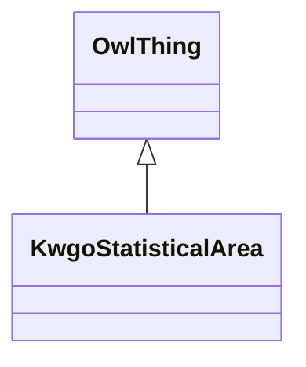

# Class: KwgoStatisticalArea


URI: [kwgo:StatisticalArea](http://stko-kwg.geog.ucsb.edu/lod/ontology/StatisticalArea)





## Inheritance
* [OwlThing](../classes/OwlThing.md)
    * **KwgoStatisticalArea**


## Slots

| Name | Cardinality and Range | Description | Inheritance | Occurrences |
| ---  | --- | --- | --- | --- |


## LinkML Source

<!-- TODO: investigate https://stackoverflow.com/questions/37606292/how-to-create-tabbed-code-blocks-in-mkdocs-or-sphinx -->

### Direct

<details>

```yaml
name: kwgo_StatisticalArea
from_schema: okns:hydrology-kg
rank: 1000
is_a: owl_Thing
class_uri: kwgo:StatisticalArea

```
</details>

### Induced

<details>

```yaml
name: kwgo_StatisticalArea
from_schema: okns:hydrology-kg
rank: 1000
is_a: owl_Thing
class_uri: kwgo:StatisticalArea

```
</details>