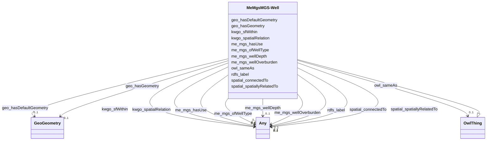

# Class: MeMgsMGS-Well


This class occurs 147508 times.


URI: [me_mgs:MGS-Well](http://sawgraph.spatialai.org/v1/me-mgs#MGS-Well)





## Inheritance
* [OwlThing](../classes/OwlThing.md)
    * **MeMgsMGS-Well**


## Slots

| Name | Cardinality and Range | Description | Inheritance | Occurrences |
| ---  | --- | --- | --- | --- |
| [kwgo_spatialRelation](../slots/kwgo_spatialRelation.md) | 0..1 <br/> [Any](../classes/Any.md) | KWG's general spatial relation <br/>  | direct | 634348 |
| [me_mgs_wellDepth](../slots/me_mgs_wellDepth.md) | 0..1 <br/> [OwlThing](../classes/OwlThing.md)&nbsp;or&nbsp;<br />[StadSingleData](../classes/StadSingleData.md)&nbsp;or&nbsp;<br />[MeMgsWellDepthInFt](../classes/MeMgsWellDepthInFt.md) |  <br/>  | direct | 147508 |
| [owl_sameAs](../slots/owl_sameAs.md) | 0..1 <br/> [OwlThing](../classes/OwlThing.md) | The property that determines that two given individuals are equal <br/>  | direct | 147508 |
| [rdfs_label](../slots/rdfs_label.md) | 0..1 <br/> [RdfsLiteral](../classes/RdfsLiteral.md)&nbsp;or&nbsp;<br />[xsd:string](http://www.w3.org/2001/XMLSchema#string) | A human-readable name for the subject <br/>  | direct | 147508 |
| [me_mgs_ofWellType](../slots/me_mgs_ofWellType.md) | 0..1 <br/> [OwlThing](../classes/OwlThing.md)&nbsp;or&nbsp;<br />[MeMgsWellType](../classes/MeMgsWellType.md) |  <br/>  | direct | 144120 |
| [me_mgs_wellOverburden](../slots/me_mgs_wellOverburden.md) | 0..1 <br/> [OwlThing](../classes/OwlThing.md)&nbsp;or&nbsp;<br />[StadSingleData](../classes/StadSingleData.md)&nbsp;or&nbsp;<br />[MeMgsWellOverburdenThicknessInFt](../classes/MeMgsWellOverburdenThicknessInFt.md) |  <br/>  | direct | 129946 |
| [me_mgs_hasUse](../slots/me_mgs_hasUse.md) | 0..1 <br/> [OwlThing](../classes/OwlThing.md)&nbsp;or&nbsp;<br />[MeMgsWellUse](../classes/MeMgsWellUse.md) |  <br/>  | direct | 143400 |
| [geo_hasDefaultGeometry](../slots/geo_hasDefaultGeometry.md) | 0..1 <br/> [GeoGeometry](../classes/GeoGeometry.md) | The default Geometry to be used in spatial calculations <br/> source: http://www.opengis.net/spec/geosparql/1.1/req/geometry-extension/feature-properties<br/>source: http://www.opengis.net/ont/geosparql#<br/>source: http://www.opengis.net/spec/geosparql/1.0/req/geometry-extension/feature-properties<br/>description: The default Geometry to be used in spatial calculations. It is usually the most detailed Geometry. | direct | 166100 |
| [spatial_spatiallyRelatedTo](../slots/spatial_spatiallyRelatedTo.md) | 0..1 <br/> [UsSdwisPublicWaterSystem-GW](../classes/UsSdwisPublicWaterSystem-GW.md)&nbsp;or&nbsp;<br />[HttpGwml2.orgDefGwml2#GWAquiferSystem](../classes/HttpGwml2.orgDefGwml2#GWAquiferSystem.md)&nbsp;or&nbsp;<br />[UsSdwisPublicWaterSystem-SW](../classes/UsSdwisPublicWaterSystem-SW.md)&nbsp;or&nbsp;<br />[UsSdwisPWS-ServiceArea](../classes/UsSdwisPWS-ServiceArea.md)&nbsp;or&nbsp;<br />[HttpGwml2.orgDefGwml2#GWAquifer](../classes/HttpGwml2.orgDefGwml2#GWAquifer.md)&nbsp;or&nbsp;<br />[OwlThing](../classes/OwlThing.md)&nbsp;or&nbsp;<br />[HyfHYWaterBody](../classes/HyfHYWaterBody.md)&nbsp;or&nbsp;<br />[UsSdwisPublicWaterSystem-NTNCWS](../classes/UsSdwisPublicWaterSystem-NTNCWS.md)&nbsp;or&nbsp;<br />[MeMgsMGS-Well](../classes/MeMgsMGS-Well.md)&nbsp;or&nbsp;<br />[KwgoS2CellLevel13](../classes/KwgoS2CellLevel13.md)&nbsp;or&nbsp;<br />[B805a9e7d30eaabcb686b8ce670ed1e95](../classes/B805a9e7d30eaabcb686b8ce670ed1e95.md)&nbsp;or&nbsp;<br />[HyfHYHydroFeature](../classes/HyfHYHydroFeature.md)&nbsp;or&nbsp;<br />[KwgoAdministrativeRegion3](../classes/KwgoAdministrativeRegion3.md)&nbsp;or&nbsp;<br />[UsSdwisPublicWaterSystem-CWS](../classes/UsSdwisPublicWaterSystem-CWS.md)&nbsp;or&nbsp;<br />[GeoFeature](../classes/GeoFeature.md)&nbsp;or&nbsp;<br />[HyfHYLake](../classes/HyfHYLake.md)&nbsp;or&nbsp;<br />[GeoSpatialObject](../classes/GeoSpatialObject.md)&nbsp;or&nbsp;<br />[HyfHYElementaryFlowPath](../classes/HyfHYElementaryFlowPath.md)&nbsp;or&nbsp;<br />[KwgoAdministrativeRegion2](../classes/KwgoAdministrativeRegion2.md)&nbsp;or&nbsp;<br />[UsSdwisPublicWaterSystem-TNCWS](../classes/UsSdwisPublicWaterSystem-TNCWS.md)&nbsp;or&nbsp;<br />[KwgoRegion](../classes/KwgoRegion.md)&nbsp;or&nbsp;<br />[KwgoAdministrativeRegion](../classes/KwgoAdministrativeRegion.md) |  <br/>  | direct | 634348 |
| [spatial_connectedTo](../slots/spatial_connectedTo.md) | 0..1 <br/> [UsSdwisPublicWaterSystem-GW](../classes/UsSdwisPublicWaterSystem-GW.md)&nbsp;or&nbsp;<br />[HttpGwml2.orgDefGwml2#GWAquiferSystem](../classes/HttpGwml2.orgDefGwml2#GWAquiferSystem.md)&nbsp;or&nbsp;<br />[UsSdwisPublicWaterSystem-SW](../classes/UsSdwisPublicWaterSystem-SW.md)&nbsp;or&nbsp;<br />[UsSdwisPWS-ServiceArea](../classes/UsSdwisPWS-ServiceArea.md)&nbsp;or&nbsp;<br />[HttpGwml2.orgDefGwml2#GWAquifer](../classes/HttpGwml2.orgDefGwml2#GWAquifer.md)&nbsp;or&nbsp;<br />[OwlThing](../classes/OwlThing.md)&nbsp;or&nbsp;<br />[HyfHYWaterBody](../classes/HyfHYWaterBody.md)&nbsp;or&nbsp;<br />[UsSdwisPublicWaterSystem-NTNCWS](../classes/UsSdwisPublicWaterSystem-NTNCWS.md)&nbsp;or&nbsp;<br />[MeMgsMGS-Well](../classes/MeMgsMGS-Well.md)&nbsp;or&nbsp;<br />[KwgoS2CellLevel13](../classes/KwgoS2CellLevel13.md)&nbsp;or&nbsp;<br />[B805a9e7d30eaabcb686b8ce670ed1e95](../classes/B805a9e7d30eaabcb686b8ce670ed1e95.md)&nbsp;or&nbsp;<br />[HyfHYHydroFeature](../classes/HyfHYHydroFeature.md)&nbsp;or&nbsp;<br />[KwgoAdministrativeRegion3](../classes/KwgoAdministrativeRegion3.md)&nbsp;or&nbsp;<br />[UsSdwisPublicWaterSystem-CWS](../classes/UsSdwisPublicWaterSystem-CWS.md)&nbsp;or&nbsp;<br />[GeoFeature](../classes/GeoFeature.md)&nbsp;or&nbsp;<br />[HyfHYLake](../classes/HyfHYLake.md)&nbsp;or&nbsp;<br />[GeoSpatialObject](../classes/GeoSpatialObject.md)&nbsp;or&nbsp;<br />[HyfHYElementaryFlowPath](../classes/HyfHYElementaryFlowPath.md)&nbsp;or&nbsp;<br />[KwgoAdministrativeRegion2](../classes/KwgoAdministrativeRegion2.md)&nbsp;or&nbsp;<br />[UsSdwisPublicWaterSystem-TNCWS](../classes/UsSdwisPublicWaterSystem-TNCWS.md)&nbsp;or&nbsp;<br />[KwgoRegion](../classes/KwgoRegion.md)&nbsp;or&nbsp;<br />[KwgoAdministrativeRegion](../classes/KwgoAdministrativeRegion.md) |  <br/>  | direct | 634348 |
| [kwgo_sfWithin](../slots/kwgo_sfWithin.md) | 0..1 <br/> [Any](../classes/Any.md) | KWG's spatial within relation <br/>  | direct | 634348 |
| [geo_hasGeometry](../slots/geo_hasGeometry.md) | 0..1 <br/> [GeoGeometry](../classes/GeoGeometry.md) | A spatial representation for a given Feature <br/> source: http://www.opengis.net/spec/geosparql/1.1/req/geometry-extension/feature-properties<br/>source: http://www.opengis.net/ont/geosparql#<br/>source: http://www.opengis.net/spec/geosparql/1.0/req/geometry-extension/feature-properties<br/>description: A spatial representation for a given Feature. | direct | 166100 |


## Usages

| used by | used in | type | used |
| ---  | --- | --- | --- |
| [B805a9e7d30eaabcb686b8ce670ed1e95](../classes/B805a9e7d30eaabcb686b8ce670ed1e95.md) | [spatial_spatiallyRelatedTo](../slots/spatial_spatiallyRelatedTo.md) | any_of[range] | [MeMgsMGS-Well](../classes/MeMgsMGS-Well.md) |
| [B805a9e7d30eaabcb686b8ce670ed1e95](../classes/B805a9e7d30eaabcb686b8ce670ed1e95.md) | [spatial_connectedTo](../slots/spatial_connectedTo.md) | any_of[range] | [MeMgsMGS-Well](../classes/MeMgsMGS-Well.md) |
| [HttpGwml2.orgDefGwml2#GWAquifer](../classes/HttpGwml2.orgDefGwml2#GWAquifer.md) | [spatial_spatiallyRelatedTo](../slots/spatial_spatiallyRelatedTo.md) | any_of[range] | [MeMgsMGS-Well](../classes/MeMgsMGS-Well.md) |
| [HttpGwml2.orgDefGwml2#GWAquifer](../classes/HttpGwml2.orgDefGwml2#GWAquifer.md) | [spatial_connectedTo](../slots/spatial_connectedTo.md) | any_of[range] | [MeMgsMGS-Well](../classes/MeMgsMGS-Well.md) |
| [HttpGwml2.orgDefGwml2#GWAquiferSystem](../classes/HttpGwml2.orgDefGwml2#GWAquiferSystem.md) | [spatial_spatiallyRelatedTo](../slots/spatial_spatiallyRelatedTo.md) | any_of[range] | [MeMgsMGS-Well](../classes/MeMgsMGS-Well.md) |
| [HttpGwml2.orgDefGwml2#GWAquiferSystem](../classes/HttpGwml2.orgDefGwml2#GWAquiferSystem.md) | [spatial_connectedTo](../slots/spatial_connectedTo.md) | any_of[range] | [MeMgsMGS-Well](../classes/MeMgsMGS-Well.md) |
| [HyfHYElementaryFlowPath](../classes/HyfHYElementaryFlowPath.md) | [spatial_spatiallyRelatedTo](../slots/spatial_spatiallyRelatedTo.md) | any_of[range] | [MeMgsMGS-Well](../classes/MeMgsMGS-Well.md) |
| [HyfHYElementaryFlowPath](../classes/HyfHYElementaryFlowPath.md) | [spatial_connectedTo](../slots/spatial_connectedTo.md) | any_of[range] | [MeMgsMGS-Well](../classes/MeMgsMGS-Well.md) |
| [KwgoS2CellLevel13](../classes/KwgoS2CellLevel13.md) | [spatial_spatiallyRelatedTo](../slots/spatial_spatiallyRelatedTo.md) | any_of[range] | [MeMgsMGS-Well](../classes/MeMgsMGS-Well.md) |
| [KwgoS2CellLevel13](../classes/KwgoS2CellLevel13.md) | [spatial_connectedTo](../slots/spatial_connectedTo.md) | any_of[range] | [MeMgsMGS-Well](../classes/MeMgsMGS-Well.md) |
| [MeMgsMGS-Well](../classes/MeMgsMGS-Well.md) | [spatial_spatiallyRelatedTo](../slots/spatial_spatiallyRelatedTo.md) | any_of[range] | [MeMgsMGS-Well](../classes/MeMgsMGS-Well.md) |
| [MeMgsMGS-Well](../classes/MeMgsMGS-Well.md) | [spatial_connectedTo](../slots/spatial_connectedTo.md) | any_of[range] | [MeMgsMGS-Well](../classes/MeMgsMGS-Well.md) |
| [UsSdwisPWS-ServiceArea](../classes/UsSdwisPWS-ServiceArea.md) | [spatial_spatiallyRelatedTo](../slots/spatial_spatiallyRelatedTo.md) | any_of[range] | [MeMgsMGS-Well](../classes/MeMgsMGS-Well.md) |
| [UsSdwisPWS-ServiceArea](../classes/UsSdwisPWS-ServiceArea.md) | [spatial_connectedTo](../slots/spatial_connectedTo.md) | any_of[range] | [MeMgsMGS-Well](../classes/MeMgsMGS-Well.md) |
| [UsSdwisPublicWaterSystem-CWS](../classes/UsSdwisPublicWaterSystem-CWS.md) | [spatial_spatiallyRelatedTo](../slots/spatial_spatiallyRelatedTo.md) | any_of[range] | [MeMgsMGS-Well](../classes/MeMgsMGS-Well.md) |
| [UsSdwisPublicWaterSystem-CWS](../classes/UsSdwisPublicWaterSystem-CWS.md) | [spatial_connectedTo](../slots/spatial_connectedTo.md) | any_of[range] | [MeMgsMGS-Well](../classes/MeMgsMGS-Well.md) |
| [UsSdwisPublicWaterSystem-GW](../classes/UsSdwisPublicWaterSystem-GW.md) | [spatial_spatiallyRelatedTo](../slots/spatial_spatiallyRelatedTo.md) | any_of[range] | [MeMgsMGS-Well](../classes/MeMgsMGS-Well.md) |
| [UsSdwisPublicWaterSystem-GW](../classes/UsSdwisPublicWaterSystem-GW.md) | [spatial_connectedTo](../slots/spatial_connectedTo.md) | any_of[range] | [MeMgsMGS-Well](../classes/MeMgsMGS-Well.md) |
| [UsSdwisPublicWaterSystem-NTNCWS](../classes/UsSdwisPublicWaterSystem-NTNCWS.md) | [spatial_spatiallyRelatedTo](../slots/spatial_spatiallyRelatedTo.md) | any_of[range] | [MeMgsMGS-Well](../classes/MeMgsMGS-Well.md) |
| [UsSdwisPublicWaterSystem-NTNCWS](../classes/UsSdwisPublicWaterSystem-NTNCWS.md) | [spatial_connectedTo](../slots/spatial_connectedTo.md) | any_of[range] | [MeMgsMGS-Well](../classes/MeMgsMGS-Well.md) |
| [UsSdwisPublicWaterSystem-SW](../classes/UsSdwisPublicWaterSystem-SW.md) | [spatial_spatiallyRelatedTo](../slots/spatial_spatiallyRelatedTo.md) | any_of[range] | [MeMgsMGS-Well](../classes/MeMgsMGS-Well.md) |
| [UsSdwisPublicWaterSystem-SW](../classes/UsSdwisPublicWaterSystem-SW.md) | [spatial_connectedTo](../slots/spatial_connectedTo.md) | any_of[range] | [MeMgsMGS-Well](../classes/MeMgsMGS-Well.md) |
| [UsSdwisPublicWaterSystem-TNCWS](../classes/UsSdwisPublicWaterSystem-TNCWS.md) | [spatial_spatiallyRelatedTo](../slots/spatial_spatiallyRelatedTo.md) | any_of[range] | [MeMgsMGS-Well](../classes/MeMgsMGS-Well.md) |
| [UsSdwisPublicWaterSystem-TNCWS](../classes/UsSdwisPublicWaterSystem-TNCWS.md) | [spatial_connectedTo](../slots/spatial_connectedTo.md) | any_of[range] | [MeMgsMGS-Well](../classes/MeMgsMGS-Well.md) |


## LinkML Source

<!-- TODO: investigate https://stackoverflow.com/questions/37606292/how-to-create-tabbed-code-blocks-in-mkdocs-or-sphinx -->

### Direct

<details>

```yaml
name: me_mgs_MGS-Well
from_schema: okns:hydrology-kg
rank: 1000
is_a: owl_Thing
slots:
- kwgo_spatialRelation
- me_mgs_wellDepth
- owl_sameAs
- rdfs_label
- me_mgs_ofWellType
- me_mgs_wellOverburden
- me_mgs_hasUse
- geo_hasDefaultGeometry
- spatial_spatiallyRelatedTo
- spatial_connectedTo
- kwgo_sfWithin
- geo_hasGeometry
class_uri: me_mgs:MGS-Well

```
</details>

### Induced

<details>

```yaml
name: me_mgs_MGS-Well
from_schema: okns:hydrology-kg
rank: 1000
is_a: owl_Thing
attributes:
  kwgo_spatialRelation:
    name: kwgo_spatialRelation
    description: KWG's general spatial relation
    title: spatial relation
    notes:
    - No occurrences of this slot in the graph.
    from_schema: okns:kwg
    slot_uri: kwgo:spatialRelation
    alias: kwgo_spatialRelation
    owner: me_mgs_MGS-Well
    domain_of:
    - __B805a9e7d30eaabcb686b8ce670ed1e95
    - http___gwml2.org_def_gwml2#GW_Aquifer
    - http___gwml2.org_def_gwml2#GW_AquiferSystem
    - hyf_HY_ElementaryFlowPath
    - kwgo_S2Cell_Level13
    - me_mgs_MGS-Well
    - us_sdwis_PWS-ServiceArea
    - us_sdwis_PublicWaterSystem-CWS
    - us_sdwis_PublicWaterSystem-GW
    - us_sdwis_PublicWaterSystem-NTNCWS
    - us_sdwis_PublicWaterSystem-SW
    - us_sdwis_PublicWaterSystem-TNCWS
    range: Any
  me_mgs_wellDepth:
    name: me_mgs_wellDepth
    from_schema: okns:hydrology-kg
    rank: 1000
    slot_uri: me_mgs:wellDepth
    alias: me_mgs_wellDepth
    owner: me_mgs_MGS-Well
    domain_of:
    - me_mgs_MGS-Well
    union_of:
    - me_mgs_MGS-Well
    - owl_Thing
    - geo_SpatialObject
    - geo_Feature
    range: Any
    any_of:
    - range: owl_Thing
    - range: stad_SingleData
    - range: me_mgs_WellDepthInFt
  owl_sameAs:
    name: owl_sameAs
    description: The property that determines that two given individuals are equal.
    title: sameAs
    notes:
    - No occurrences of this slot in the graph.
    from_schema: okns:owl-rdf-rdfs
    source: http://www.w3.org/2002/07/owl#
    domain: owl_Thing
    slot_uri: owl:sameAs
    alias: owl_sameAs
    owner: me_mgs_MGS-Well
    domain_of:
    - __B805a9e7d30eaabcb686b8ce670ed1e95
    - http___gwml2.org_def_gwml2#GW_Aquifer
    - http___gwml2.org_def_gwml2#GW_AquiferSystem
    - http___nhdplusv2.spatialai.org_v1_nhdplusv2#FlowPathLength
    - hyf_HY_ElementaryFlowPath
    - il_isgs_ISGS-Well
    - il_isgs_WellDepthInFt
    - il_isgs_WellPurpose
    - il_isgs_WellYield
    - kwgo_S2Cell_Level13
    - me_mgs_MGS-Well
    - me_mgs_WellDepthInFt
    - me_mgs_WellOverburdenThicknessInFt
    - me_mgs_WellType
    - me_mgs_WellUse
    - owl_DataProperty
    - us_sdwis_PWS-ServiceArea
    - us_sdwis_PWS-ServiceAreaType
    - us_sdwis_PWS-SourceWaterType
    - us_sdwis_PWS-SubFeatureActivity
    - us_sdwis_PWS-SubFeatureType
    - us_sdwis_PublicWaterSystem-CWS
    - us_sdwis_PublicWaterSystem-GW
    - us_sdwis_PublicWaterSystem-NTNCWS
    - us_sdwis_PublicWaterSystem-SW
    - us_sdwis_PublicWaterSystem-TNCWS
    range: owl_Thing
  rdfs_label:
    name: rdfs_label
    description: A human-readable name for the subject.
    title: label
    from_schema: okns:owl-rdf-rdfs
    source: http://www.w3.org/2000/01/rdf-schema#
    domain: rdfs_Resource
    slot_uri: rdfs:label
    alias: rdfs_label
    owner: me_mgs_MGS-Well
    domain_of:
    - rdf_List
    - rdfs_Datatype
    - dcam_VocabularyEncodingScheme
    - dct_AgentClass
    - qudt_AspectClass
    - qudt_BinaryPrefix
    - qudt_BitEncodingType
    - qudt_BooleanEncodingType
    - qudt_ByteEncodingType
    - qudt_CardinalityType
    - qudt_CharEncodingType
    - qudt_ContextualUnit
    - qudt_CountingUnit
    - qudt_CurrencyUnit
    - qudt_DateTimeStringEncodingType
    - qudt_DecimalPrefix
    - qudt_DerivedUnit
    - qudt_DimensionlessUnit
    - qudt_EndianType
    - qudt_FloatingPointEncodingType
    - qudt_IntegerEncodingType
    - qudt_LogarithmicUnit
    - qudt_OrderedType
    - qudt_SignednessType
    - qudt_Unit
    - sdos_ActionStatusType
    - sdos_AdultOrientedEnumeration
    - sdos_BoardingPolicyType
    - sdos_BodyMeasurementTypeEnumeration
    - sdos_BookFormatType
    - sdos_Boolean
    - sdos_CarUsageType
    - sdos_CertificationStatusEnumeration
    - sdos_ContactPointOption
    - sdos_DataType
    - sdos_DayOfWeek
    - sdos_DeliveryMethod
    - sdos_DigitalDocumentPermissionType
    - sdos_DigitalPlatformEnumeration
    - sdos_DriveWheelConfigurationValue
    - sdos_DrugCostCategory
    - sdos_DrugPregnancyCategory
    - sdos_DrugPrescriptionStatus
    - sdos_EUEnergyEfficiencyEnumeration
    - sdos_EnergyStarEnergyEfficiencyEnumeration
    - sdos_EventAttendanceModeEnumeration
    - sdos_EventStatusType
    - sdos_FulfillmentTypeEnumeration
    - sdos_GameAvailabilityEnumeration
    - sdos_GamePlayMode
    - sdos_GameServerStatus
    - sdos_GenderType
    - sdos_GovernmentBenefitsType
    - sdos_HealthAspectEnumeration
    - sdos_IPTCDigitalSourceEnumeration
    - sdos_IncentiveQualifiedExpenseType
    - sdos_IncentiveStatus
    - sdos_IncentiveType
    - sdos_InfectiousAgentClass
    - sdos_ItemAvailability
    - sdos_ItemListOrderType
    - sdos_LegalForceStatus
    - sdos_LegalValueLevel
    - sdos_MapCategoryType
    - sdos_MeasurementMethodEnum
    - sdos_MediaManipulationRatingEnumeration
    - sdos_MedicalAudienceType
    - sdos_MedicalDevicePurpose
    - sdos_MedicalEvidenceLevel
    - sdos_MedicalImagingTechnique
    - sdos_MedicalObservationalStudyDesign
    - sdos_MedicalProcedureType
    - sdos_MedicalSpecialty
    - sdos_MedicalStudyStatus
    - sdos_MedicalTrialDesign
    - sdos_MedicineSystem
    - sdos_MerchantReturnEnumeration
    - sdos_MusicAlbumProductionType
    - sdos_MusicAlbumReleaseType
    - sdos_MusicReleaseFormatType
    - sdos_NLNonprofitType
    - sdos_OfferItemCondition
    - sdos_OrderStatus
    - sdos_PaymentMethodType
    - sdos_PaymentStatusType
    - sdos_PhysicalActivityCategory
    - sdos_PhysicalExam
    - sdos_PriceComponentTypeEnumeration
    - sdos_PriceTypeEnumeration
    - sdos_ProductReturnEnumeration
    - sdos_PurchaseType
    - sdos_RefundTypeEnumeration
    - sdos_ReservationStatusType
    - sdos_RestrictedDiet
    - sdos_ReturnFeesEnumeration
    - sdos_ReturnLabelSourceEnumeration
    - sdos_ReturnMethodEnumeration
    - sdos_RsvpResponseType
    - sdos_SizeSystemEnumeration
    - sdos_SteeringPositionValue
    - sdos_TierBenefitEnumeration
    - sdos_UKNonprofitType
    - sdos_USNonprofitType
    - sdos_WearableMeasurementTypeEnumeration
    - sdos_WearableSizeGroupEnumeration
    - sdos_WearableSizeSystemEnumeration
    - vaem_GraphMetaData
    - vaem_GraphRole
    - vaem_Party
    - time_DayOfWeek
    - time_TemporalUnit
    - rdf_DatatypeProperty
    - vaem_CatalogEntry
    - voag_Attribution
    - voag_AttributionLogo
    - voag_ChangeFrequency
    - voag_ChangeType
    - voag_ConfidentialityLevel
    - voag_CreativeCommonsPermission
    - voag_CreativeCommonsProhibition
    - voag_CreativeCommonsRequirement
    - voag_Governance
    - voag_GovernanceRole
    - voag_Icon
    - voag_IssueStatus
    - voag_LicenseModel
    - voag_Logo
    - voag_Maturity
    - voag_OrganizationLogo
    - voag_Pedigree
    - voag_PriorityValue
    - voag_ProductLogo
    - voag_Provenance
    - voag_PublicationStatus
    - voag_SchemaGraph
    - kwgo_AirPollutant
    - kwgo_BlueskyWildfireObservableProperty
    - kwgo_CensusObservableProperty
    - kwgo_ClimateObservableProperty
    - kwgo_CroplandObservableProperty
    - kwgo_DroughtIntensity
    - kwgo_FireCause
    - kwgo_HelipadAvailability
    - kwgo_HospitalStatus
    - kwgo_HospitalType
    - kwgo_ImpactObservableProperty
    - kwgo_LSADArea
    - kwgo_MTBSFireObservableProperty
    - kwgo_MagnitudeObservableProperty
    - kwgo_NIFCFireObservableProperty
    - kwgo_PublicHealthObservableProperty
    - kwgo_RoadType
    - kwgo_SmokePlumeObservableProperty
    - kwgo_SoilMapUnitObservableProperty
    - kwgo_StormTrackObservableProperty
    - kwgo_StormTrackletObservableProperty
    - kwgo_VulnerabilityObservableProperty
    - __B805a9e7d30eaabcb686b8ce670ed1e95
    - http___gwml2.org_def_gwml2#GW_Aquifer
    - http___gwml2.org_def_gwml2#GW_AquiferSystem
    - hyf_HY_ElementaryFlowPath
    - il_isgs_ISGS-Well
    - il_isgs_WellPurpose
    - me_mgs_MGS-Well
    - us_sdwis_PWS-ServiceAreaType
    - us_sdwis_PWS-SubFeatureActivity
    - us_sdwis_PWS-SubFeatureType
    - us_sdwis_PublicWaterSystem-CWS
    - us_sdwis_PublicWaterSystem-GW
    - us_sdwis_PublicWaterSystem-NTNCWS
    - us_sdwis_PublicWaterSystem-SW
    - us_sdwis_PublicWaterSystem-TNCWS
    range: Any
    any_of:
    - range: rdfs_Literal
    - range: string
  me_mgs_ofWellType:
    name: me_mgs_ofWellType
    from_schema: okns:hydrology-kg
    rank: 1000
    slot_uri: me_mgs:ofWellType
    alias: me_mgs_ofWellType
    owner: me_mgs_MGS-Well
    domain_of:
    - me_mgs_MGS-Well
    union_of:
    - me_mgs_MGS-Well
    - owl_Thing
    - geo_SpatialObject
    - geo_Feature
    range: Any
    any_of:
    - range: owl_Thing
    - range: me_mgs_WellType
  me_mgs_wellOverburden:
    name: me_mgs_wellOverburden
    from_schema: okns:hydrology-kg
    rank: 1000
    slot_uri: me_mgs:wellOverburden
    alias: me_mgs_wellOverburden
    owner: me_mgs_MGS-Well
    domain_of:
    - me_mgs_MGS-Well
    union_of:
    - me_mgs_MGS-Well
    - owl_Thing
    - geo_SpatialObject
    - geo_Feature
    range: Any
    any_of:
    - range: owl_Thing
    - range: stad_SingleData
    - range: me_mgs_WellOverburdenThicknessInFt
  me_mgs_hasUse:
    name: me_mgs_hasUse
    from_schema: okns:hydrology-kg
    rank: 1000
    slot_uri: me_mgs:hasUse
    alias: me_mgs_hasUse
    owner: me_mgs_MGS-Well
    domain_of:
    - me_mgs_MGS-Well
    union_of:
    - me_mgs_MGS-Well
    - owl_Thing
    - geo_SpatialObject
    - geo_Feature
    range: Any
    any_of:
    - range: owl_Thing
    - range: me_mgs_WellUse
  geo_hasDefaultGeometry:
    name: geo_hasDefaultGeometry
    description: The default Geometry to be used in spatial calculations. It is usually
      the most detailed Geometry.
    notes:
    - Duplicate properties defaultGeometry and hasDefaultGeometry exist because of
      an inconsistency between ontology and documentation in GeoSPARQL 1.0. Only hasDefaultGeometry
      is described in the documention.
    - No occurrences of this slot in the graph.
    comments:
    - 'source: http://www.opengis.net/spec/geosparql/1.1/req/geometry-extension/feature-properties'
    - 'source: http://www.opengis.net/ont/geosparql#'
    - 'source: http://www.opengis.net/spec/geosparql/1.0/req/geometry-extension/feature-properties'
    - 'description: The default Geometry to be used in spatial calculations. It is
      usually the most detailed Geometry.'
    from_schema: okns:geo
    source: http://www.opengis.net/ont/geosparql#
    exact_mappings:
    - http://www.opengis.net/ont/geosparql#defaultGeometry
    domain: geo_Feature
    slot_uri: geo:hasDefaultGeometry
    alias: geo_hasDefaultGeometry
    owner: me_mgs_MGS-Well
    domain_of:
    - me_mgs_MGS-Well
    - us_sdwis_PWS-ServiceArea
    subproperty_of: geo_hasGeometry
    range: geo_Geometry
  spatial_spatiallyRelatedTo:
    name: spatial_spatiallyRelatedTo
    title: topological connection (spatial contact) (sawgraph)
    from_schema: okns:hydrology-kg
    exact_mappings:
    - http://stko-kwg.geog.ucsb.edu/lod/ontology/spatialRelation
    rank: 1000
    slot_uri: spatial:spatiallyRelatedTo
    alias: spatial_spatiallyRelatedTo
    owner: me_mgs_MGS-Well
    domain_of:
    - __B805a9e7d30eaabcb686b8ce670ed1e95
    - http___gwml2.org_def_gwml2#GW_Aquifer
    - http___gwml2.org_def_gwml2#GW_AquiferSystem
    - hyf_HY_ElementaryFlowPath
    - kwgo_S2Cell_Level13
    - me_mgs_MGS-Well
    - us_sdwis_PWS-ServiceArea
    - us_sdwis_PublicWaterSystem-CWS
    - us_sdwis_PublicWaterSystem-GW
    - us_sdwis_PublicWaterSystem-NTNCWS
    - us_sdwis_PublicWaterSystem-SW
    - us_sdwis_PublicWaterSystem-TNCWS
    subproperty_of: kwgo_spatialRelation
    union_of:
    - owl_Thing
    - geo_SpatialObject
    range: Any
    any_of:
    - range: us_sdwis_PublicWaterSystem-GW
    - range: http___gwml2.org_def_gwml2#GW_AquiferSystem
    - range: us_sdwis_PublicWaterSystem-SW
    - range: us_sdwis_PWS-ServiceArea
    - range: http___gwml2.org_def_gwml2#GW_Aquifer
    - range: owl_Thing
    - range: hyf_HY_WaterBody
    - range: us_sdwis_PublicWaterSystem-NTNCWS
    - range: me_mgs_MGS-Well
    - range: kwgo_S2Cell_Level13
    - range: __B805a9e7d30eaabcb686b8ce670ed1e95
    - range: hyf_HY_HydroFeature
    - range: kwgo_AdministrativeRegion_3
    - range: us_sdwis_PublicWaterSystem-CWS
    - range: geo_Feature
    - range: hyf_HY_Lake
    - range: geo_SpatialObject
    - range: hyf_HY_ElementaryFlowPath
    - range: kwgo_AdministrativeRegion_2
    - range: us_sdwis_PublicWaterSystem-TNCWS
    - range: kwgo_Region
    - range: kwgo_AdministrativeRegion
  spatial_connectedTo:
    name: spatial_connectedTo
    title: topological connection (spatial contact) (sawgraph)
    from_schema: okns:hydrology-kg
    rank: 1000
    slot_uri: spatial:connectedTo
    alias: spatial_connectedTo
    owner: me_mgs_MGS-Well
    domain_of:
    - __B805a9e7d30eaabcb686b8ce670ed1e95
    - http___gwml2.org_def_gwml2#GW_Aquifer
    - http___gwml2.org_def_gwml2#GW_AquiferSystem
    - hyf_HY_ElementaryFlowPath
    - kwgo_S2Cell_Level13
    - me_mgs_MGS-Well
    - us_sdwis_PWS-ServiceArea
    - us_sdwis_PublicWaterSystem-CWS
    - us_sdwis_PublicWaterSystem-GW
    - us_sdwis_PublicWaterSystem-NTNCWS
    - us_sdwis_PublicWaterSystem-SW
    - us_sdwis_PublicWaterSystem-TNCWS
    subproperty_of: kwgo_spatialRelation
    union_of:
    - owl_Thing
    - geo_SpatialObject
    range: Any
    any_of:
    - range: us_sdwis_PublicWaterSystem-GW
    - range: http___gwml2.org_def_gwml2#GW_AquiferSystem
    - range: us_sdwis_PublicWaterSystem-SW
    - range: us_sdwis_PWS-ServiceArea
    - range: http___gwml2.org_def_gwml2#GW_Aquifer
    - range: owl_Thing
    - range: hyf_HY_WaterBody
    - range: us_sdwis_PublicWaterSystem-NTNCWS
    - range: me_mgs_MGS-Well
    - range: kwgo_S2Cell_Level13
    - range: __B805a9e7d30eaabcb686b8ce670ed1e95
    - range: hyf_HY_HydroFeature
    - range: kwgo_AdministrativeRegion_3
    - range: us_sdwis_PublicWaterSystem-CWS
    - range: geo_Feature
    - range: hyf_HY_Lake
    - range: geo_SpatialObject
    - range: hyf_HY_ElementaryFlowPath
    - range: kwgo_AdministrativeRegion_2
    - range: us_sdwis_PublicWaterSystem-TNCWS
    - range: kwgo_Region
    - range: kwgo_AdministrativeRegion
  kwgo_sfWithin:
    name: kwgo_sfWithin
    description: KWG's spatial within relation
    title: within (simple feature)
    notes:
    - No occurrences of this slot in the graph.
    from_schema: okns:kwg
    slot_uri: kwgo:sfWithin
    alias: kwgo_sfWithin
    owner: me_mgs_MGS-Well
    domain_of:
    - __B805a9e7d30eaabcb686b8ce670ed1e95
    - http___gwml2.org_def_gwml2#GW_Aquifer
    - hyf_HY_ElementaryFlowPath
    - kwgo_S2Cell_Level13
    - me_mgs_MGS-Well
    subproperty_of: kwgo_spatialRelation
    range: Any
  geo_hasGeometry:
    name: geo_hasGeometry
    description: A spatial representation for a given Feature.
    title: No slot (predicate) name specified -- this slot is noted as a subproperty
      of another slot in this graph but has not itself been defined.
    notes:
    - No occurrences of this slot in the graph.
    comments:
    - 'source: http://www.opengis.net/spec/geosparql/1.1/req/geometry-extension/feature-properties'
    - 'source: http://www.opengis.net/ont/geosparql#'
    - 'source: http://www.opengis.net/spec/geosparql/1.0/req/geometry-extension/feature-properties'
    - 'description: A spatial representation for a given Feature.'
    from_schema: okns:geo
    source: http://www.opengis.net/ont/geosparql#
    domain: geo_Feature
    slot_uri: geo:hasGeometry
    alias: geo_hasGeometry
    owner: me_mgs_MGS-Well
    domain_of:
    - __B805a9e7d30eaabcb686b8ce670ed1e95
    - http___gwml2.org_def_gwml2#GW_Aquifer
    - http___gwml2.org_def_gwml2#GW_AquiferSystem
    - hyf_HY_ElementaryFlowPath
    - il_isgs_ISGS-Well
    - me_mgs_MGS-Well
    - us_sdwis_PWS-ServiceArea
    range: geo_Geometry
class_uri: me_mgs:MGS-Well

```
</details>