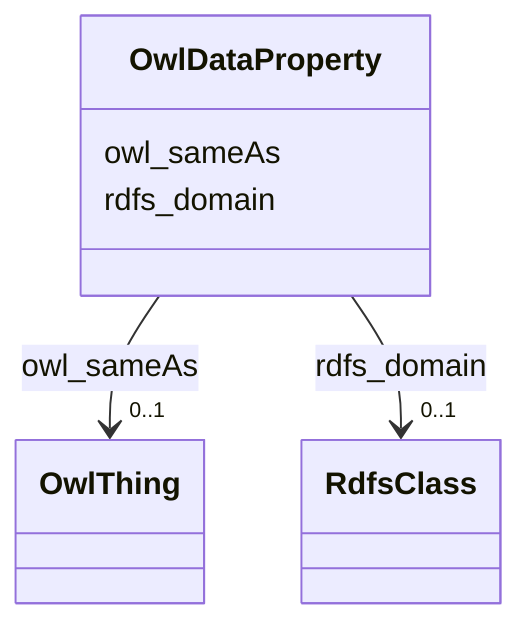

# Class: OwlDataProperty


This class occurs 3 times.


URI: [owl:DataProperty](http://www.w3.org/2002/07/owl#DataProperty)





<!-- no inheritance hierarchy -->


## Slots

| Name | Cardinality and Range | Description | Inheritance | Occurrences |
| ---  | --- | --- | --- | --- |
| [owl_sameAs](../slots/owl_sameAs.md) | 0..1 <br/> [OwlThing](../classes/OwlThing.md) | The property that determines that two given individuals are equal <br/>  | direct | 6 |
| [rdfs_domain](../slots/rdfs_domain.md) | 0..1 <br/> [RdfsClass](../classes/RdfsClass.md) | A domain of the subject property <br/>  | direct | 20 |


## LinkML Source

<!-- TODO: investigate https://stackoverflow.com/questions/37606292/how-to-create-tabbed-code-blocks-in-mkdocs-or-sphinx -->

### Direct

<details>

```yaml
name: owl_DataProperty
from_schema: okns:hydrology-kg
rank: 1000
slots:
- owl_sameAs
- rdfs_domain
class_uri: owl:DataProperty

```
</details>

### Induced

<details>

```yaml
name: owl_DataProperty
from_schema: okns:hydrology-kg
rank: 1000
attributes:
  owl_sameAs:
    name: owl_sameAs
    description: The property that determines that two given individuals are equal.
    title: sameAs
    notes:
    - No occurrences of this slot in the graph.
    from_schema: okns:owl-rdf-rdfs
    source: http://www.w3.org/2002/07/owl#
    domain: owl_Thing
    slot_uri: owl:sameAs
    alias: owl_sameAs
    owner: owl_DataProperty
    domain_of:
    - __B805a9e7d30eaabcb686b8ce670ed1e95
    - http___gwml2.org_def_gwml2#GW_Aquifer
    - http___gwml2.org_def_gwml2#GW_AquiferSystem
    - http___nhdplusv2.spatialai.org_v1_nhdplusv2#FlowPathLength
    - hyf_HY_ElementaryFlowPath
    - il_isgs_ISGS-Well
    - il_isgs_WellDepthInFt
    - il_isgs_WellPurpose
    - il_isgs_WellYield
    - kwgo_S2Cell_Level13
    - me_mgs_MGS-Well
    - me_mgs_WellDepthInFt
    - me_mgs_WellOverburdenThicknessInFt
    - me_mgs_WellType
    - me_mgs_WellUse
    - owl_DataProperty
    - us_sdwis_PWS-ServiceArea
    - us_sdwis_PWS-ServiceAreaType
    - us_sdwis_PWS-SourceWaterType
    - us_sdwis_PWS-SubFeatureActivity
    - us_sdwis_PWS-SubFeatureType
    - us_sdwis_PublicWaterSystem-CWS
    - us_sdwis_PublicWaterSystem-GW
    - us_sdwis_PublicWaterSystem-NTNCWS
    - us_sdwis_PublicWaterSystem-SW
    - us_sdwis_PublicWaterSystem-TNCWS
    range: owl_Thing
  rdfs_domain:
    name: rdfs_domain
    description: A domain of the subject property.
    title: domain
    notes:
    - No occurrences of this slot in the graph.
    from_schema: okns:owl-rdf-rdfs
    source: http://www.w3.org/2000/01/rdf-schema#
    domain: rdf_Property
    slot_uri: rdfs:domain
    alias: rdfs_domain
    owner: owl_DataProperty
    domain_of:
    - rdf_DatatypeProperty
    - owl_DataProperty
    range: rdfs_Class
class_uri: owl:DataProperty

```
</details>