# Class: No class (type) name specified -- this class is noted as a superclass of another class in this graph but has not itself been defined. (owl_Thing)


_No class (type) description specified_


This class occurs 586186 times.


URI: [owl:Thing](http://www.w3.org/2002/07/owl#Thing)

```mermaid
 classDiagram
    class OwlThing
    click OwlThing href "../OwlThing"
      OwlThing <|-- OwlNamedIndividual
        click OwlNamedIndividual href "../OwlNamedIndividual"
      OwlThing <|-- OwlNothing
        click OwlNothing href "../OwlNothing"
      
      OwlThing : badwdt_P2043
        
          
    
    
    OwlThing --> "0..1" Float : badwdt_P2043
    click Float href "../Float"

        
      OwlThing : badwdt_P403
        
          
    
    
    OwlThing --> "0..1" Any : badwdt_P403
    click Any href "../Any"

        
      OwlThing : badwdt_P885
        
          
    
    
    OwlThing --> "0..1" Any : badwdt_P885
    click Any href "../Any"

        
      OwlThing : geo_asWKT
        
          
    
    
    OwlThing --> "0..1" GeoWktLiteral : geo_asWKT
    click GeoWktLiteral href "../GeoWktLiteral"

        
      OwlThing : geo_defaultGeometry
        
          
    
    
    OwlThing --> "0..1" Any : geo_defaultGeometry
    click Any href "../Any"

        
      OwlThing : geo_hasGeometry
        
          
    
    
    OwlThing --> "0..1" Any : geo_hasGeometry
    click Any href "../Any"

        
      OwlThing : hyf__downstreamWaterbody
        
          
    
    
    OwlThing --> "0..1" Any : hyf__downstreamWaterbody
    click Any href "../Any"

        
      OwlThing : hyf__downstreamWaterbodyTC
        
          
    
    
    OwlThing --> "0..1" Any : hyf__downstreamWaterbodyTC
    click Any href "../Any"

        
      OwlThing : kwgo_sfContains
        
          
    
    
    OwlThing --> "0..1" Any : kwgo_sfContains
    click Any href "../Any"

        
      OwlThing : kwgo_sfCrosses
        
          
    
    
    OwlThing --> "0..1" Any : kwgo_sfCrosses
    click Any href "../Any"

        
      OwlThing : kwgo_sfOverlaps
        
          
    
    
    OwlThing --> "0..1" Any : kwgo_sfOverlaps
    click Any href "../Any"

        
      OwlThing : kwgo_sfWithin
        
          
    
    
    OwlThing --> "0..1" Any : kwgo_sfWithin
    click Any href "../Any"

        
      OwlThing : memgs2_SAWidAquifer
        
          
    
    
    OwlThing --> "0..1" String : memgs2_SAWidAquifer
    click String href "../String"

        
      OwlThing : owl_sameAs
        
          
    
    
    OwlThing --> "0..1" Any : owl_sameAs
    click Any href "../Any"

        
      OwlThing : prov_hadPrimarySource
        
          
    
    
    OwlThing --> "0..1" OwlThing : prov_hadPrimarySource
    click OwlThing href "../OwlThing"

        
      OwlThing : rdfs_comment
        
          
    
    
    OwlThing --> "0..1" Any : rdfs_comment
    click Any href "../Any"

        
      OwlThing : rdfs_domain
        
          
    
    
    OwlThing --> "0..1" Any : rdfs_domain
    click Any href "../Any"

        
      OwlThing : rdfs_label
        
          
    
    
    OwlThing --> "0..1" Any : rdfs_label
    click Any href "../Any"

        
      OwlThing : rdfs_range
        
          
    
    
    OwlThing --> "0..1" Any : rdfs_range
    click Any href "../Any"

        
      OwlThing : sawwater_hasCOMID
        
          
    
    
    OwlThing --> "0..1" String : sawwater_hasCOMID
    click String href "../String"

        
      OwlThing : sawwater_hasFCODE
        
          
    
    
    OwlThing --> "0..1" String : sawwater_hasFCODE
    click String href "../String"

        
      OwlThing : sawwater_hasFTYPE
        
          
    
    
    OwlThing --> "0..1" String : sawwater_hasFTYPE
    click String href "../String"

        
      OwlThing : sawwater_hasReachCode
        
          
    
    
    OwlThing --> "0..1" String : sawwater_hasReachCode
    click String href "../String"

        
      OwlThing : schema_name
        
          
    
    
    OwlThing --> "0..1" String : schema_name
    click String href "../String"

        
      
```





## Inheritance
* **OwlThing**
    * [OwlNamedIndividual](../classes/OwlNamedIndividual.md)
    * [OwlNothing](../classes/OwlNothing.md)


## Slots

| Name | Cardinality and Range | Description | Inheritance | Occurrences |
| ---  | --- | --- | --- | --- |
| [badwdt_P403](../slots/badwdt_P403.md) | 0..1 <br/> [GeoFeature](../classes/GeoFeature.md)&nbsp;or&nbsp;<br />[OwlThing](../classes/OwlThing.md) | No slot (predicate) description specified <br/>  | direct | 137674 |
| [kwgo_sfCrosses](../slots/kwgo_sfCrosses.md) | 0..1 <br/> [KwgoS2CellLevel13](../classes/KwgoS2CellLevel13.md)&nbsp;or&nbsp;<br />[OwlThing](../classes/OwlThing.md)&nbsp;or&nbsp;<br />[HyfHYWaterbody](../classes/HyfHYWaterbody.md)&nbsp;or&nbsp;<br />[HyfHYFlowPath](../classes/HyfHYFlowPath.md)&nbsp;or&nbsp;<br />[SchemaPlace](../classes/SchemaPlace.md) | No slot (predicate) description specified <br/>  | direct | 1083144 |
| [rdfs_comment](../slots/rdfs_comment.md) | 0..1 <br/> [xsd:anyURI](http://www.w3.org/2001/XMLSchema#anyURI)&nbsp;or&nbsp;<br />[xsd:string](http://www.w3.org/2001/XMLSchema#string) | No slot (predicate) description specified <br/>  | direct | 51629 |
| [badwdt_P885](../slots/badwdt_P885.md) | 0..1 <br/> [GeoFeature](../classes/GeoFeature.md)&nbsp;or&nbsp;<br />[OwlThing](../classes/OwlThing.md) | No slot (predicate) description specified <br/>  | direct | 137674 |
| [rdfs_range](../slots/rdfs_range.md) | 0..1 <br/> [OwlClass](../classes/OwlClass.md)&nbsp;or&nbsp;<br />[RdfsClass](../classes/RdfsClass.md)&nbsp;or&nbsp;<br />[OwlThing](../classes/OwlThing.md)&nbsp;or&nbsp;<br />[xsd:anyURI](http://www.w3.org/2001/XMLSchema#anyURI) | No slot (predicate) description specified <br/>  | direct | 3 |
| [kwgo_sfWithin](../slots/kwgo_sfWithin.md) | 0..1 <br/> [HyfHYWaterBody](../classes/HyfHYWaterBody.md)&nbsp;or&nbsp;<br />[OwlThing](../classes/OwlThing.md)&nbsp;or&nbsp;<br />[Gwml22GWAquifer](../classes/Gwml22GWAquifer.md) | No slot (predicate) description specified <br/>  | direct | 1812 |
| [owl_sameAs](../slots/owl_sameAs.md) | 0..1 <br/> [HyfHYWaterBody](../classes/HyfHYWaterBody.md)&nbsp;or&nbsp;<br />[KwgoS2CellLevel13](../classes/KwgoS2CellLevel13.md)&nbsp;or&nbsp;<br />[OwlThing](../classes/OwlThing.md)&nbsp;or&nbsp;<br />[xsd:anyURI](http://www.w3.org/2001/XMLSchema#anyURI)&nbsp;or&nbsp;<br />[Sf#LineString](../classes/Sf#LineString.md)&nbsp;or&nbsp;<br />[Sf#Polygon](../classes/Sf#Polygon.md)&nbsp;or&nbsp;<br />[Sf#MultiPolygon](../classes/Sf#MultiPolygon.md)&nbsp;or&nbsp;<br />[HyfHYWaterbody](../classes/HyfHYWaterbody.md)&nbsp;or&nbsp;<br />[RdfList](../classes/RdfList.md)&nbsp;or&nbsp;<br />[GeoFeature](../classes/GeoFeature.md)&nbsp;or&nbsp;<br />[GeoGeometry](../classes/GeoGeometry.md)&nbsp;or&nbsp;<br />[HyfHYFlowPath](../classes/HyfHYFlowPath.md)&nbsp;or&nbsp;<br />[SchemaPlace](../classes/SchemaPlace.md)&nbsp;or&nbsp;<br />[Gwml22GWAquifer](../classes/Gwml22GWAquifer.md)&nbsp;or&nbsp;<br />[RdfObjectProperty](../classes/RdfObjectProperty.md) | No slot (predicate) description specified <br/>  | direct | 1208520 |
| [rdfs_label](../slots/rdfs_label.md) | 0..1 <br/> [xsd:anyURI](http://www.w3.org/2001/XMLSchema#anyURI)&nbsp;or&nbsp;<br />[xsd:string](http://www.w3.org/2001/XMLSchema#string) | No slot (predicate) description specified <br/>  | direct | 16791 |
| [kwgo_sfOverlaps](../slots/kwgo_sfOverlaps.md) | 0..1 <br/> [HyfHYWaterBody](../classes/HyfHYWaterBody.md)&nbsp;or&nbsp;<br />[KwgoS2CellLevel13](../classes/KwgoS2CellLevel13.md)&nbsp;or&nbsp;<br />[OwlThing](../classes/OwlThing.md)&nbsp;or&nbsp;<br />[Gwml22GWAquifer](../classes/Gwml22GWAquifer.md) | No slot (predicate) description specified <br/>  | direct | 111498 |
| [prov_hadPrimarySource](../slots/prov_hadPrimarySource.md) | 0..1 <br/> [OwlThing](../classes/OwlThing.md) | No slot (predicate) description specified <br/>  | direct | 1256 |
| [hyf__downstreamWaterbody](../slots/hyf__downstreamWaterbody.md) | 0..1 <br/> [HyfHYFlowPath](../classes/HyfHYFlowPath.md)&nbsp;or&nbsp;<br />[SchemaPlace](../classes/SchemaPlace.md)&nbsp;or&nbsp;<br />[OwlThing](../classes/OwlThing.md)&nbsp;or&nbsp;<br />[HyfHYWaterbody](../classes/HyfHYWaterbody.md) | No slot (predicate) description specified <br/>  | direct | 550068 |
| [sawwater_hasFTYPE](../slots/sawwater_hasFTYPE.md) | 0..1 <br/> [xsd:string](http://www.w3.org/2001/XMLSchema#string) | No slot (predicate) description specified <br/>  | direct | 68837 |
| [schema_name](../slots/schema_name.md) | 0..1 <br/> [xsd:string](http://www.w3.org/2001/XMLSchema#string) | The name of the item <br/>  | direct | 33928 |
| [badwdt_P2043](../slots/badwdt_P2043.md) | 0..1 <br/> [xsd:float](http://www.w3.org/2001/XMLSchema#float) | No slot (predicate) description specified <br/>  | direct | 68837 |
| [geo_hasGeometry](../slots/geo_hasGeometry.md) | 0..1 <br/> [OwlThing](../classes/OwlThing.md)&nbsp;or&nbsp;<br />[Sf#LineString](../classes/Sf#LineString.md)&nbsp;or&nbsp;<br />[Sf#Polygon](../classes/Sf#Polygon.md)&nbsp;or&nbsp;<br />[Sf#MultiPolygon](../classes/Sf#MultiPolygon.md)&nbsp;or&nbsp;<br />[GeoGeometry](../classes/GeoGeometry.md) | No slot (predicate) description specified <br/>  | direct | 398326 |
| [sawwater_hasFCODE](../slots/sawwater_hasFCODE.md) | 0..1 <br/> [xsd:string](http://www.w3.org/2001/XMLSchema#string) | No slot (predicate) description specified <br/>  | direct | 68837 |
| [sawwater_hasCOMID](../slots/sawwater_hasCOMID.md) | 0..1 <br/> [xsd:string](http://www.w3.org/2001/XMLSchema#string) | No slot (predicate) description specified <br/>  | direct | 68837 |
| [memgs2_SAWidAquifer](../slots/memgs2_SAWidAquifer.md) | 0..1 <br/> [xsd:string](http://www.w3.org/2001/XMLSchema#string) | No slot (predicate) description specified <br/>  | direct | 1256 |
| [geo_asWKT](../slots/geo_asWKT.md) | 0..1 <br/> [GeoWktLiteral](../classes/GeoWktLiteral.md) | No slot (predicate) description specified <br/>  | direct | 224558 |
| [kwgo_sfContains](../slots/kwgo_sfContains.md) | 0..1 <br/> [KwgoS2CellLevel13](../classes/KwgoS2CellLevel13.md)&nbsp;or&nbsp;<br />[OwlThing](../classes/OwlThing.md) | No slot (predicate) description specified <br/>  | direct | 790 |
| [hyf__downstreamWaterbodyTC](../slots/hyf__downstreamWaterbodyTC.md) | 0..1 <br/> [HyfHYFlowPath](../classes/HyfHYFlowPath.md)&nbsp;or&nbsp;<br />[SchemaPlace](../classes/SchemaPlace.md)&nbsp;or&nbsp;<br />[OwlThing](../classes/OwlThing.md)&nbsp;or&nbsp;<br />[HyfHYWaterbody](../classes/HyfHYWaterbody.md) | No slot (predicate) description specified <br/>  | direct | 264557398 |
| [rdfs_domain](../slots/rdfs_domain.md) | 0..1 <br/> [OwlClass](../classes/OwlClass.md)&nbsp;or&nbsp;<br />[RdfsClass](../classes/RdfsClass.md)&nbsp;or&nbsp;<br />[OwlThing](../classes/OwlThing.md)&nbsp;or&nbsp;<br />[xsd:anyURI](http://www.w3.org/2001/XMLSchema#anyURI) | No slot (predicate) description specified <br/>  | direct | 3 |
| [sawwater_hasReachCode](../slots/sawwater_hasReachCode.md) | 0..1 <br/> [xsd:string](http://www.w3.org/2001/XMLSchema#string) | No slot (predicate) description specified <br/>  | direct | 68837 |
| [geo_defaultGeometry](../slots/geo_defaultGeometry.md) | 0..1 <br/> [OwlThing](../classes/OwlThing.md)&nbsp;or&nbsp;<br />[Sf#LineString](../classes/Sf#LineString.md)&nbsp;or&nbsp;<br />[Sf#Polygon](../classes/Sf#Polygon.md)&nbsp;or&nbsp;<br />[Sf#MultiPolygon](../classes/Sf#MultiPolygon.md)&nbsp;or&nbsp;<br />[GeoGeometry](../classes/GeoGeometry.md) | No slot (predicate) description specified <br/>  | direct | 398326 |


## Usages

| used by | used in | type | used |
| ---  | --- | --- | --- |
| [GeoFeature](../classes/GeoFeature.md) | [owl_sameAs](../slots/owl_sameAs.md) | any_of[range] | [OwlThing](../classes/OwlThing.md) |
| [GeoFeature](../classes/GeoFeature.md) | [geo_hasGeometry](../slots/geo_hasGeometry.md) | any_of[range] | [OwlThing](../classes/OwlThing.md) |
| [GeoFeature](../classes/GeoFeature.md) | [geo_defaultGeometry](../slots/geo_defaultGeometry.md) | any_of[range] | [OwlThing](../classes/OwlThing.md) |
| [GeoGeometry](../classes/GeoGeometry.md) | [owl_sameAs](../slots/owl_sameAs.md) | any_of[range] | [OwlThing](../classes/OwlThing.md) |
| [Gwml22GWAquifer](../classes/Gwml22GWAquifer.md) | [owl_sameAs](../slots/owl_sameAs.md) | any_of[range] | [OwlThing](../classes/OwlThing.md) |
| [Gwml22GWAquifer](../classes/Gwml22GWAquifer.md) | [kwgo_sfOverlaps](../slots/kwgo_sfOverlaps.md) | any_of[range] | [OwlThing](../classes/OwlThing.md) |
| [Gwml22GWAquifer](../classes/Gwml22GWAquifer.md) | [prov_hadPrimarySource](../slots/prov_hadPrimarySource.md) | range | [OwlThing](../classes/OwlThing.md) |
| [Gwml22GWAquifer](../classes/Gwml22GWAquifer.md) | [geo_hasGeometry](../slots/geo_hasGeometry.md) | any_of[range] | [OwlThing](../classes/OwlThing.md) |
| [Gwml22GWAquifer](../classes/Gwml22GWAquifer.md) | [kwgo_sfContains](../slots/kwgo_sfContains.md) | any_of[range] | [OwlThing](../classes/OwlThing.md) |
| [Gwml22GWAquifer](../classes/Gwml22GWAquifer.md) | [geo_defaultGeometry](../slots/geo_defaultGeometry.md) | any_of[range] | [OwlThing](../classes/OwlThing.md) |
| [HyfHYFlowPath](../classes/HyfHYFlowPath.md) | [badwdt_P403](../slots/badwdt_P403.md) | any_of[range] | [OwlThing](../classes/OwlThing.md) |
| [HyfHYFlowPath](../classes/HyfHYFlowPath.md) | [owl_sameAs](../slots/owl_sameAs.md) | any_of[range] | [OwlThing](../classes/OwlThing.md) |
| [HyfHYFlowPath](../classes/HyfHYFlowPath.md) | [kwgo_sfCrosses](../slots/kwgo_sfCrosses.md) | any_of[range] | [OwlThing](../classes/OwlThing.md) |
| [HyfHYFlowPath](../classes/HyfHYFlowPath.md) | [hyf__downstreamWaterbodyTC](../slots/hyf__downstreamWaterbodyTC.md) | any_of[range] | [OwlThing](../classes/OwlThing.md) |
| [HyfHYFlowPath](../classes/HyfHYFlowPath.md) | [hyf__downstreamWaterbody](../slots/hyf__downstreamWaterbody.md) | any_of[range] | [OwlThing](../classes/OwlThing.md) |
| [HyfHYFlowPath](../classes/HyfHYFlowPath.md) | [geo_hasGeometry](../slots/geo_hasGeometry.md) | any_of[range] | [OwlThing](../classes/OwlThing.md) |
| [HyfHYFlowPath](../classes/HyfHYFlowPath.md) | [badwdt_P885](../slots/badwdt_P885.md) | any_of[range] | [OwlThing](../classes/OwlThing.md) |
| [HyfHYFlowPath](../classes/HyfHYFlowPath.md) | [geo_defaultGeometry](../slots/geo_defaultGeometry.md) | any_of[range] | [OwlThing](../classes/OwlThing.md) |
| [HyfHYWaterBody](../classes/HyfHYWaterBody.md) | [owl_sameAs](../slots/owl_sameAs.md) | any_of[range] | [OwlThing](../classes/OwlThing.md) |
| [HyfHYWaterBody](../classes/HyfHYWaterBody.md) | [geo_hasGeometry](../slots/geo_hasGeometry.md) | any_of[range] | [OwlThing](../classes/OwlThing.md) |
| [HyfHYWaterBody](../classes/HyfHYWaterBody.md) | [geo_defaultGeometry](../slots/geo_defaultGeometry.md) | any_of[range] | [OwlThing](../classes/OwlThing.md) |
| [HyfHYWaterbody](../classes/HyfHYWaterbody.md) | [badwdt_P403](../slots/badwdt_P403.md) | any_of[range] | [OwlThing](../classes/OwlThing.md) |
| [HyfHYWaterbody](../classes/HyfHYWaterbody.md) | [owl_sameAs](../slots/owl_sameAs.md) | any_of[range] | [OwlThing](../classes/OwlThing.md) |
| [HyfHYWaterbody](../classes/HyfHYWaterbody.md) | [kwgo_sfCrosses](../slots/kwgo_sfCrosses.md) | any_of[range] | [OwlThing](../classes/OwlThing.md) |
| [HyfHYWaterbody](../classes/HyfHYWaterbody.md) | [hyf__downstreamWaterbodyTC](../slots/hyf__downstreamWaterbodyTC.md) | any_of[range] | [OwlThing](../classes/OwlThing.md) |
| [HyfHYWaterbody](../classes/HyfHYWaterbody.md) | [hyf__downstreamWaterbody](../slots/hyf__downstreamWaterbody.md) | any_of[range] | [OwlThing](../classes/OwlThing.md) |
| [HyfHYWaterbody](../classes/HyfHYWaterbody.md) | [geo_hasGeometry](../slots/geo_hasGeometry.md) | any_of[range] | [OwlThing](../classes/OwlThing.md) |
| [HyfHYWaterbody](../classes/HyfHYWaterbody.md) | [badwdt_P885](../slots/badwdt_P885.md) | any_of[range] | [OwlThing](../classes/OwlThing.md) |
| [HyfHYWaterbody](../classes/HyfHYWaterbody.md) | [geo_defaultGeometry](../slots/geo_defaultGeometry.md) | any_of[range] | [OwlThing](../classes/OwlThing.md) |
| [KwgoS2CellLevel13](../classes/KwgoS2CellLevel13.md) | [kwgo_sfWithin](../slots/kwgo_sfWithin.md) | any_of[range] | [OwlThing](../classes/OwlThing.md) |
| [KwgoS2CellLevel13](../classes/KwgoS2CellLevel13.md) | [owl_sameAs](../slots/owl_sameAs.md) | any_of[range] | [OwlThing](../classes/OwlThing.md) |
| [KwgoS2CellLevel13](../classes/KwgoS2CellLevel13.md) | [kwgo_sfOverlaps](../slots/kwgo_sfOverlaps.md) | any_of[range] | [OwlThing](../classes/OwlThing.md) |
| [KwgoS2CellLevel13](../classes/KwgoS2CellLevel13.md) | [kwgo_sfCrosses](../slots/kwgo_sfCrosses.md) | any_of[range] | [OwlThing](../classes/OwlThing.md) |
| [OwlNamedIndividual](../classes/OwlNamedIndividual.md) | [badwdt_P403](../slots/badwdt_P403.md) | any_of[range] | [OwlThing](../classes/OwlThing.md) |
| [OwlNamedIndividual](../classes/OwlNamedIndividual.md) | [kwgo_sfCrosses](../slots/kwgo_sfCrosses.md) | any_of[range] | [OwlThing](../classes/OwlThing.md) |
| [OwlNamedIndividual](../classes/OwlNamedIndividual.md) | [badwdt_P885](../slots/badwdt_P885.md) | any_of[range] | [OwlThing](../classes/OwlThing.md) |
| [OwlNamedIndividual](../classes/OwlNamedIndividual.md) | [rdfs_range](../slots/rdfs_range.md) | any_of[range] | [OwlThing](../classes/OwlThing.md) |
| [OwlNamedIndividual](../classes/OwlNamedIndividual.md) | [kwgo_sfWithin](../slots/kwgo_sfWithin.md) | any_of[range] | [OwlThing](../classes/OwlThing.md) |
| [OwlNamedIndividual](../classes/OwlNamedIndividual.md) | [owl_sameAs](../slots/owl_sameAs.md) | any_of[range] | [OwlThing](../classes/OwlThing.md) |
| [OwlNamedIndividual](../classes/OwlNamedIndividual.md) | [kwgo_sfOverlaps](../slots/kwgo_sfOverlaps.md) | any_of[range] | [OwlThing](../classes/OwlThing.md) |
| [OwlNamedIndividual](../classes/OwlNamedIndividual.md) | [prov_hadPrimarySource](../slots/prov_hadPrimarySource.md) | range | [OwlThing](../classes/OwlThing.md) |
| [OwlNamedIndividual](../classes/OwlNamedIndividual.md) | [hyf__downstreamWaterbody](../slots/hyf__downstreamWaterbody.md) | any_of[range] | [OwlThing](../classes/OwlThing.md) |
| [OwlNamedIndividual](../classes/OwlNamedIndividual.md) | [geo_hasGeometry](../slots/geo_hasGeometry.md) | any_of[range] | [OwlThing](../classes/OwlThing.md) |
| [OwlNamedIndividual](../classes/OwlNamedIndividual.md) | [kwgo_sfContains](../slots/kwgo_sfContains.md) | any_of[range] | [OwlThing](../classes/OwlThing.md) |
| [OwlNamedIndividual](../classes/OwlNamedIndividual.md) | [hyf__downstreamWaterbodyTC](../slots/hyf__downstreamWaterbodyTC.md) | any_of[range] | [OwlThing](../classes/OwlThing.md) |
| [OwlNamedIndividual](../classes/OwlNamedIndividual.md) | [rdfs_domain](../slots/rdfs_domain.md) | any_of[range] | [OwlThing](../classes/OwlThing.md) |
| [OwlNamedIndividual](../classes/OwlNamedIndividual.md) | [geo_defaultGeometry](../slots/geo_defaultGeometry.md) | any_of[range] | [OwlThing](../classes/OwlThing.md) |
| [OwlNothing](../classes/OwlNothing.md) | [badwdt_P403](../slots/badwdt_P403.md) | any_of[range] | [OwlThing](../classes/OwlThing.md) |
| [OwlNothing](../classes/OwlNothing.md) | [kwgo_sfCrosses](../slots/kwgo_sfCrosses.md) | any_of[range] | [OwlThing](../classes/OwlThing.md) |
| [OwlNothing](../classes/OwlNothing.md) | [badwdt_P885](../slots/badwdt_P885.md) | any_of[range] | [OwlThing](../classes/OwlThing.md) |
| [OwlNothing](../classes/OwlNothing.md) | [rdfs_range](../slots/rdfs_range.md) | any_of[range] | [OwlThing](../classes/OwlThing.md) |
| [OwlNothing](../classes/OwlNothing.md) | [kwgo_sfWithin](../slots/kwgo_sfWithin.md) | any_of[range] | [OwlThing](../classes/OwlThing.md) |
| [OwlNothing](../classes/OwlNothing.md) | [owl_sameAs](../slots/owl_sameAs.md) | any_of[range] | [OwlThing](../classes/OwlThing.md) |
| [OwlNothing](../classes/OwlNothing.md) | [kwgo_sfOverlaps](../slots/kwgo_sfOverlaps.md) | any_of[range] | [OwlThing](../classes/OwlThing.md) |
| [OwlNothing](../classes/OwlNothing.md) | [prov_hadPrimarySource](../slots/prov_hadPrimarySource.md) | range | [OwlThing](../classes/OwlThing.md) |
| [OwlNothing](../classes/OwlNothing.md) | [hyf__downstreamWaterbody](../slots/hyf__downstreamWaterbody.md) | any_of[range] | [OwlThing](../classes/OwlThing.md) |
| [OwlNothing](../classes/OwlNothing.md) | [geo_hasGeometry](../slots/geo_hasGeometry.md) | any_of[range] | [OwlThing](../classes/OwlThing.md) |
| [OwlNothing](../classes/OwlNothing.md) | [kwgo_sfContains](../slots/kwgo_sfContains.md) | any_of[range] | [OwlThing](../classes/OwlThing.md) |
| [OwlNothing](../classes/OwlNothing.md) | [hyf__downstreamWaterbodyTC](../slots/hyf__downstreamWaterbodyTC.md) | any_of[range] | [OwlThing](../classes/OwlThing.md) |
| [OwlNothing](../classes/OwlNothing.md) | [rdfs_domain](../slots/rdfs_domain.md) | any_of[range] | [OwlThing](../classes/OwlThing.md) |
| [OwlNothing](../classes/OwlNothing.md) | [geo_defaultGeometry](../slots/geo_defaultGeometry.md) | any_of[range] | [OwlThing](../classes/OwlThing.md) |
| [OwlThing](../classes/OwlThing.md) | [badwdt_P403](../slots/badwdt_P403.md) | any_of[range] | [OwlThing](../classes/OwlThing.md) |
| [OwlThing](../classes/OwlThing.md) | [kwgo_sfCrosses](../slots/kwgo_sfCrosses.md) | any_of[range] | [OwlThing](../classes/OwlThing.md) |
| [OwlThing](../classes/OwlThing.md) | [badwdt_P885](../slots/badwdt_P885.md) | any_of[range] | [OwlThing](../classes/OwlThing.md) |
| [OwlThing](../classes/OwlThing.md) | [rdfs_range](../slots/rdfs_range.md) | any_of[range] | [OwlThing](../classes/OwlThing.md) |
| [OwlThing](../classes/OwlThing.md) | [kwgo_sfWithin](../slots/kwgo_sfWithin.md) | any_of[range] | [OwlThing](../classes/OwlThing.md) |
| [OwlThing](../classes/OwlThing.md) | [owl_sameAs](../slots/owl_sameAs.md) | any_of[range] | [OwlThing](../classes/OwlThing.md) |
| [OwlThing](../classes/OwlThing.md) | [kwgo_sfOverlaps](../slots/kwgo_sfOverlaps.md) | any_of[range] | [OwlThing](../classes/OwlThing.md) |
| [OwlThing](../classes/OwlThing.md) | [prov_hadPrimarySource](../slots/prov_hadPrimarySource.md) | range | [OwlThing](../classes/OwlThing.md) |
| [OwlThing](../classes/OwlThing.md) | [hyf__downstreamWaterbody](../slots/hyf__downstreamWaterbody.md) | any_of[range] | [OwlThing](../classes/OwlThing.md) |
| [OwlThing](../classes/OwlThing.md) | [geo_hasGeometry](../slots/geo_hasGeometry.md) | any_of[range] | [OwlThing](../classes/OwlThing.md) |
| [OwlThing](../classes/OwlThing.md) | [kwgo_sfContains](../slots/kwgo_sfContains.md) | any_of[range] | [OwlThing](../classes/OwlThing.md) |
| [OwlThing](../classes/OwlThing.md) | [hyf__downstreamWaterbodyTC](../slots/hyf__downstreamWaterbodyTC.md) | any_of[range] | [OwlThing](../classes/OwlThing.md) |
| [OwlThing](../classes/OwlThing.md) | [rdfs_domain](../slots/rdfs_domain.md) | any_of[range] | [OwlThing](../classes/OwlThing.md) |
| [OwlThing](../classes/OwlThing.md) | [geo_defaultGeometry](../slots/geo_defaultGeometry.md) | any_of[range] | [OwlThing](../classes/OwlThing.md) |
| [RdfList](../classes/RdfList.md) | [owl_sameAs](../slots/owl_sameAs.md) | any_of[range] | [OwlThing](../classes/OwlThing.md) |
| [RdfObjectProperty](../classes/RdfObjectProperty.md) | [rdfs_domain](../slots/rdfs_domain.md) | any_of[range] | [OwlThing](../classes/OwlThing.md) |
| [RdfObjectProperty](../classes/RdfObjectProperty.md) | [owl_sameAs](../slots/owl_sameAs.md) | any_of[range] | [OwlThing](../classes/OwlThing.md) |
| [RdfObjectProperty](../classes/RdfObjectProperty.md) | [rdfs_range](../slots/rdfs_range.md) | any_of[range] | [OwlThing](../classes/OwlThing.md) |
| [SchemaPlace](../classes/SchemaPlace.md) | [badwdt_P403](../slots/badwdt_P403.md) | any_of[range] | [OwlThing](../classes/OwlThing.md) |
| [SchemaPlace](../classes/SchemaPlace.md) | [owl_sameAs](../slots/owl_sameAs.md) | any_of[range] | [OwlThing](../classes/OwlThing.md) |
| [SchemaPlace](../classes/SchemaPlace.md) | [kwgo_sfCrosses](../slots/kwgo_sfCrosses.md) | any_of[range] | [OwlThing](../classes/OwlThing.md) |
| [SchemaPlace](../classes/SchemaPlace.md) | [hyf__downstreamWaterbodyTC](../slots/hyf__downstreamWaterbodyTC.md) | any_of[range] | [OwlThing](../classes/OwlThing.md) |
| [SchemaPlace](../classes/SchemaPlace.md) | [hyf__downstreamWaterbody](../slots/hyf__downstreamWaterbody.md) | any_of[range] | [OwlThing](../classes/OwlThing.md) |
| [SchemaPlace](../classes/SchemaPlace.md) | [geo_hasGeometry](../slots/geo_hasGeometry.md) | any_of[range] | [OwlThing](../classes/OwlThing.md) |
| [SchemaPlace](../classes/SchemaPlace.md) | [badwdt_P885](../slots/badwdt_P885.md) | any_of[range] | [OwlThing](../classes/OwlThing.md) |
| [SchemaPlace](../classes/SchemaPlace.md) | [geo_defaultGeometry](../slots/geo_defaultGeometry.md) | any_of[range] | [OwlThing](../classes/OwlThing.md) |
| [Sf#LineString](../classes/Sf#LineString.md) | [owl_sameAs](../slots/owl_sameAs.md) | any_of[range] | [OwlThing](../classes/OwlThing.md) |
| [Sf#MultiPolygon](../classes/Sf#MultiPolygon.md) | [owl_sameAs](../slots/owl_sameAs.md) | any_of[range] | [OwlThing](../classes/OwlThing.md) |
| [Sf#Polygon](../classes/Sf#Polygon.md) | [owl_sameAs](../slots/owl_sameAs.md) | any_of[range] | [OwlThing](../classes/OwlThing.md) |


## LinkML Source

<!-- TODO: investigate https://stackoverflow.com/questions/37606292/how-to-create-tabbed-code-blocks-in-mkdocs-or-sphinx -->

### Direct

<details>

```yaml
name: owl_Thing
conforms_to: No schema conformance document specified
annotations:
  count:
    tag: count
    value: 586186
description: No class (type) description specified
title: No class (type) name specified -- this class is noted as a superclass of another
  class in this graph but has not itself been defined.
from_schema: hydrology-kg
rank: 1000
slots:
- badwdt_P403
- kwgo_sfCrosses
- rdfs_comment
- badwdt_P885
- rdfs_range
- kwgo_sfWithin
- owl_sameAs
- rdfs_label
- kwgo_sfOverlaps
- prov_hadPrimarySource
- hyf__downstreamWaterbody
- sawwater_hasFTYPE
- schema_name
- badwdt_P2043
- geo_hasGeometry
- sawwater_hasFCODE
- sawwater_hasCOMID
- memgs2_SAWidAquifer
- geo_asWKT
- kwgo_sfContains
- hyf__downstreamWaterbodyTC
- rdfs_domain
- sawwater_hasReachCode
- geo_defaultGeometry
slot_usage:
  badwdt_P2043:
    name: badwdt_P2043
    annotations:
      float:
        tag: float
        value: 68837
  badwdt_P403:
    name: badwdt_P403
    annotations:
      geo_Feature:
        tag: geo_Feature
        value: 68837
      owl_Thing:
        tag: owl_Thing
        value: 68837
  badwdt_P885:
    name: badwdt_P885
    annotations:
      geo_Feature:
        tag: geo_Feature
        value: 68837
      owl_Thing:
        tag: owl_Thing
        value: 68837
  geo_asWKT:
    name: geo_asWKT
    annotations:
      geo_wktLiteral:
        tag: geo_wktLiteral
        value: 224558
  geo_defaultGeometry:
    name: geo_defaultGeometry
    annotations:
      geo_Geometry:
        tag: geo_Geometry
        value: 86884
      owl_Thing:
        tag: owl_Thing
        value: 224558
      sf_#LineString:
        tag: sf_#LineString
        value: 68837
      sf_#MultiPolygon:
        tag: sf_#MultiPolygon
        value: 16803
      sf_#Polygon:
        tag: sf_#Polygon
        value: 1244
  geo_hasGeometry:
    name: geo_hasGeometry
    annotations:
      geo_Geometry:
        tag: geo_Geometry
        value: 86884
      owl_Thing:
        tag: owl_Thing
        value: 224558
      sf_#LineString:
        tag: sf_#LineString
        value: 68837
      sf_#MultiPolygon:
        tag: sf_#MultiPolygon
        value: 16803
      sf_#Polygon:
        tag: sf_#Polygon
        value: 1244
  hyf__downstreamWaterbody:
    name: hyf__downstreamWaterbody
    annotations:
      hyf__HY_FlowPath:
        tag: hyf__HY_FlowPath
        value: 137468
      hyf__HY_Waterbody:
        tag: hyf__HY_Waterbody
        value: 137468
      owl_Thing:
        tag: owl_Thing
        value: 137664
      schema_Place:
        tag: schema_Place
        value: 137468
  hyf__downstreamWaterbodyTC:
    name: hyf__downstreamWaterbodyTC
    annotations:
      hyf__HY_FlowPath:
        tag: hyf__HY_FlowPath
        value: 66122373
      hyf__HY_Waterbody:
        tag: hyf__HY_Waterbody
        value: 66122373
      owl_Thing:
        tag: owl_Thing
        value: 66190279
      schema_Place:
        tag: schema_Place
        value: 66122373
  kwgo_sfContains:
    name: kwgo_sfContains
    annotations:
      kwgo_S2Cell_Level13:
        tag: kwgo_S2Cell_Level13
        value: 395
      owl_Thing:
        tag: owl_Thing
        value: 395
  kwgo_sfCrosses:
    name: kwgo_sfCrosses
    annotations:
      hyf__HY_FlowPath:
        tag: hyf__HY_FlowPath
        value: 197673
      hyf__HY_Waterbody:
        tag: hyf__HY_Waterbody
        value: 197673
      kwgo_S2Cell_Level13:
        tag: kwgo_S2Cell_Level13
        value: 94779
      owl_Thing:
        tag: owl_Thing
        value: 395346
      schema_Place:
        tag: schema_Place
        value: 197673
  kwgo_sfOverlaps:
    name: kwgo_sfOverlaps
    annotations:
      gwml22_GW_Aquifer:
        tag: gwml22_GW_Aquifer
        value: 14223
      hyf__HY_WaterBody:
        tag: hyf__HY_WaterBody
        value: 27309
      kwgo_S2Cell_Level13:
        tag: kwgo_S2Cell_Level13
        value: 14211
      owl_Thing:
        tag: owl_Thing
        value: 55755
  kwgo_sfWithin:
    name: kwgo_sfWithin
    annotations:
      gwml22_GW_Aquifer:
        tag: gwml22_GW_Aquifer
        value: 395
      hyf__HY_WaterBody:
        tag: hyf__HY_WaterBody
        value: 511
      owl_Thing:
        tag: owl_Thing
        value: 906
  memgs2_SAWidAquifer:
    name: memgs2_SAWidAquifer
    annotations:
      string:
        tag: string
        value: 1256
  owl_sameAs:
    name: owl_sameAs
    annotations:
      geo_Feature:
        tag: geo_Feature
        value: 137674
      geo_Geometry:
        tag: geo_Geometry
        value: 86884
      gwml22_GW_Aquifer:
        tag: gwml22_GW_Aquifer
        value: 1256
      hyf__HY_FlowPath:
        tag: hyf__HY_FlowPath
        value: 68837
      hyf__HY_WaterBody:
        tag: hyf__HY_WaterBody
        value: 16791
      hyf__HY_Waterbody:
        tag: hyf__HY_Waterbody
        value: 68837
      kwgo_S2Cell_Level13:
        tag: kwgo_S2Cell_Level13
        value: 86332
      owl_Thing:
        tag: owl_Thing
        value: 586186
      rdf_List:
        tag: rdf_List
        value: 1
      rdf_ObjectProperty:
        tag: rdf_ObjectProperty
        value: 1
      schema_Place:
        tag: schema_Place
        value: 68837
      sf_#LineString:
        tag: sf_#LineString
        value: 68837
      sf_#MultiPolygon:
        tag: sf_#MultiPolygon
        value: 16803
      sf_#Polygon:
        tag: sf_#Polygon
        value: 1244
  prov_hadPrimarySource:
    name: prov_hadPrimarySource
    annotations:
      owl_Thing:
        tag: owl_Thing
        value: 1256
  rdfs_comment:
    name: rdfs_comment
    annotations:
      string:
        tag: string
        value: 51629
  rdfs_domain:
    name: rdfs_domain
    annotations:
      owl_Class:
        tag: owl_Class
        value: 1
      owl_Thing:
        tag: owl_Thing
        value: 1
      rdfs_Class:
        tag: rdfs_Class
        value: 1
  rdfs_label:
    name: rdfs_label
    annotations:
      string:
        tag: string
        value: 16791
  rdfs_range:
    name: rdfs_range
    annotations:
      owl_Class:
        tag: owl_Class
        value: 1
      owl_Thing:
        tag: owl_Thing
        value: 1
      rdfs_Class:
        tag: rdfs_Class
        value: 1
  sawwater_hasCOMID:
    name: sawwater_hasCOMID
    annotations:
      string:
        tag: string
        value: 68837
  sawwater_hasFCODE:
    name: sawwater_hasFCODE
    annotations:
      string:
        tag: string
        value: 68837
  sawwater_hasFTYPE:
    name: sawwater_hasFTYPE
    annotations:
      string:
        tag: string
        value: 68837
  sawwater_hasReachCode:
    name: sawwater_hasReachCode
    annotations:
      string:
        tag: string
        value: 68837
  schema_name:
    name: schema_name
    annotations:
      string:
        tag: string
        value: 33928
class_uri: owl:Thing

```
</details>

### Induced

<details>

```yaml
name: owl_Thing
conforms_to: No schema conformance document specified
annotations:
  count:
    tag: count
    value: 586186
description: No class (type) description specified
title: No class (type) name specified -- this class is noted as a superclass of another
  class in this graph but has not itself been defined.
from_schema: hydrology-kg
rank: 1000
slot_usage:
  badwdt_P2043:
    name: badwdt_P2043
    annotations:
      float:
        tag: float
        value: 68837
  badwdt_P403:
    name: badwdt_P403
    annotations:
      geo_Feature:
        tag: geo_Feature
        value: 68837
      owl_Thing:
        tag: owl_Thing
        value: 68837
  badwdt_P885:
    name: badwdt_P885
    annotations:
      geo_Feature:
        tag: geo_Feature
        value: 68837
      owl_Thing:
        tag: owl_Thing
        value: 68837
  geo_asWKT:
    name: geo_asWKT
    annotations:
      geo_wktLiteral:
        tag: geo_wktLiteral
        value: 224558
  geo_defaultGeometry:
    name: geo_defaultGeometry
    annotations:
      geo_Geometry:
        tag: geo_Geometry
        value: 86884
      owl_Thing:
        tag: owl_Thing
        value: 224558
      sf_#LineString:
        tag: sf_#LineString
        value: 68837
      sf_#MultiPolygon:
        tag: sf_#MultiPolygon
        value: 16803
      sf_#Polygon:
        tag: sf_#Polygon
        value: 1244
  geo_hasGeometry:
    name: geo_hasGeometry
    annotations:
      geo_Geometry:
        tag: geo_Geometry
        value: 86884
      owl_Thing:
        tag: owl_Thing
        value: 224558
      sf_#LineString:
        tag: sf_#LineString
        value: 68837
      sf_#MultiPolygon:
        tag: sf_#MultiPolygon
        value: 16803
      sf_#Polygon:
        tag: sf_#Polygon
        value: 1244
  hyf__downstreamWaterbody:
    name: hyf__downstreamWaterbody
    annotations:
      hyf__HY_FlowPath:
        tag: hyf__HY_FlowPath
        value: 137468
      hyf__HY_Waterbody:
        tag: hyf__HY_Waterbody
        value: 137468
      owl_Thing:
        tag: owl_Thing
        value: 137664
      schema_Place:
        tag: schema_Place
        value: 137468
  hyf__downstreamWaterbodyTC:
    name: hyf__downstreamWaterbodyTC
    annotations:
      hyf__HY_FlowPath:
        tag: hyf__HY_FlowPath
        value: 66122373
      hyf__HY_Waterbody:
        tag: hyf__HY_Waterbody
        value: 66122373
      owl_Thing:
        tag: owl_Thing
        value: 66190279
      schema_Place:
        tag: schema_Place
        value: 66122373
  kwgo_sfContains:
    name: kwgo_sfContains
    annotations:
      kwgo_S2Cell_Level13:
        tag: kwgo_S2Cell_Level13
        value: 395
      owl_Thing:
        tag: owl_Thing
        value: 395
  kwgo_sfCrosses:
    name: kwgo_sfCrosses
    annotations:
      hyf__HY_FlowPath:
        tag: hyf__HY_FlowPath
        value: 197673
      hyf__HY_Waterbody:
        tag: hyf__HY_Waterbody
        value: 197673
      kwgo_S2Cell_Level13:
        tag: kwgo_S2Cell_Level13
        value: 94779
      owl_Thing:
        tag: owl_Thing
        value: 395346
      schema_Place:
        tag: schema_Place
        value: 197673
  kwgo_sfOverlaps:
    name: kwgo_sfOverlaps
    annotations:
      gwml22_GW_Aquifer:
        tag: gwml22_GW_Aquifer
        value: 14223
      hyf__HY_WaterBody:
        tag: hyf__HY_WaterBody
        value: 27309
      kwgo_S2Cell_Level13:
        tag: kwgo_S2Cell_Level13
        value: 14211
      owl_Thing:
        tag: owl_Thing
        value: 55755
  kwgo_sfWithin:
    name: kwgo_sfWithin
    annotations:
      gwml22_GW_Aquifer:
        tag: gwml22_GW_Aquifer
        value: 395
      hyf__HY_WaterBody:
        tag: hyf__HY_WaterBody
        value: 511
      owl_Thing:
        tag: owl_Thing
        value: 906
  memgs2_SAWidAquifer:
    name: memgs2_SAWidAquifer
    annotations:
      string:
        tag: string
        value: 1256
  owl_sameAs:
    name: owl_sameAs
    annotations:
      geo_Feature:
        tag: geo_Feature
        value: 137674
      geo_Geometry:
        tag: geo_Geometry
        value: 86884
      gwml22_GW_Aquifer:
        tag: gwml22_GW_Aquifer
        value: 1256
      hyf__HY_FlowPath:
        tag: hyf__HY_FlowPath
        value: 68837
      hyf__HY_WaterBody:
        tag: hyf__HY_WaterBody
        value: 16791
      hyf__HY_Waterbody:
        tag: hyf__HY_Waterbody
        value: 68837
      kwgo_S2Cell_Level13:
        tag: kwgo_S2Cell_Level13
        value: 86332
      owl_Thing:
        tag: owl_Thing
        value: 586186
      rdf_List:
        tag: rdf_List
        value: 1
      rdf_ObjectProperty:
        tag: rdf_ObjectProperty
        value: 1
      schema_Place:
        tag: schema_Place
        value: 68837
      sf_#LineString:
        tag: sf_#LineString
        value: 68837
      sf_#MultiPolygon:
        tag: sf_#MultiPolygon
        value: 16803
      sf_#Polygon:
        tag: sf_#Polygon
        value: 1244
  prov_hadPrimarySource:
    name: prov_hadPrimarySource
    annotations:
      owl_Thing:
        tag: owl_Thing
        value: 1256
  rdfs_comment:
    name: rdfs_comment
    annotations:
      string:
        tag: string
        value: 51629
  rdfs_domain:
    name: rdfs_domain
    annotations:
      owl_Class:
        tag: owl_Class
        value: 1
      owl_Thing:
        tag: owl_Thing
        value: 1
      rdfs_Class:
        tag: rdfs_Class
        value: 1
  rdfs_label:
    name: rdfs_label
    annotations:
      string:
        tag: string
        value: 16791
  rdfs_range:
    name: rdfs_range
    annotations:
      owl_Class:
        tag: owl_Class
        value: 1
      owl_Thing:
        tag: owl_Thing
        value: 1
      rdfs_Class:
        tag: rdfs_Class
        value: 1
  sawwater_hasCOMID:
    name: sawwater_hasCOMID
    annotations:
      string:
        tag: string
        value: 68837
  sawwater_hasFCODE:
    name: sawwater_hasFCODE
    annotations:
      string:
        tag: string
        value: 68837
  sawwater_hasFTYPE:
    name: sawwater_hasFTYPE
    annotations:
      string:
        tag: string
        value: 68837
  sawwater_hasReachCode:
    name: sawwater_hasReachCode
    annotations:
      string:
        tag: string
        value: 68837
  schema_name:
    name: schema_name
    annotations:
      string:
        tag: string
        value: 33928
attributes:
  badwdt_P403:
    name: badwdt_P403
    annotations:
      geo_Feature:
        tag: geo_Feature
        value: 68837
      owl_Thing:
        tag: owl_Thing
        value: 68837
    description: No slot (predicate) description specified
    title: No slot (predicate) name specified
    examples:
    - object:
        example_object: https://geoconnex.us/nhdplusv2/comid/1001.outlet
        example_object_type: geo_Feature
        example_predicate: badwdt:P403
        example_subject: https://geoconnex.us/nhdplusv2/comid/1001
        example_subject_type: hyf__HY_Waterbody
    - object:
        example_object: https://geoconnex.us/nhdplusv2/comid/1001.outlet
        example_object_type: owl_Thing
        example_predicate: badwdt:P403
        example_subject: https://geoconnex.us/nhdplusv2/comid/1001
        example_subject_type: hyf__HY_Waterbody
    - object:
        example_object: https://geoconnex.us/nhdplusv2/comid/1001.outlet
        example_object_type: geo_Feature
        example_predicate: badwdt:P403
        example_subject: https://geoconnex.us/nhdplusv2/comid/1001
        example_subject_type: schema_Place
    - object:
        example_object: https://geoconnex.us/nhdplusv2/comid/1001.outlet
        example_object_type: owl_Thing
        example_predicate: badwdt:P403
        example_subject: https://geoconnex.us/nhdplusv2/comid/1001
        example_subject_type: schema_Place
    - object:
        example_object: https://geoconnex.us/nhdplusv2/comid/1001.outlet
        example_object_type: geo_Feature
        example_predicate: badwdt:P403
        example_subject: https://geoconnex.us/nhdplusv2/comid/1001
        example_subject_type: owl_Thing
    - object:
        example_object: https://geoconnex.us/nhdplusv2/comid/1001.outlet
        example_object_type: owl_Thing
        example_predicate: badwdt:P403
        example_subject: https://geoconnex.us/nhdplusv2/comid/1001
        example_subject_type: owl_Thing
    - object:
        example_object: https://geoconnex.us/nhdplusv2/comid/1001.outlet
        example_object_type: geo_Feature
        example_predicate: badwdt:P403
        example_subject: https://geoconnex.us/nhdplusv2/comid/1001
        example_subject_type: hyf__HY_FlowPath
    - object:
        example_object: https://geoconnex.us/nhdplusv2/comid/1001.outlet
        example_object_type: owl_Thing
        example_predicate: badwdt:P403
        example_subject: https://geoconnex.us/nhdplusv2/comid/1001
        example_subject_type: hyf__HY_FlowPath
    from_schema: hydrology-kg
    rank: 1000
    slot_uri: badwdt:P403
    alias: badwdt_P403
    owner: owl_Thing
    domain_of:
    - hyf__HY_FlowPath
    - hyf__HY_Waterbody
    - owl_Thing
    - schema_Place
    range: Any
    any_of:
    - range: geo_Feature
    - range: owl_Thing
  kwgo_sfCrosses:
    name: kwgo_sfCrosses
    annotations:
      hyf__HY_FlowPath:
        tag: hyf__HY_FlowPath
        value: 197673
      hyf__HY_Waterbody:
        tag: hyf__HY_Waterbody
        value: 197673
      kwgo_S2Cell_Level13:
        tag: kwgo_S2Cell_Level13
        value: 94779
      owl_Thing:
        tag: owl_Thing
        value: 395346
      schema_Place:
        tag: schema_Place
        value: 197673
    description: No slot (predicate) description specified
    title: No slot (predicate) name specified
    examples:
    - object:
        example_object: https://geoconnex.us/nhdplusv2/comid/166195770
        example_object_type: hyf__HY_Waterbody
        example_predicate: kwgo:sfCrosses
        example_subject: kwgr:s2.level13.5522339705040928768
        example_subject_type: owl_Thing
    - object:
        example_object: https://geoconnex.us/nhdplusv2/comid/166195770
        example_object_type: schema_Place
        example_predicate: kwgo:sfCrosses
        example_subject: kwgr:s2.level13.5522339705040928768
        example_subject_type: owl_Thing
    - object:
        example_object: https://geoconnex.us/nhdplusv2/comid/166195770
        example_object_type: owl_Thing
        example_predicate: kwgo:sfCrosses
        example_subject: kwgr:s2.level13.5522339705040928768
        example_subject_type: owl_Thing
    - object:
        example_object: https://geoconnex.us/nhdplusv2/comid/166195770
        example_object_type: hyf__HY_FlowPath
        example_predicate: kwgo:sfCrosses
        example_subject: kwgr:s2.level13.5522339705040928768
        example_subject_type: owl_Thing
    - object:
        example_object: https://geoconnex.us/nhdplusv2/comid/803107
        example_object_type: hyf__HY_Waterbody
        example_predicate: kwgo:sfCrosses
        example_subject: kwgr:s2.level13.5522341904064184320
        example_subject_type: kwgo_S2Cell_Level13
    - object:
        example_object: https://geoconnex.us/nhdplusv2/comid/803107
        example_object_type: schema_Place
        example_predicate: kwgo:sfCrosses
        example_subject: kwgr:s2.level13.5522341904064184320
        example_subject_type: kwgo_S2Cell_Level13
    - object:
        example_object: https://geoconnex.us/nhdplusv2/comid/803107
        example_object_type: owl_Thing
        example_predicate: kwgo:sfCrosses
        example_subject: kwgr:s2.level13.5522341904064184320
        example_subject_type: kwgo_S2Cell_Level13
    - object:
        example_object: https://geoconnex.us/nhdplusv2/comid/803107
        example_object_type: hyf__HY_FlowPath
        example_predicate: kwgo:sfCrosses
        example_subject: kwgr:s2.level13.5522341904064184320
        example_subject_type: kwgo_S2Cell_Level13
    - object:
        example_object: kwgr:s2.level13.5522769236130267136
        example_object_type: kwgo_S2Cell_Level13
        example_predicate: kwgo:sfCrosses
        example_subject: https://geoconnex.us/nhdplusv2/comid/1001
        example_subject_type: hyf__HY_Waterbody
    - object:
        example_object: kwgr:s2.level13.5522769236130267136
        example_object_type: owl_Thing
        example_predicate: kwgo:sfCrosses
        example_subject: https://geoconnex.us/nhdplusv2/comid/1001
        example_subject_type: hyf__HY_Waterbody
    - object:
        example_object: kwgr:s2.level13.5522769236130267136
        example_object_type: kwgo_S2Cell_Level13
        example_predicate: kwgo:sfCrosses
        example_subject: https://geoconnex.us/nhdplusv2/comid/1001
        example_subject_type: schema_Place
    - object:
        example_object: kwgr:s2.level13.5522769236130267136
        example_object_type: owl_Thing
        example_predicate: kwgo:sfCrosses
        example_subject: https://geoconnex.us/nhdplusv2/comid/1001
        example_subject_type: schema_Place
    - object:
        example_object: kwgr:s2.level13.5522769236130267136
        example_object_type: kwgo_S2Cell_Level13
        example_predicate: kwgo:sfCrosses
        example_subject: https://geoconnex.us/nhdplusv2/comid/1001
        example_subject_type: owl_Thing
    - object:
        example_object: kwgr:s2.level13.5522769236130267136
        example_object_type: kwgo_S2Cell_Level13
        example_predicate: kwgo:sfCrosses
        example_subject: https://geoconnex.us/nhdplusv2/comid/1001
        example_subject_type: hyf__HY_FlowPath
    - object:
        example_object: kwgr:s2.level13.5522769236130267136
        example_object_type: owl_Thing
        example_predicate: kwgo:sfCrosses
        example_subject: https://geoconnex.us/nhdplusv2/comid/1001
        example_subject_type: hyf__HY_FlowPath
    from_schema: hydrology-kg
    rank: 1000
    slot_uri: kwgo:sfCrosses
    alias: kwgo_sfCrosses
    owner: owl_Thing
    domain_of:
    - hyf__HY_FlowPath
    - hyf__HY_Waterbody
    - kwgo_S2Cell_Level13
    - owl_Thing
    - schema_Place
    range: Any
    any_of:
    - range: kwgo_S2Cell_Level13
    - range: owl_Thing
    - range: hyf__HY_Waterbody
    - range: hyf__HY_FlowPath
    - range: schema_Place
  rdfs_comment:
    name: rdfs_comment
    annotations:
      string:
        tag: string
        value: 51629
    description: No slot (predicate) description specified
    title: No slot (predicate) name specified
    examples:
    - object:
        example_object: 'Original MGS IDs: 9110 9363 9524'
        example_object_type: string
        example_predicate: rdfs:comment
        example_subject: http://sawgraph.spatialai.org/v1/me_mgs_data#d.MGS-Aquifer.0001
        example_subject_type: gwml22_GW_Aquifer
    - object:
        example_object: 'Original MGS IDs: 9110 9363 9524'
        example_object_type: string
        example_predicate: rdfs:comment
        example_subject: http://sawgraph.spatialai.org/v1/me_mgs_data#d.MGS-Aquifer.0001
        example_subject_type: owl_Thing
    - object:
        example_object: 'COMID: 10101972'
        example_object_type: string
        example_predicate: rdfs:comment
        example_subject: https://geoconnex.us/nhdplusv2/comid/10101972
        example_subject_type: hyf__HY_WaterBody
    from_schema: hydrology-kg
    rank: 1000
    slot_uri: rdfs:comment
    alias: rdfs_comment
    owner: owl_Thing
    domain_of:
    - gwml22_GW_Aquifer
    - hyf__HY_WaterBody
    - owl_Thing
    range: Any
    any_of:
    - range: uri
    - range: string
  badwdt_P885:
    name: badwdt_P885
    annotations:
      geo_Feature:
        tag: geo_Feature
        value: 68837
      owl_Thing:
        tag: owl_Thing
        value: 68837
    description: No slot (predicate) description specified
    title: No slot (predicate) name specified
    examples:
    - object:
        example_object: https://geoconnex.us/nhdplusv2/comid/1001.head
        example_object_type: geo_Feature
        example_predicate: badwdt:P885
        example_subject: https://geoconnex.us/nhdplusv2/comid/1001
        example_subject_type: hyf__HY_Waterbody
    - object:
        example_object: https://geoconnex.us/nhdplusv2/comid/1001.head
        example_object_type: owl_Thing
        example_predicate: badwdt:P885
        example_subject: https://geoconnex.us/nhdplusv2/comid/1001
        example_subject_type: hyf__HY_Waterbody
    - object:
        example_object: https://geoconnex.us/nhdplusv2/comid/1001.head
        example_object_type: geo_Feature
        example_predicate: badwdt:P885
        example_subject: https://geoconnex.us/nhdplusv2/comid/1001
        example_subject_type: schema_Place
    - object:
        example_object: https://geoconnex.us/nhdplusv2/comid/1001.head
        example_object_type: owl_Thing
        example_predicate: badwdt:P885
        example_subject: https://geoconnex.us/nhdplusv2/comid/1001
        example_subject_type: schema_Place
    - object:
        example_object: https://geoconnex.us/nhdplusv2/comid/1001.head
        example_object_type: geo_Feature
        example_predicate: badwdt:P885
        example_subject: https://geoconnex.us/nhdplusv2/comid/1001
        example_subject_type: owl_Thing
    - object:
        example_object: https://geoconnex.us/nhdplusv2/comid/1001.head
        example_object_type: owl_Thing
        example_predicate: badwdt:P885
        example_subject: https://geoconnex.us/nhdplusv2/comid/1001
        example_subject_type: owl_Thing
    - object:
        example_object: https://geoconnex.us/nhdplusv2/comid/1001.head
        example_object_type: geo_Feature
        example_predicate: badwdt:P885
        example_subject: https://geoconnex.us/nhdplusv2/comid/1001
        example_subject_type: hyf__HY_FlowPath
    - object:
        example_object: https://geoconnex.us/nhdplusv2/comid/1001.head
        example_object_type: owl_Thing
        example_predicate: badwdt:P885
        example_subject: https://geoconnex.us/nhdplusv2/comid/1001
        example_subject_type: hyf__HY_FlowPath
    from_schema: hydrology-kg
    rank: 1000
    slot_uri: badwdt:P885
    alias: badwdt_P885
    owner: owl_Thing
    domain_of:
    - hyf__HY_FlowPath
    - hyf__HY_Waterbody
    - owl_Thing
    - schema_Place
    range: Any
    any_of:
    - range: geo_Feature
    - range: owl_Thing
  rdfs_range:
    name: rdfs_range
    annotations:
      owl_Class:
        tag: owl_Class
        value: 1
      owl_Thing:
        tag: owl_Thing
        value: 1
      rdfs_Class:
        tag: rdfs_Class
        value: 1
    description: No slot (predicate) description specified
    title: No slot (predicate) name specified
    examples:
    - object:
        example_object: owl:Thing
        example_object_type: owl_Class
        example_predicate: rdfs:range
        example_subject: owl:topObjectProperty
        example_subject_type: owl_Thing
    - object:
        example_object: owl:Thing
        example_object_type: owl_Thing
        example_predicate: rdfs:range
        example_subject: owl:topObjectProperty
        example_subject_type: owl_Thing
    - object:
        example_object: owl:Thing
        example_object_type: rdfs_Class
        example_predicate: rdfs:range
        example_subject: owl:topObjectProperty
        example_subject_type: owl_Thing
    - object:
        example_object: owl:Thing
        example_object_type: owl_Class
        example_predicate: rdfs:range
        example_subject: owl:topObjectProperty
        example_subject_type: rdf_ObjectProperty
    - object:
        example_object: owl:Thing
        example_object_type: owl_Thing
        example_predicate: rdfs:range
        example_subject: owl:topObjectProperty
        example_subject_type: rdf_ObjectProperty
    - object:
        example_object: owl:Thing
        example_object_type: rdfs_Class
        example_predicate: rdfs:range
        example_subject: owl:topObjectProperty
        example_subject_type: rdf_ObjectProperty
    from_schema: hydrology-kg
    rank: 1000
    slot_uri: rdfs:range
    alias: rdfs_range
    owner: owl_Thing
    domain_of:
    - owl_Thing
    - rdf_ObjectProperty
    range: Any
    any_of:
    - range: owl_Class
    - range: rdfs_Class
    - range: owl_Thing
    - range: uri
  kwgo_sfWithin:
    name: kwgo_sfWithin
    annotations:
      gwml22_GW_Aquifer:
        tag: gwml22_GW_Aquifer
        value: 395
      hyf__HY_WaterBody:
        tag: hyf__HY_WaterBody
        value: 511
      owl_Thing:
        tag: owl_Thing
        value: 906
    description: No slot (predicate) description specified
    title: No slot (predicate) name specified
    examples:
    - object:
        example_object: https://geoconnex.us/nhdplusv2/comid/5194604
        example_object_type: hyf__HY_WaterBody
        example_predicate: kwgo:sfWithin
        example_subject: kwgr:s2.level13.5522837268412235776
        example_subject_type: kwgo_S2Cell_Level13
    - object:
        example_object: https://geoconnex.us/nhdplusv2/comid/5194604
        example_object_type: owl_Thing
        example_predicate: kwgo:sfWithin
        example_subject: kwgr:s2.level13.5522837268412235776
        example_subject_type: kwgo_S2Cell_Level13
    - object:
        example_object: https://geoconnex.us/nhdplusv2/comid/5194604
        example_object_type: hyf__HY_WaterBody
        example_predicate: kwgo:sfWithin
        example_subject: kwgr:s2.level13.5522837268412235776
        example_subject_type: owl_Thing
    - object:
        example_object: https://geoconnex.us/nhdplusv2/comid/5194604
        example_object_type: owl_Thing
        example_predicate: kwgo:sfWithin
        example_subject: kwgr:s2.level13.5522837268412235776
        example_subject_type: owl_Thing
    - object:
        example_object: http://sawgraph.spatialai.org/v1/me_mgs_data#d.MGS-Aquifer.1195
        example_object_type: gwml22_GW_Aquifer
        example_predicate: kwgo:sfWithin
        example_subject: kwgr:s2.level13.5523896132469522432
        example_subject_type: kwgo_S2Cell_Level13
    - object:
        example_object: http://sawgraph.spatialai.org/v1/me_mgs_data#d.MGS-Aquifer.1195
        example_object_type: gwml22_GW_Aquifer
        example_predicate: kwgo:sfWithin
        example_subject: kwgr:s2.level13.5523896132469522432
        example_subject_type: owl_Thing
    from_schema: hydrology-kg
    rank: 1000
    slot_uri: kwgo:sfWithin
    alias: kwgo_sfWithin
    owner: owl_Thing
    domain_of:
    - kwgo_S2Cell_Level13
    - owl_Thing
    range: Any
    any_of:
    - range: hyf__HY_WaterBody
    - range: owl_Thing
    - range: gwml22_GW_Aquifer
  owl_sameAs:
    name: owl_sameAs
    annotations:
      geo_Feature:
        tag: geo_Feature
        value: 137674
      geo_Geometry:
        tag: geo_Geometry
        value: 86884
      gwml22_GW_Aquifer:
        tag: gwml22_GW_Aquifer
        value: 1256
      hyf__HY_FlowPath:
        tag: hyf__HY_FlowPath
        value: 68837
      hyf__HY_WaterBody:
        tag: hyf__HY_WaterBody
        value: 16791
      hyf__HY_Waterbody:
        tag: hyf__HY_Waterbody
        value: 68837
      kwgo_S2Cell_Level13:
        tag: kwgo_S2Cell_Level13
        value: 86332
      owl_Thing:
        tag: owl_Thing
        value: 586186
      rdf_List:
        tag: rdf_List
        value: 1
      rdf_ObjectProperty:
        tag: rdf_ObjectProperty
        value: 1
      schema_Place:
        tag: schema_Place
        value: 68837
      sf_#LineString:
        tag: sf_#LineString
        value: 68837
      sf_#MultiPolygon:
        tag: sf_#MultiPolygon
        value: 16803
      sf_#Polygon:
        tag: sf_#Polygon
        value: 1244
    description: No slot (predicate) description specified
    title: No slot (predicate) name specified
    examples:
    - object:
        example_object: memgs2:MGS
        example_object_type: owl_Thing
        example_predicate: owl:sameAs
        example_subject: memgs2:MGS
        example_subject_type: owl_Thing
    - object:
        example_object: http://sawgraph.spatialai.org/v1/me_mgs_data#d.MGS-Aquifer.0001
        example_object_type: gwml22_GW_Aquifer
        example_predicate: owl:sameAs
        example_subject: http://sawgraph.spatialai.org/v1/me_mgs_data#d.MGS-Aquifer.0001
        example_subject_type: gwml22_GW_Aquifer
    - object:
        example_object: http://sawgraph.spatialai.org/v1/me_mgs_data#d.MGS-Aquifer.0001
        example_object_type: owl_Thing
        example_predicate: owl:sameAs
        example_subject: http://sawgraph.spatialai.org/v1/me_mgs_data#d.MGS-Aquifer.0001
        example_subject_type: gwml22_GW_Aquifer
    - object:
        example_object: http://sawgraph.spatialai.org/v1/me_mgs_data#d.MGS-Aquifer.0001
        example_object_type: gwml22_GW_Aquifer
        example_predicate: owl:sameAs
        example_subject: http://sawgraph.spatialai.org/v1/me_mgs_data#d.MGS-Aquifer.0001
        example_subject_type: owl_Thing
    - object:
        example_object: http://sawgraph.spatialai.org/v1/me_mgs_data#d.MGS-Aquifer.Geometry.0001
        example_object_type: sf_#Polygon
        example_predicate: owl:sameAs
        example_subject: http://sawgraph.spatialai.org/v1/me_mgs_data#d.MGS-Aquifer.Geometry.0001
        example_subject_type: owl_Thing
    - object:
        example_object: http://sawgraph.spatialai.org/v1/me_mgs_data#d.MGS-Aquifer.Geometry.0001
        example_object_type: geo_Geometry
        example_predicate: owl:sameAs
        example_subject: http://sawgraph.spatialai.org/v1/me_mgs_data#d.MGS-Aquifer.Geometry.0001
        example_subject_type: owl_Thing
    - object:
        example_object: http://sawgraph.spatialai.org/v1/me_mgs_data#d.MGS-Aquifer.Geometry.0001
        example_object_type: owl_Thing
        example_predicate: owl:sameAs
        example_subject: http://sawgraph.spatialai.org/v1/me_mgs_data#d.MGS-Aquifer.Geometry.0001
        example_subject_type: sf_#Polygon
    - object:
        example_object: http://sawgraph.spatialai.org/v1/me_mgs_data#d.MGS-Aquifer.Geometry.0001
        example_object_type: sf_#Polygon
        example_predicate: owl:sameAs
        example_subject: http://sawgraph.spatialai.org/v1/me_mgs_data#d.MGS-Aquifer.Geometry.0001
        example_subject_type: sf_#Polygon
    - object:
        example_object: http://sawgraph.spatialai.org/v1/me_mgs_data#d.MGS-Aquifer.Geometry.0001
        example_object_type: geo_Geometry
        example_predicate: owl:sameAs
        example_subject: http://sawgraph.spatialai.org/v1/me_mgs_data#d.MGS-Aquifer.Geometry.0001
        example_subject_type: sf_#Polygon
    - object:
        example_object: http://sawgraph.spatialai.org/v1/me_mgs_data#d.MGS-Aquifer.Geometry.0001
        example_object_type: owl_Thing
        example_predicate: owl:sameAs
        example_subject: http://sawgraph.spatialai.org/v1/me_mgs_data#d.MGS-Aquifer.Geometry.0001
        example_subject_type: geo_Geometry
    - object:
        example_object: http://sawgraph.spatialai.org/v1/me_mgs_data#d.MGS-Aquifer.Geometry.0001
        example_object_type: sf_#Polygon
        example_predicate: owl:sameAs
        example_subject: http://sawgraph.spatialai.org/v1/me_mgs_data#d.MGS-Aquifer.Geometry.0001
        example_subject_type: geo_Geometry
    - object:
        example_object: http://sawgraph.spatialai.org/v1/me_mgs_data#d.MGS-Aquifer.Geometry.0001
        example_object_type: geo_Geometry
        example_predicate: owl:sameAs
        example_subject: http://sawgraph.spatialai.org/v1/me_mgs_data#d.MGS-Aquifer.Geometry.0001
        example_subject_type: geo_Geometry
    - object:
        example_object: http://sawgraph.spatialai.org/v1/me_mgs_data#d.MGS-Aquifer.Geometry.0175
        example_object_type: owl_Thing
        example_predicate: owl:sameAs
        example_subject: http://sawgraph.spatialai.org/v1/me_mgs_data#d.MGS-Aquifer.Geometry.0175
        example_subject_type: sf_#MultiPolygon
    - object:
        example_object: http://sawgraph.spatialai.org/v1/me_mgs_data#d.MGS-Aquifer.Geometry.0175
        example_object_type: geo_Geometry
        example_predicate: owl:sameAs
        example_subject: http://sawgraph.spatialai.org/v1/me_mgs_data#d.MGS-Aquifer.Geometry.0175
        example_subject_type: sf_#MultiPolygon
    - object:
        example_object: http://sawgraph.spatialai.org/v1/me_mgs_data#d.MGS-Aquifer.Geometry.0175
        example_object_type: sf_#MultiPolygon
        example_predicate: owl:sameAs
        example_subject: http://sawgraph.spatialai.org/v1/me_mgs_data#d.MGS-Aquifer.Geometry.0175
        example_subject_type: sf_#MultiPolygon
    - object:
        example_object: http://sawgraph.spatialai.org/v1/me_mgs_data#d.MGS-Aquifer.Geometry.0175
        example_object_type: sf_#MultiPolygon
        example_predicate: owl:sameAs
        example_subject: http://sawgraph.spatialai.org/v1/me_mgs_data#d.MGS-Aquifer.Geometry.0175
        example_subject_type: owl_Thing
    - object:
        example_object: http://sawgraph.spatialai.org/v1/me_mgs_data#d.MGS-Aquifer.Geometry.0175
        example_object_type: sf_#MultiPolygon
        example_predicate: owl:sameAs
        example_subject: http://sawgraph.spatialai.org/v1/me_mgs_data#d.MGS-Aquifer.Geometry.0175
        example_subject_type: geo_Geometry
    - object:
        example_object: kwgr:s2.level13.5522341869704445952
        example_object_type: kwgo_S2Cell_Level13
        example_predicate: owl:sameAs
        example_subject: kwgr:s2.level13.5522341869704445952
        example_subject_type: kwgo_S2Cell_Level13
    - object:
        example_object: kwgr:s2.level13.5522341869704445952
        example_object_type: owl_Thing
        example_predicate: owl:sameAs
        example_subject: kwgr:s2.level13.5522341869704445952
        example_subject_type: kwgo_S2Cell_Level13
    - object:
        example_object: kwgr:s2.level13.5522341869704445952
        example_object_type: kwgo_S2Cell_Level13
        example_predicate: owl:sameAs
        example_subject: kwgr:s2.level13.5522341869704445952
        example_subject_type: owl_Thing
    - object:
        example_object: rdf:nil
        example_object_type: rdf_List
        example_predicate: owl:sameAs
        example_subject: rdf:nil
        example_subject_type: owl_Thing
    - object:
        example_object: rdf:nil
        example_object_type: owl_Thing
        example_predicate: owl:sameAs
        example_subject: rdf:nil
        example_subject_type: rdf_List
    - object:
        example_object: rdf:nil
        example_object_type: rdf_List
        example_predicate: owl:sameAs
        example_subject: rdf:nil
        example_subject_type: rdf_List
    - object:
        example_object: owl:topObjectProperty
        example_object_type: rdf_ObjectProperty
        example_predicate: owl:sameAs
        example_subject: owl:topObjectProperty
        example_subject_type: owl_Thing
    - object:
        example_object: owl:topObjectProperty
        example_object_type: owl_Thing
        example_predicate: owl:sameAs
        example_subject: owl:topObjectProperty
        example_subject_type: rdf_ObjectProperty
    - object:
        example_object: owl:topObjectProperty
        example_object_type: rdf_ObjectProperty
        example_predicate: owl:sameAs
        example_subject: owl:topObjectProperty
        example_subject_type: rdf_ObjectProperty
    - object:
        example_object: https://geoconnex.us/nhdplusv2/comid/1001
        example_object_type: hyf__HY_Waterbody
        example_predicate: owl:sameAs
        example_subject: https://geoconnex.us/nhdplusv2/comid/1001
        example_subject_type: hyf__HY_Waterbody
    - object:
        example_object: https://geoconnex.us/nhdplusv2/comid/1001
        example_object_type: schema_Place
        example_predicate: owl:sameAs
        example_subject: https://geoconnex.us/nhdplusv2/comid/1001
        example_subject_type: hyf__HY_Waterbody
    - object:
        example_object: https://geoconnex.us/nhdplusv2/comid/1001
        example_object_type: owl_Thing
        example_predicate: owl:sameAs
        example_subject: https://geoconnex.us/nhdplusv2/comid/1001
        example_subject_type: hyf__HY_Waterbody
    - object:
        example_object: https://geoconnex.us/nhdplusv2/comid/1001
        example_object_type: hyf__HY_FlowPath
        example_predicate: owl:sameAs
        example_subject: https://geoconnex.us/nhdplusv2/comid/1001
        example_subject_type: hyf__HY_Waterbody
    - object:
        example_object: https://geoconnex.us/nhdplusv2/comid/1001
        example_object_type: hyf__HY_Waterbody
        example_predicate: owl:sameAs
        example_subject: https://geoconnex.us/nhdplusv2/comid/1001
        example_subject_type: schema_Place
    - object:
        example_object: https://geoconnex.us/nhdplusv2/comid/1001
        example_object_type: schema_Place
        example_predicate: owl:sameAs
        example_subject: https://geoconnex.us/nhdplusv2/comid/1001
        example_subject_type: schema_Place
    - object:
        example_object: https://geoconnex.us/nhdplusv2/comid/1001
        example_object_type: owl_Thing
        example_predicate: owl:sameAs
        example_subject: https://geoconnex.us/nhdplusv2/comid/1001
        example_subject_type: schema_Place
    - object:
        example_object: https://geoconnex.us/nhdplusv2/comid/1001
        example_object_type: hyf__HY_FlowPath
        example_predicate: owl:sameAs
        example_subject: https://geoconnex.us/nhdplusv2/comid/1001
        example_subject_type: schema_Place
    - object:
        example_object: https://geoconnex.us/nhdplusv2/comid/1001
        example_object_type: hyf__HY_Waterbody
        example_predicate: owl:sameAs
        example_subject: https://geoconnex.us/nhdplusv2/comid/1001
        example_subject_type: owl_Thing
    - object:
        example_object: https://geoconnex.us/nhdplusv2/comid/1001
        example_object_type: schema_Place
        example_predicate: owl:sameAs
        example_subject: https://geoconnex.us/nhdplusv2/comid/1001
        example_subject_type: owl_Thing
    - object:
        example_object: https://geoconnex.us/nhdplusv2/comid/1001
        example_object_type: hyf__HY_FlowPath
        example_predicate: owl:sameAs
        example_subject: https://geoconnex.us/nhdplusv2/comid/1001
        example_subject_type: owl_Thing
    - object:
        example_object: https://geoconnex.us/nhdplusv2/comid/1001
        example_object_type: hyf__HY_Waterbody
        example_predicate: owl:sameAs
        example_subject: https://geoconnex.us/nhdplusv2/comid/1001
        example_subject_type: hyf__HY_FlowPath
    - object:
        example_object: https://geoconnex.us/nhdplusv2/comid/1001
        example_object_type: schema_Place
        example_predicate: owl:sameAs
        example_subject: https://geoconnex.us/nhdplusv2/comid/1001
        example_subject_type: hyf__HY_FlowPath
    - object:
        example_object: https://geoconnex.us/nhdplusv2/comid/1001
        example_object_type: owl_Thing
        example_predicate: owl:sameAs
        example_subject: https://geoconnex.us/nhdplusv2/comid/1001
        example_subject_type: hyf__HY_FlowPath
    - object:
        example_object: https://geoconnex.us/nhdplusv2/comid/1001
        example_object_type: hyf__HY_FlowPath
        example_predicate: owl:sameAs
        example_subject: https://geoconnex.us/nhdplusv2/comid/1001
        example_subject_type: hyf__HY_FlowPath
    - object:
        example_object: https://geoconnex.us/nhdplusv2/comid/1001.geometry
        example_object_type: sf_#LineString
        example_predicate: owl:sameAs
        example_subject: https://geoconnex.us/nhdplusv2/comid/1001.geometry
        example_subject_type: owl_Thing
    - object:
        example_object: https://geoconnex.us/nhdplusv2/comid/1001.geometry
        example_object_type: owl_Thing
        example_predicate: owl:sameAs
        example_subject: https://geoconnex.us/nhdplusv2/comid/1001.geometry
        example_subject_type: sf_#LineString
    - object:
        example_object: https://geoconnex.us/nhdplusv2/comid/1001.geometry
        example_object_type: sf_#LineString
        example_predicate: owl:sameAs
        example_subject: https://geoconnex.us/nhdplusv2/comid/1001.geometry
        example_subject_type: sf_#LineString
    - object:
        example_object: https://geoconnex.us/nhdplusv2/comid/1001.geometry
        example_object_type: geo_Geometry
        example_predicate: owl:sameAs
        example_subject: https://geoconnex.us/nhdplusv2/comid/1001.geometry
        example_subject_type: sf_#LineString
    - object:
        example_object: https://geoconnex.us/nhdplusv2/comid/1001.geometry
        example_object_type: sf_#LineString
        example_predicate: owl:sameAs
        example_subject: https://geoconnex.us/nhdplusv2/comid/1001.geometry
        example_subject_type: geo_Geometry
    - object:
        example_object: https://geoconnex.us/nhdplusv2/comid/1001.head
        example_object_type: geo_Feature
        example_predicate: owl:sameAs
        example_subject: https://geoconnex.us/nhdplusv2/comid/1001.head
        example_subject_type: geo_Feature
    - object:
        example_object: https://geoconnex.us/nhdplusv2/comid/1001.head
        example_object_type: owl_Thing
        example_predicate: owl:sameAs
        example_subject: https://geoconnex.us/nhdplusv2/comid/1001.head
        example_subject_type: geo_Feature
    - object:
        example_object: https://geoconnex.us/nhdplusv2/comid/1001.head
        example_object_type: geo_Feature
        example_predicate: owl:sameAs
        example_subject: https://geoconnex.us/nhdplusv2/comid/1001.head
        example_subject_type: owl_Thing
    - object:
        example_object: https://geoconnex.us/nhdplusv2/comid/10101972
        example_object_type: hyf__HY_WaterBody
        example_predicate: owl:sameAs
        example_subject: https://geoconnex.us/nhdplusv2/comid/10101972
        example_subject_type: hyf__HY_WaterBody
    - object:
        example_object: https://geoconnex.us/nhdplusv2/comid/10101972
        example_object_type: owl_Thing
        example_predicate: owl:sameAs
        example_subject: https://geoconnex.us/nhdplusv2/comid/10101972
        example_subject_type: hyf__HY_WaterBody
    - object:
        example_object: https://geoconnex.us/nhdplusv2/comid/10101972
        example_object_type: hyf__HY_WaterBody
        example_predicate: owl:sameAs
        example_subject: https://geoconnex.us/nhdplusv2/comid/10101972
        example_subject_type: owl_Thing
    from_schema: hydrology-kg
    rank: 1000
    domain: owl_sameAs
    slot_uri: owl:sameAs
    alias: owl_sameAs
    owner: owl_Thing
    domain_of:
    - geo_Feature
    - geo_Geometry
    - gwml22_GW_Aquifer
    - hyf__HY_FlowPath
    - hyf__HY_WaterBody
    - hyf__HY_Waterbody
    - kwgo_S2Cell_Level13
    - owl_Thing
    - rdf_List
    - rdf_ObjectProperty
    - schema_Place
    - sf_#LineString
    - sf_#MultiPolygon
    - sf_#Polygon
    range: Any
    any_of:
    - range: hyf__HY_WaterBody
    - range: kwgo_S2Cell_Level13
    - range: owl_Thing
    - range: uri
    - range: sf_#LineString
    - range: sf_#Polygon
    - range: sf_#MultiPolygon
    - range: hyf__HY_Waterbody
    - range: rdf_List
    - range: geo_Feature
    - range: geo_Geometry
    - range: hyf__HY_FlowPath
    - range: schema_Place
    - range: gwml22_GW_Aquifer
    - range: rdf_ObjectProperty
  rdfs_label:
    name: rdfs_label
    annotations:
      string:
        tag: string
        value: 16791
    description: No slot (predicate) description specified
    title: No slot (predicate) name specified
    examples:
    - object:
        example_object: 'GNIS_NAME: Moses Pond'
        example_object_type: string
        example_predicate: rdfs:label
        example_subject: https://geoconnex.us/nhdplusv2/comid/10101972
        example_subject_type: hyf__HY_WaterBody
    - object:
        example_object: 'GNIS_NAME: Moses Pond'
        example_object_type: string
        example_predicate: rdfs:label
        example_subject: https://geoconnex.us/nhdplusv2/comid/10101972
        example_subject_type: owl_Thing
    from_schema: hydrology-kg
    rank: 1000
    slot_uri: rdfs:label
    alias: rdfs_label
    owner: owl_Thing
    domain_of:
    - hyf__HY_WaterBody
    - owl_Thing
    range: Any
    any_of:
    - range: uri
    - range: string
  kwgo_sfOverlaps:
    name: kwgo_sfOverlaps
    annotations:
      gwml22_GW_Aquifer:
        tag: gwml22_GW_Aquifer
        value: 14223
      hyf__HY_WaterBody:
        tag: hyf__HY_WaterBody
        value: 27309
      kwgo_S2Cell_Level13:
        tag: kwgo_S2Cell_Level13
        value: 14211
      owl_Thing:
        tag: owl_Thing
        value: 55755
    description: No slot (predicate) description specified
    title: No slot (predicate) name specified
    examples:
    - object:
        example_object: kwgr:s2.level13.9935671970391654400
        example_object_type: kwgo_S2Cell_Level13
        example_predicate: kwgo:sfOverlaps
        example_subject: http://sawgraph.spatialai.org/v1/me_mgs_data#d.MGS-Aquifer.0001
        example_subject_type: gwml22_GW_Aquifer
    - object:
        example_object: kwgr:s2.level13.9935671970391654400
        example_object_type: owl_Thing
        example_predicate: kwgo:sfOverlaps
        example_subject: http://sawgraph.spatialai.org/v1/me_mgs_data#d.MGS-Aquifer.0001
        example_subject_type: gwml22_GW_Aquifer
    - object:
        example_object: kwgr:s2.level13.9935671970391654400
        example_object_type: kwgo_S2Cell_Level13
        example_predicate: kwgo:sfOverlaps
        example_subject: http://sawgraph.spatialai.org/v1/me_mgs_data#d.MGS-Aquifer.0001
        example_subject_type: owl_Thing
    - object:
        example_object: kwgr:s2.level13.9935671970391654400
        example_object_type: owl_Thing
        example_predicate: kwgo:sfOverlaps
        example_subject: http://sawgraph.spatialai.org/v1/me_mgs_data#d.MGS-Aquifer.0001
        example_subject_type: owl_Thing
    - object:
        example_object: http://sawgraph.spatialai.org/v1/me_mgs_data#d.MGS-Aquifer.1176
        example_object_type: gwml22_GW_Aquifer
        example_predicate: kwgo:sfOverlaps
        example_subject: kwgr:s2.level13.5522341904064184320
        example_subject_type: kwgo_S2Cell_Level13
    - object:
        example_object: http://sawgraph.spatialai.org/v1/me_mgs_data#d.MGS-Aquifer.1176
        example_object_type: owl_Thing
        example_predicate: kwgo:sfOverlaps
        example_subject: kwgr:s2.level13.5522341904064184320
        example_subject_type: kwgo_S2Cell_Level13
    - object:
        example_object: http://sawgraph.spatialai.org/v1/me_mgs_data#d.MGS-Aquifer.1176
        example_object_type: gwml22_GW_Aquifer
        example_predicate: kwgo:sfOverlaps
        example_subject: kwgr:s2.level13.5522341904064184320
        example_subject_type: owl_Thing
    - object:
        example_object: https://geoconnex.us/nhdplusv2/comid/802769
        example_object_type: hyf__HY_WaterBody
        example_predicate: kwgo:sfOverlaps
        example_subject: kwgr:s2.level13.5522342316381044736
        example_subject_type: kwgo_S2Cell_Level13
    - object:
        example_object: https://geoconnex.us/nhdplusv2/comid/802769
        example_object_type: hyf__HY_WaterBody
        example_predicate: kwgo:sfOverlaps
        example_subject: kwgr:s2.level13.5522342316381044736
        example_subject_type: owl_Thing
    from_schema: hydrology-kg
    rank: 1000
    slot_uri: kwgo:sfOverlaps
    alias: kwgo_sfOverlaps
    owner: owl_Thing
    domain_of:
    - gwml22_GW_Aquifer
    - kwgo_S2Cell_Level13
    - owl_Thing
    range: Any
    any_of:
    - range: hyf__HY_WaterBody
    - range: kwgo_S2Cell_Level13
    - range: owl_Thing
    - range: gwml22_GW_Aquifer
  prov_hadPrimarySource:
    name: prov_hadPrimarySource
    annotations:
      owl_Thing:
        tag: owl_Thing
        value: 1256
    description: No slot (predicate) description specified
    title: No slot (predicate) name specified
    examples:
    - object:
        example_object: memgs2:MGS
        example_object_type: owl_Thing
        example_predicate: prov:hadPrimarySource
        example_subject: http://sawgraph.spatialai.org/v1/me_mgs_data#d.MGS-Aquifer.0001
        example_subject_type: gwml22_GW_Aquifer
    - object:
        example_object: memgs2:MGS
        example_object_type: owl_Thing
        example_predicate: prov:hadPrimarySource
        example_subject: http://sawgraph.spatialai.org/v1/me_mgs_data#d.MGS-Aquifer.0001
        example_subject_type: owl_Thing
    from_schema: hydrology-kg
    rank: 1000
    slot_uri: prov:hadPrimarySource
    alias: prov_hadPrimarySource
    owner: owl_Thing
    domain_of:
    - gwml22_GW_Aquifer
    - owl_Thing
    range: owl_Thing
  hyf__downstreamWaterbody:
    name: hyf__downstreamWaterbody
    annotations:
      hyf__HY_FlowPath:
        tag: hyf__HY_FlowPath
        value: 137468
      hyf__HY_Waterbody:
        tag: hyf__HY_Waterbody
        value: 137468
      owl_Thing:
        tag: owl_Thing
        value: 137664
      schema_Place:
        tag: schema_Place
        value: 137468
    description: No slot (predicate) description specified
    title: No slot (predicate) name specified
    examples:
    - object:
        example_object: https://geoconnex.us/nhdplusv2/comid/1001
        example_object_type: hyf__HY_Waterbody
        example_predicate: hyf:/downstreamWaterbody
        example_subject: https://geoconnex.us/nhdplusv2/comid/1001
        example_subject_type: hyf__HY_Waterbody
    - object:
        example_object: https://geoconnex.us/nhdplusv2/comid/1001
        example_object_type: schema_Place
        example_predicate: hyf:/downstreamWaterbody
        example_subject: https://geoconnex.us/nhdplusv2/comid/1001
        example_subject_type: hyf__HY_Waterbody
    - object:
        example_object: https://geoconnex.us/nhdplusv2/comid/1001
        example_object_type: owl_Thing
        example_predicate: hyf:/downstreamWaterbody
        example_subject: https://geoconnex.us/nhdplusv2/comid/1001
        example_subject_type: hyf__HY_Waterbody
    - object:
        example_object: https://geoconnex.us/nhdplusv2/comid/1001
        example_object_type: hyf__HY_FlowPath
        example_predicate: hyf:/downstreamWaterbody
        example_subject: https://geoconnex.us/nhdplusv2/comid/1001
        example_subject_type: hyf__HY_Waterbody
    - object:
        example_object: https://geoconnex.us/nhdplusv2/comid/1001
        example_object_type: hyf__HY_Waterbody
        example_predicate: hyf:/downstreamWaterbody
        example_subject: https://geoconnex.us/nhdplusv2/comid/1001
        example_subject_type: schema_Place
    - object:
        example_object: https://geoconnex.us/nhdplusv2/comid/1001
        example_object_type: schema_Place
        example_predicate: hyf:/downstreamWaterbody
        example_subject: https://geoconnex.us/nhdplusv2/comid/1001
        example_subject_type: schema_Place
    - object:
        example_object: https://geoconnex.us/nhdplusv2/comid/1001
        example_object_type: owl_Thing
        example_predicate: hyf:/downstreamWaterbody
        example_subject: https://geoconnex.us/nhdplusv2/comid/1001
        example_subject_type: schema_Place
    - object:
        example_object: https://geoconnex.us/nhdplusv2/comid/1001
        example_object_type: hyf__HY_FlowPath
        example_predicate: hyf:/downstreamWaterbody
        example_subject: https://geoconnex.us/nhdplusv2/comid/1001
        example_subject_type: schema_Place
    - object:
        example_object: https://geoconnex.us/nhdplusv2/comid/1001
        example_object_type: hyf__HY_Waterbody
        example_predicate: hyf:/downstreamWaterbody
        example_subject: https://geoconnex.us/nhdplusv2/comid/1001
        example_subject_type: owl_Thing
    - object:
        example_object: https://geoconnex.us/nhdplusv2/comid/1001
        example_object_type: schema_Place
        example_predicate: hyf:/downstreamWaterbody
        example_subject: https://geoconnex.us/nhdplusv2/comid/1001
        example_subject_type: owl_Thing
    - object:
        example_object: https://geoconnex.us/nhdplusv2/comid/1001
        example_object_type: owl_Thing
        example_predicate: hyf:/downstreamWaterbody
        example_subject: https://geoconnex.us/nhdplusv2/comid/1001
        example_subject_type: owl_Thing
    - object:
        example_object: https://geoconnex.us/nhdplusv2/comid/1001
        example_object_type: hyf__HY_FlowPath
        example_predicate: hyf:/downstreamWaterbody
        example_subject: https://geoconnex.us/nhdplusv2/comid/1001
        example_subject_type: owl_Thing
    - object:
        example_object: https://geoconnex.us/nhdplusv2/comid/1001
        example_object_type: hyf__HY_Waterbody
        example_predicate: hyf:/downstreamWaterbody
        example_subject: https://geoconnex.us/nhdplusv2/comid/1001
        example_subject_type: hyf__HY_FlowPath
    - object:
        example_object: https://geoconnex.us/nhdplusv2/comid/1001
        example_object_type: schema_Place
        example_predicate: hyf:/downstreamWaterbody
        example_subject: https://geoconnex.us/nhdplusv2/comid/1001
        example_subject_type: hyf__HY_FlowPath
    - object:
        example_object: https://geoconnex.us/nhdplusv2/comid/1001
        example_object_type: owl_Thing
        example_predicate: hyf:/downstreamWaterbody
        example_subject: https://geoconnex.us/nhdplusv2/comid/1001
        example_subject_type: hyf__HY_FlowPath
    - object:
        example_object: https://geoconnex.us/nhdplusv2/comid/1001
        example_object_type: hyf__HY_FlowPath
        example_predicate: hyf:/downstreamWaterbody
        example_subject: https://geoconnex.us/nhdplusv2/comid/1001
        example_subject_type: hyf__HY_FlowPath
    from_schema: hydrology-kg
    rank: 1000
    slot_uri: hyf:/downstreamWaterbody
    alias: hyf__downstreamWaterbody
    owner: owl_Thing
    domain_of:
    - hyf__HY_FlowPath
    - hyf__HY_Waterbody
    - owl_Thing
    - schema_Place
    range: Any
    any_of:
    - range: hyf__HY_FlowPath
    - range: schema_Place
    - range: owl_Thing
    - range: hyf__HY_Waterbody
  sawwater_hasFTYPE:
    name: sawwater_hasFTYPE
    annotations:
      string:
        tag: string
        value: 68837
    description: No slot (predicate) description specified
    title: No slot (predicate) name specified
    examples:
    - object:
        example_object: StreamRiver
        example_object_type: string
        example_predicate: sawwater:hasFTYPE
        example_subject: https://geoconnex.us/nhdplusv2/comid/1001
        example_subject_type: hyf__HY_Waterbody
    - object:
        example_object: StreamRiver
        example_object_type: string
        example_predicate: sawwater:hasFTYPE
        example_subject: https://geoconnex.us/nhdplusv2/comid/1001
        example_subject_type: schema_Place
    - object:
        example_object: StreamRiver
        example_object_type: string
        example_predicate: sawwater:hasFTYPE
        example_subject: https://geoconnex.us/nhdplusv2/comid/1001
        example_subject_type: owl_Thing
    - object:
        example_object: StreamRiver
        example_object_type: string
        example_predicate: sawwater:hasFTYPE
        example_subject: https://geoconnex.us/nhdplusv2/comid/1001
        example_subject_type: hyf__HY_FlowPath
    from_schema: hydrology-kg
    rank: 1000
    slot_uri: sawwater:hasFTYPE
    alias: sawwater_hasFTYPE
    owner: owl_Thing
    domain_of:
    - hyf__HY_FlowPath
    - hyf__HY_Waterbody
    - owl_Thing
    - schema_Place
    range: string
  schema_name:
    name: schema_name
    annotations:
      string:
        tag: string
        value: 33928
    description: The name of the item.
    title: name
    examples:
    - object:
        example_object: Battle Brook
        example_object_type: string
        example_predicate: schema:name
        example_subject: https://geoconnex.us/nhdplusv2/comid/1001
        example_subject_type: hyf__HY_Waterbody
    - object:
        example_object: Battle Brook
        example_object_type: string
        example_predicate: schema:name
        example_subject: https://geoconnex.us/nhdplusv2/comid/1001
        example_subject_type: schema_Place
    - object:
        example_object: Battle Brook
        example_object_type: string
        example_predicate: schema:name
        example_subject: https://geoconnex.us/nhdplusv2/comid/1001
        example_subject_type: owl_Thing
    - object:
        example_object: Battle Brook
        example_object_type: string
        example_predicate: schema:name
        example_subject: https://geoconnex.us/nhdplusv2/comid/1001
        example_subject_type: hyf__HY_FlowPath
    from_schema: hydrology-kg
    rank: 1000
    slot_uri: schema:name
    alias: schema_name
    owner: owl_Thing
    domain_of:
    - hyf__HY_FlowPath
    - hyf__HY_Waterbody
    - owl_Thing
    - schema_Place
    range: string
  badwdt_P2043:
    name: badwdt_P2043
    annotations:
      float:
        tag: float
        value: 68837
    description: No slot (predicate) description specified
    title: No slot (predicate) name specified
    examples:
    - object:
        example_object: '4.252'
        example_object_type: float
        example_predicate: badwdt:P2043
        example_subject: https://geoconnex.us/nhdplusv2/comid/1001
        example_subject_type: hyf__HY_Waterbody
    - object:
        example_object: '4.252'
        example_object_type: float
        example_predicate: badwdt:P2043
        example_subject: https://geoconnex.us/nhdplusv2/comid/1001
        example_subject_type: schema_Place
    - object:
        example_object: '4.252'
        example_object_type: float
        example_predicate: badwdt:P2043
        example_subject: https://geoconnex.us/nhdplusv2/comid/1001
        example_subject_type: owl_Thing
    - object:
        example_object: '4.252'
        example_object_type: float
        example_predicate: badwdt:P2043
        example_subject: https://geoconnex.us/nhdplusv2/comid/1001
        example_subject_type: hyf__HY_FlowPath
    from_schema: hydrology-kg
    rank: 1000
    slot_uri: badwdt:P2043
    alias: badwdt_P2043
    owner: owl_Thing
    domain_of:
    - hyf__HY_FlowPath
    - hyf__HY_Waterbody
    - owl_Thing
    - schema_Place
    range: float
  geo_hasGeometry:
    name: geo_hasGeometry
    annotations:
      geo_Geometry:
        tag: geo_Geometry
        value: 86884
      owl_Thing:
        tag: owl_Thing
        value: 224558
      sf_#LineString:
        tag: sf_#LineString
        value: 68837
      sf_#MultiPolygon:
        tag: sf_#MultiPolygon
        value: 16803
      sf_#Polygon:
        tag: sf_#Polygon
        value: 1244
    description: No slot (predicate) description specified
    title: No slot (predicate) name specified
    examples:
    - object:
        example_object: http://sawgraph.spatialai.org/v1/me_mgs_data#d.MGS-Aquifer.Geometry.0001
        example_object_type: owl_Thing
        example_predicate: geo:hasGeometry
        example_subject: http://sawgraph.spatialai.org/v1/me_mgs_data#d.MGS-Aquifer.0001
        example_subject_type: gwml22_GW_Aquifer
    - object:
        example_object: http://sawgraph.spatialai.org/v1/me_mgs_data#d.MGS-Aquifer.Geometry.0001
        example_object_type: sf_#Polygon
        example_predicate: geo:hasGeometry
        example_subject: http://sawgraph.spatialai.org/v1/me_mgs_data#d.MGS-Aquifer.0001
        example_subject_type: gwml22_GW_Aquifer
    - object:
        example_object: http://sawgraph.spatialai.org/v1/me_mgs_data#d.MGS-Aquifer.Geometry.0001
        example_object_type: geo_Geometry
        example_predicate: geo:hasGeometry
        example_subject: http://sawgraph.spatialai.org/v1/me_mgs_data#d.MGS-Aquifer.0001
        example_subject_type: gwml22_GW_Aquifer
    - object:
        example_object: http://sawgraph.spatialai.org/v1/me_mgs_data#d.MGS-Aquifer.Geometry.0001
        example_object_type: owl_Thing
        example_predicate: geo:hasGeometry
        example_subject: http://sawgraph.spatialai.org/v1/me_mgs_data#d.MGS-Aquifer.0001
        example_subject_type: owl_Thing
    - object:
        example_object: http://sawgraph.spatialai.org/v1/me_mgs_data#d.MGS-Aquifer.Geometry.0001
        example_object_type: sf_#Polygon
        example_predicate: geo:hasGeometry
        example_subject: http://sawgraph.spatialai.org/v1/me_mgs_data#d.MGS-Aquifer.0001
        example_subject_type: owl_Thing
    - object:
        example_object: http://sawgraph.spatialai.org/v1/me_mgs_data#d.MGS-Aquifer.Geometry.0001
        example_object_type: geo_Geometry
        example_predicate: geo:hasGeometry
        example_subject: http://sawgraph.spatialai.org/v1/me_mgs_data#d.MGS-Aquifer.0001
        example_subject_type: owl_Thing
    - object:
        example_object: http://sawgraph.spatialai.org/v1/me_mgs_data#d.MGS-Aquifer.Geometry.0175
        example_object_type: sf_#MultiPolygon
        example_predicate: geo:hasGeometry
        example_subject: http://sawgraph.spatialai.org/v1/me_mgs_data#d.MGS-Aquifer.0175
        example_subject_type: gwml22_GW_Aquifer
    - object:
        example_object: http://sawgraph.spatialai.org/v1/me_mgs_data#d.MGS-Aquifer.Geometry.0175
        example_object_type: sf_#MultiPolygon
        example_predicate: geo:hasGeometry
        example_subject: http://sawgraph.spatialai.org/v1/me_mgs_data#d.MGS-Aquifer.0175
        example_subject_type: owl_Thing
    - object:
        example_object: https://geoconnex.us/nhdplusv2/comid/1001.geometry
        example_object_type: owl_Thing
        example_predicate: geo:hasGeometry
        example_subject: https://geoconnex.us/nhdplusv2/comid/1001
        example_subject_type: hyf__HY_Waterbody
    - object:
        example_object: https://geoconnex.us/nhdplusv2/comid/1001.geometry
        example_object_type: sf_#LineString
        example_predicate: geo:hasGeometry
        example_subject: https://geoconnex.us/nhdplusv2/comid/1001
        example_subject_type: hyf__HY_Waterbody
    - object:
        example_object: https://geoconnex.us/nhdplusv2/comid/1001.geometry
        example_object_type: geo_Geometry
        example_predicate: geo:hasGeometry
        example_subject: https://geoconnex.us/nhdplusv2/comid/1001
        example_subject_type: hyf__HY_Waterbody
    - object:
        example_object: https://geoconnex.us/nhdplusv2/comid/1001.geometry
        example_object_type: owl_Thing
        example_predicate: geo:hasGeometry
        example_subject: https://geoconnex.us/nhdplusv2/comid/1001
        example_subject_type: schema_Place
    - object:
        example_object: https://geoconnex.us/nhdplusv2/comid/1001.geometry
        example_object_type: sf_#LineString
        example_predicate: geo:hasGeometry
        example_subject: https://geoconnex.us/nhdplusv2/comid/1001
        example_subject_type: schema_Place
    - object:
        example_object: https://geoconnex.us/nhdplusv2/comid/1001.geometry
        example_object_type: geo_Geometry
        example_predicate: geo:hasGeometry
        example_subject: https://geoconnex.us/nhdplusv2/comid/1001
        example_subject_type: schema_Place
    - object:
        example_object: https://geoconnex.us/nhdplusv2/comid/1001.geometry
        example_object_type: sf_#LineString
        example_predicate: geo:hasGeometry
        example_subject: https://geoconnex.us/nhdplusv2/comid/1001
        example_subject_type: owl_Thing
    - object:
        example_object: https://geoconnex.us/nhdplusv2/comid/1001.geometry
        example_object_type: owl_Thing
        example_predicate: geo:hasGeometry
        example_subject: https://geoconnex.us/nhdplusv2/comid/1001
        example_subject_type: hyf__HY_FlowPath
    - object:
        example_object: https://geoconnex.us/nhdplusv2/comid/1001.geometry
        example_object_type: sf_#LineString
        example_predicate: geo:hasGeometry
        example_subject: https://geoconnex.us/nhdplusv2/comid/1001
        example_subject_type: hyf__HY_FlowPath
    - object:
        example_object: https://geoconnex.us/nhdplusv2/comid/1001.geometry
        example_object_type: geo_Geometry
        example_predicate: geo:hasGeometry
        example_subject: https://geoconnex.us/nhdplusv2/comid/1001
        example_subject_type: hyf__HY_FlowPath
    - object:
        example_object: https://geoconnex.us/nhdplusv2/comid/1001.head.geometry
        example_object_type: owl_Thing
        example_predicate: geo:hasGeometry
        example_subject: https://geoconnex.us/nhdplusv2/comid/1001.head
        example_subject_type: geo_Feature
    - object:
        example_object: https://geoconnex.us/nhdplusv2/comid/10101972/Geometry
        example_object_type: owl_Thing
        example_predicate: geo:hasGeometry
        example_subject: https://geoconnex.us/nhdplusv2/comid/10101972
        example_subject_type: hyf__HY_WaterBody
    - object:
        example_object: https://geoconnex.us/nhdplusv2/comid/10101972/Geometry
        example_object_type: geo_Geometry
        example_predicate: geo:hasGeometry
        example_subject: https://geoconnex.us/nhdplusv2/comid/10101972
        example_subject_type: hyf__HY_WaterBody
    - object:
        example_object: https://geoconnex.us/nhdplusv2/comid/10101972/Geometry
        example_object_type: sf_#MultiPolygon
        example_predicate: geo:hasGeometry
        example_subject: https://geoconnex.us/nhdplusv2/comid/10101972
        example_subject_type: hyf__HY_WaterBody
    from_schema: hydrology-kg
    rank: 1000
    slot_uri: geo:hasGeometry
    alias: geo_hasGeometry
    owner: owl_Thing
    domain_of:
    - geo_Feature
    - gwml22_GW_Aquifer
    - hyf__HY_FlowPath
    - hyf__HY_WaterBody
    - hyf__HY_Waterbody
    - owl_Thing
    - schema_Place
    range: Any
    any_of:
    - range: owl_Thing
    - range: sf_#LineString
    - range: sf_#Polygon
    - range: sf_#MultiPolygon
    - range: geo_Geometry
  sawwater_hasFCODE:
    name: sawwater_hasFCODE
    annotations:
      string:
        tag: string
        value: 68837
    description: No slot (predicate) description specified
    title: No slot (predicate) name specified
    examples:
    - object:
        example_object: '46006'
        example_object_type: string
        example_predicate: sawwater:hasFCODE
        example_subject: https://geoconnex.us/nhdplusv2/comid/1001
        example_subject_type: hyf__HY_Waterbody
    - object:
        example_object: '46006'
        example_object_type: string
        example_predicate: sawwater:hasFCODE
        example_subject: https://geoconnex.us/nhdplusv2/comid/1001
        example_subject_type: schema_Place
    - object:
        example_object: '46006'
        example_object_type: string
        example_predicate: sawwater:hasFCODE
        example_subject: https://geoconnex.us/nhdplusv2/comid/1001
        example_subject_type: owl_Thing
    - object:
        example_object: '46006'
        example_object_type: string
        example_predicate: sawwater:hasFCODE
        example_subject: https://geoconnex.us/nhdplusv2/comid/1001
        example_subject_type: hyf__HY_FlowPath
    from_schema: hydrology-kg
    rank: 1000
    slot_uri: sawwater:hasFCODE
    alias: sawwater_hasFCODE
    owner: owl_Thing
    domain_of:
    - hyf__HY_FlowPath
    - hyf__HY_Waterbody
    - owl_Thing
    - schema_Place
    range: string
  sawwater_hasCOMID:
    name: sawwater_hasCOMID
    annotations:
      string:
        tag: string
        value: 68837
    description: No slot (predicate) description specified
    title: No slot (predicate) name specified
    examples:
    - object:
        example_object: '1001'
        example_object_type: string
        example_predicate: sawwater:hasCOMID
        example_subject: https://geoconnex.us/nhdplusv2/comid/1001
        example_subject_type: hyf__HY_Waterbody
    - object:
        example_object: '1001'
        example_object_type: string
        example_predicate: sawwater:hasCOMID
        example_subject: https://geoconnex.us/nhdplusv2/comid/1001
        example_subject_type: schema_Place
    - object:
        example_object: '1001'
        example_object_type: string
        example_predicate: sawwater:hasCOMID
        example_subject: https://geoconnex.us/nhdplusv2/comid/1001
        example_subject_type: owl_Thing
    - object:
        example_object: '1001'
        example_object_type: string
        example_predicate: sawwater:hasCOMID
        example_subject: https://geoconnex.us/nhdplusv2/comid/1001
        example_subject_type: hyf__HY_FlowPath
    from_schema: hydrology-kg
    rank: 1000
    slot_uri: sawwater:hasCOMID
    alias: sawwater_hasCOMID
    owner: owl_Thing
    domain_of:
    - hyf__HY_FlowPath
    - hyf__HY_Waterbody
    - owl_Thing
    - schema_Place
    range: string
  memgs2_SAWidAquifer:
    name: memgs2_SAWidAquifer
    annotations:
      string:
        tag: string
        value: 1256
    description: No slot (predicate) description specified
    title: No slot (predicate) name specified
    examples:
    - object:
        example_object: '1'
        example_object_type: string
        example_predicate: memgs2:SAWidAquifer
        example_subject: http://sawgraph.spatialai.org/v1/me_mgs_data#d.MGS-Aquifer.0001
        example_subject_type: gwml22_GW_Aquifer
    - object:
        example_object: '1'
        example_object_type: string
        example_predicate: memgs2:SAWidAquifer
        example_subject: http://sawgraph.spatialai.org/v1/me_mgs_data#d.MGS-Aquifer.0001
        example_subject_type: owl_Thing
    from_schema: hydrology-kg
    rank: 1000
    slot_uri: memgs2:SAWidAquifer
    alias: memgs2_SAWidAquifer
    owner: owl_Thing
    domain_of:
    - gwml22_GW_Aquifer
    - owl_Thing
    range: string
  geo_asWKT:
    name: geo_asWKT
    annotations:
      geo_wktLiteral:
        tag: geo_wktLiteral
        value: 224558
    description: No slot (predicate) description specified
    title: No slot (predicate) name specified
    examples:
    - object:
        example_object: POLYGON ((-70.87143537143716 43.27046711455057, -70.87146634361332
          43.27037206180583, -70.87149951430465 43.27028843873914, -70.8715435848081
          43.27020754831235, -70.87159814284915 43.27013014716758, -70.87166267805924
          43.27005695930565, -70.87173658675088 43.26998866931427, -70.87181917756541
          43.26992591596482, -70.87190967794047 43.26986928623805, -70.87200724133668
          43.269819309834, -70.87211095515596 43.2697764542178, -70.8722198492776
          43.26974112024768, -70.87233290513169 43.26971363842582, -70.87244906522585
          43.26969426580743, -70.87256724303559 43.26968318359655, -70.8726863331661
          43.26968049545145, -70.87280522169036 43.26968622651519, -70.87292279656711
          43.26970032318052, -70.87303795804117 43.26972265359123, -70.87314962892872
          43.26975300887536, -70.87325676469182 43.2697911050988, -70.87335836320771
          43.26983658592066, -70.87345347414144 43.26988902592614, -70.87354120783453
          43.269947934605256, -70.87362074362638 43.27001276094043, -70.87369133753052
          43.27008289856019, -70.87375232919409 43.2701576914104, -70.8739497857525
          43.270428842765504, -70.87460572598046 43.27117999890281, -70.8747671506563
          43.271299730137294, -70.87493476306926 43.27138256119909, -70.8749533087969
          43.27138381570336, -70.87507726290588 43.27140169681574, -70.87527980421223
          43.27143889057902, -70.87541833334105 43.27147077977573, -70.87580816964527
          43.27157935914056, -70.87622091064195 43.271655082345724, -70.87727356306414
          43.271742242464846, -70.87741227543574 43.27175963909285, -70.87754736736106
          43.271788482479934, -70.87766005872516 43.27182315973701, -70.87827026194097
          43.271871561799855, -70.87843522019246 43.27187061376842, -70.87844816144573
          43.271864090137754, -70.8785426317677 43.271824957270496, -70.87864145106509
          43.27179205530177, -70.8788517249506 43.27173006859139, -70.87895882985475
          43.27170261477699, -70.87906893796492 43.271682480285136, -70.87918111467582
          43.2716698360176, -70.87939893212581 43.27165274524897, -70.87949092315644
          43.27164806347903, -70.87958313572717 43.27164842267316, -70.88109258229518
          43.27169560971615, -70.88119920000034 43.271702341386124, -70.88130461600012
          43.27171580861658, -70.88216840774517 43.27185465208163, -70.88226545410355
          43.27187330834484, -70.8823601006474 43.27189767400773, -70.882915770807
          43.272059598526, -70.88292483078367 43.27206226908151, -70.88308223900422
          43.27210919832453, -70.88319928761793 43.27214945502441, -70.88330991388429
          43.27219845841752, -70.88341289799762 43.272255668180605, -70.88366807838212
          43.27241353891438, -70.88378600054557 43.27249696057786, -70.88390606415727
          43.27259402786596, -70.8839919237195 43.272671699808036, -70.88406548372595
          43.27275584166453, -70.88418543102118 43.272911439809555, -70.8842607487165
          43.27302792765188, -70.88435070614196 43.27319752632452, -70.88439641152239
          43.27330227280407, -70.88442430135412 43.27341030919232, -70.88458145324024
          43.27432165988105, -70.88458967573503 43.27439065063547, -70.88461203167385
          43.274727945589795, -70.88461267270803 43.274739030517445, -70.88465688108843
          43.275634235378746, -70.8846570182107 43.27563714231631, -70.88470131311095
          43.27662239005192, -70.88469939100906 43.27671024358737, -70.88464967672921
          43.277269954470306, -70.88465601578606 43.27759899622043, -70.8846529454504
          43.277676427372626, -70.88464077547816 43.277753378982744, -70.8846195959513
          43.277829281239164, -70.88458956366729 43.277903572098424, -70.88449164160076
          43.278112287829615, -70.88445096816307 43.27818772139637, -70.88440117045037
          43.27826017524715, -70.8843426523738 43.278329061659335, -70.88427588858593
          43.278393821846194, -70.88403171161598 43.278609707818376, -70.88406266860771
          43.27862047746462, -70.88417353918601 43.27867014071882, -70.88419109214838
          43.27868000362241, -70.88419254512611 43.27868014372427, -70.884312555656
          43.27870079678458, -70.88442914025056 43.27873010967233, -70.88454113150144
          43.27876778886615, -70.88457577179845 43.27878101655049, -70.88468461829999
          43.278798608901624, -70.884797219882 43.278825309723565, -70.88513517179064
          43.278918781245565, -70.88525733472632 43.278958224244604, -70.88537293671195
          43.27900709641845, -70.88548061940118 43.27906482351519, -70.8857509849355
          43.27922694024291, -70.88582990269934 43.27927856439699, -70.8859024599556
          43.279334950205445, -70.8859681204171 43.27939568092138, -70.88602639876638
          43.2794603076836, -70.8864014156005 43.27991783935255, -70.88646090723873
          43.2799997085556, -70.88650856086154 43.28008561331987, -70.88654387118814
          43.28017464287055, -70.88672371201349 43.28073444474546, -70.8867481015899
          43.28083640308497, -70.88675631094097 43.280939732894744, -70.88675644678261
          43.28115583589658, -70.88675098647931 43.2812409051664, -70.88673454745081
          43.28132521677589, -70.88670727677972 43.28140801614357, -70.88666941849341
          43.28148856221938, -70.88662131138149 43.281566134117135, -70.8864331960973
          43.281834869506035, -70.8863809248146 43.28190222838698, -70.88632092369144
          43.28196605627452, -70.88625363663982 43.28202588091924, -70.88624706190362
          43.28203123901329, -70.88675658707693 43.28202282404904, -70.88685407051807
          43.282024032668254, -70.88695111799983 43.282030868450896, -70.88745452280584
          43.28208107945678, -70.88757011931777 43.28209674489199, -70.88768314609385
          43.28212038792881, -70.88779257415418 43.282151793324154, -70.88844587599267
          43.282366102857885, -70.88853372830512 43.282398051195486, -70.88861782205808
          43.28243500587404, -70.8900593203344 43.28312700844025, -70.89010811474303
          43.283151681112955, -70.89091491905052 43.28358098624716, -70.8912892550762
          43.28372002077993, -70.89147384358195 43.28374067921266, -70.89194405739215
          43.28377018114511, -70.8919657037796 43.28377167989443, -70.8921062321181
          43.283782324425786, -70.8922021679054 43.28377892004447, -70.89232762105459
          43.28378382497081, -70.89244392051019 43.28379714159416, -70.89258418987212
          43.283794817490225, -70.8926756083595 43.28379578137095, -70.89276667737785
          43.28380169467093, -70.89309732236482 43.28383223214206, -70.89321290719596
          43.28384702148548, -70.89332604232955 43.283869776104474, -70.89343570177915
          43.28390028964442, -70.89354089107437 43.28393828538733, -70.89364065627844
          43.28398341876112, -70.89461246137789 43.2844712964468, -70.89467323982656
          43.284459625932, -70.89479702714864 43.28444546781955, -70.8950221984097
          43.28442822535499, -70.89517283392085 43.28442346630017, -70.89532313735887
          43.284432183211436, -70.89644989774392 43.28454854662284, -70.89655573604277
          43.28456294620121, -70.89665945000111 43.28458403978261, -70.89695979355275
          43.284655589090406, -70.897073770085 43.28468738191647, -70.89718288456955
          43.28472725292225, -70.8973405113197 43.28479216738728, -70.89744079137853
          43.284838240413116, -70.89753455217692 43.28489113535594, -70.89762092714682
          43.2849503633524, -70.89769911797428 43.28501537700677, -70.89776840197783
          43.28508557544964, -70.897828138788 43.28516030989074, -70.89787777626637
          43.285238889614774, -70.8980728538367 43.28559132026928, -70.89811808140858
          43.285688694124275, -70.8981478137017 43.28578920068197, -70.89816166270542
          43.285891528577054, -70.89818385536303 43.2862828488285, -70.89818344590861
          43.28636400586668, -70.89817688452335 43.28641491854941, -70.89870544134787
          43.286699807643025, -70.89880438503626 43.28675917627386, -70.89889436188297
          43.28682572475476, -70.89919118470921 43.28706937244405, -70.8992169188315
          43.287090496479124, -70.89928800259982 43.2871545239427, -70.89935077046162
          43.28722303340016, -70.89940469599951 43.2872954503114, -70.89944932694533
          43.28737116736532, -70.89948428897391 43.28744954957261, -70.89955187635702
          43.28762851259542, -70.89957614784188 43.28770596516156, -70.89958549295743
          43.287743290455744, -70.89966969338283 43.28807959786913, -70.89967380088851
          43.28809600028291, -70.89968999877703 43.28818626205863, -70.89969363473959
          43.28827725737556, -70.89967832332134 43.28879976396466, -70.89967179820475
          43.28887498796486, -70.89965668124952 43.288949549502505, -70.8996369108554
          43.28902508676036, -70.89951348260718 43.289496687481, -70.89948409964006
          43.289584686985826, -70.89944275928954 43.28967008397689, -70.89920988189978
          43.29008365374619, -70.89918268380885 43.29012844865016, -70.89914964048289
          43.29017910359505, -70.89928236285654 43.29044993245251, -70.89931921363265
          43.29053956137886, -70.89934312705277 43.29063150065279, -70.8993538446163
          43.29072475664911, -70.89935125043321 43.290818321507814, -70.89933537247916
          43.29091118402633, -70.89930638229572 43.29100234058805, -70.89926459313908
          43.29109080600912, -70.89916649046125 43.291268021671755, -70.8991157721227
          43.29134810480224, -70.89905456410862 43.29142417605001, -70.89898345447654
          43.29149550451064, -70.89890312642726 43.29156140484653, -70.89865539305984
          43.291745610617156, -70.89858694265418 43.29179223889349, -70.89878076856918
          43.2916961419671, -70.89906087352671 43.29150211477007, -70.89917499008583
          43.29143213398029, -70.89929983414379 43.29137272475402, -70.89931892697204
          43.29136479655109, -70.89964902628243 43.29116510667343, -70.8997579926368
          43.29110625514811, -70.89987514603764 43.2910564991062, -70.8999990698434
          43.29101644019848, -70.90012826555456 43.29098656281649, -70.90039136298098
          43.29093716344184, -70.90050411583576 43.29092005102423, -70.90061856309242
          43.29091070160524, -70.90073370536132 43.29090919682612, -70.90084853718476
          43.29091554982621, -70.90096205581581 43.290929705128335, -70.9015477974233
          43.291023505668335, -70.90166837748995 43.291047555350104, -70.90182633820483
          43.29108544497656, -70.90191826598767 43.29111049845945, -70.90230874386225
          43.291230057200686, -70.90239937483004 43.291261024004456, -70.90289501615003
          43.29144864846296, -70.90293402129313 43.291385818363224, -70.90300617062469
          43.291286579215495, -70.90317888122478 43.29108110372961, -70.90324579626915
          43.291009476263525, -70.90332183543774 43.29094288425349, -70.90340629311218
          43.29088194562554, -70.9034983855635 43.290827225844524, -70.90359725822483
          43.29077923266743, -70.9038226155792 43.29068093077588, -70.90393486311959
          43.29063753529166, -70.90405262848915 43.290602808935176, -70.90417466101138
          43.29057712049937, -70.90429966469857 43.290560742793964, -70.9044263120137
          43.2905538497486, -70.90467425395332 43.290549715478164, -70.9048025644321
          43.29055246076628, -70.90492978790508 43.29056494102128, -70.90505454401672
          43.29058702083322, -70.90540011301094 43.29066229647324, -70.90550174194235
          43.29068801181998, -70.90559991443695 43.2907201021985, -70.90569388272682
          43.29075832318147, -70.90589665340664 43.29084948542364, -70.90592331523519
          43.29086284500733, -70.90600663233974 43.290868727886156, -70.90612305375369
          43.290885317227975, -70.90623675256796 43.29091000580443, -70.9063466754508
          43.29094256489476, -70.90645180404732 43.29098269286385, -70.90655116441276
          43.29103001795634, -70.90671645041395 43.29111730247479, -70.90680882616336
          43.291171195586436, -70.90689370742716 43.29123130658513, -70.90697031303586
          43.29129708227956, -70.90739070161642 43.29169525800181, -70.90745986452427
          43.2917678843948, -70.90751893409164 43.29184511920558, -70.9082320926733
          43.29289572034329, -70.90828310227103 43.29298188231828, -70.90832155077184
          43.29307145603937, -70.90834702001759 43.29316346745017, -70.90835923298668
          43.293256915981665, -70.90835805680895 43.29335078543247, -70.90835047817166
          43.293440955150466, -70.9083382133201 43.293523857235435, -70.90831549937553
          43.29360557469518, -70.90828253118815 43.29368540637132, -70.90823959159533
          43.29376266728331, -70.90818704899611 43.293836694505984, -70.90812535419121
          43.293906852857845, -70.9080550365161 43.29397254035165, -70.90791994727932
          43.294087351236676, -70.90783168845134 43.294154928071606, -70.90773431891508
          43.29421546157491, -70.90762888677405 43.2942683001361, -70.90751652693069
          43.29431287497481, -70.9073984488692 43.29434870626402, -70.90727592363524
          43.294375408295835, -70.90699792644719 43.2944246803374, -70.90672104681903
          43.29474757540452, -70.90672172164939 43.29475412319499, -70.90671880014872
          43.294843249973695, -70.90670382344548 43.29493172858285, -70.90665852422143
          43.29512157560103, -70.90664130605063 43.29518157770211, -70.90652112409134
          43.29553925501836, -70.90648200436677 43.29563320749212, -70.90642910634773
          43.29572348844693, -70.906363059491 43.29580902348729, -70.90616742395176
          43.29603289445449, -70.90610415455369 43.29609862938748, -70.90603311179072
          43.29615998141547, -70.90548274815787 43.29659436234326, -70.90502868957599
          43.29699036790098, -70.90495173244764 43.29705151712839, -70.90486738638756
          43.297107225175274, -70.90477636946117 43.29715701776754, -70.90455102593519
          43.29726882683692, -70.9044019540802 43.29733213949892, -70.90403354928921
          43.29746434240008, -70.90394088530623 43.29749420798035, -70.90357744851217
          43.2975985326885, -70.90296535574967 43.29779205407165, -70.90289252192423
          43.297813100277175, -70.90230634807953 43.297966933740256, -70.9021636874116
          43.29799741616416, -70.90201704005904 43.29801513301467, -70.90064993836062
          43.298118927851526, -70.90050890960202 43.29812369649417, -70.90036805946025
          43.29811665376627, -70.89994201885608 43.29807734378429, -70.89987197838639
          43.29807088147969, -70.89972356610623 43.29805037413592, -70.89898734169145
          43.29791404486657, -70.89890550159168 43.29789666949704, -70.89864233635464
          43.29783351168736, -70.89860468438063 43.297823980133025, -70.8983343063095
          43.2977519370559, -70.89832470429512 43.297748824031174, -70.8983143556154
          43.29775779179085, -70.89822815422941 43.297819178207945, -70.89807784580202
          43.29791622145873, -70.89797857388179 43.297973946278375, -70.89787170195224
          43.29802390995881, -70.89775836284298 43.298065582882025, -70.89763975794418
          43.29809852331132, -70.89762944448266 43.2981009518003, -70.89747714797346
          43.2982530267751, -70.89744210072517 43.29836865428949, -70.89755791786885
          43.29834255322219, -70.89767328958357 43.298320951164506, -70.89779097729706
          43.29830758347532, -70.8979098820372 43.29830257498162, -70.89802889346893
          43.29830597245189, -70.89814690026137 43.298317744159576, -70.89826280046393
          43.2983377801793, -70.89869868448793 43.29842958336552, -70.89881001154956
          43.29845729596899, -70.89891721516351 43.29849263295809, -70.89901931909658
          43.29853527254358, -70.89940241989947 43.29871349157957, -70.89944635632904
          43.29873491099631, -70.89963426731605 43.29883083320657, -70.89973068152626
          43.298885429387276, -70.8998192336668 43.29894671984117, -70.89989905613496
          43.29901410408197, -70.89996936684823 43.29908692191843, -70.90002947690725
          43.2991644599218, -70.90007879734601 43.29924595841519, -70.90011684490338
          43.2993306189159, -70.90014324675936 43.29941761195822, -70.90015774418939
          43.29950608521975, -70.90018005526511 43.299739826698485, -70.90018274909114
          43.299821976906706, -70.90017517502655 43.299903964258256, -70.90015269570974
          43.300048602864806, -70.90020346835186 43.30034894793429, -70.90020788132743
          43.300379266332236, -70.90021360066608 43.30042609062822, -70.90027407052835
          43.300417440638135, -70.90039270966317 43.30040903861291, -70.900511905217
          43.30040904568999, -70.90085787104654 43.30042129803895, -70.90087468995553
          43.30042197782005, -70.90109228795913 43.300431862160224, -70.90115522957097
          43.30043590634383, -70.9015611972366 43.300469668796545, -70.90168001811016
          43.300483873208606, -70.90179637454243 43.300506477112236, -70.90206687254397
          43.300569505620125, -70.90216073216409 43.30059447897208, -70.90225151461382
          43.30062492160961, -70.90237897597437 43.300672322071655, -70.90248071757887
          43.30071471970214, -70.90257648913939 43.300763979881495, -70.90266542564805
          43.30081965769911, -70.9027467238238 43.300881250280156, -70.90281964936737
          43.300948201327046, -70.90288354359376 43.30101990614337, -70.90293782938184
          43.30109571709501, -70.90298201638767 43.30117494945913, -70.90301570547427
          43.3012568876082, -70.9030385923179 43.30134079147318, -70.90305047015813
          43.3014259032276, -70.90305779664739 43.301524828740135, -70.90305869868952
          43.30160778912961, -70.90304913948252 43.30169045785234, -70.90302920017665
          43.3017721327489, -70.90299905008867 43.30185212009835, -70.90289391116912
          43.30208798471568, -70.90285480172854 43.30216391310423, -70.9028064917016
          43.30223696172626, -70.90259433130696 43.30252397239228, -70.90253716967692
          43.302710522502785, -70.90256676903293 43.30272643911547, -70.90265609340744
          43.30278507276132, -70.9027371805379 43.30284977705337, -70.9028124530103
          43.30291605497767, -70.9028874071259 43.30298933093325, -70.90295179328729
          43.30306778351931, -70.90307174551059 43.30323236509705, -70.90312419716011
          43.30331393060103, -70.9031652202725 43.30339891728322, -70.90319440372394
          43.30348647352671, -70.90320857244235 43.3035606342122, -70.90342061782893
          43.3038466530519, -70.9034762203244 43.30393209151916, -70.90351923927122
          43.30402131961673, -70.90354919956415 43.30411335201623, -70.90361654987294
          43.30438235914501, -70.90363194609031 43.304465684761155, -70.90363663000537
          43.30454969599171, -70.90363056071125 43.30463365991902, -70.90361379111272
          43.30471684403508, -70.9035223328768 43.30505880065332, -70.9034988088166
          43.30528299108019, -70.90350585319753 43.30529089918019, -70.90355998817766
          43.3052986895135, -70.90366649977751 43.30532144663984, -70.90373406844417
          43.3053383293889, -70.9038496308807 43.30537205270587, -70.90395994839699
          43.30541411381858, -70.90406389656057 43.30546408401438, -70.90416041585202
          43.30552145396558, -70.90424852246369 43.3055856389203, -70.90432731832709
          43.30565598466197, -70.90434686177753 43.30567535019138, -70.90436816080036
          43.3056341196175, -70.90442030493176 43.305556618729995, -70.90448237700727
          43.30548312309523, -70.90455380584183 43.30541430897554, -70.90463393416171
          43.30535080955449, -70.90472202465307 43.305293209111106, -70.90479571511109
          43.30524948823312, -70.90504879009379 43.3049991075508, -70.90511629277825
          43.3048919714994, -70.905175747905 43.3048092133739, -70.90543137157337
          43.30449429980817, -70.90549562149809 43.30442307130368, -70.90556881369487
          43.30435660351569, -70.90565029104265 43.304295493167224, -70.905739322046
          43.30424028888229, -70.90583510740255 43.30419148626115, -70.90593678717869
          43.304149523431335, -70.90604344852949 43.30411477711493, -70.9062615048316
          43.30405261036303, -70.90637719064797 43.30402436073223, -70.90649613317092
          43.304004600194176, -70.9066171675768 43.30399352226574, -70.90673910855878
          43.30399123543359, -70.90686076193327 43.303997762092, -70.90698093633313
          43.304013038323546, -70.90709845487339 43.304036914525064, -70.90721216667517
          43.30406915687255, -70.9073698178353 43.304120550304006, -70.90747441890362
          43.304159103246505, -70.90757353527529 43.30420473528999, -70.90766627138441
          43.30425703413129, -70.90769447042189 43.30427632190985, -70.90780630895641
          43.304293626204505, -70.9079273719776 43.304317108997374, -70.9080445466381
          43.30434944369386, -70.90835277837336 43.30444784478483, -70.90845887211746
          43.30448624746628, -70.90855943088691 43.30453190753003, -70.90865352671051
          43.30458440362327, -70.90905935742512 43.304834245001864, -70.90906252845544
          43.304836203851316, -70.90918983519866 43.30491511430936, -70.90928387857592
          43.304979900694896, -70.90936811338442 43.305051524257905, -70.90944161298414
          43.3051291971199, -70.90950356881586 43.30521206485561, -70.90955329929669
          43.30529921589115, -70.90959025731927 43.30538969153108, -70.9096342567361
          43.30552246433123, -70.90979234992159 43.30560497237919, -70.90986089147911
          43.30564346585104, -70.91007139321354 43.305770508440645, -70.9101458216687
          43.30581926957623, -70.91021459373785 43.30587227575846, -70.91041975273451
          43.3060438329261, -70.9106708231422 43.30621366340928, -70.91070890220747
          43.30621115360925, -70.91083125433158 43.30621198429489, -70.9109528909201
          43.30622166939664, -70.91107261349455 43.30624011348673, -70.9115463106506
          43.30633123447384, -70.91169796813203 43.30636823922113, -70.91229887900111
          43.30654727132712, -70.91234269741594 43.30656105442538, -70.91289869543472
          43.306745337569964, -70.91300834346859 43.306786630601295, -70.91311179051318
          43.30683572086233, -70.9132080003873 43.306892116645066, -70.91329600939251
          43.306955253065276, -70.91337493596576 43.307024497720015, -70.9134439895097
          43.30709915702147, -70.91350247831221 43.307178483143694, -70.91403108495065
          43.30799028186468, -70.9140847941396 43.308011033587505, -70.91418490554199
          43.308059353940536, -70.91427810893786 43.308114553961126, -70.9143635210425
          43.30817611053159, -70.9144911622591 43.30827752106344, -70.91456609700003
          43.308343037149385, -70.91463219707137 43.30841344201374, -70.91468886806344
          43.30848810256827, -70.91474907787305 43.30857713640846, -70.91480103578405
          43.308665587357325, -70.91483976544781 43.30875758369218, -70.91486482408368
          43.3088520737987, -70.91488698499406 43.308968758559836, -70.9148972120751
          43.309048618524, -70.91489766429727 43.30912882626862, -70.91488833803187
          43.309208745021024, -70.91485852384774 43.30937582475492, -70.91483944776805
          43.30945496862922, -70.9148107823271 43.309532554807, -70.91477275593115
          43.30960796498318, -70.91472567158951 43.309680598191505, -70.91466990450077
          43.309749875594086, -70.91461705403108 43.30980928942307, -70.91454689614768
          43.30988033667989, -70.91446761452943 43.30994606824893, -70.914379959822
          43.310005861753496, -70.9142847619588 43.310059151039304, -70.91418292230283
          43.31010543153564, -70.91407540511213 43.31014426503338, -70.91396322840905
          43.310175283834695, -70.91373794407824 43.31022858193653, -70.91360408757642
          43.31025428532074, -70.91316071933694 43.310320240746115, -70.9130458312813
          43.31033324551708, -70.91275254415231 43.31035616528222, -70.91263904036373
          43.31036118344255, -70.91252538625747 43.310358542583586, -70.91244144126823
          43.310350896746996, -70.91245849655122 43.3103858614049, -70.91275178114165
          43.31078372085141, -70.9127602184125 43.310796702861026, -70.91286142115395
          43.3108896508225, -70.91329705969216 43.31135057907106, -70.9133674685856
          43.31143455514228, -70.9136203373332 43.31177688638737, -70.91508326779844
          43.313605980623144, -70.91542560736632 43.31393728854578, -70.91605202565555
          43.3145052935403, -70.91611967797928 43.31457283765752, -70.91617844858304
          43.31464467705619, -70.91622782958778 43.31472019095884, -70.91633338536533
          43.31490300804075, -70.91637596533913 43.314988613703505, -70.91640648115421
          43.31507692285916, -70.91642462039 43.31516703155151, -70.91643932818248
          43.315279338661085, -70.9164449255794 43.3153661128003, -70.91643904210513
          43.31545287684768, -70.91642173250155 43.31553882279966, -70.91639315791971
          43.31562315026795, -70.9163535844207 43.31570507393338, -70.9163033804996
          43.31578383085959, -70.9162430136552 43.31585868759842, -70.9161730460377
          43.31592894702063, -70.91609412921434 43.315993954808704, -70.91600699810239
          43.31605310555077, -70.91591246412514 43.3161058483793, -70.91581140765561
          43.31615169210177, -70.91566110750097 43.31621274095009, -70.9155441291708
          43.31625450905038, -70.91542176974684 43.31628703497373, -70.91529539432015
          43.316309955844844, -70.91471075881435 43.3163923320856, -70.91412282868185
          43.31649890916628, -70.9141758714973 43.316553787128406, -70.91423232021576
          43.31662530048696, -70.9142795607611 43.31670028853061, -70.91431719593018
          43.316778120806525, -70.91442270114656 43.317032975653014, -70.91444588564421
          43.3170975283212, -70.91446245684531 43.31716315772164, -70.91458930761162
          43.317796371503086, -70.91462763647479 43.31791343615907, -70.9146463580496
          43.317958083116174, -70.91467612037036 43.318043941737535, -70.91469418354474
          43.31813152024354, -70.91470037267658 43.31821997090246, -70.91469462780522
          43.31830843753675, -70.91467700448788 43.31839606381055, -70.91464767326394
          43.31848200151885, -70.91460691800597 43.31856541879808, -70.9145551331738
          43.31864550817855, -70.91449281999779 43.318721494401146, -70.91445518950495
          43.31876264377094, -70.91438579189804 43.31883125402164, -70.91432273275593
          43.3188826093887, -70.91437901919645 43.31888166608406, -70.91535840641941
          43.31883098728815, -70.9157886096645 43.31879800300086, -70.91592797775655
          43.31879311353497, -70.91606721000896 43.31879975294594, -70.91620452324072
          43.318817836199734, -70.91658041040837 43.318883564022904, -70.91670067243709
          43.31890937706204, -70.91681672321074 43.31894397263574, -70.91692736314091
          43.31898699313922, -70.917031448563 43.31903799388111, -70.91712790355697
          43.31909644767954, -70.91733066234228 43.3192326115074, -70.91741321119476
          43.31929359539029, -70.91748743921305 43.319360036923364, -70.91772052005216
          43.31959023561229, -70.91777961160089 43.31965415248921, -70.91783099400563
          43.319721527446795, -70.91787429017116 43.319791866054146, -70.91805464049048
          43.320121997428316, -70.91809782507512 43.3202157000687, -70.91812667565816
          43.320312295221655, -70.91814084417983 43.320410617770676, -70.91816298528062
          43.320734400481825, -70.91816351516165 43.3208156096774, -70.9181540187828
          43.3208965232722, -70.91811648359455 43.32110516236305, -70.91833081776667
          43.32106928403323, -70.91850788606926 43.32102179277611, -70.91872367433719
          43.32092119921085, -70.91884833837909 43.32082700893462, -70.91894943041571
          43.32075871116773, -70.91906032488352 43.32069907181575, -70.9192558620594
          43.320605743301314, -70.91936002577364 43.32056118230066, -70.91946965901833
          43.320524272824144, -70.91956703127181 43.320495623475885, -70.91967613540847
          43.3204677862631, -70.91978833015807 43.32044753026417, -70.9199026296966
          43.32043503346173, -70.92001802970853 43.320430405660446, -70.9201335162103
          43.32043368752253, -70.92024807445873 43.320444850210464, -70.92036069786603
          43.32046379564035, -70.92047039684321 43.32049035734366, -70.92057620749439
          43.32052430192989, -70.9206772000851 43.32056533113693, -70.92078276214714
          43.32061307956913, -70.92088403092431 43.32066416292298, -70.92097781903864
          43.320722363937186, -70.92106319174535 43.320787102560764, -70.92116849025744
          43.320875375225214, -70.92124603926115 43.32094749495339, -70.92131313802727
          43.32102500013774, -70.92136909040131 43.3211070867025, -70.92141331585927
          43.32119290303937, -70.92144535553194 43.32128155884195, -70.92146487696732
          43.32137213434184, -70.92147167758162 43.32146368985054, -70.92146568676337
          43.32155527550814, -70.9214469666083 43.32164594113772, -70.92141571127753
          43.321734746103225, -70.92134787586227 43.321893461833646, -70.92130660152084
          43.32197572132752, -70.92125457076513 43.32205466206822, -70.92119227634487
          43.3221295363963, -70.92112030822476 43.32219963516312, -70.92103934799785
          43.32226429444779, -70.92070852046994 43.32250396993151, -70.92063070733208
          43.32255572183019, -70.920547131818 43.32260243954373, -70.91995214280925
          43.32290652167348, -70.91947880300145 43.32315479992987, -70.9195835250958
          43.32328024915611, -70.91966206971283 43.32334955688709, -70.91973745225438
          43.323423473905706, -70.91980208881768 43.32350263037775, -70.91981804895647
          43.32352769433768, -70.92052257267055 43.32329715727626, -70.92059874805908
          43.32327442760911, -70.92109884305191 43.32313924043413, -70.9215909742046
          43.32289641680672, -70.92175772343076 43.32278112595844, -70.92185859367862
          43.32271852998926, -70.92196807455399 43.32266419056936, -70.92208490395448
          43.32261873411535, -70.9222077350748 43.322582684640814, -70.92233515193153
          43.3225564577162, -70.92279372163661 43.322481206724476, -70.92291583896909
          43.322465827061464, -70.9230394539839 43.32245947451602, -70.92316331804132
          43.32246221325445, -70.92328617998669 43.32247401561156, -70.92340679878671
          43.32249476237032, -70.92356471211649 43.32252812020961, -70.92368470573751
          43.3225584369508, -70.92379979256809 43.322597602906164, -70.92390875208716
          43.3226452027145, -70.92401042874731 43.3227007315715, -70.92410374422876
          43.322763600582746, -70.92417634938563 43.322823734699554, -70.92420431190956
          43.3228331479174, -70.92431636293159 43.322876089586885, -70.92442179508097
          43.32292719046004, -70.92451949770921 43.32298591223495, -70.92460844158279
          43.32305163632892, -70.92462330417641 43.32306514597595, -70.92470521895265
          43.32310258508957, -70.92480865016515 43.32316193017955, -70.92496638659435
          43.32326282112223, -70.92504609356497 43.32331860116893, -70.925118646411
          43.32337936332945, -70.92518346334901 43.32344462038468, -70.92536595278966
          43.32364681585596, -70.92539026433502 43.32367280378649, -70.92565606404534
          43.323839389340826, -70.92574983256283 43.32390471102559, -70.9258336914511
          43.32397685783841, -70.92590671413559 43.32405503264401, -70.92596809375921
          43.324138371702205, -70.92601715209841 43.32422595421043, -70.92605334705839
          43.32431681247691, -70.92607627866468 43.324409942612064, -70.92610648113524
          43.32458501717057, -70.92611593784771 43.324680976188795, -70.92611131329673
          43.32477712399271, -70.92609266023825 43.32487236236717, -70.92606019166615
          43.32496560347961, -70.92603252817813 43.325030338246265, -70.92641202933018
          43.325148710122605, -70.92655192985241 43.32520025222677, -70.92684496962973
          43.32532587161665, -70.92694251381515 43.32537234386553, -70.92703361652727
          43.32542532830528, -70.92711746482394 43.325484352146034, -70.92719331048906
          43.32554888870605, -70.92726047670934 43.32561836211091, -70.92731836411379
          43.32569215243171, -70.92736645612294 43.32576960121643, -70.92740432355916
          43.32585001736516, -70.92743162847754 43.32593268329658, -70.92744812718281
          43.32601686135089, -70.9274536724053 43.326101800372065, -70.92745374889061
          43.32625036955887, -70.92744738550599 43.326342044403596, -70.92742826708306
          43.32643276953113, -70.92739659235922 43.326521601578776, -70.92735269063633
          43.326607616863996, -70.92729701835874 43.326689920989324, -70.92723015436911
          43.32676765814272, -70.92715279389105 43.32684001999703, -70.92706574130128
          43.32690625411559, -70.9269699017665 43.326965671777046, -70.92681196568327
          43.32705387672922, -70.9267139639631 43.32710331970681, -70.9266098840255
          43.32714562787509, -70.92660887525174 43.32714594919324, -70.92699799213443
          43.32725420956896, -70.92703705264263 43.32726563789201, -70.92731495427864
          43.327350991939454, -70.92745419078543 43.32740152111124, -70.92840491995855
          43.32780299180035, -70.92909148318755 43.32801741283862, -70.92959722111918
          43.328117302923886, -70.92998306473294 43.328183563377294, -70.93014590105388
          43.32822036268045, -70.93040142572808 43.32829258144115, -70.93051379810336
          43.32832914554613, -70.93062062028771 43.32837370227514, -70.93101146312891
          43.32855618529278, -70.93115258644757 43.32863295872256, -70.93143104223981
          43.328808336918115, -70.93152016003243 43.3288703952389, -70.93160035347154
          43.32893863377648, -70.93182563493329 43.329150926384635, -70.93189203895997
          43.32921995429648, -70.93194930120585 43.32929321645918, -70.93199691888272
          43.32937006964029, -70.93203447387539 43.32944983907633, -70.93206163641388
          43.32953182439677, -70.93212910067103 43.32978730589916, -70.93214732272718
          43.32988461712714, -70.93217640454957 43.330145249337335, -70.93218039780912
          43.33022841888799, -70.93217385260996 43.33031150223334, -70.93215682484907
          43.330393789284244, -70.93213318291538 43.330480636945744, -70.93211988678533
          43.330529479337855, -70.93208269557903 43.33063328856916, -70.9320288480034
          43.33073312986287, -70.93195358192924 43.33085145890955, -70.93186782202116
          43.33096431748703, -70.93174244023585 43.33110456782598, -70.93179057456746
          43.33111760782597, -70.93189690227345 43.33115521740044, -70.93199781135156
          43.33120008265421, -70.93206829973802 43.331234907688, -70.93216337744562
          43.33128692676872, -70.93225115578937 43.331345384068236, -70.93233081983584
          43.33140973688306, -70.93240162997584 43.33147938777562, -70.93246292879111
          43.331553690120174, -70.93251414715827 43.33163195410548, -70.93255480953349
          43.331713453138526, -70.93284763781757 43.33240182861409, -70.93288062704463
          43.33249766725193, -70.93289902696223 43.332595567980725, -70.93291409831949
          43.33273037709518, -70.93291774971301 43.332827499063875, -70.93290704057773
          43.33292434259547, -70.93288209559954 43.33301977953036, -70.93284320530508
          43.33311269808963, -70.93279082268039 43.33320201582669, -70.93265532921059
          43.33340240264387, -70.93259553462346 43.333480742207904, -70.93256480773195
          43.3335129716987, -70.9325972777034 43.33352955516326, -70.93266247104215
          43.33357014340057, -70.93289766431153 43.33362543390184, -70.93298424549216
          43.33364842709212, -70.93306823341864 43.3336760745746, -70.93329363311983
          43.33375780033242, -70.93337655488503 43.33379081428893, -70.93377486077085
          43.33396415804905, -70.93387049338384 43.33401030569578, -70.93395984230284
          43.33406273629976, -70.93424555192018 43.33424698807515, -70.93435371306676
          43.33432598506061, -70.9346470625164 43.33456863513734, -70.93472138223791
          43.33463643967708, -70.93478640623398 43.33470915580452, -70.93484152940808
          43.334786106879314, -70.93488623878696 43.33486657685152, -70.9349201182952
          43.33494981692413, -70.9349652477407 43.33508411611675, -70.93498739727197
          43.33516644148762, -70.93499895059162 43.33524991453008, -70.9349998072997
          43.335333810166375, -70.93498995991042 43.33541739964495, -70.9349694939187
          43.335499956870706, -70.934938587059 43.335580764712226, -70.93487087312099
          43.33573048267711, -70.9348239434536 43.335818454437714, -70.93476464971806
          43.33590235479249, -70.93469364402377 43.33598126093855, -70.93461170730639
          43.336054304999735, -70.93451974073973 43.3361206835728, -70.93425648600598
          43.3362917207561, -70.93417286999201 43.336341437919685, -70.93408362289185
          43.336385632630446, -70.93398942722801 43.336423966900455, -70.93389100337264
          43.33645614755987, -70.93385294290319 43.336467159984515, -70.93388613115768
          43.336472437025066, -70.93409638625243 43.33651389815467, -70.9342041991365
          43.33653908628467, -70.93430839379063 43.33657138412103, -70.93437680406255
          43.33659535138634, -70.93447531116499 43.33655527571198, -70.93458426554501
          43.336520518665154, -70.93469729910895 43.33649358202173, -70.93481336112593
          43.33647471617586, -70.93493137271739 43.33646409649767, -70.93505143904612
          43.336457560552375, -70.93517465244457 43.33645536112765, -70.93529755129549
          43.33646214960285, -70.93541890814812 43.336477858177126, -70.93551657211339
          43.33649421160081, -70.93563015565933 43.33651745559177, -70.93574017721436
          43.33654851439743, -70.93584563018707 43.33658710386029, -70.93615773154285
          43.336715298398936, -70.93622575285079 43.33673122939512, -70.93662269260454
          43.336799754769146, -70.93731521478273 43.3369128467078, -70.93732571995544
          43.336897250583895, -70.93738545621727 43.33682608470046, -70.93745396545111
          43.33675926300904, -70.93753065872008 43.336697359911845, -70.93771862102433
          43.3365591070784, -70.93780761404999 43.33649975443032, -70.93790412040268
          43.336447027201395, -70.93800721801775 43.33640142916029, -70.93811592186314
          43.336363395960404, -70.93832057321528 43.33630057535164, -70.93836045363454
          43.33628659502056, -70.93847088309467 43.33625259883154, -70.93858531184476
          43.33622658728648, -70.93870265921484 43.33620880603767, -70.93882181697522
          43.33619942301019, -70.93894165980139 43.3361985268163, -70.93906105590023
          43.336206125918665, -70.93917887769715 43.336222148550554, -70.93929401248357
          43.3362464433935, -70.93940537292399 43.33627878100622, -70.93951190732352
          43.33631885599121, -70.93961260955922 43.33636628987858, -70.93970652858108
          43.336420634700026, -70.93992727563459 43.33656164261837, -70.94016975441909
          43.33669135204948, -70.9402205771422 43.336720053519755, -70.94053651368606
          43.33690827859217, -70.94059832770337 43.336947677735374, -70.9408456756111
          43.337116242270795, -70.94124939345276 43.3373640735087, -70.94126265319723
          43.33737233070877, -70.94153332882088 43.337543313868245, -70.9416137464132
          43.33759891431577, -70.94192226639257 43.33783228271201, -70.942008955168
          43.33790532489981, -70.94208441719921 43.337984729181514, -70.94216694535129
          43.33808237315711, -70.94224734333812 43.33819442124191, -70.94236746542423
          43.33839497529762, -70.94239960793348 43.33845427969621, -70.94249738374943
          43.338655213244365, -70.94252957920487 43.338732104074744, -70.94255224666023
          43.338810785016186, -70.94256520524917 43.33889062839241, -70.94258779496973
          43.339115350793186, -70.94259090858266 43.33919713442156, -70.94258383606386
          43.339278786599486, -70.94256663579542 43.3393596328347, -70.94248024882468
          43.33967145791435, -70.94243954024547 43.33984655173967, -70.94241393036339
          43.34006632707009, -70.94240107336526 43.34014025897803, -70.94237988166456
          43.34021316127985, -70.9422777301144 43.34050457991799, -70.94222521459193
          43.34071360652554, -70.94220664062175 43.34077526299591, -70.94213170062035
          43.34098813759153, -70.94207399806679 43.34111318636716, -70.94201946363631
          43.34120779925734, -70.94192425067025 43.341384755492854, -70.94185160602284
          43.34154383301559, -70.94184086551594 43.34156635368161, -70.94177311689101
          43.341702569798, -70.94172202016922 43.34179046520139, -70.94162450303537
          43.34193619103184, -70.9415761492498 43.34200147781973, -70.94152059122717
          43.342063635574846, -70.94133280109772 43.3422559171064, -70.94126095014258
          43.34232259950006, -70.9411808175834 43.342384049192816, -70.94109311508451
          43.34243972042541, -70.9409986215485 43.342489118757904, -70.94089817619844
          43.34253180546129, -70.94065020028737 43.342626061780095, -70.94057093272933
          43.34265361970759, -70.9403085290236 43.34273661643558, -70.94028083352465
          43.3427484566257, -70.94015208481434 43.342855129999236, -70.94011101868232
          43.342957142561595, -70.94010029323526 43.343002167526826, -70.94010159163366
          43.343025890721044, -70.94011515156541 43.343158750252066, -70.94011697170998
          43.343179961107204, -70.940124794545 43.34329238140205, -70.9401252472033
          43.34337664801427, -70.94011490150866 43.34346057629914, -70.94009874575576
          43.34354639075677, -70.94007368656752 43.34364134331091, -70.94003481662122
          43.3437337862103, -70.94002461331229 43.34375114586717, -70.94002841013635
          43.34375681136582, -70.94007052896653 43.343839178709025, -70.94010143796966
          43.343924151865224, -70.94012084227535 43.34401092032384, -70.94012855674698
          43.34409865644653, -70.94012450774959 43.34418652336147, -70.94010873385399
          43.34427368294558, -70.94008138547088 43.34435930381922, -70.94004272341805
          43.34444256927636, -70.9399931164342 43.34452268507512, -70.9399330376634
          43.34459888701399, -70.93986306014322 43.344670448221784, -70.93978385133983
          43.34473668609153, -70.93969616678197 43.344796968792075, -70.93960084285469
          43.34485072129567, -70.93949878882133 43.34489743086352, -70.93939097815006
          43.34493665193726, -70.93927843922758 43.3449680103896, -70.93909553670814
          43.34501163440842, -70.93900232614189 43.345030943789574, -70.93890732633068
          43.34504485365427, -70.93868184889179 43.345071191435494, -70.93856661059803
          43.34508062317398, -70.93845066793138 43.34508211479037, -70.93833504574498
          43.34507565309896, -70.9381859558688 43.34506215163917, -70.93804196054165
          43.34504911176564, -70.93787101996267 43.34502458344227, -70.93757769764952
          43.34496652957289, -70.9375293921914 43.344956192164375, -70.93705594043182
          43.344847166643675, -70.93703811504511 43.34484295288628, -70.93664141929014
          43.3447467409247, -70.93635886264742 43.34469890343866, -70.93634398770315
          43.344696314030884, -70.93600064260814 43.344634900188844, -70.93571086064243
          43.34460053637314, -70.93560662089361 43.34459583750552, -70.9353404409586
          43.344600347630106, -70.93503851471186 43.344617932693986, -70.93471441513303
          43.344676058029066, -70.93454913593418 43.344710577376105, -70.93444490177615
          43.344728811500225, -70.93433889203284 43.34474037198649, -70.93403812882045
          43.34476347309497, -70.93393601200142 43.344768201656386, -70.93383370954268
          43.34476673647254, -70.93373192553004 43.344759087626805, -70.93347984286424
          43.344732391849234, -70.933497344507 43.34485939949993, -70.93350019244683
          43.344883247520265, -70.93354516969276 43.345328196906294, -70.93354827912799
          43.34541194025338, -70.93354071327116 43.34569570273533, -70.93353805173889
          43.34573982848423, -70.93350836637482 43.34605548077203, -70.93349673538677
          43.34613158682676, -70.93347628329632 43.346206696043055, -70.9334083430905
          43.34641044219918, -70.93337484185246 43.34649335584967, -70.93333059771986
          43.34657354204715, -70.93327601865488 43.346650261342255, -70.93321160793016
          43.34672280625342, -70.93317324030612 43.34676178171129, -70.93311088608115
          43.346884364284556, -70.93310734950191 43.346891230968154, -70.93289656184787
          43.34729548795774, -70.93283899490467 43.347389369720794, -70.93260711588806
          43.347716063396106, -70.93239007091749 43.348024494744344, -70.9323399881078
          43.34808898363316, -70.93212707853615 43.34833858340033, -70.93197891074068
          43.34851874576707, -70.93186940244522 43.34865190121389, -70.9318457290944
          43.3486795398227, -70.93155234310368 43.34900865476194, -70.93149884538585
          43.349063995091726, -70.93117276654493 43.349375711219345, -70.93091369859742
          43.34962996872651, -70.9307091207181 43.349838937287004, -70.93060807240106
          43.34997468733964, -70.93052548459953 43.35021046659839, -70.93052382933962
          43.350215139913466, -70.93038540962374 43.35060165944428, -70.93029145876096
          43.35089729314823, -70.93026123063409 43.350975988512154, -70.93011792368124
          43.351292934848956, -70.93008418548902 43.351367550747206, -70.93003072205828
          43.351493341277745, -70.93002295267655 43.351516296376, -70.93003730224797
          43.35158587147488, -70.93017923249954 43.351988832732076, -70.93020051554512
          43.35206161599172, -70.93021348713901 43.3521354334351, -70.93026615544352
          43.352580253802365, -70.93027073443794 43.35265809841208, -70.93027054763
          43.35300476543815, -70.93027003289514 43.35303041597843, -70.93025504550339
          43.35340884767962, -70.9302524306605 43.353446924854474, -70.93022243933098
          43.35375357688754, -70.93020444686833 43.353855362163216, -70.93019453480973
          43.35389394446997, -70.93013476633011 43.35420418760337, -70.9301002813167
          43.354480114943875, -70.93008822082209 43.35454797680677, -70.92999041430151
          43.35497140388851, -70.92994414822702 43.35533529969891, -70.92990789648917
          43.35583582876494, -70.92989541925998 43.35592449257725, -70.9297970618987
          43.356393478575995, -70.92976303737815 43.35670797307305, -70.92976095438047
          43.356725132119394, -70.92972717471035 43.35697605528361, -70.92972694954184
          43.35697772973942, -70.92970928824687 43.3570649009219, -70.92968003112148
          43.35715039443932, -70.92963945847387 43.3572333910494, -70.92958795904761
          43.3573130954332, -70.92952602629805 43.35738874381648, -70.92945425366516
          43.357459611289215, -70.92942144302329 43.35748613051885, -70.92939582216634
          43.357602465793605, -70.9293962463257 43.357603368177934, -70.92942397108057
          43.35768859143289, -70.92944021331584 43.35777537736329, -70.92944481920047
          43.35786290427736, -70.92943774507549 43.35795034346416, -70.92941905786941
          43.35803686703988, -70.92941003523414 43.358068534096766, -70.92940665126123
          43.35808003345114, -70.92927885569495 43.35850088924455, -70.929258214569
          43.35855947004918, -70.92914526514632 43.358840509656076, -70.9291422108737
          43.35884798900789, -70.92906697749592 43.35902934474185, -70.92904259284309
          43.35908216878427, -70.92886216037896 43.35943638139396, -70.92886046944439
          43.359439681114395, -70.92875557808586 43.3596431527278, -70.92865835165269
          43.3598329878307, -70.92859359959402 43.35993828209173, -70.92840554179215
          43.36019807823062, -70.9283577015717 43.36025839208543, -70.92820740267327
          43.36043200999178, -70.92810337226399 43.36053512797167, -70.92802828104765
          43.360599425691404, -70.9279462601021 43.360663115816635, -70.92785616086172
          43.360720702396215, -70.92775883258176 43.36077164261729, -70.92765519266594
          43.360815456314334, -70.92754621801853 43.36085173049571, -70.92743293583555
          43.36088012323697, -70.9273164139215 43.36090036690433, -70.92719775062302
          43.36091227067773, -70.92707806447456 43.3609157223498, -70.92695848365362
          43.360910689383644, -70.92684013534505 43.36089721921977, -70.92672413511451
          43.3608754388287, -70.92620519534951 43.360758131183076, -70.92608451309388
          43.36072573122882, -70.9259691086238 43.36068434176924, -70.9258602357135
          43.36063441246962, -70.92575907716864 43.36057648577326, -70.92551112235135
          43.360418589649605, -70.92542744622654 43.36036002855368, -70.92535167426283
          43.360295994586416, -70.9249614774525 43.359933074168104, -70.92495807122974
          43.35993469325964, -70.92484742924056 43.359981511587556, -70.92473073845575
          43.36001972014952, -70.92460925307395 43.3600489082736, -70.92426319625311
          43.36011776824589, -70.9241292763907 43.360138667432665, -70.92399300695163
          43.36014860784011, -70.92394125134703 43.36015027477674, -70.92369981385784
          43.36015804835662, -70.92357693933131 43.360157535264214, -70.92345474421656
          43.3601481063072, -70.92333444069968 43.360129855020624, -70.92321722219974
          43.360102962457724, -70.92285626459523 43.360005489762855, -70.92274721839817
          43.35997161368594, -70.92264313049722 43.359930259209996, -70.92254496150017
          43.359881807991066, -70.92245361738368 43.35982670717954, -70.92236994113193
          43.359765465293044, -70.92229470495657 43.35969864752289, -70.9222286031703
          43.35962687051758, -70.9221722457797 43.35955079669134, -70.9221261528564
          43.35947112811044, -70.92209074973846 43.35938860001359, -70.92206636310637
          43.35930397402624, -70.92196865226072 43.358859908343604, -70.92195401125672
          43.35875268481614, -70.92195703395977 43.35864495299163, -70.92200980135053
          43.358166840047495, -70.92202343025824 43.358087544498886, -70.92204664374518
          43.358009443423576, -70.92207925881748 43.35793315237552, -70.92212101838524
          43.357859272640674, -70.92232420653971 43.357540703924414, -70.92238205590395
          43.35746076235331, -70.92245060192988 43.35738545760614, -70.92252915328652
          43.35731554913704, -70.92261691774651 43.35725174197558, -70.92271301017641
          43.35719467961712, -70.92324388911805 43.35691052768934, -70.92332960207253
          43.356864649359416, -70.92341727874995 43.35682180382809, -70.9235096524738
          43.356784582209734, -70.92358302029304 43.35675794033677, -70.92346093609227
          43.35656017767117, -70.92332425325928 43.35633820313127, -70.92331778086496
          43.35632769186626, -70.92327540991376 43.35624924508487, -70.92324328400717
          43.35616824957804, -70.9232216849789 43.356085416005314, -70.92316138160407
          43.355775784430634, -70.92315071420754 43.355695025321964, -70.92315005513107
          43.35561389337682, -70.9231594096887 43.35553304766156, -70.92317870185025
          43.3554531449148, -70.92320777486037 43.355374834212476, -70.92324639251301
          43.35529875169536, -70.92345700866494 43.35493503565352, -70.92349950081764
          43.35486921016853, -70.92354913971744 43.35480610396538, -70.92379443686526
          43.35452154714748, -70.92407751404406 43.354186847835386, -70.92414266949835
          43.354117314094985, -70.9242164464169 43.354052528876025, -70.92434322878717
          43.35395124032557, -70.92433938743959 43.353925235809704, -70.9243383925138
          43.35383593358767, -70.92434952846136 43.353746998890436, -70.92437268562779
          43.35365930702602, -70.92440763604637 43.35357372106652, -70.92445403568387
          43.35349108335393, -70.92466462112006 43.3531633824658, -70.92474792993981
          43.35305417783245, -70.9248251044265 43.35296773862675, -70.92499418871286
          43.35275011221898, -70.92499963744885 43.352743171246054, -70.92509011465391
          43.35262909309231, -70.9251139462861 43.35260029957781, -70.92523285532549
          43.35246251704143, -70.92524369898229 43.3524499523991, -70.92530321049858
          43.35236592288517, -70.92537096855705 43.352239744992275, -70.92543294215544
          43.35211371972903, -70.92546782954467 43.352023313863434, -70.92547937161491
          43.351942528584125, -70.92536282724927 43.35194133727477, -70.92516739496283
          43.351931124601066, -70.92505181847294 43.35192106724701, -70.9249380555262
          43.35190310525123, -70.92482711902211 43.351877398539514, -70.92471999669165
          43.35184417599338, -70.9246176423019 43.35180373341202, -70.92448977283165
          43.3517473601359, -70.92437760076454 43.35169153659337, -70.92427451539294
          43.35162705505041, -70.92418176556662 43.351554696700035, -70.92410047490857
          43.35147533816016, -70.92399541891197 43.35136005284838, -70.92392604034885
          43.351273902686735, -70.92387017394431 43.35118267182641, -70.92380246216263
          43.351053250666894, -70.92375385411873 43.35093753056561, -70.92370426256736
          43.35078307932507, -70.92368466701313 43.35074483315211, -70.92354767489945
          43.350496542819165, -70.92350681464737 43.35041003384974, -70.92347820004848
          43.35032094470642, -70.9234621267185 43.350230195931516, -70.923459502455
          43.35020559673991, -70.92339481036653 43.349950529538816, -70.92335347470332
          43.34987317617352, -70.9231464588937 43.34957287447835, -70.92314198893268
          43.34956632403251, -70.9229734295059 43.3493167727831, -70.92266807307165
          43.348910222723354, -70.92242372366306 43.34867281470139, -70.92218548701919
          43.348472384155706, -70.92196429875388 43.34829656190197, -70.9218854934608
          43.348227258096045, -70.92181657149307 43.348152554612504, -70.92175822266366
          43.348073199168745, -70.92171103095049 43.3479899860415, -70.92164342698393
          43.3478515565654, -70.92160373190977 43.347752725768046, -70.92156323190889
          43.347625285121865, -70.92151311918528 43.34759710338468, -70.92139108460245
          43.347523031023655, -70.92124951128736 43.34745669251548, -70.92094462719383
          43.34735443068943, -70.92081342169324 43.347303214085656, -70.92061043991772
          43.34721208221509, -70.92050084439464 43.347156705656026, -70.92040007725123
          43.347093021346424, -70.92030931534723 43.34702177307259, -70.92022961867751
          43.346943792959934, -70.92012457921453 43.346828502797074, -70.92005355120106
          43.34673998766151, -70.91999678266998 43.346646149957245, -70.91991421740016
          43.34648546095223, -70.9198738832946 43.3463916778226, -70.91984780055893
          43.34629524433982, -70.91983660300158 43.34623736505455, -70.91978534797049
          43.34610324943038, -70.91974989137533 43.34601483667667, -70.9197345830759
          43.3459729481644, -70.91972196078532 43.34593473662205, -70.91955230762429
          43.345866920238315, -70.9194930253921 43.34584163250108, -70.9191394205673
          43.34568099538645, -70.91910479763129 43.34566467461257, -70.91876646693967
          43.34549927782854, -70.91866110868533 43.34544159470467, -70.91856477906484
          43.34537604130295, -70.91847857647812 43.3453033651165, -70.91840348383799
          43.3452243948557, -70.91834035736287 43.345140030997804, -70.91808050045849
          43.34474381568168, -70.91800862839982 43.34463731859363, -70.91796801296863
          43.34459091305243, -70.91765736134401 43.34437577570969, -70.9175948759931
          43.344329252319376, -70.91745387479786 43.344216373833305, -70.91720994696962
          43.34408709198601, -70.91715702012908 43.3440574116242, -70.91672132011958
          43.34379909766109, -70.91663963685392 43.343746117624555, -70.91610982470661
          43.34337052838771, -70.91576993939664 43.34313360732177, -70.91527692264943
          43.342804372247464, -70.91488415874846 43.34256794084162, -70.91349219319439
          43.34184511320394, -70.91341058125421 43.34179885487772, -70.91333456114985
          43.341747772789155, -70.91326466648185 43.3416922255029, -70.91315446459221
          43.34159692137869, -70.91301533970176 43.34147660440566, -70.91275981142567
          43.34127825242182, -70.91269612868717 43.34122474564973, -70.91263841098116
          43.34116774793681, -70.91239064520241 43.340901768394765, -70.91231567412667
          43.34081000981781, -70.91225612534978 43.34071241466702, -70.91213505255573
          43.340477356619715, -70.91206070023507 43.34033300306124, -70.91202564308149
          43.34025407310695, -70.91200069206414 43.34017312243614, -70.91198605912912
          43.34009083881408, -70.91198186855706 43.340007921328144, -70.91198815590863
          43.339925074448296, -70.91200494468985 43.339804687611576, -70.91200445790578
          43.33980492642856, -70.91165858992666 43.33995028125035, -70.91156394592974
          43.339986172017475, -70.91146540730803 43.340015960225095, -70.91136371100423
          43.34003942309344, -70.91125961757972 43.340056385148216, -70.91100664906003
          43.340089296957096, -70.91098164948681 43.34009254960235, -70.9108543950823
          43.34010416299062, -70.91072617635962 43.34010606846229, -70.91059837973839
          43.34009824541249, -70.91047238707375 43.34008077843009, -70.91034956071255
          43.340053856383, -70.91023122876064 43.34001777037573, -70.90990028553381
          43.33990174706165, -70.90978122352269 43.33985394399489, -70.90967008945937
          43.33979687073177, -70.9095682324732 43.33973122013282, -70.9094768890597
          43.339657789184116, -70.9091916660972 43.33940143242017, -70.90912840229309
          43.339339289636975, -70.90907268820156 43.339273408984525, -70.90902493591368
          43.33920427778013, -70.90898549862351 43.33913240738369, -70.9089553949282
          43.33906988109634, -70.90894821717735 43.33905269105491, -70.90880641112277
          43.339094282657975, -70.90858070169998 43.33917391665788, -70.90838986559801
          43.339255601752924, -70.90816402758598 43.339355339446925, -70.90804721813579
          43.33940086179848, -70.90792439516207 43.33943698092315, -70.90778898160697
          43.339470757236455, -70.90767222648755 43.33949526412431, -70.90755273437141
          43.33951126778154, -70.90743166474749 43.33951861291584, -70.90731019241439
          43.33951722825281, -70.90718949607914 43.33950712722749, -70.90707074691815
          43.339488407854226, -70.90695509721122 43.339461251775326, -70.90684366915904
          43.33942592249838, -70.90664091160286 43.339352771275244, -70.90653607884562
          43.339310198783565, -70.90643740901899 43.33926039351117, -70.90634583572857
          43.33920382671843, -70.90626222542514 43.339141033642456, -70.9061873692062
          43.33907260843213, -70.90612197533083 43.338999198525805, -70.90606666251868
          43.338921498524705, -70.90587882851676 43.338622988834985, -70.90584826975156
          43.33857002923243, -70.90573554876514 43.33835580767558, -70.9057348645433
          43.33835450431715, -70.90565330618195 43.33819878401346, -70.90559797497887
          43.338166748580946, -70.90550589432947 43.33810089983117, -70.90542373367423
          43.338028395182796, -70.90535239063838 43.337950026797905, -70.905262383742
          43.337838971471484, -70.90515371046942 43.337757794212436, -70.90488126101685
          43.337554278189174, -70.90469254125914 43.337449524651085, -70.90424060666865
          43.33726580058545, -70.90370615013154 43.337080842236325, -70.90359275953756
          43.33703616291784, -70.90344307931379 43.33696958851415, -70.90313419922501
          43.336832205840416, -70.90301966282141 43.33677455432189, -70.9027418113731
          43.33661710546889, -70.90266010897709 43.33656650605315, -70.90258473213945
          43.33651092109112, -70.90238187519732 43.336347720350325, -70.90231890137295
          43.336292818797766, -70.9018605002661 43.33585924301914, -70.90181939742766
          43.335818001049915, -70.90152504645593 43.335504344084136, -70.90124620015328
          43.3352305674347, -70.90122907482471 43.33521333130966, -70.90099916766289
          43.334976081645095, -70.900986437558 43.334968655629076, -70.9007162209379
          43.33484417895076, -70.90049169568613 43.33479845387406, -70.9002020771999
          43.33478078636169, -70.90008894010175 43.33477001848043, -70.89975065771254
          43.334726121679054, -70.89962466957468 43.33470474358142, -70.89950244210077
          43.33467385041251, -70.89938531995986 43.3346337820397, -70.8992745916485
          43.33458497926998, -70.89896646341394 43.33443252711138, -70.8988603167248
          43.33437365463459, -70.89876349623151 43.33430676244391, -70.89867713335158
          43.334232632243825, -70.8986022372834 43.33415213031977, -70.8984371896299
          43.33395227754819, -70.89837314899772 43.33386399580839, -70.89832290296094
          43.333771078059655, -70.89828707021614 43.33367466854715, -70.89825487126055
          43.33356407747667, -70.89795822482748 43.33343993027576, -70.897669978292
          43.33337970949254, -70.89736368485228 43.33337239420989, -70.89680105415287
          43.333423859134115, -70.89622463539574 43.33347826362082, -70.89620024387503
          43.333480385644656, -70.89570224388079 43.333520041937206, -70.89552958632866
          43.333549320524426, -70.89529322993953 43.33362401075989, -70.89491397226872
          43.33374805543186, -70.8946913537531 43.333820866944826, -70.89464918918935
          43.33383397640424, -70.89411557227378 43.33399139715981, -70.8940200029929
          43.33401630327647, -70.89362605884334 43.334105809999414, -70.89333940519884
          43.33417571755425, -70.89324111895048 43.33419968721742, -70.89291201834749
          43.33429804419486, -70.89284615666088 43.33433583575958, -70.89281764528769
          43.33435339919866, -70.89278138545384 43.33437648508472, -70.89273012962398
          43.33449193561565, -70.8927154330064 43.33454814969854, -70.89275461158537
          43.334908105020176, -70.89275581752749 43.33503858299805, -70.89272754385803
          43.335351824252236, -70.8927179672768 43.335457914106115, -70.89270094714485
          43.33555893937982, -70.89267979640854 43.33564430150966, -70.89261805467434
          43.33589347588926, -70.89261501841645 43.33590527930975, -70.89252456135031
          43.33624443848819, -70.89251244580568 43.336284882454336, -70.89247149687544
          43.33640794495788, -70.8924718000327 43.336412582553855, -70.89253537917446
          43.33659515044215, -70.89278328077104 43.336952232319355, -70.89304030356723
          43.33730444843818, -70.89310670503525 43.33741184479056, -70.8932340747228
          43.33766001116473, -70.89327167347344 43.33773326929592, -70.89330930881007
          43.33781959112516, -70.89333486781908 43.33790823675677, -70.89334809162466
          43.33799830852181, -70.89334884626079 43.33808889430568, -70.89333380761146
          43.338336761528275, -70.89332277893452 43.33842342672004, -70.89330033493026
          43.338508909387905, -70.89326668537286 43.338592410381395, -70.89322214479712
          43.3386731490728, -70.89316712955946 43.33875037065531, -70.89294573978268
          43.339027504188564, -70.8927248944201 43.33931358265916, -70.89266550958546
          43.339382939496545, -70.89227207214574 43.339799098843976, -70.89225903106723
          43.33981289222704, -70.89219458719694 43.33987510494099, -70.89212300715903
          43.3399330126702, -70.89175214905916 43.34020807526706, -70.89157184165079
          43.34035499259935, -70.89143297465098 43.34051734983249, -70.89133528451909
          43.34061602033133, -70.89126735824603 43.34067567346233, -70.89118656887631
          43.34074000495291, -70.8910976244734 43.340798324453836, -70.8910013609296
          43.34085008386789, -70.89089868293094 43.340894796749275, -70.89079055545469
          43.3409320428758, -70.89067799469971 43.34096147219864, -70.89056205853525
          43.34098280813271, -70.89044383655771 43.34099585015623, -70.89032443984931
          43.341000475695814, -70.89020499053437 43.34099664127835, -70.89008661123191
          43.340984382939894, -70.88997041450362 43.34096381588684, -70.88985749239632
          43.34093513341313, -70.88965478318477 43.34087545672226, -70.88954268411723
          43.340837586827845, -70.88943633739099 43.34079172265139, -70.88933680976461
          43.34073832425903, -70.88924509958645 43.34067792729198, -70.88916212677977
          43.34061113759299, -70.88908872361507 43.34053862512856, -70.88887079851295
          43.340299114075826, -70.88882244861105 43.34024137745709, -70.88878017741523
          43.34018115309015, -70.88859256137283 43.339887114301035, -70.88839653568316
          43.33957976741141, -70.88833885900769 43.339515208714005, -70.88817854735245
          43.339419545775776, -70.88814641852322 43.33939969622681, -70.88774838722378
          43.33914515040901, -70.88768846869723 43.33910417938354, -70.88715749200355
          43.33871608884963, -70.88711020279997 43.338681524287956, -70.88703833906422
          43.33862425702182, -70.88697350512987 43.33856268191611, -70.88657917183016
          43.33815270733066, -70.88629968304033 43.33789314787729, -70.88628301699583
          43.33787731170297, -70.88616068855676 43.3377583661751, -70.88597432615056
          43.33760305308802, -70.88577351843682 43.3374484893696, -70.88572178803784
          43.3374060683251, -70.88544501422518 43.33716414757725, -70.88522471858205
          43.33698709737856, -70.88515142605435 43.336940360271285, -70.88488412112756
          43.336796361645725, -70.8848123349942 43.336754589947326, -70.88474500493265
          43.336709036076535, -70.88443698416718 43.336484509695666, -70.88435543848014
          43.33641890876272, -70.88428312060736 43.33634777540321, -70.88422073076683
          43.336271798397796, -70.8841688730369 43.33619171342548, -70.88412804950818
          43.33610829593956, -70.88409865542303 43.33602235365853, -70.88408574206545
          43.33595834597569, -70.88407165567654 43.335963074142306, -70.88396057120217
          43.33599135375547, -70.88384630043507 43.33601177832018, -70.88372988330752
          43.33602416195937, -70.88361237928778 43.33602839197333, -70.88349485773705
          43.336024429865375, -70.88337838817631 43.33601231169231, -70.88326403055173
          43.335992147736306, -70.88315282558725 43.335964121501135, -70.8828898616905
          43.33588741747137, -70.88278162353323 43.33585133271163, -70.8826786536801
          43.33580780155032, -70.88258191077992 43.33575722926646, -70.88249229550169
          43.335700086691766, -70.88241064214894 43.33563690582663, -70.88233771089222
          43.33556827488668, -70.8822741806922 43.33549483282605, -70.8822206429792
          43.33541726338822, -70.88201863154241 43.33508565834993, -70.88173028837994
          43.33471080156634, -70.88136674581271 43.334328885742266, -70.88099450127139
          43.33402967180057, -70.88055337389993 43.33367830170991, -70.88054353778337
          43.333670372841254, -70.88034196660698 43.33350593304615, -70.88015973148754
          43.33339974754934, -70.88008777246112 43.33335439531623, -70.88002081341439
          43.333305131399314, -70.87992112724072 43.33322590153127, -70.87984287683979
          43.33316707343746, -70.87976678319893 43.33309716981949, -70.87970055042082
          43.33302210749156, -70.87964483004782 43.33294262489508, -70.87960017019759
          43.33285950395399, -70.87956701017207 43.33277356238199, -70.87954567613751
          43.33268564563773, -70.87953637791747 43.332596618607226, -70.87953920693063
          43.332507357095245, -70.87955413529353 43.332418739209515, -70.87958101609696
          43.3323316367223, -70.87961958485327 43.33224690649453, -70.87966946210001
          43.332165382046746, -70.87973015713474 43.33208786535978, -70.87980107284363
          43.332015118985815, -70.87988151157676 43.33194785854745, -70.8799706820118
          43.3318867456985, -70.88006770693914 43.331832381615676, -70.8801716318912
          43.33178530108532, -70.88028143453155 43.33174596724322, -70.88039603471123
          43.331714767019136, -70.88051430509346 43.33169200733111, -70.8806350822422
          43.33167791206662, -70.88075717806568 43.33167261988047, -70.88087939150226
          43.33167618283122, -70.88100052033371 43.33168856586894, -70.88100724413991
          43.33168975849747, -70.88103239880218 43.33165455435112, -70.88109000587832
          43.33158861160144, -70.88115523632163 43.33152656781591, -70.88126071691275
          43.331434787738225, -70.88134891227486 43.33136574861257, -70.88138467726756
          43.33134306266248, -70.88135836134234 43.33122766786977, -70.88135801973952
          43.33122616206568, -70.88134283654833 43.33115887980725, -70.88132903915896
          43.33107100376618, -70.88132712226744 43.330982563468844, -70.88133710432896
          43.33089441276791, -70.88139770570554 43.33056025636486, -70.88141695372099
          43.33048132433649, -70.88144574561649 43.33040395550955, -70.88148385298341
          43.330328763560935, -70.88153097352732 43.33025634489861, -70.8815867334668
          43.3301872739312, -70.88178232036245 43.32996794876808, -70.88185474435159
          43.32989499799971, -70.88193679435805 43.32982769731731, -70.88202764850921
          43.32976672082777, -70.88212639675542 43.3297126792906, -70.88238191829713
          43.32958691052684, -70.88248224136777 43.32954244818776, -70.88258790015043
          43.329505149641314, -70.88307695835076 43.329353019547455, -70.883179155923
          43.329325061313725, -70.88346263579902 43.329257792498645, -70.8837622449516
          43.32918588196316, -70.88392689113951 43.329035170844556, -70.88403611415359
          43.32894872494102, -70.88402232929299 43.32892119629738, -70.88399172068505
          43.328833741326505, -70.88397326324599 43.328744488257115, -70.88396714250246
          43.32865433448302, -70.88396727947047 43.32849675730015, -70.88397309515477
          43.32841000115061, -70.88399033719857 43.328324058040906, -70.88401884502649
          43.32823972812098, -70.88405835317887 43.32815779651823, -70.88408441295243
          43.328116856850485, -70.88406286563604 43.32809764171132, -70.8840013836807
          43.3280316566973, -70.88377614151229 43.3277652421413, -70.88373074658291
          43.327706772267284, -70.88349056546757 43.32736856988447, -70.88344109405956
          43.32728985718073, -70.88340221240061 43.327208038213804, -70.8833742803126
          43.327123870249586, -70.88335755627126 43.32703813229185, -70.88335219501548
          43.326951617871885, -70.88335824611679 43.32686512770413, -70.88337565352246
          43.32677946227517, -70.88340078312342 43.32670561962579, -70.88321185848838
          43.32659794771203, -70.88298174443965 43.32648695131571, -70.88284786315899
          43.326412303460735, -70.88261507545552 43.32626306738874, -70.88251565195435
          43.32619166537586, -70.88242790905537 43.32611252346134, -70.88206673721915
          43.325746179191434, -70.88199188488672 43.32567633984096, -70.881923253057
          43.325605520908155, -70.8818642774605 43.325530207769035, -70.88181550578439
          43.325451099878045, -70.88175540167191 43.325339536393365, -70.88171627846782
          43.32525477699331, -70.88168886960501 43.325167601539256, -70.88167344561971
          43.32507887064722, -70.88167015872807 43.32498946028525, -70.88167904132544
          43.324900253125385, -70.88170183760761 43.324764812749436, -70.8817218378737
          43.324679838594655, -70.88175288131933 43.32459665110063, -70.88179468312649
          43.324516013377576, -70.88184685979076 43.32443866514272, -70.88192981337767
          43.324329247457605, -70.88199632984625 43.32425120155261, -70.88202666822816
          43.32422258904999, -70.88193380384125 43.32423177870096, -70.88181546784439
          43.324235118707335, -70.88169723876648 43.32423015507624, -70.88158020725804
          43.32421693359576, -70.88146545292093 43.32419557623164, -70.88135403434785
          43.32416628000214, -70.88124697935581 43.32412931516038, -70.88114527550361
          43.324085022700885, -70.88104986098104 43.324033811213766, -70.88096161595358
          43.32397615311504, -70.88088135444278 43.32391258028824, -70.88080981681712
          43.32384367917746, -70.88074766296265 43.323770085377056, -70.88069546619612
          43.32369247776799, -70.88068489509493 43.32367464306721, -70.88064868617967
          43.32360598403505, -70.88062027784838 43.323535395554366, -70.88058294841822
          43.323426346008056, -70.88056583462372 43.323391432965, -70.88055098641217
          43.323371054368316, -70.88050069651707 43.32333423139516, -70.88044364743598
          43.323289522056655, -70.88034898665231 43.32321009396075, -70.88012716317039
          43.323033511470506, -70.88006637948463 43.32298126272613, -70.87981878551362
          43.322751225674146, -70.87979871537115 43.32273205522133, -70.87964092601385
          43.32257707687012, -70.87958609025792 43.32251853460963, -70.8795377372308
          43.32245702225091, -70.8794326176789 43.322310181179276, -70.87939076529848
          43.32224559620179, -70.87935606036662 43.322178791290796, -70.87931101706383
          43.32208048533386, -70.87926852605626 43.32196111847644, -70.87920853625998
          43.32172799374608, -70.87918845455505 43.32160012197905, -70.87918611592188
          43.32156007563387, -70.8790950720348 43.32152231430334, -70.87899636873361
          43.32147144734673, -70.87890495805782 43.3214137715972, -70.8788217176982
          43.32134984084818, -70.87872792603017 43.32127034515567, -70.87868223581015
          43.321229233613046, -70.87846462299011 43.32102121075416, -70.87846220880145
          43.32101889519617, -70.87831962213404 43.320881673786694, -70.87830280327192
          43.32086509662385, -70.87801759694466 43.320577146414536, -70.87796612363073
          43.320520832943124, -70.87792059257796 43.32046185426173, -70.87771022780883
          43.320163668835264, -70.87765822993887 43.320079652703214, -70.87761827459437
          43.319992194025495, -70.8775907808289 43.319902210186676, -70.87754591288872
          43.3197093546022, -70.87752944642088 43.31959384253089, -70.87752220545411
          43.31945889698838, -70.87752331105789 43.319371757045005, -70.87753828620977
          43.319182420915126, -70.87755059516213 43.319097329020025, -70.87759632517742
          43.31888047405914, -70.8776100057901 43.318826569158944, -70.87770009197769
          43.31852344402603, -70.87771637705033 43.318475131144005, -70.87784464194976
          43.31813536080379, -70.87785525537251 43.318108841502, -70.87793155035189
          43.31792853087161, -70.87798407895636 43.31775977224054, -70.87799129469623
          43.31769070408883, -70.87797647621053 43.31758725831015, -70.87790740276404
          43.317407701399944, -70.8778912662683 43.3173657553575, -70.87779919592546
          43.31718528921339, -70.87773809303918 43.31709018809329, -70.87760683719054
          43.316944574979175, -70.87757792450029 43.31691090393269, -70.87752511272357
          43.316846273045456, -70.87749291283062 43.316836077389866, -70.87737716329413
          43.316794032082974, -70.87730444829748 43.316764047924885, -70.87699955401338
          43.316655417791154, -70.87686301477828 43.31659863453777, -70.87672111432985
          43.316530528110164, -70.87661406245293 43.31647984367213, -70.87651425493472
          43.316427241514916, -70.87642212875156 43.31636763441263, -70.8763386022561
          43.316301616568204, -70.87625266491409 43.316226492017776, -70.8761834356323
          43.31615991922694, -70.87612296187301 43.31608894463362, -70.8760717650391
          43.31601418021444, -70.87603028653828 43.31593627062152, -70.87599888397801
          43.31585588762372, -70.87597782808326 43.31577372431396, -70.87595418125449
          43.315649889204984, -70.87586060206722 43.315480314592314, -70.87581041108798
          43.31536892943016, -70.87572810102964 43.31513616876193, -70.8757036669894
          43.31504978870098, -70.87569092743713 43.31496207724291, -70.87569000462793
          43.31487387645755, -70.87570090736993 43.314786033108966, -70.87572353094195
          43.314699390526, -70.87574297480427 43.31465118421009, -70.87573385919401
          43.31462220149761, -70.8757183928659 43.31453260403679, -70.87571529824716
          43.31444232590791, -70.87572460642625 43.31435227564172, -70.8757462236743
          43.31426335947182, -70.87574630342927 43.31426310604299, -70.87576912877992
          43.31419067890452, -70.87579811536433 43.31411427073939, -70.87583619669985
          43.314040021313, -70.8758830773515 43.3139685065882, -70.8759383936304 43.313900281312385,
          -70.8760814460352 43.31374035619449, -70.87614204047644 43.31367849038168,
          -70.87620957060604 43.31362058048485, -70.87628355432714 43.313567039905244,
          -70.87634128912607 43.31352864965074, -70.87640094046237 43.31348289725305,
          -70.87643577058367 43.31345723417874, -70.87647456802095 43.313429772765986,
          -70.87650685982895 43.31333084994515, -70.87651064458105 43.313314717821264,
          -70.87657544090932 43.31303851680419, -70.87659743076442 43.31296393058741,
          -70.876665173981 43.31277372652237, -70.87671133952513 43.312670244369876,
          -70.8768048238461 43.31249702945397, -70.87688023370066 43.31234855565231,
          -70.87691347280727 43.312283112151576, -70.8769647335892 43.31219642655172,
          -70.87706978801339 43.31204162696944, -70.8771099911764 43.311987173789035,
          -70.87722316339818 43.311845747255056, -70.87728445478086 43.31177661980919,
          -70.87735414059006 43.31171187167964, -70.87745178229362 43.311629227905925,
          -70.87753829254187 43.31156311523953, -70.87763354106963 43.311503752313705,
          -70.87773654507642 43.31145175163559, -70.87784624174925 43.3114076497469,
          -70.87787413265076 43.311398999168, -70.87781578489985 43.311338762847996,
          -70.87773542589126 43.31124382066664, -70.87758539149733 43.3110391880757,
          -70.87753600069624 43.31096356257627, -70.87746291831267 43.310836790935795,
          -70.87737326362395 43.310717320723434, -70.87731659211663 43.31063126334115,
          -70.8771968483834 43.31042162982841, -70.87716237765609 43.31035371276175,
          -70.87713549591956 43.31028399179075, -70.87707550932734 43.31010038912342,
          -70.87705445466212 43.31001985948345, -70.8770435201944 43.30993826499987,
          -70.87704279657787 43.3098562824453, -70.87705228977329 43.30977459180844,
          -70.87712759461533 43.30935465333249, -70.8771469852423 43.30927471397612,
          -70.87729676103847 43.30878657156506, -70.87735108363317 43.30853656540083,
          -70.87735117194633 43.30841580190073, -70.87732656149994 43.30829178212486,
          -70.87731865008469 43.308242303263675, -70.87728149739841 43.30793676662321,
          -70.8772768833852 43.30784023138455, -70.87728645982207 43.30774389085394,
          -70.87731204593892 43.307596549199765, -70.87732409535602 43.30752716394561,
          -70.87734617386533 43.30743703593159, -70.87738067433978 43.307349011868126,
          -70.8774272398319 43.3072640023305, -70.87748538859175 43.30718288670613,
          -70.87755451905221 43.307106504098066, -70.87763391605345 43.3070356446453,
          -70.87772275824204 43.30697104134983, -70.87782012656812 43.30691336249479,
          -70.8779145176282 43.30686303592342, -70.87836903586778 43.3066206992597,
          -70.87843974473152 43.30658567621999, -70.87861261255821 43.306506296811065,
          -70.87869337703341 43.30647225319092, -70.878917448215 43.30638588396957,
          -70.87911522151107 43.306284590765884, -70.87917971510826 43.306193533648404,
          -70.87919178457962 43.30617052217391, -70.87923928994542 43.30605616421529,
          -70.87925156278483 43.306028263272594, -70.87927517007414 43.30597745031727,
          -70.87928949696541 43.305946611344176, -70.87933819892997 43.30585764812095,
          -70.87951732388389 43.30557507767413, -70.87948730515538 43.305465210868206,
          -70.87941681021778 43.30525794075371, -70.87931243908042 43.30506609820157,
          -70.87912258488838 43.3048356585646, -70.87905840815054 43.304757762971924,
          -70.87892900106924 43.304600690654226, -70.87892706649927 43.30459833436356,
          -70.87869444766768 43.30431402206436, -70.87864572821638 43.30424844859519,
          -70.87861584505299 43.304203918882294, -70.87857036802191 43.30412736323889,
          -70.87853479340274 43.30404806097139, -70.87850942687031 43.303966693570565,
          -70.87847197962938 43.3038142353685, -70.87846839274229 43.303798867591,
          -70.87838602753988 43.3034265423717, -70.87837116870018 43.30331773248839,
          -70.87836139856759 43.30313311144576, -70.87834695087717 43.30312187979255,
          -70.87809530014174 43.30297659605104, -70.87766393775271 43.30272755890337,
          -70.87717336687656 43.302448746769024, -70.8769442406691 43.30237238330728,
          -70.87683086808576 43.30232927793403, -70.87650797056601 43.302190513777646,
          -70.87649214456242 43.30218359562311, -70.87629683335797 43.30209676109977,
          -70.87616103294863 43.3020268058586, -70.87567323852963 43.301737674086255,
          -70.87557187898399 43.301670440674904, -70.87548135569753 43.30159541108314,
          -70.8752334826405 43.30136536768211, -70.87516996974293 43.30130073897443,
          -70.87511451730273 43.30123226730998, -70.87506755836107 43.30116048743358,
          -70.87502945962311 43.30108595992452, -70.87500051859499 43.301009266818234,
          -70.87491079631629 43.300722601493725, -70.87489075151124 43.30064171652448,
          -70.8748808921899 43.30055983334871, -70.87488130051682 43.30047763469597,
          -70.87489197304599 43.30039580592355, -70.87491282075112 43.300315029301935,
          -70.8749536041592 43.30018894151097, -70.87503979163121 43.299877631609675,
          -70.87506570480011 43.29980134536685, -70.87510063004633 43.29972700081573,
          -70.87514430109071 43.29965516470898, -70.87519638498532 43.2995863846746,
          -70.87543495813932 43.29930145769756, -70.87555974103898 43.299150079921375,
          -70.87556011929499 43.29914919760135, -70.8757004382821 43.298764137636034,
          -70.87576023828277 43.29853592869349, -70.87592561993105 43.297904788699704,
          -70.87594155949822 43.297852452352856, -70.87614516572674 43.29726678908101,
          -70.87623494624262 43.29694383681254, -70.87623540661743 43.29676973568379,
          -70.87620693843255 43.2966291352718, -70.8761893021119 43.29659839240109,
          -70.87605856255163 43.29633441509156, -70.8758822850596 43.29612239215422,
          -70.87582779352665 43.296049464172505, -70.87552772608552 43.29559967220497,
          -70.87548211319016 43.29552230125808, -70.87544660158606 43.2954421547595,
          -70.87542150220654 43.29535993454772, -70.87540703480245 43.29527636061787,
          -70.87534033045847 43.29466065882294, -70.87533684255108 43.29456810483947,
          -70.87534638842236 43.29447577871692, -70.87536886703005 43.29438465715012,
          -70.87545146071746 43.294126677228824, -70.87548699953095 43.294036952292885,
          -70.87553219668551 43.29395558241977, -70.87555901520813 43.293888555253346,
          -70.87558945081088 43.29382218745564, -70.87562685345314 43.2937577474806,
          -70.87584091833222 43.29342550929921, -70.87598095258633 43.29318040760462,
          -70.87606187875834 43.29306350878076, -70.87623342496961 43.292854937779246,
          -70.87657232270347 43.29243956817559, -70.876617123559 43.29236694488854,
          -70.87663897378187 43.29226204109731, -70.87675773880203 43.29132474644796,
          -70.87674465192327 43.29089945922648, -70.87674490209913 43.29085206061757,
          -70.87675806945265 43.29053350802654, -70.87666618767076 43.28981197869403,
          -70.87666340278274 43.289801056447786, -70.87658421937432 43.28949049989747,
          -70.87642967206017 43.28924356333323, -70.87638321691222 43.28915802400049,
          -70.87634895935692 43.28906946702883, -70.87615454344179 43.28844685816387,
          -70.87615373157645 43.288444240173995, -70.87604888763559 43.28810379721385,
          -70.87602632666558 43.28800529900162, -70.87601883980285 43.287905581335714,
          -70.8760192265793 43.28750488178813, -70.87602022634763 43.28746925636873,
          -70.87606622993424 43.2866355981217, -70.87606705707749 43.28662285356428,
          -70.87609733283706 43.28621716047862, -70.87610107986082 43.286180637246844,
          -70.87613880440746 43.285891878385, -70.87615048069475 43.28582730490191,
          -70.876218480344 43.285533546183835, -70.87623730960968 43.28546740569453,
          -70.87649704233748 43.28470061015049, -70.87650107561923 43.28468870250822,
          -70.8765384057326 43.284598870548955, -70.87685760786859 43.283953843220054,
          -70.87699662319866 43.28365400695661, -70.87704982802687 43.28355786853224,
          -70.87722707614729 43.28328412123165, -70.87735759483014 43.28296143420874,
          -70.87734670718403 43.282446376808494, -70.8772980257374 43.28197881029077,
          -70.87720154920133 43.28115361685274, -70.87701983513448 43.28058551335264,
          -70.87701687376337 43.28057602371809, -70.87700187907873 43.28052674592059,
          -70.87698030471152 43.28043245323342, -70.87694280308095 43.28018995220349,
          -70.87693523560152 43.28010599026164, -70.87693843121036 43.280021878874976,
          -70.87695236194335 43.279938352918066, -70.87697690604544 43.279856142147594,
          -70.87701184903594 43.27977596482672, -70.87705688558381 43.27969852144983,
          -70.87711162217668 43.279624488622694, -70.87717558055996 43.27955451315136,
          -70.8772482019162 43.27948920639155, -70.87732885174813 43.27942913890782,
          -70.87751593426923 43.2793022475524, -70.87773613785089 43.27915289027746,
          -70.87769236250924 43.2791000054421, -70.87762561103715 43.279007656698134,
          -70.87755872944813 43.278900498380295, -70.87750816796462 43.27889290675896,
          -70.87737676154754 43.278867586143356, -70.87724997129715 43.27883184585885,
          -70.87700252221609 43.27875037107411, -70.87690740439749 43.27871536353703,
          -70.87681677996054 43.27867448503326, -70.87673132607485 43.27862804102131,
          -70.8766516812696 43.27857637854651, -70.87603594588745 43.27814077735769,
          -70.87596433870678 43.27808565271674, -70.87589935080537 43.27802631142776,
          -70.87586634782777 43.27799342042912, -70.87566016832284 43.27778794345016,
          -70.87544444812771 43.27759921999798, -70.87530760465515 43.27750011353686,
          -70.87499330286678 43.27731672631232, -70.87446814020099 43.277091896803924,
          -70.87440045198946 43.27706728666285, -70.87437218418044 43.27706211269357,
          -70.87420174819044 43.27702107318815, -70.87411862175166 43.27699601909607,
          -70.87405283310532 43.276979777554416, -70.87394110969494 43.27694278994612,
          -70.8738349735474 43.27689786894328, -70.87373547660602 43.27684545977431,
          -70.87364360500328 43.27678608188463, -70.87356026928666 43.276720323787615,
          -70.8734862953938 43.276648837231306, -70.87345012460902 43.27660551624583,
          -70.87323388072967 43.27646753964032, -70.87315700191151 43.276414049506236,
          -70.8730867107134 43.27635592236164, -70.87302352899472 43.276293589772365,
          -70.87296792582613 43.276227514526326, -70.87239170685429 43.27547159049956,
          -70.87233724446627 43.27539090242322, -70.872294076885 43.27530664523347,
          -70.8720106653537 43.27465615589209, -70.87156135597934 43.27387217851519,
          -70.8715207975162 43.273790569153554, -70.87149118741513 43.273706484385215,
          -70.87132530709906 43.27311941602198, -70.87130204311404 43.27299096006426,
          -70.87124959509057 43.27234800719466, -70.87124764463576 43.27227696691891,
          -70.87126176925827 43.27174547732899, -70.87126206495218 43.27173660435002,
          -70.87127211939078 43.27148572315425, -70.87128300906367 43.27121400678955,
          -70.87129287341493 43.2711236773203, -70.87134941624997 43.27080759827525,
          -70.87135951132356 43.27076078844453, -70.87142235541566 43.27051213808122,
          -70.87143537143716 43.27046711455057), (-70.88185747325745 43.27772547604406,
          -70.88191074178071 43.277614552983984, -70.88193229325925 43.27748249397468,
          -70.88193523565599 43.277465794065364, -70.88197075119523 43.277278099688125,
          -70.88196466979235 43.2772137384153, -70.88196188628879 43.27713806240378,
          -70.88196781502518 43.27706248310509, -70.88197905536136 43.27698005910084,
          -70.88191364389209 43.27675347502554, -70.88191117535399 43.276744708438954,
          -70.88182136489083 43.27641752839449, -70.88181411993665 43.276388709910734,
          -70.88174968885454 43.27610666012484, -70.88168408928023 43.27593177746691,
          -70.88165441655968 43.27582985657907, -70.88161262654778 43.275630104921845,
          -70.88145537244701 43.27531286195866, -70.88143799083116 43.275290107004665,
          -70.88118133915326 43.274954114643904, -70.88111359934697 43.27485037654727,
          -70.88103339701415 43.27470420516054, -70.88101547466009 43.274685772602155,
          -70.88098190284555 43.27466925335078, -70.8807850441655 43.27461703935081,
          -70.88065028835193 43.27460915895115, -70.88042708744854 43.274627985305116,
          -70.88028543954472 43.27464950359806, -70.879803321511 43.27474539271435,
          -70.87975312901371 43.2747545528953, -70.87912215965602 43.274859471131904,
          -70.87873180162921 43.27492441099912, -70.87868144353959 43.27493198454319,
          -70.87822125509558 43.274993909400806, -70.87773028138274 43.27508184980135,
          -70.87763079978312 43.27509652341569, -70.8776255260113 43.27509697552719,
          -70.87769715536962 43.275150000543825, -70.87795788904101 43.27533041093633,
          -70.87832345276722 43.27556525633572, -70.87835265383404 43.27558462981983,
          -70.87865295597518 43.27579036791358, -70.87881767446572 43.27589938384596,
          -70.8788931660056 43.275953849521294, -70.87896196478191 43.27601285858584,
          -70.87917927483893 43.276216384198115, -70.87920787880823 43.27624427022633,
          -70.87957068979517 43.276612618711624, -70.87978252877352 43.276812682458285,
          -70.87981154871164 43.2768412373728, -70.88010144829212 43.2771385867997,
          -70.8802447747245 43.2772654225438, -70.88042205007231 43.27740442153798,
          -70.8804591603382 43.277434873525, -70.88068651783779 43.2776301694112,
          -70.88073450851978 43.277662184415604, -70.88076698924053 43.27768577663257,
          -70.8808788075724 43.27770197382519, -70.88093925723113 43.27771189032855,
          -70.88137303352326 43.27779146872059, -70.8818118241962 43.277849981073594,
          -70.88182828664645 43.27779516166289, -70.88185747325745 43.27772547604406),
          (-70.89773787783722 43.29220393795006, -70.8977478970235 43.29220965513976,
          -70.89779885779963 43.29218426599622, -70.89777341342388 43.292193213240914,
          -70.89773787783722 43.29220393795006), (-70.89292765118023 43.29776665970163,
          -70.89286677479225 43.297605117908425, -70.89267132629922 43.29731849768021,
          -70.89242372761841 43.29705133123072, -70.89233597254184 43.296981711784554,
          -70.89229724413131 43.29694947881789, -70.89212104606749 43.29679558713958,
          -70.89196751965723 43.29670237664101, -70.89172390776021 43.29662532645794,
          -70.89160824768173 43.296583359238866, -70.8914992352367 43.296532782126846,
          -70.8913980674432 43.29647415049402, -70.89073765861245 43.29604837363802,
          -70.89065244572646 43.295987850919246, -70.89057561104642 43.29592161403399,
          -70.89050786918264 43.29585027904988, -70.89019924449168 43.2954892729787,
          -70.88957667240129 43.29488789824605, -70.88922221460653 43.29462698507403,
          -70.88914008263487 43.29456016964496, -70.88906747267255 43.29448770974151,
          -70.8888307399727 43.294224899004114, -70.88828603122717 43.29366099447381,
          -70.88828590488947 43.293660879246964, -70.88799432326505 43.293394946362405,
          -70.88795089939256 43.29335287539115, -70.887568110364 43.2929585085874,
          -70.88751149254625 43.29289461483202, -70.88746246610086 43.29282745590418,
          -70.88704972593058 43.292199469085425, -70.88699658581804 43.29210530091055,
          -70.88671188381969 43.29150671311023, -70.886683786015 43.29143921225389,
          -70.88666301127422 43.291370311338795, -70.88655769048358 43.29094166339985,
          -70.88643120365555 43.29056796522663, -70.88622431385403 43.29005302439491,
          -70.88595787836068 43.28943070391401, -70.8858916162603 43.28927650160817,
          -70.88582529884141 43.28922434760407, -70.88526948047276 43.289060709643685,
          -70.88511000664889 43.28900368393578, -70.8841115585061 43.28857894456192,
          -70.88401323591708 43.28853240964205, -70.88392140715051 43.28847926418386,
          -70.88383690220031 43.28841998855174, -70.88376048485628 43.28835511851737,
          -70.8831976445875 43.28782864030354, -70.88316670069952 43.28779840935364,
          -70.88272403828324 43.28734648546406, -70.88266397140619 43.28727897286607,
          -70.88261240297 43.28720780931965, -70.8825697455314 43.28713356418709,
          -70.88218733234001 43.28637449590379, -70.88213803275394 43.286249376161926,
          -70.88202547238296 43.28585954176082, -70.88200809344151 43.28578325823194,
          -70.88193727515858 43.28536113827969, -70.88184879187241 43.28498904448184,
          -70.88178362624595 43.284856273289144, -70.88161838295258 43.2845395661521,
          -70.88144701698172 43.28422304930567, -70.88121134276551 43.284073790667925,
          -70.88104690619441 43.28402867853075, -70.880685662089 43.284100088975435,
          -70.88062255291257 43.28413421557486, -70.88056914770395 43.28417951765098,
          -70.88029849105496 43.28465131292527, -70.8801714045495 43.28509046415222,
          -70.8801820318305 43.28544443624233, -70.8802285155086 43.285902469245606,
          -70.88033279939698 43.286431610111244, -70.88042949763576 43.28685446342546,
          -70.88054186703611 43.287219804622204, -70.88055029701908 43.287249550232396,
          -70.88062634672916 43.287542726828384, -70.88072744202213 43.287659495263235,
          -70.88082263481489 43.28772295911234, -70.88092682275564 43.28780140282362,
          -70.88175237276957 43.2885036515365, -70.88182619443373 43.28857302903404,
          -70.88189040519092 43.288647333695216, -70.8819443932045 43.288725857543646,
          -70.88214692189905 43.289060183162185, -70.88219234318403 43.28914702379564,
          -70.8822252623055 43.28923682329951, -70.88233769088089 43.28962215728256,
          -70.88235526840376 43.28969828098917, -70.88240744793211 43.29000356854553,
          -70.88241476801124 43.290061645199344, -70.8824156724871 43.29007275258118,
          -70.88264103698005 43.290167919121984, -70.88318400766194 43.29023234216547,
          -70.88328643440148 43.29024777899103, -70.8837145071364 43.290326261779796,
          -70.88380600517972 43.290345813948456, -70.88389516045984 43.290370474232716,
          -70.88424052140223 43.29047733163296, -70.88429445380628 43.29049514627827,
          -70.88472244336164 43.29064566133008, -70.8848159121949 43.29068223017386,
          -70.88490473188996 43.29072453275596, -70.88549789932055 43.2910343972471,
          -70.88558185237574 43.29108239406691, -70.88565981261782 43.291135511481166,
          -70.88573119661712 43.29119335198643, -70.88579547015269 43.29125548273298,
          -70.88597547884751 43.29144610343939, -70.88604081197194 43.29152335291371,
          -70.88609515933237 43.29160501711305, -70.88613796793847 43.291690265161776,
          -70.8861688021926 43.29177822971769, -70.88618734832355 43.2918680157963,
          -70.88619341758093 43.291958709876376, -70.88618694815779 43.292049389194275,
          -70.88616800582167 43.2921391311325, -70.88610030322376 43.292378864490786,
          -70.88606588899523 43.29247406854942, -70.88601744552288 43.292565957463104,
          -70.88591951663048 43.292725150268886, -70.88585849926886 43.29281153495591,
          -70.88578508609245 43.292892610202486, -70.885700133069 43.292967430650684,
          -70.88555323671446 43.293083440971266, -70.88543038220347 43.29319761180652,
          -70.88535076120958 43.29327981165197, -70.88532057016117 43.293331249560794,
          -70.88530015377981 43.29339987852586, -70.8852737399364 43.29348866540458,
          -70.88529647562142 43.2935604225683, -70.8853100764811 43.29360953315391,
          -70.88535480896535 43.29379788653491, -70.88536996401535 43.29388918229028,
          -70.88537228810236 43.293981131059404, -70.88536175691304 43.29407277321285,
          -70.88533848029971 43.294163152317005, -70.88527858987112 43.294344227274614,
          -70.88524192657496 43.294434223426336, -70.8851926287681 43.29452094046867,
          -70.88513123274812 43.29460343493672, -70.88505840644663 43.294680809302534,
          -70.88497494216382 43.294752221740715, -70.88488174794958 43.29481689528805,
          -70.88477983772468 43.294874126297515, -70.88453934106461 43.29499515099958,
          -70.88443828699651 43.29504091643379, -70.88433166528297 43.29507935576927,
          -70.8842692905037 43.295096607734905, -70.88426956575742 43.295097198905644,
          -70.88428836345452 43.295141242791324, -70.88431096226502 43.2951993976177,
          -70.88433690163926 43.29528014011281, -70.88435255762441 43.295362283654285,
          -70.88435779729299 43.2954451310185, -70.88435780987601 43.295557684911174,
          -70.88435692167677 43.29559192890522, -70.88434918847813 43.29574062865372,
          -70.88433750314245 43.295834717907496, -70.88431238169923 43.29592739446216,
          -70.88427410078555 43.29601763754056, -70.88422308198712 43.2961044531643,
          -70.88415988719713 43.29618688510229, -70.88408521242933 43.296264025403744,
          -70.88388221871783 43.296451962309405, -70.8837855649399 43.296531328460766,
          -70.88373197280335 43.29657042383915, -70.88361914416652 43.29670543946566,
          -70.88364160529922 43.29675539844104, -70.88364223278441 43.2967567979791,
          -70.88383422472673 43.29718619921104, -70.88402956137695 43.29751557577095,
          -70.88423269212787 43.29783428617861, -70.88429376519215 43.297950502608636,
          -70.8844888200577 43.29841550935952, -70.88451548010782 43.29849042657776,
          -70.88453322990223 43.29856673964954, -70.88454193816848 43.2986438843289,
          -70.88454154048465 43.29872129021894, -70.88453792677363 43.29877769532835,
          -70.88453374515143 43.298842972759374, -70.88451645390722 43.298956860137736,
          -70.88445617198202 43.299207151297736, -70.8844470916139 43.29939442202956,
          -70.88444702093692 43.299395879606166, -70.88446254967604 43.299501450624874,
          -70.88459189034221 43.29966817350854, -70.88464947661055 43.29975238642555,
          -70.88494202757397 43.300242797311626, -70.88497666654683 43.300307590733006,
          -70.88500435252959 43.30037414409523, -70.8851392632605 43.3007500996171,
          -70.88516779248307 43.3008543730147, -70.88519769189777 43.30101145476328,
          -70.8852094318763 43.301136173482334, -70.88520922224984 43.301316264232064,
          -70.8852090676441 43.3013297772466, -70.88520143758358 43.30168107149662,
          -70.88519488251272 43.30176059779475, -70.885164454452 43.3019727018545,
          -70.88513338821951 43.302100056900784, -70.88506582011415 43.30229476459581,
          -70.88503206316695 43.30237581438551, -70.8850282412543 43.302382615892704,
          -70.88564030409646 43.30219897561343, -70.88565425011721 43.30219486371556,
          -70.88616517279114 43.30204686091415, -70.88617063238588 43.30204529035047,
          -70.88683778989405 43.301854704870806, -70.88762847004841 43.30162658328188,
          -70.88828943597512 43.30141765963917, -70.88909909397414 43.301146495568425,
          -70.88989548115605 43.30086374185068, -70.89036628257549 43.30069470715953,
          -70.89110302434749 43.30043031582585, -70.89121573334083 43.300394840297244,
          -70.89195999526557 43.30019203192617, -70.8923665603743 43.300063463406694,
          -70.89238282442 43.30005842096384, -70.89268004937169 43.299968100772645,
          -70.89270617068529 43.299947288315444, -70.89289732257349 43.299763794908294,
          -70.89292752626066 43.299695197284464, -70.89280906201206 43.29953471508801,
          -70.89275511788765 43.29945176775685, -70.89271302449643 43.29936523807857,
          -70.8926832198166 43.2992760264912, -70.89266601394385 43.2991850613372,
          -70.89266158586663 43.29909328920268, -70.89266998160592 43.299001665066996,
          -70.89269111373866 43.298911142365185, -70.89275897072152 43.29868941147244,
          -70.8927928558541 43.29860041423581, -70.89283904961773 43.29851442185981,
          -70.893035233836 43.298198004804696, -70.89300362200058 43.29804648789849,
          -70.89292765118023 43.29776665970163), (-70.88921485624942 43.310504166657296,
          -70.889003843845 43.3103245465495, -70.88876640283199 43.31014116472816,
          -70.88853814974976 43.30996867440386, -70.88841881384971 43.30991427433635,
          -70.88833377191541 43.309871800835126, -70.88825388404152 43.309824289772465,
          -70.88817970827986 43.309772073040804, -70.8876614907822 43.30937544465459,
          -70.88759627423248 43.30932134983787, -70.887537192776 43.30926361846343,
          -70.8873120730585 43.30902422178548, -70.88725924384345 43.30896289077612,
          -70.88700413503786 43.30863844752336, -70.88695542392956 43.308569834412594,
          -70.88691495155172 43.30849842295619, -70.88688301620029 43.308424739533464,
          -70.88678544982548 43.30816072422579, -70.886759748494 43.30807461992235,
          -70.88674569918446 43.30798709300386, -70.88674343649122 43.30789898230294,
          -70.88675298204824 43.30781113224352, -70.88677424432362 43.30772438474798,
          -70.88690966473897 43.30729444173258, -70.88693903864313 43.30721713192276,
          -70.88697772148025 43.307142039100796, -70.88702540595062 43.30706975974423,
          -70.88708171325656 43.30700086798055, -70.88725493759517 43.306808915749755,
          -70.88735231425372 43.30671501503062, -70.88735394578995 43.30671363898068,
          -70.88718327374883 43.306570767141736, -70.88709720785931 43.30648984996746,
          -70.88702429055134 43.30640231455649, -70.88692691511558 43.30626885865487,
          -70.88688241864423 43.30620122462165, -70.88684578971925 43.30613111924531,
          -70.88681728281213 43.306059029619654, -70.88676594500552 43.30590545713559,
          -70.88676437185848 43.3059017140878, -70.88649378781261 43.30596852963068,
          -70.88610210048654 43.3060773892151, -70.88603630373582 43.30609413673244,
          -70.88574326117626 43.306162005585165, -70.88572079392225 43.30616703735717,
          -70.88556310551583 43.306201155625445, -70.8854751977644 43.30621763090044,
          -70.88531722961228 43.30624274913005, -70.88515309804826 43.306260500898205,
          -70.88499425215852 43.30626976309328, -70.88502605252994 43.30637605627463,
          -70.8850764789112 43.306506681778046, -70.88527941280854 43.30673172743635,
          -70.88529923197576 43.30675443844875, -70.88555422247582 43.30705650970899,
          -70.885786894092 43.30731854913843, -70.88584868557152 43.30739640667358,
          -70.88589952411822 43.30747838049361, -70.88609450391792 43.30783983629261,
          -70.88613223351533 43.30792088413504, -70.88630493372575 43.30835924368556,
          -70.88633064669938 43.3084375294813, -70.88634667932398 43.30851717981666,
          -70.88635290333403 43.3085975576549, -70.88635857899317 43.30895006910118,
          -70.88637851320522 43.30901906136338, -70.88646273659789 43.30917168300253,
          -70.88654718814688 43.30927800108163, -70.88672866480637 43.30943808382442,
          -70.88694486667929 43.30962043071875, -70.88695715837773 43.30963096006,
          -70.88710081099921 43.30975594868643, -70.88720428093492 43.309833652528255,
          -70.88728315737526 43.30989892465471, -70.8873530316094 43.30996945510986,
          -70.88741325018779 43.31004458433885, -70.88746324994791 43.310123609779744,
          -70.88750256328149 43.31020579243299, -70.88753082250857 43.310290363771756,
          -70.88756670473451 43.31042590640804, -70.88757079750263 43.310424874921,
          -70.88767502427918 43.310402309902535, -70.88778156808272 43.31038653797306,
          -70.88788960036992 43.31037768178291, -70.88799828102388 43.31037581020189,
          -70.88828394177757 43.31038009282642, -70.88839523768435 43.31038544669792,
          -70.88850541538592 43.3103981245627, -70.88861357295201 43.31041802263724,
          -70.88886148626852 43.31047245097931, -70.88896174236966 43.3104979473395,
          -70.8890586227624 43.310529648086614, -70.88915140896479 43.31056731812351,
          -70.88934152349128 43.31065252704341, -70.88934344371482 43.31065323903616,
          -70.88932615184615 43.31063029776882, -70.88921485624942 43.310504166657296),
          (-70.8962817296756 43.2899667253336, -70.89622716828175 43.28995871809274,
          -70.89611608470122 43.289947662240486, -70.89602887372568 43.289947697976366,
          -70.89581813615153 43.28997471961216, -70.89563672549393 43.28999945824935,
          -70.8954759471208 43.29001347809346, -70.89527318915844 43.290021344750684,
          -70.89515558836428 43.29002180236981, -70.89503846337784 43.290014068948786,
          -70.8949228809234 43.289998214919414, -70.89480989367482 43.28997438467246,
          -70.89470053066721 43.28994279524247, -70.89459578792369 43.2899037343309,
          -70.8944966193833 43.28985755768554, -70.89429383489971 43.289752868882545,
          -70.89419076569445 43.28969339731059, -70.89413982663933 43.289660638314054,
          -70.89405353918642 43.28963445514969, -70.89400595629266 43.28961785881636,
          -70.8938639354029 43.28959447163431, -70.8937488169384 43.28958214894875,
          -70.89367492142605 43.289604968213816, -70.89357756825984 43.28963073370253,
          -70.89358191938025 43.28969564968625, -70.89361356464642 43.28988249027508,
          -70.8936222854917 43.28996483741153, -70.89362063775167 43.29004742182474,
          -70.89360603009166 43.290223685280466, -70.89365369444916 43.29033248752857,
          -70.89373549958832 43.290439176378555, -70.89390010628847 43.290594194769575,
          -70.89409250309012 43.290738858849615, -70.89411257792173 43.29075431498243,
          -70.8941129193872 43.290754584195504, -70.89435960521827 43.29072740391988,
          -70.89453413283607 43.290689612239376, -70.89473503635186 43.29063612070157,
          -70.89495734184743 43.29056585974484, -70.89505532290838 43.29053844711091,
          -70.89515614090439 43.290517222044095, -70.89525906504284 43.290502338396,
          -70.89544677259221 43.29048121474803, -70.89549499564872 43.290476497783565,
          -70.8957604329942 43.29045442025584, -70.89621232214338 43.29041407429869,
          -70.896258223145 43.29040780906301, -70.89627504443993 43.29039205621796,
          -70.89632113631218 43.29031224183032, -70.8963289874616 43.29026987338968,
          -70.89631692762853 43.29009551164589, -70.8962817296756 43.2899667253336),
          (-70.88610332440892 43.33468121362478, -70.88631599087442 43.334667512926345,
          -70.8863159616607 43.33456362972134, -70.88632115182334 43.334480942772316,
          -70.88632338300785 43.334469196007284, -70.88602575505715 43.334614437035896,
          -70.8859125780437 43.334663498373494, -70.88587479575146 43.33467794421633,
          -70.88593024994321 43.334681267758086, -70.88610332440892 43.33468121362478),
          (-70.90770084252505 43.30932224248384, -70.9077007109075 43.30923000987768,
          -70.90771350361292 43.30913825155253, -70.90773908628918 43.30904793076106,
          -70.90777719032145 43.30895999566096, -70.90782741565451 43.30887536936164,
          -70.90784929717218 43.30884313521141, -70.90761783705949 43.30902242542822,
          -70.90751494744771 43.309118316746684, -70.90736201215955 43.30926479484477,
          -70.90729537345167 43.309323313264535, -70.9071300042416 43.30945663761039,
          -70.90706608746477 43.30950447282162, -70.90678060390147 43.30970283097154,
          -70.90668423299175 43.30976319931193, -70.9065798696299 43.309816008330756,
          -70.90633176059701 43.30992820128805, -70.90621751163789 43.30997394882317,
          -70.90609728833303 43.310010634516495, -70.90597243389196 43.31003784848873,
          -70.9056972529361 43.3100864255727, -70.9055217805658 43.31011740144963,
          -70.90540002634265 43.310134215561256, -70.905276575636 43.31014201867242,
          -70.90484573238872 43.31015336829572, -70.90473160530479 43.31016113240664,
          -70.90459119774314 43.3101904046645, -70.90458588250347 43.31019803877751,
          -70.90446612908434 43.31037922148832, -70.9043734692857 43.31053406412981,
          -70.90435973499682 43.31058719539678, -70.90434222473837 43.31076170776459,
          -70.90432819012675 43.31084633997938, -70.90424718399409 43.31119538343605,
          -70.90418544515894 43.31149402000959, -70.90418206978907 43.311640191475824,
          -70.90433835208279 43.31206255605313, -70.90442325976018 43.3122054084937,
          -70.90453576167057 43.312313320212105, -70.90454239687533 43.312319744043585,
          -70.90470387193768 43.31247753649582, -70.90476250370719 43.31245898919052,
          -70.90481622862698 43.312443078909006, -70.90504163281499 43.31238079208947,
          -70.90505562464097 43.31237699620632, -70.90516715892606 43.31234729753775,
          -70.90522938600336 43.3123243064486, -70.90527952685355 43.31230680596949,
          -70.90562547282926 43.312192982974686, -70.90568425499363 43.31217496264231,
          -70.90603716819341 43.31207452872687, -70.90606916984916 43.31206579248697,
          -70.90623466798313 43.31202251144108, -70.90634916327146 43.31199707430782,
          -70.90667214527409 43.31193765770128, -70.90679120800822 43.31192025752088,
          -70.90691203733164 43.31191149485925, -70.90718267499668 43.31190166032395,
          -70.90737045414309 43.31189483627889, -70.90742160545118 43.311893753886174,
          -70.90783984391031 43.311891244594214, -70.90764738679503 43.311778974429856,
          -70.90754086606151 43.311709058664334, -70.9074461697445 43.31163059266769,
          -70.90735606878606 43.311546556685336, -70.90728825048933 43.311476696188684,
          -70.90722982961954 43.311402446087335, -70.90715481537549 43.31129564664287,
          -70.90710019431269 43.31120620969651, -70.90707683365079 43.311161577837005,
          -70.90703926403961 43.31107767620051, -70.9070131283562 43.31099149093299,
          -70.90699867786928 43.31090385078071, -70.90699856712999 43.310900129708976,
          -70.90697130420143 43.310850697605034, -70.90693852886895 43.31077043275839,
          -70.90691611134145 43.3106882908568, -70.90690424564924 43.31060498301621,
          -70.90690303447192 43.3105212304434, -70.90691248825101 43.31043775819237,
          -70.90693252510096 43.31035528888735, -70.90695492030838 43.310282880984744,
          -70.90698684235466 43.31019884519122, -70.9070297499894 43.310117459403976,
          -70.90708324047267 43.310039487444406, -70.90714681174782 43.30996566109155,
          -70.90721986715474 43.30989667321463, -70.9074829385831 43.30967167406391,
          -70.90755140276575 43.30961774386161, -70.90762566647665 43.30956807451232,
          -70.90773816925218 43.30949878271091, -70.90771389714234 43.30941398113501,
          -70.90770084252505 43.30932224248384))
        example_object_type: geo_wktLiteral
        example_predicate: geo:asWKT
        example_subject: http://sawgraph.spatialai.org/v1/me_mgs_data#d.MGS-Aquifer.Geometry.0001
        example_subject_type: owl_Thing
    - object:
        example_object: POLYGON ((-70.87143537143716 43.27046711455057, -70.87146634361332
          43.27037206180583, -70.87149951430465 43.27028843873914, -70.8715435848081
          43.27020754831235, -70.87159814284915 43.27013014716758, -70.87166267805924
          43.27005695930565, -70.87173658675088 43.26998866931427, -70.87181917756541
          43.26992591596482, -70.87190967794047 43.26986928623805, -70.87200724133668
          43.269819309834, -70.87211095515596 43.2697764542178, -70.8722198492776
          43.26974112024768, -70.87233290513169 43.26971363842582, -70.87244906522585
          43.26969426580743, -70.87256724303559 43.26968318359655, -70.8726863331661
          43.26968049545145, -70.87280522169036 43.26968622651519, -70.87292279656711
          43.26970032318052, -70.87303795804117 43.26972265359123, -70.87314962892872
          43.26975300887536, -70.87325676469182 43.2697911050988, -70.87335836320771
          43.26983658592066, -70.87345347414144 43.26988902592614, -70.87354120783453
          43.269947934605256, -70.87362074362638 43.27001276094043, -70.87369133753052
          43.27008289856019, -70.87375232919409 43.2701576914104, -70.8739497857525
          43.270428842765504, -70.87460572598046 43.27117999890281, -70.8747671506563
          43.271299730137294, -70.87493476306926 43.27138256119909, -70.8749533087969
          43.27138381570336, -70.87507726290588 43.27140169681574, -70.87527980421223
          43.27143889057902, -70.87541833334105 43.27147077977573, -70.87580816964527
          43.27157935914056, -70.87622091064195 43.271655082345724, -70.87727356306414
          43.271742242464846, -70.87741227543574 43.27175963909285, -70.87754736736106
          43.271788482479934, -70.87766005872516 43.27182315973701, -70.87827026194097
          43.271871561799855, -70.87843522019246 43.27187061376842, -70.87844816144573
          43.271864090137754, -70.8785426317677 43.271824957270496, -70.87864145106509
          43.27179205530177, -70.8788517249506 43.27173006859139, -70.87895882985475
          43.27170261477699, -70.87906893796492 43.271682480285136, -70.87918111467582
          43.2716698360176, -70.87939893212581 43.27165274524897, -70.87949092315644
          43.27164806347903, -70.87958313572717 43.27164842267316, -70.88109258229518
          43.27169560971615, -70.88119920000034 43.271702341386124, -70.88130461600012
          43.27171580861658, -70.88216840774517 43.27185465208163, -70.88226545410355
          43.27187330834484, -70.8823601006474 43.27189767400773, -70.882915770807
          43.272059598526, -70.88292483078367 43.27206226908151, -70.88308223900422
          43.27210919832453, -70.88319928761793 43.27214945502441, -70.88330991388429
          43.27219845841752, -70.88341289799762 43.272255668180605, -70.88366807838212
          43.27241353891438, -70.88378600054557 43.27249696057786, -70.88390606415727
          43.27259402786596, -70.8839919237195 43.272671699808036, -70.88406548372595
          43.27275584166453, -70.88418543102118 43.272911439809555, -70.8842607487165
          43.27302792765188, -70.88435070614196 43.27319752632452, -70.88439641152239
          43.27330227280407, -70.88442430135412 43.27341030919232, -70.88458145324024
          43.27432165988105, -70.88458967573503 43.27439065063547, -70.88461203167385
          43.274727945589795, -70.88461267270803 43.274739030517445, -70.88465688108843
          43.275634235378746, -70.8846570182107 43.27563714231631, -70.88470131311095
          43.27662239005192, -70.88469939100906 43.27671024358737, -70.88464967672921
          43.277269954470306, -70.88465601578606 43.27759899622043, -70.8846529454504
          43.277676427372626, -70.88464077547816 43.277753378982744, -70.8846195959513
          43.277829281239164, -70.88458956366729 43.277903572098424, -70.88449164160076
          43.278112287829615, -70.88445096816307 43.27818772139637, -70.88440117045037
          43.27826017524715, -70.8843426523738 43.278329061659335, -70.88427588858593
          43.278393821846194, -70.88403171161598 43.278609707818376, -70.88406266860771
          43.27862047746462, -70.88417353918601 43.27867014071882, -70.88419109214838
          43.27868000362241, -70.88419254512611 43.27868014372427, -70.884312555656
          43.27870079678458, -70.88442914025056 43.27873010967233, -70.88454113150144
          43.27876778886615, -70.88457577179845 43.27878101655049, -70.88468461829999
          43.278798608901624, -70.884797219882 43.278825309723565, -70.88513517179064
          43.278918781245565, -70.88525733472632 43.278958224244604, -70.88537293671195
          43.27900709641845, -70.88548061940118 43.27906482351519, -70.8857509849355
          43.27922694024291, -70.88582990269934 43.27927856439699, -70.8859024599556
          43.279334950205445, -70.8859681204171 43.27939568092138, -70.88602639876638
          43.2794603076836, -70.8864014156005 43.27991783935255, -70.88646090723873
          43.2799997085556, -70.88650856086154 43.28008561331987, -70.88654387118814
          43.28017464287055, -70.88672371201349 43.28073444474546, -70.8867481015899
          43.28083640308497, -70.88675631094097 43.280939732894744, -70.88675644678261
          43.28115583589658, -70.88675098647931 43.2812409051664, -70.88673454745081
          43.28132521677589, -70.88670727677972 43.28140801614357, -70.88666941849341
          43.28148856221938, -70.88662131138149 43.281566134117135, -70.8864331960973
          43.281834869506035, -70.8863809248146 43.28190222838698, -70.88632092369144
          43.28196605627452, -70.88625363663982 43.28202588091924, -70.88624706190362
          43.28203123901329, -70.88675658707693 43.28202282404904, -70.88685407051807
          43.282024032668254, -70.88695111799983 43.282030868450896, -70.88745452280584
          43.28208107945678, -70.88757011931777 43.28209674489199, -70.88768314609385
          43.28212038792881, -70.88779257415418 43.282151793324154, -70.88844587599267
          43.282366102857885, -70.88853372830512 43.282398051195486, -70.88861782205808
          43.28243500587404, -70.8900593203344 43.28312700844025, -70.89010811474303
          43.283151681112955, -70.89091491905052 43.28358098624716, -70.8912892550762
          43.28372002077993, -70.89147384358195 43.28374067921266, -70.89194405739215
          43.28377018114511, -70.8919657037796 43.28377167989443, -70.8921062321181
          43.283782324425786, -70.8922021679054 43.28377892004447, -70.89232762105459
          43.28378382497081, -70.89244392051019 43.28379714159416, -70.89258418987212
          43.283794817490225, -70.8926756083595 43.28379578137095, -70.89276667737785
          43.28380169467093, -70.89309732236482 43.28383223214206, -70.89321290719596
          43.28384702148548, -70.89332604232955 43.283869776104474, -70.89343570177915
          43.28390028964442, -70.89354089107437 43.28393828538733, -70.89364065627844
          43.28398341876112, -70.89461246137789 43.2844712964468, -70.89467323982656
          43.284459625932, -70.89479702714864 43.28444546781955, -70.8950221984097
          43.28442822535499, -70.89517283392085 43.28442346630017, -70.89532313735887
          43.284432183211436, -70.89644989774392 43.28454854662284, -70.89655573604277
          43.28456294620121, -70.89665945000111 43.28458403978261, -70.89695979355275
          43.284655589090406, -70.897073770085 43.28468738191647, -70.89718288456955
          43.28472725292225, -70.8973405113197 43.28479216738728, -70.89744079137853
          43.284838240413116, -70.89753455217692 43.28489113535594, -70.89762092714682
          43.2849503633524, -70.89769911797428 43.28501537700677, -70.89776840197783
          43.28508557544964, -70.897828138788 43.28516030989074, -70.89787777626637
          43.285238889614774, -70.8980728538367 43.28559132026928, -70.89811808140858
          43.285688694124275, -70.8981478137017 43.28578920068197, -70.89816166270542
          43.285891528577054, -70.89818385536303 43.2862828488285, -70.89818344590861
          43.28636400586668, -70.89817688452335 43.28641491854941, -70.89870544134787
          43.286699807643025, -70.89880438503626 43.28675917627386, -70.89889436188297
          43.28682572475476, -70.89919118470921 43.28706937244405, -70.8992169188315
          43.287090496479124, -70.89928800259982 43.2871545239427, -70.89935077046162
          43.28722303340016, -70.89940469599951 43.2872954503114, -70.89944932694533
          43.28737116736532, -70.89948428897391 43.28744954957261, -70.89955187635702
          43.28762851259542, -70.89957614784188 43.28770596516156, -70.89958549295743
          43.287743290455744, -70.89966969338283 43.28807959786913, -70.89967380088851
          43.28809600028291, -70.89968999877703 43.28818626205863, -70.89969363473959
          43.28827725737556, -70.89967832332134 43.28879976396466, -70.89967179820475
          43.28887498796486, -70.89965668124952 43.288949549502505, -70.8996369108554
          43.28902508676036, -70.89951348260718 43.289496687481, -70.89948409964006
          43.289584686985826, -70.89944275928954 43.28967008397689, -70.89920988189978
          43.29008365374619, -70.89918268380885 43.29012844865016, -70.89914964048289
          43.29017910359505, -70.89928236285654 43.29044993245251, -70.89931921363265
          43.29053956137886, -70.89934312705277 43.29063150065279, -70.8993538446163
          43.29072475664911, -70.89935125043321 43.290818321507814, -70.89933537247916
          43.29091118402633, -70.89930638229572 43.29100234058805, -70.89926459313908
          43.29109080600912, -70.89916649046125 43.291268021671755, -70.8991157721227
          43.29134810480224, -70.89905456410862 43.29142417605001, -70.89898345447654
          43.29149550451064, -70.89890312642726 43.29156140484653, -70.89865539305984
          43.291745610617156, -70.89858694265418 43.29179223889349, -70.89878076856918
          43.2916961419671, -70.89906087352671 43.29150211477007, -70.89917499008583
          43.29143213398029, -70.89929983414379 43.29137272475402, -70.89931892697204
          43.29136479655109, -70.89964902628243 43.29116510667343, -70.8997579926368
          43.29110625514811, -70.89987514603764 43.2910564991062, -70.8999990698434
          43.29101644019848, -70.90012826555456 43.29098656281649, -70.90039136298098
          43.29093716344184, -70.90050411583576 43.29092005102423, -70.90061856309242
          43.29091070160524, -70.90073370536132 43.29090919682612, -70.90084853718476
          43.29091554982621, -70.90096205581581 43.290929705128335, -70.9015477974233
          43.291023505668335, -70.90166837748995 43.291047555350104, -70.90182633820483
          43.29108544497656, -70.90191826598767 43.29111049845945, -70.90230874386225
          43.291230057200686, -70.90239937483004 43.291261024004456, -70.90289501615003
          43.29144864846296, -70.90293402129313 43.291385818363224, -70.90300617062469
          43.291286579215495, -70.90317888122478 43.29108110372961, -70.90324579626915
          43.291009476263525, -70.90332183543774 43.29094288425349, -70.90340629311218
          43.29088194562554, -70.9034983855635 43.290827225844524, -70.90359725822483
          43.29077923266743, -70.9038226155792 43.29068093077588, -70.90393486311959
          43.29063753529166, -70.90405262848915 43.290602808935176, -70.90417466101138
          43.29057712049937, -70.90429966469857 43.290560742793964, -70.9044263120137
          43.2905538497486, -70.90467425395332 43.290549715478164, -70.9048025644321
          43.29055246076628, -70.90492978790508 43.29056494102128, -70.90505454401672
          43.29058702083322, -70.90540011301094 43.29066229647324, -70.90550174194235
          43.29068801181998, -70.90559991443695 43.2907201021985, -70.90569388272682
          43.29075832318147, -70.90589665340664 43.29084948542364, -70.90592331523519
          43.29086284500733, -70.90600663233974 43.290868727886156, -70.90612305375369
          43.290885317227975, -70.90623675256796 43.29091000580443, -70.9063466754508
          43.29094256489476, -70.90645180404732 43.29098269286385, -70.90655116441276
          43.29103001795634, -70.90671645041395 43.29111730247479, -70.90680882616336
          43.291171195586436, -70.90689370742716 43.29123130658513, -70.90697031303586
          43.29129708227956, -70.90739070161642 43.29169525800181, -70.90745986452427
          43.2917678843948, -70.90751893409164 43.29184511920558, -70.9082320926733
          43.29289572034329, -70.90828310227103 43.29298188231828, -70.90832155077184
          43.29307145603937, -70.90834702001759 43.29316346745017, -70.90835923298668
          43.293256915981665, -70.90835805680895 43.29335078543247, -70.90835047817166
          43.293440955150466, -70.9083382133201 43.293523857235435, -70.90831549937553
          43.29360557469518, -70.90828253118815 43.29368540637132, -70.90823959159533
          43.29376266728331, -70.90818704899611 43.293836694505984, -70.90812535419121
          43.293906852857845, -70.9080550365161 43.29397254035165, -70.90791994727932
          43.294087351236676, -70.90783168845134 43.294154928071606, -70.90773431891508
          43.29421546157491, -70.90762888677405 43.2942683001361, -70.90751652693069
          43.29431287497481, -70.9073984488692 43.29434870626402, -70.90727592363524
          43.294375408295835, -70.90699792644719 43.2944246803374, -70.90672104681903
          43.29474757540452, -70.90672172164939 43.29475412319499, -70.90671880014872
          43.294843249973695, -70.90670382344548 43.29493172858285, -70.90665852422143
          43.29512157560103, -70.90664130605063 43.29518157770211, -70.90652112409134
          43.29553925501836, -70.90648200436677 43.29563320749212, -70.90642910634773
          43.29572348844693, -70.906363059491 43.29580902348729, -70.90616742395176
          43.29603289445449, -70.90610415455369 43.29609862938748, -70.90603311179072
          43.29615998141547, -70.90548274815787 43.29659436234326, -70.90502868957599
          43.29699036790098, -70.90495173244764 43.29705151712839, -70.90486738638756
          43.297107225175274, -70.90477636946117 43.29715701776754, -70.90455102593519
          43.29726882683692, -70.9044019540802 43.29733213949892, -70.90403354928921
          43.29746434240008, -70.90394088530623 43.29749420798035, -70.90357744851217
          43.2975985326885, -70.90296535574967 43.29779205407165, -70.90289252192423
          43.297813100277175, -70.90230634807953 43.297966933740256, -70.9021636874116
          43.29799741616416, -70.90201704005904 43.29801513301467, -70.90064993836062
          43.298118927851526, -70.90050890960202 43.29812369649417, -70.90036805946025
          43.29811665376627, -70.89994201885608 43.29807734378429, -70.89987197838639
          43.29807088147969, -70.89972356610623 43.29805037413592, -70.89898734169145
          43.29791404486657, -70.89890550159168 43.29789666949704, -70.89864233635464
          43.29783351168736, -70.89860468438063 43.297823980133025, -70.8983343063095
          43.2977519370559, -70.89832470429512 43.297748824031174, -70.8983143556154
          43.29775779179085, -70.89822815422941 43.297819178207945, -70.89807784580202
          43.29791622145873, -70.89797857388179 43.297973946278375, -70.89787170195224
          43.29802390995881, -70.89775836284298 43.298065582882025, -70.89763975794418
          43.29809852331132, -70.89762944448266 43.2981009518003, -70.89747714797346
          43.2982530267751, -70.89744210072517 43.29836865428949, -70.89755791786885
          43.29834255322219, -70.89767328958357 43.298320951164506, -70.89779097729706
          43.29830758347532, -70.8979098820372 43.29830257498162, -70.89802889346893
          43.29830597245189, -70.89814690026137 43.298317744159576, -70.89826280046393
          43.2983377801793, -70.89869868448793 43.29842958336552, -70.89881001154956
          43.29845729596899, -70.89891721516351 43.29849263295809, -70.89901931909658
          43.29853527254358, -70.89940241989947 43.29871349157957, -70.89944635632904
          43.29873491099631, -70.89963426731605 43.29883083320657, -70.89973068152626
          43.298885429387276, -70.8998192336668 43.29894671984117, -70.89989905613496
          43.29901410408197, -70.89996936684823 43.29908692191843, -70.90002947690725
          43.2991644599218, -70.90007879734601 43.29924595841519, -70.90011684490338
          43.2993306189159, -70.90014324675936 43.29941761195822, -70.90015774418939
          43.29950608521975, -70.90018005526511 43.299739826698485, -70.90018274909114
          43.299821976906706, -70.90017517502655 43.299903964258256, -70.90015269570974
          43.300048602864806, -70.90020346835186 43.30034894793429, -70.90020788132743
          43.300379266332236, -70.90021360066608 43.30042609062822, -70.90027407052835
          43.300417440638135, -70.90039270966317 43.30040903861291, -70.900511905217
          43.30040904568999, -70.90085787104654 43.30042129803895, -70.90087468995553
          43.30042197782005, -70.90109228795913 43.300431862160224, -70.90115522957097
          43.30043590634383, -70.9015611972366 43.300469668796545, -70.90168001811016
          43.300483873208606, -70.90179637454243 43.300506477112236, -70.90206687254397
          43.300569505620125, -70.90216073216409 43.30059447897208, -70.90225151461382
          43.30062492160961, -70.90237897597437 43.300672322071655, -70.90248071757887
          43.30071471970214, -70.90257648913939 43.300763979881495, -70.90266542564805
          43.30081965769911, -70.9027467238238 43.300881250280156, -70.90281964936737
          43.300948201327046, -70.90288354359376 43.30101990614337, -70.90293782938184
          43.30109571709501, -70.90298201638767 43.30117494945913, -70.90301570547427
          43.3012568876082, -70.9030385923179 43.30134079147318, -70.90305047015813
          43.3014259032276, -70.90305779664739 43.301524828740135, -70.90305869868952
          43.30160778912961, -70.90304913948252 43.30169045785234, -70.90302920017665
          43.3017721327489, -70.90299905008867 43.30185212009835, -70.90289391116912
          43.30208798471568, -70.90285480172854 43.30216391310423, -70.9028064917016
          43.30223696172626, -70.90259433130696 43.30252397239228, -70.90253716967692
          43.302710522502785, -70.90256676903293 43.30272643911547, -70.90265609340744
          43.30278507276132, -70.9027371805379 43.30284977705337, -70.9028124530103
          43.30291605497767, -70.9028874071259 43.30298933093325, -70.90295179328729
          43.30306778351931, -70.90307174551059 43.30323236509705, -70.90312419716011
          43.30331393060103, -70.9031652202725 43.30339891728322, -70.90319440372394
          43.30348647352671, -70.90320857244235 43.3035606342122, -70.90342061782893
          43.3038466530519, -70.9034762203244 43.30393209151916, -70.90351923927122
          43.30402131961673, -70.90354919956415 43.30411335201623, -70.90361654987294
          43.30438235914501, -70.90363194609031 43.304465684761155, -70.90363663000537
          43.30454969599171, -70.90363056071125 43.30463365991902, -70.90361379111272
          43.30471684403508, -70.9035223328768 43.30505880065332, -70.9034988088166
          43.30528299108019, -70.90350585319753 43.30529089918019, -70.90355998817766
          43.3052986895135, -70.90366649977751 43.30532144663984, -70.90373406844417
          43.3053383293889, -70.9038496308807 43.30537205270587, -70.90395994839699
          43.30541411381858, -70.90406389656057 43.30546408401438, -70.90416041585202
          43.30552145396558, -70.90424852246369 43.3055856389203, -70.90432731832709
          43.30565598466197, -70.90434686177753 43.30567535019138, -70.90436816080036
          43.3056341196175, -70.90442030493176 43.305556618729995, -70.90448237700727
          43.30548312309523, -70.90455380584183 43.30541430897554, -70.90463393416171
          43.30535080955449, -70.90472202465307 43.305293209111106, -70.90479571511109
          43.30524948823312, -70.90504879009379 43.3049991075508, -70.90511629277825
          43.3048919714994, -70.905175747905 43.3048092133739, -70.90543137157337
          43.30449429980817, -70.90549562149809 43.30442307130368, -70.90556881369487
          43.30435660351569, -70.90565029104265 43.304295493167224, -70.905739322046
          43.30424028888229, -70.90583510740255 43.30419148626115, -70.90593678717869
          43.304149523431335, -70.90604344852949 43.30411477711493, -70.9062615048316
          43.30405261036303, -70.90637719064797 43.30402436073223, -70.90649613317092
          43.304004600194176, -70.9066171675768 43.30399352226574, -70.90673910855878
          43.30399123543359, -70.90686076193327 43.303997762092, -70.90698093633313
          43.304013038323546, -70.90709845487339 43.304036914525064, -70.90721216667517
          43.30406915687255, -70.9073698178353 43.304120550304006, -70.90747441890362
          43.304159103246505, -70.90757353527529 43.30420473528999, -70.90766627138441
          43.30425703413129, -70.90769447042189 43.30427632190985, -70.90780630895641
          43.304293626204505, -70.9079273719776 43.304317108997374, -70.9080445466381
          43.30434944369386, -70.90835277837336 43.30444784478483, -70.90845887211746
          43.30448624746628, -70.90855943088691 43.30453190753003, -70.90865352671051
          43.30458440362327, -70.90905935742512 43.304834245001864, -70.90906252845544
          43.304836203851316, -70.90918983519866 43.30491511430936, -70.90928387857592
          43.304979900694896, -70.90936811338442 43.305051524257905, -70.90944161298414
          43.3051291971199, -70.90950356881586 43.30521206485561, -70.90955329929669
          43.30529921589115, -70.90959025731927 43.30538969153108, -70.9096342567361
          43.30552246433123, -70.90979234992159 43.30560497237919, -70.90986089147911
          43.30564346585104, -70.91007139321354 43.305770508440645, -70.9101458216687
          43.30581926957623, -70.91021459373785 43.30587227575846, -70.91041975273451
          43.3060438329261, -70.9106708231422 43.30621366340928, -70.91070890220747
          43.30621115360925, -70.91083125433158 43.30621198429489, -70.9109528909201
          43.30622166939664, -70.91107261349455 43.30624011348673, -70.9115463106506
          43.30633123447384, -70.91169796813203 43.30636823922113, -70.91229887900111
          43.30654727132712, -70.91234269741594 43.30656105442538, -70.91289869543472
          43.306745337569964, -70.91300834346859 43.306786630601295, -70.91311179051318
          43.30683572086233, -70.9132080003873 43.306892116645066, -70.91329600939251
          43.306955253065276, -70.91337493596576 43.307024497720015, -70.9134439895097
          43.30709915702147, -70.91350247831221 43.307178483143694, -70.91403108495065
          43.30799028186468, -70.9140847941396 43.308011033587505, -70.91418490554199
          43.308059353940536, -70.91427810893786 43.308114553961126, -70.9143635210425
          43.30817611053159, -70.9144911622591 43.30827752106344, -70.91456609700003
          43.308343037149385, -70.91463219707137 43.30841344201374, -70.91468886806344
          43.30848810256827, -70.91474907787305 43.30857713640846, -70.91480103578405
          43.308665587357325, -70.91483976544781 43.30875758369218, -70.91486482408368
          43.3088520737987, -70.91488698499406 43.308968758559836, -70.9148972120751
          43.309048618524, -70.91489766429727 43.30912882626862, -70.91488833803187
          43.309208745021024, -70.91485852384774 43.30937582475492, -70.91483944776805
          43.30945496862922, -70.9148107823271 43.309532554807, -70.91477275593115
          43.30960796498318, -70.91472567158951 43.309680598191505, -70.91466990450077
          43.309749875594086, -70.91461705403108 43.30980928942307, -70.91454689614768
          43.30988033667989, -70.91446761452943 43.30994606824893, -70.914379959822
          43.310005861753496, -70.9142847619588 43.310059151039304, -70.91418292230283
          43.31010543153564, -70.91407540511213 43.31014426503338, -70.91396322840905
          43.310175283834695, -70.91373794407824 43.31022858193653, -70.91360408757642
          43.31025428532074, -70.91316071933694 43.310320240746115, -70.9130458312813
          43.31033324551708, -70.91275254415231 43.31035616528222, -70.91263904036373
          43.31036118344255, -70.91252538625747 43.310358542583586, -70.91244144126823
          43.310350896746996, -70.91245849655122 43.3103858614049, -70.91275178114165
          43.31078372085141, -70.9127602184125 43.310796702861026, -70.91286142115395
          43.3108896508225, -70.91329705969216 43.31135057907106, -70.9133674685856
          43.31143455514228, -70.9136203373332 43.31177688638737, -70.91508326779844
          43.313605980623144, -70.91542560736632 43.31393728854578, -70.91605202565555
          43.3145052935403, -70.91611967797928 43.31457283765752, -70.91617844858304
          43.31464467705619, -70.91622782958778 43.31472019095884, -70.91633338536533
          43.31490300804075, -70.91637596533913 43.314988613703505, -70.91640648115421
          43.31507692285916, -70.91642462039 43.31516703155151, -70.91643932818248
          43.315279338661085, -70.9164449255794 43.3153661128003, -70.91643904210513
          43.31545287684768, -70.91642173250155 43.31553882279966, -70.91639315791971
          43.31562315026795, -70.9163535844207 43.31570507393338, -70.9163033804996
          43.31578383085959, -70.9162430136552 43.31585868759842, -70.9161730460377
          43.31592894702063, -70.91609412921434 43.315993954808704, -70.91600699810239
          43.31605310555077, -70.91591246412514 43.3161058483793, -70.91581140765561
          43.31615169210177, -70.91566110750097 43.31621274095009, -70.9155441291708
          43.31625450905038, -70.91542176974684 43.31628703497373, -70.91529539432015
          43.316309955844844, -70.91471075881435 43.3163923320856, -70.91412282868185
          43.31649890916628, -70.9141758714973 43.316553787128406, -70.91423232021576
          43.31662530048696, -70.9142795607611 43.31670028853061, -70.91431719593018
          43.316778120806525, -70.91442270114656 43.317032975653014, -70.91444588564421
          43.3170975283212, -70.91446245684531 43.31716315772164, -70.91458930761162
          43.317796371503086, -70.91462763647479 43.31791343615907, -70.9146463580496
          43.317958083116174, -70.91467612037036 43.318043941737535, -70.91469418354474
          43.31813152024354, -70.91470037267658 43.31821997090246, -70.91469462780522
          43.31830843753675, -70.91467700448788 43.31839606381055, -70.91464767326394
          43.31848200151885, -70.91460691800597 43.31856541879808, -70.9145551331738
          43.31864550817855, -70.91449281999779 43.318721494401146, -70.91445518950495
          43.31876264377094, -70.91438579189804 43.31883125402164, -70.91432273275593
          43.3188826093887, -70.91437901919645 43.31888166608406, -70.91535840641941
          43.31883098728815, -70.9157886096645 43.31879800300086, -70.91592797775655
          43.31879311353497, -70.91606721000896 43.31879975294594, -70.91620452324072
          43.318817836199734, -70.91658041040837 43.318883564022904, -70.91670067243709
          43.31890937706204, -70.91681672321074 43.31894397263574, -70.91692736314091
          43.31898699313922, -70.917031448563 43.31903799388111, -70.91712790355697
          43.31909644767954, -70.91733066234228 43.3192326115074, -70.91741321119476
          43.31929359539029, -70.91748743921305 43.319360036923364, -70.91772052005216
          43.31959023561229, -70.91777961160089 43.31965415248921, -70.91783099400563
          43.319721527446795, -70.91787429017116 43.319791866054146, -70.91805464049048
          43.320121997428316, -70.91809782507512 43.3202157000687, -70.91812667565816
          43.320312295221655, -70.91814084417983 43.320410617770676, -70.91816298528062
          43.320734400481825, -70.91816351516165 43.3208156096774, -70.9181540187828
          43.3208965232722, -70.91811648359455 43.32110516236305, -70.91833081776667
          43.32106928403323, -70.91850788606926 43.32102179277611, -70.91872367433719
          43.32092119921085, -70.91884833837909 43.32082700893462, -70.91894943041571
          43.32075871116773, -70.91906032488352 43.32069907181575, -70.9192558620594
          43.320605743301314, -70.91936002577364 43.32056118230066, -70.91946965901833
          43.320524272824144, -70.91956703127181 43.320495623475885, -70.91967613540847
          43.3204677862631, -70.91978833015807 43.32044753026417, -70.9199026296966
          43.32043503346173, -70.92001802970853 43.320430405660446, -70.9201335162103
          43.32043368752253, -70.92024807445873 43.320444850210464, -70.92036069786603
          43.32046379564035, -70.92047039684321 43.32049035734366, -70.92057620749439
          43.32052430192989, -70.9206772000851 43.32056533113693, -70.92078276214714
          43.32061307956913, -70.92088403092431 43.32066416292298, -70.92097781903864
          43.320722363937186, -70.92106319174535 43.320787102560764, -70.92116849025744
          43.320875375225214, -70.92124603926115 43.32094749495339, -70.92131313802727
          43.32102500013774, -70.92136909040131 43.3211070867025, -70.92141331585927
          43.32119290303937, -70.92144535553194 43.32128155884195, -70.92146487696732
          43.32137213434184, -70.92147167758162 43.32146368985054, -70.92146568676337
          43.32155527550814, -70.9214469666083 43.32164594113772, -70.92141571127753
          43.321734746103225, -70.92134787586227 43.321893461833646, -70.92130660152084
          43.32197572132752, -70.92125457076513 43.32205466206822, -70.92119227634487
          43.3221295363963, -70.92112030822476 43.32219963516312, -70.92103934799785
          43.32226429444779, -70.92070852046994 43.32250396993151, -70.92063070733208
          43.32255572183019, -70.920547131818 43.32260243954373, -70.91995214280925
          43.32290652167348, -70.91947880300145 43.32315479992987, -70.9195835250958
          43.32328024915611, -70.91966206971283 43.32334955688709, -70.91973745225438
          43.323423473905706, -70.91980208881768 43.32350263037775, -70.91981804895647
          43.32352769433768, -70.92052257267055 43.32329715727626, -70.92059874805908
          43.32327442760911, -70.92109884305191 43.32313924043413, -70.9215909742046
          43.32289641680672, -70.92175772343076 43.32278112595844, -70.92185859367862
          43.32271852998926, -70.92196807455399 43.32266419056936, -70.92208490395448
          43.32261873411535, -70.9222077350748 43.322582684640814, -70.92233515193153
          43.3225564577162, -70.92279372163661 43.322481206724476, -70.92291583896909
          43.322465827061464, -70.9230394539839 43.32245947451602, -70.92316331804132
          43.32246221325445, -70.92328617998669 43.32247401561156, -70.92340679878671
          43.32249476237032, -70.92356471211649 43.32252812020961, -70.92368470573751
          43.3225584369508, -70.92379979256809 43.322597602906164, -70.92390875208716
          43.3226452027145, -70.92401042874731 43.3227007315715, -70.92410374422876
          43.322763600582746, -70.92417634938563 43.322823734699554, -70.92420431190956
          43.3228331479174, -70.92431636293159 43.322876089586885, -70.92442179508097
          43.32292719046004, -70.92451949770921 43.32298591223495, -70.92460844158279
          43.32305163632892, -70.92462330417641 43.32306514597595, -70.92470521895265
          43.32310258508957, -70.92480865016515 43.32316193017955, -70.92496638659435
          43.32326282112223, -70.92504609356497 43.32331860116893, -70.925118646411
          43.32337936332945, -70.92518346334901 43.32344462038468, -70.92536595278966
          43.32364681585596, -70.92539026433502 43.32367280378649, -70.92565606404534
          43.323839389340826, -70.92574983256283 43.32390471102559, -70.9258336914511
          43.32397685783841, -70.92590671413559 43.32405503264401, -70.92596809375921
          43.324138371702205, -70.92601715209841 43.32422595421043, -70.92605334705839
          43.32431681247691, -70.92607627866468 43.324409942612064, -70.92610648113524
          43.32458501717057, -70.92611593784771 43.324680976188795, -70.92611131329673
          43.32477712399271, -70.92609266023825 43.32487236236717, -70.92606019166615
          43.32496560347961, -70.92603252817813 43.325030338246265, -70.92641202933018
          43.325148710122605, -70.92655192985241 43.32520025222677, -70.92684496962973
          43.32532587161665, -70.92694251381515 43.32537234386553, -70.92703361652727
          43.32542532830528, -70.92711746482394 43.325484352146034, -70.92719331048906
          43.32554888870605, -70.92726047670934 43.32561836211091, -70.92731836411379
          43.32569215243171, -70.92736645612294 43.32576960121643, -70.92740432355916
          43.32585001736516, -70.92743162847754 43.32593268329658, -70.92744812718281
          43.32601686135089, -70.9274536724053 43.326101800372065, -70.92745374889061
          43.32625036955887, -70.92744738550599 43.326342044403596, -70.92742826708306
          43.32643276953113, -70.92739659235922 43.326521601578776, -70.92735269063633
          43.326607616863996, -70.92729701835874 43.326689920989324, -70.92723015436911
          43.32676765814272, -70.92715279389105 43.32684001999703, -70.92706574130128
          43.32690625411559, -70.9269699017665 43.326965671777046, -70.92681196568327
          43.32705387672922, -70.9267139639631 43.32710331970681, -70.9266098840255
          43.32714562787509, -70.92660887525174 43.32714594919324, -70.92699799213443
          43.32725420956896, -70.92703705264263 43.32726563789201, -70.92731495427864
          43.327350991939454, -70.92745419078543 43.32740152111124, -70.92840491995855
          43.32780299180035, -70.92909148318755 43.32801741283862, -70.92959722111918
          43.328117302923886, -70.92998306473294 43.328183563377294, -70.93014590105388
          43.32822036268045, -70.93040142572808 43.32829258144115, -70.93051379810336
          43.32832914554613, -70.93062062028771 43.32837370227514, -70.93101146312891
          43.32855618529278, -70.93115258644757 43.32863295872256, -70.93143104223981
          43.328808336918115, -70.93152016003243 43.3288703952389, -70.93160035347154
          43.32893863377648, -70.93182563493329 43.329150926384635, -70.93189203895997
          43.32921995429648, -70.93194930120585 43.32929321645918, -70.93199691888272
          43.32937006964029, -70.93203447387539 43.32944983907633, -70.93206163641388
          43.32953182439677, -70.93212910067103 43.32978730589916, -70.93214732272718
          43.32988461712714, -70.93217640454957 43.330145249337335, -70.93218039780912
          43.33022841888799, -70.93217385260996 43.33031150223334, -70.93215682484907
          43.330393789284244, -70.93213318291538 43.330480636945744, -70.93211988678533
          43.330529479337855, -70.93208269557903 43.33063328856916, -70.9320288480034
          43.33073312986287, -70.93195358192924 43.33085145890955, -70.93186782202116
          43.33096431748703, -70.93174244023585 43.33110456782598, -70.93179057456746
          43.33111760782597, -70.93189690227345 43.33115521740044, -70.93199781135156
          43.33120008265421, -70.93206829973802 43.331234907688, -70.93216337744562
          43.33128692676872, -70.93225115578937 43.331345384068236, -70.93233081983584
          43.33140973688306, -70.93240162997584 43.33147938777562, -70.93246292879111
          43.331553690120174, -70.93251414715827 43.33163195410548, -70.93255480953349
          43.331713453138526, -70.93284763781757 43.33240182861409, -70.93288062704463
          43.33249766725193, -70.93289902696223 43.332595567980725, -70.93291409831949
          43.33273037709518, -70.93291774971301 43.332827499063875, -70.93290704057773
          43.33292434259547, -70.93288209559954 43.33301977953036, -70.93284320530508
          43.33311269808963, -70.93279082268039 43.33320201582669, -70.93265532921059
          43.33340240264387, -70.93259553462346 43.333480742207904, -70.93256480773195
          43.3335129716987, -70.9325972777034 43.33352955516326, -70.93266247104215
          43.33357014340057, -70.93289766431153 43.33362543390184, -70.93298424549216
          43.33364842709212, -70.93306823341864 43.3336760745746, -70.93329363311983
          43.33375780033242, -70.93337655488503 43.33379081428893, -70.93377486077085
          43.33396415804905, -70.93387049338384 43.33401030569578, -70.93395984230284
          43.33406273629976, -70.93424555192018 43.33424698807515, -70.93435371306676
          43.33432598506061, -70.9346470625164 43.33456863513734, -70.93472138223791
          43.33463643967708, -70.93478640623398 43.33470915580452, -70.93484152940808
          43.334786106879314, -70.93488623878696 43.33486657685152, -70.9349201182952
          43.33494981692413, -70.9349652477407 43.33508411611675, -70.93498739727197
          43.33516644148762, -70.93499895059162 43.33524991453008, -70.9349998072997
          43.335333810166375, -70.93498995991042 43.33541739964495, -70.9349694939187
          43.335499956870706, -70.934938587059 43.335580764712226, -70.93487087312099
          43.33573048267711, -70.9348239434536 43.335818454437714, -70.93476464971806
          43.33590235479249, -70.93469364402377 43.33598126093855, -70.93461170730639
          43.336054304999735, -70.93451974073973 43.3361206835728, -70.93425648600598
          43.3362917207561, -70.93417286999201 43.336341437919685, -70.93408362289185
          43.336385632630446, -70.93398942722801 43.336423966900455, -70.93389100337264
          43.33645614755987, -70.93385294290319 43.336467159984515, -70.93388613115768
          43.336472437025066, -70.93409638625243 43.33651389815467, -70.9342041991365
          43.33653908628467, -70.93430839379063 43.33657138412103, -70.93437680406255
          43.33659535138634, -70.93447531116499 43.33655527571198, -70.93458426554501
          43.336520518665154, -70.93469729910895 43.33649358202173, -70.93481336112593
          43.33647471617586, -70.93493137271739 43.33646409649767, -70.93505143904612
          43.336457560552375, -70.93517465244457 43.33645536112765, -70.93529755129549
          43.33646214960285, -70.93541890814812 43.336477858177126, -70.93551657211339
          43.33649421160081, -70.93563015565933 43.33651745559177, -70.93574017721436
          43.33654851439743, -70.93584563018707 43.33658710386029, -70.93615773154285
          43.336715298398936, -70.93622575285079 43.33673122939512, -70.93662269260454
          43.336799754769146, -70.93731521478273 43.3369128467078, -70.93732571995544
          43.336897250583895, -70.93738545621727 43.33682608470046, -70.93745396545111
          43.33675926300904, -70.93753065872008 43.336697359911845, -70.93771862102433
          43.3365591070784, -70.93780761404999 43.33649975443032, -70.93790412040268
          43.336447027201395, -70.93800721801775 43.33640142916029, -70.93811592186314
          43.336363395960404, -70.93832057321528 43.33630057535164, -70.93836045363454
          43.33628659502056, -70.93847088309467 43.33625259883154, -70.93858531184476
          43.33622658728648, -70.93870265921484 43.33620880603767, -70.93882181697522
          43.33619942301019, -70.93894165980139 43.3361985268163, -70.93906105590023
          43.336206125918665, -70.93917887769715 43.336222148550554, -70.93929401248357
          43.3362464433935, -70.93940537292399 43.33627878100622, -70.93951190732352
          43.33631885599121, -70.93961260955922 43.33636628987858, -70.93970652858108
          43.336420634700026, -70.93992727563459 43.33656164261837, -70.94016975441909
          43.33669135204948, -70.9402205771422 43.336720053519755, -70.94053651368606
          43.33690827859217, -70.94059832770337 43.336947677735374, -70.9408456756111
          43.337116242270795, -70.94124939345276 43.3373640735087, -70.94126265319723
          43.33737233070877, -70.94153332882088 43.337543313868245, -70.9416137464132
          43.33759891431577, -70.94192226639257 43.33783228271201, -70.942008955168
          43.33790532489981, -70.94208441719921 43.337984729181514, -70.94216694535129
          43.33808237315711, -70.94224734333812 43.33819442124191, -70.94236746542423
          43.33839497529762, -70.94239960793348 43.33845427969621, -70.94249738374943
          43.338655213244365, -70.94252957920487 43.338732104074744, -70.94255224666023
          43.338810785016186, -70.94256520524917 43.33889062839241, -70.94258779496973
          43.339115350793186, -70.94259090858266 43.33919713442156, -70.94258383606386
          43.339278786599486, -70.94256663579542 43.3393596328347, -70.94248024882468
          43.33967145791435, -70.94243954024547 43.33984655173967, -70.94241393036339
          43.34006632707009, -70.94240107336526 43.34014025897803, -70.94237988166456
          43.34021316127985, -70.9422777301144 43.34050457991799, -70.94222521459193
          43.34071360652554, -70.94220664062175 43.34077526299591, -70.94213170062035
          43.34098813759153, -70.94207399806679 43.34111318636716, -70.94201946363631
          43.34120779925734, -70.94192425067025 43.341384755492854, -70.94185160602284
          43.34154383301559, -70.94184086551594 43.34156635368161, -70.94177311689101
          43.341702569798, -70.94172202016922 43.34179046520139, -70.94162450303537
          43.34193619103184, -70.9415761492498 43.34200147781973, -70.94152059122717
          43.342063635574846, -70.94133280109772 43.3422559171064, -70.94126095014258
          43.34232259950006, -70.9411808175834 43.342384049192816, -70.94109311508451
          43.34243972042541, -70.9409986215485 43.342489118757904, -70.94089817619844
          43.34253180546129, -70.94065020028737 43.342626061780095, -70.94057093272933
          43.34265361970759, -70.9403085290236 43.34273661643558, -70.94028083352465
          43.3427484566257, -70.94015208481434 43.342855129999236, -70.94011101868232
          43.342957142561595, -70.94010029323526 43.343002167526826, -70.94010159163366
          43.343025890721044, -70.94011515156541 43.343158750252066, -70.94011697170998
          43.343179961107204, -70.940124794545 43.34329238140205, -70.9401252472033
          43.34337664801427, -70.94011490150866 43.34346057629914, -70.94009874575576
          43.34354639075677, -70.94007368656752 43.34364134331091, -70.94003481662122
          43.3437337862103, -70.94002461331229 43.34375114586717, -70.94002841013635
          43.34375681136582, -70.94007052896653 43.343839178709025, -70.94010143796966
          43.343924151865224, -70.94012084227535 43.34401092032384, -70.94012855674698
          43.34409865644653, -70.94012450774959 43.34418652336147, -70.94010873385399
          43.34427368294558, -70.94008138547088 43.34435930381922, -70.94004272341805
          43.34444256927636, -70.9399931164342 43.34452268507512, -70.9399330376634
          43.34459888701399, -70.93986306014322 43.344670448221784, -70.93978385133983
          43.34473668609153, -70.93969616678197 43.344796968792075, -70.93960084285469
          43.34485072129567, -70.93949878882133 43.34489743086352, -70.93939097815006
          43.34493665193726, -70.93927843922758 43.3449680103896, -70.93909553670814
          43.34501163440842, -70.93900232614189 43.345030943789574, -70.93890732633068
          43.34504485365427, -70.93868184889179 43.345071191435494, -70.93856661059803
          43.34508062317398, -70.93845066793138 43.34508211479037, -70.93833504574498
          43.34507565309896, -70.9381859558688 43.34506215163917, -70.93804196054165
          43.34504911176564, -70.93787101996267 43.34502458344227, -70.93757769764952
          43.34496652957289, -70.9375293921914 43.344956192164375, -70.93705594043182
          43.344847166643675, -70.93703811504511 43.34484295288628, -70.93664141929014
          43.3447467409247, -70.93635886264742 43.34469890343866, -70.93634398770315
          43.344696314030884, -70.93600064260814 43.344634900188844, -70.93571086064243
          43.34460053637314, -70.93560662089361 43.34459583750552, -70.9353404409586
          43.344600347630106, -70.93503851471186 43.344617932693986, -70.93471441513303
          43.344676058029066, -70.93454913593418 43.344710577376105, -70.93444490177615
          43.344728811500225, -70.93433889203284 43.34474037198649, -70.93403812882045
          43.34476347309497, -70.93393601200142 43.344768201656386, -70.93383370954268
          43.34476673647254, -70.93373192553004 43.344759087626805, -70.93347984286424
          43.344732391849234, -70.933497344507 43.34485939949993, -70.93350019244683
          43.344883247520265, -70.93354516969276 43.345328196906294, -70.93354827912799
          43.34541194025338, -70.93354071327116 43.34569570273533, -70.93353805173889
          43.34573982848423, -70.93350836637482 43.34605548077203, -70.93349673538677
          43.34613158682676, -70.93347628329632 43.346206696043055, -70.9334083430905
          43.34641044219918, -70.93337484185246 43.34649335584967, -70.93333059771986
          43.34657354204715, -70.93327601865488 43.346650261342255, -70.93321160793016
          43.34672280625342, -70.93317324030612 43.34676178171129, -70.93311088608115
          43.346884364284556, -70.93310734950191 43.346891230968154, -70.93289656184787
          43.34729548795774, -70.93283899490467 43.347389369720794, -70.93260711588806
          43.347716063396106, -70.93239007091749 43.348024494744344, -70.9323399881078
          43.34808898363316, -70.93212707853615 43.34833858340033, -70.93197891074068
          43.34851874576707, -70.93186940244522 43.34865190121389, -70.9318457290944
          43.3486795398227, -70.93155234310368 43.34900865476194, -70.93149884538585
          43.349063995091726, -70.93117276654493 43.349375711219345, -70.93091369859742
          43.34962996872651, -70.9307091207181 43.349838937287004, -70.93060807240106
          43.34997468733964, -70.93052548459953 43.35021046659839, -70.93052382933962
          43.350215139913466, -70.93038540962374 43.35060165944428, -70.93029145876096
          43.35089729314823, -70.93026123063409 43.350975988512154, -70.93011792368124
          43.351292934848956, -70.93008418548902 43.351367550747206, -70.93003072205828
          43.351493341277745, -70.93002295267655 43.351516296376, -70.93003730224797
          43.35158587147488, -70.93017923249954 43.351988832732076, -70.93020051554512
          43.35206161599172, -70.93021348713901 43.3521354334351, -70.93026615544352
          43.352580253802365, -70.93027073443794 43.35265809841208, -70.93027054763
          43.35300476543815, -70.93027003289514 43.35303041597843, -70.93025504550339
          43.35340884767962, -70.9302524306605 43.353446924854474, -70.93022243933098
          43.35375357688754, -70.93020444686833 43.353855362163216, -70.93019453480973
          43.35389394446997, -70.93013476633011 43.35420418760337, -70.9301002813167
          43.354480114943875, -70.93008822082209 43.35454797680677, -70.92999041430151
          43.35497140388851, -70.92994414822702 43.35533529969891, -70.92990789648917
          43.35583582876494, -70.92989541925998 43.35592449257725, -70.9297970618987
          43.356393478575995, -70.92976303737815 43.35670797307305, -70.92976095438047
          43.356725132119394, -70.92972717471035 43.35697605528361, -70.92972694954184
          43.35697772973942, -70.92970928824687 43.3570649009219, -70.92968003112148
          43.35715039443932, -70.92963945847387 43.3572333910494, -70.92958795904761
          43.3573130954332, -70.92952602629805 43.35738874381648, -70.92945425366516
          43.357459611289215, -70.92942144302329 43.35748613051885, -70.92939582216634
          43.357602465793605, -70.9293962463257 43.357603368177934, -70.92942397108057
          43.35768859143289, -70.92944021331584 43.35777537736329, -70.92944481920047
          43.35786290427736, -70.92943774507549 43.35795034346416, -70.92941905786941
          43.35803686703988, -70.92941003523414 43.358068534096766, -70.92940665126123
          43.35808003345114, -70.92927885569495 43.35850088924455, -70.929258214569
          43.35855947004918, -70.92914526514632 43.358840509656076, -70.9291422108737
          43.35884798900789, -70.92906697749592 43.35902934474185, -70.92904259284309
          43.35908216878427, -70.92886216037896 43.35943638139396, -70.92886046944439
          43.359439681114395, -70.92875557808586 43.3596431527278, -70.92865835165269
          43.3598329878307, -70.92859359959402 43.35993828209173, -70.92840554179215
          43.36019807823062, -70.9283577015717 43.36025839208543, -70.92820740267327
          43.36043200999178, -70.92810337226399 43.36053512797167, -70.92802828104765
          43.360599425691404, -70.9279462601021 43.360663115816635, -70.92785616086172
          43.360720702396215, -70.92775883258176 43.36077164261729, -70.92765519266594
          43.360815456314334, -70.92754621801853 43.36085173049571, -70.92743293583555
          43.36088012323697, -70.9273164139215 43.36090036690433, -70.92719775062302
          43.36091227067773, -70.92707806447456 43.3609157223498, -70.92695848365362
          43.360910689383644, -70.92684013534505 43.36089721921977, -70.92672413511451
          43.3608754388287, -70.92620519534951 43.360758131183076, -70.92608451309388
          43.36072573122882, -70.9259691086238 43.36068434176924, -70.9258602357135
          43.36063441246962, -70.92575907716864 43.36057648577326, -70.92551112235135
          43.360418589649605, -70.92542744622654 43.36036002855368, -70.92535167426283
          43.360295994586416, -70.9249614774525 43.359933074168104, -70.92495807122974
          43.35993469325964, -70.92484742924056 43.359981511587556, -70.92473073845575
          43.36001972014952, -70.92460925307395 43.3600489082736, -70.92426319625311
          43.36011776824589, -70.9241292763907 43.360138667432665, -70.92399300695163
          43.36014860784011, -70.92394125134703 43.36015027477674, -70.92369981385784
          43.36015804835662, -70.92357693933131 43.360157535264214, -70.92345474421656
          43.3601481063072, -70.92333444069968 43.360129855020624, -70.92321722219974
          43.360102962457724, -70.92285626459523 43.360005489762855, -70.92274721839817
          43.35997161368594, -70.92264313049722 43.359930259209996, -70.92254496150017
          43.359881807991066, -70.92245361738368 43.35982670717954, -70.92236994113193
          43.359765465293044, -70.92229470495657 43.35969864752289, -70.9222286031703
          43.35962687051758, -70.9221722457797 43.35955079669134, -70.9221261528564
          43.35947112811044, -70.92209074973846 43.35938860001359, -70.92206636310637
          43.35930397402624, -70.92196865226072 43.358859908343604, -70.92195401125672
          43.35875268481614, -70.92195703395977 43.35864495299163, -70.92200980135053
          43.358166840047495, -70.92202343025824 43.358087544498886, -70.92204664374518
          43.358009443423576, -70.92207925881748 43.35793315237552, -70.92212101838524
          43.357859272640674, -70.92232420653971 43.357540703924414, -70.92238205590395
          43.35746076235331, -70.92245060192988 43.35738545760614, -70.92252915328652
          43.35731554913704, -70.92261691774651 43.35725174197558, -70.92271301017641
          43.35719467961712, -70.92324388911805 43.35691052768934, -70.92332960207253
          43.356864649359416, -70.92341727874995 43.35682180382809, -70.9235096524738
          43.356784582209734, -70.92358302029304 43.35675794033677, -70.92346093609227
          43.35656017767117, -70.92332425325928 43.35633820313127, -70.92331778086496
          43.35632769186626, -70.92327540991376 43.35624924508487, -70.92324328400717
          43.35616824957804, -70.9232216849789 43.356085416005314, -70.92316138160407
          43.355775784430634, -70.92315071420754 43.355695025321964, -70.92315005513107
          43.35561389337682, -70.9231594096887 43.35553304766156, -70.92317870185025
          43.3554531449148, -70.92320777486037 43.355374834212476, -70.92324639251301
          43.35529875169536, -70.92345700866494 43.35493503565352, -70.92349950081764
          43.35486921016853, -70.92354913971744 43.35480610396538, -70.92379443686526
          43.35452154714748, -70.92407751404406 43.354186847835386, -70.92414266949835
          43.354117314094985, -70.9242164464169 43.354052528876025, -70.92434322878717
          43.35395124032557, -70.92433938743959 43.353925235809704, -70.9243383925138
          43.35383593358767, -70.92434952846136 43.353746998890436, -70.92437268562779
          43.35365930702602, -70.92440763604637 43.35357372106652, -70.92445403568387
          43.35349108335393, -70.92466462112006 43.3531633824658, -70.92474792993981
          43.35305417783245, -70.9248251044265 43.35296773862675, -70.92499418871286
          43.35275011221898, -70.92499963744885 43.352743171246054, -70.92509011465391
          43.35262909309231, -70.9251139462861 43.35260029957781, -70.92523285532549
          43.35246251704143, -70.92524369898229 43.3524499523991, -70.92530321049858
          43.35236592288517, -70.92537096855705 43.352239744992275, -70.92543294215544
          43.35211371972903, -70.92546782954467 43.352023313863434, -70.92547937161491
          43.351942528584125, -70.92536282724927 43.35194133727477, -70.92516739496283
          43.351931124601066, -70.92505181847294 43.35192106724701, -70.9249380555262
          43.35190310525123, -70.92482711902211 43.351877398539514, -70.92471999669165
          43.35184417599338, -70.9246176423019 43.35180373341202, -70.92448977283165
          43.3517473601359, -70.92437760076454 43.35169153659337, -70.92427451539294
          43.35162705505041, -70.92418176556662 43.351554696700035, -70.92410047490857
          43.35147533816016, -70.92399541891197 43.35136005284838, -70.92392604034885
          43.351273902686735, -70.92387017394431 43.35118267182641, -70.92380246216263
          43.351053250666894, -70.92375385411873 43.35093753056561, -70.92370426256736
          43.35078307932507, -70.92368466701313 43.35074483315211, -70.92354767489945
          43.350496542819165, -70.92350681464737 43.35041003384974, -70.92347820004848
          43.35032094470642, -70.9234621267185 43.350230195931516, -70.923459502455
          43.35020559673991, -70.92339481036653 43.349950529538816, -70.92335347470332
          43.34987317617352, -70.9231464588937 43.34957287447835, -70.92314198893268
          43.34956632403251, -70.9229734295059 43.3493167727831, -70.92266807307165
          43.348910222723354, -70.92242372366306 43.34867281470139, -70.92218548701919
          43.348472384155706, -70.92196429875388 43.34829656190197, -70.9218854934608
          43.348227258096045, -70.92181657149307 43.348152554612504, -70.92175822266366
          43.348073199168745, -70.92171103095049 43.3479899860415, -70.92164342698393
          43.3478515565654, -70.92160373190977 43.347752725768046, -70.92156323190889
          43.347625285121865, -70.92151311918528 43.34759710338468, -70.92139108460245
          43.347523031023655, -70.92124951128736 43.34745669251548, -70.92094462719383
          43.34735443068943, -70.92081342169324 43.347303214085656, -70.92061043991772
          43.34721208221509, -70.92050084439464 43.347156705656026, -70.92040007725123
          43.347093021346424, -70.92030931534723 43.34702177307259, -70.92022961867751
          43.346943792959934, -70.92012457921453 43.346828502797074, -70.92005355120106
          43.34673998766151, -70.91999678266998 43.346646149957245, -70.91991421740016
          43.34648546095223, -70.9198738832946 43.3463916778226, -70.91984780055893
          43.34629524433982, -70.91983660300158 43.34623736505455, -70.91978534797049
          43.34610324943038, -70.91974989137533 43.34601483667667, -70.9197345830759
          43.3459729481644, -70.91972196078532 43.34593473662205, -70.91955230762429
          43.345866920238315, -70.9194930253921 43.34584163250108, -70.9191394205673
          43.34568099538645, -70.91910479763129 43.34566467461257, -70.91876646693967
          43.34549927782854, -70.91866110868533 43.34544159470467, -70.91856477906484
          43.34537604130295, -70.91847857647812 43.3453033651165, -70.91840348383799
          43.3452243948557, -70.91834035736287 43.345140030997804, -70.91808050045849
          43.34474381568168, -70.91800862839982 43.34463731859363, -70.91796801296863
          43.34459091305243, -70.91765736134401 43.34437577570969, -70.9175948759931
          43.344329252319376, -70.91745387479786 43.344216373833305, -70.91720994696962
          43.34408709198601, -70.91715702012908 43.3440574116242, -70.91672132011958
          43.34379909766109, -70.91663963685392 43.343746117624555, -70.91610982470661
          43.34337052838771, -70.91576993939664 43.34313360732177, -70.91527692264943
          43.342804372247464, -70.91488415874846 43.34256794084162, -70.91349219319439
          43.34184511320394, -70.91341058125421 43.34179885487772, -70.91333456114985
          43.341747772789155, -70.91326466648185 43.3416922255029, -70.91315446459221
          43.34159692137869, -70.91301533970176 43.34147660440566, -70.91275981142567
          43.34127825242182, -70.91269612868717 43.34122474564973, -70.91263841098116
          43.34116774793681, -70.91239064520241 43.340901768394765, -70.91231567412667
          43.34081000981781, -70.91225612534978 43.34071241466702, -70.91213505255573
          43.340477356619715, -70.91206070023507 43.34033300306124, -70.91202564308149
          43.34025407310695, -70.91200069206414 43.34017312243614, -70.91198605912912
          43.34009083881408, -70.91198186855706 43.340007921328144, -70.91198815590863
          43.339925074448296, -70.91200494468985 43.339804687611576, -70.91200445790578
          43.33980492642856, -70.91165858992666 43.33995028125035, -70.91156394592974
          43.339986172017475, -70.91146540730803 43.340015960225095, -70.91136371100423
          43.34003942309344, -70.91125961757972 43.340056385148216, -70.91100664906003
          43.340089296957096, -70.91098164948681 43.34009254960235, -70.9108543950823
          43.34010416299062, -70.91072617635962 43.34010606846229, -70.91059837973839
          43.34009824541249, -70.91047238707375 43.34008077843009, -70.91034956071255
          43.340053856383, -70.91023122876064 43.34001777037573, -70.90990028553381
          43.33990174706165, -70.90978122352269 43.33985394399489, -70.90967008945937
          43.33979687073177, -70.9095682324732 43.33973122013282, -70.9094768890597
          43.339657789184116, -70.9091916660972 43.33940143242017, -70.90912840229309
          43.339339289636975, -70.90907268820156 43.339273408984525, -70.90902493591368
          43.33920427778013, -70.90898549862351 43.33913240738369, -70.9089553949282
          43.33906988109634, -70.90894821717735 43.33905269105491, -70.90880641112277
          43.339094282657975, -70.90858070169998 43.33917391665788, -70.90838986559801
          43.339255601752924, -70.90816402758598 43.339355339446925, -70.90804721813579
          43.33940086179848, -70.90792439516207 43.33943698092315, -70.90778898160697
          43.339470757236455, -70.90767222648755 43.33949526412431, -70.90755273437141
          43.33951126778154, -70.90743166474749 43.33951861291584, -70.90731019241439
          43.33951722825281, -70.90718949607914 43.33950712722749, -70.90707074691815
          43.339488407854226, -70.90695509721122 43.339461251775326, -70.90684366915904
          43.33942592249838, -70.90664091160286 43.339352771275244, -70.90653607884562
          43.339310198783565, -70.90643740901899 43.33926039351117, -70.90634583572857
          43.33920382671843, -70.90626222542514 43.339141033642456, -70.9061873692062
          43.33907260843213, -70.90612197533083 43.338999198525805, -70.90606666251868
          43.338921498524705, -70.90587882851676 43.338622988834985, -70.90584826975156
          43.33857002923243, -70.90573554876514 43.33835580767558, -70.9057348645433
          43.33835450431715, -70.90565330618195 43.33819878401346, -70.90559797497887
          43.338166748580946, -70.90550589432947 43.33810089983117, -70.90542373367423
          43.338028395182796, -70.90535239063838 43.337950026797905, -70.905262383742
          43.337838971471484, -70.90515371046942 43.337757794212436, -70.90488126101685
          43.337554278189174, -70.90469254125914 43.337449524651085, -70.90424060666865
          43.33726580058545, -70.90370615013154 43.337080842236325, -70.90359275953756
          43.33703616291784, -70.90344307931379 43.33696958851415, -70.90313419922501
          43.336832205840416, -70.90301966282141 43.33677455432189, -70.9027418113731
          43.33661710546889, -70.90266010897709 43.33656650605315, -70.90258473213945
          43.33651092109112, -70.90238187519732 43.336347720350325, -70.90231890137295
          43.336292818797766, -70.9018605002661 43.33585924301914, -70.90181939742766
          43.335818001049915, -70.90152504645593 43.335504344084136, -70.90124620015328
          43.3352305674347, -70.90122907482471 43.33521333130966, -70.90099916766289
          43.334976081645095, -70.900986437558 43.334968655629076, -70.9007162209379
          43.33484417895076, -70.90049169568613 43.33479845387406, -70.9002020771999
          43.33478078636169, -70.90008894010175 43.33477001848043, -70.89975065771254
          43.334726121679054, -70.89962466957468 43.33470474358142, -70.89950244210077
          43.33467385041251, -70.89938531995986 43.3346337820397, -70.8992745916485
          43.33458497926998, -70.89896646341394 43.33443252711138, -70.8988603167248
          43.33437365463459, -70.89876349623151 43.33430676244391, -70.89867713335158
          43.334232632243825, -70.8986022372834 43.33415213031977, -70.8984371896299
          43.33395227754819, -70.89837314899772 43.33386399580839, -70.89832290296094
          43.333771078059655, -70.89828707021614 43.33367466854715, -70.89825487126055
          43.33356407747667, -70.89795822482748 43.33343993027576, -70.897669978292
          43.33337970949254, -70.89736368485228 43.33337239420989, -70.89680105415287
          43.333423859134115, -70.89622463539574 43.33347826362082, -70.89620024387503
          43.333480385644656, -70.89570224388079 43.333520041937206, -70.89552958632866
          43.333549320524426, -70.89529322993953 43.33362401075989, -70.89491397226872
          43.33374805543186, -70.8946913537531 43.333820866944826, -70.89464918918935
          43.33383397640424, -70.89411557227378 43.33399139715981, -70.8940200029929
          43.33401630327647, -70.89362605884334 43.334105809999414, -70.89333940519884
          43.33417571755425, -70.89324111895048 43.33419968721742, -70.89291201834749
          43.33429804419486, -70.89284615666088 43.33433583575958, -70.89281764528769
          43.33435339919866, -70.89278138545384 43.33437648508472, -70.89273012962398
          43.33449193561565, -70.8927154330064 43.33454814969854, -70.89275461158537
          43.334908105020176, -70.89275581752749 43.33503858299805, -70.89272754385803
          43.335351824252236, -70.8927179672768 43.335457914106115, -70.89270094714485
          43.33555893937982, -70.89267979640854 43.33564430150966, -70.89261805467434
          43.33589347588926, -70.89261501841645 43.33590527930975, -70.89252456135031
          43.33624443848819, -70.89251244580568 43.336284882454336, -70.89247149687544
          43.33640794495788, -70.8924718000327 43.336412582553855, -70.89253537917446
          43.33659515044215, -70.89278328077104 43.336952232319355, -70.89304030356723
          43.33730444843818, -70.89310670503525 43.33741184479056, -70.8932340747228
          43.33766001116473, -70.89327167347344 43.33773326929592, -70.89330930881007
          43.33781959112516, -70.89333486781908 43.33790823675677, -70.89334809162466
          43.33799830852181, -70.89334884626079 43.33808889430568, -70.89333380761146
          43.338336761528275, -70.89332277893452 43.33842342672004, -70.89330033493026
          43.338508909387905, -70.89326668537286 43.338592410381395, -70.89322214479712
          43.3386731490728, -70.89316712955946 43.33875037065531, -70.89294573978268
          43.339027504188564, -70.8927248944201 43.33931358265916, -70.89266550958546
          43.339382939496545, -70.89227207214574 43.339799098843976, -70.89225903106723
          43.33981289222704, -70.89219458719694 43.33987510494099, -70.89212300715903
          43.3399330126702, -70.89175214905916 43.34020807526706, -70.89157184165079
          43.34035499259935, -70.89143297465098 43.34051734983249, -70.89133528451909
          43.34061602033133, -70.89126735824603 43.34067567346233, -70.89118656887631
          43.34074000495291, -70.8910976244734 43.340798324453836, -70.8910013609296
          43.34085008386789, -70.89089868293094 43.340894796749275, -70.89079055545469
          43.3409320428758, -70.89067799469971 43.34096147219864, -70.89056205853525
          43.34098280813271, -70.89044383655771 43.34099585015623, -70.89032443984931
          43.341000475695814, -70.89020499053437 43.34099664127835, -70.89008661123191
          43.340984382939894, -70.88997041450362 43.34096381588684, -70.88985749239632
          43.34093513341313, -70.88965478318477 43.34087545672226, -70.88954268411723
          43.340837586827845, -70.88943633739099 43.34079172265139, -70.88933680976461
          43.34073832425903, -70.88924509958645 43.34067792729198, -70.88916212677977
          43.34061113759299, -70.88908872361507 43.34053862512856, -70.88887079851295
          43.340299114075826, -70.88882244861105 43.34024137745709, -70.88878017741523
          43.34018115309015, -70.88859256137283 43.339887114301035, -70.88839653568316
          43.33957976741141, -70.88833885900769 43.339515208714005, -70.88817854735245
          43.339419545775776, -70.88814641852322 43.33939969622681, -70.88774838722378
          43.33914515040901, -70.88768846869723 43.33910417938354, -70.88715749200355
          43.33871608884963, -70.88711020279997 43.338681524287956, -70.88703833906422
          43.33862425702182, -70.88697350512987 43.33856268191611, -70.88657917183016
          43.33815270733066, -70.88629968304033 43.33789314787729, -70.88628301699583
          43.33787731170297, -70.88616068855676 43.3377583661751, -70.88597432615056
          43.33760305308802, -70.88577351843682 43.3374484893696, -70.88572178803784
          43.3374060683251, -70.88544501422518 43.33716414757725, -70.88522471858205
          43.33698709737856, -70.88515142605435 43.336940360271285, -70.88488412112756
          43.336796361645725, -70.8848123349942 43.336754589947326, -70.88474500493265
          43.336709036076535, -70.88443698416718 43.336484509695666, -70.88435543848014
          43.33641890876272, -70.88428312060736 43.33634777540321, -70.88422073076683
          43.336271798397796, -70.8841688730369 43.33619171342548, -70.88412804950818
          43.33610829593956, -70.88409865542303 43.33602235365853, -70.88408574206545
          43.33595834597569, -70.88407165567654 43.335963074142306, -70.88396057120217
          43.33599135375547, -70.88384630043507 43.33601177832018, -70.88372988330752
          43.33602416195937, -70.88361237928778 43.33602839197333, -70.88349485773705
          43.336024429865375, -70.88337838817631 43.33601231169231, -70.88326403055173
          43.335992147736306, -70.88315282558725 43.335964121501135, -70.8828898616905
          43.33588741747137, -70.88278162353323 43.33585133271163, -70.8826786536801
          43.33580780155032, -70.88258191077992 43.33575722926646, -70.88249229550169
          43.335700086691766, -70.88241064214894 43.33563690582663, -70.88233771089222
          43.33556827488668, -70.8822741806922 43.33549483282605, -70.8822206429792
          43.33541726338822, -70.88201863154241 43.33508565834993, -70.88173028837994
          43.33471080156634, -70.88136674581271 43.334328885742266, -70.88099450127139
          43.33402967180057, -70.88055337389993 43.33367830170991, -70.88054353778337
          43.333670372841254, -70.88034196660698 43.33350593304615, -70.88015973148754
          43.33339974754934, -70.88008777246112 43.33335439531623, -70.88002081341439
          43.333305131399314, -70.87992112724072 43.33322590153127, -70.87984287683979
          43.33316707343746, -70.87976678319893 43.33309716981949, -70.87970055042082
          43.33302210749156, -70.87964483004782 43.33294262489508, -70.87960017019759
          43.33285950395399, -70.87956701017207 43.33277356238199, -70.87954567613751
          43.33268564563773, -70.87953637791747 43.332596618607226, -70.87953920693063
          43.332507357095245, -70.87955413529353 43.332418739209515, -70.87958101609696
          43.3323316367223, -70.87961958485327 43.33224690649453, -70.87966946210001
          43.332165382046746, -70.87973015713474 43.33208786535978, -70.87980107284363
          43.332015118985815, -70.87988151157676 43.33194785854745, -70.8799706820118
          43.3318867456985, -70.88006770693914 43.331832381615676, -70.8801716318912
          43.33178530108532, -70.88028143453155 43.33174596724322, -70.88039603471123
          43.331714767019136, -70.88051430509346 43.33169200733111, -70.8806350822422
          43.33167791206662, -70.88075717806568 43.33167261988047, -70.88087939150226
          43.33167618283122, -70.88100052033371 43.33168856586894, -70.88100724413991
          43.33168975849747, -70.88103239880218 43.33165455435112, -70.88109000587832
          43.33158861160144, -70.88115523632163 43.33152656781591, -70.88126071691275
          43.331434787738225, -70.88134891227486 43.33136574861257, -70.88138467726756
          43.33134306266248, -70.88135836134234 43.33122766786977, -70.88135801973952
          43.33122616206568, -70.88134283654833 43.33115887980725, -70.88132903915896
          43.33107100376618, -70.88132712226744 43.330982563468844, -70.88133710432896
          43.33089441276791, -70.88139770570554 43.33056025636486, -70.88141695372099
          43.33048132433649, -70.88144574561649 43.33040395550955, -70.88148385298341
          43.330328763560935, -70.88153097352732 43.33025634489861, -70.8815867334668
          43.3301872739312, -70.88178232036245 43.32996794876808, -70.88185474435159
          43.32989499799971, -70.88193679435805 43.32982769731731, -70.88202764850921
          43.32976672082777, -70.88212639675542 43.3297126792906, -70.88238191829713
          43.32958691052684, -70.88248224136777 43.32954244818776, -70.88258790015043
          43.329505149641314, -70.88307695835076 43.329353019547455, -70.883179155923
          43.329325061313725, -70.88346263579902 43.329257792498645, -70.8837622449516
          43.32918588196316, -70.88392689113951 43.329035170844556, -70.88403611415359
          43.32894872494102, -70.88402232929299 43.32892119629738, -70.88399172068505
          43.328833741326505, -70.88397326324599 43.328744488257115, -70.88396714250246
          43.32865433448302, -70.88396727947047 43.32849675730015, -70.88397309515477
          43.32841000115061, -70.88399033719857 43.328324058040906, -70.88401884502649
          43.32823972812098, -70.88405835317887 43.32815779651823, -70.88408441295243
          43.328116856850485, -70.88406286563604 43.32809764171132, -70.8840013836807
          43.3280316566973, -70.88377614151229 43.3277652421413, -70.88373074658291
          43.327706772267284, -70.88349056546757 43.32736856988447, -70.88344109405956
          43.32728985718073, -70.88340221240061 43.327208038213804, -70.8833742803126
          43.327123870249586, -70.88335755627126 43.32703813229185, -70.88335219501548
          43.326951617871885, -70.88335824611679 43.32686512770413, -70.88337565352246
          43.32677946227517, -70.88340078312342 43.32670561962579, -70.88321185848838
          43.32659794771203, -70.88298174443965 43.32648695131571, -70.88284786315899
          43.326412303460735, -70.88261507545552 43.32626306738874, -70.88251565195435
          43.32619166537586, -70.88242790905537 43.32611252346134, -70.88206673721915
          43.325746179191434, -70.88199188488672 43.32567633984096, -70.881923253057
          43.325605520908155, -70.8818642774605 43.325530207769035, -70.88181550578439
          43.325451099878045, -70.88175540167191 43.325339536393365, -70.88171627846782
          43.32525477699331, -70.88168886960501 43.325167601539256, -70.88167344561971
          43.32507887064722, -70.88167015872807 43.32498946028525, -70.88167904132544
          43.324900253125385, -70.88170183760761 43.324764812749436, -70.8817218378737
          43.324679838594655, -70.88175288131933 43.32459665110063, -70.88179468312649
          43.324516013377576, -70.88184685979076 43.32443866514272, -70.88192981337767
          43.324329247457605, -70.88199632984625 43.32425120155261, -70.88202666822816
          43.32422258904999, -70.88193380384125 43.32423177870096, -70.88181546784439
          43.324235118707335, -70.88169723876648 43.32423015507624, -70.88158020725804
          43.32421693359576, -70.88146545292093 43.32419557623164, -70.88135403434785
          43.32416628000214, -70.88124697935581 43.32412931516038, -70.88114527550361
          43.324085022700885, -70.88104986098104 43.324033811213766, -70.88096161595358
          43.32397615311504, -70.88088135444278 43.32391258028824, -70.88080981681712
          43.32384367917746, -70.88074766296265 43.323770085377056, -70.88069546619612
          43.32369247776799, -70.88068489509493 43.32367464306721, -70.88064868617967
          43.32360598403505, -70.88062027784838 43.323535395554366, -70.88058294841822
          43.323426346008056, -70.88056583462372 43.323391432965, -70.88055098641217
          43.323371054368316, -70.88050069651707 43.32333423139516, -70.88044364743598
          43.323289522056655, -70.88034898665231 43.32321009396075, -70.88012716317039
          43.323033511470506, -70.88006637948463 43.32298126272613, -70.87981878551362
          43.322751225674146, -70.87979871537115 43.32273205522133, -70.87964092601385
          43.32257707687012, -70.87958609025792 43.32251853460963, -70.8795377372308
          43.32245702225091, -70.8794326176789 43.322310181179276, -70.87939076529848
          43.32224559620179, -70.87935606036662 43.322178791290796, -70.87931101706383
          43.32208048533386, -70.87926852605626 43.32196111847644, -70.87920853625998
          43.32172799374608, -70.87918845455505 43.32160012197905, -70.87918611592188
          43.32156007563387, -70.8790950720348 43.32152231430334, -70.87899636873361
          43.32147144734673, -70.87890495805782 43.3214137715972, -70.8788217176982
          43.32134984084818, -70.87872792603017 43.32127034515567, -70.87868223581015
          43.321229233613046, -70.87846462299011 43.32102121075416, -70.87846220880145
          43.32101889519617, -70.87831962213404 43.320881673786694, -70.87830280327192
          43.32086509662385, -70.87801759694466 43.320577146414536, -70.87796612363073
          43.320520832943124, -70.87792059257796 43.32046185426173, -70.87771022780883
          43.320163668835264, -70.87765822993887 43.320079652703214, -70.87761827459437
          43.319992194025495, -70.8775907808289 43.319902210186676, -70.87754591288872
          43.3197093546022, -70.87752944642088 43.31959384253089, -70.87752220545411
          43.31945889698838, -70.87752331105789 43.319371757045005, -70.87753828620977
          43.319182420915126, -70.87755059516213 43.319097329020025, -70.87759632517742
          43.31888047405914, -70.8776100057901 43.318826569158944, -70.87770009197769
          43.31852344402603, -70.87771637705033 43.318475131144005, -70.87784464194976
          43.31813536080379, -70.87785525537251 43.318108841502, -70.87793155035189
          43.31792853087161, -70.87798407895636 43.31775977224054, -70.87799129469623
          43.31769070408883, -70.87797647621053 43.31758725831015, -70.87790740276404
          43.317407701399944, -70.8778912662683 43.3173657553575, -70.87779919592546
          43.31718528921339, -70.87773809303918 43.31709018809329, -70.87760683719054
          43.316944574979175, -70.87757792450029 43.31691090393269, -70.87752511272357
          43.316846273045456, -70.87749291283062 43.316836077389866, -70.87737716329413
          43.316794032082974, -70.87730444829748 43.316764047924885, -70.87699955401338
          43.316655417791154, -70.87686301477828 43.31659863453777, -70.87672111432985
          43.316530528110164, -70.87661406245293 43.31647984367213, -70.87651425493472
          43.316427241514916, -70.87642212875156 43.31636763441263, -70.8763386022561
          43.316301616568204, -70.87625266491409 43.316226492017776, -70.8761834356323
          43.31615991922694, -70.87612296187301 43.31608894463362, -70.8760717650391
          43.31601418021444, -70.87603028653828 43.31593627062152, -70.87599888397801
          43.31585588762372, -70.87597782808326 43.31577372431396, -70.87595418125449
          43.315649889204984, -70.87586060206722 43.315480314592314, -70.87581041108798
          43.31536892943016, -70.87572810102964 43.31513616876193, -70.8757036669894
          43.31504978870098, -70.87569092743713 43.31496207724291, -70.87569000462793
          43.31487387645755, -70.87570090736993 43.314786033108966, -70.87572353094195
          43.314699390526, -70.87574297480427 43.31465118421009, -70.87573385919401
          43.31462220149761, -70.8757183928659 43.31453260403679, -70.87571529824716
          43.31444232590791, -70.87572460642625 43.31435227564172, -70.8757462236743
          43.31426335947182, -70.87574630342927 43.31426310604299, -70.87576912877992
          43.31419067890452, -70.87579811536433 43.31411427073939, -70.87583619669985
          43.314040021313, -70.8758830773515 43.3139685065882, -70.8759383936304 43.313900281312385,
          -70.8760814460352 43.31374035619449, -70.87614204047644 43.31367849038168,
          -70.87620957060604 43.31362058048485, -70.87628355432714 43.313567039905244,
          -70.87634128912607 43.31352864965074, -70.87640094046237 43.31348289725305,
          -70.87643577058367 43.31345723417874, -70.87647456802095 43.313429772765986,
          -70.87650685982895 43.31333084994515, -70.87651064458105 43.313314717821264,
          -70.87657544090932 43.31303851680419, -70.87659743076442 43.31296393058741,
          -70.876665173981 43.31277372652237, -70.87671133952513 43.312670244369876,
          -70.8768048238461 43.31249702945397, -70.87688023370066 43.31234855565231,
          -70.87691347280727 43.312283112151576, -70.8769647335892 43.31219642655172,
          -70.87706978801339 43.31204162696944, -70.8771099911764 43.311987173789035,
          -70.87722316339818 43.311845747255056, -70.87728445478086 43.31177661980919,
          -70.87735414059006 43.31171187167964, -70.87745178229362 43.311629227905925,
          -70.87753829254187 43.31156311523953, -70.87763354106963 43.311503752313705,
          -70.87773654507642 43.31145175163559, -70.87784624174925 43.3114076497469,
          -70.87787413265076 43.311398999168, -70.87781578489985 43.311338762847996,
          -70.87773542589126 43.31124382066664, -70.87758539149733 43.3110391880757,
          -70.87753600069624 43.31096356257627, -70.87746291831267 43.310836790935795,
          -70.87737326362395 43.310717320723434, -70.87731659211663 43.31063126334115,
          -70.8771968483834 43.31042162982841, -70.87716237765609 43.31035371276175,
          -70.87713549591956 43.31028399179075, -70.87707550932734 43.31010038912342,
          -70.87705445466212 43.31001985948345, -70.8770435201944 43.30993826499987,
          -70.87704279657787 43.3098562824453, -70.87705228977329 43.30977459180844,
          -70.87712759461533 43.30935465333249, -70.8771469852423 43.30927471397612,
          -70.87729676103847 43.30878657156506, -70.87735108363317 43.30853656540083,
          -70.87735117194633 43.30841580190073, -70.87732656149994 43.30829178212486,
          -70.87731865008469 43.308242303263675, -70.87728149739841 43.30793676662321,
          -70.8772768833852 43.30784023138455, -70.87728645982207 43.30774389085394,
          -70.87731204593892 43.307596549199765, -70.87732409535602 43.30752716394561,
          -70.87734617386533 43.30743703593159, -70.87738067433978 43.307349011868126,
          -70.8774272398319 43.3072640023305, -70.87748538859175 43.30718288670613,
          -70.87755451905221 43.307106504098066, -70.87763391605345 43.3070356446453,
          -70.87772275824204 43.30697104134983, -70.87782012656812 43.30691336249479,
          -70.8779145176282 43.30686303592342, -70.87836903586778 43.3066206992597,
          -70.87843974473152 43.30658567621999, -70.87861261255821 43.306506296811065,
          -70.87869337703341 43.30647225319092, -70.878917448215 43.30638588396957,
          -70.87911522151107 43.306284590765884, -70.87917971510826 43.306193533648404,
          -70.87919178457962 43.30617052217391, -70.87923928994542 43.30605616421529,
          -70.87925156278483 43.306028263272594, -70.87927517007414 43.30597745031727,
          -70.87928949696541 43.305946611344176, -70.87933819892997 43.30585764812095,
          -70.87951732388389 43.30557507767413, -70.87948730515538 43.305465210868206,
          -70.87941681021778 43.30525794075371, -70.87931243908042 43.30506609820157,
          -70.87912258488838 43.3048356585646, -70.87905840815054 43.304757762971924,
          -70.87892900106924 43.304600690654226, -70.87892706649927 43.30459833436356,
          -70.87869444766768 43.30431402206436, -70.87864572821638 43.30424844859519,
          -70.87861584505299 43.304203918882294, -70.87857036802191 43.30412736323889,
          -70.87853479340274 43.30404806097139, -70.87850942687031 43.303966693570565,
          -70.87847197962938 43.3038142353685, -70.87846839274229 43.303798867591,
          -70.87838602753988 43.3034265423717, -70.87837116870018 43.30331773248839,
          -70.87836139856759 43.30313311144576, -70.87834695087717 43.30312187979255,
          -70.87809530014174 43.30297659605104, -70.87766393775271 43.30272755890337,
          -70.87717336687656 43.302448746769024, -70.8769442406691 43.30237238330728,
          -70.87683086808576 43.30232927793403, -70.87650797056601 43.302190513777646,
          -70.87649214456242 43.30218359562311, -70.87629683335797 43.30209676109977,
          -70.87616103294863 43.3020268058586, -70.87567323852963 43.301737674086255,
          -70.87557187898399 43.301670440674904, -70.87548135569753 43.30159541108314,
          -70.8752334826405 43.30136536768211, -70.87516996974293 43.30130073897443,
          -70.87511451730273 43.30123226730998, -70.87506755836107 43.30116048743358,
          -70.87502945962311 43.30108595992452, -70.87500051859499 43.301009266818234,
          -70.87491079631629 43.300722601493725, -70.87489075151124 43.30064171652448,
          -70.8748808921899 43.30055983334871, -70.87488130051682 43.30047763469597,
          -70.87489197304599 43.30039580592355, -70.87491282075112 43.300315029301935,
          -70.8749536041592 43.30018894151097, -70.87503979163121 43.299877631609675,
          -70.87506570480011 43.29980134536685, -70.87510063004633 43.29972700081573,
          -70.87514430109071 43.29965516470898, -70.87519638498532 43.2995863846746,
          -70.87543495813932 43.29930145769756, -70.87555974103898 43.299150079921375,
          -70.87556011929499 43.29914919760135, -70.8757004382821 43.298764137636034,
          -70.87576023828277 43.29853592869349, -70.87592561993105 43.297904788699704,
          -70.87594155949822 43.297852452352856, -70.87614516572674 43.29726678908101,
          -70.87623494624262 43.29694383681254, -70.87623540661743 43.29676973568379,
          -70.87620693843255 43.2966291352718, -70.8761893021119 43.29659839240109,
          -70.87605856255163 43.29633441509156, -70.8758822850596 43.29612239215422,
          -70.87582779352665 43.296049464172505, -70.87552772608552 43.29559967220497,
          -70.87548211319016 43.29552230125808, -70.87544660158606 43.2954421547595,
          -70.87542150220654 43.29535993454772, -70.87540703480245 43.29527636061787,
          -70.87534033045847 43.29466065882294, -70.87533684255108 43.29456810483947,
          -70.87534638842236 43.29447577871692, -70.87536886703005 43.29438465715012,
          -70.87545146071746 43.294126677228824, -70.87548699953095 43.294036952292885,
          -70.87553219668551 43.29395558241977, -70.87555901520813 43.293888555253346,
          -70.87558945081088 43.29382218745564, -70.87562685345314 43.2937577474806,
          -70.87584091833222 43.29342550929921, -70.87598095258633 43.29318040760462,
          -70.87606187875834 43.29306350878076, -70.87623342496961 43.292854937779246,
          -70.87657232270347 43.29243956817559, -70.876617123559 43.29236694488854,
          -70.87663897378187 43.29226204109731, -70.87675773880203 43.29132474644796,
          -70.87674465192327 43.29089945922648, -70.87674490209913 43.29085206061757,
          -70.87675806945265 43.29053350802654, -70.87666618767076 43.28981197869403,
          -70.87666340278274 43.289801056447786, -70.87658421937432 43.28949049989747,
          -70.87642967206017 43.28924356333323, -70.87638321691222 43.28915802400049,
          -70.87634895935692 43.28906946702883, -70.87615454344179 43.28844685816387,
          -70.87615373157645 43.288444240173995, -70.87604888763559 43.28810379721385,
          -70.87602632666558 43.28800529900162, -70.87601883980285 43.287905581335714,
          -70.8760192265793 43.28750488178813, -70.87602022634763 43.28746925636873,
          -70.87606622993424 43.2866355981217, -70.87606705707749 43.28662285356428,
          -70.87609733283706 43.28621716047862, -70.87610107986082 43.286180637246844,
          -70.87613880440746 43.285891878385, -70.87615048069475 43.28582730490191,
          -70.876218480344 43.285533546183835, -70.87623730960968 43.28546740569453,
          -70.87649704233748 43.28470061015049, -70.87650107561923 43.28468870250822,
          -70.8765384057326 43.284598870548955, -70.87685760786859 43.283953843220054,
          -70.87699662319866 43.28365400695661, -70.87704982802687 43.28355786853224,
          -70.87722707614729 43.28328412123165, -70.87735759483014 43.28296143420874,
          -70.87734670718403 43.282446376808494, -70.8772980257374 43.28197881029077,
          -70.87720154920133 43.28115361685274, -70.87701983513448 43.28058551335264,
          -70.87701687376337 43.28057602371809, -70.87700187907873 43.28052674592059,
          -70.87698030471152 43.28043245323342, -70.87694280308095 43.28018995220349,
          -70.87693523560152 43.28010599026164, -70.87693843121036 43.280021878874976,
          -70.87695236194335 43.279938352918066, -70.87697690604544 43.279856142147594,
          -70.87701184903594 43.27977596482672, -70.87705688558381 43.27969852144983,
          -70.87711162217668 43.279624488622694, -70.87717558055996 43.27955451315136,
          -70.8772482019162 43.27948920639155, -70.87732885174813 43.27942913890782,
          -70.87751593426923 43.2793022475524, -70.87773613785089 43.27915289027746,
          -70.87769236250924 43.2791000054421, -70.87762561103715 43.279007656698134,
          -70.87755872944813 43.278900498380295, -70.87750816796462 43.27889290675896,
          -70.87737676154754 43.278867586143356, -70.87724997129715 43.27883184585885,
          -70.87700252221609 43.27875037107411, -70.87690740439749 43.27871536353703,
          -70.87681677996054 43.27867448503326, -70.87673132607485 43.27862804102131,
          -70.8766516812696 43.27857637854651, -70.87603594588745 43.27814077735769,
          -70.87596433870678 43.27808565271674, -70.87589935080537 43.27802631142776,
          -70.87586634782777 43.27799342042912, -70.87566016832284 43.27778794345016,
          -70.87544444812771 43.27759921999798, -70.87530760465515 43.27750011353686,
          -70.87499330286678 43.27731672631232, -70.87446814020099 43.277091896803924,
          -70.87440045198946 43.27706728666285, -70.87437218418044 43.27706211269357,
          -70.87420174819044 43.27702107318815, -70.87411862175166 43.27699601909607,
          -70.87405283310532 43.276979777554416, -70.87394110969494 43.27694278994612,
          -70.8738349735474 43.27689786894328, -70.87373547660602 43.27684545977431,
          -70.87364360500328 43.27678608188463, -70.87356026928666 43.276720323787615,
          -70.8734862953938 43.276648837231306, -70.87345012460902 43.27660551624583,
          -70.87323388072967 43.27646753964032, -70.87315700191151 43.276414049506236,
          -70.8730867107134 43.27635592236164, -70.87302352899472 43.276293589772365,
          -70.87296792582613 43.276227514526326, -70.87239170685429 43.27547159049956,
          -70.87233724446627 43.27539090242322, -70.872294076885 43.27530664523347,
          -70.8720106653537 43.27465615589209, -70.87156135597934 43.27387217851519,
          -70.8715207975162 43.273790569153554, -70.87149118741513 43.273706484385215,
          -70.87132530709906 43.27311941602198, -70.87130204311404 43.27299096006426,
          -70.87124959509057 43.27234800719466, -70.87124764463576 43.27227696691891,
          -70.87126176925827 43.27174547732899, -70.87126206495218 43.27173660435002,
          -70.87127211939078 43.27148572315425, -70.87128300906367 43.27121400678955,
          -70.87129287341493 43.2711236773203, -70.87134941624997 43.27080759827525,
          -70.87135951132356 43.27076078844453, -70.87142235541566 43.27051213808122,
          -70.87143537143716 43.27046711455057), (-70.88185747325745 43.27772547604406,
          -70.88191074178071 43.277614552983984, -70.88193229325925 43.27748249397468,
          -70.88193523565599 43.277465794065364, -70.88197075119523 43.277278099688125,
          -70.88196466979235 43.2772137384153, -70.88196188628879 43.27713806240378,
          -70.88196781502518 43.27706248310509, -70.88197905536136 43.27698005910084,
          -70.88191364389209 43.27675347502554, -70.88191117535399 43.276744708438954,
          -70.88182136489083 43.27641752839449, -70.88181411993665 43.276388709910734,
          -70.88174968885454 43.27610666012484, -70.88168408928023 43.27593177746691,
          -70.88165441655968 43.27582985657907, -70.88161262654778 43.275630104921845,
          -70.88145537244701 43.27531286195866, -70.88143799083116 43.275290107004665,
          -70.88118133915326 43.274954114643904, -70.88111359934697 43.27485037654727,
          -70.88103339701415 43.27470420516054, -70.88101547466009 43.274685772602155,
          -70.88098190284555 43.27466925335078, -70.8807850441655 43.27461703935081,
          -70.88065028835193 43.27460915895115, -70.88042708744854 43.274627985305116,
          -70.88028543954472 43.27464950359806, -70.879803321511 43.27474539271435,
          -70.87975312901371 43.2747545528953, -70.87912215965602 43.274859471131904,
          -70.87873180162921 43.27492441099912, -70.87868144353959 43.27493198454319,
          -70.87822125509558 43.274993909400806, -70.87773028138274 43.27508184980135,
          -70.87763079978312 43.27509652341569, -70.8776255260113 43.27509697552719,
          -70.87769715536962 43.275150000543825, -70.87795788904101 43.27533041093633,
          -70.87832345276722 43.27556525633572, -70.87835265383404 43.27558462981983,
          -70.87865295597518 43.27579036791358, -70.87881767446572 43.27589938384596,
          -70.8788931660056 43.275953849521294, -70.87896196478191 43.27601285858584,
          -70.87917927483893 43.276216384198115, -70.87920787880823 43.27624427022633,
          -70.87957068979517 43.276612618711624, -70.87978252877352 43.276812682458285,
          -70.87981154871164 43.2768412373728, -70.88010144829212 43.2771385867997,
          -70.8802447747245 43.2772654225438, -70.88042205007231 43.27740442153798,
          -70.8804591603382 43.277434873525, -70.88068651783779 43.2776301694112,
          -70.88073450851978 43.277662184415604, -70.88076698924053 43.27768577663257,
          -70.8808788075724 43.27770197382519, -70.88093925723113 43.27771189032855,
          -70.88137303352326 43.27779146872059, -70.8818118241962 43.277849981073594,
          -70.88182828664645 43.27779516166289, -70.88185747325745 43.27772547604406),
          (-70.89773787783722 43.29220393795006, -70.8977478970235 43.29220965513976,
          -70.89779885779963 43.29218426599622, -70.89777341342388 43.292193213240914,
          -70.89773787783722 43.29220393795006), (-70.89292765118023 43.29776665970163,
          -70.89286677479225 43.297605117908425, -70.89267132629922 43.29731849768021,
          -70.89242372761841 43.29705133123072, -70.89233597254184 43.296981711784554,
          -70.89229724413131 43.29694947881789, -70.89212104606749 43.29679558713958,
          -70.89196751965723 43.29670237664101, -70.89172390776021 43.29662532645794,
          -70.89160824768173 43.296583359238866, -70.8914992352367 43.296532782126846,
          -70.8913980674432 43.29647415049402, -70.89073765861245 43.29604837363802,
          -70.89065244572646 43.295987850919246, -70.89057561104642 43.29592161403399,
          -70.89050786918264 43.29585027904988, -70.89019924449168 43.2954892729787,
          -70.88957667240129 43.29488789824605, -70.88922221460653 43.29462698507403,
          -70.88914008263487 43.29456016964496, -70.88906747267255 43.29448770974151,
          -70.8888307399727 43.294224899004114, -70.88828603122717 43.29366099447381,
          -70.88828590488947 43.293660879246964, -70.88799432326505 43.293394946362405,
          -70.88795089939256 43.29335287539115, -70.887568110364 43.2929585085874,
          -70.88751149254625 43.29289461483202, -70.88746246610086 43.29282745590418,
          -70.88704972593058 43.292199469085425, -70.88699658581804 43.29210530091055,
          -70.88671188381969 43.29150671311023, -70.886683786015 43.29143921225389,
          -70.88666301127422 43.291370311338795, -70.88655769048358 43.29094166339985,
          -70.88643120365555 43.29056796522663, -70.88622431385403 43.29005302439491,
          -70.88595787836068 43.28943070391401, -70.8858916162603 43.28927650160817,
          -70.88582529884141 43.28922434760407, -70.88526948047276 43.289060709643685,
          -70.88511000664889 43.28900368393578, -70.8841115585061 43.28857894456192,
          -70.88401323591708 43.28853240964205, -70.88392140715051 43.28847926418386,
          -70.88383690220031 43.28841998855174, -70.88376048485628 43.28835511851737,
          -70.8831976445875 43.28782864030354, -70.88316670069952 43.28779840935364,
          -70.88272403828324 43.28734648546406, -70.88266397140619 43.28727897286607,
          -70.88261240297 43.28720780931965, -70.8825697455314 43.28713356418709,
          -70.88218733234001 43.28637449590379, -70.88213803275394 43.286249376161926,
          -70.88202547238296 43.28585954176082, -70.88200809344151 43.28578325823194,
          -70.88193727515858 43.28536113827969, -70.88184879187241 43.28498904448184,
          -70.88178362624595 43.284856273289144, -70.88161838295258 43.2845395661521,
          -70.88144701698172 43.28422304930567, -70.88121134276551 43.284073790667925,
          -70.88104690619441 43.28402867853075, -70.880685662089 43.284100088975435,
          -70.88062255291257 43.28413421557486, -70.88056914770395 43.28417951765098,
          -70.88029849105496 43.28465131292527, -70.8801714045495 43.28509046415222,
          -70.8801820318305 43.28544443624233, -70.8802285155086 43.285902469245606,
          -70.88033279939698 43.286431610111244, -70.88042949763576 43.28685446342546,
          -70.88054186703611 43.287219804622204, -70.88055029701908 43.287249550232396,
          -70.88062634672916 43.287542726828384, -70.88072744202213 43.287659495263235,
          -70.88082263481489 43.28772295911234, -70.88092682275564 43.28780140282362,
          -70.88175237276957 43.2885036515365, -70.88182619443373 43.28857302903404,
          -70.88189040519092 43.288647333695216, -70.8819443932045 43.288725857543646,
          -70.88214692189905 43.289060183162185, -70.88219234318403 43.28914702379564,
          -70.8822252623055 43.28923682329951, -70.88233769088089 43.28962215728256,
          -70.88235526840376 43.28969828098917, -70.88240744793211 43.29000356854553,
          -70.88241476801124 43.290061645199344, -70.8824156724871 43.29007275258118,
          -70.88264103698005 43.290167919121984, -70.88318400766194 43.29023234216547,
          -70.88328643440148 43.29024777899103, -70.8837145071364 43.290326261779796,
          -70.88380600517972 43.290345813948456, -70.88389516045984 43.290370474232716,
          -70.88424052140223 43.29047733163296, -70.88429445380628 43.29049514627827,
          -70.88472244336164 43.29064566133008, -70.8848159121949 43.29068223017386,
          -70.88490473188996 43.29072453275596, -70.88549789932055 43.2910343972471,
          -70.88558185237574 43.29108239406691, -70.88565981261782 43.291135511481166,
          -70.88573119661712 43.29119335198643, -70.88579547015269 43.29125548273298,
          -70.88597547884751 43.29144610343939, -70.88604081197194 43.29152335291371,
          -70.88609515933237 43.29160501711305, -70.88613796793847 43.291690265161776,
          -70.8861688021926 43.29177822971769, -70.88618734832355 43.2918680157963,
          -70.88619341758093 43.291958709876376, -70.88618694815779 43.292049389194275,
          -70.88616800582167 43.2921391311325, -70.88610030322376 43.292378864490786,
          -70.88606588899523 43.29247406854942, -70.88601744552288 43.292565957463104,
          -70.88591951663048 43.292725150268886, -70.88585849926886 43.29281153495591,
          -70.88578508609245 43.292892610202486, -70.885700133069 43.292967430650684,
          -70.88555323671446 43.293083440971266, -70.88543038220347 43.29319761180652,
          -70.88535076120958 43.29327981165197, -70.88532057016117 43.293331249560794,
          -70.88530015377981 43.29339987852586, -70.8852737399364 43.29348866540458,
          -70.88529647562142 43.2935604225683, -70.8853100764811 43.29360953315391,
          -70.88535480896535 43.29379788653491, -70.88536996401535 43.29388918229028,
          -70.88537228810236 43.293981131059404, -70.88536175691304 43.29407277321285,
          -70.88533848029971 43.294163152317005, -70.88527858987112 43.294344227274614,
          -70.88524192657496 43.294434223426336, -70.8851926287681 43.29452094046867,
          -70.88513123274812 43.29460343493672, -70.88505840644663 43.294680809302534,
          -70.88497494216382 43.294752221740715, -70.88488174794958 43.29481689528805,
          -70.88477983772468 43.294874126297515, -70.88453934106461 43.29499515099958,
          -70.88443828699651 43.29504091643379, -70.88433166528297 43.29507935576927,
          -70.8842692905037 43.295096607734905, -70.88426956575742 43.295097198905644,
          -70.88428836345452 43.295141242791324, -70.88431096226502 43.2951993976177,
          -70.88433690163926 43.29528014011281, -70.88435255762441 43.295362283654285,
          -70.88435779729299 43.2954451310185, -70.88435780987601 43.295557684911174,
          -70.88435692167677 43.29559192890522, -70.88434918847813 43.29574062865372,
          -70.88433750314245 43.295834717907496, -70.88431238169923 43.29592739446216,
          -70.88427410078555 43.29601763754056, -70.88422308198712 43.2961044531643,
          -70.88415988719713 43.29618688510229, -70.88408521242933 43.296264025403744,
          -70.88388221871783 43.296451962309405, -70.8837855649399 43.296531328460766,
          -70.88373197280335 43.29657042383915, -70.88361914416652 43.29670543946566,
          -70.88364160529922 43.29675539844104, -70.88364223278441 43.2967567979791,
          -70.88383422472673 43.29718619921104, -70.88402956137695 43.29751557577095,
          -70.88423269212787 43.29783428617861, -70.88429376519215 43.297950502608636,
          -70.8844888200577 43.29841550935952, -70.88451548010782 43.29849042657776,
          -70.88453322990223 43.29856673964954, -70.88454193816848 43.2986438843289,
          -70.88454154048465 43.29872129021894, -70.88453792677363 43.29877769532835,
          -70.88453374515143 43.298842972759374, -70.88451645390722 43.298956860137736,
          -70.88445617198202 43.299207151297736, -70.8844470916139 43.29939442202956,
          -70.88444702093692 43.299395879606166, -70.88446254967604 43.299501450624874,
          -70.88459189034221 43.29966817350854, -70.88464947661055 43.29975238642555,
          -70.88494202757397 43.300242797311626, -70.88497666654683 43.300307590733006,
          -70.88500435252959 43.30037414409523, -70.8851392632605 43.3007500996171,
          -70.88516779248307 43.3008543730147, -70.88519769189777 43.30101145476328,
          -70.8852094318763 43.301136173482334, -70.88520922224984 43.301316264232064,
          -70.8852090676441 43.3013297772466, -70.88520143758358 43.30168107149662,
          -70.88519488251272 43.30176059779475, -70.885164454452 43.3019727018545,
          -70.88513338821951 43.302100056900784, -70.88506582011415 43.30229476459581,
          -70.88503206316695 43.30237581438551, -70.8850282412543 43.302382615892704,
          -70.88564030409646 43.30219897561343, -70.88565425011721 43.30219486371556,
          -70.88616517279114 43.30204686091415, -70.88617063238588 43.30204529035047,
          -70.88683778989405 43.301854704870806, -70.88762847004841 43.30162658328188,
          -70.88828943597512 43.30141765963917, -70.88909909397414 43.301146495568425,
          -70.88989548115605 43.30086374185068, -70.89036628257549 43.30069470715953,
          -70.89110302434749 43.30043031582585, -70.89121573334083 43.300394840297244,
          -70.89195999526557 43.30019203192617, -70.8923665603743 43.300063463406694,
          -70.89238282442 43.30005842096384, -70.89268004937169 43.299968100772645,
          -70.89270617068529 43.299947288315444, -70.89289732257349 43.299763794908294,
          -70.89292752626066 43.299695197284464, -70.89280906201206 43.29953471508801,
          -70.89275511788765 43.29945176775685, -70.89271302449643 43.29936523807857,
          -70.8926832198166 43.2992760264912, -70.89266601394385 43.2991850613372,
          -70.89266158586663 43.29909328920268, -70.89266998160592 43.299001665066996,
          -70.89269111373866 43.298911142365185, -70.89275897072152 43.29868941147244,
          -70.8927928558541 43.29860041423581, -70.89283904961773 43.29851442185981,
          -70.893035233836 43.298198004804696, -70.89300362200058 43.29804648789849,
          -70.89292765118023 43.29776665970163), (-70.88921485624942 43.310504166657296,
          -70.889003843845 43.3103245465495, -70.88876640283199 43.31014116472816,
          -70.88853814974976 43.30996867440386, -70.88841881384971 43.30991427433635,
          -70.88833377191541 43.309871800835126, -70.88825388404152 43.309824289772465,
          -70.88817970827986 43.309772073040804, -70.8876614907822 43.30937544465459,
          -70.88759627423248 43.30932134983787, -70.887537192776 43.30926361846343,
          -70.8873120730585 43.30902422178548, -70.88725924384345 43.30896289077612,
          -70.88700413503786 43.30863844752336, -70.88695542392956 43.308569834412594,
          -70.88691495155172 43.30849842295619, -70.88688301620029 43.308424739533464,
          -70.88678544982548 43.30816072422579, -70.886759748494 43.30807461992235,
          -70.88674569918446 43.30798709300386, -70.88674343649122 43.30789898230294,
          -70.88675298204824 43.30781113224352, -70.88677424432362 43.30772438474798,
          -70.88690966473897 43.30729444173258, -70.88693903864313 43.30721713192276,
          -70.88697772148025 43.307142039100796, -70.88702540595062 43.30706975974423,
          -70.88708171325656 43.30700086798055, -70.88725493759517 43.306808915749755,
          -70.88735231425372 43.30671501503062, -70.88735394578995 43.30671363898068,
          -70.88718327374883 43.306570767141736, -70.88709720785931 43.30648984996746,
          -70.88702429055134 43.30640231455649, -70.88692691511558 43.30626885865487,
          -70.88688241864423 43.30620122462165, -70.88684578971925 43.30613111924531,
          -70.88681728281213 43.306059029619654, -70.88676594500552 43.30590545713559,
          -70.88676437185848 43.3059017140878, -70.88649378781261 43.30596852963068,
          -70.88610210048654 43.3060773892151, -70.88603630373582 43.30609413673244,
          -70.88574326117626 43.306162005585165, -70.88572079392225 43.30616703735717,
          -70.88556310551583 43.306201155625445, -70.8854751977644 43.30621763090044,
          -70.88531722961228 43.30624274913005, -70.88515309804826 43.306260500898205,
          -70.88499425215852 43.30626976309328, -70.88502605252994 43.30637605627463,
          -70.8850764789112 43.306506681778046, -70.88527941280854 43.30673172743635,
          -70.88529923197576 43.30675443844875, -70.88555422247582 43.30705650970899,
          -70.885786894092 43.30731854913843, -70.88584868557152 43.30739640667358,
          -70.88589952411822 43.30747838049361, -70.88609450391792 43.30783983629261,
          -70.88613223351533 43.30792088413504, -70.88630493372575 43.30835924368556,
          -70.88633064669938 43.3084375294813, -70.88634667932398 43.30851717981666,
          -70.88635290333403 43.3085975576549, -70.88635857899317 43.30895006910118,
          -70.88637851320522 43.30901906136338, -70.88646273659789 43.30917168300253,
          -70.88654718814688 43.30927800108163, -70.88672866480637 43.30943808382442,
          -70.88694486667929 43.30962043071875, -70.88695715837773 43.30963096006,
          -70.88710081099921 43.30975594868643, -70.88720428093492 43.309833652528255,
          -70.88728315737526 43.30989892465471, -70.8873530316094 43.30996945510986,
          -70.88741325018779 43.31004458433885, -70.88746324994791 43.310123609779744,
          -70.88750256328149 43.31020579243299, -70.88753082250857 43.310290363771756,
          -70.88756670473451 43.31042590640804, -70.88757079750263 43.310424874921,
          -70.88767502427918 43.310402309902535, -70.88778156808272 43.31038653797306,
          -70.88788960036992 43.31037768178291, -70.88799828102388 43.31037581020189,
          -70.88828394177757 43.31038009282642, -70.88839523768435 43.31038544669792,
          -70.88850541538592 43.3103981245627, -70.88861357295201 43.31041802263724,
          -70.88886148626852 43.31047245097931, -70.88896174236966 43.3104979473395,
          -70.8890586227624 43.310529648086614, -70.88915140896479 43.31056731812351,
          -70.88934152349128 43.31065252704341, -70.88934344371482 43.31065323903616,
          -70.88932615184615 43.31063029776882, -70.88921485624942 43.310504166657296),
          (-70.8962817296756 43.2899667253336, -70.89622716828175 43.28995871809274,
          -70.89611608470122 43.289947662240486, -70.89602887372568 43.289947697976366,
          -70.89581813615153 43.28997471961216, -70.89563672549393 43.28999945824935,
          -70.8954759471208 43.29001347809346, -70.89527318915844 43.290021344750684,
          -70.89515558836428 43.29002180236981, -70.89503846337784 43.290014068948786,
          -70.8949228809234 43.289998214919414, -70.89480989367482 43.28997438467246,
          -70.89470053066721 43.28994279524247, -70.89459578792369 43.2899037343309,
          -70.8944966193833 43.28985755768554, -70.89429383489971 43.289752868882545,
          -70.89419076569445 43.28969339731059, -70.89413982663933 43.289660638314054,
          -70.89405353918642 43.28963445514969, -70.89400595629266 43.28961785881636,
          -70.8938639354029 43.28959447163431, -70.8937488169384 43.28958214894875,
          -70.89367492142605 43.289604968213816, -70.89357756825984 43.28963073370253,
          -70.89358191938025 43.28969564968625, -70.89361356464642 43.28988249027508,
          -70.8936222854917 43.28996483741153, -70.89362063775167 43.29004742182474,
          -70.89360603009166 43.290223685280466, -70.89365369444916 43.29033248752857,
          -70.89373549958832 43.290439176378555, -70.89390010628847 43.290594194769575,
          -70.89409250309012 43.290738858849615, -70.89411257792173 43.29075431498243,
          -70.8941129193872 43.290754584195504, -70.89435960521827 43.29072740391988,
          -70.89453413283607 43.290689612239376, -70.89473503635186 43.29063612070157,
          -70.89495734184743 43.29056585974484, -70.89505532290838 43.29053844711091,
          -70.89515614090439 43.290517222044095, -70.89525906504284 43.290502338396,
          -70.89544677259221 43.29048121474803, -70.89549499564872 43.290476497783565,
          -70.8957604329942 43.29045442025584, -70.89621232214338 43.29041407429869,
          -70.896258223145 43.29040780906301, -70.89627504443993 43.29039205621796,
          -70.89632113631218 43.29031224183032, -70.8963289874616 43.29026987338968,
          -70.89631692762853 43.29009551164589, -70.8962817296756 43.2899667253336),
          (-70.88610332440892 43.33468121362478, -70.88631599087442 43.334667512926345,
          -70.8863159616607 43.33456362972134, -70.88632115182334 43.334480942772316,
          -70.88632338300785 43.334469196007284, -70.88602575505715 43.334614437035896,
          -70.8859125780437 43.334663498373494, -70.88587479575146 43.33467794421633,
          -70.88593024994321 43.334681267758086, -70.88610332440892 43.33468121362478),
          (-70.90770084252505 43.30932224248384, -70.9077007109075 43.30923000987768,
          -70.90771350361292 43.30913825155253, -70.90773908628918 43.30904793076106,
          -70.90777719032145 43.30895999566096, -70.90782741565451 43.30887536936164,
          -70.90784929717218 43.30884313521141, -70.90761783705949 43.30902242542822,
          -70.90751494744771 43.309118316746684, -70.90736201215955 43.30926479484477,
          -70.90729537345167 43.309323313264535, -70.9071300042416 43.30945663761039,
          -70.90706608746477 43.30950447282162, -70.90678060390147 43.30970283097154,
          -70.90668423299175 43.30976319931193, -70.9065798696299 43.309816008330756,
          -70.90633176059701 43.30992820128805, -70.90621751163789 43.30997394882317,
          -70.90609728833303 43.310010634516495, -70.90597243389196 43.31003784848873,
          -70.9056972529361 43.3100864255727, -70.9055217805658 43.31011740144963,
          -70.90540002634265 43.310134215561256, -70.905276575636 43.31014201867242,
          -70.90484573238872 43.31015336829572, -70.90473160530479 43.31016113240664,
          -70.90459119774314 43.3101904046645, -70.90458588250347 43.31019803877751,
          -70.90446612908434 43.31037922148832, -70.9043734692857 43.31053406412981,
          -70.90435973499682 43.31058719539678, -70.90434222473837 43.31076170776459,
          -70.90432819012675 43.31084633997938, -70.90424718399409 43.31119538343605,
          -70.90418544515894 43.31149402000959, -70.90418206978907 43.311640191475824,
          -70.90433835208279 43.31206255605313, -70.90442325976018 43.3122054084937,
          -70.90453576167057 43.312313320212105, -70.90454239687533 43.312319744043585,
          -70.90470387193768 43.31247753649582, -70.90476250370719 43.31245898919052,
          -70.90481622862698 43.312443078909006, -70.90504163281499 43.31238079208947,
          -70.90505562464097 43.31237699620632, -70.90516715892606 43.31234729753775,
          -70.90522938600336 43.3123243064486, -70.90527952685355 43.31230680596949,
          -70.90562547282926 43.312192982974686, -70.90568425499363 43.31217496264231,
          -70.90603716819341 43.31207452872687, -70.90606916984916 43.31206579248697,
          -70.90623466798313 43.31202251144108, -70.90634916327146 43.31199707430782,
          -70.90667214527409 43.31193765770128, -70.90679120800822 43.31192025752088,
          -70.90691203733164 43.31191149485925, -70.90718267499668 43.31190166032395,
          -70.90737045414309 43.31189483627889, -70.90742160545118 43.311893753886174,
          -70.90783984391031 43.311891244594214, -70.90764738679503 43.311778974429856,
          -70.90754086606151 43.311709058664334, -70.9074461697445 43.31163059266769,
          -70.90735606878606 43.311546556685336, -70.90728825048933 43.311476696188684,
          -70.90722982961954 43.311402446087335, -70.90715481537549 43.31129564664287,
          -70.90710019431269 43.31120620969651, -70.90707683365079 43.311161577837005,
          -70.90703926403961 43.31107767620051, -70.9070131283562 43.31099149093299,
          -70.90699867786928 43.31090385078071, -70.90699856712999 43.310900129708976,
          -70.90697130420143 43.310850697605034, -70.90693852886895 43.31077043275839,
          -70.90691611134145 43.3106882908568, -70.90690424564924 43.31060498301621,
          -70.90690303447192 43.3105212304434, -70.90691248825101 43.31043775819237,
          -70.90693252510096 43.31035528888735, -70.90695492030838 43.310282880984744,
          -70.90698684235466 43.31019884519122, -70.9070297499894 43.310117459403976,
          -70.90708324047267 43.310039487444406, -70.90714681174782 43.30996566109155,
          -70.90721986715474 43.30989667321463, -70.9074829385831 43.30967167406391,
          -70.90755140276575 43.30961774386161, -70.90762566647665 43.30956807451232,
          -70.90773816925218 43.30949878271091, -70.90771389714234 43.30941398113501,
          -70.90770084252505 43.30932224248384))
        example_object_type: geo_wktLiteral
        example_predicate: geo:asWKT
        example_subject: http://sawgraph.spatialai.org/v1/me_mgs_data#d.MGS-Aquifer.Geometry.0001
        example_subject_type: sf_#Polygon
    - object:
        example_object: POLYGON ((-70.87143537143716 43.27046711455057, -70.87146634361332
          43.27037206180583, -70.87149951430465 43.27028843873914, -70.8715435848081
          43.27020754831235, -70.87159814284915 43.27013014716758, -70.87166267805924
          43.27005695930565, -70.87173658675088 43.26998866931427, -70.87181917756541
          43.26992591596482, -70.87190967794047 43.26986928623805, -70.87200724133668
          43.269819309834, -70.87211095515596 43.2697764542178, -70.8722198492776
          43.26974112024768, -70.87233290513169 43.26971363842582, -70.87244906522585
          43.26969426580743, -70.87256724303559 43.26968318359655, -70.8726863331661
          43.26968049545145, -70.87280522169036 43.26968622651519, -70.87292279656711
          43.26970032318052, -70.87303795804117 43.26972265359123, -70.87314962892872
          43.26975300887536, -70.87325676469182 43.2697911050988, -70.87335836320771
          43.26983658592066, -70.87345347414144 43.26988902592614, -70.87354120783453
          43.269947934605256, -70.87362074362638 43.27001276094043, -70.87369133753052
          43.27008289856019, -70.87375232919409 43.2701576914104, -70.8739497857525
          43.270428842765504, -70.87460572598046 43.27117999890281, -70.8747671506563
          43.271299730137294, -70.87493476306926 43.27138256119909, -70.8749533087969
          43.27138381570336, -70.87507726290588 43.27140169681574, -70.87527980421223
          43.27143889057902, -70.87541833334105 43.27147077977573, -70.87580816964527
          43.27157935914056, -70.87622091064195 43.271655082345724, -70.87727356306414
          43.271742242464846, -70.87741227543574 43.27175963909285, -70.87754736736106
          43.271788482479934, -70.87766005872516 43.27182315973701, -70.87827026194097
          43.271871561799855, -70.87843522019246 43.27187061376842, -70.87844816144573
          43.271864090137754, -70.8785426317677 43.271824957270496, -70.87864145106509
          43.27179205530177, -70.8788517249506 43.27173006859139, -70.87895882985475
          43.27170261477699, -70.87906893796492 43.271682480285136, -70.87918111467582
          43.2716698360176, -70.87939893212581 43.27165274524897, -70.87949092315644
          43.27164806347903, -70.87958313572717 43.27164842267316, -70.88109258229518
          43.27169560971615, -70.88119920000034 43.271702341386124, -70.88130461600012
          43.27171580861658, -70.88216840774517 43.27185465208163, -70.88226545410355
          43.27187330834484, -70.8823601006474 43.27189767400773, -70.882915770807
          43.272059598526, -70.88292483078367 43.27206226908151, -70.88308223900422
          43.27210919832453, -70.88319928761793 43.27214945502441, -70.88330991388429
          43.27219845841752, -70.88341289799762 43.272255668180605, -70.88366807838212
          43.27241353891438, -70.88378600054557 43.27249696057786, -70.88390606415727
          43.27259402786596, -70.8839919237195 43.272671699808036, -70.88406548372595
          43.27275584166453, -70.88418543102118 43.272911439809555, -70.8842607487165
          43.27302792765188, -70.88435070614196 43.27319752632452, -70.88439641152239
          43.27330227280407, -70.88442430135412 43.27341030919232, -70.88458145324024
          43.27432165988105, -70.88458967573503 43.27439065063547, -70.88461203167385
          43.274727945589795, -70.88461267270803 43.274739030517445, -70.88465688108843
          43.275634235378746, -70.8846570182107 43.27563714231631, -70.88470131311095
          43.27662239005192, -70.88469939100906 43.27671024358737, -70.88464967672921
          43.277269954470306, -70.88465601578606 43.27759899622043, -70.8846529454504
          43.277676427372626, -70.88464077547816 43.277753378982744, -70.8846195959513
          43.277829281239164, -70.88458956366729 43.277903572098424, -70.88449164160076
          43.278112287829615, -70.88445096816307 43.27818772139637, -70.88440117045037
          43.27826017524715, -70.8843426523738 43.278329061659335, -70.88427588858593
          43.278393821846194, -70.88403171161598 43.278609707818376, -70.88406266860771
          43.27862047746462, -70.88417353918601 43.27867014071882, -70.88419109214838
          43.27868000362241, -70.88419254512611 43.27868014372427, -70.884312555656
          43.27870079678458, -70.88442914025056 43.27873010967233, -70.88454113150144
          43.27876778886615, -70.88457577179845 43.27878101655049, -70.88468461829999
          43.278798608901624, -70.884797219882 43.278825309723565, -70.88513517179064
          43.278918781245565, -70.88525733472632 43.278958224244604, -70.88537293671195
          43.27900709641845, -70.88548061940118 43.27906482351519, -70.8857509849355
          43.27922694024291, -70.88582990269934 43.27927856439699, -70.8859024599556
          43.279334950205445, -70.8859681204171 43.27939568092138, -70.88602639876638
          43.2794603076836, -70.8864014156005 43.27991783935255, -70.88646090723873
          43.2799997085556, -70.88650856086154 43.28008561331987, -70.88654387118814
          43.28017464287055, -70.88672371201349 43.28073444474546, -70.8867481015899
          43.28083640308497, -70.88675631094097 43.280939732894744, -70.88675644678261
          43.28115583589658, -70.88675098647931 43.2812409051664, -70.88673454745081
          43.28132521677589, -70.88670727677972 43.28140801614357, -70.88666941849341
          43.28148856221938, -70.88662131138149 43.281566134117135, -70.8864331960973
          43.281834869506035, -70.8863809248146 43.28190222838698, -70.88632092369144
          43.28196605627452, -70.88625363663982 43.28202588091924, -70.88624706190362
          43.28203123901329, -70.88675658707693 43.28202282404904, -70.88685407051807
          43.282024032668254, -70.88695111799983 43.282030868450896, -70.88745452280584
          43.28208107945678, -70.88757011931777 43.28209674489199, -70.88768314609385
          43.28212038792881, -70.88779257415418 43.282151793324154, -70.88844587599267
          43.282366102857885, -70.88853372830512 43.282398051195486, -70.88861782205808
          43.28243500587404, -70.8900593203344 43.28312700844025, -70.89010811474303
          43.283151681112955, -70.89091491905052 43.28358098624716, -70.8912892550762
          43.28372002077993, -70.89147384358195 43.28374067921266, -70.89194405739215
          43.28377018114511, -70.8919657037796 43.28377167989443, -70.8921062321181
          43.283782324425786, -70.8922021679054 43.28377892004447, -70.89232762105459
          43.28378382497081, -70.89244392051019 43.28379714159416, -70.89258418987212
          43.283794817490225, -70.8926756083595 43.28379578137095, -70.89276667737785
          43.28380169467093, -70.89309732236482 43.28383223214206, -70.89321290719596
          43.28384702148548, -70.89332604232955 43.283869776104474, -70.89343570177915
          43.28390028964442, -70.89354089107437 43.28393828538733, -70.89364065627844
          43.28398341876112, -70.89461246137789 43.2844712964468, -70.89467323982656
          43.284459625932, -70.89479702714864 43.28444546781955, -70.8950221984097
          43.28442822535499, -70.89517283392085 43.28442346630017, -70.89532313735887
          43.284432183211436, -70.89644989774392 43.28454854662284, -70.89655573604277
          43.28456294620121, -70.89665945000111 43.28458403978261, -70.89695979355275
          43.284655589090406, -70.897073770085 43.28468738191647, -70.89718288456955
          43.28472725292225, -70.8973405113197 43.28479216738728, -70.89744079137853
          43.284838240413116, -70.89753455217692 43.28489113535594, -70.89762092714682
          43.2849503633524, -70.89769911797428 43.28501537700677, -70.89776840197783
          43.28508557544964, -70.897828138788 43.28516030989074, -70.89787777626637
          43.285238889614774, -70.8980728538367 43.28559132026928, -70.89811808140858
          43.285688694124275, -70.8981478137017 43.28578920068197, -70.89816166270542
          43.285891528577054, -70.89818385536303 43.2862828488285, -70.89818344590861
          43.28636400586668, -70.89817688452335 43.28641491854941, -70.89870544134787
          43.286699807643025, -70.89880438503626 43.28675917627386, -70.89889436188297
          43.28682572475476, -70.89919118470921 43.28706937244405, -70.8992169188315
          43.287090496479124, -70.89928800259982 43.2871545239427, -70.89935077046162
          43.28722303340016, -70.89940469599951 43.2872954503114, -70.89944932694533
          43.28737116736532, -70.89948428897391 43.28744954957261, -70.89955187635702
          43.28762851259542, -70.89957614784188 43.28770596516156, -70.89958549295743
          43.287743290455744, -70.89966969338283 43.28807959786913, -70.89967380088851
          43.28809600028291, -70.89968999877703 43.28818626205863, -70.89969363473959
          43.28827725737556, -70.89967832332134 43.28879976396466, -70.89967179820475
          43.28887498796486, -70.89965668124952 43.288949549502505, -70.8996369108554
          43.28902508676036, -70.89951348260718 43.289496687481, -70.89948409964006
          43.289584686985826, -70.89944275928954 43.28967008397689, -70.89920988189978
          43.29008365374619, -70.89918268380885 43.29012844865016, -70.89914964048289
          43.29017910359505, -70.89928236285654 43.29044993245251, -70.89931921363265
          43.29053956137886, -70.89934312705277 43.29063150065279, -70.8993538446163
          43.29072475664911, -70.89935125043321 43.290818321507814, -70.89933537247916
          43.29091118402633, -70.89930638229572 43.29100234058805, -70.89926459313908
          43.29109080600912, -70.89916649046125 43.291268021671755, -70.8991157721227
          43.29134810480224, -70.89905456410862 43.29142417605001, -70.89898345447654
          43.29149550451064, -70.89890312642726 43.29156140484653, -70.89865539305984
          43.291745610617156, -70.89858694265418 43.29179223889349, -70.89878076856918
          43.2916961419671, -70.89906087352671 43.29150211477007, -70.89917499008583
          43.29143213398029, -70.89929983414379 43.29137272475402, -70.89931892697204
          43.29136479655109, -70.89964902628243 43.29116510667343, -70.8997579926368
          43.29110625514811, -70.89987514603764 43.2910564991062, -70.8999990698434
          43.29101644019848, -70.90012826555456 43.29098656281649, -70.90039136298098
          43.29093716344184, -70.90050411583576 43.29092005102423, -70.90061856309242
          43.29091070160524, -70.90073370536132 43.29090919682612, -70.90084853718476
          43.29091554982621, -70.90096205581581 43.290929705128335, -70.9015477974233
          43.291023505668335, -70.90166837748995 43.291047555350104, -70.90182633820483
          43.29108544497656, -70.90191826598767 43.29111049845945, -70.90230874386225
          43.291230057200686, -70.90239937483004 43.291261024004456, -70.90289501615003
          43.29144864846296, -70.90293402129313 43.291385818363224, -70.90300617062469
          43.291286579215495, -70.90317888122478 43.29108110372961, -70.90324579626915
          43.291009476263525, -70.90332183543774 43.29094288425349, -70.90340629311218
          43.29088194562554, -70.9034983855635 43.290827225844524, -70.90359725822483
          43.29077923266743, -70.9038226155792 43.29068093077588, -70.90393486311959
          43.29063753529166, -70.90405262848915 43.290602808935176, -70.90417466101138
          43.29057712049937, -70.90429966469857 43.290560742793964, -70.9044263120137
          43.2905538497486, -70.90467425395332 43.290549715478164, -70.9048025644321
          43.29055246076628, -70.90492978790508 43.29056494102128, -70.90505454401672
          43.29058702083322, -70.90540011301094 43.29066229647324, -70.90550174194235
          43.29068801181998, -70.90559991443695 43.2907201021985, -70.90569388272682
          43.29075832318147, -70.90589665340664 43.29084948542364, -70.90592331523519
          43.29086284500733, -70.90600663233974 43.290868727886156, -70.90612305375369
          43.290885317227975, -70.90623675256796 43.29091000580443, -70.9063466754508
          43.29094256489476, -70.90645180404732 43.29098269286385, -70.90655116441276
          43.29103001795634, -70.90671645041395 43.29111730247479, -70.90680882616336
          43.291171195586436, -70.90689370742716 43.29123130658513, -70.90697031303586
          43.29129708227956, -70.90739070161642 43.29169525800181, -70.90745986452427
          43.2917678843948, -70.90751893409164 43.29184511920558, -70.9082320926733
          43.29289572034329, -70.90828310227103 43.29298188231828, -70.90832155077184
          43.29307145603937, -70.90834702001759 43.29316346745017, -70.90835923298668
          43.293256915981665, -70.90835805680895 43.29335078543247, -70.90835047817166
          43.293440955150466, -70.9083382133201 43.293523857235435, -70.90831549937553
          43.29360557469518, -70.90828253118815 43.29368540637132, -70.90823959159533
          43.29376266728331, -70.90818704899611 43.293836694505984, -70.90812535419121
          43.293906852857845, -70.9080550365161 43.29397254035165, -70.90791994727932
          43.294087351236676, -70.90783168845134 43.294154928071606, -70.90773431891508
          43.29421546157491, -70.90762888677405 43.2942683001361, -70.90751652693069
          43.29431287497481, -70.9073984488692 43.29434870626402, -70.90727592363524
          43.294375408295835, -70.90699792644719 43.2944246803374, -70.90672104681903
          43.29474757540452, -70.90672172164939 43.29475412319499, -70.90671880014872
          43.294843249973695, -70.90670382344548 43.29493172858285, -70.90665852422143
          43.29512157560103, -70.90664130605063 43.29518157770211, -70.90652112409134
          43.29553925501836, -70.90648200436677 43.29563320749212, -70.90642910634773
          43.29572348844693, -70.906363059491 43.29580902348729, -70.90616742395176
          43.29603289445449, -70.90610415455369 43.29609862938748, -70.90603311179072
          43.29615998141547, -70.90548274815787 43.29659436234326, -70.90502868957599
          43.29699036790098, -70.90495173244764 43.29705151712839, -70.90486738638756
          43.297107225175274, -70.90477636946117 43.29715701776754, -70.90455102593519
          43.29726882683692, -70.9044019540802 43.29733213949892, -70.90403354928921
          43.29746434240008, -70.90394088530623 43.29749420798035, -70.90357744851217
          43.2975985326885, -70.90296535574967 43.29779205407165, -70.90289252192423
          43.297813100277175, -70.90230634807953 43.297966933740256, -70.9021636874116
          43.29799741616416, -70.90201704005904 43.29801513301467, -70.90064993836062
          43.298118927851526, -70.90050890960202 43.29812369649417, -70.90036805946025
          43.29811665376627, -70.89994201885608 43.29807734378429, -70.89987197838639
          43.29807088147969, -70.89972356610623 43.29805037413592, -70.89898734169145
          43.29791404486657, -70.89890550159168 43.29789666949704, -70.89864233635464
          43.29783351168736, -70.89860468438063 43.297823980133025, -70.8983343063095
          43.2977519370559, -70.89832470429512 43.297748824031174, -70.8983143556154
          43.29775779179085, -70.89822815422941 43.297819178207945, -70.89807784580202
          43.29791622145873, -70.89797857388179 43.297973946278375, -70.89787170195224
          43.29802390995881, -70.89775836284298 43.298065582882025, -70.89763975794418
          43.29809852331132, -70.89762944448266 43.2981009518003, -70.89747714797346
          43.2982530267751, -70.89744210072517 43.29836865428949, -70.89755791786885
          43.29834255322219, -70.89767328958357 43.298320951164506, -70.89779097729706
          43.29830758347532, -70.8979098820372 43.29830257498162, -70.89802889346893
          43.29830597245189, -70.89814690026137 43.298317744159576, -70.89826280046393
          43.2983377801793, -70.89869868448793 43.29842958336552, -70.89881001154956
          43.29845729596899, -70.89891721516351 43.29849263295809, -70.89901931909658
          43.29853527254358, -70.89940241989947 43.29871349157957, -70.89944635632904
          43.29873491099631, -70.89963426731605 43.29883083320657, -70.89973068152626
          43.298885429387276, -70.8998192336668 43.29894671984117, -70.89989905613496
          43.29901410408197, -70.89996936684823 43.29908692191843, -70.90002947690725
          43.2991644599218, -70.90007879734601 43.29924595841519, -70.90011684490338
          43.2993306189159, -70.90014324675936 43.29941761195822, -70.90015774418939
          43.29950608521975, -70.90018005526511 43.299739826698485, -70.90018274909114
          43.299821976906706, -70.90017517502655 43.299903964258256, -70.90015269570974
          43.300048602864806, -70.90020346835186 43.30034894793429, -70.90020788132743
          43.300379266332236, -70.90021360066608 43.30042609062822, -70.90027407052835
          43.300417440638135, -70.90039270966317 43.30040903861291, -70.900511905217
          43.30040904568999, -70.90085787104654 43.30042129803895, -70.90087468995553
          43.30042197782005, -70.90109228795913 43.300431862160224, -70.90115522957097
          43.30043590634383, -70.9015611972366 43.300469668796545, -70.90168001811016
          43.300483873208606, -70.90179637454243 43.300506477112236, -70.90206687254397
          43.300569505620125, -70.90216073216409 43.30059447897208, -70.90225151461382
          43.30062492160961, -70.90237897597437 43.300672322071655, -70.90248071757887
          43.30071471970214, -70.90257648913939 43.300763979881495, -70.90266542564805
          43.30081965769911, -70.9027467238238 43.300881250280156, -70.90281964936737
          43.300948201327046, -70.90288354359376 43.30101990614337, -70.90293782938184
          43.30109571709501, -70.90298201638767 43.30117494945913, -70.90301570547427
          43.3012568876082, -70.9030385923179 43.30134079147318, -70.90305047015813
          43.3014259032276, -70.90305779664739 43.301524828740135, -70.90305869868952
          43.30160778912961, -70.90304913948252 43.30169045785234, -70.90302920017665
          43.3017721327489, -70.90299905008867 43.30185212009835, -70.90289391116912
          43.30208798471568, -70.90285480172854 43.30216391310423, -70.9028064917016
          43.30223696172626, -70.90259433130696 43.30252397239228, -70.90253716967692
          43.302710522502785, -70.90256676903293 43.30272643911547, -70.90265609340744
          43.30278507276132, -70.9027371805379 43.30284977705337, -70.9028124530103
          43.30291605497767, -70.9028874071259 43.30298933093325, -70.90295179328729
          43.30306778351931, -70.90307174551059 43.30323236509705, -70.90312419716011
          43.30331393060103, -70.9031652202725 43.30339891728322, -70.90319440372394
          43.30348647352671, -70.90320857244235 43.3035606342122, -70.90342061782893
          43.3038466530519, -70.9034762203244 43.30393209151916, -70.90351923927122
          43.30402131961673, -70.90354919956415 43.30411335201623, -70.90361654987294
          43.30438235914501, -70.90363194609031 43.304465684761155, -70.90363663000537
          43.30454969599171, -70.90363056071125 43.30463365991902, -70.90361379111272
          43.30471684403508, -70.9035223328768 43.30505880065332, -70.9034988088166
          43.30528299108019, -70.90350585319753 43.30529089918019, -70.90355998817766
          43.3052986895135, -70.90366649977751 43.30532144663984, -70.90373406844417
          43.3053383293889, -70.9038496308807 43.30537205270587, -70.90395994839699
          43.30541411381858, -70.90406389656057 43.30546408401438, -70.90416041585202
          43.30552145396558, -70.90424852246369 43.3055856389203, -70.90432731832709
          43.30565598466197, -70.90434686177753 43.30567535019138, -70.90436816080036
          43.3056341196175, -70.90442030493176 43.305556618729995, -70.90448237700727
          43.30548312309523, -70.90455380584183 43.30541430897554, -70.90463393416171
          43.30535080955449, -70.90472202465307 43.305293209111106, -70.90479571511109
          43.30524948823312, -70.90504879009379 43.3049991075508, -70.90511629277825
          43.3048919714994, -70.905175747905 43.3048092133739, -70.90543137157337
          43.30449429980817, -70.90549562149809 43.30442307130368, -70.90556881369487
          43.30435660351569, -70.90565029104265 43.304295493167224, -70.905739322046
          43.30424028888229, -70.90583510740255 43.30419148626115, -70.90593678717869
          43.304149523431335, -70.90604344852949 43.30411477711493, -70.9062615048316
          43.30405261036303, -70.90637719064797 43.30402436073223, -70.90649613317092
          43.304004600194176, -70.9066171675768 43.30399352226574, -70.90673910855878
          43.30399123543359, -70.90686076193327 43.303997762092, -70.90698093633313
          43.304013038323546, -70.90709845487339 43.304036914525064, -70.90721216667517
          43.30406915687255, -70.9073698178353 43.304120550304006, -70.90747441890362
          43.304159103246505, -70.90757353527529 43.30420473528999, -70.90766627138441
          43.30425703413129, -70.90769447042189 43.30427632190985, -70.90780630895641
          43.304293626204505, -70.9079273719776 43.304317108997374, -70.9080445466381
          43.30434944369386, -70.90835277837336 43.30444784478483, -70.90845887211746
          43.30448624746628, -70.90855943088691 43.30453190753003, -70.90865352671051
          43.30458440362327, -70.90905935742512 43.304834245001864, -70.90906252845544
          43.304836203851316, -70.90918983519866 43.30491511430936, -70.90928387857592
          43.304979900694896, -70.90936811338442 43.305051524257905, -70.90944161298414
          43.3051291971199, -70.90950356881586 43.30521206485561, -70.90955329929669
          43.30529921589115, -70.90959025731927 43.30538969153108, -70.9096342567361
          43.30552246433123, -70.90979234992159 43.30560497237919, -70.90986089147911
          43.30564346585104, -70.91007139321354 43.305770508440645, -70.9101458216687
          43.30581926957623, -70.91021459373785 43.30587227575846, -70.91041975273451
          43.3060438329261, -70.9106708231422 43.30621366340928, -70.91070890220747
          43.30621115360925, -70.91083125433158 43.30621198429489, -70.9109528909201
          43.30622166939664, -70.91107261349455 43.30624011348673, -70.9115463106506
          43.30633123447384, -70.91169796813203 43.30636823922113, -70.91229887900111
          43.30654727132712, -70.91234269741594 43.30656105442538, -70.91289869543472
          43.306745337569964, -70.91300834346859 43.306786630601295, -70.91311179051318
          43.30683572086233, -70.9132080003873 43.306892116645066, -70.91329600939251
          43.306955253065276, -70.91337493596576 43.307024497720015, -70.9134439895097
          43.30709915702147, -70.91350247831221 43.307178483143694, -70.91403108495065
          43.30799028186468, -70.9140847941396 43.308011033587505, -70.91418490554199
          43.308059353940536, -70.91427810893786 43.308114553961126, -70.9143635210425
          43.30817611053159, -70.9144911622591 43.30827752106344, -70.91456609700003
          43.308343037149385, -70.91463219707137 43.30841344201374, -70.91468886806344
          43.30848810256827, -70.91474907787305 43.30857713640846, -70.91480103578405
          43.308665587357325, -70.91483976544781 43.30875758369218, -70.91486482408368
          43.3088520737987, -70.91488698499406 43.308968758559836, -70.9148972120751
          43.309048618524, -70.91489766429727 43.30912882626862, -70.91488833803187
          43.309208745021024, -70.91485852384774 43.30937582475492, -70.91483944776805
          43.30945496862922, -70.9148107823271 43.309532554807, -70.91477275593115
          43.30960796498318, -70.91472567158951 43.309680598191505, -70.91466990450077
          43.309749875594086, -70.91461705403108 43.30980928942307, -70.91454689614768
          43.30988033667989, -70.91446761452943 43.30994606824893, -70.914379959822
          43.310005861753496, -70.9142847619588 43.310059151039304, -70.91418292230283
          43.31010543153564, -70.91407540511213 43.31014426503338, -70.91396322840905
          43.310175283834695, -70.91373794407824 43.31022858193653, -70.91360408757642
          43.31025428532074, -70.91316071933694 43.310320240746115, -70.9130458312813
          43.31033324551708, -70.91275254415231 43.31035616528222, -70.91263904036373
          43.31036118344255, -70.91252538625747 43.310358542583586, -70.91244144126823
          43.310350896746996, -70.91245849655122 43.3103858614049, -70.91275178114165
          43.31078372085141, -70.9127602184125 43.310796702861026, -70.91286142115395
          43.3108896508225, -70.91329705969216 43.31135057907106, -70.9133674685856
          43.31143455514228, -70.9136203373332 43.31177688638737, -70.91508326779844
          43.313605980623144, -70.91542560736632 43.31393728854578, -70.91605202565555
          43.3145052935403, -70.91611967797928 43.31457283765752, -70.91617844858304
          43.31464467705619, -70.91622782958778 43.31472019095884, -70.91633338536533
          43.31490300804075, -70.91637596533913 43.314988613703505, -70.91640648115421
          43.31507692285916, -70.91642462039 43.31516703155151, -70.91643932818248
          43.315279338661085, -70.9164449255794 43.3153661128003, -70.91643904210513
          43.31545287684768, -70.91642173250155 43.31553882279966, -70.91639315791971
          43.31562315026795, -70.9163535844207 43.31570507393338, -70.9163033804996
          43.31578383085959, -70.9162430136552 43.31585868759842, -70.9161730460377
          43.31592894702063, -70.91609412921434 43.315993954808704, -70.91600699810239
          43.31605310555077, -70.91591246412514 43.3161058483793, -70.91581140765561
          43.31615169210177, -70.91566110750097 43.31621274095009, -70.9155441291708
          43.31625450905038, -70.91542176974684 43.31628703497373, -70.91529539432015
          43.316309955844844, -70.91471075881435 43.3163923320856, -70.91412282868185
          43.31649890916628, -70.9141758714973 43.316553787128406, -70.91423232021576
          43.31662530048696, -70.9142795607611 43.31670028853061, -70.91431719593018
          43.316778120806525, -70.91442270114656 43.317032975653014, -70.91444588564421
          43.3170975283212, -70.91446245684531 43.31716315772164, -70.91458930761162
          43.317796371503086, -70.91462763647479 43.31791343615907, -70.9146463580496
          43.317958083116174, -70.91467612037036 43.318043941737535, -70.91469418354474
          43.31813152024354, -70.91470037267658 43.31821997090246, -70.91469462780522
          43.31830843753675, -70.91467700448788 43.31839606381055, -70.91464767326394
          43.31848200151885, -70.91460691800597 43.31856541879808, -70.9145551331738
          43.31864550817855, -70.91449281999779 43.318721494401146, -70.91445518950495
          43.31876264377094, -70.91438579189804 43.31883125402164, -70.91432273275593
          43.3188826093887, -70.91437901919645 43.31888166608406, -70.91535840641941
          43.31883098728815, -70.9157886096645 43.31879800300086, -70.91592797775655
          43.31879311353497, -70.91606721000896 43.31879975294594, -70.91620452324072
          43.318817836199734, -70.91658041040837 43.318883564022904, -70.91670067243709
          43.31890937706204, -70.91681672321074 43.31894397263574, -70.91692736314091
          43.31898699313922, -70.917031448563 43.31903799388111, -70.91712790355697
          43.31909644767954, -70.91733066234228 43.3192326115074, -70.91741321119476
          43.31929359539029, -70.91748743921305 43.319360036923364, -70.91772052005216
          43.31959023561229, -70.91777961160089 43.31965415248921, -70.91783099400563
          43.319721527446795, -70.91787429017116 43.319791866054146, -70.91805464049048
          43.320121997428316, -70.91809782507512 43.3202157000687, -70.91812667565816
          43.320312295221655, -70.91814084417983 43.320410617770676, -70.91816298528062
          43.320734400481825, -70.91816351516165 43.3208156096774, -70.9181540187828
          43.3208965232722, -70.91811648359455 43.32110516236305, -70.91833081776667
          43.32106928403323, -70.91850788606926 43.32102179277611, -70.91872367433719
          43.32092119921085, -70.91884833837909 43.32082700893462, -70.91894943041571
          43.32075871116773, -70.91906032488352 43.32069907181575, -70.9192558620594
          43.320605743301314, -70.91936002577364 43.32056118230066, -70.91946965901833
          43.320524272824144, -70.91956703127181 43.320495623475885, -70.91967613540847
          43.3204677862631, -70.91978833015807 43.32044753026417, -70.9199026296966
          43.32043503346173, -70.92001802970853 43.320430405660446, -70.9201335162103
          43.32043368752253, -70.92024807445873 43.320444850210464, -70.92036069786603
          43.32046379564035, -70.92047039684321 43.32049035734366, -70.92057620749439
          43.32052430192989, -70.9206772000851 43.32056533113693, -70.92078276214714
          43.32061307956913, -70.92088403092431 43.32066416292298, -70.92097781903864
          43.320722363937186, -70.92106319174535 43.320787102560764, -70.92116849025744
          43.320875375225214, -70.92124603926115 43.32094749495339, -70.92131313802727
          43.32102500013774, -70.92136909040131 43.3211070867025, -70.92141331585927
          43.32119290303937, -70.92144535553194 43.32128155884195, -70.92146487696732
          43.32137213434184, -70.92147167758162 43.32146368985054, -70.92146568676337
          43.32155527550814, -70.9214469666083 43.32164594113772, -70.92141571127753
          43.321734746103225, -70.92134787586227 43.321893461833646, -70.92130660152084
          43.32197572132752, -70.92125457076513 43.32205466206822, -70.92119227634487
          43.3221295363963, -70.92112030822476 43.32219963516312, -70.92103934799785
          43.32226429444779, -70.92070852046994 43.32250396993151, -70.92063070733208
          43.32255572183019, -70.920547131818 43.32260243954373, -70.91995214280925
          43.32290652167348, -70.91947880300145 43.32315479992987, -70.9195835250958
          43.32328024915611, -70.91966206971283 43.32334955688709, -70.91973745225438
          43.323423473905706, -70.91980208881768 43.32350263037775, -70.91981804895647
          43.32352769433768, -70.92052257267055 43.32329715727626, -70.92059874805908
          43.32327442760911, -70.92109884305191 43.32313924043413, -70.9215909742046
          43.32289641680672, -70.92175772343076 43.32278112595844, -70.92185859367862
          43.32271852998926, -70.92196807455399 43.32266419056936, -70.92208490395448
          43.32261873411535, -70.9222077350748 43.322582684640814, -70.92233515193153
          43.3225564577162, -70.92279372163661 43.322481206724476, -70.92291583896909
          43.322465827061464, -70.9230394539839 43.32245947451602, -70.92316331804132
          43.32246221325445, -70.92328617998669 43.32247401561156, -70.92340679878671
          43.32249476237032, -70.92356471211649 43.32252812020961, -70.92368470573751
          43.3225584369508, -70.92379979256809 43.322597602906164, -70.92390875208716
          43.3226452027145, -70.92401042874731 43.3227007315715, -70.92410374422876
          43.322763600582746, -70.92417634938563 43.322823734699554, -70.92420431190956
          43.3228331479174, -70.92431636293159 43.322876089586885, -70.92442179508097
          43.32292719046004, -70.92451949770921 43.32298591223495, -70.92460844158279
          43.32305163632892, -70.92462330417641 43.32306514597595, -70.92470521895265
          43.32310258508957, -70.92480865016515 43.32316193017955, -70.92496638659435
          43.32326282112223, -70.92504609356497 43.32331860116893, -70.925118646411
          43.32337936332945, -70.92518346334901 43.32344462038468, -70.92536595278966
          43.32364681585596, -70.92539026433502 43.32367280378649, -70.92565606404534
          43.323839389340826, -70.92574983256283 43.32390471102559, -70.9258336914511
          43.32397685783841, -70.92590671413559 43.32405503264401, -70.92596809375921
          43.324138371702205, -70.92601715209841 43.32422595421043, -70.92605334705839
          43.32431681247691, -70.92607627866468 43.324409942612064, -70.92610648113524
          43.32458501717057, -70.92611593784771 43.324680976188795, -70.92611131329673
          43.32477712399271, -70.92609266023825 43.32487236236717, -70.92606019166615
          43.32496560347961, -70.92603252817813 43.325030338246265, -70.92641202933018
          43.325148710122605, -70.92655192985241 43.32520025222677, -70.92684496962973
          43.32532587161665, -70.92694251381515 43.32537234386553, -70.92703361652727
          43.32542532830528, -70.92711746482394 43.325484352146034, -70.92719331048906
          43.32554888870605, -70.92726047670934 43.32561836211091, -70.92731836411379
          43.32569215243171, -70.92736645612294 43.32576960121643, -70.92740432355916
          43.32585001736516, -70.92743162847754 43.32593268329658, -70.92744812718281
          43.32601686135089, -70.9274536724053 43.326101800372065, -70.92745374889061
          43.32625036955887, -70.92744738550599 43.326342044403596, -70.92742826708306
          43.32643276953113, -70.92739659235922 43.326521601578776, -70.92735269063633
          43.326607616863996, -70.92729701835874 43.326689920989324, -70.92723015436911
          43.32676765814272, -70.92715279389105 43.32684001999703, -70.92706574130128
          43.32690625411559, -70.9269699017665 43.326965671777046, -70.92681196568327
          43.32705387672922, -70.9267139639631 43.32710331970681, -70.9266098840255
          43.32714562787509, -70.92660887525174 43.32714594919324, -70.92699799213443
          43.32725420956896, -70.92703705264263 43.32726563789201, -70.92731495427864
          43.327350991939454, -70.92745419078543 43.32740152111124, -70.92840491995855
          43.32780299180035, -70.92909148318755 43.32801741283862, -70.92959722111918
          43.328117302923886, -70.92998306473294 43.328183563377294, -70.93014590105388
          43.32822036268045, -70.93040142572808 43.32829258144115, -70.93051379810336
          43.32832914554613, -70.93062062028771 43.32837370227514, -70.93101146312891
          43.32855618529278, -70.93115258644757 43.32863295872256, -70.93143104223981
          43.328808336918115, -70.93152016003243 43.3288703952389, -70.93160035347154
          43.32893863377648, -70.93182563493329 43.329150926384635, -70.93189203895997
          43.32921995429648, -70.93194930120585 43.32929321645918, -70.93199691888272
          43.32937006964029, -70.93203447387539 43.32944983907633, -70.93206163641388
          43.32953182439677, -70.93212910067103 43.32978730589916, -70.93214732272718
          43.32988461712714, -70.93217640454957 43.330145249337335, -70.93218039780912
          43.33022841888799, -70.93217385260996 43.33031150223334, -70.93215682484907
          43.330393789284244, -70.93213318291538 43.330480636945744, -70.93211988678533
          43.330529479337855, -70.93208269557903 43.33063328856916, -70.9320288480034
          43.33073312986287, -70.93195358192924 43.33085145890955, -70.93186782202116
          43.33096431748703, -70.93174244023585 43.33110456782598, -70.93179057456746
          43.33111760782597, -70.93189690227345 43.33115521740044, -70.93199781135156
          43.33120008265421, -70.93206829973802 43.331234907688, -70.93216337744562
          43.33128692676872, -70.93225115578937 43.331345384068236, -70.93233081983584
          43.33140973688306, -70.93240162997584 43.33147938777562, -70.93246292879111
          43.331553690120174, -70.93251414715827 43.33163195410548, -70.93255480953349
          43.331713453138526, -70.93284763781757 43.33240182861409, -70.93288062704463
          43.33249766725193, -70.93289902696223 43.332595567980725, -70.93291409831949
          43.33273037709518, -70.93291774971301 43.332827499063875, -70.93290704057773
          43.33292434259547, -70.93288209559954 43.33301977953036, -70.93284320530508
          43.33311269808963, -70.93279082268039 43.33320201582669, -70.93265532921059
          43.33340240264387, -70.93259553462346 43.333480742207904, -70.93256480773195
          43.3335129716987, -70.9325972777034 43.33352955516326, -70.93266247104215
          43.33357014340057, -70.93289766431153 43.33362543390184, -70.93298424549216
          43.33364842709212, -70.93306823341864 43.3336760745746, -70.93329363311983
          43.33375780033242, -70.93337655488503 43.33379081428893, -70.93377486077085
          43.33396415804905, -70.93387049338384 43.33401030569578, -70.93395984230284
          43.33406273629976, -70.93424555192018 43.33424698807515, -70.93435371306676
          43.33432598506061, -70.9346470625164 43.33456863513734, -70.93472138223791
          43.33463643967708, -70.93478640623398 43.33470915580452, -70.93484152940808
          43.334786106879314, -70.93488623878696 43.33486657685152, -70.9349201182952
          43.33494981692413, -70.9349652477407 43.33508411611675, -70.93498739727197
          43.33516644148762, -70.93499895059162 43.33524991453008, -70.9349998072997
          43.335333810166375, -70.93498995991042 43.33541739964495, -70.9349694939187
          43.335499956870706, -70.934938587059 43.335580764712226, -70.93487087312099
          43.33573048267711, -70.9348239434536 43.335818454437714, -70.93476464971806
          43.33590235479249, -70.93469364402377 43.33598126093855, -70.93461170730639
          43.336054304999735, -70.93451974073973 43.3361206835728, -70.93425648600598
          43.3362917207561, -70.93417286999201 43.336341437919685, -70.93408362289185
          43.336385632630446, -70.93398942722801 43.336423966900455, -70.93389100337264
          43.33645614755987, -70.93385294290319 43.336467159984515, -70.93388613115768
          43.336472437025066, -70.93409638625243 43.33651389815467, -70.9342041991365
          43.33653908628467, -70.93430839379063 43.33657138412103, -70.93437680406255
          43.33659535138634, -70.93447531116499 43.33655527571198, -70.93458426554501
          43.336520518665154, -70.93469729910895 43.33649358202173, -70.93481336112593
          43.33647471617586, -70.93493137271739 43.33646409649767, -70.93505143904612
          43.336457560552375, -70.93517465244457 43.33645536112765, -70.93529755129549
          43.33646214960285, -70.93541890814812 43.336477858177126, -70.93551657211339
          43.33649421160081, -70.93563015565933 43.33651745559177, -70.93574017721436
          43.33654851439743, -70.93584563018707 43.33658710386029, -70.93615773154285
          43.336715298398936, -70.93622575285079 43.33673122939512, -70.93662269260454
          43.336799754769146, -70.93731521478273 43.3369128467078, -70.93732571995544
          43.336897250583895, -70.93738545621727 43.33682608470046, -70.93745396545111
          43.33675926300904, -70.93753065872008 43.336697359911845, -70.93771862102433
          43.3365591070784, -70.93780761404999 43.33649975443032, -70.93790412040268
          43.336447027201395, -70.93800721801775 43.33640142916029, -70.93811592186314
          43.336363395960404, -70.93832057321528 43.33630057535164, -70.93836045363454
          43.33628659502056, -70.93847088309467 43.33625259883154, -70.93858531184476
          43.33622658728648, -70.93870265921484 43.33620880603767, -70.93882181697522
          43.33619942301019, -70.93894165980139 43.3361985268163, -70.93906105590023
          43.336206125918665, -70.93917887769715 43.336222148550554, -70.93929401248357
          43.3362464433935, -70.93940537292399 43.33627878100622, -70.93951190732352
          43.33631885599121, -70.93961260955922 43.33636628987858, -70.93970652858108
          43.336420634700026, -70.93992727563459 43.33656164261837, -70.94016975441909
          43.33669135204948, -70.9402205771422 43.336720053519755, -70.94053651368606
          43.33690827859217, -70.94059832770337 43.336947677735374, -70.9408456756111
          43.337116242270795, -70.94124939345276 43.3373640735087, -70.94126265319723
          43.33737233070877, -70.94153332882088 43.337543313868245, -70.9416137464132
          43.33759891431577, -70.94192226639257 43.33783228271201, -70.942008955168
          43.33790532489981, -70.94208441719921 43.337984729181514, -70.94216694535129
          43.33808237315711, -70.94224734333812 43.33819442124191, -70.94236746542423
          43.33839497529762, -70.94239960793348 43.33845427969621, -70.94249738374943
          43.338655213244365, -70.94252957920487 43.338732104074744, -70.94255224666023
          43.338810785016186, -70.94256520524917 43.33889062839241, -70.94258779496973
          43.339115350793186, -70.94259090858266 43.33919713442156, -70.94258383606386
          43.339278786599486, -70.94256663579542 43.3393596328347, -70.94248024882468
          43.33967145791435, -70.94243954024547 43.33984655173967, -70.94241393036339
          43.34006632707009, -70.94240107336526 43.34014025897803, -70.94237988166456
          43.34021316127985, -70.9422777301144 43.34050457991799, -70.94222521459193
          43.34071360652554, -70.94220664062175 43.34077526299591, -70.94213170062035
          43.34098813759153, -70.94207399806679 43.34111318636716, -70.94201946363631
          43.34120779925734, -70.94192425067025 43.341384755492854, -70.94185160602284
          43.34154383301559, -70.94184086551594 43.34156635368161, -70.94177311689101
          43.341702569798, -70.94172202016922 43.34179046520139, -70.94162450303537
          43.34193619103184, -70.9415761492498 43.34200147781973, -70.94152059122717
          43.342063635574846, -70.94133280109772 43.3422559171064, -70.94126095014258
          43.34232259950006, -70.9411808175834 43.342384049192816, -70.94109311508451
          43.34243972042541, -70.9409986215485 43.342489118757904, -70.94089817619844
          43.34253180546129, -70.94065020028737 43.342626061780095, -70.94057093272933
          43.34265361970759, -70.9403085290236 43.34273661643558, -70.94028083352465
          43.3427484566257, -70.94015208481434 43.342855129999236, -70.94011101868232
          43.342957142561595, -70.94010029323526 43.343002167526826, -70.94010159163366
          43.343025890721044, -70.94011515156541 43.343158750252066, -70.94011697170998
          43.343179961107204, -70.940124794545 43.34329238140205, -70.9401252472033
          43.34337664801427, -70.94011490150866 43.34346057629914, -70.94009874575576
          43.34354639075677, -70.94007368656752 43.34364134331091, -70.94003481662122
          43.3437337862103, -70.94002461331229 43.34375114586717, -70.94002841013635
          43.34375681136582, -70.94007052896653 43.343839178709025, -70.94010143796966
          43.343924151865224, -70.94012084227535 43.34401092032384, -70.94012855674698
          43.34409865644653, -70.94012450774959 43.34418652336147, -70.94010873385399
          43.34427368294558, -70.94008138547088 43.34435930381922, -70.94004272341805
          43.34444256927636, -70.9399931164342 43.34452268507512, -70.9399330376634
          43.34459888701399, -70.93986306014322 43.344670448221784, -70.93978385133983
          43.34473668609153, -70.93969616678197 43.344796968792075, -70.93960084285469
          43.34485072129567, -70.93949878882133 43.34489743086352, -70.93939097815006
          43.34493665193726, -70.93927843922758 43.3449680103896, -70.93909553670814
          43.34501163440842, -70.93900232614189 43.345030943789574, -70.93890732633068
          43.34504485365427, -70.93868184889179 43.345071191435494, -70.93856661059803
          43.34508062317398, -70.93845066793138 43.34508211479037, -70.93833504574498
          43.34507565309896, -70.9381859558688 43.34506215163917, -70.93804196054165
          43.34504911176564, -70.93787101996267 43.34502458344227, -70.93757769764952
          43.34496652957289, -70.9375293921914 43.344956192164375, -70.93705594043182
          43.344847166643675, -70.93703811504511 43.34484295288628, -70.93664141929014
          43.3447467409247, -70.93635886264742 43.34469890343866, -70.93634398770315
          43.344696314030884, -70.93600064260814 43.344634900188844, -70.93571086064243
          43.34460053637314, -70.93560662089361 43.34459583750552, -70.9353404409586
          43.344600347630106, -70.93503851471186 43.344617932693986, -70.93471441513303
          43.344676058029066, -70.93454913593418 43.344710577376105, -70.93444490177615
          43.344728811500225, -70.93433889203284 43.34474037198649, -70.93403812882045
          43.34476347309497, -70.93393601200142 43.344768201656386, -70.93383370954268
          43.34476673647254, -70.93373192553004 43.344759087626805, -70.93347984286424
          43.344732391849234, -70.933497344507 43.34485939949993, -70.93350019244683
          43.344883247520265, -70.93354516969276 43.345328196906294, -70.93354827912799
          43.34541194025338, -70.93354071327116 43.34569570273533, -70.93353805173889
          43.34573982848423, -70.93350836637482 43.34605548077203, -70.93349673538677
          43.34613158682676, -70.93347628329632 43.346206696043055, -70.9334083430905
          43.34641044219918, -70.93337484185246 43.34649335584967, -70.93333059771986
          43.34657354204715, -70.93327601865488 43.346650261342255, -70.93321160793016
          43.34672280625342, -70.93317324030612 43.34676178171129, -70.93311088608115
          43.346884364284556, -70.93310734950191 43.346891230968154, -70.93289656184787
          43.34729548795774, -70.93283899490467 43.347389369720794, -70.93260711588806
          43.347716063396106, -70.93239007091749 43.348024494744344, -70.9323399881078
          43.34808898363316, -70.93212707853615 43.34833858340033, -70.93197891074068
          43.34851874576707, -70.93186940244522 43.34865190121389, -70.9318457290944
          43.3486795398227, -70.93155234310368 43.34900865476194, -70.93149884538585
          43.349063995091726, -70.93117276654493 43.349375711219345, -70.93091369859742
          43.34962996872651, -70.9307091207181 43.349838937287004, -70.93060807240106
          43.34997468733964, -70.93052548459953 43.35021046659839, -70.93052382933962
          43.350215139913466, -70.93038540962374 43.35060165944428, -70.93029145876096
          43.35089729314823, -70.93026123063409 43.350975988512154, -70.93011792368124
          43.351292934848956, -70.93008418548902 43.351367550747206, -70.93003072205828
          43.351493341277745, -70.93002295267655 43.351516296376, -70.93003730224797
          43.35158587147488, -70.93017923249954 43.351988832732076, -70.93020051554512
          43.35206161599172, -70.93021348713901 43.3521354334351, -70.93026615544352
          43.352580253802365, -70.93027073443794 43.35265809841208, -70.93027054763
          43.35300476543815, -70.93027003289514 43.35303041597843, -70.93025504550339
          43.35340884767962, -70.9302524306605 43.353446924854474, -70.93022243933098
          43.35375357688754, -70.93020444686833 43.353855362163216, -70.93019453480973
          43.35389394446997, -70.93013476633011 43.35420418760337, -70.9301002813167
          43.354480114943875, -70.93008822082209 43.35454797680677, -70.92999041430151
          43.35497140388851, -70.92994414822702 43.35533529969891, -70.92990789648917
          43.35583582876494, -70.92989541925998 43.35592449257725, -70.9297970618987
          43.356393478575995, -70.92976303737815 43.35670797307305, -70.92976095438047
          43.356725132119394, -70.92972717471035 43.35697605528361, -70.92972694954184
          43.35697772973942, -70.92970928824687 43.3570649009219, -70.92968003112148
          43.35715039443932, -70.92963945847387 43.3572333910494, -70.92958795904761
          43.3573130954332, -70.92952602629805 43.35738874381648, -70.92945425366516
          43.357459611289215, -70.92942144302329 43.35748613051885, -70.92939582216634
          43.357602465793605, -70.9293962463257 43.357603368177934, -70.92942397108057
          43.35768859143289, -70.92944021331584 43.35777537736329, -70.92944481920047
          43.35786290427736, -70.92943774507549 43.35795034346416, -70.92941905786941
          43.35803686703988, -70.92941003523414 43.358068534096766, -70.92940665126123
          43.35808003345114, -70.92927885569495 43.35850088924455, -70.929258214569
          43.35855947004918, -70.92914526514632 43.358840509656076, -70.9291422108737
          43.35884798900789, -70.92906697749592 43.35902934474185, -70.92904259284309
          43.35908216878427, -70.92886216037896 43.35943638139396, -70.92886046944439
          43.359439681114395, -70.92875557808586 43.3596431527278, -70.92865835165269
          43.3598329878307, -70.92859359959402 43.35993828209173, -70.92840554179215
          43.36019807823062, -70.9283577015717 43.36025839208543, -70.92820740267327
          43.36043200999178, -70.92810337226399 43.36053512797167, -70.92802828104765
          43.360599425691404, -70.9279462601021 43.360663115816635, -70.92785616086172
          43.360720702396215, -70.92775883258176 43.36077164261729, -70.92765519266594
          43.360815456314334, -70.92754621801853 43.36085173049571, -70.92743293583555
          43.36088012323697, -70.9273164139215 43.36090036690433, -70.92719775062302
          43.36091227067773, -70.92707806447456 43.3609157223498, -70.92695848365362
          43.360910689383644, -70.92684013534505 43.36089721921977, -70.92672413511451
          43.3608754388287, -70.92620519534951 43.360758131183076, -70.92608451309388
          43.36072573122882, -70.9259691086238 43.36068434176924, -70.9258602357135
          43.36063441246962, -70.92575907716864 43.36057648577326, -70.92551112235135
          43.360418589649605, -70.92542744622654 43.36036002855368, -70.92535167426283
          43.360295994586416, -70.9249614774525 43.359933074168104, -70.92495807122974
          43.35993469325964, -70.92484742924056 43.359981511587556, -70.92473073845575
          43.36001972014952, -70.92460925307395 43.3600489082736, -70.92426319625311
          43.36011776824589, -70.9241292763907 43.360138667432665, -70.92399300695163
          43.36014860784011, -70.92394125134703 43.36015027477674, -70.92369981385784
          43.36015804835662, -70.92357693933131 43.360157535264214, -70.92345474421656
          43.3601481063072, -70.92333444069968 43.360129855020624, -70.92321722219974
          43.360102962457724, -70.92285626459523 43.360005489762855, -70.92274721839817
          43.35997161368594, -70.92264313049722 43.359930259209996, -70.92254496150017
          43.359881807991066, -70.92245361738368 43.35982670717954, -70.92236994113193
          43.359765465293044, -70.92229470495657 43.35969864752289, -70.9222286031703
          43.35962687051758, -70.9221722457797 43.35955079669134, -70.9221261528564
          43.35947112811044, -70.92209074973846 43.35938860001359, -70.92206636310637
          43.35930397402624, -70.92196865226072 43.358859908343604, -70.92195401125672
          43.35875268481614, -70.92195703395977 43.35864495299163, -70.92200980135053
          43.358166840047495, -70.92202343025824 43.358087544498886, -70.92204664374518
          43.358009443423576, -70.92207925881748 43.35793315237552, -70.92212101838524
          43.357859272640674, -70.92232420653971 43.357540703924414, -70.92238205590395
          43.35746076235331, -70.92245060192988 43.35738545760614, -70.92252915328652
          43.35731554913704, -70.92261691774651 43.35725174197558, -70.92271301017641
          43.35719467961712, -70.92324388911805 43.35691052768934, -70.92332960207253
          43.356864649359416, -70.92341727874995 43.35682180382809, -70.9235096524738
          43.356784582209734, -70.92358302029304 43.35675794033677, -70.92346093609227
          43.35656017767117, -70.92332425325928 43.35633820313127, -70.92331778086496
          43.35632769186626, -70.92327540991376 43.35624924508487, -70.92324328400717
          43.35616824957804, -70.9232216849789 43.356085416005314, -70.92316138160407
          43.355775784430634, -70.92315071420754 43.355695025321964, -70.92315005513107
          43.35561389337682, -70.9231594096887 43.35553304766156, -70.92317870185025
          43.3554531449148, -70.92320777486037 43.355374834212476, -70.92324639251301
          43.35529875169536, -70.92345700866494 43.35493503565352, -70.92349950081764
          43.35486921016853, -70.92354913971744 43.35480610396538, -70.92379443686526
          43.35452154714748, -70.92407751404406 43.354186847835386, -70.92414266949835
          43.354117314094985, -70.9242164464169 43.354052528876025, -70.92434322878717
          43.35395124032557, -70.92433938743959 43.353925235809704, -70.9243383925138
          43.35383593358767, -70.92434952846136 43.353746998890436, -70.92437268562779
          43.35365930702602, -70.92440763604637 43.35357372106652, -70.92445403568387
          43.35349108335393, -70.92466462112006 43.3531633824658, -70.92474792993981
          43.35305417783245, -70.9248251044265 43.35296773862675, -70.92499418871286
          43.35275011221898, -70.92499963744885 43.352743171246054, -70.92509011465391
          43.35262909309231, -70.9251139462861 43.35260029957781, -70.92523285532549
          43.35246251704143, -70.92524369898229 43.3524499523991, -70.92530321049858
          43.35236592288517, -70.92537096855705 43.352239744992275, -70.92543294215544
          43.35211371972903, -70.92546782954467 43.352023313863434, -70.92547937161491
          43.351942528584125, -70.92536282724927 43.35194133727477, -70.92516739496283
          43.351931124601066, -70.92505181847294 43.35192106724701, -70.9249380555262
          43.35190310525123, -70.92482711902211 43.351877398539514, -70.92471999669165
          43.35184417599338, -70.9246176423019 43.35180373341202, -70.92448977283165
          43.3517473601359, -70.92437760076454 43.35169153659337, -70.92427451539294
          43.35162705505041, -70.92418176556662 43.351554696700035, -70.92410047490857
          43.35147533816016, -70.92399541891197 43.35136005284838, -70.92392604034885
          43.351273902686735, -70.92387017394431 43.35118267182641, -70.92380246216263
          43.351053250666894, -70.92375385411873 43.35093753056561, -70.92370426256736
          43.35078307932507, -70.92368466701313 43.35074483315211, -70.92354767489945
          43.350496542819165, -70.92350681464737 43.35041003384974, -70.92347820004848
          43.35032094470642, -70.9234621267185 43.350230195931516, -70.923459502455
          43.35020559673991, -70.92339481036653 43.349950529538816, -70.92335347470332
          43.34987317617352, -70.9231464588937 43.34957287447835, -70.92314198893268
          43.34956632403251, -70.9229734295059 43.3493167727831, -70.92266807307165
          43.348910222723354, -70.92242372366306 43.34867281470139, -70.92218548701919
          43.348472384155706, -70.92196429875388 43.34829656190197, -70.9218854934608
          43.348227258096045, -70.92181657149307 43.348152554612504, -70.92175822266366
          43.348073199168745, -70.92171103095049 43.3479899860415, -70.92164342698393
          43.3478515565654, -70.92160373190977 43.347752725768046, -70.92156323190889
          43.347625285121865, -70.92151311918528 43.34759710338468, -70.92139108460245
          43.347523031023655, -70.92124951128736 43.34745669251548, -70.92094462719383
          43.34735443068943, -70.92081342169324 43.347303214085656, -70.92061043991772
          43.34721208221509, -70.92050084439464 43.347156705656026, -70.92040007725123
          43.347093021346424, -70.92030931534723 43.34702177307259, -70.92022961867751
          43.346943792959934, -70.92012457921453 43.346828502797074, -70.92005355120106
          43.34673998766151, -70.91999678266998 43.346646149957245, -70.91991421740016
          43.34648546095223, -70.9198738832946 43.3463916778226, -70.91984780055893
          43.34629524433982, -70.91983660300158 43.34623736505455, -70.91978534797049
          43.34610324943038, -70.91974989137533 43.34601483667667, -70.9197345830759
          43.3459729481644, -70.91972196078532 43.34593473662205, -70.91955230762429
          43.345866920238315, -70.9194930253921 43.34584163250108, -70.9191394205673
          43.34568099538645, -70.91910479763129 43.34566467461257, -70.91876646693967
          43.34549927782854, -70.91866110868533 43.34544159470467, -70.91856477906484
          43.34537604130295, -70.91847857647812 43.3453033651165, -70.91840348383799
          43.3452243948557, -70.91834035736287 43.345140030997804, -70.91808050045849
          43.34474381568168, -70.91800862839982 43.34463731859363, -70.91796801296863
          43.34459091305243, -70.91765736134401 43.34437577570969, -70.9175948759931
          43.344329252319376, -70.91745387479786 43.344216373833305, -70.91720994696962
          43.34408709198601, -70.91715702012908 43.3440574116242, -70.91672132011958
          43.34379909766109, -70.91663963685392 43.343746117624555, -70.91610982470661
          43.34337052838771, -70.91576993939664 43.34313360732177, -70.91527692264943
          43.342804372247464, -70.91488415874846 43.34256794084162, -70.91349219319439
          43.34184511320394, -70.91341058125421 43.34179885487772, -70.91333456114985
          43.341747772789155, -70.91326466648185 43.3416922255029, -70.91315446459221
          43.34159692137869, -70.91301533970176 43.34147660440566, -70.91275981142567
          43.34127825242182, -70.91269612868717 43.34122474564973, -70.91263841098116
          43.34116774793681, -70.91239064520241 43.340901768394765, -70.91231567412667
          43.34081000981781, -70.91225612534978 43.34071241466702, -70.91213505255573
          43.340477356619715, -70.91206070023507 43.34033300306124, -70.91202564308149
          43.34025407310695, -70.91200069206414 43.34017312243614, -70.91198605912912
          43.34009083881408, -70.91198186855706 43.340007921328144, -70.91198815590863
          43.339925074448296, -70.91200494468985 43.339804687611576, -70.91200445790578
          43.33980492642856, -70.91165858992666 43.33995028125035, -70.91156394592974
          43.339986172017475, -70.91146540730803 43.340015960225095, -70.91136371100423
          43.34003942309344, -70.91125961757972 43.340056385148216, -70.91100664906003
          43.340089296957096, -70.91098164948681 43.34009254960235, -70.9108543950823
          43.34010416299062, -70.91072617635962 43.34010606846229, -70.91059837973839
          43.34009824541249, -70.91047238707375 43.34008077843009, -70.91034956071255
          43.340053856383, -70.91023122876064 43.34001777037573, -70.90990028553381
          43.33990174706165, -70.90978122352269 43.33985394399489, -70.90967008945937
          43.33979687073177, -70.9095682324732 43.33973122013282, -70.9094768890597
          43.339657789184116, -70.9091916660972 43.33940143242017, -70.90912840229309
          43.339339289636975, -70.90907268820156 43.339273408984525, -70.90902493591368
          43.33920427778013, -70.90898549862351 43.33913240738369, -70.9089553949282
          43.33906988109634, -70.90894821717735 43.33905269105491, -70.90880641112277
          43.339094282657975, -70.90858070169998 43.33917391665788, -70.90838986559801
          43.339255601752924, -70.90816402758598 43.339355339446925, -70.90804721813579
          43.33940086179848, -70.90792439516207 43.33943698092315, -70.90778898160697
          43.339470757236455, -70.90767222648755 43.33949526412431, -70.90755273437141
          43.33951126778154, -70.90743166474749 43.33951861291584, -70.90731019241439
          43.33951722825281, -70.90718949607914 43.33950712722749, -70.90707074691815
          43.339488407854226, -70.90695509721122 43.339461251775326, -70.90684366915904
          43.33942592249838, -70.90664091160286 43.339352771275244, -70.90653607884562
          43.339310198783565, -70.90643740901899 43.33926039351117, -70.90634583572857
          43.33920382671843, -70.90626222542514 43.339141033642456, -70.9061873692062
          43.33907260843213, -70.90612197533083 43.338999198525805, -70.90606666251868
          43.338921498524705, -70.90587882851676 43.338622988834985, -70.90584826975156
          43.33857002923243, -70.90573554876514 43.33835580767558, -70.9057348645433
          43.33835450431715, -70.90565330618195 43.33819878401346, -70.90559797497887
          43.338166748580946, -70.90550589432947 43.33810089983117, -70.90542373367423
          43.338028395182796, -70.90535239063838 43.337950026797905, -70.905262383742
          43.337838971471484, -70.90515371046942 43.337757794212436, -70.90488126101685
          43.337554278189174, -70.90469254125914 43.337449524651085, -70.90424060666865
          43.33726580058545, -70.90370615013154 43.337080842236325, -70.90359275953756
          43.33703616291784, -70.90344307931379 43.33696958851415, -70.90313419922501
          43.336832205840416, -70.90301966282141 43.33677455432189, -70.9027418113731
          43.33661710546889, -70.90266010897709 43.33656650605315, -70.90258473213945
          43.33651092109112, -70.90238187519732 43.336347720350325, -70.90231890137295
          43.336292818797766, -70.9018605002661 43.33585924301914, -70.90181939742766
          43.335818001049915, -70.90152504645593 43.335504344084136, -70.90124620015328
          43.3352305674347, -70.90122907482471 43.33521333130966, -70.90099916766289
          43.334976081645095, -70.900986437558 43.334968655629076, -70.9007162209379
          43.33484417895076, -70.90049169568613 43.33479845387406, -70.9002020771999
          43.33478078636169, -70.90008894010175 43.33477001848043, -70.89975065771254
          43.334726121679054, -70.89962466957468 43.33470474358142, -70.89950244210077
          43.33467385041251, -70.89938531995986 43.3346337820397, -70.8992745916485
          43.33458497926998, -70.89896646341394 43.33443252711138, -70.8988603167248
          43.33437365463459, -70.89876349623151 43.33430676244391, -70.89867713335158
          43.334232632243825, -70.8986022372834 43.33415213031977, -70.8984371896299
          43.33395227754819, -70.89837314899772 43.33386399580839, -70.89832290296094
          43.333771078059655, -70.89828707021614 43.33367466854715, -70.89825487126055
          43.33356407747667, -70.89795822482748 43.33343993027576, -70.897669978292
          43.33337970949254, -70.89736368485228 43.33337239420989, -70.89680105415287
          43.333423859134115, -70.89622463539574 43.33347826362082, -70.89620024387503
          43.333480385644656, -70.89570224388079 43.333520041937206, -70.89552958632866
          43.333549320524426, -70.89529322993953 43.33362401075989, -70.89491397226872
          43.33374805543186, -70.8946913537531 43.333820866944826, -70.89464918918935
          43.33383397640424, -70.89411557227378 43.33399139715981, -70.8940200029929
          43.33401630327647, -70.89362605884334 43.334105809999414, -70.89333940519884
          43.33417571755425, -70.89324111895048 43.33419968721742, -70.89291201834749
          43.33429804419486, -70.89284615666088 43.33433583575958, -70.89281764528769
          43.33435339919866, -70.89278138545384 43.33437648508472, -70.89273012962398
          43.33449193561565, -70.8927154330064 43.33454814969854, -70.89275461158537
          43.334908105020176, -70.89275581752749 43.33503858299805, -70.89272754385803
          43.335351824252236, -70.8927179672768 43.335457914106115, -70.89270094714485
          43.33555893937982, -70.89267979640854 43.33564430150966, -70.89261805467434
          43.33589347588926, -70.89261501841645 43.33590527930975, -70.89252456135031
          43.33624443848819, -70.89251244580568 43.336284882454336, -70.89247149687544
          43.33640794495788, -70.8924718000327 43.336412582553855, -70.89253537917446
          43.33659515044215, -70.89278328077104 43.336952232319355, -70.89304030356723
          43.33730444843818, -70.89310670503525 43.33741184479056, -70.8932340747228
          43.33766001116473, -70.89327167347344 43.33773326929592, -70.89330930881007
          43.33781959112516, -70.89333486781908 43.33790823675677, -70.89334809162466
          43.33799830852181, -70.89334884626079 43.33808889430568, -70.89333380761146
          43.338336761528275, -70.89332277893452 43.33842342672004, -70.89330033493026
          43.338508909387905, -70.89326668537286 43.338592410381395, -70.89322214479712
          43.3386731490728, -70.89316712955946 43.33875037065531, -70.89294573978268
          43.339027504188564, -70.8927248944201 43.33931358265916, -70.89266550958546
          43.339382939496545, -70.89227207214574 43.339799098843976, -70.89225903106723
          43.33981289222704, -70.89219458719694 43.33987510494099, -70.89212300715903
          43.3399330126702, -70.89175214905916 43.34020807526706, -70.89157184165079
          43.34035499259935, -70.89143297465098 43.34051734983249, -70.89133528451909
          43.34061602033133, -70.89126735824603 43.34067567346233, -70.89118656887631
          43.34074000495291, -70.8910976244734 43.340798324453836, -70.8910013609296
          43.34085008386789, -70.89089868293094 43.340894796749275, -70.89079055545469
          43.3409320428758, -70.89067799469971 43.34096147219864, -70.89056205853525
          43.34098280813271, -70.89044383655771 43.34099585015623, -70.89032443984931
          43.341000475695814, -70.89020499053437 43.34099664127835, -70.89008661123191
          43.340984382939894, -70.88997041450362 43.34096381588684, -70.88985749239632
          43.34093513341313, -70.88965478318477 43.34087545672226, -70.88954268411723
          43.340837586827845, -70.88943633739099 43.34079172265139, -70.88933680976461
          43.34073832425903, -70.88924509958645 43.34067792729198, -70.88916212677977
          43.34061113759299, -70.88908872361507 43.34053862512856, -70.88887079851295
          43.340299114075826, -70.88882244861105 43.34024137745709, -70.88878017741523
          43.34018115309015, -70.88859256137283 43.339887114301035, -70.88839653568316
          43.33957976741141, -70.88833885900769 43.339515208714005, -70.88817854735245
          43.339419545775776, -70.88814641852322 43.33939969622681, -70.88774838722378
          43.33914515040901, -70.88768846869723 43.33910417938354, -70.88715749200355
          43.33871608884963, -70.88711020279997 43.338681524287956, -70.88703833906422
          43.33862425702182, -70.88697350512987 43.33856268191611, -70.88657917183016
          43.33815270733066, -70.88629968304033 43.33789314787729, -70.88628301699583
          43.33787731170297, -70.88616068855676 43.3377583661751, -70.88597432615056
          43.33760305308802, -70.88577351843682 43.3374484893696, -70.88572178803784
          43.3374060683251, -70.88544501422518 43.33716414757725, -70.88522471858205
          43.33698709737856, -70.88515142605435 43.336940360271285, -70.88488412112756
          43.336796361645725, -70.8848123349942 43.336754589947326, -70.88474500493265
          43.336709036076535, -70.88443698416718 43.336484509695666, -70.88435543848014
          43.33641890876272, -70.88428312060736 43.33634777540321, -70.88422073076683
          43.336271798397796, -70.8841688730369 43.33619171342548, -70.88412804950818
          43.33610829593956, -70.88409865542303 43.33602235365853, -70.88408574206545
          43.33595834597569, -70.88407165567654 43.335963074142306, -70.88396057120217
          43.33599135375547, -70.88384630043507 43.33601177832018, -70.88372988330752
          43.33602416195937, -70.88361237928778 43.33602839197333, -70.88349485773705
          43.336024429865375, -70.88337838817631 43.33601231169231, -70.88326403055173
          43.335992147736306, -70.88315282558725 43.335964121501135, -70.8828898616905
          43.33588741747137, -70.88278162353323 43.33585133271163, -70.8826786536801
          43.33580780155032, -70.88258191077992 43.33575722926646, -70.88249229550169
          43.335700086691766, -70.88241064214894 43.33563690582663, -70.88233771089222
          43.33556827488668, -70.8822741806922 43.33549483282605, -70.8822206429792
          43.33541726338822, -70.88201863154241 43.33508565834993, -70.88173028837994
          43.33471080156634, -70.88136674581271 43.334328885742266, -70.88099450127139
          43.33402967180057, -70.88055337389993 43.33367830170991, -70.88054353778337
          43.333670372841254, -70.88034196660698 43.33350593304615, -70.88015973148754
          43.33339974754934, -70.88008777246112 43.33335439531623, -70.88002081341439
          43.333305131399314, -70.87992112724072 43.33322590153127, -70.87984287683979
          43.33316707343746, -70.87976678319893 43.33309716981949, -70.87970055042082
          43.33302210749156, -70.87964483004782 43.33294262489508, -70.87960017019759
          43.33285950395399, -70.87956701017207 43.33277356238199, -70.87954567613751
          43.33268564563773, -70.87953637791747 43.332596618607226, -70.87953920693063
          43.332507357095245, -70.87955413529353 43.332418739209515, -70.87958101609696
          43.3323316367223, -70.87961958485327 43.33224690649453, -70.87966946210001
          43.332165382046746, -70.87973015713474 43.33208786535978, -70.87980107284363
          43.332015118985815, -70.87988151157676 43.33194785854745, -70.8799706820118
          43.3318867456985, -70.88006770693914 43.331832381615676, -70.8801716318912
          43.33178530108532, -70.88028143453155 43.33174596724322, -70.88039603471123
          43.331714767019136, -70.88051430509346 43.33169200733111, -70.8806350822422
          43.33167791206662, -70.88075717806568 43.33167261988047, -70.88087939150226
          43.33167618283122, -70.88100052033371 43.33168856586894, -70.88100724413991
          43.33168975849747, -70.88103239880218 43.33165455435112, -70.88109000587832
          43.33158861160144, -70.88115523632163 43.33152656781591, -70.88126071691275
          43.331434787738225, -70.88134891227486 43.33136574861257, -70.88138467726756
          43.33134306266248, -70.88135836134234 43.33122766786977, -70.88135801973952
          43.33122616206568, -70.88134283654833 43.33115887980725, -70.88132903915896
          43.33107100376618, -70.88132712226744 43.330982563468844, -70.88133710432896
          43.33089441276791, -70.88139770570554 43.33056025636486, -70.88141695372099
          43.33048132433649, -70.88144574561649 43.33040395550955, -70.88148385298341
          43.330328763560935, -70.88153097352732 43.33025634489861, -70.8815867334668
          43.3301872739312, -70.88178232036245 43.32996794876808, -70.88185474435159
          43.32989499799971, -70.88193679435805 43.32982769731731, -70.88202764850921
          43.32976672082777, -70.88212639675542 43.3297126792906, -70.88238191829713
          43.32958691052684, -70.88248224136777 43.32954244818776, -70.88258790015043
          43.329505149641314, -70.88307695835076 43.329353019547455, -70.883179155923
          43.329325061313725, -70.88346263579902 43.329257792498645, -70.8837622449516
          43.32918588196316, -70.88392689113951 43.329035170844556, -70.88403611415359
          43.32894872494102, -70.88402232929299 43.32892119629738, -70.88399172068505
          43.328833741326505, -70.88397326324599 43.328744488257115, -70.88396714250246
          43.32865433448302, -70.88396727947047 43.32849675730015, -70.88397309515477
          43.32841000115061, -70.88399033719857 43.328324058040906, -70.88401884502649
          43.32823972812098, -70.88405835317887 43.32815779651823, -70.88408441295243
          43.328116856850485, -70.88406286563604 43.32809764171132, -70.8840013836807
          43.3280316566973, -70.88377614151229 43.3277652421413, -70.88373074658291
          43.327706772267284, -70.88349056546757 43.32736856988447, -70.88344109405956
          43.32728985718073, -70.88340221240061 43.327208038213804, -70.8833742803126
          43.327123870249586, -70.88335755627126 43.32703813229185, -70.88335219501548
          43.326951617871885, -70.88335824611679 43.32686512770413, -70.88337565352246
          43.32677946227517, -70.88340078312342 43.32670561962579, -70.88321185848838
          43.32659794771203, -70.88298174443965 43.32648695131571, -70.88284786315899
          43.326412303460735, -70.88261507545552 43.32626306738874, -70.88251565195435
          43.32619166537586, -70.88242790905537 43.32611252346134, -70.88206673721915
          43.325746179191434, -70.88199188488672 43.32567633984096, -70.881923253057
          43.325605520908155, -70.8818642774605 43.325530207769035, -70.88181550578439
          43.325451099878045, -70.88175540167191 43.325339536393365, -70.88171627846782
          43.32525477699331, -70.88168886960501 43.325167601539256, -70.88167344561971
          43.32507887064722, -70.88167015872807 43.32498946028525, -70.88167904132544
          43.324900253125385, -70.88170183760761 43.324764812749436, -70.8817218378737
          43.324679838594655, -70.88175288131933 43.32459665110063, -70.88179468312649
          43.324516013377576, -70.88184685979076 43.32443866514272, -70.88192981337767
          43.324329247457605, -70.88199632984625 43.32425120155261, -70.88202666822816
          43.32422258904999, -70.88193380384125 43.32423177870096, -70.88181546784439
          43.324235118707335, -70.88169723876648 43.32423015507624, -70.88158020725804
          43.32421693359576, -70.88146545292093 43.32419557623164, -70.88135403434785
          43.32416628000214, -70.88124697935581 43.32412931516038, -70.88114527550361
          43.324085022700885, -70.88104986098104 43.324033811213766, -70.88096161595358
          43.32397615311504, -70.88088135444278 43.32391258028824, -70.88080981681712
          43.32384367917746, -70.88074766296265 43.323770085377056, -70.88069546619612
          43.32369247776799, -70.88068489509493 43.32367464306721, -70.88064868617967
          43.32360598403505, -70.88062027784838 43.323535395554366, -70.88058294841822
          43.323426346008056, -70.88056583462372 43.323391432965, -70.88055098641217
          43.323371054368316, -70.88050069651707 43.32333423139516, -70.88044364743598
          43.323289522056655, -70.88034898665231 43.32321009396075, -70.88012716317039
          43.323033511470506, -70.88006637948463 43.32298126272613, -70.87981878551362
          43.322751225674146, -70.87979871537115 43.32273205522133, -70.87964092601385
          43.32257707687012, -70.87958609025792 43.32251853460963, -70.8795377372308
          43.32245702225091, -70.8794326176789 43.322310181179276, -70.87939076529848
          43.32224559620179, -70.87935606036662 43.322178791290796, -70.87931101706383
          43.32208048533386, -70.87926852605626 43.32196111847644, -70.87920853625998
          43.32172799374608, -70.87918845455505 43.32160012197905, -70.87918611592188
          43.32156007563387, -70.8790950720348 43.32152231430334, -70.87899636873361
          43.32147144734673, -70.87890495805782 43.3214137715972, -70.8788217176982
          43.32134984084818, -70.87872792603017 43.32127034515567, -70.87868223581015
          43.321229233613046, -70.87846462299011 43.32102121075416, -70.87846220880145
          43.32101889519617, -70.87831962213404 43.320881673786694, -70.87830280327192
          43.32086509662385, -70.87801759694466 43.320577146414536, -70.87796612363073
          43.320520832943124, -70.87792059257796 43.32046185426173, -70.87771022780883
          43.320163668835264, -70.87765822993887 43.320079652703214, -70.87761827459437
          43.319992194025495, -70.8775907808289 43.319902210186676, -70.87754591288872
          43.3197093546022, -70.87752944642088 43.31959384253089, -70.87752220545411
          43.31945889698838, -70.87752331105789 43.319371757045005, -70.87753828620977
          43.319182420915126, -70.87755059516213 43.319097329020025, -70.87759632517742
          43.31888047405914, -70.8776100057901 43.318826569158944, -70.87770009197769
          43.31852344402603, -70.87771637705033 43.318475131144005, -70.87784464194976
          43.31813536080379, -70.87785525537251 43.318108841502, -70.87793155035189
          43.31792853087161, -70.87798407895636 43.31775977224054, -70.87799129469623
          43.31769070408883, -70.87797647621053 43.31758725831015, -70.87790740276404
          43.317407701399944, -70.8778912662683 43.3173657553575, -70.87779919592546
          43.31718528921339, -70.87773809303918 43.31709018809329, -70.87760683719054
          43.316944574979175, -70.87757792450029 43.31691090393269, -70.87752511272357
          43.316846273045456, -70.87749291283062 43.316836077389866, -70.87737716329413
          43.316794032082974, -70.87730444829748 43.316764047924885, -70.87699955401338
          43.316655417791154, -70.87686301477828 43.31659863453777, -70.87672111432985
          43.316530528110164, -70.87661406245293 43.31647984367213, -70.87651425493472
          43.316427241514916, -70.87642212875156 43.31636763441263, -70.8763386022561
          43.316301616568204, -70.87625266491409 43.316226492017776, -70.8761834356323
          43.31615991922694, -70.87612296187301 43.31608894463362, -70.8760717650391
          43.31601418021444, -70.87603028653828 43.31593627062152, -70.87599888397801
          43.31585588762372, -70.87597782808326 43.31577372431396, -70.87595418125449
          43.315649889204984, -70.87586060206722 43.315480314592314, -70.87581041108798
          43.31536892943016, -70.87572810102964 43.31513616876193, -70.8757036669894
          43.31504978870098, -70.87569092743713 43.31496207724291, -70.87569000462793
          43.31487387645755, -70.87570090736993 43.314786033108966, -70.87572353094195
          43.314699390526, -70.87574297480427 43.31465118421009, -70.87573385919401
          43.31462220149761, -70.8757183928659 43.31453260403679, -70.87571529824716
          43.31444232590791, -70.87572460642625 43.31435227564172, -70.8757462236743
          43.31426335947182, -70.87574630342927 43.31426310604299, -70.87576912877992
          43.31419067890452, -70.87579811536433 43.31411427073939, -70.87583619669985
          43.314040021313, -70.8758830773515 43.3139685065882, -70.8759383936304 43.313900281312385,
          -70.8760814460352 43.31374035619449, -70.87614204047644 43.31367849038168,
          -70.87620957060604 43.31362058048485, -70.87628355432714 43.313567039905244,
          -70.87634128912607 43.31352864965074, -70.87640094046237 43.31348289725305,
          -70.87643577058367 43.31345723417874, -70.87647456802095 43.313429772765986,
          -70.87650685982895 43.31333084994515, -70.87651064458105 43.313314717821264,
          -70.87657544090932 43.31303851680419, -70.87659743076442 43.31296393058741,
          -70.876665173981 43.31277372652237, -70.87671133952513 43.312670244369876,
          -70.8768048238461 43.31249702945397, -70.87688023370066 43.31234855565231,
          -70.87691347280727 43.312283112151576, -70.8769647335892 43.31219642655172,
          -70.87706978801339 43.31204162696944, -70.8771099911764 43.311987173789035,
          -70.87722316339818 43.311845747255056, -70.87728445478086 43.31177661980919,
          -70.87735414059006 43.31171187167964, -70.87745178229362 43.311629227905925,
          -70.87753829254187 43.31156311523953, -70.87763354106963 43.311503752313705,
          -70.87773654507642 43.31145175163559, -70.87784624174925 43.3114076497469,
          -70.87787413265076 43.311398999168, -70.87781578489985 43.311338762847996,
          -70.87773542589126 43.31124382066664, -70.87758539149733 43.3110391880757,
          -70.87753600069624 43.31096356257627, -70.87746291831267 43.310836790935795,
          -70.87737326362395 43.310717320723434, -70.87731659211663 43.31063126334115,
          -70.8771968483834 43.31042162982841, -70.87716237765609 43.31035371276175,
          -70.87713549591956 43.31028399179075, -70.87707550932734 43.31010038912342,
          -70.87705445466212 43.31001985948345, -70.8770435201944 43.30993826499987,
          -70.87704279657787 43.3098562824453, -70.87705228977329 43.30977459180844,
          -70.87712759461533 43.30935465333249, -70.8771469852423 43.30927471397612,
          -70.87729676103847 43.30878657156506, -70.87735108363317 43.30853656540083,
          -70.87735117194633 43.30841580190073, -70.87732656149994 43.30829178212486,
          -70.87731865008469 43.308242303263675, -70.87728149739841 43.30793676662321,
          -70.8772768833852 43.30784023138455, -70.87728645982207 43.30774389085394,
          -70.87731204593892 43.307596549199765, -70.87732409535602 43.30752716394561,
          -70.87734617386533 43.30743703593159, -70.87738067433978 43.307349011868126,
          -70.8774272398319 43.3072640023305, -70.87748538859175 43.30718288670613,
          -70.87755451905221 43.307106504098066, -70.87763391605345 43.3070356446453,
          -70.87772275824204 43.30697104134983, -70.87782012656812 43.30691336249479,
          -70.8779145176282 43.30686303592342, -70.87836903586778 43.3066206992597,
          -70.87843974473152 43.30658567621999, -70.87861261255821 43.306506296811065,
          -70.87869337703341 43.30647225319092, -70.878917448215 43.30638588396957,
          -70.87911522151107 43.306284590765884, -70.87917971510826 43.306193533648404,
          -70.87919178457962 43.30617052217391, -70.87923928994542 43.30605616421529,
          -70.87925156278483 43.306028263272594, -70.87927517007414 43.30597745031727,
          -70.87928949696541 43.305946611344176, -70.87933819892997 43.30585764812095,
          -70.87951732388389 43.30557507767413, -70.87948730515538 43.305465210868206,
          -70.87941681021778 43.30525794075371, -70.87931243908042 43.30506609820157,
          -70.87912258488838 43.3048356585646, -70.87905840815054 43.304757762971924,
          -70.87892900106924 43.304600690654226, -70.87892706649927 43.30459833436356,
          -70.87869444766768 43.30431402206436, -70.87864572821638 43.30424844859519,
          -70.87861584505299 43.304203918882294, -70.87857036802191 43.30412736323889,
          -70.87853479340274 43.30404806097139, -70.87850942687031 43.303966693570565,
          -70.87847197962938 43.3038142353685, -70.87846839274229 43.303798867591,
          -70.87838602753988 43.3034265423717, -70.87837116870018 43.30331773248839,
          -70.87836139856759 43.30313311144576, -70.87834695087717 43.30312187979255,
          -70.87809530014174 43.30297659605104, -70.87766393775271 43.30272755890337,
          -70.87717336687656 43.302448746769024, -70.8769442406691 43.30237238330728,
          -70.87683086808576 43.30232927793403, -70.87650797056601 43.302190513777646,
          -70.87649214456242 43.30218359562311, -70.87629683335797 43.30209676109977,
          -70.87616103294863 43.3020268058586, -70.87567323852963 43.301737674086255,
          -70.87557187898399 43.301670440674904, -70.87548135569753 43.30159541108314,
          -70.8752334826405 43.30136536768211, -70.87516996974293 43.30130073897443,
          -70.87511451730273 43.30123226730998, -70.87506755836107 43.30116048743358,
          -70.87502945962311 43.30108595992452, -70.87500051859499 43.301009266818234,
          -70.87491079631629 43.300722601493725, -70.87489075151124 43.30064171652448,
          -70.8748808921899 43.30055983334871, -70.87488130051682 43.30047763469597,
          -70.87489197304599 43.30039580592355, -70.87491282075112 43.300315029301935,
          -70.8749536041592 43.30018894151097, -70.87503979163121 43.299877631609675,
          -70.87506570480011 43.29980134536685, -70.87510063004633 43.29972700081573,
          -70.87514430109071 43.29965516470898, -70.87519638498532 43.2995863846746,
          -70.87543495813932 43.29930145769756, -70.87555974103898 43.299150079921375,
          -70.87556011929499 43.29914919760135, -70.8757004382821 43.298764137636034,
          -70.87576023828277 43.29853592869349, -70.87592561993105 43.297904788699704,
          -70.87594155949822 43.297852452352856, -70.87614516572674 43.29726678908101,
          -70.87623494624262 43.29694383681254, -70.87623540661743 43.29676973568379,
          -70.87620693843255 43.2966291352718, -70.8761893021119 43.29659839240109,
          -70.87605856255163 43.29633441509156, -70.8758822850596 43.29612239215422,
          -70.87582779352665 43.296049464172505, -70.87552772608552 43.29559967220497,
          -70.87548211319016 43.29552230125808, -70.87544660158606 43.2954421547595,
          -70.87542150220654 43.29535993454772, -70.87540703480245 43.29527636061787,
          -70.87534033045847 43.29466065882294, -70.87533684255108 43.29456810483947,
          -70.87534638842236 43.29447577871692, -70.87536886703005 43.29438465715012,
          -70.87545146071746 43.294126677228824, -70.87548699953095 43.294036952292885,
          -70.87553219668551 43.29395558241977, -70.87555901520813 43.293888555253346,
          -70.87558945081088 43.29382218745564, -70.87562685345314 43.2937577474806,
          -70.87584091833222 43.29342550929921, -70.87598095258633 43.29318040760462,
          -70.87606187875834 43.29306350878076, -70.87623342496961 43.292854937779246,
          -70.87657232270347 43.29243956817559, -70.876617123559 43.29236694488854,
          -70.87663897378187 43.29226204109731, -70.87675773880203 43.29132474644796,
          -70.87674465192327 43.29089945922648, -70.87674490209913 43.29085206061757,
          -70.87675806945265 43.29053350802654, -70.87666618767076 43.28981197869403,
          -70.87666340278274 43.289801056447786, -70.87658421937432 43.28949049989747,
          -70.87642967206017 43.28924356333323, -70.87638321691222 43.28915802400049,
          -70.87634895935692 43.28906946702883, -70.87615454344179 43.28844685816387,
          -70.87615373157645 43.288444240173995, -70.87604888763559 43.28810379721385,
          -70.87602632666558 43.28800529900162, -70.87601883980285 43.287905581335714,
          -70.8760192265793 43.28750488178813, -70.87602022634763 43.28746925636873,
          -70.87606622993424 43.2866355981217, -70.87606705707749 43.28662285356428,
          -70.87609733283706 43.28621716047862, -70.87610107986082 43.286180637246844,
          -70.87613880440746 43.285891878385, -70.87615048069475 43.28582730490191,
          -70.876218480344 43.285533546183835, -70.87623730960968 43.28546740569453,
          -70.87649704233748 43.28470061015049, -70.87650107561923 43.28468870250822,
          -70.8765384057326 43.284598870548955, -70.87685760786859 43.283953843220054,
          -70.87699662319866 43.28365400695661, -70.87704982802687 43.28355786853224,
          -70.87722707614729 43.28328412123165, -70.87735759483014 43.28296143420874,
          -70.87734670718403 43.282446376808494, -70.8772980257374 43.28197881029077,
          -70.87720154920133 43.28115361685274, -70.87701983513448 43.28058551335264,
          -70.87701687376337 43.28057602371809, -70.87700187907873 43.28052674592059,
          -70.87698030471152 43.28043245323342, -70.87694280308095 43.28018995220349,
          -70.87693523560152 43.28010599026164, -70.87693843121036 43.280021878874976,
          -70.87695236194335 43.279938352918066, -70.87697690604544 43.279856142147594,
          -70.87701184903594 43.27977596482672, -70.87705688558381 43.27969852144983,
          -70.87711162217668 43.279624488622694, -70.87717558055996 43.27955451315136,
          -70.8772482019162 43.27948920639155, -70.87732885174813 43.27942913890782,
          -70.87751593426923 43.2793022475524, -70.87773613785089 43.27915289027746,
          -70.87769236250924 43.2791000054421, -70.87762561103715 43.279007656698134,
          -70.87755872944813 43.278900498380295, -70.87750816796462 43.27889290675896,
          -70.87737676154754 43.278867586143356, -70.87724997129715 43.27883184585885,
          -70.87700252221609 43.27875037107411, -70.87690740439749 43.27871536353703,
          -70.87681677996054 43.27867448503326, -70.87673132607485 43.27862804102131,
          -70.8766516812696 43.27857637854651, -70.87603594588745 43.27814077735769,
          -70.87596433870678 43.27808565271674, -70.87589935080537 43.27802631142776,
          -70.87586634782777 43.27799342042912, -70.87566016832284 43.27778794345016,
          -70.87544444812771 43.27759921999798, -70.87530760465515 43.27750011353686,
          -70.87499330286678 43.27731672631232, -70.87446814020099 43.277091896803924,
          -70.87440045198946 43.27706728666285, -70.87437218418044 43.27706211269357,
          -70.87420174819044 43.27702107318815, -70.87411862175166 43.27699601909607,
          -70.87405283310532 43.276979777554416, -70.87394110969494 43.27694278994612,
          -70.8738349735474 43.27689786894328, -70.87373547660602 43.27684545977431,
          -70.87364360500328 43.27678608188463, -70.87356026928666 43.276720323787615,
          -70.8734862953938 43.276648837231306, -70.87345012460902 43.27660551624583,
          -70.87323388072967 43.27646753964032, -70.87315700191151 43.276414049506236,
          -70.8730867107134 43.27635592236164, -70.87302352899472 43.276293589772365,
          -70.87296792582613 43.276227514526326, -70.87239170685429 43.27547159049956,
          -70.87233724446627 43.27539090242322, -70.872294076885 43.27530664523347,
          -70.8720106653537 43.27465615589209, -70.87156135597934 43.27387217851519,
          -70.8715207975162 43.273790569153554, -70.87149118741513 43.273706484385215,
          -70.87132530709906 43.27311941602198, -70.87130204311404 43.27299096006426,
          -70.87124959509057 43.27234800719466, -70.87124764463576 43.27227696691891,
          -70.87126176925827 43.27174547732899, -70.87126206495218 43.27173660435002,
          -70.87127211939078 43.27148572315425, -70.87128300906367 43.27121400678955,
          -70.87129287341493 43.2711236773203, -70.87134941624997 43.27080759827525,
          -70.87135951132356 43.27076078844453, -70.87142235541566 43.27051213808122,
          -70.87143537143716 43.27046711455057), (-70.88185747325745 43.27772547604406,
          -70.88191074178071 43.277614552983984, -70.88193229325925 43.27748249397468,
          -70.88193523565599 43.277465794065364, -70.88197075119523 43.277278099688125,
          -70.88196466979235 43.2772137384153, -70.88196188628879 43.27713806240378,
          -70.88196781502518 43.27706248310509, -70.88197905536136 43.27698005910084,
          -70.88191364389209 43.27675347502554, -70.88191117535399 43.276744708438954,
          -70.88182136489083 43.27641752839449, -70.88181411993665 43.276388709910734,
          -70.88174968885454 43.27610666012484, -70.88168408928023 43.27593177746691,
          -70.88165441655968 43.27582985657907, -70.88161262654778 43.275630104921845,
          -70.88145537244701 43.27531286195866, -70.88143799083116 43.275290107004665,
          -70.88118133915326 43.274954114643904, -70.88111359934697 43.27485037654727,
          -70.88103339701415 43.27470420516054, -70.88101547466009 43.274685772602155,
          -70.88098190284555 43.27466925335078, -70.8807850441655 43.27461703935081,
          -70.88065028835193 43.27460915895115, -70.88042708744854 43.274627985305116,
          -70.88028543954472 43.27464950359806, -70.879803321511 43.27474539271435,
          -70.87975312901371 43.2747545528953, -70.87912215965602 43.274859471131904,
          -70.87873180162921 43.27492441099912, -70.87868144353959 43.27493198454319,
          -70.87822125509558 43.274993909400806, -70.87773028138274 43.27508184980135,
          -70.87763079978312 43.27509652341569, -70.8776255260113 43.27509697552719,
          -70.87769715536962 43.275150000543825, -70.87795788904101 43.27533041093633,
          -70.87832345276722 43.27556525633572, -70.87835265383404 43.27558462981983,
          -70.87865295597518 43.27579036791358, -70.87881767446572 43.27589938384596,
          -70.8788931660056 43.275953849521294, -70.87896196478191 43.27601285858584,
          -70.87917927483893 43.276216384198115, -70.87920787880823 43.27624427022633,
          -70.87957068979517 43.276612618711624, -70.87978252877352 43.276812682458285,
          -70.87981154871164 43.2768412373728, -70.88010144829212 43.2771385867997,
          -70.8802447747245 43.2772654225438, -70.88042205007231 43.27740442153798,
          -70.8804591603382 43.277434873525, -70.88068651783779 43.2776301694112,
          -70.88073450851978 43.277662184415604, -70.88076698924053 43.27768577663257,
          -70.8808788075724 43.27770197382519, -70.88093925723113 43.27771189032855,
          -70.88137303352326 43.27779146872059, -70.8818118241962 43.277849981073594,
          -70.88182828664645 43.27779516166289, -70.88185747325745 43.27772547604406),
          (-70.89773787783722 43.29220393795006, -70.8977478970235 43.29220965513976,
          -70.89779885779963 43.29218426599622, -70.89777341342388 43.292193213240914,
          -70.89773787783722 43.29220393795006), (-70.89292765118023 43.29776665970163,
          -70.89286677479225 43.297605117908425, -70.89267132629922 43.29731849768021,
          -70.89242372761841 43.29705133123072, -70.89233597254184 43.296981711784554,
          -70.89229724413131 43.29694947881789, -70.89212104606749 43.29679558713958,
          -70.89196751965723 43.29670237664101, -70.89172390776021 43.29662532645794,
          -70.89160824768173 43.296583359238866, -70.8914992352367 43.296532782126846,
          -70.8913980674432 43.29647415049402, -70.89073765861245 43.29604837363802,
          -70.89065244572646 43.295987850919246, -70.89057561104642 43.29592161403399,
          -70.89050786918264 43.29585027904988, -70.89019924449168 43.2954892729787,
          -70.88957667240129 43.29488789824605, -70.88922221460653 43.29462698507403,
          -70.88914008263487 43.29456016964496, -70.88906747267255 43.29448770974151,
          -70.8888307399727 43.294224899004114, -70.88828603122717 43.29366099447381,
          -70.88828590488947 43.293660879246964, -70.88799432326505 43.293394946362405,
          -70.88795089939256 43.29335287539115, -70.887568110364 43.2929585085874,
          -70.88751149254625 43.29289461483202, -70.88746246610086 43.29282745590418,
          -70.88704972593058 43.292199469085425, -70.88699658581804 43.29210530091055,
          -70.88671188381969 43.29150671311023, -70.886683786015 43.29143921225389,
          -70.88666301127422 43.291370311338795, -70.88655769048358 43.29094166339985,
          -70.88643120365555 43.29056796522663, -70.88622431385403 43.29005302439491,
          -70.88595787836068 43.28943070391401, -70.8858916162603 43.28927650160817,
          -70.88582529884141 43.28922434760407, -70.88526948047276 43.289060709643685,
          -70.88511000664889 43.28900368393578, -70.8841115585061 43.28857894456192,
          -70.88401323591708 43.28853240964205, -70.88392140715051 43.28847926418386,
          -70.88383690220031 43.28841998855174, -70.88376048485628 43.28835511851737,
          -70.8831976445875 43.28782864030354, -70.88316670069952 43.28779840935364,
          -70.88272403828324 43.28734648546406, -70.88266397140619 43.28727897286607,
          -70.88261240297 43.28720780931965, -70.8825697455314 43.28713356418709,
          -70.88218733234001 43.28637449590379, -70.88213803275394 43.286249376161926,
          -70.88202547238296 43.28585954176082, -70.88200809344151 43.28578325823194,
          -70.88193727515858 43.28536113827969, -70.88184879187241 43.28498904448184,
          -70.88178362624595 43.284856273289144, -70.88161838295258 43.2845395661521,
          -70.88144701698172 43.28422304930567, -70.88121134276551 43.284073790667925,
          -70.88104690619441 43.28402867853075, -70.880685662089 43.284100088975435,
          -70.88062255291257 43.28413421557486, -70.88056914770395 43.28417951765098,
          -70.88029849105496 43.28465131292527, -70.8801714045495 43.28509046415222,
          -70.8801820318305 43.28544443624233, -70.8802285155086 43.285902469245606,
          -70.88033279939698 43.286431610111244, -70.88042949763576 43.28685446342546,
          -70.88054186703611 43.287219804622204, -70.88055029701908 43.287249550232396,
          -70.88062634672916 43.287542726828384, -70.88072744202213 43.287659495263235,
          -70.88082263481489 43.28772295911234, -70.88092682275564 43.28780140282362,
          -70.88175237276957 43.2885036515365, -70.88182619443373 43.28857302903404,
          -70.88189040519092 43.288647333695216, -70.8819443932045 43.288725857543646,
          -70.88214692189905 43.289060183162185, -70.88219234318403 43.28914702379564,
          -70.8822252623055 43.28923682329951, -70.88233769088089 43.28962215728256,
          -70.88235526840376 43.28969828098917, -70.88240744793211 43.29000356854553,
          -70.88241476801124 43.290061645199344, -70.8824156724871 43.29007275258118,
          -70.88264103698005 43.290167919121984, -70.88318400766194 43.29023234216547,
          -70.88328643440148 43.29024777899103, -70.8837145071364 43.290326261779796,
          -70.88380600517972 43.290345813948456, -70.88389516045984 43.290370474232716,
          -70.88424052140223 43.29047733163296, -70.88429445380628 43.29049514627827,
          -70.88472244336164 43.29064566133008, -70.8848159121949 43.29068223017386,
          -70.88490473188996 43.29072453275596, -70.88549789932055 43.2910343972471,
          -70.88558185237574 43.29108239406691, -70.88565981261782 43.291135511481166,
          -70.88573119661712 43.29119335198643, -70.88579547015269 43.29125548273298,
          -70.88597547884751 43.29144610343939, -70.88604081197194 43.29152335291371,
          -70.88609515933237 43.29160501711305, -70.88613796793847 43.291690265161776,
          -70.8861688021926 43.29177822971769, -70.88618734832355 43.2918680157963,
          -70.88619341758093 43.291958709876376, -70.88618694815779 43.292049389194275,
          -70.88616800582167 43.2921391311325, -70.88610030322376 43.292378864490786,
          -70.88606588899523 43.29247406854942, -70.88601744552288 43.292565957463104,
          -70.88591951663048 43.292725150268886, -70.88585849926886 43.29281153495591,
          -70.88578508609245 43.292892610202486, -70.885700133069 43.292967430650684,
          -70.88555323671446 43.293083440971266, -70.88543038220347 43.29319761180652,
          -70.88535076120958 43.29327981165197, -70.88532057016117 43.293331249560794,
          -70.88530015377981 43.29339987852586, -70.8852737399364 43.29348866540458,
          -70.88529647562142 43.2935604225683, -70.8853100764811 43.29360953315391,
          -70.88535480896535 43.29379788653491, -70.88536996401535 43.29388918229028,
          -70.88537228810236 43.293981131059404, -70.88536175691304 43.29407277321285,
          -70.88533848029971 43.294163152317005, -70.88527858987112 43.294344227274614,
          -70.88524192657496 43.294434223426336, -70.8851926287681 43.29452094046867,
          -70.88513123274812 43.29460343493672, -70.88505840644663 43.294680809302534,
          -70.88497494216382 43.294752221740715, -70.88488174794958 43.29481689528805,
          -70.88477983772468 43.294874126297515, -70.88453934106461 43.29499515099958,
          -70.88443828699651 43.29504091643379, -70.88433166528297 43.29507935576927,
          -70.8842692905037 43.295096607734905, -70.88426956575742 43.295097198905644,
          -70.88428836345452 43.295141242791324, -70.88431096226502 43.2951993976177,
          -70.88433690163926 43.29528014011281, -70.88435255762441 43.295362283654285,
          -70.88435779729299 43.2954451310185, -70.88435780987601 43.295557684911174,
          -70.88435692167677 43.29559192890522, -70.88434918847813 43.29574062865372,
          -70.88433750314245 43.295834717907496, -70.88431238169923 43.29592739446216,
          -70.88427410078555 43.29601763754056, -70.88422308198712 43.2961044531643,
          -70.88415988719713 43.29618688510229, -70.88408521242933 43.296264025403744,
          -70.88388221871783 43.296451962309405, -70.8837855649399 43.296531328460766,
          -70.88373197280335 43.29657042383915, -70.88361914416652 43.29670543946566,
          -70.88364160529922 43.29675539844104, -70.88364223278441 43.2967567979791,
          -70.88383422472673 43.29718619921104, -70.88402956137695 43.29751557577095,
          -70.88423269212787 43.29783428617861, -70.88429376519215 43.297950502608636,
          -70.8844888200577 43.29841550935952, -70.88451548010782 43.29849042657776,
          -70.88453322990223 43.29856673964954, -70.88454193816848 43.2986438843289,
          -70.88454154048465 43.29872129021894, -70.88453792677363 43.29877769532835,
          -70.88453374515143 43.298842972759374, -70.88451645390722 43.298956860137736,
          -70.88445617198202 43.299207151297736, -70.8844470916139 43.29939442202956,
          -70.88444702093692 43.299395879606166, -70.88446254967604 43.299501450624874,
          -70.88459189034221 43.29966817350854, -70.88464947661055 43.29975238642555,
          -70.88494202757397 43.300242797311626, -70.88497666654683 43.300307590733006,
          -70.88500435252959 43.30037414409523, -70.8851392632605 43.3007500996171,
          -70.88516779248307 43.3008543730147, -70.88519769189777 43.30101145476328,
          -70.8852094318763 43.301136173482334, -70.88520922224984 43.301316264232064,
          -70.8852090676441 43.3013297772466, -70.88520143758358 43.30168107149662,
          -70.88519488251272 43.30176059779475, -70.885164454452 43.3019727018545,
          -70.88513338821951 43.302100056900784, -70.88506582011415 43.30229476459581,
          -70.88503206316695 43.30237581438551, -70.8850282412543 43.302382615892704,
          -70.88564030409646 43.30219897561343, -70.88565425011721 43.30219486371556,
          -70.88616517279114 43.30204686091415, -70.88617063238588 43.30204529035047,
          -70.88683778989405 43.301854704870806, -70.88762847004841 43.30162658328188,
          -70.88828943597512 43.30141765963917, -70.88909909397414 43.301146495568425,
          -70.88989548115605 43.30086374185068, -70.89036628257549 43.30069470715953,
          -70.89110302434749 43.30043031582585, -70.89121573334083 43.300394840297244,
          -70.89195999526557 43.30019203192617, -70.8923665603743 43.300063463406694,
          -70.89238282442 43.30005842096384, -70.89268004937169 43.299968100772645,
          -70.89270617068529 43.299947288315444, -70.89289732257349 43.299763794908294,
          -70.89292752626066 43.299695197284464, -70.89280906201206 43.29953471508801,
          -70.89275511788765 43.29945176775685, -70.89271302449643 43.29936523807857,
          -70.8926832198166 43.2992760264912, -70.89266601394385 43.2991850613372,
          -70.89266158586663 43.29909328920268, -70.89266998160592 43.299001665066996,
          -70.89269111373866 43.298911142365185, -70.89275897072152 43.29868941147244,
          -70.8927928558541 43.29860041423581, -70.89283904961773 43.29851442185981,
          -70.893035233836 43.298198004804696, -70.89300362200058 43.29804648789849,
          -70.89292765118023 43.29776665970163), (-70.88921485624942 43.310504166657296,
          -70.889003843845 43.3103245465495, -70.88876640283199 43.31014116472816,
          -70.88853814974976 43.30996867440386, -70.88841881384971 43.30991427433635,
          -70.88833377191541 43.309871800835126, -70.88825388404152 43.309824289772465,
          -70.88817970827986 43.309772073040804, -70.8876614907822 43.30937544465459,
          -70.88759627423248 43.30932134983787, -70.887537192776 43.30926361846343,
          -70.8873120730585 43.30902422178548, -70.88725924384345 43.30896289077612,
          -70.88700413503786 43.30863844752336, -70.88695542392956 43.308569834412594,
          -70.88691495155172 43.30849842295619, -70.88688301620029 43.308424739533464,
          -70.88678544982548 43.30816072422579, -70.886759748494 43.30807461992235,
          -70.88674569918446 43.30798709300386, -70.88674343649122 43.30789898230294,
          -70.88675298204824 43.30781113224352, -70.88677424432362 43.30772438474798,
          -70.88690966473897 43.30729444173258, -70.88693903864313 43.30721713192276,
          -70.88697772148025 43.307142039100796, -70.88702540595062 43.30706975974423,
          -70.88708171325656 43.30700086798055, -70.88725493759517 43.306808915749755,
          -70.88735231425372 43.30671501503062, -70.88735394578995 43.30671363898068,
          -70.88718327374883 43.306570767141736, -70.88709720785931 43.30648984996746,
          -70.88702429055134 43.30640231455649, -70.88692691511558 43.30626885865487,
          -70.88688241864423 43.30620122462165, -70.88684578971925 43.30613111924531,
          -70.88681728281213 43.306059029619654, -70.88676594500552 43.30590545713559,
          -70.88676437185848 43.3059017140878, -70.88649378781261 43.30596852963068,
          -70.88610210048654 43.3060773892151, -70.88603630373582 43.30609413673244,
          -70.88574326117626 43.306162005585165, -70.88572079392225 43.30616703735717,
          -70.88556310551583 43.306201155625445, -70.8854751977644 43.30621763090044,
          -70.88531722961228 43.30624274913005, -70.88515309804826 43.306260500898205,
          -70.88499425215852 43.30626976309328, -70.88502605252994 43.30637605627463,
          -70.8850764789112 43.306506681778046, -70.88527941280854 43.30673172743635,
          -70.88529923197576 43.30675443844875, -70.88555422247582 43.30705650970899,
          -70.885786894092 43.30731854913843, -70.88584868557152 43.30739640667358,
          -70.88589952411822 43.30747838049361, -70.88609450391792 43.30783983629261,
          -70.88613223351533 43.30792088413504, -70.88630493372575 43.30835924368556,
          -70.88633064669938 43.3084375294813, -70.88634667932398 43.30851717981666,
          -70.88635290333403 43.3085975576549, -70.88635857899317 43.30895006910118,
          -70.88637851320522 43.30901906136338, -70.88646273659789 43.30917168300253,
          -70.88654718814688 43.30927800108163, -70.88672866480637 43.30943808382442,
          -70.88694486667929 43.30962043071875, -70.88695715837773 43.30963096006,
          -70.88710081099921 43.30975594868643, -70.88720428093492 43.309833652528255,
          -70.88728315737526 43.30989892465471, -70.8873530316094 43.30996945510986,
          -70.88741325018779 43.31004458433885, -70.88746324994791 43.310123609779744,
          -70.88750256328149 43.31020579243299, -70.88753082250857 43.310290363771756,
          -70.88756670473451 43.31042590640804, -70.88757079750263 43.310424874921,
          -70.88767502427918 43.310402309902535, -70.88778156808272 43.31038653797306,
          -70.88788960036992 43.31037768178291, -70.88799828102388 43.31037581020189,
          -70.88828394177757 43.31038009282642, -70.88839523768435 43.31038544669792,
          -70.88850541538592 43.3103981245627, -70.88861357295201 43.31041802263724,
          -70.88886148626852 43.31047245097931, -70.88896174236966 43.3104979473395,
          -70.8890586227624 43.310529648086614, -70.88915140896479 43.31056731812351,
          -70.88934152349128 43.31065252704341, -70.88934344371482 43.31065323903616,
          -70.88932615184615 43.31063029776882, -70.88921485624942 43.310504166657296),
          (-70.8962817296756 43.2899667253336, -70.89622716828175 43.28995871809274,
          -70.89611608470122 43.289947662240486, -70.89602887372568 43.289947697976366,
          -70.89581813615153 43.28997471961216, -70.89563672549393 43.28999945824935,
          -70.8954759471208 43.29001347809346, -70.89527318915844 43.290021344750684,
          -70.89515558836428 43.29002180236981, -70.89503846337784 43.290014068948786,
          -70.8949228809234 43.289998214919414, -70.89480989367482 43.28997438467246,
          -70.89470053066721 43.28994279524247, -70.89459578792369 43.2899037343309,
          -70.8944966193833 43.28985755768554, -70.89429383489971 43.289752868882545,
          -70.89419076569445 43.28969339731059, -70.89413982663933 43.289660638314054,
          -70.89405353918642 43.28963445514969, -70.89400595629266 43.28961785881636,
          -70.8938639354029 43.28959447163431, -70.8937488169384 43.28958214894875,
          -70.89367492142605 43.289604968213816, -70.89357756825984 43.28963073370253,
          -70.89358191938025 43.28969564968625, -70.89361356464642 43.28988249027508,
          -70.8936222854917 43.28996483741153, -70.89362063775167 43.29004742182474,
          -70.89360603009166 43.290223685280466, -70.89365369444916 43.29033248752857,
          -70.89373549958832 43.290439176378555, -70.89390010628847 43.290594194769575,
          -70.89409250309012 43.290738858849615, -70.89411257792173 43.29075431498243,
          -70.8941129193872 43.290754584195504, -70.89435960521827 43.29072740391988,
          -70.89453413283607 43.290689612239376, -70.89473503635186 43.29063612070157,
          -70.89495734184743 43.29056585974484, -70.89505532290838 43.29053844711091,
          -70.89515614090439 43.290517222044095, -70.89525906504284 43.290502338396,
          -70.89544677259221 43.29048121474803, -70.89549499564872 43.290476497783565,
          -70.8957604329942 43.29045442025584, -70.89621232214338 43.29041407429869,
          -70.896258223145 43.29040780906301, -70.89627504443993 43.29039205621796,
          -70.89632113631218 43.29031224183032, -70.8963289874616 43.29026987338968,
          -70.89631692762853 43.29009551164589, -70.8962817296756 43.2899667253336),
          (-70.88610332440892 43.33468121362478, -70.88631599087442 43.334667512926345,
          -70.8863159616607 43.33456362972134, -70.88632115182334 43.334480942772316,
          -70.88632338300785 43.334469196007284, -70.88602575505715 43.334614437035896,
          -70.8859125780437 43.334663498373494, -70.88587479575146 43.33467794421633,
          -70.88593024994321 43.334681267758086, -70.88610332440892 43.33468121362478),
          (-70.90770084252505 43.30932224248384, -70.9077007109075 43.30923000987768,
          -70.90771350361292 43.30913825155253, -70.90773908628918 43.30904793076106,
          -70.90777719032145 43.30895999566096, -70.90782741565451 43.30887536936164,
          -70.90784929717218 43.30884313521141, -70.90761783705949 43.30902242542822,
          -70.90751494744771 43.309118316746684, -70.90736201215955 43.30926479484477,
          -70.90729537345167 43.309323313264535, -70.9071300042416 43.30945663761039,
          -70.90706608746477 43.30950447282162, -70.90678060390147 43.30970283097154,
          -70.90668423299175 43.30976319931193, -70.9065798696299 43.309816008330756,
          -70.90633176059701 43.30992820128805, -70.90621751163789 43.30997394882317,
          -70.90609728833303 43.310010634516495, -70.90597243389196 43.31003784848873,
          -70.9056972529361 43.3100864255727, -70.9055217805658 43.31011740144963,
          -70.90540002634265 43.310134215561256, -70.905276575636 43.31014201867242,
          -70.90484573238872 43.31015336829572, -70.90473160530479 43.31016113240664,
          -70.90459119774314 43.3101904046645, -70.90458588250347 43.31019803877751,
          -70.90446612908434 43.31037922148832, -70.9043734692857 43.31053406412981,
          -70.90435973499682 43.31058719539678, -70.90434222473837 43.31076170776459,
          -70.90432819012675 43.31084633997938, -70.90424718399409 43.31119538343605,
          -70.90418544515894 43.31149402000959, -70.90418206978907 43.311640191475824,
          -70.90433835208279 43.31206255605313, -70.90442325976018 43.3122054084937,
          -70.90453576167057 43.312313320212105, -70.90454239687533 43.312319744043585,
          -70.90470387193768 43.31247753649582, -70.90476250370719 43.31245898919052,
          -70.90481622862698 43.312443078909006, -70.90504163281499 43.31238079208947,
          -70.90505562464097 43.31237699620632, -70.90516715892606 43.31234729753775,
          -70.90522938600336 43.3123243064486, -70.90527952685355 43.31230680596949,
          -70.90562547282926 43.312192982974686, -70.90568425499363 43.31217496264231,
          -70.90603716819341 43.31207452872687, -70.90606916984916 43.31206579248697,
          -70.90623466798313 43.31202251144108, -70.90634916327146 43.31199707430782,
          -70.90667214527409 43.31193765770128, -70.90679120800822 43.31192025752088,
          -70.90691203733164 43.31191149485925, -70.90718267499668 43.31190166032395,
          -70.90737045414309 43.31189483627889, -70.90742160545118 43.311893753886174,
          -70.90783984391031 43.311891244594214, -70.90764738679503 43.311778974429856,
          -70.90754086606151 43.311709058664334, -70.9074461697445 43.31163059266769,
          -70.90735606878606 43.311546556685336, -70.90728825048933 43.311476696188684,
          -70.90722982961954 43.311402446087335, -70.90715481537549 43.31129564664287,
          -70.90710019431269 43.31120620969651, -70.90707683365079 43.311161577837005,
          -70.90703926403961 43.31107767620051, -70.9070131283562 43.31099149093299,
          -70.90699867786928 43.31090385078071, -70.90699856712999 43.310900129708976,
          -70.90697130420143 43.310850697605034, -70.90693852886895 43.31077043275839,
          -70.90691611134145 43.3106882908568, -70.90690424564924 43.31060498301621,
          -70.90690303447192 43.3105212304434, -70.90691248825101 43.31043775819237,
          -70.90693252510096 43.31035528888735, -70.90695492030838 43.310282880984744,
          -70.90698684235466 43.31019884519122, -70.9070297499894 43.310117459403976,
          -70.90708324047267 43.310039487444406, -70.90714681174782 43.30996566109155,
          -70.90721986715474 43.30989667321463, -70.9074829385831 43.30967167406391,
          -70.90755140276575 43.30961774386161, -70.90762566647665 43.30956807451232,
          -70.90773816925218 43.30949878271091, -70.90771389714234 43.30941398113501,
          -70.90770084252505 43.30932224248384))
        example_object_type: geo_wktLiteral
        example_predicate: geo:asWKT
        example_subject: http://sawgraph.spatialai.org/v1/me_mgs_data#d.MGS-Aquifer.Geometry.0001
        example_subject_type: geo_Geometry
    - object:
        example_object: MULTIPOLYGON (((-70.5596348347644 45.50054782082305, -70.55962488836971
          45.500543140783094, -70.55953161230472 45.50049880645795, -70.55943714302781
          45.50044930188317, -70.55935962075301 45.500404632030396, -70.55933638380226
          45.50039288959329, -70.55924122141457 45.50034592862297, -70.55912016006997
          45.50027814931534, -70.55910243343472 45.500266928423365, -70.5590334925276
          45.50024711166268, -70.55890712811913 45.500228698250694, -70.55877305937747
          45.50020376587123, -70.55864361424915 45.50016877812922, -70.55852031282379
          45.500124145891405, -70.55838203769548 45.500067227173076, -70.55826605621039
          45.50001333258901, -70.558159072049 45.499950909099226, -70.55813384574522
          45.49993448367319, -70.55808801008048 45.49991321299285, -70.55795590704096
          45.49984674929788, -70.55784464789032 45.499783891246445, -70.55778149982794
          45.499739217415154, -70.55768979671602 45.49968875826036, -70.55759404572106
          45.499623723906296, -70.55750841970823 45.499552046514246, -70.55740780775179
          45.499458329146826, -70.5573397645029 45.499388317461325, -70.55730114526277
          45.49934425939154, -70.55723629907737 45.499260683157495, -70.55718437123427
          45.49917275695408, -70.55714594286329 45.49908146487546, -70.55712144399747
          45.49898782868285, -70.55711701159504 45.49896380701104, -70.5570954000872
          45.498916973021245, -70.55705233821736 45.49880611644094, -70.55693489533965
          45.4985631340799, -70.55687380012442 45.498437061352625, -70.55683837867116
          45.49834518658842, -70.55682151672629 45.498320205255084, -70.55681766783803
          45.498312882881926, -70.55681608721018 45.49831134281401, -70.55677994863385
          45.49827270568072, -70.55672562829912 45.498222958398934, -70.55669133413035
          45.498195485164715, -70.55661505465608 45.498128133469535, -70.55654827708723
          45.49805596342783, -70.5564916126839 45.49797963570023, -70.55644558012143
          45.49789984900518, -70.55641060074359 45.49781733372223, -70.55638699470694
          45.497732845205746, -70.55637205910504 45.49766149466215, -70.55636152480184
          45.49759313298648, -70.55635844306293 45.49752440522311, -70.55635912094786
          45.49745313443089, -70.55636741451197 45.497356684540925, -70.5563833769317
          45.49729042128014, -70.55630651236247 45.49726837927053, -70.55618630587215
          45.49722867442458, -70.55612473511506 45.497205522293, -70.55595404527054
          45.49720465039522, -70.5558831806268 45.49720290670853, -70.55574270428447
          45.49719670588663, -70.55560590215995 45.497185443842966, -70.55547161369378
          45.49716390662796, -70.55534139469184 45.497132343761585, -70.5552167538067
          45.49709112091631, -70.5550845043387 45.49704110104875, -70.55498464369266
          45.49699910742815, -70.55489061957795 45.496950908495535, -70.5548032093072
          45.49689690272673, -70.55472313550831 45.49683753660344, -70.5546510601502
          45.49677330092163, -70.55458917966078 45.49671267413195, -70.55452098540813
          45.49663841612978, -70.55446347941971 45.496559811176866, -70.55441721650188
          45.496477617699696, -70.55438264297504 45.49639262874565, -70.554360092369
          45.49630566433086, -70.55434978220667 45.496217563528, -70.55435181190758
          45.49612917637024, -70.55436616183069 45.49604135564967, -70.55439269346617
          45.4959549486893, -70.55443115077398 45.49587078916783, -70.55448116265624
          45.495789689076375, -70.55454224653958 45.49571243088445, -70.55461381303272
          45.495639759991015, -70.55469517161434 45.49557237753317, -70.55478401292068
          45.49550572928431, -70.55487938365566 45.49543234812344, -70.55487242454916
          45.495341226608055, -70.5548822296958 45.495234923381076, -70.55493173822177
          45.49495556142466, -70.55495190803768 45.49487315644815, -70.5549828655623
          45.49479242373156, -70.55502434350295 45.49471406021596, -70.55507598375144
          45.49463874238696, -70.55521037211517 45.49446398493324, -70.55527661733082
          45.49438725145244, -70.55535172331261 45.494309302786554, -70.55539175211065
          45.49426246588435, -70.55542477003145 45.49420842422854, -70.55543378718858
          45.49412214742215, -70.55542296419175 45.49404641857543, -70.55541782157246
          45.49399654438297, -70.5554042466191 45.49378265104709, -70.55540300257947
          45.49373648590269, -70.55540451853808 45.49357749686825, -70.55540992526882
          45.49350066966783, -70.55541509143343 45.49347390988587, -70.55530870146377
          45.493317632678675, -70.55503920819143 45.49296931360146, -70.55498076660808
          45.492883192288495, -70.55494770596752 45.492826985909474, -70.55488357513363
          45.4927460146812, -70.55486250165966 45.49271827826261, -70.55483105186096
          45.49267508569741, -70.55482838874754 45.49267289716281, -70.5547607022964
          45.4926121869073, -70.5547006577037 45.492547622422485, -70.55439355581044
          45.492184302916684, -70.55434372580135 45.49212903274347, -70.55425352063756
          45.49203505963293, -70.554192879963 45.49196523913297, -70.5541415056725
          45.4918918337, -70.55412240139287 45.49186108269914, -70.55409674174116
          45.491824418793186, -70.55404585266889 45.49174142962336, -70.55400705506113
          45.4916552690157, -70.5539807401562 45.49156680594438, -70.55396717329347
          45.49147693260116, -70.55396649123969 45.49138655539676, -70.55397870081197
          45.49129658581935, -70.55400367881155 45.49120793124167, -70.55404117326876
          45.49112148577006, -70.5540908059865 45.49103812122734, -70.55415207635664
          45.490958678360606, -70.55422436641054 45.49088395836262, -70.55430694705291
          45.49081471479215, -70.55439898541597 45.49075164597487, -70.55450666220034
          45.49068493600868, -70.55460627742048 45.49062915827558, -70.55471328101449
          45.49058062013811, -70.55482661340696 45.49053980222397, -70.55489354359189
          45.490521342635255, -70.55490710254332 45.49051564273223, -70.55501828939313
          45.4904785853692, -70.55513402255791 45.490449210509084, -70.55516662625166
          45.49044216144166, -70.5552946886094 45.49041948814122, -70.55542539144066
          45.4904062193214, -70.55555734256662 45.490402496313834, -70.55568913651446
          45.490408358773124, -70.55581936948555 45.49042374425462, -70.55592849981117
          45.4904407504457, -70.55605823055434 45.490466069418744, -70.55618346082086
          45.490500835795956, -70.55630280418333 45.49054466467947, -70.55641493937989
          45.49059707083992, -70.55676449715767 45.49077978337907, -70.55686852265667
          45.49084040615934, -70.55696288103007 45.49090840511267, -70.55699734391177
          45.49093601758093, -70.55712149706781 45.49100091068223, -70.55723717266474
          45.49106918057838, -70.55727768075965 45.491096107454375, -70.55731226451904
          45.49111254918909, -70.55734873245085 45.49109669269234, -70.55746795685526
          45.49105082045407, -70.55759342583244 45.49101410041887, -70.5576501005802
          45.4909999468134, -70.55773834622212 45.4909668199144, -70.55785631892812
          45.49092782691176, -70.55797931978114 45.49089747810115, -70.55810607231254
          45.49087608843159, -70.55823526112555 45.490863879876834, -70.55838207101816
          45.490855330943376, -70.55849567888984 45.490852279958965, -70.55860922335404
          45.490856333776435, -70.5587590510722 45.49086639186557, -70.55886898152991
          45.49087717286535, -70.55897717003513 45.49089461399051, -70.5590828025222
          45.490918584004845, -70.5591313557153 45.49093126173885, -70.55918494400305
          45.490930245566084, -70.55939948009839 45.490929946692, -70.55950476172482
          45.49092362967153, -70.5596407686995 45.49090800940987, -70.55973274113084
          45.49088846745445, -70.55984938881763 45.49086783615906, -70.55993675046109
          45.49085542264702, -70.56007896495628 45.490820582947826, -70.5601459456318
          45.4908056115451, -70.56038763415583 45.49075668689432, -70.56051449422185
          45.490735860118235, -70.56064370755503 45.490724213614506, -70.56077393485617
          45.4907218680985, -70.56090382631797 45.4907288478807, -70.56103203561389
          45.49074508061471, -70.56117893524777 45.4907691670241, -70.56129263369313
          45.490791748652306, -70.56140288623733 45.49082160996461, -70.56150875294064
          45.490858496384284, -70.56160933124912 45.49090209344308, -70.56170376368846
          45.490952029461845, -70.5617912451738 45.49100787871884, -70.56186913914962
          45.491062427371666, -70.56194692374733 45.4911220312043, -70.56201678341066
          45.49118630751507, -70.5620947493836 45.49126515017658, -70.56215315651701
          45.49132994044446, -70.5622035061167 45.49139799395652, -70.56224543228771
          45.49146881620149, -70.56224662525209 45.4914711012948, -70.5622933295298
          45.491530486701315, -70.56229885623029 45.49153908229689, -70.56231608541455
          45.491535771279516, -70.56244018897706 45.49152094033447, -70.5625869817106
          45.49150858592086, -70.56271681539111 45.491502346396096, -70.562846878666
          45.49150541438398, -70.56297582622759 45.491517758149925, -70.5631572751031
          45.49154179221727, -70.5632142413393 45.4915502860553, -70.56333002082921
          45.49156949518663, -70.56353088592122 45.49158742817592, -70.56358638474796
          45.49159325532239, -70.5636939086591 45.49160624599526, -70.5639123539945
          45.49161019976943, -70.56403552081846 45.491616622472016, -70.56424286413724
          45.491634544806146, -70.56425326460985 45.491635474227934, -70.56451244694316
          45.49165939460156, -70.56461973788653 45.49167258484564, -70.56472504527086
          45.49169214481791, -70.56486332908429 45.491722312330374, -70.56498805216651
          45.49175460413618, -70.56510734016553 45.49179582090505, -70.56521990615589
          45.49184551797789, -70.56532453572225 45.4919031592065, -70.56542010006021
          45.49196812273703, -70.56550556815374 45.49203970771801, -70.56558001789863
          45.492117141860646, -70.56565802726541 45.492208128606926, -70.56572246864695
          45.49229330594219, -70.56577357449531 45.492382845933335, -70.56581075732774
          45.49247571939328, -70.56584026962838 45.49256817399508, -70.56584673177544
          45.492576285855755, -70.56588031012828 45.4926046362277, -70.56591283662681
          45.49262741164969, -70.56593926048164 45.49264189009568, -70.56596496572716
          45.492650899354466, -70.56606552038514 45.492694727102425, -70.56617652986495
          45.49274825963177, -70.56631554689432 45.49279463655082, -70.56643306809
          45.49282279905495, -70.56655385411395 45.492856652304994, -70.56684810075524
          45.49295157391725, -70.5669349811592 45.492982466192075, -70.56701827084561
          45.493017914575745, -70.56706260621358 45.49303844378809, -70.56708657878744
          45.4930409263986, -70.56720817949653 45.49305778654536, -70.56732689060907
          45.4930828416839, -70.5674415984175 45.49311585675553, -70.56755122676691
          45.493156522023924, -70.56765474715004 45.49320445598078, -70.56775118835567
          45.4932592089244, -70.5678356937508 45.49331213882459, -70.56792098426413
          45.493370797213714, -70.56799813736356 45.49343478687069, -70.56806648248339
          45.49350355166108, -70.5681254256015 45.49357649394776, -70.56817445440277
          45.493652979784564, -70.56821314273255 45.49373234442564, -70.56824115430166
          45.49381389810232, -70.56825824561042 45.49389693201789, -70.5682670790935
          45.4939606886299, -70.5682730635339 45.49404020276363, -70.56826903123924
          45.49411977769392, -70.56825501373346 45.49419879048217, -70.56823112070902
          45.49427662258777, -70.56818604409443 45.49439730407804, -70.56814713902494
          45.49448355707846, -70.56810813596829 45.49454705531323, -70.5680985810924
          45.49463909198973, -70.56809664535228 45.494655635551084, -70.56808398894337
          45.49475282695848, -70.56807063049753 45.49482400691723, -70.5680407719399
          45.494945516321025, -70.56800158632471 45.4950598534727, -70.56797666640668
          45.495116128942186, -70.56797063283953 45.49517400252058, -70.56796591507434
          45.49519983713631, -70.56797429345403 45.495210759616185, -70.56801904129672
          45.495246695033465, -70.56803836414706 45.4952616730113, -70.56818198580682
          45.49533308574446, -70.5682251745118 45.49534098674723, -70.56830240725988
          45.495361016958135, -70.56830501473765 45.49536084610565, -70.56841401758206
          45.49536025663862, -70.56853063470794 45.495363121384415, -70.56866649116593
          45.49537157341374, -70.5688002969494 45.49539014642998, -70.5689305320961
          45.49541862945293, -70.5690557171989 45.49545669892973, -70.56914218600153
          45.495486937653666, -70.56924495579642 45.49552712000453, -70.56934204732356
          45.49557376704393, -70.5694326407984 45.49562648491775, -70.56951597129512
          45.49568482851311, -70.569591335205 45.49574830521622, -70.56965809617739
          45.495816379071115, -70.56971569049301 45.49588847530468, -70.56975039183297
          45.495937009844404, -70.56980629937182 45.49602716881948, -70.56984788274346
          45.49612108018663, -70.56985666390214 45.49614554986872, -70.5699026833063
          45.49624928597157, -70.56993779025098 45.4963475859068, -70.56995695807586
          45.49644803863227, -70.56996903178131 45.496558011887636, -70.56997171482827
          45.496561553475786, -70.57002253813631 45.49663684750765, -70.57006323885224
          45.49671512530448, -70.57009346784123 45.49679571547275, -70.5701129657813
          45.49687792678278, -70.57011355236715 45.49688359696944, -70.57031302714209
          45.49702324500681, -70.57041482529137 45.4971035897851, -70.57050225926587
          45.49719190543909, -70.57066489407711 45.49737913672958, -70.57072743706472
          45.49746020408795, -70.57078158165976 45.49753987334798, -70.5708254061232
          45.49761234845925, -70.57086005290327 45.49768724057032, -70.57088525663114
          45.497763976142, -70.57090082425213 45.49784196751517, -70.57091408450685
          45.49793911953028, -70.57091927274955 45.49805415172329, -70.57091522913369
          45.498142220123036, -70.57090471172388 45.49823189714525, -70.57088151288833
          45.49832038730319, -70.57084586449014 45.49840680594775, -70.57079812285679
          45.49849028913506, -70.57077601700398 45.498519975769035, -70.57086215800787
          45.49858027828222, -70.57099496083814 45.49866319462957, -70.57107576712147
          45.4987183018048, -70.57127923753563 45.498869828834515, -70.57133034947326
          45.49891026071086, -70.5714367263993 45.498999683694066, -70.57147002580714
          45.49902471615211, -70.57149824555918 45.49903322723285, -70.571607194853
          45.499075314482035, -70.57170982391999 45.49912463655667, -70.57180516445575
          45.49918072811105, -70.57189231691427 45.49924305992916, -70.57197045899485
          45.49931104391737, -70.57203885340077 45.49938403865238, -70.57208220735086
          45.49943559566627, -70.57214000636567 45.499512607611535, -70.57218695092351
          45.499593187409836, -70.57222260145332 45.499676580622776, -70.57224662412092
          45.499762006467705, -70.57225879395628 45.499848665127665, -70.57225899696176
          45.49993574523956, -70.57224723118149 45.50002243149068, -70.57222360672169
          45.50010791225218, -70.57218834472185 45.50019138717844, -70.57216259220361
          45.50024304939439, -70.57211631699708 45.50032328998586, -70.5720592900873
          45.500400031751006, -70.57199203935825 45.50047256425236, -70.57191518734801
          45.50054021601706, -70.57182944548651 45.500602360753376, -70.57173560751013
          45.50065842314934, -70.57158492368258 45.50074000529473, -70.57149148991053
          45.5007860760263, -70.5713925914564 45.50082611055642, -70.57128901468916
          45.50085979055468, -70.57112811460999 45.500906104675956, -70.57106482198259
          45.50092184738643, -70.57101559103046 45.5009342590031, -70.57092842243595
          45.500952895963465, -70.57087947216671 45.50104245664678, -70.57075892391477
          45.501318660963584, -70.57073360660874 45.501370900766474, -70.5706668552367
          45.50149593984584, -70.57061216286596 45.501583837740924, -70.57054447425132
          45.501667141641896, -70.57046455869143 45.501744904709135, -70.57037332446848
          45.50181624307678, -70.57028437557653 45.501878745356635, -70.57019203589546
          45.50193759797224, -70.57009199368586 45.50198985578535, -70.56998519762747
          45.5020350232348, -70.56987266045454 45.5020726719962, -70.56983104401745
          45.502083243095456, -70.56985249461059 45.50210022828568, -70.56993420050418
          45.50217199689945, -70.57000506795858 45.502249252736775, -70.57006435739744
          45.50233118960075, -70.57011145005742 45.5024169524426, -70.57014585444698
          45.50250564628385, -70.57016721147731 45.502596345555425, -70.570175298212
          45.50268810375612, -70.57017003019618 45.50277996332957, -70.5701514623404
          45.50287096565694, -70.57012989568064 45.50293169838714, -70.57013416017402
          45.50293642201932, -70.57018666295944 45.503008017029735, -70.57027286126998
          45.50313971726269, -70.57031549056254 45.50321322351687, -70.57034874233713
          45.503289085417755, -70.5703723578317 45.50336671270197, -70.57038615325918
          45.50344550136779, -70.5704026379203 45.50359307416567, -70.57040356890732
          45.503601973381244, -70.57042063931068 45.50377700253679, -70.57042131230956
          45.50389281176651, -70.5704004231804 45.50413610778522, -70.57040048968904
          45.50413677789178, -70.57043126188113 45.50416615625715, -70.57049279102684
          45.50423808553396, -70.57054452218654 45.504313732975355, -70.5705860052946
          45.50439244049991, -70.57061687943164 45.504473523402886, -70.57064173030092
          45.50455355881079, -70.57070557129596 45.50456033186309, -70.57082898463983
          45.50458242524921, -70.57094866459914 45.5046130335593, -70.57106342624199
          45.50465185374629, -70.57117910315387 45.504696095469, -70.5711961360517
          45.50470338932065, -70.57128083881696 45.50468269639404, -70.57141039781416
          45.50466133103959, -70.57154241139523 45.504649540771595, -70.57167545239128
          45.50464745305101, -70.57180808252811 45.504655090446775, -70.57193972355205
          45.504667542722856, -70.57206882205946 45.50468453590968, -70.57219476409891
          45.50471074314843, -70.5723162233697 45.50474588844967, -70.57243192077314
          45.50478960169677, -70.57254063788126 45.504841422542995, -70.57257133291833
          45.50485954286115, -70.57265578210222 45.50487258624665, -70.5727788796361
          45.50490103101793, -70.57289725622634 45.50493808198096, -70.57300969856381
          45.50498335938164, -70.57311505415491 45.50503639914807, -70.5732122431332
          45.50509665764671, -70.57330026932709 45.50516351725359, -70.57337823047017
          45.50523629268412, -70.57344532744952 45.50531423801626, -70.57350087249723
          45.50539655433535, -70.57354429624115 45.50548239792205, -70.57357001484186
          45.505542758336766, -70.57360004580046 45.50562825210777, -70.5736180497388
          45.50571540041574, -70.5736238542084 45.5058033687914, -70.57361740357273
          45.50589131490919, -70.57359875954194 45.50597839665288, -70.5735681005843
          45.506063780179005, -70.57352572021937 45.50614664790154, -70.5734720242093
          45.506226206320854, -70.57340752667533 45.50630169362216, -70.57333284517624
          45.506372386970874, -70.57329600222393 45.5064009428763, -70.57328296999043
          45.5064200180449, -70.57323180923886 45.50648741327426, -70.57317270363761
          45.50655151464819, -70.57310607909064 45.506611860235225, -70.57301163235597
          45.506690292302096, -70.57293397230802 45.50674923318708, -70.572849145094
          45.5068030686261, -70.57275782689099 45.50685136947177, -70.57267799804028
          45.50688621909258, -70.57239289619869 45.50705110694433, -70.57228849720019
          45.50710548197169, -70.57217679615188 45.507152134878346, -70.57193195596713
          45.50724290484635, -70.57186666705256 45.50727691804951, -70.5718656152386
          45.507280091356094, -70.57182362296348 45.50736623590561, -70.57176946433617
          45.50744895550698, -70.57170369385176 45.50752740316751, -70.57162698491103
          45.50760077563279, -70.57154012292662 45.50766832161206, -70.5714370923144
          45.50774071457619, -70.57135139407008 45.50779570221135, -70.57125896623188
          45.507845007472675, -70.57116056824576 45.507888225227454, -70.57105700861916
          45.507925000362, -70.57094913827738 45.50795503069981, -70.57083362704401
          45.50798300078083, -70.57073063106047 45.50802752847267, -70.57063220585236
          45.50806599139007, -70.57044852997863 45.508130503145246, -70.57034366398256
          45.5082009795003, -70.57023639990831 45.50826549643665, -70.57009044867758
          45.50834391052084, -70.56996091486499 45.50840508678725, -70.56982175578992
          45.508454725068354, -70.56967217254295 45.508500247825914, -70.5695547415554
          45.508531275337084, -70.56943355460054 45.508554070698715, -70.56934620176753
          45.50856419368473, -70.56934625212702 45.50856884532587, -70.56933268707031
          45.50866455973331, -70.56927130771795 45.508944820452534, -70.56924679469749
          45.50902949161416, -70.56921084562536 45.50911211953979, -70.56916379186092
          45.50919194249531, -70.56910606714104 45.50926822460204, -70.5689430432341
          45.509460755574516, -70.56885484479216 45.50955174822918, -70.56875150112896
          45.50963448609867, -70.56868929508697 45.50967853362698, -70.56865527259102
          45.5097017484371, -70.56854638996572 45.50977333793108, -70.5684602610917
          45.509825136369805, -70.56836795267743 45.50987137461844, -70.5682589941285
          45.509920991205846, -70.56816321575553 45.50996056715042, -70.56806291718469
          45.509994154508554, -70.56785524259263 45.51005607512009, -70.56776264775822
          45.5100807576832, -70.56766761603926 45.510100333225516, -70.56745469733764
          45.510137969709795, -70.56733059699349 45.510155370989125, -70.5672046592425
          45.51016407111296, -70.56707811510319 45.510163985038375, -70.56678186340157
          45.51015347328138, -70.56667314648256 45.5101463368025, -70.56656569026174
          45.51013271134588, -70.56646027676072 45.51011269607158, -70.56628865162547
          45.51007451683708, -70.56616889601774 45.510043172199865, -70.56605418246544
          45.51000358801561, -70.56594565434487 45.50995615883206, -70.56584439337264
          45.50990135738966, -70.56570126483567 45.50981556727558, -70.5656523116823
          45.509784662845554, -70.56549787919553 45.50968200711954, -70.56543882194963
          45.50964008809045, -70.56532729401295 45.5095555538548, -70.565254018294
          45.509494832594456, -70.56518866391926 45.5094297945579, -70.56511147055485
          45.50934527289983, -70.56506771971314 45.50929365594773, -70.56499119356926
          45.50919610575963, -70.56495062782824 45.50913981428429, -70.56485659936962
          45.50899713610457, -70.56480320979989 45.5089024003836, -70.56476539458019
          45.50880402817591, -70.56472597046003 45.50867225102412, -70.56472095302153
          45.50865460601148, -70.56467358166351 45.50847889315841, -70.5646593229913
          45.50841258934096, -70.56462752106921 45.50821520613201, -70.56454614749141
          45.50820485883808, -70.56441741903913 45.50818369000615, -70.56429628618584
          45.50815929129275, -70.56417915248045 45.50812663589813, -70.56406715321695
          45.50808604032921, -70.5639613739183 45.50803789805119, -70.56386283981416
          45.507982675673475, -70.56385916271995 45.50798039798808, -70.56377531736631
          45.50798409164716, -70.56364602598062 45.50798058413005, -70.5635178989129
          45.507967916128564, -70.56339224559527 45.507946217106245, -70.56327035017529
          45.50791570882176, -70.56315345839054 45.50787670306215, -70.56304276483614
          45.50782959845614, -70.56293940075496 45.507774876399736, -70.56284442247598
          45.50771309613586, -70.56275880061851 45.507644889038474, -70.56268341017295
          45.50757095215947, -70.56261120199288 45.507491992611634, -70.56256219486372
          45.50743369187433, -70.56251956170881 45.507372964945844, -70.5624638328907
          45.50728543213646, -70.56240810230614 45.507197895385175, -70.56237108737105
          45.50713313068254, -70.56235727644001 45.50710223455575, -70.56231566484684
          45.50704950327437, -70.5623138460701 45.507047190472974, -70.56224524469548
          45.50695965182683, -70.56217957850946 45.50686254936443, -70.56210873974597
          45.50673930604574, -70.56203794136323 45.50661906862549, -70.56200459415416
          45.50655582734279, -70.56188889883633 45.50630833351257, -70.56186982713838
          45.50626366539796, -70.56171813153688 45.50587177448256, -70.56168270839653
          45.50578538660213, -70.56164399470676 45.505717229154506, -70.5615435296152
          45.505553101342436, -70.56148230805994 45.505428748982204, -70.56146836916358
          45.505391918706366, -70.56128066489788 45.50514252144334, -70.56110688770148
          45.50492912402274, -70.5610968423612 45.50491655594966, -70.56093821044387
          45.504714309182795, -70.56087724916891 45.50462537332346, -70.56077009794548
          45.50444427035833, -70.56073059114586 45.50436795765367, -70.56063794225261
          45.50416028363083, -70.56059476021119 45.504066258291054, -70.56041482786975
          45.50386551806633, -70.56022279075844 45.50366835272626, -70.56018089676365
          45.50362241124663, -70.5599750992206 45.50338091509152, -70.55996655637193
          45.50337073938118, -70.55977028148851 45.503133402147874, -70.55955257606968
          45.50287191262795, -70.55950541799216 45.502809821002124, -70.55946530557254
          45.50274532747839, -70.55937959814324 45.50259139025418, -70.55934146415662
          45.50251226018548, -70.55927861726654 45.50235874417979, -70.55921081844826
          45.50219793886698, -70.55917207641532 45.502075112212815, -70.55913001944683
          45.501877170601425, -70.55912748352011 45.5018646321394, -70.55909328731885
          45.5016865757289, -70.55908333727679 45.501610603442685, -70.55907484375608
          45.50148989194329, -70.55907519958356 45.501396145400186, -70.55908015020019
          45.501332654539596, -70.55909302043783 45.50124550288668, -70.55911788163664
          45.50115964442289, -70.55914736592706 45.50107830050063, -70.55918795534184
          45.50098693020929, -70.55924211588146 45.5008991085264, -70.55930923472664
          45.500815829041755, -70.55938855246114 45.500738033951635, -70.55944007606014
          45.500692789818466, -70.55952613666278 45.500624605327815, -70.55962156534007
          45.50056289367959, -70.55964299550095 45.50055162193724, -70.5596348347644
          45.50054782082305), (-70.56674688578431 45.499430043108084, -70.56665791392935
          45.499350198354286, -70.56658228494372 45.4992638194443, -70.56653040557462
          45.49918614620136, -70.56647953455563 45.49912508193913, -70.56643173342965
          45.49905418115328, -70.56639289620914 45.49898062168772, -70.56634091391027
          45.498867244547036, -70.5663058461858 45.498773874041014, -70.56628520743332
          45.498678398564444, -70.56627923524064 45.49858191754429, -70.56628068840368
          45.498481501004576, -70.56628087497675 45.498479416966376, -70.5662169324356
          45.498474571111814, -70.56609973118536 45.49845779062261, -70.56605782762333
          45.49845034139278, -70.56580185966175 45.4984387706133, -70.5656947752786
          45.4984307365377, -70.56558903066662 45.49841639902143, -70.56548537473516
          45.4983958596059, -70.56530282489028 45.49835378121016, -70.56515616042223
          45.49833641405784, -70.56498320438097 45.498315999284415, -70.56459784091952
          45.49827141364422, -70.56455232744497 45.49826555156594, -70.56425134962744
          45.49822281676433, -70.56414504663906 45.498209627891505, -70.56406705091464
          45.4982051710037, -70.56401264848058 45.49820774389786, -70.56400578831233
          45.49820922265972, -70.56395299110433 45.49821973811477, -70.56375301040977
          45.4982563291896, -70.56366079327658 45.49827066978116, -70.56356732330686
          45.49828018826956, -70.56346826135635 45.498287663661216, -70.56331102539457
          45.49830368631773, -70.5631688588769 45.498312517877245, -70.56298321034588
          45.49831673785012, -70.56296755218726 45.49831756584203, -70.56296089530436
          45.498322880265505, -70.56288123556025 45.49838099848871, -70.56279449085426
          45.49843386305757, -70.56270135909004 45.4984810486388, -70.56260295175068
          45.498526335393144, -70.5624617423452 45.49858266470116, -70.56238852698276
          45.4986076956763, -70.56239399562341 45.498616111253604, -70.56242560744244
          45.49867351646937, -70.56250518704616 45.49878094386089, -70.56264166433687
          45.498943869520325, -70.56270490086403 45.49902956346396, -70.56280231191094
          45.49918091410329, -70.56284866347568 45.49926356821589, -70.56288319966872
          45.49934903371057, -70.56290558381444 45.4994364775614, -70.56292631562103
          45.49954911018443, -70.56293666094673 45.499647105750185, -70.56293927507677
          45.49974145436606, -70.56298218577314 45.499738452842934, -70.56311121308387
          45.499729427975204, -70.56320734558639 45.49972526522597, -70.56373631064555
          45.49971638706731, -70.5637675206617 45.49971613090686, -70.56419326796905
          45.499716287052436, -70.56428609967313 45.49971869189708, -70.56494930099886
          45.49975285435666, -70.56504812607032 45.49975288955192, -70.56518862638923
          45.499729227354166, -70.56540539633573 45.4996835751678, -70.56560486069554
          45.49963981291503, -70.56577622731729 45.49961114555445, -70.56592138450756
          45.49959418292533, -70.56604356056573 45.4995673775767, -70.56617432320125
          45.49954392958658, -70.56640699073829 45.49951128623582, -70.56676290760242
          45.49945073250034, -70.56677058802399 45.49944900687728, -70.56674688578431
          45.499430043108084)), ((-70.55286459527471 45.57945340685216, -70.55291718218744
          45.579490138778965, -70.55306337985643 45.579598345565046, -70.55314179195082
          45.57966211084246, -70.55321136912328 45.579730745840436, -70.55327150157578
          45.5798036490505, -70.55332166227625 45.57988018155584, -70.55336141157849
          45.5799596726303, -70.55340752090882 45.58006783335612, -70.55342716919769
          45.58011945428397, -70.5534770949028 45.580268189411086, -70.55349190603994
          45.58031877141723, -70.55350584032493 45.58037440567857, -70.55350998591805
          45.58038250421754, -70.55351844336349 45.58039956190688, -70.55356517121349
          45.580496942565084, -70.5535774054881 45.58052382444956, -70.55361407502085
          45.58060897893497, -70.55364181426731 45.58068530623534, -70.5536599421012
          45.58076304452499, -70.55367657931598 45.58086114770585, -70.55368543483421
          45.58095443085769, -70.55368046090273 45.581047855779325, -70.55367125309499
          45.58112004091653, -70.55365478740787 45.58120419197585, -70.55362709658499
          45.58128687807989, -70.55358842727024 45.581367362592104, -70.55353912391708
          45.58144492848642, -70.5534796257213 45.58151888473543, -70.55341046270958
          45.58158857246696, -70.55333225101866 45.58165337083444, -70.55324568740697
          45.58171270254836, -70.5531763568676 45.58175592884682, -70.55307924071356
          45.58181078743782, -70.55297499486942 45.581858762185895, -70.55286460532736
          45.58189939932148, -70.55274911619715 45.58193231447671, -70.55262961982956
          45.58195719632166, -70.55250724648336 45.5819738095093, -70.55238315363333
          45.581981996901966, -70.55225851502085 45.58198168105788, -70.55213450955036
          45.58197286496374, -70.55198053192196 45.58195657366253, -70.55186376342662
          45.581940292626555, -70.55174965020115 45.58191647342615, -70.55157259547968
          45.58187313636476, -70.5514732089594 45.58184549443509, -70.55137744884127
          45.58181213250938, -70.55113884059342 45.58172010338696, -70.55101661743967
          45.58166647007571, -70.55090374321586 45.58160353930467, -70.55074493154318
          45.58150427757651, -70.55053113666675 45.58142581955986, -70.55044434052255
          45.58139087275254, -70.55036169127943 45.58135127782488, -70.55025786782696
          45.58129725090379, -70.55014867133178 45.58130050222697, -70.54967130805532
          45.58129487035327, -70.54965194264626 45.581294539024576, -70.54940556351899
          45.581289014791025, -70.54929937723377 45.581283526386315, -70.54919420622718
          45.58127186736545, -70.5490907764449 45.58125411820471, -70.54863658929193
          45.5811619796988, -70.54855611834823 45.58114361307728, -70.54816878722815
          45.58104516735513, -70.54802994158403 45.58100322091037, -70.54789909473622
          45.58095008699508, -70.54760908466339 45.58081569860669, -70.54755246227212
          45.58078789304311, -70.54737546016571 45.58069588536237, -70.54728094187989
          45.5806416770187, -70.54726929322055 45.58063358301458, -70.54721075658063
          45.58065498512527, -70.54710637806954 45.58068527564709, -70.54699860707163
          45.580708995386544, -70.54688828060078 45.58072596012071, -70.54672288254376
          45.58074607593505, -70.54678225232345 45.580820831878775, -70.54683251980968
          45.58090196477862, -70.54687119881712 45.58098617176752, -70.54689791542214
          45.581072638900665, -70.54691832354506 45.58115897978802, -70.54693243568049
          45.581242932206976, -70.54693526765811 45.5813274440706, -70.54692679443887
          45.58141176967583, -70.54690709073728 45.58149516495972, -70.54687633036394
          45.58157689406493, -70.54683478469359 45.581656235832895, -70.54678282027216
          45.58173249016727, -70.54672089558389 45.58180498421186, -70.54664955700692
          45.581873078288055, -70.54656943399311 45.58193617153972, -70.5464812335146
          45.58199370723555, -70.54634798326205 45.58207277663651, -70.54625093652461
          45.582125001115, -70.54614724399646 45.582170493981735, -70.54603784946273
          45.58220884116417, -70.54592374861438 45.58223969362833, -70.54580597998472
          45.58226277055609, -70.54568561549577 45.58227786190145, -70.54556375070047
          45.58228483030274, -70.54544149480958 45.58228361233306, -70.54543614811548
          45.58228319909533, -70.5451833180947 45.582376251620886, -70.5450287149672
          45.58242431027057, -70.54473564507796 45.58249960341222, -70.54441455256344
          45.58258824206387, -70.54441422961833 45.58262685030776, -70.54440706208165
          45.5827167548092, -70.54438713567272 45.58280570631923, -70.54435464982416
          45.58289281430283, -70.54430992971083 45.582977206677306, -70.54425342299663
          45.58305803854343, -70.54418569535456 45.58313450064456, -70.54410742480506
          45.583205827469236, -70.54401939492932 45.58327130491559, -70.54392248702504
          45.583330277441405, -70.5438176712837 45.583382154627884, -70.543661436223
          45.58345153587762, -70.54353936842922 45.583499407625446, -70.54341060046089
          45.583537657662866, -70.5432766648385 45.58356583075604, -70.54313915559402
          45.58358359160124, -70.54284223751023 45.583610283878855, -70.54269367076067
          45.58361751440805, -70.54216323085699 45.58362163572468, -70.54207697354487
          45.58362026633174, -70.5415476623221 45.58359932836018, -70.5410081249394
          45.58359214503716, -70.54099770407403 45.583591976500955, -70.5406983134212
          45.58358627863509, -70.5406081217459 45.58359346651144, -70.54057645422216
          45.58360266858559, -70.54046844827238 45.583630141104955, -70.54035737283165
          45.58365071248591, -70.54024412027331 45.58366421745819, -70.54012960046424
          45.583670547522686, -70.53951121740401 45.583685195856525, -70.5391896301266
          45.5836951012944, -70.53902607194723 45.583692800687516, -70.53869829389953
          45.583673445777535, -70.5384584193971 45.583675808885914, -70.53829084565541
          45.58370255106565, -70.5374525053339 45.583842207888026, -70.53734001609018
          45.58385725483138, -70.53712903085736 45.583878669220816, -70.53707663904765
          45.58388321543575, -70.53638379924986 45.583933184646476, -70.53612799517319
          45.58396356508211, -70.53612134863968 45.58396713080088, -70.53600595928341
          45.584015868435785, -70.53599585584053 45.58402423967241, -70.53591246272136
          45.584087003371664, -70.53582093277541 45.58414390266183, -70.53572209871467
          45.58419441987523, -70.53561685971118 45.58423809540666, -70.53546899973571
          45.58429295381689, -70.53536220365224 45.584328259801275, -70.53525123439964
          45.58435651679205, -70.53513703329979 45.584377485090954, -70.53502056909355
          45.584390986827785, -70.53490282972207 45.58439690746943, -70.53478481394521
          45.58439519679168, -70.53457699906467 45.58438544807578, -70.53445540275798
          45.584375630826976, -70.53433569468183 45.584357713701685, -70.53421896663255
          45.58433186011244, -70.53411873453872 45.58430201354892, -70.53388651042127
          45.58434343108724, -70.53356086300381 45.58440339691916, -70.53347820786281
          45.58441658256173, -70.53320865007122 45.58445304731401, -70.5330954174717
          45.58446471102448, -70.5329996392306 45.58446850366014, -70.53289265991691
          45.58448930002509, -70.53272524464428 45.584524021172335, -70.53256289046784
          45.584569508285504, -70.53243626432678 45.58459971061411, -70.53230584540539
          45.584620483664104, -70.53217305368283 45.58463160126068, -70.53203933497693
          45.58463294235608, -70.53195239295243 45.58463062668549, -70.53218026240845
          45.58475365012674, -70.53227263726073 45.584808585202694, -70.53235721900658
          45.58486939460053, -70.53243325310312 45.58493553586561, -70.53295562634027
          45.58543662740056, -70.53358227353014 45.58589414771038, -70.53358740403374
          45.58589791526651, -70.53380346224274 45.58605749841883, -70.53401751996249
          45.58618715669175, -70.53401912635267 45.58618791908773, -70.53405614914271
          45.58620616662845, -70.53424731258697 45.586303966044504, -70.53433984084316
          45.586356071233766, -70.53442511307831 45.58641395902345, -70.53457279304884
          45.58652394085313, -70.53464540194555 45.58658293883638, -70.5347104650308
          45.58664612839077, -70.53476749386276 45.58671303516426, -70.53481606030657
          45.5867831568987, -70.53487446092372 45.58687768403225, -70.53497111782785
          45.58699608364115, -70.53504675334699 45.58710518113984, -70.5350569263832
          45.587122780265645, -70.53508570602715 45.58712448176432, -70.53520395537205
          45.58713538253323, -70.53532024981168 45.58715395326172, -70.53543358248155
          45.587180033166106, -70.53554297215639 45.587213396449044, -70.53564747174458
          45.5872537542541, -70.53580389777754 45.58732100405947, -70.53590424289199
          45.587368870148104, -70.53599769360453 45.58742318270831, -70.53608341278262
          45.58748345521895, -70.53616063254398 45.58754914776941, -70.53629091445397
          45.58767132827528, -70.53637656405803 45.58776275248345, -70.53644577688725
          45.58786079965084, -70.53651747698795 45.5879800971058, -70.53660054354167
          45.588026132789594, -70.53668782810016 45.58808466072927, -70.53684369732309
          45.5881995050749, -70.53685197631978 45.58820491395428, -70.53714707882841
          45.58833899752155, -70.53724054430307 45.588385761618106, -70.53748192775143
          45.588518363609396, -70.53755546976068 45.58856198630617, -70.53795238767844
          45.58881595994683, -70.53799172960913 45.58884238162487, -70.5380384865088
          45.58885648382884, -70.53815128289804 45.5888952029747, -70.53825814286759
          45.58894148458754, -70.53835804109514 45.58899488460087, -70.53845001904772
          45.589054890646864, -70.53853319417836 45.58912092697187, -70.53860676839422
          45.58919235996022, -70.53873704077715 45.589332852227436, -70.53880787318046
          45.58941938465966, -70.53886462283589 45.589510891796884, -70.53888003920825
          45.58954591898038, -70.53914855554609 45.58980255200456, -70.53952519456644
          45.59010273343079, -70.53971534422884 45.590193525877055, -70.53979876935911
          45.59023693034433, -70.53987691701586 45.5902849332408, -70.54000132046731
          45.590367829455296, -70.54014421168296 45.59041959605042, -70.54042901004492
          45.59050397721834, -70.54056097017238 45.59054950053543, -70.54068463719022
          45.59060533397386, -70.54097180590476 45.590751984424905, -70.54106796058078
          45.590806241609414, -70.54115624136195 45.590866736989064, -70.54123583058285
          45.59093291026692, -70.54130599106989 45.59100414855656, -70.54134469149949
          45.591052872676045, -70.54173926328197 45.59116211840956, -70.54183239649848
          45.59119095416059, -70.54192197728936 45.59122488715843, -70.5421131913823
          45.59130435640683, -70.54221222399019 45.591349979564235, -70.54230483547136
          45.591401825967075, -70.54239023501783 45.591459452909454, -70.54255532102945
          45.59158164403112, -70.54259323640224 45.59161097417688, -70.5426004119987
          45.59161677660689, -70.54282522015691 45.59169584627123, -70.54293441476305
          45.59173906489922, -70.54303707477398 45.59178956475789, -70.54322606646087
          45.59189256011164, -70.54324238900122 45.59189753743843, -70.54355530785426
          45.59200759427713, -70.54357266847954 45.592013816526766, -70.54404258416756
          45.59218541275102, -70.54414335288058 45.59222639575007, -70.54423840799384
          45.59227363027861, -70.54447251686004 45.592401553322325, -70.54460700287649
          45.59248638198207, -70.5448438917985 45.59265849068211, -70.54494048019424
          45.59272155218135, -70.5450172123052 45.5927761097028, -70.54508705141853
          45.59283505462938, -70.54514949060025 45.59289795912195, -70.54521029430671
          45.59296514665705, -70.5452737376514 45.59304369895594, -70.54532564881394
          45.59312631947692, -70.54536550508574 45.59321217637136, -70.54539290512446
          45.59330040520204, -70.54541022746727 45.59337367610823, -70.5454244825785
          45.59345903788717, -70.54542707392385 45.593544965069846, -70.54541797781506
          45.593630673937184, -70.54539727716256 45.59371538275783, -70.54536516072129
          45.59379831891808, -70.54532192137084 45.593878725969, -70.5452679534459
          45.59395587052607, -70.5452037491412 45.59402904895866, -70.54512989402335
          45.59409759380819, -70.54504706169112 45.59416087987642, -70.54495600763221
          45.5942183299284, -70.5448575623328 45.59426941995794, -70.54475262370272
          45.5943136839676, -70.54464214888539 45.59435071821963, -70.544527145527
          45.59438018491893, -70.54438798727347 45.59441063876671, -70.54426620889058
          45.594432750794674, -70.5441419298049 45.5944463772534, -70.54406231296264
          45.59444955329259, -70.54412070703547 45.59447745180209, -70.54437218746143
          45.59461190187209, -70.54465486026616 45.594708977659685, -70.54469382939773
          45.5947229439629, -70.54497199142803 45.59482687368431, -70.54497383802286
          45.59482756498274, -70.54502676724954 45.594847418726985, -70.5451770207969
          45.594886390683634, -70.54527130735974 45.5949151203241, -70.54532593085924
          45.59492181546531, -70.54556005840323 45.59496091991472, -70.5456144804967
          45.59497090005273, -70.54561870067944 45.59497174381788, -70.54570729275186
          45.59496683116286, -70.54595077805625 45.59496084881862, -70.54606056147617
          45.59496145379935, -70.54623446882512 45.59496764690628, -70.54637624174686
          45.59497826909217, -70.54651545755591 45.594999878358095, -70.54665039411752
          45.59503220739138, -70.54676718421781 45.59506538601402, -70.54688210464437
          45.59510277227086, -70.54699120884615 45.59514793768169, -70.54709343170319
          45.595200441328636, -70.54718777526539 45.595259770654714, -70.54727331849422
          45.595325346466986, -70.54734922625444 45.59539652859031, -70.54741475746725
          45.595472622116255, -70.54746927234594 45.5955528841866, -70.5475122386428
          45.595636531244864, -70.54754323684686 45.595722746685226, -70.54756196428116
          45.59581068882436, -70.54756823805954 45.595899499117984, -70.54756199687446
          45.59598831054241, -70.54754944443124 45.59607728587569, -70.54753042249608
          45.5961663729891, -70.54749880908561 45.59625367876196, -70.54745492090278
          45.59633832840551, -70.54738524839833 45.59645429227692, -70.54732666452118
          45.59653909933634, -70.54725576683488 45.59661913980809, -70.54717333298419
          45.59669353570637, -70.5470802671678 45.596761470958754, -70.54694105024078
          45.59685298010552, -70.54685664825121 45.59690381915086, -70.54676628704155
          45.596949331431695, -70.54667064669303 45.59698917440386, -70.54657044702472
          45.59702304819197, -70.54639313713416 45.59707646854205, -70.54631347900443
          45.597122165276694, -70.54621852721132 45.59717168758798, -70.54611747713369
          45.59721485492252, -70.54601118916077 45.597251299726715, -70.54590056828621
          45.59728071168596, -70.54578655640184 45.59730284036726, -70.54567012427675
          45.59731749735185, -70.54555226329065 45.597324557839805, -70.5452450082091
          45.59733296831096, -70.5451124298148 45.597331780026074, -70.54489630912565
          45.59732197973467, -70.5447865979462 45.59731366355346, -70.54467831204283
          45.5972987546188, -70.54437616050014 45.59724758344108, -70.54426704714734
          45.59723400675046, -70.54417894579487 45.59722078749313, -70.54412685346415
          45.597211616515246, -70.54378120458186 45.597172024553096, -70.54368110018406
          45.59715766182061, -70.54323651262052 45.597080798253664, -70.54317680973259
          45.59706939672444, -70.54285512450609 45.59700207010524, -70.54274437194299
          45.59697495931461, -70.54254782562644 45.596919644890434, -70.54196470312287
          45.59677191478523, -70.54140018081638 45.59666349780315, -70.5411772505612
          45.59663554877233, -70.54110031112694 45.59663550686366, -70.5409535828655
          45.596661175176806, -70.54076402053879 45.59669736121532, -70.54049541882792
          45.59677743420572, -70.54019719052306 45.59689259448955, -70.53998606261344
          45.59700050164224, -70.53994171462735 45.597039698524775, -70.53993208811674
          45.597050662519756, -70.53972713458282 45.59731852105894, -70.5397699118921
          45.59751330676605, -70.53986515791685 45.59765020664651, -70.54003723891682
          45.59786020898614, -70.54006817625279 45.59787978664362, -70.54017136698802
          45.597926132661804, -70.54045017407006 45.598050218779136, -70.54080724686695
          45.598165767959564, -70.5408087178509 45.598166244759824, -70.54114775814426
          45.59827632204113, -70.54125450810959 45.59831535057689, -70.54135557372702
          45.59836123488615, -70.54147725902374 45.59842235239128, -70.54159439412966
          45.59848882165357, -70.54164330519956 45.598520084172144, -70.54193164498666
          45.59867084179085, -70.54203124455323 45.598728615659056, -70.54212205450548
          45.5987931336395, -70.54220315245678 45.598863740423276, -70.54227371465592
          45.59893971885513, -70.54237302211345 45.59905943078655, -70.54248085670986
          45.599170932771734, -70.54250212018573 45.599191065497436, -70.54257220092946
          45.59922272032316, -70.54267117166074 45.59927779806675, -70.54281022987499
          45.59936334324414, -70.54290778215807 45.59943011248894, -70.54299468937712
          45.599503772147386, -70.5430699699116 45.599583490266376, -70.54313277344819
          45.59966836646182, -70.54321960599243 45.59980272462755, -70.54326526995503
          45.5998835478869, -70.54329960987253 45.59996708728781, -70.54331564206966
          45.60002746833656, -70.54347840076554 45.600131166968424, -70.54358415726253
          45.60020699705808, -70.54381877870031 45.60039637798274, -70.54391863180261
          45.60048828839485, -70.54404026024137 45.6006165597929, -70.54409549247814
          45.600680402612994, -70.54414299247935 45.60074724067175, -70.54418243300942
          45.600816613549405, -70.54434030192303 45.60113168469939, -70.54437889253624
          45.601224291643994, -70.54440313712001 45.60131926649935, -70.54443020360698
          45.601472105410686, -70.54443970139104 45.60156382873466, -70.54444249807892
          45.60165537584006, -70.54445883464157 45.60185140435423, -70.5444632020216
          45.601868999176254, -70.54447052399065 45.601879869390125, -70.54451224071003
          45.60194915654822, -70.5445562026555 45.602031625529506, -70.54462608181156
          45.602146302218785, -70.54466849862166 45.602226176638126, -70.54469995895992
          45.60230850981629, -70.54475631109352 45.60248993107826, -70.54477489345838
          45.602537887831595, -70.5448062048589 45.60264319214324, -70.5448193922206
          45.60275036664533, -70.54482611535268 45.6029293959894, -70.54483900148534
          45.60298845503237, -70.54484701791557 45.60300914428079, -70.54485219656065
          45.603023734377274, -70.54485742033712 45.60302931310913, -70.54509302540052
          45.603284140781255, -70.54515187438703 45.603354598655876, -70.54520138075426
          45.60342851138775, -70.54529194618102 45.603581382037405, -70.54533605023995
          45.60366809405158, -70.54536730131703 45.60375751537679, -70.54538537223863
          45.603848710019825, -70.5453900737873 45.603940723421196, -70.54538135668498
          45.604032592446686, -70.54535931211151 45.604123355468595, -70.54532417075292
          45.604212062431635, -70.54528781486238 45.60428845557333, -70.54524305179893
          45.604369317085535, -70.54518740442572 45.60444677759776, -70.5451213898083
          45.60452011729916, -70.54504562135796 45.6045886546693, -70.54496080313262
          45.60465175281154, -70.54486772329496 45.60470882537229, -70.5447672467886
          45.60475934199008, -70.54466030730053 45.60480283322485, -70.54454789858414
          45.60483889492068, -70.54443106522402 45.604867191962164, -70.54431089292778
          45.60488746138887, -70.54418849843573 45.60489951483938, -70.54406501914181
          45.60490324030202, -70.54394160252252 45.60489860315586, -70.54381939547201
          45.60488564649253, -70.54372869593725 45.604872865040036, -70.54360049130996
          45.60484991070593, -70.54347633974142 45.60481780442951, -70.54335756341915
          45.604776888136776, -70.54327595289537 45.604745006620185, -70.54316268558335
          45.604695159035906, -70.54305742924453 45.6046373035929, -70.54264040541531
          45.60438237501265, -70.54256951185553 45.60433560078226, -70.54250387586322
          45.6042851876635, -70.54215039240864 45.603992085315454, -70.54207235646116
          45.60392037689508, -70.54200494354028 45.60384354358522, -70.54194883137308
          45.603762357869684, -70.54190458406102 45.60367763598823, -70.54173262294808
          45.60328911344397, -70.54172279503793 45.60326218131501, -70.54164849188093
          45.603205342636535, -70.54157084293229 45.60313231431078, -70.54150411348019
          45.6030541484309, -70.54144163931485 45.602971775220084, -70.54141114015785
          45.60292884010535, -70.54138381306049 45.60288765651624, -70.54126011779658
          45.60270107664584, -70.54122710199623 45.602646670724425, -70.54120276555317
          45.60260260491899, -70.54114256177608 45.602567703402315, -70.54100515582175
          45.60249860510909, -70.54100341361895 45.602497721976555, -70.54084744531261
          45.60244539278681, -70.5405619600581 45.602362185783356, -70.54046120876104
          45.60232915558763, -70.54023452354612 45.602246251105036, -70.54008674169643
          45.602182951467704, -70.53995579187061 45.60211795702261, -70.53949914280966
          45.60191195850795, -70.53948979853575 45.60190770281141, -70.5393247165273
          45.60183180135388, -70.539263465521 45.60181112053462, -70.53889456360376
          45.60173271622532, -70.53850058524179 45.60165721214552, -70.53848943420836
          45.60165503706863, -70.53792400624286 45.60154281297606, -70.53731210799067
          45.60142363794778, -70.53668401855512 45.6013501365923, -70.53667215944272
          45.601350592104566, -70.5364512883089 45.601361538019106, -70.53589386129636
          45.6014033499952, -70.5354586208238 45.601440502058274, -70.53533677733029
          45.601446786026614, -70.5352146349465 45.60144490021764, -70.53509330289991
          45.60143486175648, -70.53497388305807 45.60141676180598, -70.53453368496348
          45.60133445427689, -70.53444530245706 45.60131550899297, -70.5340552226937
          45.601220976131216, -70.53405114359073 45.60121998218318, -70.53355185155188
          45.60109765746056, -70.5334301839784 45.60106284341086, -70.53324138557463
          45.601000720921384, -70.53305870438925 45.60096685271393, -70.5326739098782
          45.60091837058791, -70.53216662009537 45.600895796695006, -70.53214346614926
          45.60089461847743, -70.5315839950652 45.60086257078229, -70.53110515503427
          45.6008769268504, -70.53109505832906 45.60087720156108, -70.53058708812725
          45.600889614168956, -70.53047834877408 45.60088903175451, -70.52989276934514
          45.600868438404895, -70.52954149205809 45.60088178914405, -70.52950387212152
          45.60088283025059, -70.52931606556461 45.60088608964621, -70.52919853100336
          45.60093123993294, -70.52910646546476 45.600963309713954, -70.52884331495034
          45.60104591927842, -70.5287283587382 45.60107743891471, -70.52860961757193
          45.601101053415626, -70.52848819184416 45.601116543940535, -70.52835211639557
          45.60112918958729, -70.5281957301962 45.60113693511834, -70.5280391664843
          45.60113122360643, -70.52740059406977 45.601080305258854, -70.52735082039355
          45.601075641506284, -70.52669244276346 45.60100471190701, -70.5266124350009
          45.60099425769006, -70.526113646992 45.60091751007389, -70.52610418132703
          45.600916027223576, -70.52590833503807 45.600884800230894, -70.5254314213256
          45.6008503012866, -70.52519711977308 45.60083326925443, -70.5245231914015
          45.60087335603139, -70.52427989765668 45.60093206446763, -70.52402670737344
          45.60104083354812, -70.52393231199352 45.601077642513275, -70.52383383860298
          45.6011087447851, -70.52373198580962 45.60113391970992, -70.52330177413195
          45.60122615572122, -70.52316688847687 45.60124954845572, -70.52302918857752
          45.60126255741513, -70.52266182793636 45.60128311829708, -70.52247594212066
          45.60128403175685, -70.52197615424092 45.60126099669831, -70.52182608799211
          45.60124780446857, -70.5216792791624 45.60122229892283, -70.5213446946137
          45.60114922392001, -70.52120419368765 45.60111207462491, -70.52107084340463
          45.60106364988668, -70.52087907774542 45.600983689950084, -70.52058143491654
          45.60088535194074, -70.52015907139503 45.600798938569554, -70.51948689612215
          45.60069688293893, -70.51944566946703 45.60069012134383, -70.51850588283953
          45.60052444878182, -70.51805694004752 45.600466324145415, -70.51787231227378
          45.60045395782567, -70.51776657500041 45.600443742428354, -70.51766241472784
          45.60042738826533, -70.51739037092649 45.600376241439406, -70.517376924894
          45.60037365835882, -70.51693712774784 45.60028736220207, -70.51681890942359
          45.60025975274087, -70.51663786154407 45.60021048931462, -70.51648875368431
          45.60017358529533, -70.51643002660265 45.6001579043062, -70.51639292164029
          45.60014725899786, -70.51635074462854 45.60014275471136, -70.5163066365453
          45.60013748983917, -70.51627759791702 45.60013365656914, -70.51612837719422
          45.60010736470577, -70.51598471774933 45.60006871427122, -70.51594738416746
          45.6000568205846, -70.51583948246709 45.60004506334315, -70.51550245505467
          45.60004269222574, -70.5150225346568 45.600080665885116, -70.51487753316287
          45.60008632811083, -70.5147324047257 45.60008621601407, -70.51464711254803
          45.60008415604855, -70.51451918559297 45.60007806865586, -70.51452156328497
          45.60008358801604, -70.51455003245046 45.600162346107616, -70.51456826603899
          45.600242585699185, -70.5145761153694 45.60032365269005, -70.51457584100896
          45.600332228155665, -70.51458068062841 45.60035217153074, -70.51459570038904
          45.600439892710746, -70.51459839406827 45.60052822499501, -70.51459028658985
          45.60073359602077, -70.51459619843779 45.60082269687272, -70.51461293323082
          45.60098659993606, -70.51461558404628 45.601025276321316, -70.51473731609451
          45.60129578061932, -70.51476744267572 45.60137517729581, -70.51477172740894
          45.60139280688924, -70.51480910809478 45.60146447343758, -70.51484759710897
          45.601551754669, -70.5148732803897 45.601641325493354, -70.51491381609446
          45.601832389329196, -70.51492676944794 45.60192885618361, -70.5149248727572
          45.602025741456615, -70.51490644875405 45.60221675921584, -70.51489402165429
          45.602294836060594, -70.51487194106342 45.6023718546173, -70.51484037521594
          45.602447227935805, -70.51477213541388 45.60258726562338, -70.51474894908043
          45.60263109465136, -70.51472094178695 45.60268009684908, -70.51471765978393
          45.602781245459454, -70.5147090555822 45.60286682535471, -70.51469259679848
          45.60296416094774, -70.51469880297375 45.60312477066654, -70.5146952443292
          45.60322047004999, -70.51467686095567 45.60338283239941, -70.51466157871853
          45.60346714593517, -70.51463503303023 45.60355007148811, -70.51459746061686
          45.603630869400156, -70.5145337894936 45.60374862367623, -70.51446551162063
          45.60385393577995, -70.51443854185342 45.603889307581206, -70.51433613870866
          45.604137557092756, -70.51431284295057 45.604228800603224, -70.51433438134681
          45.60440674388296, -70.51433892373615 45.60449164383949, -70.51433203978335
          45.60457646612687, -70.5143310082966 45.60458339433718, -70.51436082235868
          45.604825823950975, -70.5143645735162 45.604938742807114, -70.51435525636441
          45.605104297228124, -70.51435300363309 45.60513283050089, -70.51431401837185
          45.605516302107176, -70.51430807419561 45.60575188728231, -70.5143251973651
          45.605764953541744, -70.51435640329022 45.60578089818224, -70.51452146390764
          45.60585316751505, -70.51462492127702 45.60590358183648, -70.51472083279452
          45.60596087733511, -70.51486583564942 45.6060565055661, -70.5149559818419
          45.606122309202576, -70.51503616670946 45.60619418428575, -70.51509051623819
          45.60624835161703, -70.5151180186206 45.60627690817362, -70.5151768883127
          45.60634063130165, -70.51523546564567 45.60641079066127, -70.51528478100971
          45.60648437492963, -70.51532443171835 45.60656078330616, -70.51535409399081
          45.606639391929654, -70.51537352559677 45.60671955897171, -70.51538702161122
          45.60679598227679, -70.51539594992602 45.606874717301, -70.51539500810559
          45.6069536985509, -70.51539458988309 45.606959309731245, -70.51541339191536
          45.60702121148541, -70.51549601878247 45.60705028925841, -70.5158213466312
          45.607121012798046, -70.51586690656255 45.60713157672208, -70.51604827506159
          45.60717628890641, -70.51618868443528 45.60721762888904, -70.5163211219787
          45.60727035968887, -70.51639818019265 45.607305441553194, -70.51649844679592
          45.60735606624163, -70.5165913083552 45.6074132273706, -70.51667590316012
          45.607476394526216, -70.51675144620194 45.6075449815613, -70.51681723645827
          45.60761835203389, -70.51687266339877 45.60769582511248, -70.51690886806337
          45.60775316148245, -70.5169568149146 45.60784129790832, -70.51699135245613
          45.60793247304041, -70.51701210106908 45.60802568490137, -70.51701883266495
          45.60811990912617, -70.51701147319525 45.60821411021916, -70.51699010346834
          45.608307252933784, -70.51697643122668 45.60835181589845, -70.51694299685396
          45.608439189260096, -70.51689723260118 45.60852376504513, -70.5168396009136
          45.60860468851878, -70.51677068417752 45.60868114185345, -70.51669117883623
          45.60875235239423, -70.51660188835294 45.60881760046818, -70.51650371509167
          45.608876226658154, -70.51644669199621 45.60890694928213, -70.5162262366694
          45.60902668969025, -70.51608482188577 45.60909344714794, -70.51599361121194
          45.609130577502256, -70.51595624959718 45.609153230102045, -70.51588605551505
          45.60919285442781, -70.51578164352026 45.609247669153774, -70.51552841474545
          45.609443512358034, -70.51543877373922 45.60955702267309, -70.51536510943033
          45.60970338345607, -70.51527178829349 45.60990177775704, -70.51517721732384
          45.61015515855626, -70.51504837334537 45.61082174433683, -70.51503688066876
          45.61095650010683, -70.51505992496237 45.61109813066383, -70.51510192939458
          45.61119306623688, -70.51511062879882 45.6112053103072, -70.5152278815812
          45.61135324311906, -70.51528565706695 45.611435805355924, -70.51533112289312
          45.61152207531916, -70.51536380404433 45.61161115179041, -70.51538335905474
          45.611702104228975, -70.5153968285341 45.611797630694575, -70.51540301007091
          45.61187819725429, -70.51539888517857 45.61195882858135, -70.51538448696807
          45.61203887657454, -70.51535993112681 45.61211769781856, -70.51532541498986
          45.612194658755946, -70.51528902256244 45.61226467538201, -70.51524610982436
          45.61233723113274, -70.51520471639586 45.612392928105166, -70.51520492705843
          45.61240306032723, -70.51526057560866 45.61254467406007, -70.51529988983397
          45.61262773835562, -70.51533066831261 45.61270378205488, -70.51535181938706
          45.612781427972344, -70.51537434084965 45.61288969678457, -70.51538609595404
          45.61297344526237, -70.51538665307052 45.61305759818404, -70.51537600727745
          45.61314141970133, -70.51535425161414 45.613224176860555, -70.51532157626907
          45.61330514601186, -70.51527607292897 45.613400627672156, -70.51523631753257
          45.61347340644687, -70.51518773791636 45.613543498062796, -70.51513069846104
          45.61361037673741, -70.515065627012 45.613673540787886, -70.5149974923493
          45.613733981830904, -70.514975315077 45.613753110288556, -70.5146848858166
          45.61399671600338, -70.51458685356013 45.61426210260643, -70.51458034801568
          45.61436901420267, -70.5146319008192 45.614461738514116, -70.51466906105686
          45.61456030063975, -70.51471307842715 45.61471114839855, -70.51476958828788
          45.61485716937056, -70.51478678643385 45.614907230281425, -70.5148389445005
          45.615080693816466, -70.51485754972691 45.61515991731481, -70.51486601905516
          45.61523998925743, -70.51486428502552 45.61532027226569, -70.51485666605222
          45.6154096058081, -70.51484129143776 45.61550469981831, -70.51481868782186
          45.61559927626813, -70.51479136287553 45.61568670048392, -70.51475179873245
          45.6157717875661, -70.51470038667478 45.61585369590103, -70.51468870136087
          45.61587005521219, -70.51468756398863 45.61587244163587, -70.51467845953925
          45.6158888079655, -70.51488394581558 45.61587105934812, -70.51493915353161
          45.61586713964457, -70.51512676080539 45.61585669146883, -70.51529467129247
          45.615855080108105, -70.51545873478557 45.61586105466275, -70.51546517205537
          45.61586130046552, -70.51561360960628 45.61586723100261, -70.51579804284854
          45.61588407980928, -70.51603227176811 45.61591774735077, -70.51615505744358
          45.61593988482417, -70.5162741286034 45.615970421864276, -70.51636773574658
          45.61599818130327, -70.51646948207987 45.616032124354746, -70.5166332213213
          45.6160930743374, -70.51673682332262 45.61613612898342, -70.5168342148058
          45.616185812570464, -70.51692453722583 45.61624168712593, -70.51700699434629
          45.616303260101084, -70.51740359729253 45.61662877003999, -70.51750999979272
          45.616729547955366, -70.51778119205612 45.61702781780216, -70.51780214875986
          45.617051678254654, -70.5181748137305 45.61749115310589, -70.51824410469256
          45.61758500355825, -70.51848239359072 45.61796018400518, -70.51869480656427
          45.61824192721624, -70.51873577246432 45.61830145562027, -70.51897566169949
          45.61868545182418, -70.5190366271531 45.618775481798295, -70.51922390399395
          45.61898628628957, -70.51928325925697 45.61906074187263, -70.51934086388897
          45.619141794864134, -70.51941236329944 45.61922755519873, -70.5194648676012
          45.619297391057074, -70.51950844667627 45.619370187588245, -70.51954162823074
          45.61943322745056, -70.51955731202598 45.619458332082296, -70.51961106974787
          45.61956090989166, -70.51964566138959 45.61966417085153, -70.5196855067732
          45.61973310503786, -70.51971074249305 45.6197823199638, -70.519748117509
          45.6198246607812, -70.5197803508317 45.61986921741507, -70.51987735886564
          45.61995899393675, -70.51997646454274 45.620065611579676, -70.52001565789774
          45.6201151053792, -70.52003415948919 45.62013386311648, -70.52009511445117
          45.620201977232234, -70.52014715951044 45.62027363824847, -70.52018987892706
          45.6203482737786, -70.52022247770878 45.62041351666171, -70.5202596396219
          45.6205022574304, -70.52028362507147 45.62059320607639, -70.52030542635029
          45.6207088011918, -70.5203153949471 45.62078931621112, -70.52031502951394
          45.62087013411355, -70.52030433295347 45.62095060311961, -70.52028339148752
          45.62103007426083, -70.52027470206717 45.62105638108294, -70.520269988742
          45.621111702923216, -70.5202535468969 45.621211228564114, -70.52024629638893
          45.62123327541631, -70.52025854004069 45.621311976855495, -70.52026001039792
          45.621399138484435, -70.52024945658931 45.62148599106412, -70.520227337432
          45.62160155330062, -70.52020256247931 45.62169403260659, -70.52016416115563
          45.621784191084224, -70.52011255324895 45.62187104300512, -70.52004830294585
          45.621953638787915, -70.51997211266533 45.62203107538082, -70.51991208949866
          45.62208573078722, -70.51982665010883 45.62215579007463, -70.51973144230719
          45.622219346783375, -70.51962746562828 45.62227573364486, -70.51951581167947
          45.62232435866321, -70.51939765268011 45.62236471133113, -70.51923324381873
          45.62241371708174, -70.5190933036074 45.622448618986716, -70.51909306831263
          45.622460134320605, -70.51910585562185 45.622488647485845, -70.51911825399458
          45.62250936845134, -70.51912960121697 45.62252083087886, -70.51918631797012
          45.622576128423134, -70.51927492752098 45.622649765505734, -70.51931236387054
          45.62268238680133, -70.51942202844624 45.6227826348478, -70.51950049183559
          45.62286302295357, -70.5195978617818 45.62297537873013, -70.51966321359686
          45.62306084834819, -70.51971507694057 45.62315075664758, -70.5197528493037
          45.62324405925444, -70.51977609185025 45.62333967236154, -70.51978453451818
          45.6234364853174, -70.51978567508428 45.62354765326954, -70.5197817821137
          45.62362027977836, -70.51998403492202 45.623747522968095, -70.52005658732652
          45.62379692249956, -70.52022084881085 45.62391794233773, -70.52028033999879
          45.62396013515667, -70.52059804163451 45.62412314994207, -70.52071834846954
          45.62419315785581, -70.52091001373064 45.624319284133385, -70.52098674083608
          45.62437428658812, -70.52110261348045 45.6244647877448, -70.52118352553082
          45.62453472952905, -70.52125406698575 45.62460999668834, -70.5213135310017
          45.624689835071194, -70.52136132171943 45.624773444720866, -70.52139696023579
          45.624859987890154, -70.52142008940405 45.62494859743494, -70.52143047741455
          45.6250383855024, -70.52142802011969 45.62512845242691, -70.52141274207987
          45.62521789574449, -70.52138479631994 45.62530581923541, -70.52134446279821
          45.62539134190436, -70.52129214560358 45.625473606808406, -70.5212283689086
          45.62555178964385, -70.52115377171891 45.62562510700642, -70.5210691014719
          45.625692824241575, -70.52097520654804 45.625754262806524, -70.52087302777076
          45.62580880707, -70.52076358897924 45.625855910481675, -70.52064798676892
          45.62589510104945, -70.52052737950285 45.62592598606947, -70.52040297570325
          45.625948256061726, -70.52027602194049 45.625961687871644, -70.52014779034036
          45.62596614690641, -70.51522298074903 45.6259641321484, -70.51509613516376
          45.62596407771155, -70.51495834601684 45.62595880996513, -70.51482216096032
          45.625943186126584, -70.51468915642529 45.625917387051224, -70.51456087202138
          45.625881711379265, -70.51443879271244 45.62583657207829, -70.51420820695373
          45.625739849700025, -70.5139456654827 45.62564406946326, -70.5138472220067
          45.62560417059089, -70.51375420075007 45.6255583119663, -70.51346893178987
          45.62540398620989, -70.51346669719477 45.62540277457031, -70.51322531865378
          45.62527159594653, -70.51310276073153 45.62519575135722, -70.51293822438588
          45.625080043944784, -70.51285994260948 45.62501976165595, -70.51275027561528
          45.62492721313776, -70.51268243640311 45.624864585543065, -70.51262265095085
          45.62479804043614, -70.51257137603154 45.6247280862672, -70.51250564404633
          45.624627865572855, -70.51246332709843 45.62455514560198, -70.51243020864737
          45.62448011349834, -70.51240654095884 45.62440334087081, -70.51239250429828
          45.62432541258559, -70.51238166492392 45.62423294208097, -70.51237747084271
          45.62414674561778, -70.51238505548973 45.62406066328413, -70.51240434914978
          45.62397548570548, -70.51243517456771 45.62389199519394, -70.51247724857845
          45.623810958563375, -70.51253018470939 45.62373312008686, -70.51259349673153
          45.6236591946612, -70.51268147887193 45.6235668006578, -70.5127001176666
          45.62354924923197, -70.51257075997846 45.6234447023728, -70.5123304878753
          45.62325443225163, -70.51214562600185 45.623109126666165, -70.51206007498686
          45.623034189929214, -70.51198638910283 45.62295328412468, -70.51195711118146
          45.622912017054, -70.51191497046689 45.62288978704079, -70.51182185318245
          45.62283566209823, -70.51181080564506 45.62282859869336, -70.51171967629283
          45.62281781895326, -70.51159899376898 45.62279487998597, -70.5114820680417
          45.62276380436568, -70.5113700103954 45.62272488744207, -70.51126388584102
          45.62267849908983, -70.51116470299327 45.62262508019292, -70.51087948069994
          45.62245533576226, -70.51078953918413 45.62239637413872, -70.51070806703203
          45.62233163413331, -70.51063581463201 45.622261712048534, -70.51057344744434
          45.6221872519155, -70.51046669409388 45.622044534265974, -70.51031615528466
          45.621847824885, -70.51031190892766 45.621842228936565, -70.51028307041476
          45.62180390000509, -70.51018851678947 45.621762664436744, -70.51016120733854
          45.62174723099579, -70.51013886607758 45.62174539421952, -70.51003963282241
          45.621734456567324, -70.50994192389334 45.62171810283296, -70.50986005249216
          45.62170199773149, -70.50968398973683 45.621657409818724, -70.5095852188199
          45.62162650881295, -70.50947248120596 45.621586455337535, -70.5093659082327
          45.62153881125051, -70.50926653452248 45.62148403909269, -70.5091753247974
          45.621422670604716, -70.50909316451323 45.62135530156432, -70.50902085126337
          45.62128258600167, -70.50895908703632 45.621205229849465, -70.50890847140148
          45.62112398408901, -70.50885627162207 45.62102750262503, -70.50883983074844
          45.62100725922704, -70.50875467069636 45.62091739581683, -70.508694223166
          45.620846804424374, -70.50864322520732 45.62077263105411, -70.50862081872438
          45.62073582798404, -70.50853828799313 45.62064650398505, -70.50851390331316
          45.620619042902305, -70.50841526920387 45.620503382866985, -70.50836200672995
          45.620434242431955, -70.50831754441079 45.620362104645345, -70.50828222134543
          45.62028751973278, -70.50823847300816 45.62017961007525, -70.50820960079756
          45.62009196178658, -70.50819334300337 45.6200027286939, -70.50818986201908
          45.61991280244547, -70.50819919256661 45.619823081611614, -70.50822124135175
          45.61973446270581, -70.50825578799888 45.61964783122664, -70.50828883762013
          45.619578510951435, -70.50833372027856 45.619497578296325, -70.50838951063253
          45.61942005823389, -70.50845568910752 45.61934667264544, -70.50853163939998
          45.61927810490845, -70.50861665421729 45.619214993533426, -70.50870994186506
          45.619157926218385, -70.50881063361979 45.619107434376815, -70.50891779181845
          45.61906398818961, -70.50903041858982 45.619027992227245, -70.50914746514593
          45.61899978168291, -70.50926784154765 45.6189796192516, -70.50939042685283
          45.6189676926843, -70.50951121313406 45.61896008641094, -70.50955201771654
          45.61895797663888, -70.5097309007814 45.618950738617514, -70.50973355654834
          45.61894443809988, -70.50977998796922 45.61886385064758, -70.5098372821086
          45.61878678255043, -70.50991428276716 45.61869438275385, -70.50996894529726
          45.618634371321455, -70.5100301993332 45.6185775812123, -70.51011262587178
          45.618507137721394, -70.51020666448596 45.618435123142966, -70.5103112709763
          45.6183706845441, -70.51039685372629 45.61832348065345, -70.51044740804538
          45.61828916267457, -70.51045854969607 45.61828168975932, -70.51050464803313
          45.61825114054956, -70.51068102048154 45.61806115225378, -70.51070696656703
          45.61803427570348, -70.51081924506201 45.61792237151821, -70.51084271860273
          45.61789973263843, -70.51094167471548 45.61780735043782, -70.51103386994347
          45.61773059731122, -70.5113757944396 45.61747620198486, -70.51146514639284
          45.617406679919796, -70.51148864741441 45.61738888281642, -70.51166473702266
          45.61725908567724, -70.51173356257425 45.61720018151781, -70.51183876679107
          45.61712048412956, -70.51195688879143 45.61705026330142, -70.51197195087741
          45.617042353537904, -70.51208241260365 45.616915806935594, -70.51215625237948
          45.61684140017322, -70.51216401912436 45.61682587994534, -70.51220977519323
          45.61674668989691, -70.51226602775148 45.61667090230818, -70.5123322695885
          45.616599200474504, -70.51240790343775 45.61653223085173, -70.51249224736254
          45.616470597228314, -70.51260206461006 45.61639762354169, -70.51265376305031
          45.61636710712563, -70.51262391165906 45.61635617606642, -70.51251045240501
          45.61630317920122, -70.51240564910943 45.6162420312069, -70.5123106856115
          45.616173422816615, -70.51225833403517 45.61613133956, -70.5121809071118
          45.616062614759805, -70.51211336958326 45.615988932218514, -70.51205636148929
          45.61591099025367, -70.51201900900416 45.61585315275843, -70.5119839013424
          45.61579156662052, -70.51186948573782 45.61576252651063, -70.51162249639299
          45.61568875596416, -70.51159419030627 45.61568001710402, -70.51131098979722
          45.61558970931433, -70.51112608182682 45.61554628624905, -70.51101765975768
          45.61551692783855, -70.51068709532457 45.61541511291093, -70.51062977678625
          45.61539626110319, -70.51043683634407 45.61532867869214, -70.51033907009695
          45.615290610386836, -70.51024640062 45.61524671041281, -70.50998491726264
          45.615110828327914, -70.5098550911515 45.615033488729146, -70.50965275456639
          45.61489572135041, -70.50956866428106 45.61483269447804, -70.50949356775905
          45.61476430230669, -70.50942815623813 45.61469117439292, -70.50937303179745
          45.61461398388385, -70.50932870181639 45.614533441320376, -70.50924660979446
          45.614359950469584, -70.50921244115513 45.61427357148244, -70.50916028305163
          45.614110615853726, -70.50913982911368 45.61402951657639, -70.50913002546203
          45.61394744461427, -70.5091309541592 45.613865087350135, -70.50914624502371
          45.61366540021126, -70.50915683473168 45.61358865627668, -70.50917674579337
          45.61351283014309, -70.50920583201973 45.6134384783911, -70.50932604762488
          45.61317581432808, -70.50934416033111 45.61313899535976, -70.50946601533619
          45.61290764711674, -70.5095351068113 45.612659715239246, -70.50958147783793
          45.61211271339894, -70.5095227903533 45.61193583359528, -70.50948050269126
          45.6118681741545, -70.50944511805385 45.61180522571858, -70.50935555015734
          45.6116264735617, -70.50931634349676 45.61153201802419, -70.50923437027608
          45.61128495294801, -70.5092221332387 45.61124372614354, -70.50918492183854
          45.6111018045549, -70.50918417401344 45.61109892611495, -70.50907999066845
          45.610694185513594, -70.50906785296891 45.610636351818634, -70.50903917332154
          45.61046017777918, -70.50901420881014 45.61042650078922, -70.50897077038748
          45.61036173412961, -70.50893480389489 45.610294749274644, -70.50888630042039
          45.61019223202146, -70.50885652367654 45.61011909521035, -70.50883565314194
          45.61004445483569, -70.50882383787751 45.609968844118825, -70.50881278948263
          45.60985321888589, -70.50881066326525 45.60976227428993, -70.50882162761889
          45.60967164356297, -70.50884557047956 45.609582252499955, -70.50888224721027
          45.60949501422832, -70.50893128310246 45.60941081988057, -70.50904010245904
          45.60924799646928, -70.50908666581338 45.60918492618338, -70.50914017149627
          45.60912462990022, -70.50937639810071 45.60888045453334, -70.5094259784419
          45.608832662264874, -70.5096068337189 45.608669848686795, -70.50973036898152
          45.60847459243579, -70.5097610381081 45.60842953150231, -70.50992578747461
          45.60820379598169, -70.5099784701374 45.60813847671301, -70.51003872467412
          45.60807646590073, -70.51019943056485 45.60792504971482, -70.51035430248402
          45.60775892064633, -70.5103728847564 45.607741111191245, -70.51037407205847
          45.60773673233946, -70.51037530403396 45.607732250640886, -70.51039231099487
          45.607671214901885, -70.51040263799447 45.60760966605214, -70.51040100310726
          45.60755661156076, -70.51040808357153 45.60744073260983, -70.51043833616014
          45.6072436852484, -70.51046614529403 45.60713071237273, -70.51048494830958
          45.607075547521426, -70.51051773131691 45.60699581294596, -70.51054546142578
          45.6069461037052, -70.51040186761207 45.60687642116261, -70.51039644680836
          45.606873776069094, -70.5101544000211 45.60675501831995, -70.51014170907435
          45.60675203742641, -70.5100601610372 45.60673833851663, -70.50972170998753
          45.60668976561024, -70.5096534437557 45.60668500536002, -70.50950710984776
          45.606683862224564, -70.5093700677392 45.60667762918777, -70.50901877662339
          45.60664832548651, -70.50897363767136 45.606643987901016, -70.50870501501642
          45.60661475303446, -70.50856197438578 45.606593258328814, -70.50842335301813
          45.60656046761178, -70.50829095532677 45.606516807715984, -70.50821905736368
          45.60648948133186, -70.50810208588608 45.60643916522133, -70.50799344360573
          45.60638036489111, -70.50789437435893 45.60631375355511, -70.5078060123671
          45.60624009385443, -70.50772936925121 45.60616022912477, -70.50769574221452
          45.6061207867612, -70.5076382555657 45.60604545705861, -70.50759120778817
          45.60596663980838, -70.50755502306374 45.605885045699296, -70.50753673513218
          45.605835655402394, -70.50751135680643 45.60575033676629, -70.50749785608704
          45.605663695113726, -70.50749635955198 45.605576543118424, -70.50750688118261
          45.60548969823726, -70.50752932223465 45.60540397504272, -70.50756347216638
          45.60532017758262, -70.50760901061544 45.605239091838634, -70.50766551040553
          45.60516147835445, -70.50773244155464 45.60508806510251, -70.50778083047642
          45.60504025820078, -70.50786543567273 45.604965425413205, -70.5079608654483
          45.6048973092878, -70.50806604442766 45.60483667738175, -70.50814179114465
          45.6047975461283, -70.5082606642738 45.60474299115371, -70.50836472312241
          45.60470081616242, -70.50847201914519 45.604661937637076, -70.5085840499117
          45.60463031638505, -70.50870743338233 45.60460014523742, -70.50878730579015
          45.6045848865291, -70.50896378618596 45.604447454906314, -70.50901054113653
          45.604412927997714, -70.50925411860752 45.604242331725686, -70.50931284506011
          45.60420370542681, -70.50963107927868 45.60400718765273, -70.50976475826467
          45.60391356233925, -70.50979465352725 45.603892623380936, -70.5098530037645
          45.60383668877192, -70.50985999844698 45.60382966302485, -70.50986292960229
          45.60375909454783, -70.50983121698384 45.60373459868497, -70.50979522669948
          45.60370421169828, -70.50971865262066 45.60364434946499, -70.50963607309471
          45.6035727328539, -70.5095643584006 45.60349556494473, -70.50950426018125
          45.60341365458421, -70.50945640831121 45.60332786032428, -70.50942130429627
          45.603239081422515, -70.50939931601893 45.60314824841601, -70.50939094535734
          45.603098301581305, -70.50938217675294 45.60299698388462, -70.50938971818836
          45.602895617531246, -70.50941347363757 45.60279549205476, -70.50943234815162
          45.602736645869115, -70.50943717188514 45.602722425869224, -70.50933005261524
          45.60261591475398, -70.5093262655256 45.60261212853764, -70.50923939551258
          45.60252480195669, -70.50919605817526 45.602485441540026, -70.50917969566518
          45.6024734995682, -70.50911771205763 45.602432453098324, -70.50906483948334
          45.602403336610855, -70.50885847770982 45.60232033289531, -70.50871076807982
          45.60227346092501, -70.50868866511588 45.602266268767146, -70.50849244962495
          45.60220082435218, -70.50848606328262 45.602198679093256, -70.50840336796165
          45.60217070332448, -70.5082772335064 45.602121717147405, -70.50815973077745
          45.60206310109878, -70.50805234529174 45.60199559623958, -70.50799252410029
          45.60195350425273, -70.50791446779077 45.601893375529514, -70.50784446565284
          45.60182854472496, -70.50778308965147 45.601759541576605, -70.50773084126112
          45.60168692991268, -70.50768814736894 45.60161130304461, -70.50765457077661
          45.60154295674362, -70.50761946362712 45.6014582241054, -70.507619036717
          45.60145662222808, -70.50744476227304 45.601498235588, -70.50706483076696
          45.601628599763046, -70.50702399948321 45.60164199099124, -70.50663116465255
          45.6017649684756, -70.50660069810931 45.601774176185884, -70.5063525999827
          45.601846500962864, -70.50633562490835 45.60185134989551, -70.50617842445878
          45.60189533742107, -70.5059160060854 45.6019871710961, -70.50582797209276
          45.60201512284321, -70.50573718915757 45.60203834135974, -70.505457139647
          45.602101682888836, -70.505287602604 45.60215605699742, -70.50503941720426
          45.602239426688776, -70.5048931615751 45.602280999812585, -70.50466531679044
          45.60233456610496, -70.5044435024217 45.602407975158535, -70.50429807109286
          45.60244868588347, -70.50414665454967 45.60247664944447, -70.50399162703249
          45.60249827454503, -70.50386615661854 45.60251128672269, -70.50373946852486
          45.602515532994786, -70.50361280264687 45.602510971802324, -70.5034873986628
          45.60249764778494, -70.50336448389913 45.60247569134385, -70.50324526131718
          45.60244531736557, -70.50313089773825 45.602406823118535, -70.50300514283661
          45.60235898677783, -70.5029951054725 45.602355127840916, -70.50289368971409
          45.60231572369038, -70.50279159648791 45.60227155610226, -70.50269582936275
          45.60222088556673, -70.50260722629298 45.60216415545555, -70.50252656254004
          45.60210186216111, -70.50245454388879 45.60203455075239, -70.50239180047231
          45.601962810205265, -70.50231438538174 45.6018642311468, -70.50226598460652
          45.601795895483036, -70.50222600594934 45.60172492702355, -70.50217971341314
          45.60163132563797, -70.50214333650585 45.60154364442312, -70.50211980620482
          45.60145382679239, -70.50210936475557 45.601362797657764, -70.50211211961671
          45.60127149440248, -70.5021280423559 45.601180857228044, -70.50214889600663
          45.60109731346056, -70.50217848100242 45.601006643213644, -70.50222124073183
          45.60091860092835, -70.50227671832812 45.60083412716797, -70.50234432106598
          45.60075412436864, -70.50242332669559 45.60067944719933, -70.50247356620717
          45.60063675956247, -70.50256172004137 45.6005691807143, -70.50265920611983
          45.60050824447479, -70.50276501382497 45.60045458253857, -70.50294520090266
          45.600372662198566, -70.50303976744098 45.60033359540792, -70.5031387464124
          45.600300348015104, -70.50324141277892 45.60027316356018, -70.50345692277014
          45.60022338369701, -70.50351675101479 45.60019346862633, -70.50359661239793
          45.60015660717851, -70.50383346533836 45.60005595367286, -70.50396514506309
          45.59997844624027, -70.50414809661272 45.59984967706567, -70.50423625139527
          45.599793155951836, -70.50448446368 45.599648301162304, -70.50457554510112
          45.599599799658705, -70.50468779444002 45.5995453849723, -70.50479656958876
          45.59944933581734, -70.50489614119174 45.59935636223357, -70.50495199647555
          45.599274619976335, -70.50508355280827 45.599076304046605, -70.505085548643
          45.59907330977676, -70.5052409131854 45.59884133250132, -70.50529525214205
          45.59876894094067, -70.50535873306967 45.598700313315064, -70.50541047680669
          45.59864958281554, -70.50548568764239 45.59858276557737, -70.50556955834107
          45.59852123787964, -70.50566133789782 45.5984655506405, -70.50576020449942
          45.598416202481175, -70.50586527288284 45.5983736352616, -70.50597560226153
          45.59833823012458, -70.50609020474866 45.59831030408359, -70.50620805420164
          45.598290107184475, -70.50632809540915 45.59827782026706, -70.50644925353812
          45.59827355334601, -70.50657044375633 45.598277344626105, -70.50668408161857
          45.59828469360956, -70.50679755749442 45.59829563932624, -70.50690918875091
          45.598313651489214, -70.50701808427961 45.59833858631418, -70.50718665641473
          45.59838312709089, -70.50719708629693 45.59838482606003, -70.50720570862944
          45.5983845147498, -70.50722745545404 45.59837476907859, -70.50725625717081
          45.59834582899246, -70.50721216082451 45.59829808168898, -70.50707188560756
          45.59814999054971, -70.50705469307309 45.59813134500972, -70.50693093442236
          45.597993424890205, -70.50688193681492 45.59793389269086, -70.50679126466862
          45.59781331439308, -70.50672123386849 45.59772175644952, -70.50666745342
          45.59764236785145, -70.50662496327477 45.597559674507245, -70.50658379036048
          45.59746534302971, -70.50655158067848 45.597375150031645, -70.50653280000773
          45.597283105323875, -70.50652764877559 45.597190191530764, -70.50653618190645
          45.59709740054989, -70.50655830823837 45.59700572296282, -70.50659379149907
          45.59691613746043, -70.50663526060264 45.59682913179838, -70.50668420287326
          45.596741851888716, -70.50674581993891 45.59665862221564, -70.50681944239
          45.59658034691436, -70.50690427041049 45.59650787629639, -70.50699938246784
          45.59644199761314, -70.50710374532459 45.596383426504794, -70.5072162252628
          45.59633279922708, -70.50728859248468 45.5963038464541, -70.50741923195572
          45.59625828591612, -70.50755639840295 45.59622343910421, -70.50765974760023
          45.59620176493593, -70.50779888391111 45.59617843322782, -70.507940856776
          45.59616612928647, -70.50808389840306 45.59616500631472, -70.50822102145749
          45.59616930630344, -70.50835598343225 45.59615865249184, -70.50840728836792
          45.596062010224394, -70.50841353323959 45.59605048860931, -70.5085378696261
          45.59582573389982, -70.5086081185457 45.59571972719346, -70.5087944629905
          45.595480515638975, -70.50885612682254 45.59540938543017, -70.50892689125173
          45.595342560766476, -70.50900615045352 45.59528061371359, -70.50909322588885
          45.595224074579576, -70.50918737211343 45.59517342737547, -70.50952856845764
          45.59500687879756, -70.5095785802209 45.59498366514938, -70.50985771952523
          45.59486058545341, -70.50988121255747 45.59485047228425, -70.51013966230286
          45.59474188166294, -70.5102401984272 45.59470397381328, -70.51025760990994
          45.59466500685515, -70.51028229065936 45.5946149749682, -70.5104273465892
          45.5943467148223, -70.51044978669391 45.59430795518619, -70.51067113710658
          45.59394973103669, -70.5107239711874 45.59387412658993, -70.51078664006032
          45.593802320248365, -70.51085859494509 45.59373494076507, -70.51110984767661
          45.593521273966694, -70.51112515114261 45.59350850281493, -70.5112941775831
          45.59337007144426, -70.51142433754526 45.59327785819052, -70.51158978841826
          45.59317644280655, -70.51165710567538 45.59313792143033, -70.51186761280147
          45.593025574016885, -70.5120988668673 45.592898795276966, -70.51223571852393
          45.59283439398437, -70.5121606914891 45.59281890820442, -70.51204739684802
          45.59278702884494, -70.51193893469504 45.59274772887847, -70.51183628842328
          45.592701364628994, -70.51174038868811 45.592648356469994, -70.5116521049686
          45.592589185012535, -70.51157223768405 45.59252438674729, -70.5115015109369
          45.59245454917985, -70.51144056594794 45.59238030550336, -70.51138995524343
          45.592302328857265, -70.5113501376465 45.59222132622364, -70.51132147411856
          45.59213803201696, -70.51130422448814 45.59205320142515, -70.51129854509692
          45.59196760356247, -70.51129870105966 45.59186605523064, -70.51130503537023
          45.59177766366041, -70.51132370547201 45.59169013633893, -70.51135453074376
          45.591604319769075, -70.51139721301149 45.591521043904734, -70.51145133943416
          45.5914411141243, -70.51151638649813 45.59136530344213, -70.5115917250818
          45.59129434503298, -70.51161101461702 45.591277927945185, -70.51173150480918
          45.591125503088506, -70.51178255589498 45.59104427818827, -70.51182976474941
          45.59092168712526, -70.5118729874256 45.590829498615676, -70.51187327089822
          45.5908289884446, -70.5116653639852 45.59069513240422, -70.51156570524222
          45.59062339965845, -70.51147802327091 45.59054433271809, -70.51122016649344
          45.5902829986874, -70.51114217124723 45.590193148987424, -70.51107964646867
          45.59009752177708, -70.5109869316151 45.58993061679937, -70.51095286196502
          45.58986099869327, -70.5109270103384 45.58978965850746, -70.51090954967309
          45.5897170735679, -70.51085833904476 45.589434144867745, -70.51085419052478
          45.58940822725191, -70.51082915123969 45.589228344743425, -70.5108247882261
          45.58918734581233, -70.51080650404636 45.58893942251138, -70.51073792658387
          45.588770184070235, -70.51059909825852 45.58858319295028, -70.51002700991363
          45.58800603718368, -70.50997116648946 45.58794452261487, -70.5095381321655
          45.58742191534501, -70.5094673344541 45.58732291294867, -70.50937460777328
          45.587170512853184, -70.50935264970956 45.587131988723115, -70.50928738269211
          45.58700935838573, -70.50919985065555 45.58689122687981, -70.50915643293588
          45.5868264631559, -70.50912048326553 45.586759481461804, -70.50904841754435
          45.58660709971994, -70.50901217195583 45.58651405369229, -70.50899031858921
          45.58641881820666, -70.50898330841405 45.58632515903087, -70.50890026333056
          45.586310508009625, -70.50877492466365 45.586283541952696, -70.50865416457496
          45.58624772754621, -70.50853924635064 45.58620343945102, -70.50843137215634
          45.58615114097206, -70.50833167046011 45.586091379211034, -70.50824118422676
          45.586024779342466, -70.50816086000725 45.585952038072925, -70.50809153803705
          45.58587391635204, -70.50803394344743 45.58579123141156, -70.50797213078559
          45.585689630789474, -70.50793229260044 45.58561520931734, -70.50790196444136
          45.585538609465054, -70.50788138297307 45.585460429075205, -70.50787070878741
          45.585381278323645, -70.50787061343219 45.5853701890372, -70.50778385380978
          45.58537140949222, -70.50766126547832 45.58536486124636, -70.50754013470188
          45.585350095891684, -70.50744719238958 45.58533551138395, -70.50733046446332
          45.585313083646376, -70.50721726956701 45.585283025486476, -70.50710861692167
          45.585245604897224, -70.50700547524525 45.58520115551321, -70.50690876411491
          45.585150073635766, -70.50681934576765 45.58509281469909, -70.50673680512237
          45.58503471626426, -70.50665754982603 45.58497355068929, -70.50658662511691
          45.5849075351972, -70.50652462981024 45.58483722718226, -70.50647208732083
          45.58476322028012, -70.50642944124449 45.58468613935514, -70.50639705161365
          45.58460663522413, -70.50637519185874 45.58452537916106, -70.50635469878027
          45.58442381232751, -70.50634275989742 45.58432801453936, -70.50634544673356
          45.5842318691615, -70.50635047707637 45.58418361778957, -70.50634915106438
          45.58418015634818, -70.50634344628679 45.58417828920409, -70.50623120661035
          45.58413123835442, -70.50610735052405 45.58407310465162, -70.50598619848677
          45.584008625157765, -70.50587677178956 45.583934526585466, -70.50575297606584
          45.583840124616025, -70.50567056998659 45.58377057040836, -70.50559852650775
          45.58369555768566, -70.50553757377365 45.58361584464592, -70.50548832781976
          45.58353223699291, -70.50545128634752 45.58344557979183, -70.50542682369573
          45.583356748927436, -70.5054117416799 45.583281989996415, -70.50534563168598
          45.58317993551603, -70.50530010094067 45.58309962233372, -70.50528459607368
          45.583067920076694, -70.50523933351359 45.58302339602742, -70.50518468777076
          45.58296420421197, -70.50517627983047 45.58296041105112, -70.50507471090546
          45.58290362634457, -70.50498184482704 45.58283991739761, -70.50489863457081
          45.58276993800072, -70.50477389456091 45.5826535181892, -70.50469618330763
          45.582572114587265, -70.5046315384603 45.5824852601417, -70.50463097949562
          45.58248425605438, -70.50459534740187 45.58246103594774, -70.50451435934741
          45.58239718899141, -70.50444236579204 45.58232823323963, -70.50438001656386
          45.582254791132605, -70.50432787442814 45.58217752560488, -70.50424285357433
          45.58203432862919, -70.50420325807558 45.581958143134656, -70.50417359080328
          45.58187976392797, -70.5041540926481 45.581799827538205, -70.50414492191338
          45.58171898313783, -70.50414615303094 45.58163788727062, -70.50415777595802
          45.58155719851972, -70.50417067295997 45.58149555908925, -70.50405627838012
          45.58148272360896, -70.50392665070049 45.5814581917675, -70.50380138898194
          45.58142427223559, -70.50368186781901 45.58138133724009, -70.50356939880238
          45.5813298579414, -70.5034558808065 45.58127173015758, -70.50335837419885
          45.5812164781565, -70.50326901694405 45.58115480424145, -70.50318866310064
          45.58108729789774, -70.5031180806635 45.581014604355516, -70.50305794422377
          45.58093741842211, -70.5030088285221 45.58085647784047, -70.50297120295643
          45.58077255623732, -70.502919794358 45.58063469460441, -70.50290076232928
          45.58057560742809, -70.5028635306747 45.58043876158422, -70.50275237211716
          45.580191530006296, -70.50273352928943 45.580145364891614, -70.50269259968071
          45.58003394356751, -70.50241026775315 45.580102299060414, -70.50231821711819
          45.580121903889676, -70.50222433172559 45.58013660514517, -70.5016664654175
          45.58020864288883, -70.50164442918896 45.58021134898113, -70.50114374243368
          45.58026967532342, -70.5010039026074 45.580280468924975, -70.50047273596924
          45.58030083934382, -70.50035488578183 45.5803015476189, -70.50023744127037
          45.580294650479786, -70.49999877833199 45.580272836053226, -70.49998985781664
          45.58027199830619, -70.49979672152901 45.580253375273955, -70.49953692991392
          45.58024343381451, -70.49941417253672 45.58023455756259, -70.49929320009477
          45.58021743126634, -70.49917513432896 45.580192213732296, -70.49906107002384
          45.580159138794436, -70.4989520648548 45.580118513145734, -70.49884912957951
          45.580070713493804, -70.49875321866477 45.58001618306758, -70.49866522143563
          45.57995542750674, -70.49858595382875 45.57988901017276, -70.49851615082687
          45.57981754692447, -70.49842641008392 45.57971545957344, -70.4983690790047
          45.57964296799124, -70.49832149294942 45.57956707855744, -70.49828405587566
          45.57948843556004, -70.49825708557363 45.579407706661605, -70.49824081096943
          45.57932557723077, -70.49823537018311 45.57924274452339, -70.49823531359064
          45.572195124197194, -70.49824158349418 45.572106201813135, -70.4982485150374
          45.57207364957013, -70.49824135882912 45.57203941677432, -70.49823531217339
          45.571952097007696, -70.49823530578252 45.57113300142144, -70.49824170647592
          45.5710431570926, -70.49824465759679 45.57102944238003, -70.49824164028742
          45.57101534530063, -70.49823530586292 45.57092597478501, -70.49823528963886
          45.56797483456618, -70.49824131248936 45.56788767509446, -70.49825932521932
          45.567801335050575, -70.4982891584223 45.5677166261848, -70.49833053156154
          45.56763434490781, -70.49838305560948 45.567555264803254, -70.4984462367069
          45.56748012935513, -70.49851948080753 45.567409644958154, -70.49860209926422
          45.567344474277036, -70.49869331530412 45.5672852300168, -70.4987922713321
          45.56723246916304, -70.49889803699355 45.56718668774595, -70.49900961792096
          45.56714831617739, -70.49912596508184 45.567117715204894, -70.4992459846403
          45.56709517252064, -70.49936854823963 45.56708090005698, -70.49949250360905
          45.56707503199441, -70.49961668539525 45.567077623500246, -70.49973992611686
          45.567088650209946, -70.49986106713865 45.56710800845639, -70.49997896956297
          45.56713551624421, -70.50009252493552 45.56717091496063, -70.50020066566513
          45.56721387180656, -70.5003023750597 45.567263982924906, -70.50031474184198
          45.56727142938231, -70.50031932833899 45.56726970902248, -70.500400175217
          45.56724398217138, -70.50050850190821 45.56721360461955, -70.50062031273109
          45.56719027222215, -70.50073468110902 45.56717417833353, -70.50085065927404
          45.56716545632257, -70.50096820254683 45.56716040298733, -70.50108150326676
          45.56715905809835, -70.5011945300719 45.56716474963055, -70.50130639894041
          45.56717743306794, -70.50141623490603 45.56719700920838, -70.50148966669884
          45.56721255453974, -70.50160860139847 45.56724229533691, -70.50172279185693
          45.56728011281104, -70.50183112948551 45.56732563982354, -70.50193256250877
          45.56737843438952, -70.50201328538833 45.56742494625381, -70.50209914841489
          45.56747914421173, -70.50217771793652 45.567538550285576, -70.50224835615404
          45.567602682255604, -70.50230403332901 45.567658232524266, -70.50242919718417
          45.56776239706361, -70.50246224681067 45.567791074300835, -70.50261210421488
          45.56792669860815, -70.50272201026762 45.568021953909344, -70.50285718838789
          45.568073049812625, -70.50304406085371 45.568132719706874, -70.5031273128544
          45.56816190935543, -70.50331276821002 45.56823295442408, -70.50336740957901
          45.568252399924916, -70.50365443524782 45.56833219228599, -70.50366598508914
          45.56832856753001, -70.50377673254374 45.568298059261416, -70.50389103099769
          45.56827489649573, -70.50400789524659 45.568259278884916, -70.50412631797323
          45.56825134104498, -70.50427324541847 45.56824631047074, -70.50444731488624
          45.568248668126216, -70.50455073089798 45.56825502335107, -70.50467798032675
          45.5682673833305, -70.50480282823949 45.56828863045235, -70.50492401976952
          45.56831855115801, -70.50504033679613 45.568356844709136, -70.50512050905863
          45.56838676902446, -70.5052184896127 45.56842735631867, -70.5053109591123
          45.56847388713328, -70.50539718877192 45.568525994748775, -70.50547649897818
          45.5685832684927, -70.50549056805501 45.56859542084642, -70.50560302332924
          45.56859209021352, -70.50573429965817 45.56859767939951, -70.50580040614618
          45.568602896174234, -70.50592947318214 45.56861779999318, -70.50605570450197
          45.56864186800102, -70.50617778471938 45.568674849398356, -70.50629444169853
          45.5687164005041, -70.50634655773375 45.56873737769709, -70.50649452008119
          45.56874371812534, -70.50667814580927 45.568759354732194, -70.50680579914642
          45.56877485830236, -70.50693057123942 45.56879933593184, -70.50705118668522
          45.56883253741371, -70.50719803083618 45.568879102898734, -70.50731053035558
          45.56891958201178, -70.50741680403759 45.56896764950174, -70.50751581765515
          45.56902283759546, -70.50755679157608 45.569050715434706, -70.50761440868281
          45.56902657805951, -70.50772230774567 45.56898620728398, -70.50784535958668
          45.5688987970343, -70.50792079402238 45.5688493611378, -70.50800164660924
          45.568804348138414, -70.50818768273875 45.56870908335202, -70.50829514644124
          45.56864813280201, -70.50835519861306 45.5685987557544, -70.50842369438408
          45.56855039156037, -70.5085136239327 45.568491532881275, -70.5086773874139
          45.56836681132281, -70.50883386660612 45.5682068458877, -70.50889211720049
          45.56815190140637, -70.50895614924536 45.56810022816033, -70.50917445119974
          45.56793704080114, -70.50948258384591 45.5677042248775, -70.50956236949575
          45.567566169387725, -70.50958957824254 45.56752375010783, -70.50962331754891
          45.56743736576853, -70.50967327196366 45.56734807081572, -70.50971009206857
          45.56729134080758, -70.50975671923499 45.56722655827393, -70.5098106280559
          45.56716462595154, -70.50986949165829 45.56710275469516, -70.50993851871651
          45.567036889177686, -70.51001577378148 45.566975697162135, -70.51010061880727
          45.56691968400965, -70.51019235307186 45.56686931230962, -70.51027028952498
          45.56683402223903, -70.51039374548425 45.56676493893313, -70.51051764219865
          45.566703656043245, -70.51068864929886 45.56662928827846, -70.51086374406634
          45.56653928753784, -70.5109670079243 45.56646631399346, -70.51108465134556
          45.56639417009576, -70.51118066994476 45.56634074695396, -70.5112982935953
          45.56628150255763, -70.5114031741609 45.56623393359961, -70.51151414784299
          45.56619376003279, -70.51161219004284 45.566162414748035, -70.51165957645526
          45.56614206516042, -70.5116704881885 45.56613743146371, -70.51178602083719
          45.56608891985096, -70.51187914183174 45.56604477501918, -70.51190879764985
          45.56603048776325, -70.51200529514622 45.56597257599015, -70.51204974658552
          45.56593919490274, -70.51205651666875 45.56593315618655, -70.5121434695675
          45.565863325551625, -70.51224019506665 45.565800153526986, -70.51234566530665
          45.565744311393225, -70.51245875951464 45.56569639253975, -70.51257827591385
          45.565656906160086, -70.512702944493 45.5656262718417, -70.51283144050053
          45.56560481510811, -70.51296239851992 45.56559276396017, -70.51305422517156
          45.56558767700455, -70.51318424163705 45.565585125979936, -70.51331395638519
          45.565591846932556, -70.51344203268616 45.56560777060115, -70.51356715069245
          45.56563273288906, -70.51368802103823 45.565666476554945, -70.51380339812478
          45.56570865386353, -70.51391209295528 45.56575883016844, -70.51395965608793
          45.56578601167541, -70.5140167323739 45.56574600578792, -70.5141018416216
          45.565691488695926, -70.51419357742125 45.56564256080845, -70.51438027667473
          45.565551978718155, -70.51451061959817 45.56547432345068, -70.51474489022795
          45.56530857177243, -70.5147942052462 45.565254340757086, -70.51485682684779
          45.56519154357329, -70.51492683065565 45.565132718160164, -70.5150109518825
          45.56506785698326, -70.51513733451785 45.56495766685499, -70.51526127965923
          45.56486407160088, -70.51540175950639 45.56477205838217, -70.51547881573558
          45.56469966232778, -70.51552858939056 45.564645244827815, -70.51568183473125
          45.564457316764475, -70.51593622330618 45.56412842610064, -70.5159845181335
          45.56407114468844, -70.51638576184382 45.56363304539715, -70.51644782800575
          45.56357116188984, -70.51675396915878 45.563291671213975, -70.51680763144171
          45.56324588460346, -70.51691308289004 45.563161721694016, -70.51700679166764
          45.56309438701504, -70.51719794884903 45.56297069303415, -70.51734361363494
          45.56288934334375, -70.51748326845748 45.562822370330146, -70.51760390915364
          45.56277111389746, -70.51782438637105 45.562688720528016, -70.5179251322779
          45.562654940901815, -70.51802968185412 45.56262744992465, -70.51813724134088
          45.56260645631114, -70.51845315760985 45.56255509438362, -70.518485019735
          45.56255021341004, -70.51864318211028 45.56252746154535, -70.5187918522323
          45.562489608064276, -70.5188089945163 45.56248316258628, -70.51881530048239
          45.56246551838562, -70.51885400904004 45.562376840765495, -70.51890550557633
          45.562291432766735, -70.5189692430336 45.562210201600315, -70.5190648848138
          45.56210191369908, -70.51913661256191 45.56202898236484, -70.5192182062761
          45.561961361585816, -70.51930887433129 45.56189970739246, -70.51940773707547
          45.56184461792755, -70.51951383536395 45.56179662764389, -70.51962613986446
          45.56175620211984, -70.51974356104263 45.561723733543054, -70.51986495973138
          45.56169953690616, -70.51998915818133 45.561683846951375, -70.52015811533012
          45.56166849080594, -70.52026779062717 45.561661872213655, -70.52037786988916
          45.56166189145532, -70.52048754047806 45.5616685483884, -70.52057498578479
          45.56167922825497, -70.52061271314489 45.561675470034736, -70.52070470823814
          45.56166897433054, -70.52082363068978 45.56164162270567, -70.52095076788046
          45.561622138464145, -70.52108006287372 45.5616118140165, -70.5212101818315
          45.56161075587138, -70.52133978241697 45.56161897494404, -70.52146752764041
          45.56163638644379, -70.52159209964994 45.56166281074862, -70.52169489467771
          45.56168868479811, -70.52182007648516 45.56172555958386, -70.52193900164717
          45.56177153118169, -70.52205033511895 45.561826083523336, -70.52211639208804
          45.561862250785985, -70.52220746098384 45.56191711546049, -70.52229082460717
          45.56197772358368, -70.52236575189842 45.562043543668956, -70.52243158577117
          45.56211399852309, -70.52248774887498 45.56218847030719, -70.52253374865899
          45.562266305954424, -70.52256918169249 45.56234682289648, -70.5225937372039
          45.56242931504893, -70.52260719980758 45.56251305900295, -70.52261443987457
          45.56259046461773, -70.52261656684509 45.56267767192887, -70.52260666583112
          45.56276461430539, -70.52258482977666 45.56285047510513, -70.52255126373271
          45.562934447841414, -70.52250628293324 45.56301574375849, -70.52247683830308
          45.56306216247832, -70.52243831029871 45.56311340863654, -70.52243070326593
          45.5631324235135, -70.52236646211713 45.563297272396994, -70.52234437099
          45.56335524313996, -70.52233607908026 45.56348352685634, -70.52233158035467
          45.56358463574452, -70.52237046385245 45.56383611324511, -70.52251741876621
          45.56424330660283, -70.52263753679965 45.56440734237641, -70.52287891588567
          45.56462466254338, -70.52294972309315 45.564695131276125, -70.52301060112777
          45.56477003765381, -70.52319389730698 45.56502300640916, -70.52323382391366
          45.565083564477355, -70.52326725186136 45.565146034301954, -70.5233848254374
          45.56539321848525, -70.523414045361 45.56546422891336, -70.52346908625557
          45.565622016421315, -70.52359624624646 45.56566958155696, -70.52377650729775
          45.56568269688929, -70.52380470324589 45.565684970302286, -70.52384307118483
          45.565688366684945, -70.52391755510158 45.565688418990845, -70.52404086240867
          45.56569268335687, -70.52416301300491 45.565705263751305, -70.52428287280813
          45.56572604337344, -70.5243993290018 45.56575482929837, -70.52451130036528
          45.56579135426805, -70.52461774731118 45.56583527917222, -70.5247176815363
          45.565886196196445, -70.52482778352646 45.56594819295346, -70.524913539007
          45.56600105367157, -70.5249922596111 45.56605906332134, -70.52504252648502
          45.566103414540805, -70.52510498409983 45.56604578892252, -70.52517801030939
          45.56598911994186, -70.52525761915852 45.565937007920084, -70.52551491683128
          45.56578238640233, -70.52562600558873 45.56572268571673, -70.52574569728823
          45.56567184650177, -70.52587256543869 45.56563047465171, -70.52590463709984
          45.565621475903576, -70.52590719392076 45.565619689069834, -70.52599744260517
          45.56556722140149, -70.52609413676008 45.56552076318099, -70.52619646797902
          45.56548070281224, -70.52628233897222 45.56545061405978, -70.52639097079975
          45.56541687172968, -70.5265035843815 45.56539034059087, -70.52661921188543
          45.56537124865752, -70.52673685958092 45.565359760009365, -70.52685551637803
          45.56535597338163, -70.52699346055805 45.56535606706643, -70.5272100985118
          45.565351601592354, -70.52733533774074 45.56535332284636, -70.52739328551496
          45.565356113995236, -70.52749715860683 45.565345454795185, -70.52784713143421
          45.565305556801235, -70.52787911820555 45.565302200625396, -70.52826902684505
          45.5652648165918, -70.52845622827117 45.565256600573306, -70.52869910210441
          45.565258453137325, -70.52918480474835 45.56522424264196, -70.52921159014163
          45.565213235840275, -70.52936117224384 45.565147666215, -70.52949571883117
          45.565074919992604, -70.52952552751948 45.56505457929229, -70.52962289775553
          45.56499455070751, -70.5297284005711 45.56494173596539, -70.52984095722924
          45.56489667507075, -70.52995941687975 45.5648598287477, -70.5300549396094
          45.564834090401064, -70.53007704532124 45.56482829749949, -70.53015787119273
          45.56480771016367, -70.53027508033537 45.564782244510106, -70.5303952197093
          45.56476477023909, -70.53051718770956 45.56475544757813, -70.53063986596632
          45.564754362009474, -70.53076212959832 45.564761523486396, -70.53088285752577
          45.56477686634197, -70.53100094274846 45.56480024989125, -70.53111109304749
          45.56482612036635, -70.53122489007174 45.56485715437148, -70.53130906747423
          45.56488686632061, -70.5313205488189 45.56488721234917, -70.53149419994817
          45.564851896039976, -70.53162081749849 45.56481338837067, -70.53173496328553
          45.564783120187215, -70.53185269031228 45.564760615703385, -70.53197293101108
          45.56474607899214, -70.53209459502335 45.564739641873516, -70.53221657908571
          45.564741362719396, -70.53233777703315 45.56475122592423, -70.53245708982841
          45.56476914204669, -70.53259662229115 45.56479502998474, -70.53272089223617
          45.56482291118217, -70.5328404817405 45.56485952409037, -70.53295415099163
          45.564904489136914, -70.5329876677384 45.56492111095802, -70.53300452187905
          45.56492046413077, -70.53313096806676 45.564924396438954, -70.53325624491633
          45.564937072883694, -70.53337912987898 45.56495836975766, -70.5334984237448
          45.56498807922868, -70.53361296234397 45.56502591136747, -70.53372162790636
          45.565071496976806, -70.5338233599687 45.56512439119393, -70.5339041053057
          45.565170880234355, -70.53399341262569 45.56522742222683, -70.53407478128457
          45.56528959539188, -70.53409324373887 45.56530667239689, -70.53418702990282
          45.565314716465195, -70.53427039807484 45.56532383275049, -70.53443600454212
          45.56534588687148, -70.53444739970345 45.56534455989731, -70.53467419825473
          45.56528670007586, -70.53476891748919 45.5652654197298, -70.53486570110807
          45.565249363579795, -70.53517429312409 45.5652069757149, -70.53529120942945
          45.56519481765821, -70.53553109927938 45.5651777680556, -70.53559597526322
          45.56516423536706, -70.53572185392905 45.56510937022475, -70.53581069088965
          45.565074013227374, -70.53602747886332 45.56499557636922, -70.5362933459053
          45.56489476387919, -70.53630497044664 45.564890410081176, -70.53673880655374
          45.56472992857448, -70.53678090311304 45.56470836741162, -70.5368805718103
          45.564662157076896, -70.53698593285108 45.56462266590423, -70.53709607085467
          45.56459023698983, -70.53743472532432 45.564503321339274, -70.53743753750571
          45.56450260220173, -70.53755898579959 45.56447165787123, -70.53770497001562
          45.564426515519195, -70.53788925971749 45.56435154316125, -70.53807965981478
          45.56426975166471, -70.53820964192697 45.56422089733115, -70.53834675297193
          45.56418285445693, -70.53846614510397 45.56415519028711, -70.53876479316263
          45.564058815714795, -70.53888150552439 45.56401067894714, -70.53901764658536
          45.56396195051039, -70.53916107788164 45.56392495294172, -70.53919181089884
          45.56391845751186, -70.53921183324536 45.563910493575804, -70.53924378206585
          45.56389853569179, -70.53931922996398 45.56386015188853, -70.5394188788466
          45.563818543841805, -70.53952347388125 45.5637834329453, -70.5396321587714
          45.56375510664086, -70.53974404374277 45.563733796826526, -70.53985821282672
          45.563719677958204, -70.5399753777683 45.56370900077132, -70.54009418720887
          45.563702102241535, -70.54021339514924 45.563702990547526, -70.54033196949955
          45.56371165799781, -70.54052101408804 45.563731758551135, -70.54064560355133
          45.56374948587334, -70.54076707889072 45.56377579837907, -70.54088424427499
          45.563810437042164, -70.54099594629538 45.563853060871715, -70.54110108531894
          45.56390325026836, -70.54119862631264 45.563960511154505, -70.54128760903198
          45.56402427983752, -70.5413671574739 45.56409392855835, -70.54143648850061
          45.5641687716707, -70.54147227113324 45.56421733472668, -70.54151057418024
          45.56424778691699, -70.54158264838209 45.56431754094118, -70.54164489243495
          45.56439181807457, -70.54169673538972 45.5644699370383, -70.54172280607496
          45.564514703095476, -70.54177738566837 45.56463012897405, -70.54180374057833
          45.564701716236385, -70.54182872867688 45.56478606191722, -70.54184212015805
          45.56487169945273, -70.54184379224414 45.56495784402658, -70.54184004047991
          45.56503475501796, -70.54182806784497 45.56513045472307, -70.54180164004353
          45.565224712698615, -70.54176105816333 45.565316454822394, -70.54170678459174
          45.56540463563652, -70.54165897061642 45.565472175394795, -70.54159355346066
          45.56555366045817, -70.54151644692382 45.56562993533015, -70.54142848413922
          45.565700175817746, -70.54133061555872 45.56576362292979, -70.5412238986832
          45.565819591079084, -70.54112273918372 45.56586710026396, -70.54109806422927
          45.56587840260136, -70.5409824445101 45.56593004115991, -70.54089554879867
          45.56596556704955, -70.54080495457391 45.56599619749264, -70.54074303512655
          45.56601506826997, -70.54050858775128 45.56609602402652, -70.54044080706475
          45.56611773382787, -70.54027008898044 45.56616825616715, -70.5399860487306
          45.566254350648336, -70.53987347867066 45.56628415065346, -70.53975484714692
          45.566311160518715, -70.53964319667789 45.5663420479098, -70.53960562152558
          45.56635196809788, -70.53947489376083 45.5663848491028, -70.53931987508282
          45.566428306019915, -70.53915106600199 45.566480071761475, -70.5390831230171
          45.56649930171297, -70.53890248865466 45.56654625708298, -70.538731122146
          45.56660542623491, -70.53858784538522 45.56666193309062, -70.5384720191067
          45.566710274023706, -70.53838660088364 45.56675125762444, -70.53828912656795
          45.56680388511144, -70.53818948372906 45.56685811153283, -70.5381201282494
          45.566906752884904, -70.5380291742288 45.566980884911956, -70.53794456141382
          45.56705780692654, -70.53786971869 45.56711983870039, -70.53772117300507
          45.56723224080739, -70.53762676990033 45.56729669096949, -70.53746652154133
          45.56739536971623, -70.53737181739322 45.567448344160326, -70.53711779129189
          45.56757714671703, -70.53702111568883 45.567621648730636, -70.53691912336163
          45.567659850085946, -70.53669894326906 45.5677335607417, -70.53648502652524
          45.56781893099022, -70.53638337811788 45.567855390131314, -70.53627751354396
          45.56788535101049, -70.53607804037388 45.567934671438415, -70.53582479984327
          45.56802013600848, -70.53573009480513 45.5680488612347, -70.53546032978954
          45.568121781436595, -70.53529488285834 45.56815769618682, -70.53510299905504
          45.56818955423113, -70.53497144964663 45.56820635978582, -70.53483812300031
          45.56821344488161, -70.53473813543039 45.56821141560648, -70.53468642718293
          45.56826535628005, -70.53461057221655 45.56833042908091, -70.5345263996934
          45.56839024415873, -70.53443464471121 45.568444279116456, -70.53433610859639
          45.56849206203641, -70.53423165190578 45.56853317560221, -70.53407331514687
          45.568588834684874, -70.53393475914741 45.56863057373634, -70.53379018192494
          45.56866059285716, -70.53358560361313 45.56869401939845, -70.53350178081804
          45.56870566078871, -70.53312138059756 45.568749288900996, -70.5329426002522
          45.568794468539785, -70.53301027866958 45.5688537648244, -70.53308155087576
          45.5689313295274, -70.53314113495935 45.56901361436302, -70.53320022144136
          45.569106747519385, -70.53324574480934 45.56918917093096, -70.53327953422814
          45.56927433383282, -70.53330126356363 45.56936141437072, -70.5333107230625
          45.569449572180766, -70.53330782137868 45.56953795649902, -70.53329258645691
          45.56962571437169, -70.53326516526542 45.56971199888655, -70.53322582237976
          45.569795977346274, -70.53317493743148 45.56987683930467, -70.53311300144641
          45.56995380438829, -70.5330406121075 45.570026129828086, -70.53298913446422
          45.57007253731995, -70.532914940781 45.5701335980155, -70.5328332950861
          45.57018977226497, -70.5327448469809 45.570240613111544, -70.5326533541564
          45.57028425916404, -70.53265528019276 45.570297901586336, -70.53272552003968
          45.570670276335846, -70.5327361495361 45.5707641147164, -70.5327351394616
          45.57079219501344, -70.53284274054454 45.571187724432576, -70.53286094167686
          45.57128070941618, -70.53289076987969 45.571528188122414, -70.53289151318862
          45.57153463033886, -70.53292121851668 45.57180409942263, -70.53292500946948
          45.57186717706983, -70.53293001242155 45.57236198225404, -70.53292556990368
          45.57244351754095, -70.53291063053828 45.57252443510199, -70.53279079638077
          45.57300240139787, -70.53276349008864 45.57308713319848, -70.5327246779797
          45.573169621070925, -70.53261395229488 45.57337164581621, -70.53262580058738
          45.57337664880744, -70.5327352456248 45.573428430670845, -70.53283652750459
          45.57348784305463, -70.53292857208848 45.573554255879706, -70.5330104031913
          45.57362696482389, -70.53308115293386 45.57370519879071, -70.5331400709481
          45.57378812808627, -70.53318653233609 45.573874873217775, -70.53322004429927
          45.57396451422023, -70.53324025136689 45.574056100412484, -70.53324693916834
          45.57414866047925, -70.5332468673745 45.57421057987134, -70.53324080451031
          45.57429728951358, -70.53322287338132 45.57438318543739, -70.5331932407968
          45.57446746831381, -70.53315218246051 45.574549353821084, -70.53310008040674
          45.57462807994349, -70.53303741944686 45.57470291406298, -70.53296478265916
          45.574773159777244, -70.53288284596391 45.57483816338081, -70.53279237183403
          45.57489731994894, -70.53270378551358 45.57494987495871, -70.53248277358003
          45.57508483617821, -70.53243281512911 45.57511381849858, -70.53234895458004
          45.5751600136272, -70.53231221902239 45.57519292340136, -70.53226502453319
          45.57523278278314, -70.53203995530339 45.57541210216625, -70.53221189744065
          45.5754415907632, -70.5322961872657 45.575453485628124, -70.53240712566051
          45.57547279204602, -70.53251517339551 45.57549896347222, -70.53261947099261
          45.575531791723606, -70.53271918880066 45.57557101566444, -70.53281353359428
          45.575616323283384, -70.5329016427677 45.57566281764216, -70.5330040856717
          45.57572298867729, -70.53307453963185 45.575774013787445, -70.53313666942664
          45.57572596020418, -70.53321019936692 45.57567440597143, -70.53330979816222
          45.5756115195589, -70.53341397026159 45.57555843214189, -70.53346267581128
          45.575512916524744, -70.53352432537986 45.57546104741939, -70.53357851697834
          45.57540259820479, -70.53358672415884 45.57539385781849, -70.53367499305685
          45.57530103345065, -70.5337474120491 45.57523220385355, -70.53382881307141
          45.575168516409796, -70.53391845998671 45.575110547043245, -70.53401554209816
          45.57505881996757, -70.5341331562846 45.57500213196098, -70.53424527144705
          45.57495384302355, -70.53436384373823 45.57491387878724, -70.53448762417658
          45.574882660210605, -70.53461530892847 45.57486051612997, -70.53474555304061
          45.574847679796164, -70.53487698460508 45.57484428641795, -70.5350082192081
          45.57485037173816, -70.53513787451058 45.57486587165711, -70.53523000516746
          45.574883868229726, -70.53523241187794 45.57486885188093, -70.53525790307106
          45.574784159056826, -70.5352948627219 45.57470157801348, -70.53534294882576
          45.57462187280017, -70.53540171643995 45.574545780855395, -70.53547062180196
          45.574474006184495, -70.53554902736163 45.57440721284656, -70.53563620768064
          45.574346018811, -70.53571707890391 45.57429446865307, -70.53580592531922
          45.574242761934876, -70.53590103433218 45.57419687763343, -70.53600163478423
          45.5741571877784, -70.53610691099774 45.57412401417404, -70.53621600938914
          45.57409762579039, -70.53632804538896 45.574078236582764, -70.5365117397572
          45.57405254532292, -70.53663680504403 45.574039520144055, -70.5367630892247
          45.574035213813865, -70.53713312138134 45.57403543021268, -70.53728278069232
          45.57403113766339, -70.53741795958518 45.574032272615064, -70.53755221599287
          45.57404340276277, -70.5376840557162 45.574064404233255, -70.53781201144882
          45.574095043290775, -70.53792217779343 45.57412606816833, -70.53803103201996
          45.57416095009952, -70.53813477926491 45.57420281024726, -70.53823251503806
          45.57425128367014, -70.5383233872516 45.574305947770775, -70.53850893630731
          45.57442856301316, -70.53866644914484 45.57450982541399, -70.53878176718318
          45.57457694630484, -70.53895755569026 45.57469207640293, -70.53909782640989
          45.57477033792084, -70.53914623570587 45.57479388487178, -70.53922946918524
          45.57481562934694, -70.53939337008819 45.57486792275316, -70.53947863977717
          45.57490038355638, -70.53948202356031 45.574901020465084, -70.5396066258404
          45.57492933933194, -70.53972646179504 45.57496644173813, -70.53984027978147
          45.57501194016481, -70.53994689100415 45.57506535939962, -70.54004518193021
          45.57512614149931, -70.54012275992936 45.57517929738855, -70.54023652226898
          45.57524731675883, -70.5403248742971 45.57530541510006, -70.54040502721688
          45.57536910831735, -70.54047626594792 45.57543782819689, -70.54053795492717
          45.57551096167947, -70.54066267930594 45.57567614933395, -70.54071417561572
          45.575752886673975, -70.5407551545341 45.57583268830623, -70.54076016044988
          45.57584635298498, -70.54087853781506 45.575825637324364, -70.54092084082565
          45.57581876678139, -70.54119275837374 45.57577799889091, -70.54132629132235
          45.57576310054207, -70.54146131617523 45.57575816563797, -70.54162638230832
          45.57575825633541, -70.54175553762514 45.57576291001925, -70.54188336737582
          45.57577668192483, -70.54200856969415 45.57579943179315, -70.54216389272574
          45.575833612527795, -70.54229626748375 45.57586848272787, -70.54242236702301
          45.57591338137952, -70.54254065649042 45.5759677619919, -70.54262458354678
          45.5760164071534, -70.54287175954397 45.5761241122616, -70.54296808801945
          45.576170484717196, -70.54305800498845 45.5762228233402, -70.54331770764621
          45.576388575515935, -70.54336516890132 45.57640406017066, -70.5434825132973
          45.57638083556335, -70.54362476418385 45.57634859512514, -70.54380220542559
          45.57631799091423, -70.54392390106227 45.576303366241824, -70.5439343590981
          45.57629906781072, -70.544044406873 45.5762587287002, -70.54415949597353
          45.57622605642813, -70.54427854645579 45.57620135757347, -70.54440044120956
          45.57618486389636, -70.5445240364394 45.576176730163766, -70.54464817239604
          45.57617703269741, -70.5447716842572 45.57618576865778, -70.54489341305617
          45.57620285607074, -70.54499049477813 45.57621995542542, -70.5451079491338
          45.57624489645345, -70.54522146835941 45.5762776122259, -70.54533001165262
          45.57631780278922, -70.5454325838268 45.57636509965696, -70.54552824443482
          45.57641906918787, -70.54561611639097 45.576479216561225, -70.5456953940124
          45.57654499031313, -70.54576535040619 45.57661578739209, -70.54581534393867
          45.57667842859994, -70.54589234882118 45.57668801267313, -70.54601267380428
          45.576707225452836, -70.54612980973901 45.57673447624651, -70.54624267057663
          45.57676951239354, -70.54636885850513 45.576813902925466, -70.54649248540004
          45.57686361156662, -70.5466074921551 45.57692264923795, -70.54671245757629
          45.57699028639599, -70.54679432456044 45.57704925174755, -70.54684180378466
          45.57708537207928, -70.54695343527855 45.57717509406074, -70.54695598333998
          45.57717657443539, -70.54699386926508 45.57717556814645, -70.5471357909066
          45.577182886459575, -70.54727568217118 45.57720120981363, -70.54742627366085
          45.57722708368503, -70.54755465680586 45.57725421192148, -70.54767830159902
          45.57729061092263, -70.54779585477368 45.57733588231099, -70.54790602972591
          45.57738953060226, -70.5479795108851 45.57742946464098, -70.54803006238471
          45.57745612904706, -70.54810085027006 45.577479691263825, -70.54821221740255
          45.57752160103856, -70.54831716653045 45.57757100856483, -70.54841467746886
          45.57762743357173, -70.54847854768789 45.57766826669126, -70.54862004607384
          45.57774159260534, -70.54869535082952 45.57778377583103, -70.54876593093928
          45.577829812110714, -70.54889901595786 45.57792340160114, -70.5489942250286
          45.57799827844569, -70.5490769671581 45.57808013573635, -70.54910972129149
          45.57811670185553, -70.54915074951231 45.578109849875936, -70.54927394793671
          45.5780936870009, -70.5494189784569 45.57808061903764, -70.54956518468818
          45.57807923771322, -70.54971066332035 45.5780895610085, -70.54975216614271
          45.57809419826333, -70.5498051449395 45.57805823245272, -70.5499050376165
          45.57800276340173, -70.55001227648611 45.57795453053061, -70.55012580257667
          45.57791401012505, -70.55024449483993 45.57788160231118, -70.55036000409999
          45.57785462072789, -70.55047103041976 45.57783253130137, -70.55058443612079
          45.5778175450287, -70.55069930169427 45.57780978341992, -70.55081469579642
          45.57780930940648, -70.55092968279885 45.57781612683113, -70.55104333037367
          45.57783018041686, -70.5511126113898 45.57784102642032, -70.55123527636478
          45.57786477454855, -70.55135398324249 45.57789694795193, -70.55146756179134
          45.577937229461014, -70.55157489232886 45.57798522197518, -70.55167491675883
          45.57804045237673, -70.55176664900145 45.57810237619453, -70.55184918471406
          45.57817038297078, -70.5519217102065 45.57824380227854, -70.55198351046327
          45.578321910330295, -70.55203326878754 45.57840278730021, -70.5520711532122
          45.57843825374253, -70.55207436091236 45.57844171941595, -70.55222108850501
          45.57852140832206, -70.5523145358966 45.578577385557644, -70.55239992306595
          45.57863938795979, -70.55247646563137 45.57870684598273, -70.55254346044893
          45.57877913996415, -70.55260029207207 45.578855605816806, -70.55268936572914
          45.57899088897889, -70.55274549959539 45.57909163817325, -70.5527840120142
          45.57919638956747, -70.55280879148597 45.57928565565594, -70.55282812344522
          45.57938380660408, -70.55283302047191 45.57942546504504, -70.55285071579284
          45.57944425766746, -70.55286459527471 45.57945340685216), (-70.53622116596529
          45.57610869249846, -70.536185658276 45.57620071023036, -70.53617223160045
          45.57622497598402, -70.5361772002285 45.57622227716068, -70.53640992856819
          45.57608611195486, -70.53647233087727 45.57605288285779, -70.53641032625492
          45.576034820619505, -70.5362645700021 45.57598453788566, -70.5362481432626
          45.575977932574, -70.53624261312409 45.57601455316995, -70.53622116596529
          45.57610869249846), (-70.52201798304253 45.571809072910526, -70.52187692222162
          45.571896631272814, -70.52177144506945 45.57195546639407, -70.52165775667238
          45.57200620002911, -70.52153711329917 45.57204827155609, -70.52110689291587
          45.572178980485184, -70.52107019239484 45.572189659468094, -70.52083556078192
          45.57225495726748, -70.5207324383244 45.572280142178315, -70.52037281190091
          45.57235607466955, -70.52029296110172 45.57237098088294, -70.52008397329689
          45.57240496768106, -70.5199874686194 45.57242730785415, -70.51982701121065
          45.57247196062957, -70.51970762316719 45.57250049608446, -70.51958481930724
          45.57252065101202, -70.51945978917537 45.572532230179604, -70.51945827242459
          45.572532264971876, -70.51940900767951 45.572542181059845, -70.51935485573041
          45.572557250194514, -70.51918743704721 45.57260490777612, -70.51915833791796
          45.57261290243142, -70.51902801204949 45.572647427142996, -70.51892692774258
          45.572678895681484, -70.51890470361012 45.57268905065162, -70.51886672973987
          45.57271191565433, -70.51876555575458 45.572804100432315, -70.51867033167764
          45.57288136091901, -70.51856325035894 45.572950541922175, -70.51844569235699
          45.57301075149022, -70.51825090469931 45.573099073411036, -70.51821978139688
          45.5731208877715, -70.5181252021635 45.5731808892005, -70.5180226035058
          45.57323399519467, -70.51791300043982 45.57327968036096, -70.51760419311289
          45.573394213902084, -70.51749342011978 45.57343066086786, -70.51744195250778
          45.57344553465321, -70.51743967254006 45.57344670170585, -70.51743955968207
          45.573446808929326, -70.5173872204291 45.57349517282455, -70.51731773065964
          45.57366106507204, -70.51730997612283 45.57367889324793, -70.51722818041877
          45.57386020354417, -70.51719932601253 45.5739559158003, -70.51719877430034
          45.57395773657333, -70.51713545521478 45.574165646422, -70.51712228266884
          45.57437908109519, -70.51713097315115 45.5751941595669, -70.5172701993884
          45.575091159961794, -70.51736355219664 45.57502871271684, -70.51746536707925
          45.57497316897305, -70.51757461348406 45.57492509092098, -70.51802876975412
          45.57474690888704, -70.51811794117903 45.5747150645716, -70.51851190967062
          45.57458770957628, -70.51878776676858 45.57446469962322, -70.51894303847074
          45.57438006056223, -70.51904589587463 45.574288309469715, -70.5191204199269
          45.57422760236833, -70.51920233945279 45.57417179284387, -70.51936588438555
          45.57406989973186, -70.51946680366486 45.57401314689061, -70.51957535184864
          45.57396382448709, -70.51992050675987 45.57382381041577, -70.52003970093173
          45.57378112338503, -70.52016458293853 45.57374739741062, -70.5202937913638
          45.5737230001572, -70.52042591763312 45.57370819759141, -70.52076720053445
          45.57368270446758, -70.52092986149782 45.57363855136613, -70.5209527840747
          45.573632505323694, -70.52115962108437 45.57357952790876, -70.52125556878052
          45.573542759198304, -70.52140181455317 45.573463033981604, -70.52140301762097
          45.57346206094761, -70.52150399342361 45.57327114380018, -70.52154142481491
          45.57320786322607, -70.52168752006465 45.572985205890596, -70.52179846668187
          45.5727873423563, -70.52179950052636 45.572784757872476, -70.52183119431562
          45.57262888757491, -70.52183890577284 45.57254906976009, -70.52182999607416
          45.57247949466396, -70.52182501715475 45.57238412230664, -70.52183444673814
          45.57228891592171, -70.52185817870752 45.5721949461913, -70.52189594610581
          45.57210326988496, -70.52194732414107 45.572014917975615, -70.52205927517254
          45.57184824536623, -70.52210629505225 45.571747946892856, -70.5220887910117
          45.57176161772166, -70.52201798304253 45.571809072910526), (-70.5215547835857
          45.59317746536721, -70.52145593451459 45.593169333530156, -70.52135828204986
          45.59315584206341, -70.52102273090037 45.59309990252036, -70.52099721180942
          45.593095453607404, -70.52053684747463 45.59301166569919, -70.52042858786281
          45.59298833372509, -70.5203236839794 45.592958384631274, -70.52022295461019
          45.592922052174565, -70.51991903839148 45.59280022905842, -70.51990061171752
          45.592792699443265, -70.51967464570521 45.59269858856713, -70.51960589475806
          45.592667839023875, -70.5193972247845 45.59256782125869, -70.51930899166268
          45.59254124631607, -70.51918482074088 45.59249812868387, -70.51906800255573
          45.59244585539131, -70.51895990146234 45.59238503696282, -70.51887667030266
          45.59233278228241, -70.51829405965388 45.592118994472486, -70.51809459547168
          45.59204600030922, -70.51807274342998 45.59207803554222, -70.51798738756266
          45.59218408239497, -70.51791964960506 45.592256340941084, -70.51788514708393
          45.592314343032456, -70.51778561474227 45.59251250677108, -70.51773861751333
          45.59261682625778, -70.51770886034527 45.59273648655834, -70.51769962449228
          45.592831087830916, -70.51769939051943 45.59287054812654, -70.51777057948308
          45.59293371363557, -70.51781530448149 45.592975871952326, -70.51802399458359
          45.59318507216359, -70.51811028079554 45.59324866343133, -70.5184212509398
          45.59343181017213, -70.51849273933456 45.593477236351006, -70.51871835087636
          45.593631824223415, -70.51880163023012 45.59369459966201, -70.51887601761211
          45.5937626566856, -70.5189408370946 45.59383537691749, -70.5191100927504
          45.594047073494586, -70.5192501738865 45.59421224620954, -70.51929949063769
          45.59427613046131, -70.51934130542719 45.59434259966312, -70.5193892137154
          45.594427919299044, -70.5195910946138 45.59468711534154, -70.51966439928604
          45.59479872287233, -70.51977031672419 45.594994067351514, -70.51988792311901
          45.59515453235302, -70.51996516035274 45.595256155711695, -70.52008789442114
          45.59537024008925, -70.52014193509174 45.59541326667083, -70.52017016834235
          45.5954288339425, -70.5204225278131 45.595530184167586, -70.52068774258235
          45.59562600609014, -70.52073831538127 45.59564529808149, -70.52105311585271
          45.595771891287065, -70.52108110651263 45.595783480552726, -70.52115277603251
          45.59581402066183, -70.52127944901822 45.59575355661469, -70.52128595424634
          45.59574874429612, -70.52146240754857 45.595549058579074, -70.52149937060625
          45.595490233785625, -70.5215171276722 45.59543438613373, -70.52152147744114
          45.59542117460573, -70.52157116285639 45.59527528311299, -70.52161089892043
          45.59512957998601, -70.52162539966555 45.59508309856293, -70.52164141672166
          45.59503755358303, -70.52164232770427 45.5950225098318, -70.52165953896152
          45.59493630201981, -70.52168853374873 45.594851664900816, -70.52172904072692
          45.594769390372306, -70.5217806808491 45.594690248222975, -70.52184297090852
          45.59461497893074, -70.52188919611244 45.594569817406146, -70.52194459195178
          45.59447349722586, -70.52197007216519 45.594420428082515, -70.5220170438087
          45.59430420609243, -70.52207748381966 45.59418651608402, -70.52209747659701
          45.594154710276925, -70.52220019561963 45.59390371373051, -70.52221180982706
          45.59384813099242, -70.52223554630014 45.593763205185596, -70.52227079269777
          45.59368027277525, -70.52233402197932 45.593554006671745, -70.52239119070289
          45.59345798621218, -70.52250935167399 45.593287895249055, -70.52253094473373
          45.593260644666415, -70.52221314563937 45.59321350265968, -70.5215547835857
          45.59317746536721)))
        example_object_type: geo_wktLiteral
        example_predicate: geo:asWKT
        example_subject: http://sawgraph.spatialai.org/v1/me_mgs_data#d.MGS-Aquifer.Geometry.0175
        example_subject_type: sf_#MultiPolygon
    - object:
        example_object: LINESTRING Z (-68.24873427117097 46.09373739512 0, -68.24847060450475
          46.09334912845395 0, -68.24823907117178 46.09268639512163 0, -68.24817187117185
          46.09204652845597 0, -68.24780800450577 46.0909495951243 0, -68.24770940450594
          46.09090399512439 0, -68.24760987117276 46.090492595125056 0, -68.24754400450615
          46.090424128458494 0, -68.24737900450646 46.0900357284591 0, -68.24728020450658
          46.08996712845919 0, -68.24711480450685 46.08944159512669 0, -68.24698187117372
          46.08875592846107 0, -68.24688260450722 46.08841319512828 0, -68.24681667117397
          46.088367528461674 0, -68.24681660450733 46.088276128461814 0, -68.2465528711744
          46.08793339512903 0, -68.24566367117575 46.08699712846379 0, -68.24540020450951
          46.08667739513095 0, -68.2452686711764 46.086608928464386 0, -68.24457667117747
          46.08562679513261 0, -68.24424727117798 46.085238528466505 0, -68.24411560451148
          46.085055795133485 0, -68.2436544045122 46.08448479513436 0, -68.24322647117953
          46.08409652846831 0, -68.24273240451367 46.083456995135975 0, -68.24164600451536
          46.08240659513757 0, -68.24095500451642 46.08183579513849 0, -68.24049407118378
          46.081356328472566 0, -68.24006640451779 46.08101379513977 0, -68.23986867118475
          46.080762528473485 0, -68.23907920451933 46.080191928474335 0, -68.23799447118768
          46.079827195141604 0, -68.23677827118956 46.079485395142115 0, -68.2359894045241
          46.0792119284759 0, -68.23546280452496 46.07870959514332 0, -68.23542967119164
          46.07854952847691 0, -68.23559280452474 46.07802372847772 0, -68.23572347119119
          46.077634928478346 0, -68.23614927119053 46.077085928479164 0, -68.23677187118955
          46.07633092848033 0, -68.23680360452283 46.075736528481286 0, -68.23644140452342
          46.07534832848188 0, -68.23634207119022 46.074891195149235 0, -68.23670287118966
          46.074662195149585 0, -68.23703060452249 46.07434179515013 0, -68.23719380452224
          46.07381592848424 0, -68.2371610045223 46.07377032848433 0, -68.23702847118915
          46.07322172848518 0, -68.23735460452201 46.0721699284868 0, -68.23741907118858
          46.07159832848771 0, -68.23722140452219 46.07123279515491 0, -68.2367612045229
          46.07102752848857 0, -68.23561127119137 46.0708685951555 0, -68.23472387119273
          46.07054939515598 0, -68.23442780452655 46.070321128489695 0, -68.23383600452746
          46.06991019515698 0, -68.2334078711948 46.06940779515776 0, -68.23278307119574
          46.0689967951584 0, -68.2312364045315 46.06739812849423 0, -68.2311696045316
          46.06682672849513 0, -68.2314968045311 46.06616339516279 0, -68.23156160453101
          46.065660395163604 0, -68.23136380453127 46.06529492849751 0, -68.23090320453201
          46.064815395164885 0, -68.2303110711996 46.06435872849892 0, -68.22958820453402
          46.064130795165966 0, -68.22912807120144 46.063902595166326 0, -68.22883187120192
          46.06355992850018 0, -68.2276480712037 46.0626923285015 0)
        example_object_type: geo_wktLiteral
        example_predicate: geo:asWKT
        example_subject: https://geoconnex.us/nhdplusv2/comid/1001.geometry
        example_subject_type: sf_#LineString
    from_schema: hydrology-kg
    rank: 1000
    slot_uri: geo:asWKT
    alias: geo_asWKT
    owner: owl_Thing
    domain_of:
    - geo_Geometry
    - owl_Thing
    - sf_#LineString
    - sf_#MultiPolygon
    - sf_#Polygon
    range: geo_wktLiteral
  kwgo_sfContains:
    name: kwgo_sfContains
    annotations:
      kwgo_S2Cell_Level13:
        tag: kwgo_S2Cell_Level13
        value: 395
      owl_Thing:
        tag: owl_Thing
        value: 395
    description: No slot (predicate) description specified
    title: No slot (predicate) name specified
    examples:
    - object:
        example_object: kwgr:s2.level13.9935675406365491200
        example_object_type: kwgo_S2Cell_Level13
        example_predicate: kwgo:sfContains
        example_subject: http://sawgraph.spatialai.org/v1/me_mgs_data#d.MGS-Aquifer.0001
        example_subject_type: gwml22_GW_Aquifer
    - object:
        example_object: kwgr:s2.level13.9935675406365491200
        example_object_type: owl_Thing
        example_predicate: kwgo:sfContains
        example_subject: http://sawgraph.spatialai.org/v1/me_mgs_data#d.MGS-Aquifer.0001
        example_subject_type: gwml22_GW_Aquifer
    - object:
        example_object: kwgr:s2.level13.9935675406365491200
        example_object_type: kwgo_S2Cell_Level13
        example_predicate: kwgo:sfContains
        example_subject: http://sawgraph.spatialai.org/v1/me_mgs_data#d.MGS-Aquifer.0001
        example_subject_type: owl_Thing
    - object:
        example_object: kwgr:s2.level13.9935675406365491200
        example_object_type: owl_Thing
        example_predicate: kwgo:sfContains
        example_subject: http://sawgraph.spatialai.org/v1/me_mgs_data#d.MGS-Aquifer.0001
        example_subject_type: owl_Thing
    from_schema: hydrology-kg
    rank: 1000
    slot_uri: kwgo:sfContains
    alias: kwgo_sfContains
    owner: owl_Thing
    domain_of:
    - gwml22_GW_Aquifer
    - owl_Thing
    range: Any
    any_of:
    - range: kwgo_S2Cell_Level13
    - range: owl_Thing
  hyf__downstreamWaterbodyTC:
    name: hyf__downstreamWaterbodyTC
    annotations:
      hyf__HY_FlowPath:
        tag: hyf__HY_FlowPath
        value: 66122373
      hyf__HY_Waterbody:
        tag: hyf__HY_Waterbody
        value: 66122373
      owl_Thing:
        tag: owl_Thing
        value: 66190279
      schema_Place:
        tag: schema_Place
        value: 66122373
    description: No slot (predicate) description specified
    title: No slot (predicate) name specified
    examples:
    - object:
        example_object: https://geoconnex.us/nhdplusv2/comid/0
        example_object_type: owl_Thing
        example_predicate: hyf:/downstreamWaterbodyTC
        example_subject: https://geoconnex.us/nhdplusv2/comid/1001
        example_subject_type: hyf__HY_Waterbody
    - object:
        example_object: https://geoconnex.us/nhdplusv2/comid/0
        example_object_type: owl_Thing
        example_predicate: hyf:/downstreamWaterbodyTC
        example_subject: https://geoconnex.us/nhdplusv2/comid/1001
        example_subject_type: schema_Place
    - object:
        example_object: https://geoconnex.us/nhdplusv2/comid/0
        example_object_type: owl_Thing
        example_predicate: hyf:/downstreamWaterbodyTC
        example_subject: https://geoconnex.us/nhdplusv2/comid/1001
        example_subject_type: owl_Thing
    - object:
        example_object: https://geoconnex.us/nhdplusv2/comid/0
        example_object_type: owl_Thing
        example_predicate: hyf:/downstreamWaterbodyTC
        example_subject: https://geoconnex.us/nhdplusv2/comid/1001
        example_subject_type: hyf__HY_FlowPath
    - object:
        example_object: https://geoconnex.us/nhdplusv2/comid/1001
        example_object_type: hyf__HY_Waterbody
        example_predicate: hyf:/downstreamWaterbodyTC
        example_subject: https://geoconnex.us/nhdplusv2/comid/1001
        example_subject_type: hyf__HY_Waterbody
    - object:
        example_object: https://geoconnex.us/nhdplusv2/comid/1001
        example_object_type: schema_Place
        example_predicate: hyf:/downstreamWaterbodyTC
        example_subject: https://geoconnex.us/nhdplusv2/comid/1001
        example_subject_type: hyf__HY_Waterbody
    - object:
        example_object: https://geoconnex.us/nhdplusv2/comid/1001
        example_object_type: hyf__HY_FlowPath
        example_predicate: hyf:/downstreamWaterbodyTC
        example_subject: https://geoconnex.us/nhdplusv2/comid/1001
        example_subject_type: hyf__HY_Waterbody
    - object:
        example_object: https://geoconnex.us/nhdplusv2/comid/1001
        example_object_type: hyf__HY_Waterbody
        example_predicate: hyf:/downstreamWaterbodyTC
        example_subject: https://geoconnex.us/nhdplusv2/comid/1001
        example_subject_type: schema_Place
    - object:
        example_object: https://geoconnex.us/nhdplusv2/comid/1001
        example_object_type: schema_Place
        example_predicate: hyf:/downstreamWaterbodyTC
        example_subject: https://geoconnex.us/nhdplusv2/comid/1001
        example_subject_type: schema_Place
    - object:
        example_object: https://geoconnex.us/nhdplusv2/comid/1001
        example_object_type: hyf__HY_FlowPath
        example_predicate: hyf:/downstreamWaterbodyTC
        example_subject: https://geoconnex.us/nhdplusv2/comid/1001
        example_subject_type: schema_Place
    - object:
        example_object: https://geoconnex.us/nhdplusv2/comid/1001
        example_object_type: hyf__HY_Waterbody
        example_predicate: hyf:/downstreamWaterbodyTC
        example_subject: https://geoconnex.us/nhdplusv2/comid/1001
        example_subject_type: owl_Thing
    - object:
        example_object: https://geoconnex.us/nhdplusv2/comid/1001
        example_object_type: schema_Place
        example_predicate: hyf:/downstreamWaterbodyTC
        example_subject: https://geoconnex.us/nhdplusv2/comid/1001
        example_subject_type: owl_Thing
    - object:
        example_object: https://geoconnex.us/nhdplusv2/comid/1001
        example_object_type: hyf__HY_FlowPath
        example_predicate: hyf:/downstreamWaterbodyTC
        example_subject: https://geoconnex.us/nhdplusv2/comid/1001
        example_subject_type: owl_Thing
    - object:
        example_object: https://geoconnex.us/nhdplusv2/comid/1001
        example_object_type: hyf__HY_Waterbody
        example_predicate: hyf:/downstreamWaterbodyTC
        example_subject: https://geoconnex.us/nhdplusv2/comid/1001
        example_subject_type: hyf__HY_FlowPath
    - object:
        example_object: https://geoconnex.us/nhdplusv2/comid/1001
        example_object_type: schema_Place
        example_predicate: hyf:/downstreamWaterbodyTC
        example_subject: https://geoconnex.us/nhdplusv2/comid/1001
        example_subject_type: hyf__HY_FlowPath
    - object:
        example_object: https://geoconnex.us/nhdplusv2/comid/1001
        example_object_type: hyf__HY_FlowPath
        example_predicate: hyf:/downstreamWaterbodyTC
        example_subject: https://geoconnex.us/nhdplusv2/comid/1001
        example_subject_type: hyf__HY_FlowPath
    from_schema: hydrology-kg
    rank: 1000
    slot_uri: hyf:/downstreamWaterbodyTC
    alias: hyf__downstreamWaterbodyTC
    owner: owl_Thing
    domain_of:
    - hyf__HY_FlowPath
    - hyf__HY_Waterbody
    - owl_Thing
    - schema_Place
    range: Any
    any_of:
    - range: hyf__HY_FlowPath
    - range: schema_Place
    - range: owl_Thing
    - range: hyf__HY_Waterbody
  rdfs_domain:
    name: rdfs_domain
    annotations:
      owl_Class:
        tag: owl_Class
        value: 1
      owl_Thing:
        tag: owl_Thing
        value: 1
      rdfs_Class:
        tag: rdfs_Class
        value: 1
    description: No slot (predicate) description specified
    title: No slot (predicate) name specified
    examples:
    - object:
        example_object: owl:Thing
        example_object_type: owl_Class
        example_predicate: rdfs:domain
        example_subject: owl:topObjectProperty
        example_subject_type: owl_Thing
    - object:
        example_object: owl:Thing
        example_object_type: owl_Thing
        example_predicate: rdfs:domain
        example_subject: owl:topObjectProperty
        example_subject_type: owl_Thing
    - object:
        example_object: owl:Thing
        example_object_type: rdfs_Class
        example_predicate: rdfs:domain
        example_subject: owl:topObjectProperty
        example_subject_type: owl_Thing
    - object:
        example_object: owl:Thing
        example_object_type: owl_Class
        example_predicate: rdfs:domain
        example_subject: owl:topObjectProperty
        example_subject_type: rdf_ObjectProperty
    - object:
        example_object: owl:Thing
        example_object_type: owl_Thing
        example_predicate: rdfs:domain
        example_subject: owl:topObjectProperty
        example_subject_type: rdf_ObjectProperty
    - object:
        example_object: owl:Thing
        example_object_type: rdfs_Class
        example_predicate: rdfs:domain
        example_subject: owl:topObjectProperty
        example_subject_type: rdf_ObjectProperty
    from_schema: hydrology-kg
    rank: 1000
    slot_uri: rdfs:domain
    alias: rdfs_domain
    owner: owl_Thing
    domain_of:
    - owl_Thing
    - rdf_ObjectProperty
    range: Any
    any_of:
    - range: owl_Class
    - range: rdfs_Class
    - range: owl_Thing
    - range: uri
  sawwater_hasReachCode:
    name: sawwater_hasReachCode
    annotations:
      string:
        tag: string
        value: 68837
    description: No slot (predicate) description specified
    title: No slot (predicate) name specified
    examples:
    - object:
        example_object: 01020003000588
        example_object_type: string
        example_predicate: sawwater:hasReachCode
        example_subject: https://geoconnex.us/nhdplusv2/comid/1001
        example_subject_type: hyf__HY_Waterbody
    - object:
        example_object: 01020003000588
        example_object_type: string
        example_predicate: sawwater:hasReachCode
        example_subject: https://geoconnex.us/nhdplusv2/comid/1001
        example_subject_type: schema_Place
    - object:
        example_object: 01020003000588
        example_object_type: string
        example_predicate: sawwater:hasReachCode
        example_subject: https://geoconnex.us/nhdplusv2/comid/1001
        example_subject_type: owl_Thing
    - object:
        example_object: 01020003000588
        example_object_type: string
        example_predicate: sawwater:hasReachCode
        example_subject: https://geoconnex.us/nhdplusv2/comid/1001
        example_subject_type: hyf__HY_FlowPath
    from_schema: hydrology-kg
    rank: 1000
    slot_uri: sawwater:hasReachCode
    alias: sawwater_hasReachCode
    owner: owl_Thing
    domain_of:
    - hyf__HY_FlowPath
    - hyf__HY_Waterbody
    - owl_Thing
    - schema_Place
    range: string
  geo_defaultGeometry:
    name: geo_defaultGeometry
    annotations:
      geo_Geometry:
        tag: geo_Geometry
        value: 86884
      owl_Thing:
        tag: owl_Thing
        value: 224558
      sf_#LineString:
        tag: sf_#LineString
        value: 68837
      sf_#MultiPolygon:
        tag: sf_#MultiPolygon
        value: 16803
      sf_#Polygon:
        tag: sf_#Polygon
        value: 1244
    description: No slot (predicate) description specified
    title: No slot (predicate) name specified
    examples:
    - object:
        example_object: http://sawgraph.spatialai.org/v1/me_mgs_data#d.MGS-Aquifer.Geometry.0001
        example_object_type: owl_Thing
        example_predicate: geo:defaultGeometry
        example_subject: http://sawgraph.spatialai.org/v1/me_mgs_data#d.MGS-Aquifer.0001
        example_subject_type: gwml22_GW_Aquifer
    - object:
        example_object: http://sawgraph.spatialai.org/v1/me_mgs_data#d.MGS-Aquifer.Geometry.0001
        example_object_type: sf_#Polygon
        example_predicate: geo:defaultGeometry
        example_subject: http://sawgraph.spatialai.org/v1/me_mgs_data#d.MGS-Aquifer.0001
        example_subject_type: gwml22_GW_Aquifer
    - object:
        example_object: http://sawgraph.spatialai.org/v1/me_mgs_data#d.MGS-Aquifer.Geometry.0001
        example_object_type: geo_Geometry
        example_predicate: geo:defaultGeometry
        example_subject: http://sawgraph.spatialai.org/v1/me_mgs_data#d.MGS-Aquifer.0001
        example_subject_type: gwml22_GW_Aquifer
    - object:
        example_object: http://sawgraph.spatialai.org/v1/me_mgs_data#d.MGS-Aquifer.Geometry.0001
        example_object_type: owl_Thing
        example_predicate: geo:defaultGeometry
        example_subject: http://sawgraph.spatialai.org/v1/me_mgs_data#d.MGS-Aquifer.0001
        example_subject_type: owl_Thing
    - object:
        example_object: http://sawgraph.spatialai.org/v1/me_mgs_data#d.MGS-Aquifer.Geometry.0001
        example_object_type: sf_#Polygon
        example_predicate: geo:defaultGeometry
        example_subject: http://sawgraph.spatialai.org/v1/me_mgs_data#d.MGS-Aquifer.0001
        example_subject_type: owl_Thing
    - object:
        example_object: http://sawgraph.spatialai.org/v1/me_mgs_data#d.MGS-Aquifer.Geometry.0001
        example_object_type: geo_Geometry
        example_predicate: geo:defaultGeometry
        example_subject: http://sawgraph.spatialai.org/v1/me_mgs_data#d.MGS-Aquifer.0001
        example_subject_type: owl_Thing
    - object:
        example_object: http://sawgraph.spatialai.org/v1/me_mgs_data#d.MGS-Aquifer.Geometry.0175
        example_object_type: sf_#MultiPolygon
        example_predicate: geo:defaultGeometry
        example_subject: http://sawgraph.spatialai.org/v1/me_mgs_data#d.MGS-Aquifer.0175
        example_subject_type: gwml22_GW_Aquifer
    - object:
        example_object: http://sawgraph.spatialai.org/v1/me_mgs_data#d.MGS-Aquifer.Geometry.0175
        example_object_type: sf_#MultiPolygon
        example_predicate: geo:defaultGeometry
        example_subject: http://sawgraph.spatialai.org/v1/me_mgs_data#d.MGS-Aquifer.0175
        example_subject_type: owl_Thing
    - object:
        example_object: https://geoconnex.us/nhdplusv2/comid/1001.geometry
        example_object_type: owl_Thing
        example_predicate: geo:defaultGeometry
        example_subject: https://geoconnex.us/nhdplusv2/comid/1001
        example_subject_type: hyf__HY_Waterbody
    - object:
        example_object: https://geoconnex.us/nhdplusv2/comid/1001.geometry
        example_object_type: sf_#LineString
        example_predicate: geo:defaultGeometry
        example_subject: https://geoconnex.us/nhdplusv2/comid/1001
        example_subject_type: hyf__HY_Waterbody
    - object:
        example_object: https://geoconnex.us/nhdplusv2/comid/1001.geometry
        example_object_type: geo_Geometry
        example_predicate: geo:defaultGeometry
        example_subject: https://geoconnex.us/nhdplusv2/comid/1001
        example_subject_type: hyf__HY_Waterbody
    - object:
        example_object: https://geoconnex.us/nhdplusv2/comid/1001.geometry
        example_object_type: owl_Thing
        example_predicate: geo:defaultGeometry
        example_subject: https://geoconnex.us/nhdplusv2/comid/1001
        example_subject_type: schema_Place
    - object:
        example_object: https://geoconnex.us/nhdplusv2/comid/1001.geometry
        example_object_type: sf_#LineString
        example_predicate: geo:defaultGeometry
        example_subject: https://geoconnex.us/nhdplusv2/comid/1001
        example_subject_type: schema_Place
    - object:
        example_object: https://geoconnex.us/nhdplusv2/comid/1001.geometry
        example_object_type: geo_Geometry
        example_predicate: geo:defaultGeometry
        example_subject: https://geoconnex.us/nhdplusv2/comid/1001
        example_subject_type: schema_Place
    - object:
        example_object: https://geoconnex.us/nhdplusv2/comid/1001.geometry
        example_object_type: sf_#LineString
        example_predicate: geo:defaultGeometry
        example_subject: https://geoconnex.us/nhdplusv2/comid/1001
        example_subject_type: owl_Thing
    - object:
        example_object: https://geoconnex.us/nhdplusv2/comid/1001.geometry
        example_object_type: owl_Thing
        example_predicate: geo:defaultGeometry
        example_subject: https://geoconnex.us/nhdplusv2/comid/1001
        example_subject_type: hyf__HY_FlowPath
    - object:
        example_object: https://geoconnex.us/nhdplusv2/comid/1001.geometry
        example_object_type: sf_#LineString
        example_predicate: geo:defaultGeometry
        example_subject: https://geoconnex.us/nhdplusv2/comid/1001
        example_subject_type: hyf__HY_FlowPath
    - object:
        example_object: https://geoconnex.us/nhdplusv2/comid/1001.geometry
        example_object_type: geo_Geometry
        example_predicate: geo:defaultGeometry
        example_subject: https://geoconnex.us/nhdplusv2/comid/1001
        example_subject_type: hyf__HY_FlowPath
    - object:
        example_object: https://geoconnex.us/nhdplusv2/comid/1001.head.geometry
        example_object_type: owl_Thing
        example_predicate: geo:defaultGeometry
        example_subject: https://geoconnex.us/nhdplusv2/comid/1001.head
        example_subject_type: geo_Feature
    - object:
        example_object: https://geoconnex.us/nhdplusv2/comid/10101972/Geometry
        example_object_type: owl_Thing
        example_predicate: geo:defaultGeometry
        example_subject: https://geoconnex.us/nhdplusv2/comid/10101972
        example_subject_type: hyf__HY_WaterBody
    - object:
        example_object: https://geoconnex.us/nhdplusv2/comid/10101972/Geometry
        example_object_type: geo_Geometry
        example_predicate: geo:defaultGeometry
        example_subject: https://geoconnex.us/nhdplusv2/comid/10101972
        example_subject_type: hyf__HY_WaterBody
    - object:
        example_object: https://geoconnex.us/nhdplusv2/comid/10101972/Geometry
        example_object_type: sf_#MultiPolygon
        example_predicate: geo:defaultGeometry
        example_subject: https://geoconnex.us/nhdplusv2/comid/10101972
        example_subject_type: hyf__HY_WaterBody
    from_schema: hydrology-kg
    rank: 1000
    slot_uri: geo:defaultGeometry
    alias: geo_defaultGeometry
    owner: owl_Thing
    domain_of:
    - geo_Feature
    - gwml22_GW_Aquifer
    - hyf__HY_FlowPath
    - hyf__HY_WaterBody
    - hyf__HY_Waterbody
    - owl_Thing
    - schema_Place
    range: Any
    any_of:
    - range: owl_Thing
    - range: sf_#LineString
    - range: sf_#Polygon
    - range: sf_#MultiPolygon
    - range: geo_Geometry
class_uri: owl:Thing

```
</details>