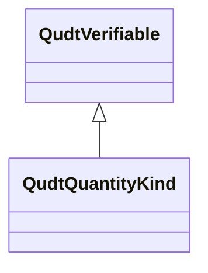

# Class: Quantity Kind (qudt_QuantityKind)


_A <b>Quantity Kind</b> is any observable property that can be  measured and quantified numerically. Familiar examples include physical properties such as length, mass, time, force, energy, power, electric charge, etc. Less familiar examples include currency, interest rate, price to earning ratio, and information capacity._


This class occurs 1 times.


URI: [qudt:QuantityKind](http://qudt.org/schema/qudt/QuantityKind)





## Inheritance
* [QudtVerifiable](../classes/QudtVerifiable.md)
    * **QudtQuantityKind**


## Slots

| Name | Cardinality and Range | Description | Inheritance | Occurrences |
| ---  | --- | --- | --- | --- |


## Usages

| used by | used in | type | used |
| ---  | --- | --- | --- |
| [QudtAngleUnit](../classes/QudtAngleUnit.md) | [qudt_hasQuantityKind](../slots/qudt_hasQuantityKind.md) | any_of[range] | [QudtQuantityKind](../classes/QudtQuantityKind.md) |
| [QudtContextualUnit](../classes/QudtContextualUnit.md) | [qudt_hasQuantityKind](../slots/qudt_hasQuantityKind.md) | any_of[range] | [QudtQuantityKind](../classes/QudtQuantityKind.md) |
| [QudtCountingUnit](../classes/QudtCountingUnit.md) | [qudt_hasQuantityKind](../slots/qudt_hasQuantityKind.md) | any_of[range] | [QudtQuantityKind](../classes/QudtQuantityKind.md) |
| [QudtCurrencyUnit](../classes/QudtCurrencyUnit.md) | [qudt_hasQuantityKind](../slots/qudt_hasQuantityKind.md) | any_of[range] | [QudtQuantityKind](../classes/QudtQuantityKind.md) |
| [QudtDerivedUnit](../classes/QudtDerivedUnit.md) | [qudt_hasQuantityKind](../slots/qudt_hasQuantityKind.md) | any_of[range] | [QudtQuantityKind](../classes/QudtQuantityKind.md) |
| [QudtDimensionlessUnit](../classes/QudtDimensionlessUnit.md) | [qudt_hasQuantityKind](../slots/qudt_hasQuantityKind.md) | any_of[range] | [QudtQuantityKind](../classes/QudtQuantityKind.md) |
| [QudtLogarithmicUnit](../classes/QudtLogarithmicUnit.md) | [qudt_hasQuantityKind](../slots/qudt_hasQuantityKind.md) | any_of[range] | [QudtQuantityKind](../classes/QudtQuantityKind.md) |
| [QudtPlaneAngleUnit](../classes/QudtPlaneAngleUnit.md) | [qudt_hasQuantityKind](../slots/qudt_hasQuantityKind.md) | any_of[range] | [QudtQuantityKind](../classes/QudtQuantityKind.md) |
| [QudtSolidAngleUnit](../classes/QudtSolidAngleUnit.md) | [qudt_hasQuantityKind](../slots/qudt_hasQuantityKind.md) | any_of[range] | [QudtQuantityKind](../classes/QudtQuantityKind.md) |
| [QudtUnit](../classes/QudtUnit.md) | [qudt_hasQuantityKind](../slots/qudt_hasQuantityKind.md) | any_of[range] | [QudtQuantityKind](../classes/QudtQuantityKind.md) |


## LinkML Source

<!-- TODO: investigate https://stackoverflow.com/questions/37606292/how-to-create-tabbed-code-blocks-in-mkdocs-or-sphinx -->

### Direct

<details>

```yaml
name: qudt_QuantityKind
description: A <b>Quantity Kind</b> is any observable property that can be  measured
  and quantified numerically. Familiar examples include physical properties such as
  length, mass, time, force, energy, power, electric charge, etc. Less familiar examples
  include currency, interest rate, price to earning ratio, and information capacity.
title: Quantity Kind
from_schema: okns:qudt
source: http://qudt.org/schema/qudt
is_a: qudt_Verifiable
class_uri: qudt:QuantityKind

```
</details>

### Induced

<details>

```yaml
name: qudt_QuantityKind
description: A <b>Quantity Kind</b> is any observable property that can be  measured
  and quantified numerically. Familiar examples include physical properties such as
  length, mass, time, force, energy, power, electric charge, etc. Less familiar examples
  include currency, interest rate, price to earning ratio, and information capacity.
title: Quantity Kind
from_schema: okns:qudt
source: http://qudt.org/schema/qudt
is_a: qudt_Verifiable
class_uri: qudt:QuantityKind

```
</details>