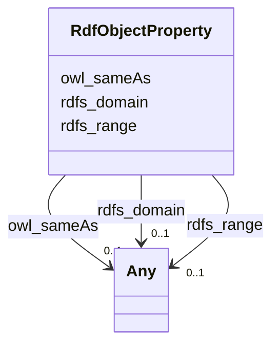

# Class: No class (type) name specified (rdf_ObjectProperty)


_No class (type) description specified_


This class occurs 1 times.


URI: [rdf:ObjectProperty](http://www.w3.org/1999/02/22-rdf-syntax-ns#ObjectProperty)





<!-- no inheritance hierarchy -->


## Slots

| Name | Cardinality and Range | Description | Inheritance | Occurrences |
| ---  | --- | --- | --- | --- |
| [rdfs_domain](../slots/rdfs_domain.md) | 0..1 <br/> [OwlClass](../classes/OwlClass.md)&nbsp;or&nbsp;<br />[RdfsClass](../classes/RdfsClass.md)&nbsp;or&nbsp;<br />[OwlThing](../classes/OwlThing.md)&nbsp;or&nbsp;<br />[xsd:anyURI](http://www.w3.org/2001/XMLSchema#anyURI) | No slot (predicate) description specified <br/>  | direct | 3 |
| [owl_sameAs](../slots/owl_sameAs.md) | 0..1 <br/> [HyfHYWaterBody](../classes/HyfHYWaterBody.md)&nbsp;or&nbsp;<br />[KwgoS2CellLevel13](../classes/KwgoS2CellLevel13.md)&nbsp;or&nbsp;<br />[OwlThing](../classes/OwlThing.md)&nbsp;or&nbsp;<br />[xsd:anyURI](http://www.w3.org/2001/XMLSchema#anyURI)&nbsp;or&nbsp;<br />[Sf#LineString](../classes/Sf#LineString.md)&nbsp;or&nbsp;<br />[Sf#Polygon](../classes/Sf#Polygon.md)&nbsp;or&nbsp;<br />[Sf#MultiPolygon](../classes/Sf#MultiPolygon.md)&nbsp;or&nbsp;<br />[HyfHYWaterbody](../classes/HyfHYWaterbody.md)&nbsp;or&nbsp;<br />[RdfList](../classes/RdfList.md)&nbsp;or&nbsp;<br />[GeoFeature](../classes/GeoFeature.md)&nbsp;or&nbsp;<br />[GeoGeometry](../classes/GeoGeometry.md)&nbsp;or&nbsp;<br />[HyfHYFlowPath](../classes/HyfHYFlowPath.md)&nbsp;or&nbsp;<br />[SchemaPlace](../classes/SchemaPlace.md)&nbsp;or&nbsp;<br />[Gwml22GWAquifer](../classes/Gwml22GWAquifer.md)&nbsp;or&nbsp;<br />[RdfObjectProperty](../classes/RdfObjectProperty.md) | No slot (predicate) description specified <br/>  | direct | 2 |
| [rdfs_range](../slots/rdfs_range.md) | 0..1 <br/> [OwlClass](../classes/OwlClass.md)&nbsp;or&nbsp;<br />[RdfsClass](../classes/RdfsClass.md)&nbsp;or&nbsp;<br />[OwlThing](../classes/OwlThing.md)&nbsp;or&nbsp;<br />[xsd:anyURI](http://www.w3.org/2001/XMLSchema#anyURI) | No slot (predicate) description specified <br/>  | direct | 3 |


## Usages

| used by | used in | type | used |
| ---  | --- | --- | --- |
| [GeoFeature](../classes/GeoFeature.md) | [owl_sameAs](../slots/owl_sameAs.md) | any_of[range] | [RdfObjectProperty](../classes/RdfObjectProperty.md) |
| [GeoGeometry](../classes/GeoGeometry.md) | [owl_sameAs](../slots/owl_sameAs.md) | any_of[range] | [RdfObjectProperty](../classes/RdfObjectProperty.md) |
| [Gwml22GWAquifer](../classes/Gwml22GWAquifer.md) | [owl_sameAs](../slots/owl_sameAs.md) | any_of[range] | [RdfObjectProperty](../classes/RdfObjectProperty.md) |
| [HyfHYFlowPath](../classes/HyfHYFlowPath.md) | [owl_sameAs](../slots/owl_sameAs.md) | any_of[range] | [RdfObjectProperty](../classes/RdfObjectProperty.md) |
| [HyfHYWaterBody](../classes/HyfHYWaterBody.md) | [owl_sameAs](../slots/owl_sameAs.md) | any_of[range] | [RdfObjectProperty](../classes/RdfObjectProperty.md) |
| [HyfHYWaterbody](../classes/HyfHYWaterbody.md) | [owl_sameAs](../slots/owl_sameAs.md) | any_of[range] | [RdfObjectProperty](../classes/RdfObjectProperty.md) |
| [KwgoS2CellLevel13](../classes/KwgoS2CellLevel13.md) | [owl_sameAs](../slots/owl_sameAs.md) | any_of[range] | [RdfObjectProperty](../classes/RdfObjectProperty.md) |
| [OwlNamedIndividual](../classes/OwlNamedIndividual.md) | [owl_sameAs](../slots/owl_sameAs.md) | any_of[range] | [RdfObjectProperty](../classes/RdfObjectProperty.md) |
| [OwlNothing](../classes/OwlNothing.md) | [owl_sameAs](../slots/owl_sameAs.md) | any_of[range] | [RdfObjectProperty](../classes/RdfObjectProperty.md) |
| [OwlThing](../classes/OwlThing.md) | [owl_sameAs](../slots/owl_sameAs.md) | any_of[range] | [RdfObjectProperty](../classes/RdfObjectProperty.md) |
| [RdfList](../classes/RdfList.md) | [owl_sameAs](../slots/owl_sameAs.md) | any_of[range] | [RdfObjectProperty](../classes/RdfObjectProperty.md) |
| [RdfObjectProperty](../classes/RdfObjectProperty.md) | [owl_sameAs](../slots/owl_sameAs.md) | any_of[range] | [RdfObjectProperty](../classes/RdfObjectProperty.md) |
| [SchemaPlace](../classes/SchemaPlace.md) | [owl_sameAs](../slots/owl_sameAs.md) | any_of[range] | [RdfObjectProperty](../classes/RdfObjectProperty.md) |
| [Sf#LineString](../classes/Sf#LineString.md) | [owl_sameAs](../slots/owl_sameAs.md) | any_of[range] | [RdfObjectProperty](../classes/RdfObjectProperty.md) |
| [Sf#MultiPolygon](../classes/Sf#MultiPolygon.md) | [owl_sameAs](../slots/owl_sameAs.md) | any_of[range] | [RdfObjectProperty](../classes/RdfObjectProperty.md) |
| [Sf#Polygon](../classes/Sf#Polygon.md) | [owl_sameAs](../slots/owl_sameAs.md) | any_of[range] | [RdfObjectProperty](../classes/RdfObjectProperty.md) |


## LinkML Source

<!-- TODO: investigate https://stackoverflow.com/questions/37606292/how-to-create-tabbed-code-blocks-in-mkdocs-or-sphinx -->

### Direct

<details>

```yaml
name: rdf_ObjectProperty
conforms_to: No schema conformance document specified
annotations:
  count:
    tag: count
    value: 1
description: No class (type) description specified
title: No class (type) name specified
from_schema: hydrology-kg
rank: 1000
slots:
- rdfs_domain
- owl_sameAs
- rdfs_range
slot_usage:
  owl_sameAs:
    name: owl_sameAs
    annotations:
      owl_Thing:
        tag: owl_Thing
        value: 1
      rdf_ObjectProperty:
        tag: rdf_ObjectProperty
        value: 1
  rdfs_domain:
    name: rdfs_domain
    annotations:
      owl_Class:
        tag: owl_Class
        value: 1
      owl_Thing:
        tag: owl_Thing
        value: 1
      rdfs_Class:
        tag: rdfs_Class
        value: 1
  rdfs_range:
    name: rdfs_range
    annotations:
      owl_Class:
        tag: owl_Class
        value: 1
      owl_Thing:
        tag: owl_Thing
        value: 1
      rdfs_Class:
        tag: rdfs_Class
        value: 1
class_uri: rdf:ObjectProperty

```
</details>

### Induced

<details>

```yaml
name: rdf_ObjectProperty
conforms_to: No schema conformance document specified
annotations:
  count:
    tag: count
    value: 1
description: No class (type) description specified
title: No class (type) name specified
from_schema: hydrology-kg
rank: 1000
slot_usage:
  owl_sameAs:
    name: owl_sameAs
    annotations:
      owl_Thing:
        tag: owl_Thing
        value: 1
      rdf_ObjectProperty:
        tag: rdf_ObjectProperty
        value: 1
  rdfs_domain:
    name: rdfs_domain
    annotations:
      owl_Class:
        tag: owl_Class
        value: 1
      owl_Thing:
        tag: owl_Thing
        value: 1
      rdfs_Class:
        tag: rdfs_Class
        value: 1
  rdfs_range:
    name: rdfs_range
    annotations:
      owl_Class:
        tag: owl_Class
        value: 1
      owl_Thing:
        tag: owl_Thing
        value: 1
      rdfs_Class:
        tag: rdfs_Class
        value: 1
attributes:
  rdfs_domain:
    name: rdfs_domain
    annotations:
      owl_Class:
        tag: owl_Class
        value: 1
      owl_Thing:
        tag: owl_Thing
        value: 1
      rdfs_Class:
        tag: rdfs_Class
        value: 1
    description: No slot (predicate) description specified
    title: No slot (predicate) name specified
    examples:
    - object:
        example_object: owl:Thing
        example_object_type: owl_Class
        example_predicate: rdfs:domain
        example_subject: owl:topObjectProperty
        example_subject_type: owl_Thing
    - object:
        example_object: owl:Thing
        example_object_type: owl_Thing
        example_predicate: rdfs:domain
        example_subject: owl:topObjectProperty
        example_subject_type: owl_Thing
    - object:
        example_object: owl:Thing
        example_object_type: rdfs_Class
        example_predicate: rdfs:domain
        example_subject: owl:topObjectProperty
        example_subject_type: owl_Thing
    - object:
        example_object: owl:Thing
        example_object_type: owl_Class
        example_predicate: rdfs:domain
        example_subject: owl:topObjectProperty
        example_subject_type: rdf_ObjectProperty
    - object:
        example_object: owl:Thing
        example_object_type: owl_Thing
        example_predicate: rdfs:domain
        example_subject: owl:topObjectProperty
        example_subject_type: rdf_ObjectProperty
    - object:
        example_object: owl:Thing
        example_object_type: rdfs_Class
        example_predicate: rdfs:domain
        example_subject: owl:topObjectProperty
        example_subject_type: rdf_ObjectProperty
    from_schema: hydrology-kg
    rank: 1000
    slot_uri: rdfs:domain
    alias: rdfs_domain
    owner: rdf_ObjectProperty
    domain_of:
    - owl_Thing
    - rdf_ObjectProperty
    range: Any
    any_of:
    - range: owl_Class
    - range: rdfs_Class
    - range: owl_Thing
    - range: uri
  owl_sameAs:
    name: owl_sameAs
    annotations:
      owl_Thing:
        tag: owl_Thing
        value: 1
      rdf_ObjectProperty:
        tag: rdf_ObjectProperty
        value: 1
    description: No slot (predicate) description specified
    title: No slot (predicate) name specified
    examples:
    - object:
        example_object: memgs2:MGS
        example_object_type: owl_Thing
        example_predicate: owl:sameAs
        example_subject: memgs2:MGS
        example_subject_type: owl_Thing
    - object:
        example_object: http://sawgraph.spatialai.org/v1/me_mgs_data#d.MGS-Aquifer.0001
        example_object_type: gwml22_GW_Aquifer
        example_predicate: owl:sameAs
        example_subject: http://sawgraph.spatialai.org/v1/me_mgs_data#d.MGS-Aquifer.0001
        example_subject_type: gwml22_GW_Aquifer
    - object:
        example_object: http://sawgraph.spatialai.org/v1/me_mgs_data#d.MGS-Aquifer.0001
        example_object_type: owl_Thing
        example_predicate: owl:sameAs
        example_subject: http://sawgraph.spatialai.org/v1/me_mgs_data#d.MGS-Aquifer.0001
        example_subject_type: gwml22_GW_Aquifer
    - object:
        example_object: http://sawgraph.spatialai.org/v1/me_mgs_data#d.MGS-Aquifer.0001
        example_object_type: gwml22_GW_Aquifer
        example_predicate: owl:sameAs
        example_subject: http://sawgraph.spatialai.org/v1/me_mgs_data#d.MGS-Aquifer.0001
        example_subject_type: owl_Thing
    - object:
        example_object: http://sawgraph.spatialai.org/v1/me_mgs_data#d.MGS-Aquifer.Geometry.0001
        example_object_type: sf_#Polygon
        example_predicate: owl:sameAs
        example_subject: http://sawgraph.spatialai.org/v1/me_mgs_data#d.MGS-Aquifer.Geometry.0001
        example_subject_type: owl_Thing
    - object:
        example_object: http://sawgraph.spatialai.org/v1/me_mgs_data#d.MGS-Aquifer.Geometry.0001
        example_object_type: geo_Geometry
        example_predicate: owl:sameAs
        example_subject: http://sawgraph.spatialai.org/v1/me_mgs_data#d.MGS-Aquifer.Geometry.0001
        example_subject_type: owl_Thing
    - object:
        example_object: http://sawgraph.spatialai.org/v1/me_mgs_data#d.MGS-Aquifer.Geometry.0001
        example_object_type: owl_Thing
        example_predicate: owl:sameAs
        example_subject: http://sawgraph.spatialai.org/v1/me_mgs_data#d.MGS-Aquifer.Geometry.0001
        example_subject_type: sf_#Polygon
    - object:
        example_object: http://sawgraph.spatialai.org/v1/me_mgs_data#d.MGS-Aquifer.Geometry.0001
        example_object_type: sf_#Polygon
        example_predicate: owl:sameAs
        example_subject: http://sawgraph.spatialai.org/v1/me_mgs_data#d.MGS-Aquifer.Geometry.0001
        example_subject_type: sf_#Polygon
    - object:
        example_object: http://sawgraph.spatialai.org/v1/me_mgs_data#d.MGS-Aquifer.Geometry.0001
        example_object_type: geo_Geometry
        example_predicate: owl:sameAs
        example_subject: http://sawgraph.spatialai.org/v1/me_mgs_data#d.MGS-Aquifer.Geometry.0001
        example_subject_type: sf_#Polygon
    - object:
        example_object: http://sawgraph.spatialai.org/v1/me_mgs_data#d.MGS-Aquifer.Geometry.0001
        example_object_type: owl_Thing
        example_predicate: owl:sameAs
        example_subject: http://sawgraph.spatialai.org/v1/me_mgs_data#d.MGS-Aquifer.Geometry.0001
        example_subject_type: geo_Geometry
    - object:
        example_object: http://sawgraph.spatialai.org/v1/me_mgs_data#d.MGS-Aquifer.Geometry.0001
        example_object_type: sf_#Polygon
        example_predicate: owl:sameAs
        example_subject: http://sawgraph.spatialai.org/v1/me_mgs_data#d.MGS-Aquifer.Geometry.0001
        example_subject_type: geo_Geometry
    - object:
        example_object: http://sawgraph.spatialai.org/v1/me_mgs_data#d.MGS-Aquifer.Geometry.0001
        example_object_type: geo_Geometry
        example_predicate: owl:sameAs
        example_subject: http://sawgraph.spatialai.org/v1/me_mgs_data#d.MGS-Aquifer.Geometry.0001
        example_subject_type: geo_Geometry
    - object:
        example_object: http://sawgraph.spatialai.org/v1/me_mgs_data#d.MGS-Aquifer.Geometry.0175
        example_object_type: owl_Thing
        example_predicate: owl:sameAs
        example_subject: http://sawgraph.spatialai.org/v1/me_mgs_data#d.MGS-Aquifer.Geometry.0175
        example_subject_type: sf_#MultiPolygon
    - object:
        example_object: http://sawgraph.spatialai.org/v1/me_mgs_data#d.MGS-Aquifer.Geometry.0175
        example_object_type: geo_Geometry
        example_predicate: owl:sameAs
        example_subject: http://sawgraph.spatialai.org/v1/me_mgs_data#d.MGS-Aquifer.Geometry.0175
        example_subject_type: sf_#MultiPolygon
    - object:
        example_object: http://sawgraph.spatialai.org/v1/me_mgs_data#d.MGS-Aquifer.Geometry.0175
        example_object_type: sf_#MultiPolygon
        example_predicate: owl:sameAs
        example_subject: http://sawgraph.spatialai.org/v1/me_mgs_data#d.MGS-Aquifer.Geometry.0175
        example_subject_type: sf_#MultiPolygon
    - object:
        example_object: http://sawgraph.spatialai.org/v1/me_mgs_data#d.MGS-Aquifer.Geometry.0175
        example_object_type: sf_#MultiPolygon
        example_predicate: owl:sameAs
        example_subject: http://sawgraph.spatialai.org/v1/me_mgs_data#d.MGS-Aquifer.Geometry.0175
        example_subject_type: owl_Thing
    - object:
        example_object: http://sawgraph.spatialai.org/v1/me_mgs_data#d.MGS-Aquifer.Geometry.0175
        example_object_type: sf_#MultiPolygon
        example_predicate: owl:sameAs
        example_subject: http://sawgraph.spatialai.org/v1/me_mgs_data#d.MGS-Aquifer.Geometry.0175
        example_subject_type: geo_Geometry
    - object:
        example_object: kwgr:s2.level13.5522341869704445952
        example_object_type: kwgo_S2Cell_Level13
        example_predicate: owl:sameAs
        example_subject: kwgr:s2.level13.5522341869704445952
        example_subject_type: kwgo_S2Cell_Level13
    - object:
        example_object: kwgr:s2.level13.5522341869704445952
        example_object_type: owl_Thing
        example_predicate: owl:sameAs
        example_subject: kwgr:s2.level13.5522341869704445952
        example_subject_type: kwgo_S2Cell_Level13
    - object:
        example_object: kwgr:s2.level13.5522341869704445952
        example_object_type: kwgo_S2Cell_Level13
        example_predicate: owl:sameAs
        example_subject: kwgr:s2.level13.5522341869704445952
        example_subject_type: owl_Thing
    - object:
        example_object: rdf:nil
        example_object_type: rdf_List
        example_predicate: owl:sameAs
        example_subject: rdf:nil
        example_subject_type: owl_Thing
    - object:
        example_object: rdf:nil
        example_object_type: owl_Thing
        example_predicate: owl:sameAs
        example_subject: rdf:nil
        example_subject_type: rdf_List
    - object:
        example_object: rdf:nil
        example_object_type: rdf_List
        example_predicate: owl:sameAs
        example_subject: rdf:nil
        example_subject_type: rdf_List
    - object:
        example_object: owl:topObjectProperty
        example_object_type: rdf_ObjectProperty
        example_predicate: owl:sameAs
        example_subject: owl:topObjectProperty
        example_subject_type: owl_Thing
    - object:
        example_object: owl:topObjectProperty
        example_object_type: owl_Thing
        example_predicate: owl:sameAs
        example_subject: owl:topObjectProperty
        example_subject_type: rdf_ObjectProperty
    - object:
        example_object: owl:topObjectProperty
        example_object_type: rdf_ObjectProperty
        example_predicate: owl:sameAs
        example_subject: owl:topObjectProperty
        example_subject_type: rdf_ObjectProperty
    - object:
        example_object: https://geoconnex.us/nhdplusv2/comid/1001
        example_object_type: hyf__HY_Waterbody
        example_predicate: owl:sameAs
        example_subject: https://geoconnex.us/nhdplusv2/comid/1001
        example_subject_type: hyf__HY_Waterbody
    - object:
        example_object: https://geoconnex.us/nhdplusv2/comid/1001
        example_object_type: schema_Place
        example_predicate: owl:sameAs
        example_subject: https://geoconnex.us/nhdplusv2/comid/1001
        example_subject_type: hyf__HY_Waterbody
    - object:
        example_object: https://geoconnex.us/nhdplusv2/comid/1001
        example_object_type: owl_Thing
        example_predicate: owl:sameAs
        example_subject: https://geoconnex.us/nhdplusv2/comid/1001
        example_subject_type: hyf__HY_Waterbody
    - object:
        example_object: https://geoconnex.us/nhdplusv2/comid/1001
        example_object_type: hyf__HY_FlowPath
        example_predicate: owl:sameAs
        example_subject: https://geoconnex.us/nhdplusv2/comid/1001
        example_subject_type: hyf__HY_Waterbody
    - object:
        example_object: https://geoconnex.us/nhdplusv2/comid/1001
        example_object_type: hyf__HY_Waterbody
        example_predicate: owl:sameAs
        example_subject: https://geoconnex.us/nhdplusv2/comid/1001
        example_subject_type: schema_Place
    - object:
        example_object: https://geoconnex.us/nhdplusv2/comid/1001
        example_object_type: schema_Place
        example_predicate: owl:sameAs
        example_subject: https://geoconnex.us/nhdplusv2/comid/1001
        example_subject_type: schema_Place
    - object:
        example_object: https://geoconnex.us/nhdplusv2/comid/1001
        example_object_type: owl_Thing
        example_predicate: owl:sameAs
        example_subject: https://geoconnex.us/nhdplusv2/comid/1001
        example_subject_type: schema_Place
    - object:
        example_object: https://geoconnex.us/nhdplusv2/comid/1001
        example_object_type: hyf__HY_FlowPath
        example_predicate: owl:sameAs
        example_subject: https://geoconnex.us/nhdplusv2/comid/1001
        example_subject_type: schema_Place
    - object:
        example_object: https://geoconnex.us/nhdplusv2/comid/1001
        example_object_type: hyf__HY_Waterbody
        example_predicate: owl:sameAs
        example_subject: https://geoconnex.us/nhdplusv2/comid/1001
        example_subject_type: owl_Thing
    - object:
        example_object: https://geoconnex.us/nhdplusv2/comid/1001
        example_object_type: schema_Place
        example_predicate: owl:sameAs
        example_subject: https://geoconnex.us/nhdplusv2/comid/1001
        example_subject_type: owl_Thing
    - object:
        example_object: https://geoconnex.us/nhdplusv2/comid/1001
        example_object_type: hyf__HY_FlowPath
        example_predicate: owl:sameAs
        example_subject: https://geoconnex.us/nhdplusv2/comid/1001
        example_subject_type: owl_Thing
    - object:
        example_object: https://geoconnex.us/nhdplusv2/comid/1001
        example_object_type: hyf__HY_Waterbody
        example_predicate: owl:sameAs
        example_subject: https://geoconnex.us/nhdplusv2/comid/1001
        example_subject_type: hyf__HY_FlowPath
    - object:
        example_object: https://geoconnex.us/nhdplusv2/comid/1001
        example_object_type: schema_Place
        example_predicate: owl:sameAs
        example_subject: https://geoconnex.us/nhdplusv2/comid/1001
        example_subject_type: hyf__HY_FlowPath
    - object:
        example_object: https://geoconnex.us/nhdplusv2/comid/1001
        example_object_type: owl_Thing
        example_predicate: owl:sameAs
        example_subject: https://geoconnex.us/nhdplusv2/comid/1001
        example_subject_type: hyf__HY_FlowPath
    - object:
        example_object: https://geoconnex.us/nhdplusv2/comid/1001
        example_object_type: hyf__HY_FlowPath
        example_predicate: owl:sameAs
        example_subject: https://geoconnex.us/nhdplusv2/comid/1001
        example_subject_type: hyf__HY_FlowPath
    - object:
        example_object: https://geoconnex.us/nhdplusv2/comid/1001.geometry
        example_object_type: sf_#LineString
        example_predicate: owl:sameAs
        example_subject: https://geoconnex.us/nhdplusv2/comid/1001.geometry
        example_subject_type: owl_Thing
    - object:
        example_object: https://geoconnex.us/nhdplusv2/comid/1001.geometry
        example_object_type: owl_Thing
        example_predicate: owl:sameAs
        example_subject: https://geoconnex.us/nhdplusv2/comid/1001.geometry
        example_subject_type: sf_#LineString
    - object:
        example_object: https://geoconnex.us/nhdplusv2/comid/1001.geometry
        example_object_type: sf_#LineString
        example_predicate: owl:sameAs
        example_subject: https://geoconnex.us/nhdplusv2/comid/1001.geometry
        example_subject_type: sf_#LineString
    - object:
        example_object: https://geoconnex.us/nhdplusv2/comid/1001.geometry
        example_object_type: geo_Geometry
        example_predicate: owl:sameAs
        example_subject: https://geoconnex.us/nhdplusv2/comid/1001.geometry
        example_subject_type: sf_#LineString
    - object:
        example_object: https://geoconnex.us/nhdplusv2/comid/1001.geometry
        example_object_type: sf_#LineString
        example_predicate: owl:sameAs
        example_subject: https://geoconnex.us/nhdplusv2/comid/1001.geometry
        example_subject_type: geo_Geometry
    - object:
        example_object: https://geoconnex.us/nhdplusv2/comid/1001.head
        example_object_type: geo_Feature
        example_predicate: owl:sameAs
        example_subject: https://geoconnex.us/nhdplusv2/comid/1001.head
        example_subject_type: geo_Feature
    - object:
        example_object: https://geoconnex.us/nhdplusv2/comid/1001.head
        example_object_type: owl_Thing
        example_predicate: owl:sameAs
        example_subject: https://geoconnex.us/nhdplusv2/comid/1001.head
        example_subject_type: geo_Feature
    - object:
        example_object: https://geoconnex.us/nhdplusv2/comid/1001.head
        example_object_type: geo_Feature
        example_predicate: owl:sameAs
        example_subject: https://geoconnex.us/nhdplusv2/comid/1001.head
        example_subject_type: owl_Thing
    - object:
        example_object: https://geoconnex.us/nhdplusv2/comid/10101972
        example_object_type: hyf__HY_WaterBody
        example_predicate: owl:sameAs
        example_subject: https://geoconnex.us/nhdplusv2/comid/10101972
        example_subject_type: hyf__HY_WaterBody
    - object:
        example_object: https://geoconnex.us/nhdplusv2/comid/10101972
        example_object_type: owl_Thing
        example_predicate: owl:sameAs
        example_subject: https://geoconnex.us/nhdplusv2/comid/10101972
        example_subject_type: hyf__HY_WaterBody
    - object:
        example_object: https://geoconnex.us/nhdplusv2/comid/10101972
        example_object_type: hyf__HY_WaterBody
        example_predicate: owl:sameAs
        example_subject: https://geoconnex.us/nhdplusv2/comid/10101972
        example_subject_type: owl_Thing
    from_schema: hydrology-kg
    rank: 1000
    domain: owl_sameAs
    slot_uri: owl:sameAs
    alias: owl_sameAs
    owner: rdf_ObjectProperty
    domain_of:
    - geo_Feature
    - geo_Geometry
    - gwml22_GW_Aquifer
    - hyf__HY_FlowPath
    - hyf__HY_WaterBody
    - hyf__HY_Waterbody
    - kwgo_S2Cell_Level13
    - owl_Thing
    - rdf_List
    - rdf_ObjectProperty
    - schema_Place
    - sf_#LineString
    - sf_#MultiPolygon
    - sf_#Polygon
    range: Any
    any_of:
    - range: hyf__HY_WaterBody
    - range: kwgo_S2Cell_Level13
    - range: owl_Thing
    - range: uri
    - range: sf_#LineString
    - range: sf_#Polygon
    - range: sf_#MultiPolygon
    - range: hyf__HY_Waterbody
    - range: rdf_List
    - range: geo_Feature
    - range: geo_Geometry
    - range: hyf__HY_FlowPath
    - range: schema_Place
    - range: gwml22_GW_Aquifer
    - range: rdf_ObjectProperty
  rdfs_range:
    name: rdfs_range
    annotations:
      owl_Class:
        tag: owl_Class
        value: 1
      owl_Thing:
        tag: owl_Thing
        value: 1
      rdfs_Class:
        tag: rdfs_Class
        value: 1
    description: No slot (predicate) description specified
    title: No slot (predicate) name specified
    examples:
    - object:
        example_object: owl:Thing
        example_object_type: owl_Class
        example_predicate: rdfs:range
        example_subject: owl:topObjectProperty
        example_subject_type: owl_Thing
    - object:
        example_object: owl:Thing
        example_object_type: owl_Thing
        example_predicate: rdfs:range
        example_subject: owl:topObjectProperty
        example_subject_type: owl_Thing
    - object:
        example_object: owl:Thing
        example_object_type: rdfs_Class
        example_predicate: rdfs:range
        example_subject: owl:topObjectProperty
        example_subject_type: owl_Thing
    - object:
        example_object: owl:Thing
        example_object_type: owl_Class
        example_predicate: rdfs:range
        example_subject: owl:topObjectProperty
        example_subject_type: rdf_ObjectProperty
    - object:
        example_object: owl:Thing
        example_object_type: owl_Thing
        example_predicate: rdfs:range
        example_subject: owl:topObjectProperty
        example_subject_type: rdf_ObjectProperty
    - object:
        example_object: owl:Thing
        example_object_type: rdfs_Class
        example_predicate: rdfs:range
        example_subject: owl:topObjectProperty
        example_subject_type: rdf_ObjectProperty
    from_schema: hydrology-kg
    rank: 1000
    slot_uri: rdfs:range
    alias: rdfs_range
    owner: rdf_ObjectProperty
    domain_of:
    - owl_Thing
    - rdf_ObjectProperty
    range: Any
    any_of:
    - range: owl_Class
    - range: rdfs_Class
    - range: owl_Thing
    - range: uri
class_uri: rdf:ObjectProperty

```
</details>