# Class: No class (type) name specified -- this class is noted as a superclass of another class in this graph but has not itself been defined. (rdfs_Literal)


_No class (type) description specified_


This class occurs 0 times.


URI: [rdfs:Literal](http://www.w3.org/2000/01/rdf-schema#Literal)

```mermaid
 classDiagram
    class RdfsLiteral
    click RdfsLiteral href "../RdfsLiteral"
      RdfsLiteral <|-- OwlRational
        click OwlRational href "../OwlRational"
      RdfsLiteral <|-- OwlReal
        click OwlReal href "../OwlReal"
      RdfsLiteral <|-- RdfPlainLiteral
        click RdfPlainLiteral href "../RdfPlainLiteral"
      RdfsLiteral <|-- RdfXMLLiteral
        click RdfXMLLiteral href "../RdfXMLLiteral"
      RdfsLiteral <|-- XsdNCName
        click XsdNCName href "../XsdNCName"
      RdfsLiteral <|-- XsdNMTOKEN
        click XsdNMTOKEN href "../XsdNMTOKEN"
      RdfsLiteral <|-- XsdName
        click XsdName href "../XsdName"
      RdfsLiteral <|-- XsdAnyURI
        click XsdAnyURI href "../XsdAnyURI"
      RdfsLiteral <|-- XsdBase64Binary
        click XsdBase64Binary href "../XsdBase64Binary"
      RdfsLiteral <|-- XsdBoolean
        click XsdBoolean href "../XsdBoolean"
      RdfsLiteral <|-- XsdByte
        click XsdByte href "../XsdByte"
      RdfsLiteral <|-- XsdDateTime
        click XsdDateTime href "../XsdDateTime"
      RdfsLiteral <|-- XsdDateTimeStamp
        click XsdDateTimeStamp href "../XsdDateTimeStamp"
      RdfsLiteral <|-- XsdDecimal
        click XsdDecimal href "../XsdDecimal"
      RdfsLiteral <|-- XsdDouble
        click XsdDouble href "../XsdDouble"
      RdfsLiteral <|-- XsdFloat
        click XsdFloat href "../XsdFloat"
      RdfsLiteral <|-- XsdHexBinary
        click XsdHexBinary href "../XsdHexBinary"
      RdfsLiteral <|-- XsdInt
        click XsdInt href "../XsdInt"
      RdfsLiteral <|-- XsdInteger
        click XsdInteger href "../XsdInteger"
      RdfsLiteral <|-- XsdLanguage
        click XsdLanguage href "../XsdLanguage"
      RdfsLiteral <|-- XsdLong
        click XsdLong href "../XsdLong"
      RdfsLiteral <|-- XsdNegativeInteger
        click XsdNegativeInteger href "../XsdNegativeInteger"
      RdfsLiteral <|-- XsdNonNegativeInteger
        click XsdNonNegativeInteger href "../XsdNonNegativeInteger"
      RdfsLiteral <|-- XsdNonPositiveInteger
        click XsdNonPositiveInteger href "../XsdNonPositiveInteger"
      RdfsLiteral <|-- XsdNormalizedString
        click XsdNormalizedString href "../XsdNormalizedString"
      RdfsLiteral <|-- XsdPositiveInteger
        click XsdPositiveInteger href "../XsdPositiveInteger"
      RdfsLiteral <|-- XsdShort
        click XsdShort href "../XsdShort"
      RdfsLiteral <|-- XsdString
        click XsdString href "../XsdString"
      RdfsLiteral <|-- XsdToken
        click XsdToken href "../XsdToken"
      RdfsLiteral <|-- XsdUnsignedByte
        click XsdUnsignedByte href "../XsdUnsignedByte"
      RdfsLiteral <|-- XsdUnsignedInt
        click XsdUnsignedInt href "../XsdUnsignedInt"
      RdfsLiteral <|-- XsdUnsignedLong
        click XsdUnsignedLong href "../XsdUnsignedLong"
      RdfsLiteral <|-- XsdUnsignedShort
        click XsdUnsignedShort href "../XsdUnsignedShort"
      
      
```





## Inheritance
* **RdfsLiteral**
    * [OwlRational](../classes/OwlRational.md)
    * [OwlReal](../classes/OwlReal.md)
    * [RdfPlainLiteral](../classes/RdfPlainLiteral.md)
    * [RdfXMLLiteral](../classes/RdfXMLLiteral.md)
    * [XsdNCName](../classes/XsdNCName.md)
    * [XsdNMTOKEN](../classes/XsdNMTOKEN.md)
    * [XsdName](../classes/XsdName.md)
    * [XsdAnyURI](../classes/XsdAnyURI.md)
    * [XsdBase64Binary](../classes/XsdBase64Binary.md)
    * [XsdBoolean](../classes/XsdBoolean.md)
    * [XsdByte](../classes/XsdByte.md)
    * [XsdDateTime](../classes/XsdDateTime.md)
    * [XsdDateTimeStamp](../classes/XsdDateTimeStamp.md)
    * [XsdDecimal](../classes/XsdDecimal.md)
    * [XsdDouble](../classes/XsdDouble.md)
    * [XsdFloat](../classes/XsdFloat.md)
    * [XsdHexBinary](../classes/XsdHexBinary.md)
    * [XsdInt](../classes/XsdInt.md)
    * [XsdInteger](../classes/XsdInteger.md)
    * [XsdLanguage](../classes/XsdLanguage.md)
    * [XsdLong](../classes/XsdLong.md)
    * [XsdNegativeInteger](../classes/XsdNegativeInteger.md)
    * [XsdNonNegativeInteger](../classes/XsdNonNegativeInteger.md)
    * [XsdNonPositiveInteger](../classes/XsdNonPositiveInteger.md)
    * [XsdNormalizedString](../classes/XsdNormalizedString.md)
    * [XsdPositiveInteger](../classes/XsdPositiveInteger.md)
    * [XsdShort](../classes/XsdShort.md)
    * [XsdString](../classes/XsdString.md)
    * [XsdToken](../classes/XsdToken.md)
    * [XsdUnsignedByte](../classes/XsdUnsignedByte.md)
    * [XsdUnsignedInt](../classes/XsdUnsignedInt.md)
    * [XsdUnsignedLong](../classes/XsdUnsignedLong.md)
    * [XsdUnsignedShort](../classes/XsdUnsignedShort.md)


## Slots

| Name | Cardinality and Range | Description | Inheritance | Occurrences |
| ---  | --- | --- | --- | --- |


## LinkML Source

<!-- TODO: investigate https://stackoverflow.com/questions/37606292/how-to-create-tabbed-code-blocks-in-mkdocs-or-sphinx -->

### Direct

<details>

```yaml
name: rdfs_Literal
conforms_to: No schema conformance document specified
annotations:
  count:
    tag: count
    value: 0
description: No class (type) description specified
title: No class (type) name specified -- this class is noted as a superclass of another
  class in this graph but has not itself been defined.
from_schema: hydrology-kg
rank: 1000
class_uri: rdfs:Literal

```
</details>

### Induced

<details>

```yaml
name: rdfs_Literal
conforms_to: No schema conformance document specified
annotations:
  count:
    tag: count
    value: 0
description: No class (type) description specified
title: No class (type) name specified -- this class is noted as a superclass of another
  class in this graph but has not itself been defined.
from_schema: hydrology-kg
rank: 1000
class_uri: rdfs:Literal

```
</details>