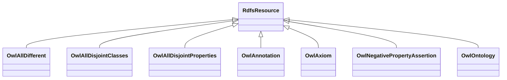

# Class: No class (type) name specified (rdfs_Resource)


_No class (type) description specified_


This class occurs 0 times.


URI: [rdfs:Resource](http://www.w3.org/2000/01/rdf-schema#Resource)





## Inheritance
* **RdfsResource**
    * [OwlAllDifferent](../classes/OwlAllDifferent.md)
    * [OwlAllDisjointClasses](../classes/OwlAllDisjointClasses.md)
    * [OwlAllDisjointProperties](../classes/OwlAllDisjointProperties.md)
    * [OwlAnnotation](../classes/OwlAnnotation.md)
    * [OwlAxiom](../classes/OwlAxiom.md)
    * [OwlNegativePropertyAssertion](../classes/OwlNegativePropertyAssertion.md)
    * [OwlOntology](../classes/OwlOntology.md)


## Slots

| Name | Cardinality and Range | Description | Inheritance | Occurrences |
| ---  | --- | --- | --- | --- |


## LinkML Source

<!-- TODO: investigate https://stackoverflow.com/questions/37606292/how-to-create-tabbed-code-blocks-in-mkdocs-or-sphinx -->

### Direct

<details>

```yaml
name: rdfs_Resource
conforms_to: No schema conformance document specified
annotations:
  count:
    tag: count
    value: 0
description: No class (type) description specified
title: No class (type) name specified
from_schema: hydrology-kg
rank: 1000
class_uri: rdfs:Resource

```
</details>

### Induced

<details>

```yaml
name: rdfs_Resource
conforms_to: No schema conformance document specified
annotations:
  count:
    tag: count
    value: 0
description: No class (type) description specified
title: No class (type) name specified
from_schema: hydrology-kg
rank: 1000
class_uri: rdfs:Resource

```
</details>