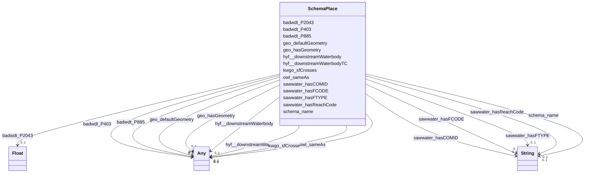

# Class: Place (schema_Place)


_Entities that have a somewhat fixed, physical extension._


This class occurs 68837 times.


URI: [schema:Place](https://schema.org/Place)





<!-- no inheritance hierarchy -->


## Slots

| Name | Cardinality and Range | Description | Inheritance | Occurrences |
| ---  | --- | --- | --- | --- |
| [badwdt_P2043](../slots/badwdt_P2043.md) | 0..1 <br/> [xsd:float](http://www.w3.org/2001/XMLSchema#float) | No slot (predicate) description specified <br/>  | direct | 68837 |
| [badwdt_P403](../slots/badwdt_P403.md) | 0..1 <br/> [GeoFeature](../classes/GeoFeature.md)&nbsp;or&nbsp;<br />[OwlThing](../classes/OwlThing.md) | No slot (predicate) description specified <br/>  | direct | 137674 |
| [owl_sameAs](../slots/owl_sameAs.md) | 0..1 <br/> [HyfHYWaterBody](../classes/HyfHYWaterBody.md)&nbsp;or&nbsp;<br />[KwgoS2CellLevel13](../classes/KwgoS2CellLevel13.md)&nbsp;or&nbsp;<br />[OwlThing](../classes/OwlThing.md)&nbsp;or&nbsp;<br />[xsd:anyURI](http://www.w3.org/2001/XMLSchema#anyURI)&nbsp;or&nbsp;<br />[Sf#LineString](../classes/Sf#LineString.md)&nbsp;or&nbsp;<br />[Sf#Polygon](../classes/Sf#Polygon.md)&nbsp;or&nbsp;<br />[Sf#MultiPolygon](../classes/Sf#MultiPolygon.md)&nbsp;or&nbsp;<br />[HyfHYWaterbody](../classes/HyfHYWaterbody.md)&nbsp;or&nbsp;<br />[RdfList](../classes/RdfList.md)&nbsp;or&nbsp;<br />[GeoFeature](../classes/GeoFeature.md)&nbsp;or&nbsp;<br />[GeoGeometry](../classes/GeoGeometry.md)&nbsp;or&nbsp;<br />[HyfHYFlowPath](../classes/HyfHYFlowPath.md)&nbsp;or&nbsp;<br />[SchemaPlace](../classes/SchemaPlace.md)&nbsp;or&nbsp;<br />[Gwml22GWAquifer](../classes/Gwml22GWAquifer.md)&nbsp;or&nbsp;<br />[RdfObjectProperty](../classes/RdfObjectProperty.md) | No slot (predicate) description specified <br/>  | direct | 275348 |
| [kwgo_sfCrosses](../slots/kwgo_sfCrosses.md) | 0..1 <br/> [KwgoS2CellLevel13](../classes/KwgoS2CellLevel13.md)&nbsp;or&nbsp;<br />[OwlThing](../classes/OwlThing.md)&nbsp;or&nbsp;<br />[HyfHYWaterbody](../classes/HyfHYWaterbody.md)&nbsp;or&nbsp;<br />[HyfHYFlowPath](../classes/HyfHYFlowPath.md)&nbsp;or&nbsp;<br />[SchemaPlace](../classes/SchemaPlace.md) | No slot (predicate) description specified <br/>  | direct | 292452 |
| [hyf__downstreamWaterbodyTC](../slots/hyf__downstreamWaterbodyTC.md) | 0..1 <br/> [HyfHYFlowPath](../classes/HyfHYFlowPath.md)&nbsp;or&nbsp;<br />[SchemaPlace](../classes/SchemaPlace.md)&nbsp;or&nbsp;<br />[OwlThing](../classes/OwlThing.md)&nbsp;or&nbsp;<br />[HyfHYWaterbody](../classes/HyfHYWaterbody.md) | No slot (predicate) description specified <br/>  | direct | 264557398 |
| [hyf__downstreamWaterbody](../slots/hyf__downstreamWaterbody.md) | 0..1 <br/> [HyfHYFlowPath](../classes/HyfHYFlowPath.md)&nbsp;or&nbsp;<br />[SchemaPlace](../classes/SchemaPlace.md)&nbsp;or&nbsp;<br />[OwlThing](../classes/OwlThing.md)&nbsp;or&nbsp;<br />[HyfHYWaterbody](../classes/HyfHYWaterbody.md) | No slot (predicate) description specified <br/>  | direct | 550068 |
| [sawwater_hasFTYPE](../slots/sawwater_hasFTYPE.md) | 0..1 <br/> [xsd:string](http://www.w3.org/2001/XMLSchema#string) | No slot (predicate) description specified <br/>  | direct | 68837 |
| [geo_hasGeometry](../slots/geo_hasGeometry.md) | 0..1 <br/> [OwlThing](../classes/OwlThing.md)&nbsp;or&nbsp;<br />[Sf#LineString](../classes/Sf#LineString.md)&nbsp;or&nbsp;<br />[Sf#Polygon](../classes/Sf#Polygon.md)&nbsp;or&nbsp;<br />[Sf#MultiPolygon](../classes/Sf#MultiPolygon.md)&nbsp;or&nbsp;<br />[GeoGeometry](../classes/GeoGeometry.md) | No slot (predicate) description specified <br/>  | direct | 206511 |
| [schema_name](../slots/schema_name.md) | 0..1 <br/> [xsd:string](http://www.w3.org/2001/XMLSchema#string) | The name of the item <br/>  | direct | 33928 |
| [sawwater_hasFCODE](../slots/sawwater_hasFCODE.md) | 0..1 <br/> [xsd:string](http://www.w3.org/2001/XMLSchema#string) | No slot (predicate) description specified <br/>  | direct | 68837 |
| [sawwater_hasCOMID](../slots/sawwater_hasCOMID.md) | 0..1 <br/> [xsd:string](http://www.w3.org/2001/XMLSchema#string) | No slot (predicate) description specified <br/>  | direct | 68837 |
| [badwdt_P885](../slots/badwdt_P885.md) | 0..1 <br/> [GeoFeature](../classes/GeoFeature.md)&nbsp;or&nbsp;<br />[OwlThing](../classes/OwlThing.md) | No slot (predicate) description specified <br/>  | direct | 137674 |
| [sawwater_hasReachCode](../slots/sawwater_hasReachCode.md) | 0..1 <br/> [xsd:string](http://www.w3.org/2001/XMLSchema#string) | No slot (predicate) description specified <br/>  | direct | 68837 |
| [geo_defaultGeometry](../slots/geo_defaultGeometry.md) | 0..1 <br/> [OwlThing](../classes/OwlThing.md)&nbsp;or&nbsp;<br />[Sf#LineString](../classes/Sf#LineString.md)&nbsp;or&nbsp;<br />[Sf#Polygon](../classes/Sf#Polygon.md)&nbsp;or&nbsp;<br />[Sf#MultiPolygon](../classes/Sf#MultiPolygon.md)&nbsp;or&nbsp;<br />[GeoGeometry](../classes/GeoGeometry.md) | No slot (predicate) description specified <br/>  | direct | 206511 |


## Usages

| used by | used in | type | used |
| ---  | --- | --- | --- |
| [GeoFeature](../classes/GeoFeature.md) | [owl_sameAs](../slots/owl_sameAs.md) | any_of[range] | [SchemaPlace](../classes/SchemaPlace.md) |
| [GeoGeometry](../classes/GeoGeometry.md) | [owl_sameAs](../slots/owl_sameAs.md) | any_of[range] | [SchemaPlace](../classes/SchemaPlace.md) |
| [Gwml22GWAquifer](../classes/Gwml22GWAquifer.md) | [owl_sameAs](../slots/owl_sameAs.md) | any_of[range] | [SchemaPlace](../classes/SchemaPlace.md) |
| [HyfHYFlowPath](../classes/HyfHYFlowPath.md) | [owl_sameAs](../slots/owl_sameAs.md) | any_of[range] | [SchemaPlace](../classes/SchemaPlace.md) |
| [HyfHYFlowPath](../classes/HyfHYFlowPath.md) | [kwgo_sfCrosses](../slots/kwgo_sfCrosses.md) | any_of[range] | [SchemaPlace](../classes/SchemaPlace.md) |
| [HyfHYFlowPath](../classes/HyfHYFlowPath.md) | [hyf__downstreamWaterbodyTC](../slots/hyf__downstreamWaterbodyTC.md) | any_of[range] | [SchemaPlace](../classes/SchemaPlace.md) |
| [HyfHYFlowPath](../classes/HyfHYFlowPath.md) | [hyf__downstreamWaterbody](../slots/hyf__downstreamWaterbody.md) | any_of[range] | [SchemaPlace](../classes/SchemaPlace.md) |
| [HyfHYWaterBody](../classes/HyfHYWaterBody.md) | [owl_sameAs](../slots/owl_sameAs.md) | any_of[range] | [SchemaPlace](../classes/SchemaPlace.md) |
| [HyfHYWaterbody](../classes/HyfHYWaterbody.md) | [owl_sameAs](../slots/owl_sameAs.md) | any_of[range] | [SchemaPlace](../classes/SchemaPlace.md) |
| [HyfHYWaterbody](../classes/HyfHYWaterbody.md) | [kwgo_sfCrosses](../slots/kwgo_sfCrosses.md) | any_of[range] | [SchemaPlace](../classes/SchemaPlace.md) |
| [HyfHYWaterbody](../classes/HyfHYWaterbody.md) | [hyf__downstreamWaterbodyTC](../slots/hyf__downstreamWaterbodyTC.md) | any_of[range] | [SchemaPlace](../classes/SchemaPlace.md) |
| [HyfHYWaterbody](../classes/HyfHYWaterbody.md) | [hyf__downstreamWaterbody](../slots/hyf__downstreamWaterbody.md) | any_of[range] | [SchemaPlace](../classes/SchemaPlace.md) |
| [KwgoS2CellLevel13](../classes/KwgoS2CellLevel13.md) | [owl_sameAs](../slots/owl_sameAs.md) | any_of[range] | [SchemaPlace](../classes/SchemaPlace.md) |
| [KwgoS2CellLevel13](../classes/KwgoS2CellLevel13.md) | [kwgo_sfCrosses](../slots/kwgo_sfCrosses.md) | any_of[range] | [SchemaPlace](../classes/SchemaPlace.md) |
| [OwlNamedIndividual](../classes/OwlNamedIndividual.md) | [kwgo_sfCrosses](../slots/kwgo_sfCrosses.md) | any_of[range] | [SchemaPlace](../classes/SchemaPlace.md) |
| [OwlNamedIndividual](../classes/OwlNamedIndividual.md) | [owl_sameAs](../slots/owl_sameAs.md) | any_of[range] | [SchemaPlace](../classes/SchemaPlace.md) |
| [OwlNamedIndividual](../classes/OwlNamedIndividual.md) | [hyf__downstreamWaterbody](../slots/hyf__downstreamWaterbody.md) | any_of[range] | [SchemaPlace](../classes/SchemaPlace.md) |
| [OwlNamedIndividual](../classes/OwlNamedIndividual.md) | [hyf__downstreamWaterbodyTC](../slots/hyf__downstreamWaterbodyTC.md) | any_of[range] | [SchemaPlace](../classes/SchemaPlace.md) |
| [OwlNothing](../classes/OwlNothing.md) | [kwgo_sfCrosses](../slots/kwgo_sfCrosses.md) | any_of[range] | [SchemaPlace](../classes/SchemaPlace.md) |
| [OwlNothing](../classes/OwlNothing.md) | [owl_sameAs](../slots/owl_sameAs.md) | any_of[range] | [SchemaPlace](../classes/SchemaPlace.md) |
| [OwlNothing](../classes/OwlNothing.md) | [hyf__downstreamWaterbody](../slots/hyf__downstreamWaterbody.md) | any_of[range] | [SchemaPlace](../classes/SchemaPlace.md) |
| [OwlNothing](../classes/OwlNothing.md) | [hyf__downstreamWaterbodyTC](../slots/hyf__downstreamWaterbodyTC.md) | any_of[range] | [SchemaPlace](../classes/SchemaPlace.md) |
| [OwlThing](../classes/OwlThing.md) | [kwgo_sfCrosses](../slots/kwgo_sfCrosses.md) | any_of[range] | [SchemaPlace](../classes/SchemaPlace.md) |
| [OwlThing](../classes/OwlThing.md) | [owl_sameAs](../slots/owl_sameAs.md) | any_of[range] | [SchemaPlace](../classes/SchemaPlace.md) |
| [OwlThing](../classes/OwlThing.md) | [hyf__downstreamWaterbody](../slots/hyf__downstreamWaterbody.md) | any_of[range] | [SchemaPlace](../classes/SchemaPlace.md) |
| [OwlThing](../classes/OwlThing.md) | [hyf__downstreamWaterbodyTC](../slots/hyf__downstreamWaterbodyTC.md) | any_of[range] | [SchemaPlace](../classes/SchemaPlace.md) |
| [RdfList](../classes/RdfList.md) | [owl_sameAs](../slots/owl_sameAs.md) | any_of[range] | [SchemaPlace](../classes/SchemaPlace.md) |
| [RdfObjectProperty](../classes/RdfObjectProperty.md) | [owl_sameAs](../slots/owl_sameAs.md) | any_of[range] | [SchemaPlace](../classes/SchemaPlace.md) |
| [SchemaPlace](../classes/SchemaPlace.md) | [owl_sameAs](../slots/owl_sameAs.md) | any_of[range] | [SchemaPlace](../classes/SchemaPlace.md) |
| [SchemaPlace](../classes/SchemaPlace.md) | [kwgo_sfCrosses](../slots/kwgo_sfCrosses.md) | any_of[range] | [SchemaPlace](../classes/SchemaPlace.md) |
| [SchemaPlace](../classes/SchemaPlace.md) | [hyf__downstreamWaterbodyTC](../slots/hyf__downstreamWaterbodyTC.md) | any_of[range] | [SchemaPlace](../classes/SchemaPlace.md) |
| [SchemaPlace](../classes/SchemaPlace.md) | [hyf__downstreamWaterbody](../slots/hyf__downstreamWaterbody.md) | any_of[range] | [SchemaPlace](../classes/SchemaPlace.md) |
| [Sf#LineString](../classes/Sf#LineString.md) | [owl_sameAs](../slots/owl_sameAs.md) | any_of[range] | [SchemaPlace](../classes/SchemaPlace.md) |
| [Sf#MultiPolygon](../classes/Sf#MultiPolygon.md) | [owl_sameAs](../slots/owl_sameAs.md) | any_of[range] | [SchemaPlace](../classes/SchemaPlace.md) |
| [Sf#Polygon](../classes/Sf#Polygon.md) | [owl_sameAs](../slots/owl_sameAs.md) | any_of[range] | [SchemaPlace](../classes/SchemaPlace.md) |


## LinkML Source

<!-- TODO: investigate https://stackoverflow.com/questions/37606292/how-to-create-tabbed-code-blocks-in-mkdocs-or-sphinx -->

### Direct

<details>

```yaml
name: schema_Place
conforms_to: No schema conformance document specified
annotations:
  count:
    tag: count
    value: 68837
description: Entities that have a somewhat fixed, physical extension.
title: Place
from_schema: hydrology-kg
rank: 1000
slots:
- badwdt_P2043
- badwdt_P403
- owl_sameAs
- kwgo_sfCrosses
- hyf__downstreamWaterbodyTC
- hyf__downstreamWaterbody
- sawwater_hasFTYPE
- geo_hasGeometry
- schema_name
- sawwater_hasFCODE
- sawwater_hasCOMID
- badwdt_P885
- sawwater_hasReachCode
- geo_defaultGeometry
slot_usage:
  badwdt_P2043:
    name: badwdt_P2043
    annotations:
      float:
        tag: float
        value: 68837
  badwdt_P403:
    name: badwdt_P403
    annotations:
      geo_Feature:
        tag: geo_Feature
        value: 68837
      owl_Thing:
        tag: owl_Thing
        value: 68837
  badwdt_P885:
    name: badwdt_P885
    annotations:
      geo_Feature:
        tag: geo_Feature
        value: 68837
      owl_Thing:
        tag: owl_Thing
        value: 68837
  geo_defaultGeometry:
    name: geo_defaultGeometry
    annotations:
      geo_Geometry:
        tag: geo_Geometry
        value: 68837
      owl_Thing:
        tag: owl_Thing
        value: 68837
      sf_#LineString:
        tag: sf_#LineString
        value: 68837
  geo_hasGeometry:
    name: geo_hasGeometry
    annotations:
      geo_Geometry:
        tag: geo_Geometry
        value: 68837
      owl_Thing:
        tag: owl_Thing
        value: 68837
      sf_#LineString:
        tag: sf_#LineString
        value: 68837
  hyf__downstreamWaterbody:
    name: hyf__downstreamWaterbody
    annotations:
      hyf__HY_FlowPath:
        tag: hyf__HY_FlowPath
        value: 137468
      hyf__HY_Waterbody:
        tag: hyf__HY_Waterbody
        value: 137468
      owl_Thing:
        tag: owl_Thing
        value: 137664
      schema_Place:
        tag: schema_Place
        value: 137468
  hyf__downstreamWaterbodyTC:
    name: hyf__downstreamWaterbodyTC
    annotations:
      hyf__HY_FlowPath:
        tag: hyf__HY_FlowPath
        value: 66122373
      hyf__HY_Waterbody:
        tag: hyf__HY_Waterbody
        value: 66122373
      owl_Thing:
        tag: owl_Thing
        value: 66190279
      schema_Place:
        tag: schema_Place
        value: 66122373
  kwgo_sfCrosses:
    name: kwgo_sfCrosses
    annotations:
      kwgo_S2Cell_Level13:
        tag: kwgo_S2Cell_Level13
        value: 94779
      owl_Thing:
        tag: owl_Thing
        value: 197673
  owl_sameAs:
    name: owl_sameAs
    annotations:
      hyf__HY_FlowPath:
        tag: hyf__HY_FlowPath
        value: 68837
      hyf__HY_Waterbody:
        tag: hyf__HY_Waterbody
        value: 68837
      owl_Thing:
        tag: owl_Thing
        value: 68837
      schema_Place:
        tag: schema_Place
        value: 68837
  sawwater_hasCOMID:
    name: sawwater_hasCOMID
    annotations:
      string:
        tag: string
        value: 68837
  sawwater_hasFCODE:
    name: sawwater_hasFCODE
    annotations:
      string:
        tag: string
        value: 68837
  sawwater_hasFTYPE:
    name: sawwater_hasFTYPE
    annotations:
      string:
        tag: string
        value: 68837
  sawwater_hasReachCode:
    name: sawwater_hasReachCode
    annotations:
      string:
        tag: string
        value: 68837
  schema_name:
    name: schema_name
    annotations:
      string:
        tag: string
        value: 33928
class_uri: schema:Place

```
</details>

### Induced

<details>

```yaml
name: schema_Place
conforms_to: No schema conformance document specified
annotations:
  count:
    tag: count
    value: 68837
description: Entities that have a somewhat fixed, physical extension.
title: Place
from_schema: hydrology-kg
rank: 1000
slot_usage:
  badwdt_P2043:
    name: badwdt_P2043
    annotations:
      float:
        tag: float
        value: 68837
  badwdt_P403:
    name: badwdt_P403
    annotations:
      geo_Feature:
        tag: geo_Feature
        value: 68837
      owl_Thing:
        tag: owl_Thing
        value: 68837
  badwdt_P885:
    name: badwdt_P885
    annotations:
      geo_Feature:
        tag: geo_Feature
        value: 68837
      owl_Thing:
        tag: owl_Thing
        value: 68837
  geo_defaultGeometry:
    name: geo_defaultGeometry
    annotations:
      geo_Geometry:
        tag: geo_Geometry
        value: 68837
      owl_Thing:
        tag: owl_Thing
        value: 68837
      sf_#LineString:
        tag: sf_#LineString
        value: 68837
  geo_hasGeometry:
    name: geo_hasGeometry
    annotations:
      geo_Geometry:
        tag: geo_Geometry
        value: 68837
      owl_Thing:
        tag: owl_Thing
        value: 68837
      sf_#LineString:
        tag: sf_#LineString
        value: 68837
  hyf__downstreamWaterbody:
    name: hyf__downstreamWaterbody
    annotations:
      hyf__HY_FlowPath:
        tag: hyf__HY_FlowPath
        value: 137468
      hyf__HY_Waterbody:
        tag: hyf__HY_Waterbody
        value: 137468
      owl_Thing:
        tag: owl_Thing
        value: 137664
      schema_Place:
        tag: schema_Place
        value: 137468
  hyf__downstreamWaterbodyTC:
    name: hyf__downstreamWaterbodyTC
    annotations:
      hyf__HY_FlowPath:
        tag: hyf__HY_FlowPath
        value: 66122373
      hyf__HY_Waterbody:
        tag: hyf__HY_Waterbody
        value: 66122373
      owl_Thing:
        tag: owl_Thing
        value: 66190279
      schema_Place:
        tag: schema_Place
        value: 66122373
  kwgo_sfCrosses:
    name: kwgo_sfCrosses
    annotations:
      kwgo_S2Cell_Level13:
        tag: kwgo_S2Cell_Level13
        value: 94779
      owl_Thing:
        tag: owl_Thing
        value: 197673
  owl_sameAs:
    name: owl_sameAs
    annotations:
      hyf__HY_FlowPath:
        tag: hyf__HY_FlowPath
        value: 68837
      hyf__HY_Waterbody:
        tag: hyf__HY_Waterbody
        value: 68837
      owl_Thing:
        tag: owl_Thing
        value: 68837
      schema_Place:
        tag: schema_Place
        value: 68837
  sawwater_hasCOMID:
    name: sawwater_hasCOMID
    annotations:
      string:
        tag: string
        value: 68837
  sawwater_hasFCODE:
    name: sawwater_hasFCODE
    annotations:
      string:
        tag: string
        value: 68837
  sawwater_hasFTYPE:
    name: sawwater_hasFTYPE
    annotations:
      string:
        tag: string
        value: 68837
  sawwater_hasReachCode:
    name: sawwater_hasReachCode
    annotations:
      string:
        tag: string
        value: 68837
  schema_name:
    name: schema_name
    annotations:
      string:
        tag: string
        value: 33928
attributes:
  badwdt_P2043:
    name: badwdt_P2043
    annotations:
      float:
        tag: float
        value: 68837
    description: No slot (predicate) description specified
    title: No slot (predicate) name specified
    examples:
    - object:
        example_object: '4.252'
        example_object_type: float
        example_predicate: badwdt:P2043
        example_subject: https://geoconnex.us/nhdplusv2/comid/1001
        example_subject_type: hyf__HY_Waterbody
    - object:
        example_object: '4.252'
        example_object_type: float
        example_predicate: badwdt:P2043
        example_subject: https://geoconnex.us/nhdplusv2/comid/1001
        example_subject_type: schema_Place
    - object:
        example_object: '4.252'
        example_object_type: float
        example_predicate: badwdt:P2043
        example_subject: https://geoconnex.us/nhdplusv2/comid/1001
        example_subject_type: owl_Thing
    - object:
        example_object: '4.252'
        example_object_type: float
        example_predicate: badwdt:P2043
        example_subject: https://geoconnex.us/nhdplusv2/comid/1001
        example_subject_type: hyf__HY_FlowPath
    from_schema: hydrology-kg
    rank: 1000
    slot_uri: badwdt:P2043
    alias: badwdt_P2043
    owner: schema_Place
    domain_of:
    - hyf__HY_FlowPath
    - hyf__HY_Waterbody
    - owl_Thing
    - schema_Place
    range: float
  badwdt_P403:
    name: badwdt_P403
    annotations:
      geo_Feature:
        tag: geo_Feature
        value: 68837
      owl_Thing:
        tag: owl_Thing
        value: 68837
    description: No slot (predicate) description specified
    title: No slot (predicate) name specified
    examples:
    - object:
        example_object: https://geoconnex.us/nhdplusv2/comid/1001.outlet
        example_object_type: geo_Feature
        example_predicate: badwdt:P403
        example_subject: https://geoconnex.us/nhdplusv2/comid/1001
        example_subject_type: hyf__HY_Waterbody
    - object:
        example_object: https://geoconnex.us/nhdplusv2/comid/1001.outlet
        example_object_type: owl_Thing
        example_predicate: badwdt:P403
        example_subject: https://geoconnex.us/nhdplusv2/comid/1001
        example_subject_type: hyf__HY_Waterbody
    - object:
        example_object: https://geoconnex.us/nhdplusv2/comid/1001.outlet
        example_object_type: geo_Feature
        example_predicate: badwdt:P403
        example_subject: https://geoconnex.us/nhdplusv2/comid/1001
        example_subject_type: schema_Place
    - object:
        example_object: https://geoconnex.us/nhdplusv2/comid/1001.outlet
        example_object_type: owl_Thing
        example_predicate: badwdt:P403
        example_subject: https://geoconnex.us/nhdplusv2/comid/1001
        example_subject_type: schema_Place
    - object:
        example_object: https://geoconnex.us/nhdplusv2/comid/1001.outlet
        example_object_type: geo_Feature
        example_predicate: badwdt:P403
        example_subject: https://geoconnex.us/nhdplusv2/comid/1001
        example_subject_type: owl_Thing
    - object:
        example_object: https://geoconnex.us/nhdplusv2/comid/1001.outlet
        example_object_type: owl_Thing
        example_predicate: badwdt:P403
        example_subject: https://geoconnex.us/nhdplusv2/comid/1001
        example_subject_type: owl_Thing
    - object:
        example_object: https://geoconnex.us/nhdplusv2/comid/1001.outlet
        example_object_type: geo_Feature
        example_predicate: badwdt:P403
        example_subject: https://geoconnex.us/nhdplusv2/comid/1001
        example_subject_type: hyf__HY_FlowPath
    - object:
        example_object: https://geoconnex.us/nhdplusv2/comid/1001.outlet
        example_object_type: owl_Thing
        example_predicate: badwdt:P403
        example_subject: https://geoconnex.us/nhdplusv2/comid/1001
        example_subject_type: hyf__HY_FlowPath
    from_schema: hydrology-kg
    rank: 1000
    slot_uri: badwdt:P403
    alias: badwdt_P403
    owner: schema_Place
    domain_of:
    - hyf__HY_FlowPath
    - hyf__HY_Waterbody
    - owl_Thing
    - schema_Place
    range: Any
    any_of:
    - range: geo_Feature
    - range: owl_Thing
  owl_sameAs:
    name: owl_sameAs
    annotations:
      hyf__HY_FlowPath:
        tag: hyf__HY_FlowPath
        value: 68837
      hyf__HY_Waterbody:
        tag: hyf__HY_Waterbody
        value: 68837
      owl_Thing:
        tag: owl_Thing
        value: 68837
      schema_Place:
        tag: schema_Place
        value: 68837
    description: No slot (predicate) description specified
    title: No slot (predicate) name specified
    examples:
    - object:
        example_object: memgs2:MGS
        example_object_type: owl_Thing
        example_predicate: owl:sameAs
        example_subject: memgs2:MGS
        example_subject_type: owl_Thing
    - object:
        example_object: http://sawgraph.spatialai.org/v1/me_mgs_data#d.MGS-Aquifer.0001
        example_object_type: gwml22_GW_Aquifer
        example_predicate: owl:sameAs
        example_subject: http://sawgraph.spatialai.org/v1/me_mgs_data#d.MGS-Aquifer.0001
        example_subject_type: gwml22_GW_Aquifer
    - object:
        example_object: http://sawgraph.spatialai.org/v1/me_mgs_data#d.MGS-Aquifer.0001
        example_object_type: owl_Thing
        example_predicate: owl:sameAs
        example_subject: http://sawgraph.spatialai.org/v1/me_mgs_data#d.MGS-Aquifer.0001
        example_subject_type: gwml22_GW_Aquifer
    - object:
        example_object: http://sawgraph.spatialai.org/v1/me_mgs_data#d.MGS-Aquifer.0001
        example_object_type: gwml22_GW_Aquifer
        example_predicate: owl:sameAs
        example_subject: http://sawgraph.spatialai.org/v1/me_mgs_data#d.MGS-Aquifer.0001
        example_subject_type: owl_Thing
    - object:
        example_object: http://sawgraph.spatialai.org/v1/me_mgs_data#d.MGS-Aquifer.Geometry.0001
        example_object_type: sf_#Polygon
        example_predicate: owl:sameAs
        example_subject: http://sawgraph.spatialai.org/v1/me_mgs_data#d.MGS-Aquifer.Geometry.0001
        example_subject_type: owl_Thing
    - object:
        example_object: http://sawgraph.spatialai.org/v1/me_mgs_data#d.MGS-Aquifer.Geometry.0001
        example_object_type: geo_Geometry
        example_predicate: owl:sameAs
        example_subject: http://sawgraph.spatialai.org/v1/me_mgs_data#d.MGS-Aquifer.Geometry.0001
        example_subject_type: owl_Thing
    - object:
        example_object: http://sawgraph.spatialai.org/v1/me_mgs_data#d.MGS-Aquifer.Geometry.0001
        example_object_type: owl_Thing
        example_predicate: owl:sameAs
        example_subject: http://sawgraph.spatialai.org/v1/me_mgs_data#d.MGS-Aquifer.Geometry.0001
        example_subject_type: sf_#Polygon
    - object:
        example_object: http://sawgraph.spatialai.org/v1/me_mgs_data#d.MGS-Aquifer.Geometry.0001
        example_object_type: sf_#Polygon
        example_predicate: owl:sameAs
        example_subject: http://sawgraph.spatialai.org/v1/me_mgs_data#d.MGS-Aquifer.Geometry.0001
        example_subject_type: sf_#Polygon
    - object:
        example_object: http://sawgraph.spatialai.org/v1/me_mgs_data#d.MGS-Aquifer.Geometry.0001
        example_object_type: geo_Geometry
        example_predicate: owl:sameAs
        example_subject: http://sawgraph.spatialai.org/v1/me_mgs_data#d.MGS-Aquifer.Geometry.0001
        example_subject_type: sf_#Polygon
    - object:
        example_object: http://sawgraph.spatialai.org/v1/me_mgs_data#d.MGS-Aquifer.Geometry.0001
        example_object_type: owl_Thing
        example_predicate: owl:sameAs
        example_subject: http://sawgraph.spatialai.org/v1/me_mgs_data#d.MGS-Aquifer.Geometry.0001
        example_subject_type: geo_Geometry
    - object:
        example_object: http://sawgraph.spatialai.org/v1/me_mgs_data#d.MGS-Aquifer.Geometry.0001
        example_object_type: sf_#Polygon
        example_predicate: owl:sameAs
        example_subject: http://sawgraph.spatialai.org/v1/me_mgs_data#d.MGS-Aquifer.Geometry.0001
        example_subject_type: geo_Geometry
    - object:
        example_object: http://sawgraph.spatialai.org/v1/me_mgs_data#d.MGS-Aquifer.Geometry.0001
        example_object_type: geo_Geometry
        example_predicate: owl:sameAs
        example_subject: http://sawgraph.spatialai.org/v1/me_mgs_data#d.MGS-Aquifer.Geometry.0001
        example_subject_type: geo_Geometry
    - object:
        example_object: http://sawgraph.spatialai.org/v1/me_mgs_data#d.MGS-Aquifer.Geometry.0175
        example_object_type: owl_Thing
        example_predicate: owl:sameAs
        example_subject: http://sawgraph.spatialai.org/v1/me_mgs_data#d.MGS-Aquifer.Geometry.0175
        example_subject_type: sf_#MultiPolygon
    - object:
        example_object: http://sawgraph.spatialai.org/v1/me_mgs_data#d.MGS-Aquifer.Geometry.0175
        example_object_type: geo_Geometry
        example_predicate: owl:sameAs
        example_subject: http://sawgraph.spatialai.org/v1/me_mgs_data#d.MGS-Aquifer.Geometry.0175
        example_subject_type: sf_#MultiPolygon
    - object:
        example_object: http://sawgraph.spatialai.org/v1/me_mgs_data#d.MGS-Aquifer.Geometry.0175
        example_object_type: sf_#MultiPolygon
        example_predicate: owl:sameAs
        example_subject: http://sawgraph.spatialai.org/v1/me_mgs_data#d.MGS-Aquifer.Geometry.0175
        example_subject_type: sf_#MultiPolygon
    - object:
        example_object: http://sawgraph.spatialai.org/v1/me_mgs_data#d.MGS-Aquifer.Geometry.0175
        example_object_type: sf_#MultiPolygon
        example_predicate: owl:sameAs
        example_subject: http://sawgraph.spatialai.org/v1/me_mgs_data#d.MGS-Aquifer.Geometry.0175
        example_subject_type: owl_Thing
    - object:
        example_object: http://sawgraph.spatialai.org/v1/me_mgs_data#d.MGS-Aquifer.Geometry.0175
        example_object_type: sf_#MultiPolygon
        example_predicate: owl:sameAs
        example_subject: http://sawgraph.spatialai.org/v1/me_mgs_data#d.MGS-Aquifer.Geometry.0175
        example_subject_type: geo_Geometry
    - object:
        example_object: kwgr:s2.level13.5522341869704445952
        example_object_type: kwgo_S2Cell_Level13
        example_predicate: owl:sameAs
        example_subject: kwgr:s2.level13.5522341869704445952
        example_subject_type: kwgo_S2Cell_Level13
    - object:
        example_object: kwgr:s2.level13.5522341869704445952
        example_object_type: owl_Thing
        example_predicate: owl:sameAs
        example_subject: kwgr:s2.level13.5522341869704445952
        example_subject_type: kwgo_S2Cell_Level13
    - object:
        example_object: kwgr:s2.level13.5522341869704445952
        example_object_type: kwgo_S2Cell_Level13
        example_predicate: owl:sameAs
        example_subject: kwgr:s2.level13.5522341869704445952
        example_subject_type: owl_Thing
    - object:
        example_object: rdf:nil
        example_object_type: rdf_List
        example_predicate: owl:sameAs
        example_subject: rdf:nil
        example_subject_type: owl_Thing
    - object:
        example_object: rdf:nil
        example_object_type: owl_Thing
        example_predicate: owl:sameAs
        example_subject: rdf:nil
        example_subject_type: rdf_List
    - object:
        example_object: rdf:nil
        example_object_type: rdf_List
        example_predicate: owl:sameAs
        example_subject: rdf:nil
        example_subject_type: rdf_List
    - object:
        example_object: owl:topObjectProperty
        example_object_type: rdf_ObjectProperty
        example_predicate: owl:sameAs
        example_subject: owl:topObjectProperty
        example_subject_type: owl_Thing
    - object:
        example_object: owl:topObjectProperty
        example_object_type: owl_Thing
        example_predicate: owl:sameAs
        example_subject: owl:topObjectProperty
        example_subject_type: rdf_ObjectProperty
    - object:
        example_object: owl:topObjectProperty
        example_object_type: rdf_ObjectProperty
        example_predicate: owl:sameAs
        example_subject: owl:topObjectProperty
        example_subject_type: rdf_ObjectProperty
    - object:
        example_object: https://geoconnex.us/nhdplusv2/comid/1001
        example_object_type: hyf__HY_Waterbody
        example_predicate: owl:sameAs
        example_subject: https://geoconnex.us/nhdplusv2/comid/1001
        example_subject_type: hyf__HY_Waterbody
    - object:
        example_object: https://geoconnex.us/nhdplusv2/comid/1001
        example_object_type: schema_Place
        example_predicate: owl:sameAs
        example_subject: https://geoconnex.us/nhdplusv2/comid/1001
        example_subject_type: hyf__HY_Waterbody
    - object:
        example_object: https://geoconnex.us/nhdplusv2/comid/1001
        example_object_type: owl_Thing
        example_predicate: owl:sameAs
        example_subject: https://geoconnex.us/nhdplusv2/comid/1001
        example_subject_type: hyf__HY_Waterbody
    - object:
        example_object: https://geoconnex.us/nhdplusv2/comid/1001
        example_object_type: hyf__HY_FlowPath
        example_predicate: owl:sameAs
        example_subject: https://geoconnex.us/nhdplusv2/comid/1001
        example_subject_type: hyf__HY_Waterbody
    - object:
        example_object: https://geoconnex.us/nhdplusv2/comid/1001
        example_object_type: hyf__HY_Waterbody
        example_predicate: owl:sameAs
        example_subject: https://geoconnex.us/nhdplusv2/comid/1001
        example_subject_type: schema_Place
    - object:
        example_object: https://geoconnex.us/nhdplusv2/comid/1001
        example_object_type: schema_Place
        example_predicate: owl:sameAs
        example_subject: https://geoconnex.us/nhdplusv2/comid/1001
        example_subject_type: schema_Place
    - object:
        example_object: https://geoconnex.us/nhdplusv2/comid/1001
        example_object_type: owl_Thing
        example_predicate: owl:sameAs
        example_subject: https://geoconnex.us/nhdplusv2/comid/1001
        example_subject_type: schema_Place
    - object:
        example_object: https://geoconnex.us/nhdplusv2/comid/1001
        example_object_type: hyf__HY_FlowPath
        example_predicate: owl:sameAs
        example_subject: https://geoconnex.us/nhdplusv2/comid/1001
        example_subject_type: schema_Place
    - object:
        example_object: https://geoconnex.us/nhdplusv2/comid/1001
        example_object_type: hyf__HY_Waterbody
        example_predicate: owl:sameAs
        example_subject: https://geoconnex.us/nhdplusv2/comid/1001
        example_subject_type: owl_Thing
    - object:
        example_object: https://geoconnex.us/nhdplusv2/comid/1001
        example_object_type: schema_Place
        example_predicate: owl:sameAs
        example_subject: https://geoconnex.us/nhdplusv2/comid/1001
        example_subject_type: owl_Thing
    - object:
        example_object: https://geoconnex.us/nhdplusv2/comid/1001
        example_object_type: hyf__HY_FlowPath
        example_predicate: owl:sameAs
        example_subject: https://geoconnex.us/nhdplusv2/comid/1001
        example_subject_type: owl_Thing
    - object:
        example_object: https://geoconnex.us/nhdplusv2/comid/1001
        example_object_type: hyf__HY_Waterbody
        example_predicate: owl:sameAs
        example_subject: https://geoconnex.us/nhdplusv2/comid/1001
        example_subject_type: hyf__HY_FlowPath
    - object:
        example_object: https://geoconnex.us/nhdplusv2/comid/1001
        example_object_type: schema_Place
        example_predicate: owl:sameAs
        example_subject: https://geoconnex.us/nhdplusv2/comid/1001
        example_subject_type: hyf__HY_FlowPath
    - object:
        example_object: https://geoconnex.us/nhdplusv2/comid/1001
        example_object_type: owl_Thing
        example_predicate: owl:sameAs
        example_subject: https://geoconnex.us/nhdplusv2/comid/1001
        example_subject_type: hyf__HY_FlowPath
    - object:
        example_object: https://geoconnex.us/nhdplusv2/comid/1001
        example_object_type: hyf__HY_FlowPath
        example_predicate: owl:sameAs
        example_subject: https://geoconnex.us/nhdplusv2/comid/1001
        example_subject_type: hyf__HY_FlowPath
    - object:
        example_object: https://geoconnex.us/nhdplusv2/comid/1001.geometry
        example_object_type: sf_#LineString
        example_predicate: owl:sameAs
        example_subject: https://geoconnex.us/nhdplusv2/comid/1001.geometry
        example_subject_type: owl_Thing
    - object:
        example_object: https://geoconnex.us/nhdplusv2/comid/1001.geometry
        example_object_type: owl_Thing
        example_predicate: owl:sameAs
        example_subject: https://geoconnex.us/nhdplusv2/comid/1001.geometry
        example_subject_type: sf_#LineString
    - object:
        example_object: https://geoconnex.us/nhdplusv2/comid/1001.geometry
        example_object_type: sf_#LineString
        example_predicate: owl:sameAs
        example_subject: https://geoconnex.us/nhdplusv2/comid/1001.geometry
        example_subject_type: sf_#LineString
    - object:
        example_object: https://geoconnex.us/nhdplusv2/comid/1001.geometry
        example_object_type: geo_Geometry
        example_predicate: owl:sameAs
        example_subject: https://geoconnex.us/nhdplusv2/comid/1001.geometry
        example_subject_type: sf_#LineString
    - object:
        example_object: https://geoconnex.us/nhdplusv2/comid/1001.geometry
        example_object_type: sf_#LineString
        example_predicate: owl:sameAs
        example_subject: https://geoconnex.us/nhdplusv2/comid/1001.geometry
        example_subject_type: geo_Geometry
    - object:
        example_object: https://geoconnex.us/nhdplusv2/comid/1001.head
        example_object_type: geo_Feature
        example_predicate: owl:sameAs
        example_subject: https://geoconnex.us/nhdplusv2/comid/1001.head
        example_subject_type: geo_Feature
    - object:
        example_object: https://geoconnex.us/nhdplusv2/comid/1001.head
        example_object_type: owl_Thing
        example_predicate: owl:sameAs
        example_subject: https://geoconnex.us/nhdplusv2/comid/1001.head
        example_subject_type: geo_Feature
    - object:
        example_object: https://geoconnex.us/nhdplusv2/comid/1001.head
        example_object_type: geo_Feature
        example_predicate: owl:sameAs
        example_subject: https://geoconnex.us/nhdplusv2/comid/1001.head
        example_subject_type: owl_Thing
    - object:
        example_object: https://geoconnex.us/nhdplusv2/comid/10101972
        example_object_type: hyf__HY_WaterBody
        example_predicate: owl:sameAs
        example_subject: https://geoconnex.us/nhdplusv2/comid/10101972
        example_subject_type: hyf__HY_WaterBody
    - object:
        example_object: https://geoconnex.us/nhdplusv2/comid/10101972
        example_object_type: owl_Thing
        example_predicate: owl:sameAs
        example_subject: https://geoconnex.us/nhdplusv2/comid/10101972
        example_subject_type: hyf__HY_WaterBody
    - object:
        example_object: https://geoconnex.us/nhdplusv2/comid/10101972
        example_object_type: hyf__HY_WaterBody
        example_predicate: owl:sameAs
        example_subject: https://geoconnex.us/nhdplusv2/comid/10101972
        example_subject_type: owl_Thing
    from_schema: hydrology-kg
    rank: 1000
    domain: owl_sameAs
    slot_uri: owl:sameAs
    alias: owl_sameAs
    owner: schema_Place
    domain_of:
    - geo_Feature
    - geo_Geometry
    - gwml22_GW_Aquifer
    - hyf__HY_FlowPath
    - hyf__HY_WaterBody
    - hyf__HY_Waterbody
    - kwgo_S2Cell_Level13
    - owl_Thing
    - rdf_List
    - rdf_ObjectProperty
    - schema_Place
    - sf_#LineString
    - sf_#MultiPolygon
    - sf_#Polygon
    range: Any
    any_of:
    - range: hyf__HY_WaterBody
    - range: kwgo_S2Cell_Level13
    - range: owl_Thing
    - range: uri
    - range: sf_#LineString
    - range: sf_#Polygon
    - range: sf_#MultiPolygon
    - range: hyf__HY_Waterbody
    - range: rdf_List
    - range: geo_Feature
    - range: geo_Geometry
    - range: hyf__HY_FlowPath
    - range: schema_Place
    - range: gwml22_GW_Aquifer
    - range: rdf_ObjectProperty
  kwgo_sfCrosses:
    name: kwgo_sfCrosses
    annotations:
      kwgo_S2Cell_Level13:
        tag: kwgo_S2Cell_Level13
        value: 94779
      owl_Thing:
        tag: owl_Thing
        value: 197673
    description: No slot (predicate) description specified
    title: No slot (predicate) name specified
    examples:
    - object:
        example_object: https://geoconnex.us/nhdplusv2/comid/166195770
        example_object_type: hyf__HY_Waterbody
        example_predicate: kwgo:sfCrosses
        example_subject: kwgr:s2.level13.5522339705040928768
        example_subject_type: owl_Thing
    - object:
        example_object: https://geoconnex.us/nhdplusv2/comid/166195770
        example_object_type: schema_Place
        example_predicate: kwgo:sfCrosses
        example_subject: kwgr:s2.level13.5522339705040928768
        example_subject_type: owl_Thing
    - object:
        example_object: https://geoconnex.us/nhdplusv2/comid/166195770
        example_object_type: owl_Thing
        example_predicate: kwgo:sfCrosses
        example_subject: kwgr:s2.level13.5522339705040928768
        example_subject_type: owl_Thing
    - object:
        example_object: https://geoconnex.us/nhdplusv2/comid/166195770
        example_object_type: hyf__HY_FlowPath
        example_predicate: kwgo:sfCrosses
        example_subject: kwgr:s2.level13.5522339705040928768
        example_subject_type: owl_Thing
    - object:
        example_object: https://geoconnex.us/nhdplusv2/comid/803107
        example_object_type: hyf__HY_Waterbody
        example_predicate: kwgo:sfCrosses
        example_subject: kwgr:s2.level13.5522341904064184320
        example_subject_type: kwgo_S2Cell_Level13
    - object:
        example_object: https://geoconnex.us/nhdplusv2/comid/803107
        example_object_type: schema_Place
        example_predicate: kwgo:sfCrosses
        example_subject: kwgr:s2.level13.5522341904064184320
        example_subject_type: kwgo_S2Cell_Level13
    - object:
        example_object: https://geoconnex.us/nhdplusv2/comid/803107
        example_object_type: owl_Thing
        example_predicate: kwgo:sfCrosses
        example_subject: kwgr:s2.level13.5522341904064184320
        example_subject_type: kwgo_S2Cell_Level13
    - object:
        example_object: https://geoconnex.us/nhdplusv2/comid/803107
        example_object_type: hyf__HY_FlowPath
        example_predicate: kwgo:sfCrosses
        example_subject: kwgr:s2.level13.5522341904064184320
        example_subject_type: kwgo_S2Cell_Level13
    - object:
        example_object: kwgr:s2.level13.5522769236130267136
        example_object_type: kwgo_S2Cell_Level13
        example_predicate: kwgo:sfCrosses
        example_subject: https://geoconnex.us/nhdplusv2/comid/1001
        example_subject_type: hyf__HY_Waterbody
    - object:
        example_object: kwgr:s2.level13.5522769236130267136
        example_object_type: owl_Thing
        example_predicate: kwgo:sfCrosses
        example_subject: https://geoconnex.us/nhdplusv2/comid/1001
        example_subject_type: hyf__HY_Waterbody
    - object:
        example_object: kwgr:s2.level13.5522769236130267136
        example_object_type: kwgo_S2Cell_Level13
        example_predicate: kwgo:sfCrosses
        example_subject: https://geoconnex.us/nhdplusv2/comid/1001
        example_subject_type: schema_Place
    - object:
        example_object: kwgr:s2.level13.5522769236130267136
        example_object_type: owl_Thing
        example_predicate: kwgo:sfCrosses
        example_subject: https://geoconnex.us/nhdplusv2/comid/1001
        example_subject_type: schema_Place
    - object:
        example_object: kwgr:s2.level13.5522769236130267136
        example_object_type: kwgo_S2Cell_Level13
        example_predicate: kwgo:sfCrosses
        example_subject: https://geoconnex.us/nhdplusv2/comid/1001
        example_subject_type: owl_Thing
    - object:
        example_object: kwgr:s2.level13.5522769236130267136
        example_object_type: kwgo_S2Cell_Level13
        example_predicate: kwgo:sfCrosses
        example_subject: https://geoconnex.us/nhdplusv2/comid/1001
        example_subject_type: hyf__HY_FlowPath
    - object:
        example_object: kwgr:s2.level13.5522769236130267136
        example_object_type: owl_Thing
        example_predicate: kwgo:sfCrosses
        example_subject: https://geoconnex.us/nhdplusv2/comid/1001
        example_subject_type: hyf__HY_FlowPath
    from_schema: hydrology-kg
    rank: 1000
    slot_uri: kwgo:sfCrosses
    alias: kwgo_sfCrosses
    owner: schema_Place
    domain_of:
    - hyf__HY_FlowPath
    - hyf__HY_Waterbody
    - kwgo_S2Cell_Level13
    - owl_Thing
    - schema_Place
    range: Any
    any_of:
    - range: kwgo_S2Cell_Level13
    - range: owl_Thing
    - range: hyf__HY_Waterbody
    - range: hyf__HY_FlowPath
    - range: schema_Place
  hyf__downstreamWaterbodyTC:
    name: hyf__downstreamWaterbodyTC
    annotations:
      hyf__HY_FlowPath:
        tag: hyf__HY_FlowPath
        value: 66122373
      hyf__HY_Waterbody:
        tag: hyf__HY_Waterbody
        value: 66122373
      owl_Thing:
        tag: owl_Thing
        value: 66190279
      schema_Place:
        tag: schema_Place
        value: 66122373
    description: No slot (predicate) description specified
    title: No slot (predicate) name specified
    examples:
    - object:
        example_object: https://geoconnex.us/nhdplusv2/comid/0
        example_object_type: owl_Thing
        example_predicate: hyf:/downstreamWaterbodyTC
        example_subject: https://geoconnex.us/nhdplusv2/comid/1001
        example_subject_type: hyf__HY_Waterbody
    - object:
        example_object: https://geoconnex.us/nhdplusv2/comid/0
        example_object_type: owl_Thing
        example_predicate: hyf:/downstreamWaterbodyTC
        example_subject: https://geoconnex.us/nhdplusv2/comid/1001
        example_subject_type: schema_Place
    - object:
        example_object: https://geoconnex.us/nhdplusv2/comid/0
        example_object_type: owl_Thing
        example_predicate: hyf:/downstreamWaterbodyTC
        example_subject: https://geoconnex.us/nhdplusv2/comid/1001
        example_subject_type: owl_Thing
    - object:
        example_object: https://geoconnex.us/nhdplusv2/comid/0
        example_object_type: owl_Thing
        example_predicate: hyf:/downstreamWaterbodyTC
        example_subject: https://geoconnex.us/nhdplusv2/comid/1001
        example_subject_type: hyf__HY_FlowPath
    - object:
        example_object: https://geoconnex.us/nhdplusv2/comid/1001
        example_object_type: hyf__HY_Waterbody
        example_predicate: hyf:/downstreamWaterbodyTC
        example_subject: https://geoconnex.us/nhdplusv2/comid/1001
        example_subject_type: hyf__HY_Waterbody
    - object:
        example_object: https://geoconnex.us/nhdplusv2/comid/1001
        example_object_type: schema_Place
        example_predicate: hyf:/downstreamWaterbodyTC
        example_subject: https://geoconnex.us/nhdplusv2/comid/1001
        example_subject_type: hyf__HY_Waterbody
    - object:
        example_object: https://geoconnex.us/nhdplusv2/comid/1001
        example_object_type: hyf__HY_FlowPath
        example_predicate: hyf:/downstreamWaterbodyTC
        example_subject: https://geoconnex.us/nhdplusv2/comid/1001
        example_subject_type: hyf__HY_Waterbody
    - object:
        example_object: https://geoconnex.us/nhdplusv2/comid/1001
        example_object_type: hyf__HY_Waterbody
        example_predicate: hyf:/downstreamWaterbodyTC
        example_subject: https://geoconnex.us/nhdplusv2/comid/1001
        example_subject_type: schema_Place
    - object:
        example_object: https://geoconnex.us/nhdplusv2/comid/1001
        example_object_type: schema_Place
        example_predicate: hyf:/downstreamWaterbodyTC
        example_subject: https://geoconnex.us/nhdplusv2/comid/1001
        example_subject_type: schema_Place
    - object:
        example_object: https://geoconnex.us/nhdplusv2/comid/1001
        example_object_type: hyf__HY_FlowPath
        example_predicate: hyf:/downstreamWaterbodyTC
        example_subject: https://geoconnex.us/nhdplusv2/comid/1001
        example_subject_type: schema_Place
    - object:
        example_object: https://geoconnex.us/nhdplusv2/comid/1001
        example_object_type: hyf__HY_Waterbody
        example_predicate: hyf:/downstreamWaterbodyTC
        example_subject: https://geoconnex.us/nhdplusv2/comid/1001
        example_subject_type: owl_Thing
    - object:
        example_object: https://geoconnex.us/nhdplusv2/comid/1001
        example_object_type: schema_Place
        example_predicate: hyf:/downstreamWaterbodyTC
        example_subject: https://geoconnex.us/nhdplusv2/comid/1001
        example_subject_type: owl_Thing
    - object:
        example_object: https://geoconnex.us/nhdplusv2/comid/1001
        example_object_type: hyf__HY_FlowPath
        example_predicate: hyf:/downstreamWaterbodyTC
        example_subject: https://geoconnex.us/nhdplusv2/comid/1001
        example_subject_type: owl_Thing
    - object:
        example_object: https://geoconnex.us/nhdplusv2/comid/1001
        example_object_type: hyf__HY_Waterbody
        example_predicate: hyf:/downstreamWaterbodyTC
        example_subject: https://geoconnex.us/nhdplusv2/comid/1001
        example_subject_type: hyf__HY_FlowPath
    - object:
        example_object: https://geoconnex.us/nhdplusv2/comid/1001
        example_object_type: schema_Place
        example_predicate: hyf:/downstreamWaterbodyTC
        example_subject: https://geoconnex.us/nhdplusv2/comid/1001
        example_subject_type: hyf__HY_FlowPath
    - object:
        example_object: https://geoconnex.us/nhdplusv2/comid/1001
        example_object_type: hyf__HY_FlowPath
        example_predicate: hyf:/downstreamWaterbodyTC
        example_subject: https://geoconnex.us/nhdplusv2/comid/1001
        example_subject_type: hyf__HY_FlowPath
    from_schema: hydrology-kg
    rank: 1000
    slot_uri: hyf:/downstreamWaterbodyTC
    alias: hyf__downstreamWaterbodyTC
    owner: schema_Place
    domain_of:
    - hyf__HY_FlowPath
    - hyf__HY_Waterbody
    - owl_Thing
    - schema_Place
    range: Any
    any_of:
    - range: hyf__HY_FlowPath
    - range: schema_Place
    - range: owl_Thing
    - range: hyf__HY_Waterbody
  hyf__downstreamWaterbody:
    name: hyf__downstreamWaterbody
    annotations:
      hyf__HY_FlowPath:
        tag: hyf__HY_FlowPath
        value: 137468
      hyf__HY_Waterbody:
        tag: hyf__HY_Waterbody
        value: 137468
      owl_Thing:
        tag: owl_Thing
        value: 137664
      schema_Place:
        tag: schema_Place
        value: 137468
    description: No slot (predicate) description specified
    title: No slot (predicate) name specified
    examples:
    - object:
        example_object: https://geoconnex.us/nhdplusv2/comid/1001
        example_object_type: hyf__HY_Waterbody
        example_predicate: hyf:/downstreamWaterbody
        example_subject: https://geoconnex.us/nhdplusv2/comid/1001
        example_subject_type: hyf__HY_Waterbody
    - object:
        example_object: https://geoconnex.us/nhdplusv2/comid/1001
        example_object_type: schema_Place
        example_predicate: hyf:/downstreamWaterbody
        example_subject: https://geoconnex.us/nhdplusv2/comid/1001
        example_subject_type: hyf__HY_Waterbody
    - object:
        example_object: https://geoconnex.us/nhdplusv2/comid/1001
        example_object_type: owl_Thing
        example_predicate: hyf:/downstreamWaterbody
        example_subject: https://geoconnex.us/nhdplusv2/comid/1001
        example_subject_type: hyf__HY_Waterbody
    - object:
        example_object: https://geoconnex.us/nhdplusv2/comid/1001
        example_object_type: hyf__HY_FlowPath
        example_predicate: hyf:/downstreamWaterbody
        example_subject: https://geoconnex.us/nhdplusv2/comid/1001
        example_subject_type: hyf__HY_Waterbody
    - object:
        example_object: https://geoconnex.us/nhdplusv2/comid/1001
        example_object_type: hyf__HY_Waterbody
        example_predicate: hyf:/downstreamWaterbody
        example_subject: https://geoconnex.us/nhdplusv2/comid/1001
        example_subject_type: schema_Place
    - object:
        example_object: https://geoconnex.us/nhdplusv2/comid/1001
        example_object_type: schema_Place
        example_predicate: hyf:/downstreamWaterbody
        example_subject: https://geoconnex.us/nhdplusv2/comid/1001
        example_subject_type: schema_Place
    - object:
        example_object: https://geoconnex.us/nhdplusv2/comid/1001
        example_object_type: owl_Thing
        example_predicate: hyf:/downstreamWaterbody
        example_subject: https://geoconnex.us/nhdplusv2/comid/1001
        example_subject_type: schema_Place
    - object:
        example_object: https://geoconnex.us/nhdplusv2/comid/1001
        example_object_type: hyf__HY_FlowPath
        example_predicate: hyf:/downstreamWaterbody
        example_subject: https://geoconnex.us/nhdplusv2/comid/1001
        example_subject_type: schema_Place
    - object:
        example_object: https://geoconnex.us/nhdplusv2/comid/1001
        example_object_type: hyf__HY_Waterbody
        example_predicate: hyf:/downstreamWaterbody
        example_subject: https://geoconnex.us/nhdplusv2/comid/1001
        example_subject_type: owl_Thing
    - object:
        example_object: https://geoconnex.us/nhdplusv2/comid/1001
        example_object_type: schema_Place
        example_predicate: hyf:/downstreamWaterbody
        example_subject: https://geoconnex.us/nhdplusv2/comid/1001
        example_subject_type: owl_Thing
    - object:
        example_object: https://geoconnex.us/nhdplusv2/comid/1001
        example_object_type: owl_Thing
        example_predicate: hyf:/downstreamWaterbody
        example_subject: https://geoconnex.us/nhdplusv2/comid/1001
        example_subject_type: owl_Thing
    - object:
        example_object: https://geoconnex.us/nhdplusv2/comid/1001
        example_object_type: hyf__HY_FlowPath
        example_predicate: hyf:/downstreamWaterbody
        example_subject: https://geoconnex.us/nhdplusv2/comid/1001
        example_subject_type: owl_Thing
    - object:
        example_object: https://geoconnex.us/nhdplusv2/comid/1001
        example_object_type: hyf__HY_Waterbody
        example_predicate: hyf:/downstreamWaterbody
        example_subject: https://geoconnex.us/nhdplusv2/comid/1001
        example_subject_type: hyf__HY_FlowPath
    - object:
        example_object: https://geoconnex.us/nhdplusv2/comid/1001
        example_object_type: schema_Place
        example_predicate: hyf:/downstreamWaterbody
        example_subject: https://geoconnex.us/nhdplusv2/comid/1001
        example_subject_type: hyf__HY_FlowPath
    - object:
        example_object: https://geoconnex.us/nhdplusv2/comid/1001
        example_object_type: owl_Thing
        example_predicate: hyf:/downstreamWaterbody
        example_subject: https://geoconnex.us/nhdplusv2/comid/1001
        example_subject_type: hyf__HY_FlowPath
    - object:
        example_object: https://geoconnex.us/nhdplusv2/comid/1001
        example_object_type: hyf__HY_FlowPath
        example_predicate: hyf:/downstreamWaterbody
        example_subject: https://geoconnex.us/nhdplusv2/comid/1001
        example_subject_type: hyf__HY_FlowPath
    from_schema: hydrology-kg
    rank: 1000
    slot_uri: hyf:/downstreamWaterbody
    alias: hyf__downstreamWaterbody
    owner: schema_Place
    domain_of:
    - hyf__HY_FlowPath
    - hyf__HY_Waterbody
    - owl_Thing
    - schema_Place
    range: Any
    any_of:
    - range: hyf__HY_FlowPath
    - range: schema_Place
    - range: owl_Thing
    - range: hyf__HY_Waterbody
  sawwater_hasFTYPE:
    name: sawwater_hasFTYPE
    annotations:
      string:
        tag: string
        value: 68837
    description: No slot (predicate) description specified
    title: No slot (predicate) name specified
    examples:
    - object:
        example_object: StreamRiver
        example_object_type: string
        example_predicate: sawwater:hasFTYPE
        example_subject: https://geoconnex.us/nhdplusv2/comid/1001
        example_subject_type: hyf__HY_Waterbody
    - object:
        example_object: StreamRiver
        example_object_type: string
        example_predicate: sawwater:hasFTYPE
        example_subject: https://geoconnex.us/nhdplusv2/comid/1001
        example_subject_type: schema_Place
    - object:
        example_object: StreamRiver
        example_object_type: string
        example_predicate: sawwater:hasFTYPE
        example_subject: https://geoconnex.us/nhdplusv2/comid/1001
        example_subject_type: owl_Thing
    - object:
        example_object: StreamRiver
        example_object_type: string
        example_predicate: sawwater:hasFTYPE
        example_subject: https://geoconnex.us/nhdplusv2/comid/1001
        example_subject_type: hyf__HY_FlowPath
    from_schema: hydrology-kg
    rank: 1000
    slot_uri: sawwater:hasFTYPE
    alias: sawwater_hasFTYPE
    owner: schema_Place
    domain_of:
    - hyf__HY_FlowPath
    - hyf__HY_Waterbody
    - owl_Thing
    - schema_Place
    range: string
  geo_hasGeometry:
    name: geo_hasGeometry
    annotations:
      geo_Geometry:
        tag: geo_Geometry
        value: 68837
      owl_Thing:
        tag: owl_Thing
        value: 68837
      sf_#LineString:
        tag: sf_#LineString
        value: 68837
    description: No slot (predicate) description specified
    title: No slot (predicate) name specified
    examples:
    - object:
        example_object: http://sawgraph.spatialai.org/v1/me_mgs_data#d.MGS-Aquifer.Geometry.0001
        example_object_type: owl_Thing
        example_predicate: geo:hasGeometry
        example_subject: http://sawgraph.spatialai.org/v1/me_mgs_data#d.MGS-Aquifer.0001
        example_subject_type: gwml22_GW_Aquifer
    - object:
        example_object: http://sawgraph.spatialai.org/v1/me_mgs_data#d.MGS-Aquifer.Geometry.0001
        example_object_type: sf_#Polygon
        example_predicate: geo:hasGeometry
        example_subject: http://sawgraph.spatialai.org/v1/me_mgs_data#d.MGS-Aquifer.0001
        example_subject_type: gwml22_GW_Aquifer
    - object:
        example_object: http://sawgraph.spatialai.org/v1/me_mgs_data#d.MGS-Aquifer.Geometry.0001
        example_object_type: geo_Geometry
        example_predicate: geo:hasGeometry
        example_subject: http://sawgraph.spatialai.org/v1/me_mgs_data#d.MGS-Aquifer.0001
        example_subject_type: gwml22_GW_Aquifer
    - object:
        example_object: http://sawgraph.spatialai.org/v1/me_mgs_data#d.MGS-Aquifer.Geometry.0001
        example_object_type: owl_Thing
        example_predicate: geo:hasGeometry
        example_subject: http://sawgraph.spatialai.org/v1/me_mgs_data#d.MGS-Aquifer.0001
        example_subject_type: owl_Thing
    - object:
        example_object: http://sawgraph.spatialai.org/v1/me_mgs_data#d.MGS-Aquifer.Geometry.0001
        example_object_type: sf_#Polygon
        example_predicate: geo:hasGeometry
        example_subject: http://sawgraph.spatialai.org/v1/me_mgs_data#d.MGS-Aquifer.0001
        example_subject_type: owl_Thing
    - object:
        example_object: http://sawgraph.spatialai.org/v1/me_mgs_data#d.MGS-Aquifer.Geometry.0001
        example_object_type: geo_Geometry
        example_predicate: geo:hasGeometry
        example_subject: http://sawgraph.spatialai.org/v1/me_mgs_data#d.MGS-Aquifer.0001
        example_subject_type: owl_Thing
    - object:
        example_object: http://sawgraph.spatialai.org/v1/me_mgs_data#d.MGS-Aquifer.Geometry.0175
        example_object_type: sf_#MultiPolygon
        example_predicate: geo:hasGeometry
        example_subject: http://sawgraph.spatialai.org/v1/me_mgs_data#d.MGS-Aquifer.0175
        example_subject_type: gwml22_GW_Aquifer
    - object:
        example_object: http://sawgraph.spatialai.org/v1/me_mgs_data#d.MGS-Aquifer.Geometry.0175
        example_object_type: sf_#MultiPolygon
        example_predicate: geo:hasGeometry
        example_subject: http://sawgraph.spatialai.org/v1/me_mgs_data#d.MGS-Aquifer.0175
        example_subject_type: owl_Thing
    - object:
        example_object: https://geoconnex.us/nhdplusv2/comid/1001.geometry
        example_object_type: owl_Thing
        example_predicate: geo:hasGeometry
        example_subject: https://geoconnex.us/nhdplusv2/comid/1001
        example_subject_type: hyf__HY_Waterbody
    - object:
        example_object: https://geoconnex.us/nhdplusv2/comid/1001.geometry
        example_object_type: sf_#LineString
        example_predicate: geo:hasGeometry
        example_subject: https://geoconnex.us/nhdplusv2/comid/1001
        example_subject_type: hyf__HY_Waterbody
    - object:
        example_object: https://geoconnex.us/nhdplusv2/comid/1001.geometry
        example_object_type: geo_Geometry
        example_predicate: geo:hasGeometry
        example_subject: https://geoconnex.us/nhdplusv2/comid/1001
        example_subject_type: hyf__HY_Waterbody
    - object:
        example_object: https://geoconnex.us/nhdplusv2/comid/1001.geometry
        example_object_type: owl_Thing
        example_predicate: geo:hasGeometry
        example_subject: https://geoconnex.us/nhdplusv2/comid/1001
        example_subject_type: schema_Place
    - object:
        example_object: https://geoconnex.us/nhdplusv2/comid/1001.geometry
        example_object_type: sf_#LineString
        example_predicate: geo:hasGeometry
        example_subject: https://geoconnex.us/nhdplusv2/comid/1001
        example_subject_type: schema_Place
    - object:
        example_object: https://geoconnex.us/nhdplusv2/comid/1001.geometry
        example_object_type: geo_Geometry
        example_predicate: geo:hasGeometry
        example_subject: https://geoconnex.us/nhdplusv2/comid/1001
        example_subject_type: schema_Place
    - object:
        example_object: https://geoconnex.us/nhdplusv2/comid/1001.geometry
        example_object_type: sf_#LineString
        example_predicate: geo:hasGeometry
        example_subject: https://geoconnex.us/nhdplusv2/comid/1001
        example_subject_type: owl_Thing
    - object:
        example_object: https://geoconnex.us/nhdplusv2/comid/1001.geometry
        example_object_type: owl_Thing
        example_predicate: geo:hasGeometry
        example_subject: https://geoconnex.us/nhdplusv2/comid/1001
        example_subject_type: hyf__HY_FlowPath
    - object:
        example_object: https://geoconnex.us/nhdplusv2/comid/1001.geometry
        example_object_type: sf_#LineString
        example_predicate: geo:hasGeometry
        example_subject: https://geoconnex.us/nhdplusv2/comid/1001
        example_subject_type: hyf__HY_FlowPath
    - object:
        example_object: https://geoconnex.us/nhdplusv2/comid/1001.geometry
        example_object_type: geo_Geometry
        example_predicate: geo:hasGeometry
        example_subject: https://geoconnex.us/nhdplusv2/comid/1001
        example_subject_type: hyf__HY_FlowPath
    - object:
        example_object: https://geoconnex.us/nhdplusv2/comid/1001.head.geometry
        example_object_type: owl_Thing
        example_predicate: geo:hasGeometry
        example_subject: https://geoconnex.us/nhdplusv2/comid/1001.head
        example_subject_type: geo_Feature
    - object:
        example_object: https://geoconnex.us/nhdplusv2/comid/10101972/Geometry
        example_object_type: owl_Thing
        example_predicate: geo:hasGeometry
        example_subject: https://geoconnex.us/nhdplusv2/comid/10101972
        example_subject_type: hyf__HY_WaterBody
    - object:
        example_object: https://geoconnex.us/nhdplusv2/comid/10101972/Geometry
        example_object_type: geo_Geometry
        example_predicate: geo:hasGeometry
        example_subject: https://geoconnex.us/nhdplusv2/comid/10101972
        example_subject_type: hyf__HY_WaterBody
    - object:
        example_object: https://geoconnex.us/nhdplusv2/comid/10101972/Geometry
        example_object_type: sf_#MultiPolygon
        example_predicate: geo:hasGeometry
        example_subject: https://geoconnex.us/nhdplusv2/comid/10101972
        example_subject_type: hyf__HY_WaterBody
    from_schema: hydrology-kg
    rank: 1000
    slot_uri: geo:hasGeometry
    alias: geo_hasGeometry
    owner: schema_Place
    domain_of:
    - geo_Feature
    - gwml22_GW_Aquifer
    - hyf__HY_FlowPath
    - hyf__HY_WaterBody
    - hyf__HY_Waterbody
    - owl_Thing
    - schema_Place
    range: Any
    any_of:
    - range: owl_Thing
    - range: sf_#LineString
    - range: sf_#Polygon
    - range: sf_#MultiPolygon
    - range: geo_Geometry
  schema_name:
    name: schema_name
    annotations:
      string:
        tag: string
        value: 33928
    description: The name of the item.
    title: name
    examples:
    - object:
        example_object: Battle Brook
        example_object_type: string
        example_predicate: schema:name
        example_subject: https://geoconnex.us/nhdplusv2/comid/1001
        example_subject_type: hyf__HY_Waterbody
    - object:
        example_object: Battle Brook
        example_object_type: string
        example_predicate: schema:name
        example_subject: https://geoconnex.us/nhdplusv2/comid/1001
        example_subject_type: schema_Place
    - object:
        example_object: Battle Brook
        example_object_type: string
        example_predicate: schema:name
        example_subject: https://geoconnex.us/nhdplusv2/comid/1001
        example_subject_type: owl_Thing
    - object:
        example_object: Battle Brook
        example_object_type: string
        example_predicate: schema:name
        example_subject: https://geoconnex.us/nhdplusv2/comid/1001
        example_subject_type: hyf__HY_FlowPath
    from_schema: hydrology-kg
    rank: 1000
    slot_uri: schema:name
    alias: schema_name
    owner: schema_Place
    domain_of:
    - hyf__HY_FlowPath
    - hyf__HY_Waterbody
    - owl_Thing
    - schema_Place
    range: string
  sawwater_hasFCODE:
    name: sawwater_hasFCODE
    annotations:
      string:
        tag: string
        value: 68837
    description: No slot (predicate) description specified
    title: No slot (predicate) name specified
    examples:
    - object:
        example_object: '46006'
        example_object_type: string
        example_predicate: sawwater:hasFCODE
        example_subject: https://geoconnex.us/nhdplusv2/comid/1001
        example_subject_type: hyf__HY_Waterbody
    - object:
        example_object: '46006'
        example_object_type: string
        example_predicate: sawwater:hasFCODE
        example_subject: https://geoconnex.us/nhdplusv2/comid/1001
        example_subject_type: schema_Place
    - object:
        example_object: '46006'
        example_object_type: string
        example_predicate: sawwater:hasFCODE
        example_subject: https://geoconnex.us/nhdplusv2/comid/1001
        example_subject_type: owl_Thing
    - object:
        example_object: '46006'
        example_object_type: string
        example_predicate: sawwater:hasFCODE
        example_subject: https://geoconnex.us/nhdplusv2/comid/1001
        example_subject_type: hyf__HY_FlowPath
    from_schema: hydrology-kg
    rank: 1000
    slot_uri: sawwater:hasFCODE
    alias: sawwater_hasFCODE
    owner: schema_Place
    domain_of:
    - hyf__HY_FlowPath
    - hyf__HY_Waterbody
    - owl_Thing
    - schema_Place
    range: string
  sawwater_hasCOMID:
    name: sawwater_hasCOMID
    annotations:
      string:
        tag: string
        value: 68837
    description: No slot (predicate) description specified
    title: No slot (predicate) name specified
    examples:
    - object:
        example_object: '1001'
        example_object_type: string
        example_predicate: sawwater:hasCOMID
        example_subject: https://geoconnex.us/nhdplusv2/comid/1001
        example_subject_type: hyf__HY_Waterbody
    - object:
        example_object: '1001'
        example_object_type: string
        example_predicate: sawwater:hasCOMID
        example_subject: https://geoconnex.us/nhdplusv2/comid/1001
        example_subject_type: schema_Place
    - object:
        example_object: '1001'
        example_object_type: string
        example_predicate: sawwater:hasCOMID
        example_subject: https://geoconnex.us/nhdplusv2/comid/1001
        example_subject_type: owl_Thing
    - object:
        example_object: '1001'
        example_object_type: string
        example_predicate: sawwater:hasCOMID
        example_subject: https://geoconnex.us/nhdplusv2/comid/1001
        example_subject_type: hyf__HY_FlowPath
    from_schema: hydrology-kg
    rank: 1000
    slot_uri: sawwater:hasCOMID
    alias: sawwater_hasCOMID
    owner: schema_Place
    domain_of:
    - hyf__HY_FlowPath
    - hyf__HY_Waterbody
    - owl_Thing
    - schema_Place
    range: string
  badwdt_P885:
    name: badwdt_P885
    annotations:
      geo_Feature:
        tag: geo_Feature
        value: 68837
      owl_Thing:
        tag: owl_Thing
        value: 68837
    description: No slot (predicate) description specified
    title: No slot (predicate) name specified
    examples:
    - object:
        example_object: https://geoconnex.us/nhdplusv2/comid/1001.head
        example_object_type: geo_Feature
        example_predicate: badwdt:P885
        example_subject: https://geoconnex.us/nhdplusv2/comid/1001
        example_subject_type: hyf__HY_Waterbody
    - object:
        example_object: https://geoconnex.us/nhdplusv2/comid/1001.head
        example_object_type: owl_Thing
        example_predicate: badwdt:P885
        example_subject: https://geoconnex.us/nhdplusv2/comid/1001
        example_subject_type: hyf__HY_Waterbody
    - object:
        example_object: https://geoconnex.us/nhdplusv2/comid/1001.head
        example_object_type: geo_Feature
        example_predicate: badwdt:P885
        example_subject: https://geoconnex.us/nhdplusv2/comid/1001
        example_subject_type: schema_Place
    - object:
        example_object: https://geoconnex.us/nhdplusv2/comid/1001.head
        example_object_type: owl_Thing
        example_predicate: badwdt:P885
        example_subject: https://geoconnex.us/nhdplusv2/comid/1001
        example_subject_type: schema_Place
    - object:
        example_object: https://geoconnex.us/nhdplusv2/comid/1001.head
        example_object_type: geo_Feature
        example_predicate: badwdt:P885
        example_subject: https://geoconnex.us/nhdplusv2/comid/1001
        example_subject_type: owl_Thing
    - object:
        example_object: https://geoconnex.us/nhdplusv2/comid/1001.head
        example_object_type: owl_Thing
        example_predicate: badwdt:P885
        example_subject: https://geoconnex.us/nhdplusv2/comid/1001
        example_subject_type: owl_Thing
    - object:
        example_object: https://geoconnex.us/nhdplusv2/comid/1001.head
        example_object_type: geo_Feature
        example_predicate: badwdt:P885
        example_subject: https://geoconnex.us/nhdplusv2/comid/1001
        example_subject_type: hyf__HY_FlowPath
    - object:
        example_object: https://geoconnex.us/nhdplusv2/comid/1001.head
        example_object_type: owl_Thing
        example_predicate: badwdt:P885
        example_subject: https://geoconnex.us/nhdplusv2/comid/1001
        example_subject_type: hyf__HY_FlowPath
    from_schema: hydrology-kg
    rank: 1000
    slot_uri: badwdt:P885
    alias: badwdt_P885
    owner: schema_Place
    domain_of:
    - hyf__HY_FlowPath
    - hyf__HY_Waterbody
    - owl_Thing
    - schema_Place
    range: Any
    any_of:
    - range: geo_Feature
    - range: owl_Thing
  sawwater_hasReachCode:
    name: sawwater_hasReachCode
    annotations:
      string:
        tag: string
        value: 68837
    description: No slot (predicate) description specified
    title: No slot (predicate) name specified
    examples:
    - object:
        example_object: 01020003000588
        example_object_type: string
        example_predicate: sawwater:hasReachCode
        example_subject: https://geoconnex.us/nhdplusv2/comid/1001
        example_subject_type: hyf__HY_Waterbody
    - object:
        example_object: 01020003000588
        example_object_type: string
        example_predicate: sawwater:hasReachCode
        example_subject: https://geoconnex.us/nhdplusv2/comid/1001
        example_subject_type: schema_Place
    - object:
        example_object: 01020003000588
        example_object_type: string
        example_predicate: sawwater:hasReachCode
        example_subject: https://geoconnex.us/nhdplusv2/comid/1001
        example_subject_type: owl_Thing
    - object:
        example_object: 01020003000588
        example_object_type: string
        example_predicate: sawwater:hasReachCode
        example_subject: https://geoconnex.us/nhdplusv2/comid/1001
        example_subject_type: hyf__HY_FlowPath
    from_schema: hydrology-kg
    rank: 1000
    slot_uri: sawwater:hasReachCode
    alias: sawwater_hasReachCode
    owner: schema_Place
    domain_of:
    - hyf__HY_FlowPath
    - hyf__HY_Waterbody
    - owl_Thing
    - schema_Place
    range: string
  geo_defaultGeometry:
    name: geo_defaultGeometry
    annotations:
      geo_Geometry:
        tag: geo_Geometry
        value: 68837
      owl_Thing:
        tag: owl_Thing
        value: 68837
      sf_#LineString:
        tag: sf_#LineString
        value: 68837
    description: No slot (predicate) description specified
    title: No slot (predicate) name specified
    examples:
    - object:
        example_object: http://sawgraph.spatialai.org/v1/me_mgs_data#d.MGS-Aquifer.Geometry.0001
        example_object_type: owl_Thing
        example_predicate: geo:defaultGeometry
        example_subject: http://sawgraph.spatialai.org/v1/me_mgs_data#d.MGS-Aquifer.0001
        example_subject_type: gwml22_GW_Aquifer
    - object:
        example_object: http://sawgraph.spatialai.org/v1/me_mgs_data#d.MGS-Aquifer.Geometry.0001
        example_object_type: sf_#Polygon
        example_predicate: geo:defaultGeometry
        example_subject: http://sawgraph.spatialai.org/v1/me_mgs_data#d.MGS-Aquifer.0001
        example_subject_type: gwml22_GW_Aquifer
    - object:
        example_object: http://sawgraph.spatialai.org/v1/me_mgs_data#d.MGS-Aquifer.Geometry.0001
        example_object_type: geo_Geometry
        example_predicate: geo:defaultGeometry
        example_subject: http://sawgraph.spatialai.org/v1/me_mgs_data#d.MGS-Aquifer.0001
        example_subject_type: gwml22_GW_Aquifer
    - object:
        example_object: http://sawgraph.spatialai.org/v1/me_mgs_data#d.MGS-Aquifer.Geometry.0001
        example_object_type: owl_Thing
        example_predicate: geo:defaultGeometry
        example_subject: http://sawgraph.spatialai.org/v1/me_mgs_data#d.MGS-Aquifer.0001
        example_subject_type: owl_Thing
    - object:
        example_object: http://sawgraph.spatialai.org/v1/me_mgs_data#d.MGS-Aquifer.Geometry.0001
        example_object_type: sf_#Polygon
        example_predicate: geo:defaultGeometry
        example_subject: http://sawgraph.spatialai.org/v1/me_mgs_data#d.MGS-Aquifer.0001
        example_subject_type: owl_Thing
    - object:
        example_object: http://sawgraph.spatialai.org/v1/me_mgs_data#d.MGS-Aquifer.Geometry.0001
        example_object_type: geo_Geometry
        example_predicate: geo:defaultGeometry
        example_subject: http://sawgraph.spatialai.org/v1/me_mgs_data#d.MGS-Aquifer.0001
        example_subject_type: owl_Thing
    - object:
        example_object: http://sawgraph.spatialai.org/v1/me_mgs_data#d.MGS-Aquifer.Geometry.0175
        example_object_type: sf_#MultiPolygon
        example_predicate: geo:defaultGeometry
        example_subject: http://sawgraph.spatialai.org/v1/me_mgs_data#d.MGS-Aquifer.0175
        example_subject_type: gwml22_GW_Aquifer
    - object:
        example_object: http://sawgraph.spatialai.org/v1/me_mgs_data#d.MGS-Aquifer.Geometry.0175
        example_object_type: sf_#MultiPolygon
        example_predicate: geo:defaultGeometry
        example_subject: http://sawgraph.spatialai.org/v1/me_mgs_data#d.MGS-Aquifer.0175
        example_subject_type: owl_Thing
    - object:
        example_object: https://geoconnex.us/nhdplusv2/comid/1001.geometry
        example_object_type: owl_Thing
        example_predicate: geo:defaultGeometry
        example_subject: https://geoconnex.us/nhdplusv2/comid/1001
        example_subject_type: hyf__HY_Waterbody
    - object:
        example_object: https://geoconnex.us/nhdplusv2/comid/1001.geometry
        example_object_type: sf_#LineString
        example_predicate: geo:defaultGeometry
        example_subject: https://geoconnex.us/nhdplusv2/comid/1001
        example_subject_type: hyf__HY_Waterbody
    - object:
        example_object: https://geoconnex.us/nhdplusv2/comid/1001.geometry
        example_object_type: geo_Geometry
        example_predicate: geo:defaultGeometry
        example_subject: https://geoconnex.us/nhdplusv2/comid/1001
        example_subject_type: hyf__HY_Waterbody
    - object:
        example_object: https://geoconnex.us/nhdplusv2/comid/1001.geometry
        example_object_type: owl_Thing
        example_predicate: geo:defaultGeometry
        example_subject: https://geoconnex.us/nhdplusv2/comid/1001
        example_subject_type: schema_Place
    - object:
        example_object: https://geoconnex.us/nhdplusv2/comid/1001.geometry
        example_object_type: sf_#LineString
        example_predicate: geo:defaultGeometry
        example_subject: https://geoconnex.us/nhdplusv2/comid/1001
        example_subject_type: schema_Place
    - object:
        example_object: https://geoconnex.us/nhdplusv2/comid/1001.geometry
        example_object_type: geo_Geometry
        example_predicate: geo:defaultGeometry
        example_subject: https://geoconnex.us/nhdplusv2/comid/1001
        example_subject_type: schema_Place
    - object:
        example_object: https://geoconnex.us/nhdplusv2/comid/1001.geometry
        example_object_type: sf_#LineString
        example_predicate: geo:defaultGeometry
        example_subject: https://geoconnex.us/nhdplusv2/comid/1001
        example_subject_type: owl_Thing
    - object:
        example_object: https://geoconnex.us/nhdplusv2/comid/1001.geometry
        example_object_type: owl_Thing
        example_predicate: geo:defaultGeometry
        example_subject: https://geoconnex.us/nhdplusv2/comid/1001
        example_subject_type: hyf__HY_FlowPath
    - object:
        example_object: https://geoconnex.us/nhdplusv2/comid/1001.geometry
        example_object_type: sf_#LineString
        example_predicate: geo:defaultGeometry
        example_subject: https://geoconnex.us/nhdplusv2/comid/1001
        example_subject_type: hyf__HY_FlowPath
    - object:
        example_object: https://geoconnex.us/nhdplusv2/comid/1001.geometry
        example_object_type: geo_Geometry
        example_predicate: geo:defaultGeometry
        example_subject: https://geoconnex.us/nhdplusv2/comid/1001
        example_subject_type: hyf__HY_FlowPath
    - object:
        example_object: https://geoconnex.us/nhdplusv2/comid/1001.head.geometry
        example_object_type: owl_Thing
        example_predicate: geo:defaultGeometry
        example_subject: https://geoconnex.us/nhdplusv2/comid/1001.head
        example_subject_type: geo_Feature
    - object:
        example_object: https://geoconnex.us/nhdplusv2/comid/10101972/Geometry
        example_object_type: owl_Thing
        example_predicate: geo:defaultGeometry
        example_subject: https://geoconnex.us/nhdplusv2/comid/10101972
        example_subject_type: hyf__HY_WaterBody
    - object:
        example_object: https://geoconnex.us/nhdplusv2/comid/10101972/Geometry
        example_object_type: geo_Geometry
        example_predicate: geo:defaultGeometry
        example_subject: https://geoconnex.us/nhdplusv2/comid/10101972
        example_subject_type: hyf__HY_WaterBody
    - object:
        example_object: https://geoconnex.us/nhdplusv2/comid/10101972/Geometry
        example_object_type: sf_#MultiPolygon
        example_predicate: geo:defaultGeometry
        example_subject: https://geoconnex.us/nhdplusv2/comid/10101972
        example_subject_type: hyf__HY_WaterBody
    from_schema: hydrology-kg
    rank: 1000
    slot_uri: geo:defaultGeometry
    alias: geo_defaultGeometry
    owner: schema_Place
    domain_of:
    - geo_Feature
    - gwml22_GW_Aquifer
    - hyf__HY_FlowPath
    - hyf__HY_WaterBody
    - hyf__HY_Waterbody
    - owl_Thing
    - schema_Place
    range: Any
    any_of:
    - range: owl_Thing
    - range: sf_#LineString
    - range: sf_#Polygon
    - range: sf_#MultiPolygon
    - range: geo_Geometry
class_uri: schema:Place

```
</details>