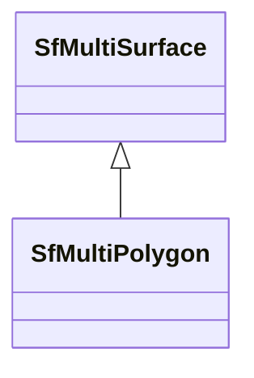

# Class: SfMultiPolygon


_A MultiPolygon is a MultiSurface whose elements are Polygons.␊␊The assertions for MultiPolygons are as follows.␊␊a) The interiors of 2 Polygons that are elements of a MultiPolygon may not intersect.␊b) The boundaries of any 2 Polygons that are elements of a MultiPolygon may not cross and may touch at only a finite number of Points.␊c) A MultiPolygon is defined as topologically closed.␊d) A MultiPolygon may not have cut lines, spikes or punctures, a MultiPolygon is a regular closed Point set,␊e) The interior of a MultiPolygon with more than 1 Polygon is not connected; the number of connected components of the interior of a MultiPolygon is equal to the number of Polygons in the MultiPolygon. ␊␊The boundary of a MultiPolygon is a set of closed Curves (LineStrings) corresponding to the boundaries of its element Polygons. Each Curve in the boundary of the MultiPolygon is in the boundary of exactly 1 element Polygon, and every Curve in the boundary of an element Polygon is in the boundary of the MultiPolygon._


This class occurs 22 times.


URI: [sf:MultiPolygon](http://www.opengis.net/ont/sf#MultiPolygon)





## Inheritance
* [GeoSpatialObject](../classes/GeoSpatialObject.md)
    * [GeoGeometry](../classes/GeoGeometry.md)
        * [SfGeometry](../classes/SfGeometry.md)
            * [SfGeometryCollection](../classes/SfGeometryCollection.md)
                * [SfMultiSurface](../classes/SfMultiSurface.md)
                    * **SfMultiPolygon**


## Slots

| Name | Cardinality and Range | Description | Inheritance | Occurrences |
| ---  | --- | --- | --- | --- |


## Comments

* source: http://www.opengis.net/ont/sf
* description: A MultiPolygon is a MultiSurface whose elements are Polygons.

The assertions for MultiPolygons are as follows.

a) The interiors of 2 Polygons that are elements of a MultiPolygon may not intersect.
b) The boundaries of any 2 Polygons that are elements of a MultiPolygon may not cross and may touch at only a finite number of Points.
c) A MultiPolygon is defined as topologically closed.
d) A MultiPolygon may not have cut lines, spikes or punctures, a MultiPolygon is a regular closed Point set,
e) The interior of a MultiPolygon with more than 1 Polygon is not connected; the number of connected components of the interior of a MultiPolygon is equal to the number of Polygons in the MultiPolygon. 

The boundary of a MultiPolygon is a set of closed Curves (LineStrings) corresponding to the boundaries of its element Polygons. Each Curve in the boundary of the MultiPolygon is in the boundary of exactly 1 element Polygon, and every Curve in the boundary of an element Polygon is in the boundary of the MultiPolygon.


## LinkML Source

<!-- TODO: investigate https://stackoverflow.com/questions/37606292/how-to-create-tabbed-code-blocks-in-mkdocs-or-sphinx -->

### Direct

<details>

```yaml
name: sf_MultiPolygon
description: A MultiPolygon is a MultiSurface whose elements are Polygons.␊␊The assertions
  for MultiPolygons are as follows.␊␊a) The interiors of 2 Polygons that are elements
  of a MultiPolygon may not intersect.␊b) The boundaries of any 2 Polygons that are
  elements of a MultiPolygon may not cross and may touch at only a finite number of
  Points.␊c) A MultiPolygon is defined as topologically closed.␊d) A MultiPolygon
  may not have cut lines, spikes or punctures, a MultiPolygon is a regular closed
  Point set,␊e) The interior of a MultiPolygon with more than 1 Polygon is not connected;
  the number of connected components of the interior of a MultiPolygon is equal to
  the number of Polygons in the MultiPolygon. ␊␊The boundary of a MultiPolygon is
  a set of closed Curves (LineStrings) corresponding to the boundaries of its element
  Polygons. Each Curve in the boundary of the MultiPolygon is in the boundary of exactly
  1 element Polygon, and every Curve in the boundary of an element Polygon is in the
  boundary of the MultiPolygon.
comments:
- 'source: http://www.opengis.net/ont/sf'
- "description: A MultiPolygon is a MultiSurface whose elements are Polygons.\n\n\
  The assertions for MultiPolygons are as follows.\n\na) The interiors of 2 Polygons\
  \ that are elements of a MultiPolygon may not intersect.\nb) The boundaries of any\
  \ 2 Polygons that are elements of a MultiPolygon may not cross and may touch at\
  \ only a finite number of Points.\nc) A MultiPolygon is defined as topologically\
  \ closed.\nd) A MultiPolygon may not have cut lines, spikes or punctures, a MultiPolygon\
  \ is a regular closed Point set,\ne) The interior of a MultiPolygon with more than\
  \ 1 Polygon is not connected; the number of connected components of the interior\
  \ of a MultiPolygon is equal to the number of Polygons in the MultiPolygon. \n\n\
  The boundary of a MultiPolygon is a set of closed Curves (LineStrings) corresponding\
  \ to the boundaries of its element Polygons. Each Curve in the boundary of the MultiPolygon\
  \ is in the boundary of exactly 1 element Polygon, and every Curve in the boundary\
  \ of an element Polygon is in the boundary of the MultiPolygon."
from_schema: okns:sf
source: http://www.opengis.net/ont/sf
is_a: sf_MultiSurface
class_uri: sf:MultiPolygon

```
</details>

### Induced

<details>

```yaml
name: sf_MultiPolygon
description: A MultiPolygon is a MultiSurface whose elements are Polygons.␊␊The assertions
  for MultiPolygons are as follows.␊␊a) The interiors of 2 Polygons that are elements
  of a MultiPolygon may not intersect.␊b) The boundaries of any 2 Polygons that are
  elements of a MultiPolygon may not cross and may touch at only a finite number of
  Points.␊c) A MultiPolygon is defined as topologically closed.␊d) A MultiPolygon
  may not have cut lines, spikes or punctures, a MultiPolygon is a regular closed
  Point set,␊e) The interior of a MultiPolygon with more than 1 Polygon is not connected;
  the number of connected components of the interior of a MultiPolygon is equal to
  the number of Polygons in the MultiPolygon. ␊␊The boundary of a MultiPolygon is
  a set of closed Curves (LineStrings) corresponding to the boundaries of its element
  Polygons. Each Curve in the boundary of the MultiPolygon is in the boundary of exactly
  1 element Polygon, and every Curve in the boundary of an element Polygon is in the
  boundary of the MultiPolygon.
comments:
- 'source: http://www.opengis.net/ont/sf'
- "description: A MultiPolygon is a MultiSurface whose elements are Polygons.\n\n\
  The assertions for MultiPolygons are as follows.\n\na) The interiors of 2 Polygons\
  \ that are elements of a MultiPolygon may not intersect.\nb) The boundaries of any\
  \ 2 Polygons that are elements of a MultiPolygon may not cross and may touch at\
  \ only a finite number of Points.\nc) A MultiPolygon is defined as topologically\
  \ closed.\nd) A MultiPolygon may not have cut lines, spikes or punctures, a MultiPolygon\
  \ is a regular closed Point set,\ne) The interior of a MultiPolygon with more than\
  \ 1 Polygon is not connected; the number of connected components of the interior\
  \ of a MultiPolygon is equal to the number of Polygons in the MultiPolygon. \n\n\
  The boundary of a MultiPolygon is a set of closed Curves (LineStrings) corresponding\
  \ to the boundaries of its element Polygons. Each Curve in the boundary of the MultiPolygon\
  \ is in the boundary of exactly 1 element Polygon, and every Curve in the boundary\
  \ of an element Polygon is in the boundary of the MultiPolygon."
from_schema: okns:sf
source: http://www.opengis.net/ont/sf
is_a: sf_MultiSurface
class_uri: sf:MultiPolygon

```
</details>