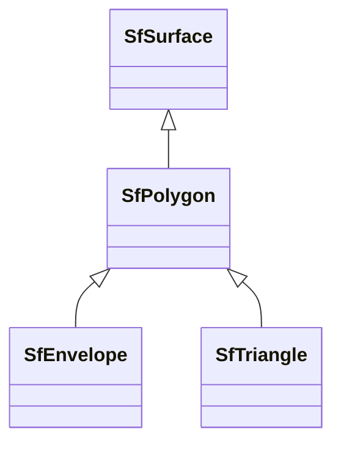

# Class: No class (entity type) name specified -- this class is noted as a superclass of another class in this graph but has not itself been defined. (sf_Polygon)


_A Polygon is a planar Surface defined by 1 exterior boundary and 0 or more interior boundaries. Each interior boundary defines a hole in the Polygon.␊The exterior boundary LinearRing defines the top of the surface which is the side of the surface from which the exterior boundary appears to traverse the boundary in a counter clockwise direction. The interior LinearRings will have the opposite orientation, and appear as clockwise when viewed from the top,␊The assertions for Polygons (the rules that define valid Polygons) are as follows:␊␊a) Polygons are topologically closed;␊b) The boundary of a Polygon consists of a set of LinearRings that make up its exterior and interior boundaries;␊c) No two Rings in the boundary cross and the Rings in the boundary of a Polygon may intersect at a Point but only as a tangent.␊d) A Polygon may not have cut lines, spikes or punctures.␊e) The interior of every Polygon is a connected point set;␊f) The exterior of a Polygon with 1 or more holes is not connected. Each hole defines a connected component of the exterior._


This class occurs 10656 times.


URI: [sf:Polygon](http://www.opengis.net/ont/sf#Polygon)





## Inheritance
* [GeoSpatialObject](../classes/GeoSpatialObject.md)
    * [GeoGeometry](../classes/GeoGeometry.md)
        * [SfGeometry](../classes/SfGeometry.md)
            * [SfSurface](../classes/SfSurface.md)
                * **SfPolygon**
                    * [SfEnvelope](../classes/SfEnvelope.md)
                    * [SfTriangle](../classes/SfTriangle.md)


## Slots

| Name | Cardinality and Range | Description | Inheritance | Occurrences |
| ---  | --- | --- | --- | --- |


## Comments

* source: http://www.opengis.net/ont/sf
* description: A Polygon is a planar Surface defined by 1 exterior boundary and 0 or more interior boundaries. Each interior boundary defines a hole in the Polygon.
The exterior boundary LinearRing defines the top of the surface which is the side of the surface from which the exterior boundary appears to traverse the boundary in a counter clockwise direction. The interior LinearRings will have the opposite orientation, and appear as clockwise when viewed from the top,
The assertions for Polygons (the rules that define valid Polygons) are as follows:

a) Polygons are topologically closed;
b) The boundary of a Polygon consists of a set of LinearRings that make up its exterior and interior boundaries;
c) No two Rings in the boundary cross and the Rings in the boundary of a Polygon may intersect at a Point but only as a tangent.
d) A Polygon may not have cut lines, spikes or punctures.
e) The interior of every Polygon is a connected point set;
f) The exterior of a Polygon with 1 or more holes is not connected. Each hole defines a connected component of the exterior.


## LinkML Source

<!-- TODO: investigate https://stackoverflow.com/questions/37606292/how-to-create-tabbed-code-blocks-in-mkdocs-or-sphinx -->

### Direct

<details>

```yaml
name: sf_Polygon
description: A Polygon is a planar Surface defined by 1 exterior boundary and 0 or
  more interior boundaries. Each interior boundary defines a hole in the Polygon.␊The
  exterior boundary LinearRing defines the top of the surface which is the side of
  the surface from which the exterior boundary appears to traverse the boundary in
  a counter clockwise direction. The interior LinearRings will have the opposite orientation,
  and appear as clockwise when viewed from the top,␊The assertions for Polygons (the
  rules that define valid Polygons) are as follows:␊␊a) Polygons are topologically
  closed;␊b) The boundary of a Polygon consists of a set of LinearRings that make
  up its exterior and interior boundaries;␊c) No two Rings in the boundary cross and
  the Rings in the boundary of a Polygon may intersect at a Point but only as a tangent.␊d)
  A Polygon may not have cut lines, spikes or punctures.␊e) The interior of every
  Polygon is a connected point set;␊f) The exterior of a Polygon with 1 or more holes
  is not connected. Each hole defines a connected component of the exterior.
title: No class (entity type) name specified -- this class is noted as a superclass
  of another class in this graph but has not itself been defined.
comments:
- 'source: http://www.opengis.net/ont/sf'
- 'description: A Polygon is a planar Surface defined by 1 exterior boundary and 0
  or more interior boundaries. Each interior boundary defines a hole in the Polygon.

  The exterior boundary LinearRing defines the top of the surface which is the side
  of the surface from which the exterior boundary appears to traverse the boundary
  in a counter clockwise direction. The interior LinearRings will have the opposite
  orientation, and appear as clockwise when viewed from the top,

  The assertions for Polygons (the rules that define valid Polygons) are as follows:


  a) Polygons are topologically closed;

  b) The boundary of a Polygon consists of a set of LinearRings that make up its exterior
  and interior boundaries;

  c) No two Rings in the boundary cross and the Rings in the boundary of a Polygon
  may intersect at a Point but only as a tangent.

  d) A Polygon may not have cut lines, spikes or punctures.

  e) The interior of every Polygon is a connected point set;

  f) The exterior of a Polygon with 1 or more holes is not connected. Each hole defines
  a connected component of the exterior.'
from_schema: okns:sf
source: http://www.opengis.net/ont/sf
is_a: sf_Surface
class_uri: sf:Polygon

```
</details>

### Induced

<details>

```yaml
name: sf_Polygon
description: A Polygon is a planar Surface defined by 1 exterior boundary and 0 or
  more interior boundaries. Each interior boundary defines a hole in the Polygon.␊The
  exterior boundary LinearRing defines the top of the surface which is the side of
  the surface from which the exterior boundary appears to traverse the boundary in
  a counter clockwise direction. The interior LinearRings will have the opposite orientation,
  and appear as clockwise when viewed from the top,␊The assertions for Polygons (the
  rules that define valid Polygons) are as follows:␊␊a) Polygons are topologically
  closed;␊b) The boundary of a Polygon consists of a set of LinearRings that make
  up its exterior and interior boundaries;␊c) No two Rings in the boundary cross and
  the Rings in the boundary of a Polygon may intersect at a Point but only as a tangent.␊d)
  A Polygon may not have cut lines, spikes or punctures.␊e) The interior of every
  Polygon is a connected point set;␊f) The exterior of a Polygon with 1 or more holes
  is not connected. Each hole defines a connected component of the exterior.
title: No class (entity type) name specified -- this class is noted as a superclass
  of another class in this graph but has not itself been defined.
comments:
- 'source: http://www.opengis.net/ont/sf'
- 'description: A Polygon is a planar Surface defined by 1 exterior boundary and 0
  or more interior boundaries. Each interior boundary defines a hole in the Polygon.

  The exterior boundary LinearRing defines the top of the surface which is the side
  of the surface from which the exterior boundary appears to traverse the boundary
  in a counter clockwise direction. The interior LinearRings will have the opposite
  orientation, and appear as clockwise when viewed from the top,

  The assertions for Polygons (the rules that define valid Polygons) are as follows:


  a) Polygons are topologically closed;

  b) The boundary of a Polygon consists of a set of LinearRings that make up its exterior
  and interior boundaries;

  c) No two Rings in the boundary cross and the Rings in the boundary of a Polygon
  may intersect at a Point but only as a tangent.

  d) A Polygon may not have cut lines, spikes or punctures.

  e) The interior of every Polygon is a connected point set;

  f) The exterior of a Polygon with 1 or more holes is not connected. Each hole defines
  a connected component of the exterior.'
from_schema: okns:sf
source: http://www.opengis.net/ont/sf
is_a: sf_Surface
class_uri: sf:Polygon

```
</details>