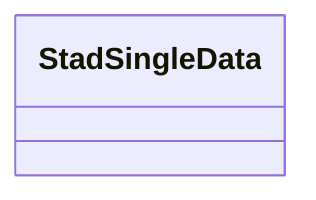

# Class: StadSingleData


URI: [stad:SingleData](http://purl.org/spatialai/stad/v2/core/SingleData)





<!-- no inheritance hierarchy -->


## Slots

| Name | Cardinality and Range | Description | Inheritance | Occurrences |
| ---  | --- | --- | --- | --- |


## Usages

| used by | used in | type | used |
| ---  | --- | --- | --- |
| [MeMgsMGS-Well](../classes/MeMgsMGS-Well.md) | [me_mgs_wellDepth](../slots/me_mgs_wellDepth.md) | any_of[range] | [StadSingleData](../classes/StadSingleData.md) |
| [MeMgsMGS-Well](../classes/MeMgsMGS-Well.md) | [me_mgs_wellOverburden](../slots/me_mgs_wellOverburden.md) | any_of[range] | [StadSingleData](../classes/StadSingleData.md) |


## LinkML Source

<!-- TODO: investigate https://stackoverflow.com/questions/37606292/how-to-create-tabbed-code-blocks-in-mkdocs-or-sphinx -->

### Direct

<details>

```yaml
name: stad_SingleData
from_schema: okns:hydrology-kg
rank: 1000
class_uri: stad:SingleData

```
</details>

### Induced

<details>

```yaml
name: stad_SingleData
from_schema: okns:hydrology-kg
rank: 1000
class_uri: stad:SingleData

```
</details>