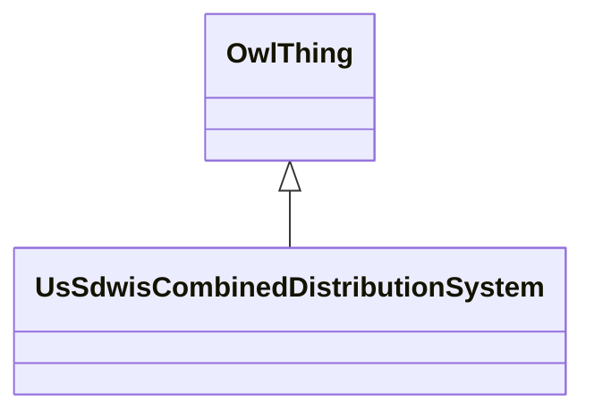

# Class: UsSdwisCombinedDistributionSystem


URI: [us_sdwis:CombinedDistributionSystem](http://sawgraph.spatialai.org/v1/us-sdwis#CombinedDistributionSystem)





## Inheritance
* [OwlThing](../classes/OwlThing.md)
    * **UsSdwisCombinedDistributionSystem**


## Slots

| Name | Cardinality and Range | Description | Inheritance | Occurrences |
| ---  | --- | --- | --- | --- |


## LinkML Source

<!-- TODO: investigate https://stackoverflow.com/questions/37606292/how-to-create-tabbed-code-blocks-in-mkdocs-or-sphinx -->

### Direct

<details>

```yaml
name: us_sdwis_CombinedDistributionSystem
from_schema: okns:hydrology-kg
rank: 1000
is_a: owl_Thing
class_uri: us_sdwis:CombinedDistributionSystem

```
</details>

### Induced

<details>

```yaml
name: us_sdwis_CombinedDistributionSystem
from_schema: okns:hydrology-kg
rank: 1000
is_a: owl_Thing
class_uri: us_sdwis:CombinedDistributionSystem

```
</details>