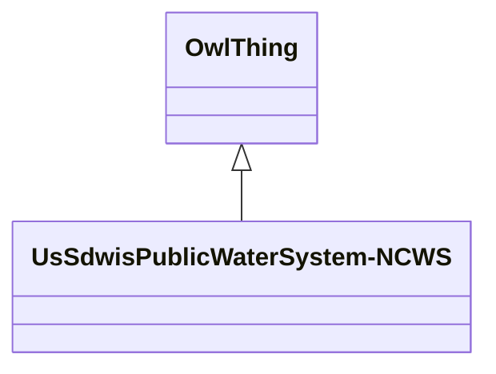

# Class: UsSdwisPublicWaterSystem-NCWS


URI: [us_sdwis:PublicWaterSystem-NCWS](http://sawgraph.spatialai.org/v1/us-sdwis#PublicWaterSystem-NCWS)





## Inheritance
* [OwlThing](../classes/OwlThing.md)
    * **UsSdwisPublicWaterSystem-NCWS**


## Slots

| Name | Cardinality and Range | Description | Inheritance | Occurrences |
| ---  | --- | --- | --- | --- |


## LinkML Source

<!-- TODO: investigate https://stackoverflow.com/questions/37606292/how-to-create-tabbed-code-blocks-in-mkdocs-or-sphinx -->

### Direct

<details>

```yaml
name: us_sdwis_PublicWaterSystem-NCWS
from_schema: okns:hydrology-kg
rank: 1000
is_a: owl_Thing
class_uri: us_sdwis:PublicWaterSystem-NCWS

```
</details>

### Induced

<details>

```yaml
name: us_sdwis_PublicWaterSystem-NCWS
from_schema: okns:hydrology-kg
rank: 1000
is_a: owl_Thing
class_uri: us_sdwis:PublicWaterSystem-NCWS

```
</details>