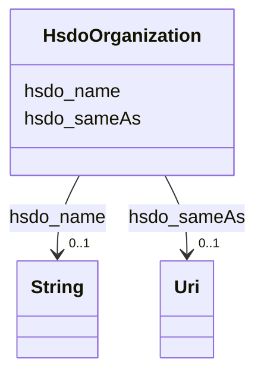

# Class: Organization (hsdo_Organization)


_An organization such as a school, NGO, corporation, club, etc._


URI: [hsdo:Organization](http://schema.org/Organization)





<!-- no inheritance hierarchy -->


## Slots

| Name | Cardinality and Range | Description | Inheritance |
| ---  | --- | --- | --- |
| [hsdo_sameAs](../slots/hsdo_sameAs.md) | 0..1 <br/> [xsd:anyURI](xsd:anyURI) | No slot (predicate) description specified <br/> 127 occurrences with subject type hsdo_Organization and object type uri. | direct |
| [hsdo_name](../slots/hsdo_name.md) | 0..1 <br/> [xsd:string](xsd:string) | No slot (predicate) description specified <br/> 89 occurrences with subject type hsdo_Organization and object type string.<br/>88 occurrences with subject type hsdo_Service and object type string. | direct |


## Usages

| used by | used in | type | used |
| ---  | --- | --- | --- |
| [HsdoService](../classes/HsdoService.md) | [hsdo_provider](../slots/hsdo_provider.md) | range | [HsdoOrganization](../classes/HsdoOrganization.md) |


## Identifier and Mapping Information


### Schema Source


* from schema: kg-name


## Mappings

| Mapping Type | Mapped Value |
| ---  | ---  |
| self | hsdo:Organization |
| native | kg-name/:HsdoOrganization |


## LinkML Source

<!-- TODO: investigate https://stackoverflow.com/questions/37606292/how-to-create-tabbed-code-blocks-in-mkdocs-or-sphinx -->

### Direct

<details>
```yaml
name: hsdo_Organization
conforms_to: No schema conformance document specified
description: An organization such as a school, NGO, corporation, club, etc.
title: Organization
notes:
- Class with 87 occurrences.
from_schema: kg-name
rank: 1000
slots:
- hsdo_sameAs
- hsdo_name
class_uri: hsdo:Organization

```
</details>

### Induced

<details>
```yaml
name: hsdo_Organization
conforms_to: No schema conformance document specified
description: An organization such as a school, NGO, corporation, club, etc.
title: Organization
notes:
- Class with 87 occurrences.
from_schema: kg-name
rank: 1000
attributes:
  hsdo_sameAs:
    name: hsdo_sameAs
    description: No slot (predicate) description specified
    comments:
    - 127 occurrences with subject type hsdo_Organization and object type uri.
    examples:
    - description: hsdo_Organization → uri
      object:
        example_object: https://www.facebook.com/ChildGuidanceResourceCenters
        example_object_type: uri
        example_predicate: hsdo:sameAs
        example_subject: dreamkg:service/provider/4542572480692224
        example_subject_type: hsdo_Organization
    from_schema: kg-name
    rank: 1000
    slot_uri: hsdo:sameAs
    alias: hsdo_sameAs
    owner: hsdo_Organization
    domain_of:
    - hsdo_Organization
    range: uri
  hsdo_name:
    name: hsdo_name
    description: No slot (predicate) description specified
    comments:
    - 89 occurrences with subject type hsdo_Organization and object type string.
    - 88 occurrences with subject type hsdo_Service and object type string.
    examples:
    - description: hsdo_Organization → string
      object:
        example_object: Child Guidance Resource Centers
        example_object_type: string
        example_predicate: hsdo:name
        example_subject: dreamkg:service/provider/4542572480692224
        example_subject_type: hsdo_Organization
    - description: hsdo_Service → string
      object:
        example_object: Drug and Alcohol Services
        example_object_type: string
        example_predicate: hsdo:name
        example_subject: dreamkg:service/4542572480692224
        example_subject_type: hsdo_Service
    from_schema: kg-name
    rank: 1000
    slot_uri: hsdo:name
    alias: hsdo_name
    owner: hsdo_Organization
    domain_of:
    - hsdo_Organization
    - hsdo_Service
    range: string
class_uri: hsdo:Organization

```
</details>