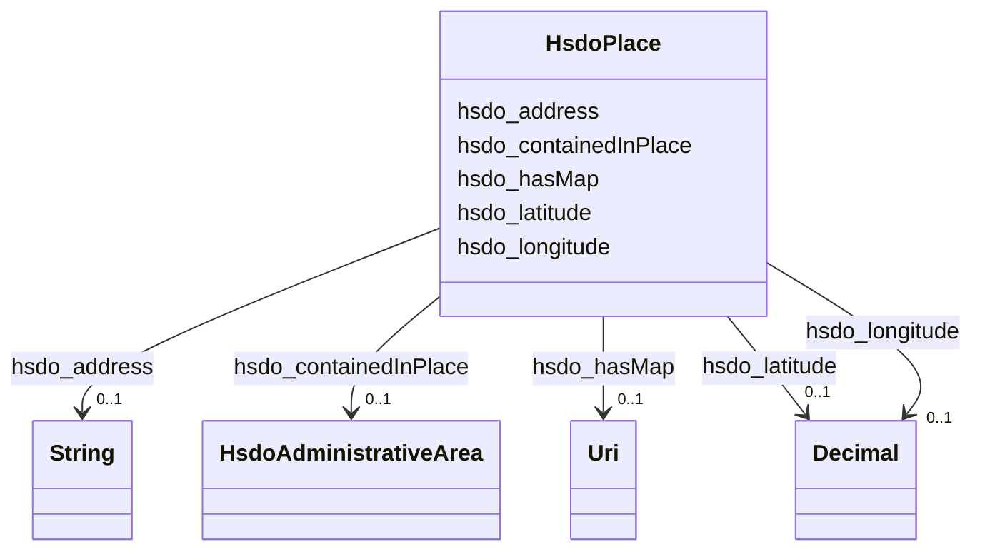

# Class: Place (hsdo_Place)


_Entities that have a somewhat fixed, physical extension._


URI: [hsdo:Place](http://schema.org/Place)





<!-- no inheritance hierarchy -->


## Slots

| Name | Cardinality and Range | Description | Inheritance |
| ---  | --- | --- | --- |
| [hsdo_hasMap](../slots/hsdo_hasMap.md) | 0..1 <br/> [xsd:anyURI](xsd:anyURI) | No slot (predicate) description specified <br/> 88 occurrences with subject type hsdo_Place and object type uri. | direct |
| [hsdo_containedInPlace](../slots/hsdo_containedInPlace.md) | 0..1 <br/> [HsdoAdministrativeArea](../classes/HsdoAdministrativeArea.md) | No slot (predicate) description specified <br/> 88 occurrences with subject type hsdo_Place and object type hsdo_AdministrativeArea. | direct |
| [hsdo_longitude](../slots/hsdo_longitude.md) | 0..1 <br/> [xsd:decimal](xsd:decimal) | No slot (predicate) description specified <br/> 89 occurrences with subject type hsdo_Place and object type decimal. | direct |
| [hsdo_latitude](../slots/hsdo_latitude.md) | 0..1 <br/> [xsd:decimal](xsd:decimal) | No slot (predicate) description specified <br/> 89 occurrences with subject type hsdo_Place and object type decimal. | direct |
| [hsdo_address](../slots/hsdo_address.md) | 0..1 <br/> [xsd:string](xsd:string) | No slot (predicate) description specified <br/> 93 occurrences with subject type hsdo_Place and object type string. | direct |


## Usages

| used by | used in | type | used |
| ---  | --- | --- | --- |
| [HsdoServiceChannel](../classes/HsdoServiceChannel.md) | [hsdo_serviceLocation](../slots/hsdo_serviceLocation.md) | range | [HsdoPlace](../classes/HsdoPlace.md) |


## Identifier and Mapping Information


### Schema Source


* from schema: kg-name


## Mappings

| Mapping Type | Mapped Value |
| ---  | ---  |
| self | hsdo:Place |
| native | kg-name/:HsdoPlace |


## LinkML Source

<!-- TODO: investigate https://stackoverflow.com/questions/37606292/how-to-create-tabbed-code-blocks-in-mkdocs-or-sphinx -->

### Direct

<details>
```yaml
name: hsdo_Place
conforms_to: No schema conformance document specified
description: Entities that have a somewhat fixed, physical extension.
title: Place
notes:
- Class with 87 occurrences.
from_schema: kg-name
rank: 1000
slots:
- hsdo_hasMap
- hsdo_containedInPlace
- hsdo_longitude
- hsdo_latitude
- hsdo_address
class_uri: hsdo:Place

```
</details>

### Induced

<details>
```yaml
name: hsdo_Place
conforms_to: No schema conformance document specified
description: Entities that have a somewhat fixed, physical extension.
title: Place
notes:
- Class with 87 occurrences.
from_schema: kg-name
rank: 1000
attributes:
  hsdo_hasMap:
    name: hsdo_hasMap
    description: No slot (predicate) description specified
    comments:
    - 88 occurrences with subject type hsdo_Place and object type uri.
    examples:
    - description: hsdo_Place → uri
      object:
        example_object: https://www.google.com/maps/?q=2901+Island+Avenue,+Philadelphia,+PA+19153/
        example_object_type: uri
        example_predicate: hsdo:hasMap
        example_subject: dreamkg:service/location/4542572480692224
        example_subject_type: hsdo_Place
    from_schema: kg-name
    rank: 1000
    slot_uri: hsdo:hasMap
    alias: hsdo_hasMap
    owner: hsdo_Place
    domain_of:
    - hsdo_Place
    range: uri
  hsdo_containedInPlace:
    name: hsdo_containedInPlace
    description: No slot (predicate) description specified
    comments:
    - 88 occurrences with subject type hsdo_Place and object type hsdo_AdministrativeArea.
    examples:
    - description: hsdo_Place → hsdo_AdministrativeArea
      object:
        example_object: dreamkg:zip/19104
        example_object_type: hsdo_AdministrativeArea
        example_predicate: hsdo:containedInPlace
        example_subject: dreamkg:service/location/6710596967858176
        example_subject_type: hsdo_Place
    from_schema: kg-name
    rank: 1000
    slot_uri: hsdo:containedInPlace
    alias: hsdo_containedInPlace
    owner: hsdo_Place
    domain_of:
    - hsdo_Place
    range: hsdo_AdministrativeArea
  hsdo_longitude:
    name: hsdo_longitude
    description: No slot (predicate) description specified
    comments:
    - 89 occurrences with subject type hsdo_Place and object type decimal.
    examples:
    - description: hsdo_Place → decimal
      object:
        example_object: '-75.239064'
        example_object_type: decimal
        example_predicate: hsdo:longitude
        example_subject: dreamkg:service/location/4542572480692224
        example_subject_type: hsdo_Place
    from_schema: kg-name
    rank: 1000
    slot_uri: hsdo:longitude
    alias: hsdo_longitude
    owner: hsdo_Place
    domain_of:
    - hsdo_Place
    range: decimal
  hsdo_latitude:
    name: hsdo_latitude
    description: No slot (predicate) description specified
    comments:
    - 89 occurrences with subject type hsdo_Place and object type decimal.
    examples:
    - description: hsdo_Place → decimal
      object:
        example_object: '39.9028317'
        example_object_type: decimal
        example_predicate: hsdo:latitude
        example_subject: dreamkg:service/location/4542572480692224
        example_subject_type: hsdo_Place
    from_schema: kg-name
    rank: 1000
    slot_uri: hsdo:latitude
    alias: hsdo_latitude
    owner: hsdo_Place
    domain_of:
    - hsdo_Place
    range: decimal
  hsdo_address:
    name: hsdo_address
    description: No slot (predicate) description specified
    comments:
    - 93 occurrences with subject type hsdo_Place and object type string.
    examples:
    - description: hsdo_Place → string
      object:
        example_object: 2901 Island Avenue, Philadelphia, PA 19153
        example_object_type: string
        example_predicate: hsdo:address
        example_subject: dreamkg:service/location/4542572480692224
        example_subject_type: hsdo_Place
    from_schema: kg-name
    rank: 1000
    slot_uri: hsdo:address
    alias: hsdo_address
    owner: hsdo_Place
    domain_of:
    - hsdo_Place
    range: string
class_uri: hsdo:Place

```
</details>