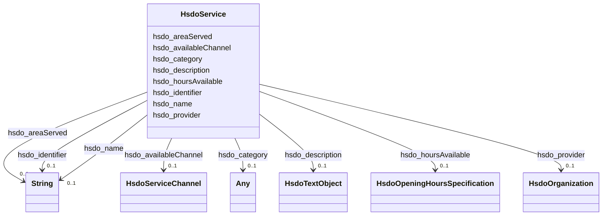

# Class: Service (hsdo_Service)


_A service provided by an organization, e.g. delivery service, print services, etc._


URI: [hsdo:Service](http://schema.org/Service)





<!-- no inheritance hierarchy -->


## Slots

| Name | Cardinality and Range | Description | Inheritance |
| ---  | --- | --- | --- |
| [hsdo_hoursAvailable](../slots/hsdo_hoursAvailable.md) | 0..1 <br/> [HsdoOpeningHoursSpecification](../classes/HsdoOpeningHoursSpecification.md) | No slot (predicate) description specified <br/> 609 occurrences with subject type hsdo_Service and object type hsdo_OpeningHoursSpecification. | direct |
| [hsdo_name](../slots/hsdo_name.md) | 0..1 <br/> [xsd:string](xsd:string) | No slot (predicate) description specified <br/> 89 occurrences with subject type hsdo_Organization and object type string.<br/>88 occurrences with subject type hsdo_Service and object type string. | direct |
| [hsdo_areaServed](../slots/hsdo_areaServed.md) | 0..1 <br/> [xsd:string](xsd:string) | No slot (predicate) description specified <br/> 87 occurrences with subject type hsdo_Service and object type string. | direct |
| [hsdo_provider](../slots/hsdo_provider.md) | 0..1 <br/> [HsdoOrganization](../classes/HsdoOrganization.md) | No slot (predicate) description specified <br/> 87 occurrences with subject type hsdo_Service and object type hsdo_Organization. | direct |
| [hsdo_category](../slots/hsdo_category.md) | 0..1 <br/> [HsdoCategoryCode](../classes/HsdoCategoryCode.md)&nbsp;or&nbsp;<br />[HsdoAudience](../classes/HsdoAudience.md) | No slot (predicate) description specified <br/> 539 occurrences with subject type hsdo_Service and object type hsdo_Audience.<br/>806 occurrences with subject type hsdo_Service and object type hsdo_CategoryCode. | direct |
| [hsdo_availableChannel](../slots/hsdo_availableChannel.md) | 0..1 <br/> [HsdoServiceChannel](../classes/HsdoServiceChannel.md) | No slot (predicate) description specified <br/> 174 occurrences with subject type hsdo_Service and object type hsdo_ServiceChannel. | direct |
| [hsdo_description](../slots/hsdo_description.md) | 0..1 <br/> [HsdoTextObject](../classes/HsdoTextObject.md) | No slot (predicate) description specified <br/> 87 occurrences with subject type hsdo_Service and object type hsdo_TextObject. | direct |
| [hsdo_identifier](../slots/hsdo_identifier.md) | 0..1 <br/> [xsd:string](xsd:string) | No slot (predicate) description specified <br/> 39 occurrences with subject type hsdo_AdministrativeArea and object type string.<br/>87 occurrences with subject type hsdo_Service and object type string. | direct |


## Identifier and Mapping Information


### Schema Source


* from schema: kg-name


## Mappings

| Mapping Type | Mapped Value |
| ---  | ---  |
| self | hsdo:Service |
| native | kg-name/:HsdoService |


## LinkML Source

<!-- TODO: investigate https://stackoverflow.com/questions/37606292/how-to-create-tabbed-code-blocks-in-mkdocs-or-sphinx -->

### Direct

<details>
```yaml
name: hsdo_Service
conforms_to: No schema conformance document specified
description: A service provided by an organization, e.g. delivery service, print services,
  etc.
title: Service
notes:
- Class with 87 occurrences.
from_schema: kg-name
rank: 1000
slots:
- hsdo_hoursAvailable
- hsdo_name
- hsdo_areaServed
- hsdo_provider
- hsdo_category
- hsdo_availableChannel
- hsdo_description
- hsdo_identifier
class_uri: hsdo:Service

```
</details>

### Induced

<details>
```yaml
name: hsdo_Service
conforms_to: No schema conformance document specified
description: A service provided by an organization, e.g. delivery service, print services,
  etc.
title: Service
notes:
- Class with 87 occurrences.
from_schema: kg-name
rank: 1000
attributes:
  hsdo_hoursAvailable:
    name: hsdo_hoursAvailable
    description: No slot (predicate) description specified
    comments:
    - 609 occurrences with subject type hsdo_Service and object type hsdo_OpeningHoursSpecification.
    examples:
    - description: hsdo_Service → hsdo_OpeningHoursSpecification
      object:
        example_object: dreamkg:service/hours/wednesday/6710596967858176
        example_object_type: hsdo_OpeningHoursSpecification
        example_predicate: hsdo:hoursAvailable
        example_subject: dreamkg:service/6710596967858176
        example_subject_type: hsdo_Service
    from_schema: kg-name
    rank: 1000
    slot_uri: hsdo:hoursAvailable
    alias: hsdo_hoursAvailable
    owner: hsdo_Service
    domain_of:
    - hsdo_Service
    range: hsdo_OpeningHoursSpecification
  hsdo_name:
    name: hsdo_name
    description: No slot (predicate) description specified
    comments:
    - 89 occurrences with subject type hsdo_Organization and object type string.
    - 88 occurrences with subject type hsdo_Service and object type string.
    examples:
    - description: hsdo_Organization → string
      object:
        example_object: Child Guidance Resource Centers
        example_object_type: string
        example_predicate: hsdo:name
        example_subject: dreamkg:service/provider/4542572480692224
        example_subject_type: hsdo_Organization
    - description: hsdo_Service → string
      object:
        example_object: Drug and Alcohol Services
        example_object_type: string
        example_predicate: hsdo:name
        example_subject: dreamkg:service/4542572480692224
        example_subject_type: hsdo_Service
    from_schema: kg-name
    rank: 1000
    slot_uri: hsdo:name
    alias: hsdo_name
    owner: hsdo_Service
    domain_of:
    - hsdo_Organization
    - hsdo_Service
    range: string
  hsdo_areaServed:
    name: hsdo_areaServed
    description: No slot (predicate) description specified
    comments:
    - 87 occurrences with subject type hsdo_Service and object type string.
    examples:
    - description: hsdo_Service → string
      object:
        example_object: 'This program covers residents of the following counties:
          Chester County, PA, Delaware County, PA, Montgomery County, PA and Philadelphia
          County, PA.'
        example_object_type: string
        example_predicate: hsdo:areaServed
        example_subject: dreamkg:service/4542572480692224
        example_subject_type: hsdo_Service
    from_schema: kg-name
    rank: 1000
    slot_uri: hsdo:areaServed
    alias: hsdo_areaServed
    owner: hsdo_Service
    domain_of:
    - hsdo_Service
    range: string
  hsdo_provider:
    name: hsdo_provider
    description: No slot (predicate) description specified
    comments:
    - 87 occurrences with subject type hsdo_Service and object type hsdo_Organization.
    examples:
    - description: hsdo_Service → hsdo_Organization
      object:
        example_object: dreamkg:service/provider/6710596967858176
        example_object_type: hsdo_Organization
        example_predicate: hsdo:provider
        example_subject: dreamkg:service/6710596967858176
        example_subject_type: hsdo_Service
    from_schema: kg-name
    rank: 1000
    slot_uri: hsdo:provider
    alias: hsdo_provider
    owner: hsdo_Service
    domain_of:
    - hsdo_Service
    range: hsdo_Organization
  hsdo_category:
    name: hsdo_category
    description: No slot (predicate) description specified
    comments:
    - 539 occurrences with subject type hsdo_Service and object type hsdo_Audience.
    - 806 occurrences with subject type hsdo_Service and object type hsdo_CategoryCode.
    examples:
    - description: hsdo_Service → hsdo_Audience
      object:
        example_object: dreamkg:category/audience/Veterans
        example_object_type: hsdo_Audience
        example_predicate: hsdo:category
        example_subject: dreamkg:service/6710596967858176
        example_subject_type: hsdo_Service
    - description: hsdo_Service → hsdo_CategoryCode
      object:
        example_object: dreamkg:category/service/other/SkillsAndTraining
        example_object_type: hsdo_CategoryCode
        example_predicate: hsdo:category
        example_subject: dreamkg:service/6710596967858176
        example_subject_type: hsdo_Service
    from_schema: kg-name
    rank: 1000
    slot_uri: hsdo:category
    alias: hsdo_category
    owner: hsdo_Service
    domain_of:
    - hsdo_Service
    range: Any
    any_of:
    - range: hsdo_CategoryCode
    - range: hsdo_Audience
  hsdo_availableChannel:
    name: hsdo_availableChannel
    description: No slot (predicate) description specified
    comments:
    - 174 occurrences with subject type hsdo_Service and object type hsdo_ServiceChannel.
    examples:
    - description: hsdo_Service → hsdo_ServiceChannel
      object:
        example_object: dreamkg:service/channel/P-6710596967858176
        example_object_type: hsdo_ServiceChannel
        example_predicate: hsdo:availableChannel
        example_subject: dreamkg:service/6710596967858176
        example_subject_type: hsdo_Service
    from_schema: kg-name
    rank: 1000
    slot_uri: hsdo:availableChannel
    alias: hsdo_availableChannel
    owner: hsdo_Service
    domain_of:
    - hsdo_Service
    range: hsdo_ServiceChannel
  hsdo_description:
    name: hsdo_description
    description: No slot (predicate) description specified
    comments:
    - 87 occurrences with subject type hsdo_Service and object type hsdo_TextObject.
    examples:
    - description: hsdo_Service → hsdo_TextObject
      object:
        example_object: dreamkg:service/desc/6710596967858176
        example_object_type: hsdo_TextObject
        example_predicate: hsdo:description
        example_subject: dreamkg:service/6710596967858176
        example_subject_type: hsdo_Service
    from_schema: kg-name
    rank: 1000
    slot_uri: hsdo:description
    alias: hsdo_description
    owner: hsdo_Service
    domain_of:
    - hsdo_Service
    range: hsdo_TextObject
  hsdo_identifier:
    name: hsdo_identifier
    description: No slot (predicate) description specified
    comments:
    - 39 occurrences with subject type hsdo_AdministrativeArea and object type string.
    - 87 occurrences with subject type hsdo_Service and object type string.
    examples:
    - description: hsdo_AdministrativeArea → string
      object:
        example_object: '17602'
        example_object_type: string
        example_predicate: hsdo:identifier
        example_subject: dreamkg:zip/17602
        example_subject_type: hsdo_AdministrativeArea
    - description: hsdo_Service → string
      object:
        example_object: '4542572480692224'
        example_object_type: string
        example_predicate: hsdo:identifier
        example_subject: dreamkg:service/4542572480692224
        example_subject_type: hsdo_Service
    from_schema: kg-name
    rank: 1000
    slot_uri: hsdo:identifier
    alias: hsdo_identifier
    owner: hsdo_Service
    domain_of:
    - hsdo_AdministrativeArea
    - hsdo_Service
    range: string
class_uri: hsdo:Service

```
</details>