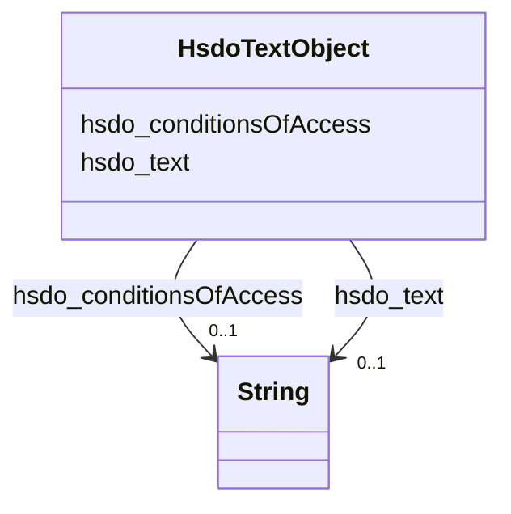

# Class: TextObject (hsdo_TextObject)


_A text file. The text can be unformatted or contain markup, html, etc._


URI: [hsdo:TextObject](http://schema.org/TextObject)





<!-- no inheritance hierarchy -->


## Slots

| Name | Cardinality and Range | Description | Inheritance |
| ---  | --- | --- | --- |
| [hsdo_text](../slots/hsdo_text.md) | 0..1 <br/> [xsd:string](xsd:string) | No slot (predicate) description specified <br/> 90 occurrences with subject type hsdo_TextObject and object type string. | direct |
| [hsdo_conditionsOfAccess](../slots/hsdo_conditionsOfAccess.md) | 0..1 <br/> [xsd:string](xsd:string) | No slot (predicate) description specified <br/> 88 occurrences with subject type hsdo_TextObject and object type string. | direct |


## Usages

| used by | used in | type | used |
| ---  | --- | --- | --- |
| [HsdoService](../classes/HsdoService.md) | [hsdo_description](../slots/hsdo_description.md) | range | [HsdoTextObject](../classes/HsdoTextObject.md) |


## Identifier and Mapping Information


### Schema Source


* from schema: kg-name


## Mappings

| Mapping Type | Mapped Value |
| ---  | ---  |
| self | hsdo:TextObject |
| native | kg-name/:HsdoTextObject |


## LinkML Source

<!-- TODO: investigate https://stackoverflow.com/questions/37606292/how-to-create-tabbed-code-blocks-in-mkdocs-or-sphinx -->

### Direct

<details>
```yaml
name: hsdo_TextObject
conforms_to: No schema conformance document specified
description: A text file. The text can be unformatted or contain markup, html, etc.
title: TextObject
notes:
- Class with 87 occurrences.
from_schema: kg-name
rank: 1000
slots:
- hsdo_text
- hsdo_conditionsOfAccess
class_uri: hsdo:TextObject

```
</details>

### Induced

<details>
```yaml
name: hsdo_TextObject
conforms_to: No schema conformance document specified
description: A text file. The text can be unformatted or contain markup, html, etc.
title: TextObject
notes:
- Class with 87 occurrences.
from_schema: kg-name
rank: 1000
attributes:
  hsdo_text:
    name: hsdo_text
    description: No slot (predicate) description specified
    comments:
    - 90 occurrences with subject type hsdo_TextObject and object type string.
    examples:
    - description: hsdo_TextObject → string
      object:
        example_object: Child Guidance Resource Centers offers a supportive and effective
          program specifically for teenagers struggling with addiction. The Drug and
          Alcohol Service (D and A) is an extensive, family-based program that focuses
          on education, treatment and recovery from substance abuse. We supportively
          confront and coach our clients through the personal, academic, social and
          family problems created by and participating in the use of drugs and alcohol.Our
          treatment includes- Individual therapy- Family therapy- Group therapy- Relapse
          prevention techniques - After-care planningChild Guidance Resource Centers
          accepts Medicaid for their services.
        example_object_type: string
        example_predicate: hsdo:text
        example_subject: dreamkg:service/desc/4542572480692224
        example_subject_type: hsdo_TextObject
    from_schema: kg-name
    rank: 1000
    slot_uri: hsdo:text
    alias: hsdo_text
    owner: hsdo_TextObject
    domain_of:
    - hsdo_TextObject
    range: string
  hsdo_conditionsOfAccess:
    name: hsdo_conditionsOfAccess
    description: No slot (predicate) description specified
    comments:
    - 88 occurrences with subject type hsdo_TextObject and object type string.
    examples:
    - description: hsdo_TextObject → string
      object:
        example_object: Must have Medical Assistance (Medicaid). This program helps
          people who are 13 to 19 years old.
        example_object_type: string
        example_predicate: hsdo:conditionsOfAccess
        example_subject: dreamkg:service/desc/4542572480692224
        example_subject_type: hsdo_TextObject
    from_schema: kg-name
    rank: 1000
    slot_uri: hsdo:conditionsOfAccess
    alias: hsdo_conditionsOfAccess
    owner: hsdo_TextObject
    domain_of:
    - hsdo_TextObject
    range: string
class_uri: hsdo:TextObject

```
</details>