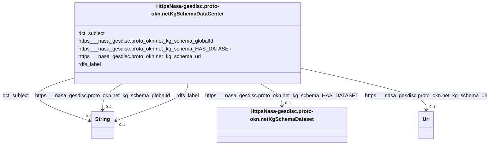

# Class: No class (type) name specified (https___nasa-gesdisc.proto-okn.net_kg_schema_DataCenter)


_No class (type) description specified_


This class occurs 197 times.


URI: [https://nasa-gesdisc.proto-okn.net/kg/schema/DataCenter](https://nasa-gesdisc.proto-okn.net/kg/schema/DataCenter)





<!-- no inheritance hierarchy -->


## Slots

| Name | Cardinality and Range | Description | Inheritance | Occurrences |
| ---  | --- | --- | --- | --- |
| [https___nasa_gesdisc.proto_okn.net_kg_schema_globalId](../slots/https___nasa_gesdisc.proto_okn.net_kg_schema_globalId.md) | 0..1 <br/> [xsd:string](http://www.w3.org/2001/XMLSchema#string) | No slot (predicate) description specified <br/>  | direct | 197 |
| [dct_subject](../slots/dct_subject.md) | 0..1 <br/> [xsd:string](http://www.w3.org/2001/XMLSchema#string) | No slot (predicate) description specified <br/>  | direct | 197 |
| [rdfs_label](../slots/rdfs_label.md) | 0..1 <br/> [xsd:string](http://www.w3.org/2001/XMLSchema#string) | No slot (predicate) description specified <br/>  | direct | 197 |
| [https___nasa_gesdisc.proto_okn.net_kg_schema_HAS_DATASET](../slots/https___nasa_gesdisc.proto_okn.net_kg_schema_HAS_DATASET.md) | 0..1 <br/> [HttpsNasa-gesdisc.proto-okn.netKgSchemaDataset](../classes/HttpsNasa-gesdisc.proto-okn.netKgSchemaDataset.md) | No slot (predicate) description specified <br/>  | direct | 9834 |
| [https___nasa_gesdisc.proto_okn.net_kg_schema_url](../slots/https___nasa_gesdisc.proto_okn.net_kg_schema_url.md) | 0..1 <br/> [xsd:anyURI](http://www.w3.org/2001/XMLSchema#anyURI) | No slot (predicate) description specified <br/>  | direct | 197 |


## Usages

| used by | used in | type | used |
| ---  | --- | --- | --- |
| [RdfStatement](../classes/RdfStatement.md) | [rdf_subject](../slots/rdf_subject.md) | any_of[range] | [HttpsNasa-gesdisc.proto-okn.netKgSchemaDataCenter](../classes/HttpsNasa-gesdisc.proto-okn.netKgSchemaDataCenter.md) |


## LinkML Source

<!-- TODO: investigate https://stackoverflow.com/questions/37606292/how-to-create-tabbed-code-blocks-in-mkdocs-or-sphinx -->

### Direct

<details>

```yaml
name: https___nasa-gesdisc.proto-okn.net_kg_schema_DataCenter
conforms_to: No schema conformance document specified
annotations:
  count:
    tag: count
    value: 197
description: No class (type) description specified
title: No class (type) name specified
from_schema: nasa-gesdisc
rank: 1000
slots:
- https___nasa-gesdisc.proto-okn.net_kg_schema_globalId
- dct_subject
- rdfs_label
- https___nasa-gesdisc.proto-okn.net_kg_schema_HAS_DATASET
- https___nasa-gesdisc.proto-okn.net_kg_schema_url
slot_usage:
  dct_subject:
    name: dct_subject
    annotations:
      string:
        tag: string
        value: 197
  https___nasa-gesdisc.proto-okn.net_kg_schema_HAS_DATASET:
    name: https___nasa-gesdisc.proto-okn.net_kg_schema_HAS_DATASET
    annotations:
      https___nasa-gesdisc.proto-okn.net_kg_schema_Dataset:
        tag: https___nasa-gesdisc.proto-okn.net_kg_schema_Dataset
        value: 9834
  https___nasa-gesdisc.proto-okn.net_kg_schema_globalId:
    name: https___nasa-gesdisc.proto-okn.net_kg_schema_globalId
    annotations:
      string:
        tag: string
        value: 197
  https___nasa-gesdisc.proto-okn.net_kg_schema_url:
    name: https___nasa-gesdisc.proto-okn.net_kg_schema_url
    annotations:
      uri:
        tag: uri
        value: 197
  rdfs_label:
    name: rdfs_label
    annotations:
      string:
        tag: string
        value: 197
class_uri: https://nasa-gesdisc.proto-okn.net/kg/schema/DataCenter

```
</details>

### Induced

<details>

```yaml
name: https___nasa-gesdisc.proto-okn.net_kg_schema_DataCenter
conforms_to: No schema conformance document specified
annotations:
  count:
    tag: count
    value: 197
description: No class (type) description specified
title: No class (type) name specified
from_schema: nasa-gesdisc
rank: 1000
slot_usage:
  dct_subject:
    name: dct_subject
    annotations:
      string:
        tag: string
        value: 197
  https___nasa-gesdisc.proto-okn.net_kg_schema_HAS_DATASET:
    name: https___nasa-gesdisc.proto-okn.net_kg_schema_HAS_DATASET
    annotations:
      https___nasa-gesdisc.proto-okn.net_kg_schema_Dataset:
        tag: https___nasa-gesdisc.proto-okn.net_kg_schema_Dataset
        value: 9834
  https___nasa-gesdisc.proto-okn.net_kg_schema_globalId:
    name: https___nasa-gesdisc.proto-okn.net_kg_schema_globalId
    annotations:
      string:
        tag: string
        value: 197
  https___nasa-gesdisc.proto-okn.net_kg_schema_url:
    name: https___nasa-gesdisc.proto-okn.net_kg_schema_url
    annotations:
      uri:
        tag: uri
        value: 197
  rdfs_label:
    name: rdfs_label
    annotations:
      string:
        tag: string
        value: 197
attributes:
  https___nasa-gesdisc.proto-okn.net_kg_schema_globalId:
    name: https___nasa-gesdisc.proto-okn.net_kg_schema_globalId
    annotations:
      string:
        tag: string
        value: 197
    description: No slot (predicate) description specified
    examples:
    - object:
        example_object: dcf602c1-0e51-55f1-97fb-dbfb8a704c0f
        example_object_type: string
        example_predicate: https://nasa-gesdisc.proto-okn.net/kg/schema/globalId
        example_subject: https://nasa-gesdisc.proto-okn.net/kg/node/0
        example_subject_type: https___nasa-gesdisc.proto-okn.net_kg_schema_Dataset
    - object:
        example_object: dd0ff369-99bb-5ea4-87e8-769ead7dd7c2
        example_object_type: string
        example_predicate: https://nasa-gesdisc.proto-okn.net/kg/schema/globalId
        example_subject: https://nasa-gesdisc.proto-okn.net/kg/node/10000
        example_subject_type: https___nasa-gesdisc.proto-okn.net_kg_schema_Publication
    - object:
        example_object: 3133f2fc-268e-50c1-ba3d-ded48c82484b
        example_object_type: string
        example_predicate: https://nasa-gesdisc.proto-okn.net/kg/schema/globalId
        example_subject: https://nasa-gesdisc.proto-okn.net/kg/node/34483
        example_subject_type: https___nasa-gesdisc.proto-okn.net_kg_schema_ScienceKeyword
    - object:
        example_object: 46b38de5-bd0d-5055-a829-27b9bd736e7a
        example_object_type: string
        example_predicate: https://nasa-gesdisc.proto-okn.net/kg/schema/globalId
        example_subject: https://nasa-gesdisc.proto-okn.net/kg/node/6821
        example_subject_type: https___nasa-gesdisc.proto-okn.net_kg_schema_DataCenter
    - object:
        example_object: 7540d35b-6334-52e4-a566-a6b56529bef1
        example_object_type: string
        example_predicate: https://nasa-gesdisc.proto-okn.net/kg/schema/globalId
        example_subject: https://nasa-gesdisc.proto-okn.net/kg/node/7018
        example_subject_type: https___nasa-gesdisc.proto-okn.net_kg_schema_Project
    - object:
        example_object: 5a0c4d6a-8696-5c21-a821-63301ab32ffa
        example_object_type: string
        example_predicate: https://nasa-gesdisc.proto-okn.net/kg/schema/globalId
        example_subject: https://nasa-gesdisc.proto-okn.net/kg/node/7369
        example_subject_type: https___nasa-gesdisc.proto-okn.net_kg_schema_Platform
    - object:
        example_object: f4d62d70-809d-5264-97c2-9fee6f7e54c0
        example_object_type: string
        example_predicate: https://nasa-gesdisc.proto-okn.net/kg/schema/globalId
        example_subject: https://nasa-gesdisc.proto-okn.net/kg/node/7820
        example_subject_type: https___nasa-gesdisc.proto-okn.net_kg_schema_Instrument
    from_schema: nasa-gesdisc
    rank: 1000
    slot_uri: https://nasa-gesdisc.proto-okn.net/kg/schema/globalId
    alias: https___nasa_gesdisc.proto_okn.net_kg_schema_globalId
    owner: https___nasa-gesdisc.proto-okn.net_kg_schema_DataCenter
    domain_of:
    - https___nasa-gesdisc.proto-okn.net_kg_schema_DataCenter
    - https___nasa-gesdisc.proto-okn.net_kg_schema_Dataset
    - https___nasa-gesdisc.proto-okn.net_kg_schema_Instrument
    - https___nasa-gesdisc.proto-okn.net_kg_schema_Platform
    - https___nasa-gesdisc.proto-okn.net_kg_schema_Project
    - https___nasa-gesdisc.proto-okn.net_kg_schema_Publication
    - https___nasa-gesdisc.proto-okn.net_kg_schema_ScienceKeyword
    range: string
  dct_subject:
    name: dct_subject
    annotations:
      string:
        tag: string
        value: 197
    description: No slot (predicate) description specified
    examples:
    - object:
        example_object: ERS-1 Gridded Level 3 Enhanced Resolution Sigma-0 from BYU
        example_object_type: string
        example_predicate: dct:subject
        example_subject: https://nasa-gesdisc.proto-okn.net/kg/node/0
        example_subject_type: https___nasa-gesdisc.proto-okn.net_kg_schema_Dataset
    - object:
        example_object: N/A
        example_object_type: string
        example_predicate: dct:subject
        example_subject: https://nasa-gesdisc.proto-okn.net/kg/node/6821
        example_subject_type: https___nasa-gesdisc.proto-okn.net_kg_schema_DataCenter
    - object:
        example_object: Scatterometry Climate Record Pathfinder
        example_object_type: string
        example_predicate: dct:subject
        example_subject: https://nasa-gesdisc.proto-okn.net/kg/node/7018
        example_subject_type: https___nasa-gesdisc.proto-okn.net_kg_schema_Project
    - object:
        example_object: European Remote Sensing Satellite-1
        example_object_type: string
        example_predicate: dct:subject
        example_subject: https://nasa-gesdisc.proto-okn.net/kg/node/7369
        example_subject_type: https___nasa-gesdisc.proto-okn.net_kg_schema_Platform
    - object:
        example_object: Active Microwave Instrument
        example_object_type: string
        example_predicate: dct:subject
        example_subject: https://nasa-gesdisc.proto-okn.net/kg/node/7820
        example_subject_type: https___nasa-gesdisc.proto-okn.net_kg_schema_Instrument
    from_schema: nasa-gesdisc
    rank: 1000
    slot_uri: dct:subject
    alias: dct_subject
    owner: https___nasa-gesdisc.proto-okn.net_kg_schema_DataCenter
    domain_of:
    - https___nasa-gesdisc.proto-okn.net_kg_schema_DataCenter
    - https___nasa-gesdisc.proto-okn.net_kg_schema_Dataset
    - https___nasa-gesdisc.proto-okn.net_kg_schema_Instrument
    - https___nasa-gesdisc.proto-okn.net_kg_schema_Platform
    - https___nasa-gesdisc.proto-okn.net_kg_schema_Project
    range: string
  rdfs_label:
    name: rdfs_label
    annotations:
      string:
        tag: string
        value: 197
    description: No slot (predicate) description specified
    examples:
    - object:
        example_object: ERS-1_BYU_L3_OW_SIGMA0_ENHANCED
        example_object_type: string
        example_predicate: rdfs:label
        example_subject: https://nasa-gesdisc.proto-okn.net/kg/node/0
        example_subject_type: https___nasa-gesdisc.proto-okn.net_kg_schema_Dataset
    - object:
        example_object: DATA ANALYSIS AND VISUALIZATION
        example_object_type: string
        example_predicate: rdfs:label
        example_subject: https://nasa-gesdisc.proto-okn.net/kg/node/34483
        example_subject_type: https___nasa-gesdisc.proto-okn.net_kg_schema_ScienceKeyword
    - object:
        example_object: BYU/SCP
        example_object_type: string
        example_predicate: rdfs:label
        example_subject: https://nasa-gesdisc.proto-okn.net/kg/node/6821
        example_subject_type: https___nasa-gesdisc.proto-okn.net_kg_schema_DataCenter
    - object:
        example_object: SCP
        example_object_type: string
        example_predicate: rdfs:label
        example_subject: https://nasa-gesdisc.proto-okn.net/kg/node/7018
        example_subject_type: https___nasa-gesdisc.proto-okn.net_kg_schema_Project
    - object:
        example_object: ERS-1
        example_object_type: string
        example_predicate: rdfs:label
        example_subject: https://nasa-gesdisc.proto-okn.net/kg/node/7369
        example_subject_type: https___nasa-gesdisc.proto-okn.net_kg_schema_Platform
    - object:
        example_object: AMI
        example_object_type: string
        example_predicate: rdfs:label
        example_subject: https://nasa-gesdisc.proto-okn.net/kg/node/7820
        example_subject_type: https___nasa-gesdisc.proto-okn.net_kg_schema_Instrument
    from_schema: nasa-gesdisc
    rank: 1000
    slot_uri: rdfs:label
    alias: rdfs_label
    owner: https___nasa-gesdisc.proto-okn.net_kg_schema_DataCenter
    domain_of:
    - https___nasa-gesdisc.proto-okn.net_kg_schema_DataCenter
    - https___nasa-gesdisc.proto-okn.net_kg_schema_Dataset
    - https___nasa-gesdisc.proto-okn.net_kg_schema_Instrument
    - https___nasa-gesdisc.proto-okn.net_kg_schema_Platform
    - https___nasa-gesdisc.proto-okn.net_kg_schema_Project
    - https___nasa-gesdisc.proto-okn.net_kg_schema_ScienceKeyword
    range: string
  https___nasa-gesdisc.proto-okn.net_kg_schema_HAS_DATASET:
    name: https___nasa-gesdisc.proto-okn.net_kg_schema_HAS_DATASET
    annotations:
      https___nasa-gesdisc.proto-okn.net_kg_schema_Dataset:
        tag: https___nasa-gesdisc.proto-okn.net_kg_schema_Dataset
        value: 9834
    description: No slot (predicate) description specified
    examples:
    - object:
        example_object: https://nasa-gesdisc.proto-okn.net/kg/node/0
        example_object_type: https___nasa-gesdisc.proto-okn.net_kg_schema_Dataset
        example_predicate: https://nasa-gesdisc.proto-okn.net/kg/schema/HAS_DATASET
        example_subject: https://nasa-gesdisc.proto-okn.net/kg/node/6821
        example_subject_type: https___nasa-gesdisc.proto-okn.net_kg_schema_DataCenter
    from_schema: nasa-gesdisc
    rank: 1000
    slot_uri: https://nasa-gesdisc.proto-okn.net/kg/schema/HAS_DATASET
    alias: https___nasa_gesdisc.proto_okn.net_kg_schema_HAS_DATASET
    owner: https___nasa-gesdisc.proto-okn.net_kg_schema_DataCenter
    domain_of:
    - https___nasa-gesdisc.proto-okn.net_kg_schema_DataCenter
    range: https___nasa-gesdisc.proto-okn.net_kg_schema_Dataset
  https___nasa-gesdisc.proto-okn.net_kg_schema_url:
    name: https___nasa-gesdisc.proto-okn.net_kg_schema_url
    annotations:
      uri:
        tag: uri
        value: 197
    description: No slot (predicate) description specified
    examples:
    - object:
        example_object: N/A
        example_object_type: uri
        example_predicate: https://nasa-gesdisc.proto-okn.net/kg/schema/url
        example_subject: https://nasa-gesdisc.proto-okn.net/kg/node/6821
        example_subject_type: https___nasa-gesdisc.proto-okn.net_kg_schema_DataCenter
    from_schema: nasa-gesdisc
    rank: 1000
    slot_uri: https://nasa-gesdisc.proto-okn.net/kg/schema/url
    alias: https___nasa_gesdisc.proto_okn.net_kg_schema_url
    owner: https___nasa-gesdisc.proto-okn.net_kg_schema_DataCenter
    domain_of:
    - https___nasa-gesdisc.proto-okn.net_kg_schema_DataCenter
    range: uri
class_uri: https://nasa-gesdisc.proto-okn.net/kg/schema/DataCenter

```
</details>