# Class: HttpsNasa-gesdisc.proto-okn.netKgSchemaDataset


This class occurs 6821 times.


URI: [https://nasa-gesdisc.proto-okn.net/kg/schema/Dataset](https://nasa-gesdisc.proto-okn.net/kg/schema/Dataset)

```mermaid
 classDiagram
    class HttpsNasa-gesdisc.proto-okn.netKgSchemaDataset
    click HttpsNasa-gesdisc.proto-okn.netKgSchemaDataset href "../HttpsNasa-gesdisc.proto-okn.netKgSchemaDataset"
      HttpsNasa-gesdisc.proto-okn.netKgSchemaDataset : dct_date
        
          
    
    
    HttpsNasa-gesdisc.proto-okn.netKgSchemaDataset --> "0..1" RdfsLiteral : dct_date
    click RdfsLiteral href "../RdfsLiteral"

        
      HttpsNasa-gesdisc.proto-okn.netKgSchemaDataset : dct_identifier
        
          
    
    
    HttpsNasa-gesdisc.proto-okn.netKgSchemaDataset --> "0..1" RdfsLiteral : dct_identifier
    click RdfsLiteral href "../RdfsLiteral"

        
      HttpsNasa-gesdisc.proto-okn.netKgSchemaDataset : dct_subject
        
          
    
    
    HttpsNasa-gesdisc.proto-okn.netKgSchemaDataset --> "0..1" Any : dct_subject
    click Any href "../Any"

        
      HttpsNasa-gesdisc.proto-okn.netKgSchemaDataset : https___nasa_gesdisc.proto_okn.net_kg_schema_cmrId
        
          
    
    
    HttpsNasa-gesdisc.proto-okn.netKgSchemaDataset --> "0..1" String : https___nasa_gesdisc.proto_okn.net_kg_schema_cmrId
    click String href "../String"

        
      HttpsNasa-gesdisc.proto-okn.netKgSchemaDataset : https___nasa_gesdisc.proto_okn.net_kg_schema_daac
        
          
    
    
    HttpsNasa-gesdisc.proto-okn.netKgSchemaDataset --> "0..1" String : https___nasa_gesdisc.proto_okn.net_kg_schema_daac
    click String href "../String"

        
      HttpsNasa-gesdisc.proto-okn.netKgSchemaDataset : https___nasa_gesdisc.proto_okn.net_kg_schema_globalId
        
          
    
    
    HttpsNasa-gesdisc.proto-okn.netKgSchemaDataset --> "0..1" String : https___nasa_gesdisc.proto_okn.net_kg_schema_globalId
    click String href "../String"

        
      HttpsNasa-gesdisc.proto-okn.netKgSchemaDataset : https___nasa_gesdisc.proto_okn.net_kg_schema_HAS_PLATFORM
        
          
    
    
    HttpsNasa-gesdisc.proto-okn.netKgSchemaDataset --> "0..1" HttpsNasa-gesdisc.proto-okn.netKgSchemaPlatform : https___nasa_gesdisc.proto_okn.net_kg_schema_HAS_PLATFORM
    click HttpsNasa-gesdisc.proto-okn.netKgSchemaPlatform href "../HttpsNasa-gesdisc.proto-okn.netKgSchemaPlatform"

        
      HttpsNasa-gesdisc.proto-okn.netKgSchemaDataset : https___nasa_gesdisc.proto_okn.net_kg_schema_HAS_SCIENCEKEYWORD
        
          
    
    
    HttpsNasa-gesdisc.proto-okn.netKgSchemaDataset --> "0..1" HttpsNasa-gesdisc.proto-okn.netKgSchemaScienceKeyword : https___nasa_gesdisc.proto_okn.net_kg_schema_HAS_SCIENCEKEYWORD
    click HttpsNasa-gesdisc.proto-okn.netKgSchemaScienceKeyword href "../HttpsNasa-gesdisc.proto-okn.netKgSchemaScienceKeyword"

        
      HttpsNasa-gesdisc.proto-okn.netKgSchemaDataset : https___nasa_gesdisc.proto_okn.net_kg_schema_landingPageUrl
        
          
    
    
    HttpsNasa-gesdisc.proto-okn.netKgSchemaDataset --> "0..1" Uri : https___nasa_gesdisc.proto_okn.net_kg_schema_landingPageUrl
    click Uri href "../Uri"

        
      HttpsNasa-gesdisc.proto-okn.netKgSchemaDataset : https___nasa_gesdisc.proto_okn.net_kg_schema_nwCorner
        
          
    
    
    HttpsNasa-gesdisc.proto-okn.netKgSchemaDataset --> "0..1" String : https___nasa_gesdisc.proto_okn.net_kg_schema_nwCorner
    click String href "../String"

        
      HttpsNasa-gesdisc.proto-okn.netKgSchemaDataset : https___nasa_gesdisc.proto_okn.net_kg_schema_nwCorner_crs
        
          
    
    
    HttpsNasa-gesdisc.proto-okn.netKgSchemaDataset --> "0..1" String : https___nasa_gesdisc.proto_okn.net_kg_schema_nwCorner_crs
    click String href "../String"

        
      HttpsNasa-gesdisc.proto-okn.netKgSchemaDataset : https___nasa_gesdisc.proto_okn.net_kg_schema_nwCorner_latitude
        
          
    
    
    HttpsNasa-gesdisc.proto-okn.netKgSchemaDataset --> "0..1" Decimal : https___nasa_gesdisc.proto_okn.net_kg_schema_nwCorner_latitude
    click Decimal href "../Decimal"

        
      HttpsNasa-gesdisc.proto-okn.netKgSchemaDataset : https___nasa_gesdisc.proto_okn.net_kg_schema_nwCorner_longitude
        
          
    
    
    HttpsNasa-gesdisc.proto-okn.netKgSchemaDataset --> "0..1" Decimal : https___nasa_gesdisc.proto_okn.net_kg_schema_nwCorner_longitude
    click Decimal href "../Decimal"

        
      HttpsNasa-gesdisc.proto-okn.netKgSchemaDataset : https___nasa_gesdisc.proto_okn.net_kg_schema_OF_PROJECT
        
          
    
    
    HttpsNasa-gesdisc.proto-okn.netKgSchemaDataset --> "0..1" HttpsNasa-gesdisc.proto-okn.netKgSchemaProject : https___nasa_gesdisc.proto_okn.net_kg_schema_OF_PROJECT
    click HttpsNasa-gesdisc.proto-okn.netKgSchemaProject href "../HttpsNasa-gesdisc.proto-okn.netKgSchemaProject"

        
      HttpsNasa-gesdisc.proto-okn.netKgSchemaDataset : https___nasa_gesdisc.proto_okn.net_kg_schema_pagerank_publication_dataset
        
          
    
    
    HttpsNasa-gesdisc.proto-okn.netKgSchemaDataset --> "0..1" Float : https___nasa_gesdisc.proto_okn.net_kg_schema_pagerank_publication_dataset
    click Float href "../Float"

        
      HttpsNasa-gesdisc.proto-okn.netKgSchemaDataset : https___nasa_gesdisc.proto_okn.net_kg_schema_seCorner
        
          
    
    
    HttpsNasa-gesdisc.proto-okn.netKgSchemaDataset --> "0..1" String : https___nasa_gesdisc.proto_okn.net_kg_schema_seCorner
    click String href "../String"

        
      HttpsNasa-gesdisc.proto-okn.netKgSchemaDataset : https___nasa_gesdisc.proto_okn.net_kg_schema_seCorner_crs
        
          
    
    
    HttpsNasa-gesdisc.proto-okn.netKgSchemaDataset --> "0..1" String : https___nasa_gesdisc.proto_okn.net_kg_schema_seCorner_crs
    click String href "../String"

        
      HttpsNasa-gesdisc.proto-okn.netKgSchemaDataset : https___nasa_gesdisc.proto_okn.net_kg_schema_seCorner_latitude
        
          
    
    
    HttpsNasa-gesdisc.proto-okn.netKgSchemaDataset --> "0..1" Decimal : https___nasa_gesdisc.proto_okn.net_kg_schema_seCorner_latitude
    click Decimal href "../Decimal"

        
      HttpsNasa-gesdisc.proto-okn.netKgSchemaDataset : https___nasa_gesdisc.proto_okn.net_kg_schema_seCorner_longitude
        
          
    
    
    HttpsNasa-gesdisc.proto-okn.netKgSchemaDataset --> "0..1" Decimal : https___nasa_gesdisc.proto_okn.net_kg_schema_seCorner_longitude
    click Decimal href "../Decimal"

        
      HttpsNasa-gesdisc.proto-okn.netKgSchemaDataset : https___nasa_gesdisc.proto_okn.net_kg_schema_temporalFrequency
        
          
    
    
    HttpsNasa-gesdisc.proto-okn.netKgSchemaDataset --> "0..1" String : https___nasa_gesdisc.proto_okn.net_kg_schema_temporalFrequency
    click String href "../String"

        
      HttpsNasa-gesdisc.proto-okn.netKgSchemaDataset : rdfs_label
        
          
    
    
    HttpsNasa-gesdisc.proto-okn.netKgSchemaDataset --> "0..1" Any : rdfs_label
    click Any href "../Any"

        
      HttpsNasa-gesdisc.proto-okn.netKgSchemaDataset : sdos_abstract
        
          
    
    
    HttpsNasa-gesdisc.proto-okn.netKgSchemaDataset --> "0..1" SdosText : sdos_abstract
    click SdosText href "../SdosText"

        
      
```





<!-- no inheritance hierarchy -->


## Slots

| Name | Cardinality and Range | Description | Inheritance | Occurrences |
| ---  | --- | --- | --- | --- |
| [dct_date](../slots/dct_date.md) | 0..1 <br/> [RdfsLiteral](../classes/RdfsLiteral.md) | Date may be used to express temporal information at any level of granularity <br/> description: A point or period of time associated with an event in the lifecycle of the resource. | direct | 10817 |
| [https___nasa_gesdisc.proto_okn.net_kg_schema_pagerank_publication_dataset](../slots/https___nasa_gesdisc.proto_okn.net_kg_schema_pagerank_publication_dataset.md) | 0..1 <br/> [xsd:float](xsd:float) |  <br/>  | direct | 6821 |
| [https___nasa_gesdisc.proto_okn.net_kg_schema_cmrId](../slots/https___nasa_gesdisc.proto_okn.net_kg_schema_cmrId.md) | 0..1 <br/> [xsd:string](xsd:string) |  <br/>  | direct | 6821 |
| [https___nasa_gesdisc.proto_okn.net_kg_schema_nwCorner_crs](../slots/https___nasa_gesdisc.proto_okn.net_kg_schema_nwCorner_crs.md) | 0..1 <br/> [xsd:string](xsd:string) |  <br/>  | direct | 5721 |
| [https___nasa_gesdisc.proto_okn.net_kg_schema_nwCorner_latitude](../slots/https___nasa_gesdisc.proto_okn.net_kg_schema_nwCorner_latitude.md) | 0..1 <br/> [xsd:decimal](xsd:decimal) |  <br/>  | direct | 5721 |
| [https___nasa_gesdisc.proto_okn.net_kg_schema_landingPageUrl](../slots/https___nasa_gesdisc.proto_okn.net_kg_schema_landingPageUrl.md) | 0..1 <br/> [xsd:anyURI](xsd:anyURI) |  <br/>  | direct | 3190 |
| [https___nasa_gesdisc.proto_okn.net_kg_schema_nwCorner](../slots/https___nasa_gesdisc.proto_okn.net_kg_schema_nwCorner.md) | 0..1 <br/> [xsd:string](xsd:string) |  <br/>  | direct | 5721 |
| [https___nasa_gesdisc.proto_okn.net_kg_schema_temporalFrequency](../slots/https___nasa_gesdisc.proto_okn.net_kg_schema_temporalFrequency.md) | 0..1 <br/> [xsd:string](xsd:string) |  <br/>  | direct | 6821 |
| [https___nasa_gesdisc.proto_okn.net_kg_schema_seCorner_latitude](../slots/https___nasa_gesdisc.proto_okn.net_kg_schema_seCorner_latitude.md) | 0..1 <br/> [xsd:decimal](xsd:decimal) |  <br/>  | direct | 5721 |
| [https___nasa_gesdisc.proto_okn.net_kg_schema_seCorner_crs](../slots/https___nasa_gesdisc.proto_okn.net_kg_schema_seCorner_crs.md) | 0..1 <br/> [xsd:string](xsd:string) |  <br/>  | direct | 5721 |
| [https___nasa_gesdisc.proto_okn.net_kg_schema_globalId](../slots/https___nasa_gesdisc.proto_okn.net_kg_schema_globalId.md) | 0..1 <br/> [xsd:string](xsd:string) |  <br/>  | direct | 6821 |
| [https___nasa_gesdisc.proto_okn.net_kg_schema_HAS_PLATFORM](../slots/https___nasa_gesdisc.proto_okn.net_kg_schema_HAS_PLATFORM.md) | 0..1 <br/> [HttpsNasa-gesdisc.proto-okn.netKgSchemaPlatform](../classes/HttpsNasa-gesdisc.proto-okn.netKgSchemaPlatform.md) |  <br/>  | direct | 10398 |
| [https___nasa_gesdisc.proto_okn.net_kg_schema_seCorner](../slots/https___nasa_gesdisc.proto_okn.net_kg_schema_seCorner.md) | 0..1 <br/> [xsd:string](xsd:string) |  <br/>  | direct | 5721 |
| [https___nasa_gesdisc.proto_okn.net_kg_schema_OF_PROJECT](../slots/https___nasa_gesdisc.proto_okn.net_kg_schema_OF_PROJECT.md) | 0..1 <br/> [HttpsNasa-gesdisc.proto-okn.netKgSchemaProject](../classes/HttpsNasa-gesdisc.proto-okn.netKgSchemaProject.md) |  <br/>  | direct | 6378 |
| [https___nasa_gesdisc.proto_okn.net_kg_schema_seCorner_longitude](../slots/https___nasa_gesdisc.proto_okn.net_kg_schema_seCorner_longitude.md) | 0..1 <br/> [xsd:decimal](xsd:decimal) |  <br/>  | direct | 5721 |
| [dct_subject](../slots/dct_subject.md) | 0..1 <br/> [Any](../classes/Any.md) | Recommended practice is to refer to the subject with a URI <br/> description: A topic of the resource. | direct | 6821 |
| [https___nasa_gesdisc.proto_okn.net_kg_schema_daac](../slots/https___nasa_gesdisc.proto_okn.net_kg_schema_daac.md) | 0..1 <br/> [xsd:string](xsd:string) |  <br/>  | direct | 6821 |
| [https___nasa_gesdisc.proto_okn.net_kg_schema_HAS_SCIENCEKEYWORD](../slots/https___nasa_gesdisc.proto_okn.net_kg_schema_HAS_SCIENCEKEYWORD.md) | 0..1 <br/> [HttpsNasa-gesdisc.proto-okn.netKgSchemaScienceKeyword](../classes/HttpsNasa-gesdisc.proto-okn.netKgSchemaScienceKeyword.md) |  <br/>  | direct | 21571 |
| [sdos_abstract](../slots/sdos_abstract.md) | 0..1 <br/> [SdosText](../classes/SdosText.md) | An abstract is a short description that summarizes a [[CreativeWork]] <br/>  | direct | 6821 |
| [dct_identifier](../slots/dct_identifier.md) | 0..1 <br/> [RdfsLiteral](../classes/RdfsLiteral.md) | Recommended practice is to identify the resource by means of a string conform... <br/> description: An unambiguous reference to the resource within a given context. | direct | 6821 |
| [rdfs_label](../slots/rdfs_label.md) | 0..1 <br/> [RdfsLiteral](../classes/RdfsLiteral.md)&nbsp;or&nbsp;<br />[xsd:string](xsd:string) | A human-readable name for the subject <br/>  | direct | 6821 |
| [https___nasa_gesdisc.proto_okn.net_kg_schema_nwCorner_longitude](../slots/https___nasa_gesdisc.proto_okn.net_kg_schema_nwCorner_longitude.md) | 0..1 <br/> [xsd:decimal](xsd:decimal) |  <br/>  | direct | 5721 |


## Usages

| used by | used in | type | used |
| ---  | --- | --- | --- |
| [HttpsNasa-gesdisc.proto-okn.netKgSchemaDataCenter](../classes/HttpsNasa-gesdisc.proto-okn.netKgSchemaDataCenter.md) | [https___nasa_gesdisc.proto_okn.net_kg_schema_HAS_DATASET](../slots/https___nasa_gesdisc.proto_okn.net_kg_schema_HAS_DATASET.md) | range | [HttpsNasa-gesdisc.proto-okn.netKgSchemaDataset](../classes/HttpsNasa-gesdisc.proto-okn.netKgSchemaDataset.md) |
| [HttpsNasa-gesdisc.proto-okn.netKgSchemaPublication](../classes/HttpsNasa-gesdisc.proto-okn.netKgSchemaPublication.md) | [https___nasa_gesdisc.proto_okn.net_kg_schema_USES_DATASET](../slots/https___nasa_gesdisc.proto_okn.net_kg_schema_USES_DATASET.md) | range | [HttpsNasa-gesdisc.proto-okn.netKgSchemaDataset](../classes/HttpsNasa-gesdisc.proto-okn.netKgSchemaDataset.md) |


## LinkML Source

<!-- TODO: investigate https://stackoverflow.com/questions/37606292/how-to-create-tabbed-code-blocks-in-mkdocs-or-sphinx -->

### Direct

<details>

```yaml
name: https___nasa-gesdisc.proto-okn.net_kg_schema_Dataset
from_schema: okns:nasa-gesdisc
rank: 1000
slots:
- dct_date
- https___nasa-gesdisc.proto-okn.net_kg_schema_pagerank_publication_dataset
- https___nasa-gesdisc.proto-okn.net_kg_schema_cmrId
- https___nasa-gesdisc.proto-okn.net_kg_schema_nwCorner_crs
- https___nasa-gesdisc.proto-okn.net_kg_schema_nwCorner_latitude
- https___nasa-gesdisc.proto-okn.net_kg_schema_landingPageUrl
- https___nasa-gesdisc.proto-okn.net_kg_schema_nwCorner
- https___nasa-gesdisc.proto-okn.net_kg_schema_temporalFrequency
- https___nasa-gesdisc.proto-okn.net_kg_schema_seCorner_latitude
- https___nasa-gesdisc.proto-okn.net_kg_schema_seCorner_crs
- https___nasa-gesdisc.proto-okn.net_kg_schema_globalId
- https___nasa-gesdisc.proto-okn.net_kg_schema_HAS_PLATFORM
- https___nasa-gesdisc.proto-okn.net_kg_schema_seCorner
- https___nasa-gesdisc.proto-okn.net_kg_schema_OF_PROJECT
- https___nasa-gesdisc.proto-okn.net_kg_schema_seCorner_longitude
- dct_subject
- https___nasa-gesdisc.proto-okn.net_kg_schema_daac
- https___nasa-gesdisc.proto-okn.net_kg_schema_HAS_SCIENCEKEYWORD
- sdos_abstract
- dct_identifier
- rdfs_label
- https___nasa-gesdisc.proto-okn.net_kg_schema_nwCorner_longitude
class_uri: https://nasa-gesdisc.proto-okn.net/kg/schema/Dataset

```
</details>

### Induced

<details>

```yaml
name: https___nasa-gesdisc.proto-okn.net_kg_schema_Dataset
from_schema: okns:nasa-gesdisc
rank: 1000
attributes:
  dct_date:
    name: dct_date
    description: Date may be used to express temporal information at any level of
      granularity.  Recommended practice is to express the date, date/time, or period
      of time according to ISO 8601-1 [[ISO 8601-1](https://www.iso.org/iso-8601-date-and-time-format.html)]
      or a published profile of the ISO standard, such as the W3C Note on Date and
      Time Formats [[W3CDTF](https://www.w3.org/TR/NOTE-datetime)] or the Extended
      Date/Time Format Specification [[EDTF](http://www.loc.gov/standards/datetime/)].  If
      the full date is unknown, month and year (YYYY-MM) or just year (YYYY) may be
      used. Date ranges may be specified using ISO 8601 period of time specification
      in which start and end dates are separated by a '/' (slash) character.  Either
      the start or end date may be missing.
    title: Date
    notes:
    - No occurrences of this slot in the graph.
    comments:
    - 'description: A point or period of time associated with an event in the lifecycle
      of the resource.'
    from_schema: okns:dc
    source: http://purl.org/dc/terms/
    slot_uri: dct:date
    alias: dct_date
    owner: https___nasa-gesdisc.proto-okn.net_kg_schema_Dataset
    domain_of:
    - https___nasa-gesdisc.proto-okn.net_kg_schema_Dataset
    subproperty_of: dc_date
    range: rdfs_Literal
  https___nasa-gesdisc.proto-okn.net_kg_schema_pagerank_publication_dataset:
    name: https___nasa-gesdisc.proto-okn.net_kg_schema_pagerank_publication_dataset
    from_schema: okns:nasa-gesdisc
    rank: 1000
    slot_uri: https://nasa-gesdisc.proto-okn.net/kg/schema/pagerank_publication_dataset
    alias: https___nasa_gesdisc.proto_okn.net_kg_schema_pagerank_publication_dataset
    owner: https___nasa-gesdisc.proto-okn.net_kg_schema_Dataset
    domain_of:
    - https___nasa-gesdisc.proto-okn.net_kg_schema_Dataset
    - https___nasa-gesdisc.proto-okn.net_kg_schema_Publication
    range: float
  https___nasa-gesdisc.proto-okn.net_kg_schema_cmrId:
    name: https___nasa-gesdisc.proto-okn.net_kg_schema_cmrId
    from_schema: okns:nasa-gesdisc
    rank: 1000
    slot_uri: https://nasa-gesdisc.proto-okn.net/kg/schema/cmrId
    alias: https___nasa_gesdisc.proto_okn.net_kg_schema_cmrId
    owner: https___nasa-gesdisc.proto-okn.net_kg_schema_Dataset
    domain_of:
    - https___nasa-gesdisc.proto-okn.net_kg_schema_Dataset
    range: string
  https___nasa-gesdisc.proto-okn.net_kg_schema_nwCorner_crs:
    name: https___nasa-gesdisc.proto-okn.net_kg_schema_nwCorner_crs
    from_schema: okns:nasa-gesdisc
    rank: 1000
    slot_uri: https://nasa-gesdisc.proto-okn.net/kg/schema/nwCorner_crs
    alias: https___nasa_gesdisc.proto_okn.net_kg_schema_nwCorner_crs
    owner: https___nasa-gesdisc.proto-okn.net_kg_schema_Dataset
    domain_of:
    - https___nasa-gesdisc.proto-okn.net_kg_schema_Dataset
    range: string
  https___nasa-gesdisc.proto-okn.net_kg_schema_nwCorner_latitude:
    name: https___nasa-gesdisc.proto-okn.net_kg_schema_nwCorner_latitude
    from_schema: okns:nasa-gesdisc
    rank: 1000
    slot_uri: https://nasa-gesdisc.proto-okn.net/kg/schema/nwCorner_latitude
    alias: https___nasa_gesdisc.proto_okn.net_kg_schema_nwCorner_latitude
    owner: https___nasa-gesdisc.proto-okn.net_kg_schema_Dataset
    domain_of:
    - https___nasa-gesdisc.proto-okn.net_kg_schema_Dataset
    range: decimal
  https___nasa-gesdisc.proto-okn.net_kg_schema_landingPageUrl:
    name: https___nasa-gesdisc.proto-okn.net_kg_schema_landingPageUrl
    from_schema: okns:nasa-gesdisc
    rank: 1000
    slot_uri: https://nasa-gesdisc.proto-okn.net/kg/schema/landingPageUrl
    alias: https___nasa_gesdisc.proto_okn.net_kg_schema_landingPageUrl
    owner: https___nasa-gesdisc.proto-okn.net_kg_schema_Dataset
    domain_of:
    - https___nasa-gesdisc.proto-okn.net_kg_schema_Dataset
    range: uri
  https___nasa-gesdisc.proto-okn.net_kg_schema_nwCorner:
    name: https___nasa-gesdisc.proto-okn.net_kg_schema_nwCorner
    from_schema: okns:nasa-gesdisc
    rank: 1000
    slot_uri: https://nasa-gesdisc.proto-okn.net/kg/schema/nwCorner
    alias: https___nasa_gesdisc.proto_okn.net_kg_schema_nwCorner
    owner: https___nasa-gesdisc.proto-okn.net_kg_schema_Dataset
    domain_of:
    - https___nasa-gesdisc.proto-okn.net_kg_schema_Dataset
    range: string
  https___nasa-gesdisc.proto-okn.net_kg_schema_temporalFrequency:
    name: https___nasa-gesdisc.proto-okn.net_kg_schema_temporalFrequency
    from_schema: okns:nasa-gesdisc
    rank: 1000
    slot_uri: https://nasa-gesdisc.proto-okn.net/kg/schema/temporalFrequency
    alias: https___nasa_gesdisc.proto_okn.net_kg_schema_temporalFrequency
    owner: https___nasa-gesdisc.proto-okn.net_kg_schema_Dataset
    domain_of:
    - https___nasa-gesdisc.proto-okn.net_kg_schema_Dataset
    range: string
  https___nasa-gesdisc.proto-okn.net_kg_schema_seCorner_latitude:
    name: https___nasa-gesdisc.proto-okn.net_kg_schema_seCorner_latitude
    from_schema: okns:nasa-gesdisc
    rank: 1000
    slot_uri: https://nasa-gesdisc.proto-okn.net/kg/schema/seCorner_latitude
    alias: https___nasa_gesdisc.proto_okn.net_kg_schema_seCorner_latitude
    owner: https___nasa-gesdisc.proto-okn.net_kg_schema_Dataset
    domain_of:
    - https___nasa-gesdisc.proto-okn.net_kg_schema_Dataset
    range: decimal
  https___nasa-gesdisc.proto-okn.net_kg_schema_seCorner_crs:
    name: https___nasa-gesdisc.proto-okn.net_kg_schema_seCorner_crs
    from_schema: okns:nasa-gesdisc
    rank: 1000
    slot_uri: https://nasa-gesdisc.proto-okn.net/kg/schema/seCorner_crs
    alias: https___nasa_gesdisc.proto_okn.net_kg_schema_seCorner_crs
    owner: https___nasa-gesdisc.proto-okn.net_kg_schema_Dataset
    domain_of:
    - https___nasa-gesdisc.proto-okn.net_kg_schema_Dataset
    range: string
  https___nasa-gesdisc.proto-okn.net_kg_schema_globalId:
    name: https___nasa-gesdisc.proto-okn.net_kg_schema_globalId
    from_schema: okns:nasa-gesdisc
    rank: 1000
    slot_uri: https://nasa-gesdisc.proto-okn.net/kg/schema/globalId
    alias: https___nasa_gesdisc.proto_okn.net_kg_schema_globalId
    owner: https___nasa-gesdisc.proto-okn.net_kg_schema_Dataset
    domain_of:
    - https___nasa-gesdisc.proto-okn.net_kg_schema_DataCenter
    - https___nasa-gesdisc.proto-okn.net_kg_schema_Dataset
    - https___nasa-gesdisc.proto-okn.net_kg_schema_Instrument
    - https___nasa-gesdisc.proto-okn.net_kg_schema_Platform
    - https___nasa-gesdisc.proto-okn.net_kg_schema_Project
    - https___nasa-gesdisc.proto-okn.net_kg_schema_Publication
    - https___nasa-gesdisc.proto-okn.net_kg_schema_ScienceKeyword
    range: string
  https___nasa-gesdisc.proto-okn.net_kg_schema_HAS_PLATFORM:
    name: https___nasa-gesdisc.proto-okn.net_kg_schema_HAS_PLATFORM
    from_schema: okns:nasa-gesdisc
    rank: 1000
    slot_uri: https://nasa-gesdisc.proto-okn.net/kg/schema/HAS_PLATFORM
    alias: https___nasa_gesdisc.proto_okn.net_kg_schema_HAS_PLATFORM
    owner: https___nasa-gesdisc.proto-okn.net_kg_schema_Dataset
    domain_of:
    - https___nasa-gesdisc.proto-okn.net_kg_schema_Dataset
    range: https___nasa-gesdisc.proto-okn.net_kg_schema_Platform
  https___nasa-gesdisc.proto-okn.net_kg_schema_seCorner:
    name: https___nasa-gesdisc.proto-okn.net_kg_schema_seCorner
    from_schema: okns:nasa-gesdisc
    rank: 1000
    slot_uri: https://nasa-gesdisc.proto-okn.net/kg/schema/seCorner
    alias: https___nasa_gesdisc.proto_okn.net_kg_schema_seCorner
    owner: https___nasa-gesdisc.proto-okn.net_kg_schema_Dataset
    domain_of:
    - https___nasa-gesdisc.proto-okn.net_kg_schema_Dataset
    range: string
  https___nasa-gesdisc.proto-okn.net_kg_schema_OF_PROJECT:
    name: https___nasa-gesdisc.proto-okn.net_kg_schema_OF_PROJECT
    from_schema: okns:nasa-gesdisc
    rank: 1000
    slot_uri: https://nasa-gesdisc.proto-okn.net/kg/schema/OF_PROJECT
    alias: https___nasa_gesdisc.proto_okn.net_kg_schema_OF_PROJECT
    owner: https___nasa-gesdisc.proto-okn.net_kg_schema_Dataset
    domain_of:
    - https___nasa-gesdisc.proto-okn.net_kg_schema_Dataset
    range: https___nasa-gesdisc.proto-okn.net_kg_schema_Project
  https___nasa-gesdisc.proto-okn.net_kg_schema_seCorner_longitude:
    name: https___nasa-gesdisc.proto-okn.net_kg_schema_seCorner_longitude
    from_schema: okns:nasa-gesdisc
    rank: 1000
    slot_uri: https://nasa-gesdisc.proto-okn.net/kg/schema/seCorner_longitude
    alias: https___nasa_gesdisc.proto_okn.net_kg_schema_seCorner_longitude
    owner: https___nasa-gesdisc.proto-okn.net_kg_schema_Dataset
    domain_of:
    - https___nasa-gesdisc.proto-okn.net_kg_schema_Dataset
    range: decimal
  dct_subject:
    name: dct_subject
    description: Recommended practice is to refer to the subject with a URI. If this
      is not possible or feasible, a literal value that identifies the subject may
      be provided. Both should preferably refer to a subject in a controlled vocabulary.
    title: Subject
    notes:
    - No occurrences of this slot in the graph.
    comments:
    - 'description: A topic of the resource.'
    from_schema: okns:dc
    source: http://purl.org/dc/terms/
    slot_uri: dct:subject
    alias: dct_subject
    owner: https___nasa-gesdisc.proto-okn.net_kg_schema_Dataset
    domain_of:
    - https___nasa-gesdisc.proto-okn.net_kg_schema_DataCenter
    - https___nasa-gesdisc.proto-okn.net_kg_schema_Dataset
    - https___nasa-gesdisc.proto-okn.net_kg_schema_Instrument
    - https___nasa-gesdisc.proto-okn.net_kg_schema_Platform
    - https___nasa-gesdisc.proto-okn.net_kg_schema_Project
    subproperty_of: dc_subject
    range: Any
  https___nasa-gesdisc.proto-okn.net_kg_schema_daac:
    name: https___nasa-gesdisc.proto-okn.net_kg_schema_daac
    from_schema: okns:nasa-gesdisc
    rank: 1000
    slot_uri: https://nasa-gesdisc.proto-okn.net/kg/schema/daac
    alias: https___nasa_gesdisc.proto_okn.net_kg_schema_daac
    owner: https___nasa-gesdisc.proto-okn.net_kg_schema_Dataset
    domain_of:
    - https___nasa-gesdisc.proto-okn.net_kg_schema_Dataset
    range: string
  https___nasa-gesdisc.proto-okn.net_kg_schema_HAS_SCIENCEKEYWORD:
    name: https___nasa-gesdisc.proto-okn.net_kg_schema_HAS_SCIENCEKEYWORD
    from_schema: okns:nasa-gesdisc
    rank: 1000
    slot_uri: https://nasa-gesdisc.proto-okn.net/kg/schema/HAS_SCIENCEKEYWORD
    alias: https___nasa_gesdisc.proto_okn.net_kg_schema_HAS_SCIENCEKEYWORD
    owner: https___nasa-gesdisc.proto-okn.net_kg_schema_Dataset
    domain_of:
    - https___nasa-gesdisc.proto-okn.net_kg_schema_Dataset
    range: https___nasa-gesdisc.proto-okn.net_kg_schema_ScienceKeyword
  sdos_abstract:
    name: sdos_abstract
    description: An abstract is a short description that summarizes a [[CreativeWork]].
    title: abstract
    notes:
    - No occurrences of this slot in the graph.
    from_schema: okns:sdo
    source: https://github.com/schemaorg/schemaorg/issues/276
    domain: sdos_CreativeWork
    slot_uri: sdos:abstract
    alias: sdos_abstract
    owner: https___nasa-gesdisc.proto-okn.net_kg_schema_Dataset
    domain_of:
    - https___nasa-gesdisc.proto-okn.net_kg_schema_Dataset
    - https___nasa-gesdisc.proto-okn.net_kg_schema_Publication
    range: sdos_Text
  dct_identifier:
    name: dct_identifier
    description: Recommended practice is to identify the resource by means of a string
      conforming to an identification system. Examples include International Standard
      Book Number (ISBN), Digital Object Identifier (DOI), and Uniform Resource Name
      (URN).  Persistent identifiers should be provided as HTTP URIs.
    title: Identifier
    notes:
    - No occurrences of this slot in the graph.
    comments:
    - 'description: An unambiguous reference to the resource within a given context.'
    from_schema: okns:dc
    source: http://purl.org/dc/terms/
    slot_uri: dct:identifier
    alias: dct_identifier
    owner: https___nasa-gesdisc.proto-okn.net_kg_schema_Dataset
    domain_of:
    - https___nasa-gesdisc.proto-okn.net_kg_schema_Dataset
    - https___nasa-gesdisc.proto-okn.net_kg_schema_Publication
    subproperty_of: dc_identifier
    range: rdfs_Literal
  rdfs_label:
    name: rdfs_label
    description: A human-readable name for the subject.
    title: label
    from_schema: okns:owl-rdf-rdfs
    source: http://www.w3.org/2000/01/rdf-schema#
    domain: rdfs_Resource
    slot_uri: rdfs:label
    alias: rdfs_label
    owner: https___nasa-gesdisc.proto-okn.net_kg_schema_Dataset
    domain_of:
    - rdf_List
    - rdfs_Datatype
    - sdos_ActionStatusType
    - sdos_AdultOrientedEnumeration
    - sdos_BoardingPolicyType
    - sdos_BodyMeasurementTypeEnumeration
    - sdos_BookFormatType
    - sdos_Boolean
    - sdos_CarUsageType
    - sdos_CertificationStatusEnumeration
    - sdos_ContactPointOption
    - sdos_DataType
    - sdos_DayOfWeek
    - sdos_DeliveryMethod
    - sdos_DigitalDocumentPermissionType
    - sdos_DigitalPlatformEnumeration
    - sdos_DriveWheelConfigurationValue
    - sdos_DrugCostCategory
    - sdos_DrugPregnancyCategory
    - sdos_DrugPrescriptionStatus
    - sdos_EUEnergyEfficiencyEnumeration
    - sdos_EnergyStarEnergyEfficiencyEnumeration
    - sdos_EventAttendanceModeEnumeration
    - sdos_EventStatusType
    - sdos_FulfillmentTypeEnumeration
    - sdos_GameAvailabilityEnumeration
    - sdos_GamePlayMode
    - sdos_GameServerStatus
    - sdos_GenderType
    - sdos_GovernmentBenefitsType
    - sdos_HealthAspectEnumeration
    - sdos_IPTCDigitalSourceEnumeration
    - sdos_IncentiveQualifiedExpenseType
    - sdos_IncentiveStatus
    - sdos_IncentiveType
    - sdos_InfectiousAgentClass
    - sdos_ItemAvailability
    - sdos_ItemListOrderType
    - sdos_LegalForceStatus
    - sdos_LegalValueLevel
    - sdos_MapCategoryType
    - sdos_MeasurementMethodEnum
    - sdos_MediaManipulationRatingEnumeration
    - sdos_MedicalAudienceType
    - sdos_MedicalDevicePurpose
    - sdos_MedicalEvidenceLevel
    - sdos_MedicalImagingTechnique
    - sdos_MedicalObservationalStudyDesign
    - sdos_MedicalProcedureType
    - sdos_MedicalSpecialty
    - sdos_MedicalStudyStatus
    - sdos_MedicalTrialDesign
    - sdos_MedicineSystem
    - sdos_MerchantReturnEnumeration
    - sdos_MusicAlbumProductionType
    - sdos_MusicAlbumReleaseType
    - sdos_MusicReleaseFormatType
    - sdos_NLNonprofitType
    - sdos_OfferItemCondition
    - sdos_OrderStatus
    - sdos_PaymentMethodType
    - sdos_PaymentStatusType
    - sdos_PhysicalActivityCategory
    - sdos_PhysicalExam
    - sdos_PriceComponentTypeEnumeration
    - sdos_PriceTypeEnumeration
    - sdos_ProductReturnEnumeration
    - sdos_PurchaseType
    - sdos_RefundTypeEnumeration
    - sdos_ReservationStatusType
    - sdos_RestrictedDiet
    - sdos_ReturnFeesEnumeration
    - sdos_ReturnLabelSourceEnumeration
    - sdos_ReturnMethodEnumeration
    - sdos_RsvpResponseType
    - sdos_SizeSystemEnumeration
    - sdos_SteeringPositionValue
    - sdos_TierBenefitEnumeration
    - sdos_UKNonprofitType
    - sdos_USNonprofitType
    - sdos_WearableMeasurementTypeEnumeration
    - sdos_WearableSizeGroupEnumeration
    - sdos_WearableSizeSystemEnumeration
    - dcam_VocabularyEncodingScheme
    - dct_AgentClass
    - time_DayOfWeek
    - time_TemporalUnit
    - https___nasa-gesdisc.proto-okn.net_kg_schema_DataCenter
    - https___nasa-gesdisc.proto-okn.net_kg_schema_Dataset
    - https___nasa-gesdisc.proto-okn.net_kg_schema_Instrument
    - https___nasa-gesdisc.proto-okn.net_kg_schema_Platform
    - https___nasa-gesdisc.proto-okn.net_kg_schema_Project
    - https___nasa-gesdisc.proto-okn.net_kg_schema_ScienceKeyword
    range: Any
    any_of:
    - range: rdfs_Literal
    - range: string
  https___nasa-gesdisc.proto-okn.net_kg_schema_nwCorner_longitude:
    name: https___nasa-gesdisc.proto-okn.net_kg_schema_nwCorner_longitude
    from_schema: okns:nasa-gesdisc
    rank: 1000
    slot_uri: https://nasa-gesdisc.proto-okn.net/kg/schema/nwCorner_longitude
    alias: https___nasa_gesdisc.proto_okn.net_kg_schema_nwCorner_longitude
    owner: https___nasa-gesdisc.proto-okn.net_kg_schema_Dataset
    domain_of:
    - https___nasa-gesdisc.proto-okn.net_kg_schema_Dataset
    range: decimal
class_uri: https://nasa-gesdisc.proto-okn.net/kg/schema/Dataset

```
</details>