# Class: No class (type) name specified (https___nasa-gesdisc.proto-okn.net_kg_schema_Dataset)


_No class (type) description specified_


This class occurs 6821 times.


URI: [https://nasa-gesdisc.proto-okn.net/kg/schema/Dataset](https://nasa-gesdisc.proto-okn.net/kg/schema/Dataset)

```mermaid
 classDiagram
    class HttpsNasa-gesdisc.proto-okn.netKgSchemaDataset
    click HttpsNasa-gesdisc.proto-okn.netKgSchemaDataset href "../HttpsNasa-gesdisc.proto-okn.netKgSchemaDataset"
      HttpsNasa-gesdisc.proto-okn.netKgSchemaDataset : dct_date
        
          
    
    
    HttpsNasa-gesdisc.proto-okn.netKgSchemaDataset --> "0..1" Datetime : dct_date
    click Datetime href "../Datetime"

        
      HttpsNasa-gesdisc.proto-okn.netKgSchemaDataset : dct_identifier
        
          
    
    
    HttpsNasa-gesdisc.proto-okn.netKgSchemaDataset --> "0..1" String : dct_identifier
    click String href "../String"

        
      HttpsNasa-gesdisc.proto-okn.netKgSchemaDataset : dct_subject
        
          
    
    
    HttpsNasa-gesdisc.proto-okn.netKgSchemaDataset --> "0..1" String : dct_subject
    click String href "../String"

        
      HttpsNasa-gesdisc.proto-okn.netKgSchemaDataset : https___nasa_gesdisc.proto_okn.net_kg_schema_cmrId
        
          
    
    
    HttpsNasa-gesdisc.proto-okn.netKgSchemaDataset --> "0..1" String : https___nasa_gesdisc.proto_okn.net_kg_schema_cmrId
    click String href "../String"

        
      HttpsNasa-gesdisc.proto-okn.netKgSchemaDataset : https___nasa_gesdisc.proto_okn.net_kg_schema_daac
        
          
    
    
    HttpsNasa-gesdisc.proto-okn.netKgSchemaDataset --> "0..1" String : https___nasa_gesdisc.proto_okn.net_kg_schema_daac
    click String href "../String"

        
      HttpsNasa-gesdisc.proto-okn.netKgSchemaDataset : https___nasa_gesdisc.proto_okn.net_kg_schema_globalId
        
          
    
    
    HttpsNasa-gesdisc.proto-okn.netKgSchemaDataset --> "0..1" String : https___nasa_gesdisc.proto_okn.net_kg_schema_globalId
    click String href "../String"

        
      HttpsNasa-gesdisc.proto-okn.netKgSchemaDataset : https___nasa_gesdisc.proto_okn.net_kg_schema_HAS_PLATFORM
        
          
    
    
    HttpsNasa-gesdisc.proto-okn.netKgSchemaDataset --> "0..1" HttpsNasa-gesdisc.proto-okn.netKgSchemaPlatform : https___nasa_gesdisc.proto_okn.net_kg_schema_HAS_PLATFORM
    click HttpsNasa-gesdisc.proto-okn.netKgSchemaPlatform href "../HttpsNasa-gesdisc.proto-okn.netKgSchemaPlatform"

        
      HttpsNasa-gesdisc.proto-okn.netKgSchemaDataset : https___nasa_gesdisc.proto_okn.net_kg_schema_HAS_SCIENCEKEYWORD
        
          
    
    
    HttpsNasa-gesdisc.proto-okn.netKgSchemaDataset --> "0..1" HttpsNasa-gesdisc.proto-okn.netKgSchemaScienceKeyword : https___nasa_gesdisc.proto_okn.net_kg_schema_HAS_SCIENCEKEYWORD
    click HttpsNasa-gesdisc.proto-okn.netKgSchemaScienceKeyword href "../HttpsNasa-gesdisc.proto-okn.netKgSchemaScienceKeyword"

        
      HttpsNasa-gesdisc.proto-okn.netKgSchemaDataset : https___nasa_gesdisc.proto_okn.net_kg_schema_landingPageUrl
        
          
    
    
    HttpsNasa-gesdisc.proto-okn.netKgSchemaDataset --> "0..1" Uri : https___nasa_gesdisc.proto_okn.net_kg_schema_landingPageUrl
    click Uri href "../Uri"

        
      HttpsNasa-gesdisc.proto-okn.netKgSchemaDataset : https___nasa_gesdisc.proto_okn.net_kg_schema_nwCorner_crs
        
          
    
    
    HttpsNasa-gesdisc.proto-okn.netKgSchemaDataset --> "0..1" String : https___nasa_gesdisc.proto_okn.net_kg_schema_nwCorner_crs
    click String href "../String"

        
      HttpsNasa-gesdisc.proto-okn.netKgSchemaDataset : https___nasa_gesdisc.proto_okn.net_kg_schema_nwCorner_latitude
        
          
    
    
    HttpsNasa-gesdisc.proto-okn.netKgSchemaDataset --> "0..1" Decimal : https___nasa_gesdisc.proto_okn.net_kg_schema_nwCorner_latitude
    click Decimal href "../Decimal"

        
      HttpsNasa-gesdisc.proto-okn.netKgSchemaDataset : https___nasa_gesdisc.proto_okn.net_kg_schema_nwCorner_longitude
        
          
    
    
    HttpsNasa-gesdisc.proto-okn.netKgSchemaDataset --> "0..1" Decimal : https___nasa_gesdisc.proto_okn.net_kg_schema_nwCorner_longitude
    click Decimal href "../Decimal"

        
      HttpsNasa-gesdisc.proto-okn.netKgSchemaDataset : https___nasa_gesdisc.proto_okn.net_kg_schema_OF_PROJECT
        
          
    
    
    HttpsNasa-gesdisc.proto-okn.netKgSchemaDataset --> "0..1" HttpsNasa-gesdisc.proto-okn.netKgSchemaProject : https___nasa_gesdisc.proto_okn.net_kg_schema_OF_PROJECT
    click HttpsNasa-gesdisc.proto-okn.netKgSchemaProject href "../HttpsNasa-gesdisc.proto-okn.netKgSchemaProject"

        
      HttpsNasa-gesdisc.proto-okn.netKgSchemaDataset : https___nasa_gesdisc.proto_okn.net_kg_schema_pagerank_publication_dataset
        
          
    
    
    HttpsNasa-gesdisc.proto-okn.netKgSchemaDataset --> "0..1" Float : https___nasa_gesdisc.proto_okn.net_kg_schema_pagerank_publication_dataset
    click Float href "../Float"

        
      HttpsNasa-gesdisc.proto-okn.netKgSchemaDataset : https___nasa_gesdisc.proto_okn.net_kg_schema_seCorner_crs
        
          
    
    
    HttpsNasa-gesdisc.proto-okn.netKgSchemaDataset --> "0..1" String : https___nasa_gesdisc.proto_okn.net_kg_schema_seCorner_crs
    click String href "../String"

        
      HttpsNasa-gesdisc.proto-okn.netKgSchemaDataset : https___nasa_gesdisc.proto_okn.net_kg_schema_seCorner_latitude
        
          
    
    
    HttpsNasa-gesdisc.proto-okn.netKgSchemaDataset --> "0..1" Decimal : https___nasa_gesdisc.proto_okn.net_kg_schema_seCorner_latitude
    click Decimal href "../Decimal"

        
      HttpsNasa-gesdisc.proto-okn.netKgSchemaDataset : https___nasa_gesdisc.proto_okn.net_kg_schema_seCorner_longitude
        
          
    
    
    HttpsNasa-gesdisc.proto-okn.netKgSchemaDataset --> "0..1" Decimal : https___nasa_gesdisc.proto_okn.net_kg_schema_seCorner_longitude
    click Decimal href "../Decimal"

        
      HttpsNasa-gesdisc.proto-okn.netKgSchemaDataset : https___nasa_gesdisc.proto_okn.net_kg_schema_temporalFrequency
        
          
    
    
    HttpsNasa-gesdisc.proto-okn.netKgSchemaDataset --> "0..1" String : https___nasa_gesdisc.proto_okn.net_kg_schema_temporalFrequency
    click String href "../String"

        
      HttpsNasa-gesdisc.proto-okn.netKgSchemaDataset : rdfs_label
        
          
    
    
    HttpsNasa-gesdisc.proto-okn.netKgSchemaDataset --> "0..1" String : rdfs_label
    click String href "../String"

        
      HttpsNasa-gesdisc.proto-okn.netKgSchemaDataset : schema_abstract
        
          
    
    
    HttpsNasa-gesdisc.proto-okn.netKgSchemaDataset --> "0..1" String : schema_abstract
    click String href "../String"

        
      
```





<!-- no inheritance hierarchy -->


## Slots

| Name | Cardinality and Range | Description | Inheritance | Occurrences |
| ---  | --- | --- | --- | --- |
| [https___nasa_gesdisc.proto_okn.net_kg_schema_globalId](../slots/https___nasa_gesdisc.proto_okn.net_kg_schema_globalId.md) | 0..1 <br/> [xsd:string](http://www.w3.org/2001/XMLSchema#string) | No slot (predicate) description specified <br/>  | direct | 6821 |
| [https___nasa_gesdisc.proto_okn.net_kg_schema_nwCorner_latitude](../slots/https___nasa_gesdisc.proto_okn.net_kg_schema_nwCorner_latitude.md) | 0..1 <br/> [xsd:decimal](http://www.w3.org/2001/XMLSchema#decimal) | No slot (predicate) description specified <br/>  | direct | 5721 |
| [https___nasa_gesdisc.proto_okn.net_kg_schema_OF_PROJECT](../slots/https___nasa_gesdisc.proto_okn.net_kg_schema_OF_PROJECT.md) | 0..1 <br/> [HttpsNasa-gesdisc.proto-okn.netKgSchemaProject](../classes/HttpsNasa-gesdisc.proto-okn.netKgSchemaProject.md) | No slot (predicate) description specified <br/>  | direct | 6378 |
| [dct_subject](../slots/dct_subject.md) | 0..1 <br/> [xsd:string](http://www.w3.org/2001/XMLSchema#string) | No slot (predicate) description specified <br/>  | direct | 6821 |
| [https___nasa_gesdisc.proto_okn.net_kg_schema_nwCorner_longitude](../slots/https___nasa_gesdisc.proto_okn.net_kg_schema_nwCorner_longitude.md) | 0..1 <br/> [xsd:decimal](http://www.w3.org/2001/XMLSchema#decimal) | No slot (predicate) description specified <br/>  | direct | 5721 |
| [https___nasa_gesdisc.proto_okn.net_kg_schema_pagerank_publication_dataset](../slots/https___nasa_gesdisc.proto_okn.net_kg_schema_pagerank_publication_dataset.md) | 0..1 <br/> [xsd:float](http://www.w3.org/2001/XMLSchema#float) | No slot (predicate) description specified <br/>  | direct | 6821 |
| [https___nasa_gesdisc.proto_okn.net_kg_schema_seCorner_crs](../slots/https___nasa_gesdisc.proto_okn.net_kg_schema_seCorner_crs.md) | 0..1 <br/> [xsd:string](http://www.w3.org/2001/XMLSchema#string) | No slot (predicate) description specified <br/>  | direct | 5721 |
| [https___nasa_gesdisc.proto_okn.net_kg_schema_temporalFrequency](../slots/https___nasa_gesdisc.proto_okn.net_kg_schema_temporalFrequency.md) | 0..1 <br/> [xsd:string](http://www.w3.org/2001/XMLSchema#string) | No slot (predicate) description specified <br/>  | direct | 6821 |
| [https___nasa_gesdisc.proto_okn.net_kg_schema_nwCorner_crs](../slots/https___nasa_gesdisc.proto_okn.net_kg_schema_nwCorner_crs.md) | 0..1 <br/> [xsd:string](http://www.w3.org/2001/XMLSchema#string) | No slot (predicate) description specified <br/>  | direct | 5721 |
| [https___nasa_gesdisc.proto_okn.net_kg_schema_cmrId](../slots/https___nasa_gesdisc.proto_okn.net_kg_schema_cmrId.md) | 0..1 <br/> [xsd:string](http://www.w3.org/2001/XMLSchema#string) | No slot (predicate) description specified <br/>  | direct | 6821 |
| [https___nasa_gesdisc.proto_okn.net_kg_schema_daac](../slots/https___nasa_gesdisc.proto_okn.net_kg_schema_daac.md) | 0..1 <br/> [xsd:string](http://www.w3.org/2001/XMLSchema#string) | No slot (predicate) description specified <br/>  | direct | 6821 |
| [https___nasa_gesdisc.proto_okn.net_kg_schema_HAS_PLATFORM](../slots/https___nasa_gesdisc.proto_okn.net_kg_schema_HAS_PLATFORM.md) | 0..1 <br/> [HttpsNasa-gesdisc.proto-okn.netKgSchemaPlatform](../classes/HttpsNasa-gesdisc.proto-okn.netKgSchemaPlatform.md) | No slot (predicate) description specified <br/>  | direct | 10398 |
| [schema_abstract](../slots/schema_abstract.md) | 0..1 <br/> [xsd:string](http://www.w3.org/2001/XMLSchema#string) | An abstract is a short description that summarizes a [[CreativeWork]] <br/>  | direct | 6821 |
| [rdfs_label](../slots/rdfs_label.md) | 0..1 <br/> [xsd:string](http://www.w3.org/2001/XMLSchema#string) | No slot (predicate) description specified <br/>  | direct | 6821 |
| [https___nasa_gesdisc.proto_okn.net_kg_schema_landingPageUrl](../slots/https___nasa_gesdisc.proto_okn.net_kg_schema_landingPageUrl.md) | 0..1 <br/> [xsd:anyURI](http://www.w3.org/2001/XMLSchema#anyURI) | No slot (predicate) description specified <br/>  | direct | 3190 |
| [https___nasa_gesdisc.proto_okn.net_kg_schema_seCorner_longitude](../slots/https___nasa_gesdisc.proto_okn.net_kg_schema_seCorner_longitude.md) | 0..1 <br/> [xsd:decimal](http://www.w3.org/2001/XMLSchema#decimal) | No slot (predicate) description specified <br/>  | direct | 5721 |
| [dct_identifier](../slots/dct_identifier.md) | 0..1 <br/> [xsd:string](http://www.w3.org/2001/XMLSchema#string) | No slot (predicate) description specified <br/>  | direct | 6821 |
| [https___nasa_gesdisc.proto_okn.net_kg_schema_HAS_SCIENCEKEYWORD](../slots/https___nasa_gesdisc.proto_okn.net_kg_schema_HAS_SCIENCEKEYWORD.md) | 0..1 <br/> [HttpsNasa-gesdisc.proto-okn.netKgSchemaScienceKeyword](../classes/HttpsNasa-gesdisc.proto-okn.netKgSchemaScienceKeyword.md) | No slot (predicate) description specified <br/>  | direct | 21571 |
| [https___nasa_gesdisc.proto_okn.net_kg_schema_seCorner_latitude](../slots/https___nasa_gesdisc.proto_okn.net_kg_schema_seCorner_latitude.md) | 0..1 <br/> [xsd:decimal](http://www.w3.org/2001/XMLSchema#decimal) | No slot (predicate) description specified <br/>  | direct | 5721 |
| [dct_date](../slots/dct_date.md) | 0..1 <br/> [xsd:dateTime](http://www.w3.org/2001/XMLSchema#dateTime) | No slot (predicate) description specified <br/>  | direct | 10817 |


## Usages

| used by | used in | type | used |
| ---  | --- | --- | --- |
| [HttpsNasa-gesdisc.proto-okn.netKgSchemaDataCenter](../classes/HttpsNasa-gesdisc.proto-okn.netKgSchemaDataCenter.md) | [https___nasa_gesdisc.proto_okn.net_kg_schema_HAS_DATASET](../slots/https___nasa_gesdisc.proto_okn.net_kg_schema_HAS_DATASET.md) | range | [HttpsNasa-gesdisc.proto-okn.netKgSchemaDataset](../classes/HttpsNasa-gesdisc.proto-okn.netKgSchemaDataset.md) |
| [HttpsNasa-gesdisc.proto-okn.netKgSchemaPublication](../classes/HttpsNasa-gesdisc.proto-okn.netKgSchemaPublication.md) | [https___nasa_gesdisc.proto_okn.net_kg_schema_USES_DATASET](../slots/https___nasa_gesdisc.proto_okn.net_kg_schema_USES_DATASET.md) | range | [HttpsNasa-gesdisc.proto-okn.netKgSchemaDataset](../classes/HttpsNasa-gesdisc.proto-okn.netKgSchemaDataset.md) |
| [RdfStatement](../classes/RdfStatement.md) | [rdf_subject](../slots/rdf_subject.md) | any_of[range] | [HttpsNasa-gesdisc.proto-okn.netKgSchemaDataset](../classes/HttpsNasa-gesdisc.proto-okn.netKgSchemaDataset.md) |
| [RdfStatement](../classes/RdfStatement.md) | [rdf_object](../slots/rdf_object.md) | any_of[range] | [HttpsNasa-gesdisc.proto-okn.netKgSchemaDataset](../classes/HttpsNasa-gesdisc.proto-okn.netKgSchemaDataset.md) |


## LinkML Source

<!-- TODO: investigate https://stackoverflow.com/questions/37606292/how-to-create-tabbed-code-blocks-in-mkdocs-or-sphinx -->

### Direct

<details>

```yaml
name: https___nasa-gesdisc.proto-okn.net_kg_schema_Dataset
conforms_to: No schema conformance document specified
annotations:
  count:
    tag: count
    value: 6821
description: No class (type) description specified
title: No class (type) name specified
from_schema: nasa-gesdisc
rank: 1000
slots:
- https___nasa-gesdisc.proto-okn.net_kg_schema_globalId
- https___nasa-gesdisc.proto-okn.net_kg_schema_nwCorner_latitude
- https___nasa-gesdisc.proto-okn.net_kg_schema_OF_PROJECT
- dct_subject
- https___nasa-gesdisc.proto-okn.net_kg_schema_nwCorner_longitude
- https___nasa-gesdisc.proto-okn.net_kg_schema_pagerank_publication_dataset
- https___nasa-gesdisc.proto-okn.net_kg_schema_seCorner_crs
- https___nasa-gesdisc.proto-okn.net_kg_schema_temporalFrequency
- https___nasa-gesdisc.proto-okn.net_kg_schema_nwCorner_crs
- https___nasa-gesdisc.proto-okn.net_kg_schema_cmrId
- https___nasa-gesdisc.proto-okn.net_kg_schema_daac
- https___nasa-gesdisc.proto-okn.net_kg_schema_HAS_PLATFORM
- schema_abstract
- rdfs_label
- https___nasa-gesdisc.proto-okn.net_kg_schema_landingPageUrl
- https___nasa-gesdisc.proto-okn.net_kg_schema_seCorner_longitude
- dct_identifier
- https___nasa-gesdisc.proto-okn.net_kg_schema_HAS_SCIENCEKEYWORD
- https___nasa-gesdisc.proto-okn.net_kg_schema_seCorner_latitude
- dct_date
slot_usage:
  dct_date:
    name: dct_date
    annotations:
      datetime:
        tag: datetime
        value: 10817
  dct_identifier:
    name: dct_identifier
    annotations:
      string:
        tag: string
        value: 6821
  dct_subject:
    name: dct_subject
    annotations:
      string:
        tag: string
        value: 6821
  https___nasa-gesdisc.proto-okn.net_kg_schema_HAS_PLATFORM:
    name: https___nasa-gesdisc.proto-okn.net_kg_schema_HAS_PLATFORM
    annotations:
      https___nasa-gesdisc.proto-okn.net_kg_schema_Platform:
        tag: https___nasa-gesdisc.proto-okn.net_kg_schema_Platform
        value: 10398
  https___nasa-gesdisc.proto-okn.net_kg_schema_HAS_SCIENCEKEYWORD:
    name: https___nasa-gesdisc.proto-okn.net_kg_schema_HAS_SCIENCEKEYWORD
    annotations:
      https___nasa-gesdisc.proto-okn.net_kg_schema_ScienceKeyword:
        tag: https___nasa-gesdisc.proto-okn.net_kg_schema_ScienceKeyword
        value: 21571
  https___nasa-gesdisc.proto-okn.net_kg_schema_OF_PROJECT:
    name: https___nasa-gesdisc.proto-okn.net_kg_schema_OF_PROJECT
    annotations:
      https___nasa-gesdisc.proto-okn.net_kg_schema_Project:
        tag: https___nasa-gesdisc.proto-okn.net_kg_schema_Project
        value: 6378
  https___nasa-gesdisc.proto-okn.net_kg_schema_cmrId:
    name: https___nasa-gesdisc.proto-okn.net_kg_schema_cmrId
    annotations:
      string:
        tag: string
        value: 6821
  https___nasa-gesdisc.proto-okn.net_kg_schema_daac:
    name: https___nasa-gesdisc.proto-okn.net_kg_schema_daac
    annotations:
      string:
        tag: string
        value: 6821
  https___nasa-gesdisc.proto-okn.net_kg_schema_globalId:
    name: https___nasa-gesdisc.proto-okn.net_kg_schema_globalId
    annotations:
      string:
        tag: string
        value: 6821
  https___nasa-gesdisc.proto-okn.net_kg_schema_landingPageUrl:
    name: https___nasa-gesdisc.proto-okn.net_kg_schema_landingPageUrl
    annotations:
      uri:
        tag: uri
        value: 3190
  https___nasa-gesdisc.proto-okn.net_kg_schema_nwCorner_crs:
    name: https___nasa-gesdisc.proto-okn.net_kg_schema_nwCorner_crs
    annotations:
      string:
        tag: string
        value: 5721
  https___nasa-gesdisc.proto-okn.net_kg_schema_nwCorner_latitude:
    name: https___nasa-gesdisc.proto-okn.net_kg_schema_nwCorner_latitude
    annotations:
      decimal:
        tag: decimal
        value: 5721
  https___nasa-gesdisc.proto-okn.net_kg_schema_nwCorner_longitude:
    name: https___nasa-gesdisc.proto-okn.net_kg_schema_nwCorner_longitude
    annotations:
      decimal:
        tag: decimal
        value: 5721
  https___nasa-gesdisc.proto-okn.net_kg_schema_pagerank_publication_dataset:
    name: https___nasa-gesdisc.proto-okn.net_kg_schema_pagerank_publication_dataset
    annotations:
      float:
        tag: float
        value: 6821
  https___nasa-gesdisc.proto-okn.net_kg_schema_seCorner_crs:
    name: https___nasa-gesdisc.proto-okn.net_kg_schema_seCorner_crs
    annotations:
      string:
        tag: string
        value: 5721
  https___nasa-gesdisc.proto-okn.net_kg_schema_seCorner_latitude:
    name: https___nasa-gesdisc.proto-okn.net_kg_schema_seCorner_latitude
    annotations:
      decimal:
        tag: decimal
        value: 5721
  https___nasa-gesdisc.proto-okn.net_kg_schema_seCorner_longitude:
    name: https___nasa-gesdisc.proto-okn.net_kg_schema_seCorner_longitude
    annotations:
      decimal:
        tag: decimal
        value: 5721
  https___nasa-gesdisc.proto-okn.net_kg_schema_temporalFrequency:
    name: https___nasa-gesdisc.proto-okn.net_kg_schema_temporalFrequency
    annotations:
      string:
        tag: string
        value: 6821
  rdfs_label:
    name: rdfs_label
    annotations:
      string:
        tag: string
        value: 6821
  schema_abstract:
    name: schema_abstract
    annotations:
      string:
        tag: string
        value: 6821
class_uri: https://nasa-gesdisc.proto-okn.net/kg/schema/Dataset

```
</details>

### Induced

<details>

```yaml
name: https___nasa-gesdisc.proto-okn.net_kg_schema_Dataset
conforms_to: No schema conformance document specified
annotations:
  count:
    tag: count
    value: 6821
description: No class (type) description specified
title: No class (type) name specified
from_schema: nasa-gesdisc
rank: 1000
slot_usage:
  dct_date:
    name: dct_date
    annotations:
      datetime:
        tag: datetime
        value: 10817
  dct_identifier:
    name: dct_identifier
    annotations:
      string:
        tag: string
        value: 6821
  dct_subject:
    name: dct_subject
    annotations:
      string:
        tag: string
        value: 6821
  https___nasa-gesdisc.proto-okn.net_kg_schema_HAS_PLATFORM:
    name: https___nasa-gesdisc.proto-okn.net_kg_schema_HAS_PLATFORM
    annotations:
      https___nasa-gesdisc.proto-okn.net_kg_schema_Platform:
        tag: https___nasa-gesdisc.proto-okn.net_kg_schema_Platform
        value: 10398
  https___nasa-gesdisc.proto-okn.net_kg_schema_HAS_SCIENCEKEYWORD:
    name: https___nasa-gesdisc.proto-okn.net_kg_schema_HAS_SCIENCEKEYWORD
    annotations:
      https___nasa-gesdisc.proto-okn.net_kg_schema_ScienceKeyword:
        tag: https___nasa-gesdisc.proto-okn.net_kg_schema_ScienceKeyword
        value: 21571
  https___nasa-gesdisc.proto-okn.net_kg_schema_OF_PROJECT:
    name: https___nasa-gesdisc.proto-okn.net_kg_schema_OF_PROJECT
    annotations:
      https___nasa-gesdisc.proto-okn.net_kg_schema_Project:
        tag: https___nasa-gesdisc.proto-okn.net_kg_schema_Project
        value: 6378
  https___nasa-gesdisc.proto-okn.net_kg_schema_cmrId:
    name: https___nasa-gesdisc.proto-okn.net_kg_schema_cmrId
    annotations:
      string:
        tag: string
        value: 6821
  https___nasa-gesdisc.proto-okn.net_kg_schema_daac:
    name: https___nasa-gesdisc.proto-okn.net_kg_schema_daac
    annotations:
      string:
        tag: string
        value: 6821
  https___nasa-gesdisc.proto-okn.net_kg_schema_globalId:
    name: https___nasa-gesdisc.proto-okn.net_kg_schema_globalId
    annotations:
      string:
        tag: string
        value: 6821
  https___nasa-gesdisc.proto-okn.net_kg_schema_landingPageUrl:
    name: https___nasa-gesdisc.proto-okn.net_kg_schema_landingPageUrl
    annotations:
      uri:
        tag: uri
        value: 3190
  https___nasa-gesdisc.proto-okn.net_kg_schema_nwCorner_crs:
    name: https___nasa-gesdisc.proto-okn.net_kg_schema_nwCorner_crs
    annotations:
      string:
        tag: string
        value: 5721
  https___nasa-gesdisc.proto-okn.net_kg_schema_nwCorner_latitude:
    name: https___nasa-gesdisc.proto-okn.net_kg_schema_nwCorner_latitude
    annotations:
      decimal:
        tag: decimal
        value: 5721
  https___nasa-gesdisc.proto-okn.net_kg_schema_nwCorner_longitude:
    name: https___nasa-gesdisc.proto-okn.net_kg_schema_nwCorner_longitude
    annotations:
      decimal:
        tag: decimal
        value: 5721
  https___nasa-gesdisc.proto-okn.net_kg_schema_pagerank_publication_dataset:
    name: https___nasa-gesdisc.proto-okn.net_kg_schema_pagerank_publication_dataset
    annotations:
      float:
        tag: float
        value: 6821
  https___nasa-gesdisc.proto-okn.net_kg_schema_seCorner_crs:
    name: https___nasa-gesdisc.proto-okn.net_kg_schema_seCorner_crs
    annotations:
      string:
        tag: string
        value: 5721
  https___nasa-gesdisc.proto-okn.net_kg_schema_seCorner_latitude:
    name: https___nasa-gesdisc.proto-okn.net_kg_schema_seCorner_latitude
    annotations:
      decimal:
        tag: decimal
        value: 5721
  https___nasa-gesdisc.proto-okn.net_kg_schema_seCorner_longitude:
    name: https___nasa-gesdisc.proto-okn.net_kg_schema_seCorner_longitude
    annotations:
      decimal:
        tag: decimal
        value: 5721
  https___nasa-gesdisc.proto-okn.net_kg_schema_temporalFrequency:
    name: https___nasa-gesdisc.proto-okn.net_kg_schema_temporalFrequency
    annotations:
      string:
        tag: string
        value: 6821
  rdfs_label:
    name: rdfs_label
    annotations:
      string:
        tag: string
        value: 6821
  schema_abstract:
    name: schema_abstract
    annotations:
      string:
        tag: string
        value: 6821
attributes:
  https___nasa-gesdisc.proto-okn.net_kg_schema_globalId:
    name: https___nasa-gesdisc.proto-okn.net_kg_schema_globalId
    annotations:
      string:
        tag: string
        value: 6821
    description: No slot (predicate) description specified
    examples:
    - object:
        example_object: dcf602c1-0e51-55f1-97fb-dbfb8a704c0f
        example_object_type: string
        example_predicate: https://nasa-gesdisc.proto-okn.net/kg/schema/globalId
        example_subject: https://nasa-gesdisc.proto-okn.net/kg/node/0
        example_subject_type: https___nasa-gesdisc.proto-okn.net_kg_schema_Dataset
    - object:
        example_object: dd0ff369-99bb-5ea4-87e8-769ead7dd7c2
        example_object_type: string
        example_predicate: https://nasa-gesdisc.proto-okn.net/kg/schema/globalId
        example_subject: https://nasa-gesdisc.proto-okn.net/kg/node/10000
        example_subject_type: https___nasa-gesdisc.proto-okn.net_kg_schema_Publication
    - object:
        example_object: 3133f2fc-268e-50c1-ba3d-ded48c82484b
        example_object_type: string
        example_predicate: https://nasa-gesdisc.proto-okn.net/kg/schema/globalId
        example_subject: https://nasa-gesdisc.proto-okn.net/kg/node/34483
        example_subject_type: https___nasa-gesdisc.proto-okn.net_kg_schema_ScienceKeyword
    - object:
        example_object: 46b38de5-bd0d-5055-a829-27b9bd736e7a
        example_object_type: string
        example_predicate: https://nasa-gesdisc.proto-okn.net/kg/schema/globalId
        example_subject: https://nasa-gesdisc.proto-okn.net/kg/node/6821
        example_subject_type: https___nasa-gesdisc.proto-okn.net_kg_schema_DataCenter
    - object:
        example_object: 7540d35b-6334-52e4-a566-a6b56529bef1
        example_object_type: string
        example_predicate: https://nasa-gesdisc.proto-okn.net/kg/schema/globalId
        example_subject: https://nasa-gesdisc.proto-okn.net/kg/node/7018
        example_subject_type: https___nasa-gesdisc.proto-okn.net_kg_schema_Project
    - object:
        example_object: 5a0c4d6a-8696-5c21-a821-63301ab32ffa
        example_object_type: string
        example_predicate: https://nasa-gesdisc.proto-okn.net/kg/schema/globalId
        example_subject: https://nasa-gesdisc.proto-okn.net/kg/node/7369
        example_subject_type: https___nasa-gesdisc.proto-okn.net_kg_schema_Platform
    - object:
        example_object: f4d62d70-809d-5264-97c2-9fee6f7e54c0
        example_object_type: string
        example_predicate: https://nasa-gesdisc.proto-okn.net/kg/schema/globalId
        example_subject: https://nasa-gesdisc.proto-okn.net/kg/node/7820
        example_subject_type: https___nasa-gesdisc.proto-okn.net_kg_schema_Instrument
    from_schema: nasa-gesdisc
    rank: 1000
    slot_uri: https://nasa-gesdisc.proto-okn.net/kg/schema/globalId
    alias: https___nasa_gesdisc.proto_okn.net_kg_schema_globalId
    owner: https___nasa-gesdisc.proto-okn.net_kg_schema_Dataset
    domain_of:
    - https___nasa-gesdisc.proto-okn.net_kg_schema_DataCenter
    - https___nasa-gesdisc.proto-okn.net_kg_schema_Dataset
    - https___nasa-gesdisc.proto-okn.net_kg_schema_Instrument
    - https___nasa-gesdisc.proto-okn.net_kg_schema_Platform
    - https___nasa-gesdisc.proto-okn.net_kg_schema_Project
    - https___nasa-gesdisc.proto-okn.net_kg_schema_Publication
    - https___nasa-gesdisc.proto-okn.net_kg_schema_ScienceKeyword
    range: string
  https___nasa-gesdisc.proto-okn.net_kg_schema_nwCorner_latitude:
    name: https___nasa-gesdisc.proto-okn.net_kg_schema_nwCorner_latitude
    annotations:
      decimal:
        tag: decimal
        value: 5721
    description: No slot (predicate) description specified
    examples:
    - object:
        example_object: '88.2'
        example_object_type: decimal
        example_predicate: https://nasa-gesdisc.proto-okn.net/kg/schema/nwCorner_latitude
        example_subject: https://nasa-gesdisc.proto-okn.net/kg/node/0
        example_subject_type: https___nasa-gesdisc.proto-okn.net_kg_schema_Dataset
    from_schema: nasa-gesdisc
    rank: 1000
    slot_uri: https://nasa-gesdisc.proto-okn.net/kg/schema/nwCorner_latitude
    alias: https___nasa_gesdisc.proto_okn.net_kg_schema_nwCorner_latitude
    owner: https___nasa-gesdisc.proto-okn.net_kg_schema_Dataset
    domain_of:
    - https___nasa-gesdisc.proto-okn.net_kg_schema_Dataset
    range: decimal
  https___nasa-gesdisc.proto-okn.net_kg_schema_OF_PROJECT:
    name: https___nasa-gesdisc.proto-okn.net_kg_schema_OF_PROJECT
    annotations:
      https___nasa-gesdisc.proto-okn.net_kg_schema_Project:
        tag: https___nasa-gesdisc.proto-okn.net_kg_schema_Project
        value: 6378
    description: No slot (predicate) description specified
    examples:
    - object:
        example_object: https://nasa-gesdisc.proto-okn.net/kg/node/7018
        example_object_type: https___nasa-gesdisc.proto-okn.net_kg_schema_Project
        example_predicate: https://nasa-gesdisc.proto-okn.net/kg/schema/OF_PROJECT
        example_subject: https://nasa-gesdisc.proto-okn.net/kg/node/0
        example_subject_type: https___nasa-gesdisc.proto-okn.net_kg_schema_Dataset
    from_schema: nasa-gesdisc
    rank: 1000
    slot_uri: https://nasa-gesdisc.proto-okn.net/kg/schema/OF_PROJECT
    alias: https___nasa_gesdisc.proto_okn.net_kg_schema_OF_PROJECT
    owner: https___nasa-gesdisc.proto-okn.net_kg_schema_Dataset
    domain_of:
    - https___nasa-gesdisc.proto-okn.net_kg_schema_Dataset
    range: https___nasa-gesdisc.proto-okn.net_kg_schema_Project
  dct_subject:
    name: dct_subject
    annotations:
      string:
        tag: string
        value: 6821
    description: No slot (predicate) description specified
    examples:
    - object:
        example_object: ERS-1 Gridded Level 3 Enhanced Resolution Sigma-0 from BYU
        example_object_type: string
        example_predicate: dct:subject
        example_subject: https://nasa-gesdisc.proto-okn.net/kg/node/0
        example_subject_type: https___nasa-gesdisc.proto-okn.net_kg_schema_Dataset
    - object:
        example_object: N/A
        example_object_type: string
        example_predicate: dct:subject
        example_subject: https://nasa-gesdisc.proto-okn.net/kg/node/6821
        example_subject_type: https___nasa-gesdisc.proto-okn.net_kg_schema_DataCenter
    - object:
        example_object: Scatterometry Climate Record Pathfinder
        example_object_type: string
        example_predicate: dct:subject
        example_subject: https://nasa-gesdisc.proto-okn.net/kg/node/7018
        example_subject_type: https___nasa-gesdisc.proto-okn.net_kg_schema_Project
    - object:
        example_object: European Remote Sensing Satellite-1
        example_object_type: string
        example_predicate: dct:subject
        example_subject: https://nasa-gesdisc.proto-okn.net/kg/node/7369
        example_subject_type: https___nasa-gesdisc.proto-okn.net_kg_schema_Platform
    - object:
        example_object: Active Microwave Instrument
        example_object_type: string
        example_predicate: dct:subject
        example_subject: https://nasa-gesdisc.proto-okn.net/kg/node/7820
        example_subject_type: https___nasa-gesdisc.proto-okn.net_kg_schema_Instrument
    from_schema: nasa-gesdisc
    rank: 1000
    slot_uri: dct:subject
    alias: dct_subject
    owner: https___nasa-gesdisc.proto-okn.net_kg_schema_Dataset
    domain_of:
    - https___nasa-gesdisc.proto-okn.net_kg_schema_DataCenter
    - https___nasa-gesdisc.proto-okn.net_kg_schema_Dataset
    - https___nasa-gesdisc.proto-okn.net_kg_schema_Instrument
    - https___nasa-gesdisc.proto-okn.net_kg_schema_Platform
    - https___nasa-gesdisc.proto-okn.net_kg_schema_Project
    range: string
  https___nasa-gesdisc.proto-okn.net_kg_schema_nwCorner_longitude:
    name: https___nasa-gesdisc.proto-okn.net_kg_schema_nwCorner_longitude
    annotations:
      decimal:
        tag: decimal
        value: 5721
    description: No slot (predicate) description specified
    examples:
    - object:
        example_object: '-180.0'
        example_object_type: decimal
        example_predicate: https://nasa-gesdisc.proto-okn.net/kg/schema/nwCorner_longitude
        example_subject: https://nasa-gesdisc.proto-okn.net/kg/node/0
        example_subject_type: https___nasa-gesdisc.proto-okn.net_kg_schema_Dataset
    from_schema: nasa-gesdisc
    rank: 1000
    slot_uri: https://nasa-gesdisc.proto-okn.net/kg/schema/nwCorner_longitude
    alias: https___nasa_gesdisc.proto_okn.net_kg_schema_nwCorner_longitude
    owner: https___nasa-gesdisc.proto-okn.net_kg_schema_Dataset
    domain_of:
    - https___nasa-gesdisc.proto-okn.net_kg_schema_Dataset
    range: decimal
  https___nasa-gesdisc.proto-okn.net_kg_schema_pagerank_publication_dataset:
    name: https___nasa-gesdisc.proto-okn.net_kg_schema_pagerank_publication_dataset
    annotations:
      float:
        tag: float
        value: 6821
    description: No slot (predicate) description specified
    examples:
    - object:
        example_object: '0.15000000000000002'
        example_object_type: float
        example_predicate: https://nasa-gesdisc.proto-okn.net/kg/schema/pagerank_publication_dataset
        example_subject: https://nasa-gesdisc.proto-okn.net/kg/node/0
        example_subject_type: https___nasa-gesdisc.proto-okn.net_kg_schema_Dataset
    - object:
        example_object: '2.0837499999999998'
        example_object_type: float
        example_predicate: https://nasa-gesdisc.proto-okn.net/kg/schema/pagerank_publication_dataset
        example_subject: https://nasa-gesdisc.proto-okn.net/kg/node/10000
        example_subject_type: https___nasa-gesdisc.proto-okn.net_kg_schema_Publication
    from_schema: nasa-gesdisc
    rank: 1000
    slot_uri: https://nasa-gesdisc.proto-okn.net/kg/schema/pagerank_publication_dataset
    alias: https___nasa_gesdisc.proto_okn.net_kg_schema_pagerank_publication_dataset
    owner: https___nasa-gesdisc.proto-okn.net_kg_schema_Dataset
    domain_of:
    - https___nasa-gesdisc.proto-okn.net_kg_schema_Dataset
    - https___nasa-gesdisc.proto-okn.net_kg_schema_Publication
    range: float
  https___nasa-gesdisc.proto-okn.net_kg_schema_seCorner_crs:
    name: https___nasa-gesdisc.proto-okn.net_kg_schema_seCorner_crs
    annotations:
      string:
        tag: string
        value: 5721
    description: No slot (predicate) description specified
    examples:
    - object:
        example_object: wgs-84
        example_object_type: string
        example_predicate: https://nasa-gesdisc.proto-okn.net/kg/schema/seCorner_crs
        example_subject: https://nasa-gesdisc.proto-okn.net/kg/node/0
        example_subject_type: https___nasa-gesdisc.proto-okn.net_kg_schema_Dataset
    from_schema: nasa-gesdisc
    rank: 1000
    slot_uri: https://nasa-gesdisc.proto-okn.net/kg/schema/seCorner_crs
    alias: https___nasa_gesdisc.proto_okn.net_kg_schema_seCorner_crs
    owner: https___nasa-gesdisc.proto-okn.net_kg_schema_Dataset
    domain_of:
    - https___nasa-gesdisc.proto-okn.net_kg_schema_Dataset
    range: string
  https___nasa-gesdisc.proto-okn.net_kg_schema_temporalFrequency:
    name: https___nasa-gesdisc.proto-okn.net_kg_schema_temporalFrequency
    annotations:
      string:
        tag: string
        value: 6821
    description: No slot (predicate) description specified
    examples:
    - object:
        example_object: Unknown
        example_object_type: string
        example_predicate: https://nasa-gesdisc.proto-okn.net/kg/schema/temporalFrequency
        example_subject: https://nasa-gesdisc.proto-okn.net/kg/node/0
        example_subject_type: https___nasa-gesdisc.proto-okn.net_kg_schema_Dataset
    from_schema: nasa-gesdisc
    rank: 1000
    slot_uri: https://nasa-gesdisc.proto-okn.net/kg/schema/temporalFrequency
    alias: https___nasa_gesdisc.proto_okn.net_kg_schema_temporalFrequency
    owner: https___nasa-gesdisc.proto-okn.net_kg_schema_Dataset
    domain_of:
    - https___nasa-gesdisc.proto-okn.net_kg_schema_Dataset
    range: string
  https___nasa-gesdisc.proto-okn.net_kg_schema_nwCorner_crs:
    name: https___nasa-gesdisc.proto-okn.net_kg_schema_nwCorner_crs
    annotations:
      string:
        tag: string
        value: 5721
    description: No slot (predicate) description specified
    examples:
    - object:
        example_object: wgs-84
        example_object_type: string
        example_predicate: https://nasa-gesdisc.proto-okn.net/kg/schema/nwCorner_crs
        example_subject: https://nasa-gesdisc.proto-okn.net/kg/node/0
        example_subject_type: https___nasa-gesdisc.proto-okn.net_kg_schema_Dataset
    from_schema: nasa-gesdisc
    rank: 1000
    slot_uri: https://nasa-gesdisc.proto-okn.net/kg/schema/nwCorner_crs
    alias: https___nasa_gesdisc.proto_okn.net_kg_schema_nwCorner_crs
    owner: https___nasa-gesdisc.proto-okn.net_kg_schema_Dataset
    domain_of:
    - https___nasa-gesdisc.proto-okn.net_kg_schema_Dataset
    range: string
  https___nasa-gesdisc.proto-okn.net_kg_schema_cmrId:
    name: https___nasa-gesdisc.proto-okn.net_kg_schema_cmrId
    annotations:
      string:
        tag: string
        value: 6821
    description: No slot (predicate) description specified
    examples:
    - object:
        example_object: C2617226208-POCLOUD
        example_object_type: string
        example_predicate: https://nasa-gesdisc.proto-okn.net/kg/schema/cmrId
        example_subject: https://nasa-gesdisc.proto-okn.net/kg/node/0
        example_subject_type: https___nasa-gesdisc.proto-okn.net_kg_schema_Dataset
    from_schema: nasa-gesdisc
    rank: 1000
    slot_uri: https://nasa-gesdisc.proto-okn.net/kg/schema/cmrId
    alias: https___nasa_gesdisc.proto_okn.net_kg_schema_cmrId
    owner: https___nasa-gesdisc.proto-okn.net_kg_schema_Dataset
    domain_of:
    - https___nasa-gesdisc.proto-okn.net_kg_schema_Dataset
    range: string
  https___nasa-gesdisc.proto-okn.net_kg_schema_daac:
    name: https___nasa-gesdisc.proto-okn.net_kg_schema_daac
    annotations:
      string:
        tag: string
        value: 6821
    description: No slot (predicate) description specified
    examples:
    - object:
        example_object: NASA/JPL/PODAAC
        example_object_type: string
        example_predicate: https://nasa-gesdisc.proto-okn.net/kg/schema/daac
        example_subject: https://nasa-gesdisc.proto-okn.net/kg/node/0
        example_subject_type: https___nasa-gesdisc.proto-okn.net_kg_schema_Dataset
    from_schema: nasa-gesdisc
    rank: 1000
    slot_uri: https://nasa-gesdisc.proto-okn.net/kg/schema/daac
    alias: https___nasa_gesdisc.proto_okn.net_kg_schema_daac
    owner: https___nasa-gesdisc.proto-okn.net_kg_schema_Dataset
    domain_of:
    - https___nasa-gesdisc.proto-okn.net_kg_schema_Dataset
    range: string
  https___nasa-gesdisc.proto-okn.net_kg_schema_HAS_PLATFORM:
    name: https___nasa-gesdisc.proto-okn.net_kg_schema_HAS_PLATFORM
    annotations:
      https___nasa-gesdisc.proto-okn.net_kg_schema_Platform:
        tag: https___nasa-gesdisc.proto-okn.net_kg_schema_Platform
        value: 10398
    description: No slot (predicate) description specified
    examples:
    - object:
        example_object: https://nasa-gesdisc.proto-okn.net/kg/node/7369
        example_object_type: https___nasa-gesdisc.proto-okn.net_kg_schema_Platform
        example_predicate: https://nasa-gesdisc.proto-okn.net/kg/schema/HAS_PLATFORM
        example_subject: https://nasa-gesdisc.proto-okn.net/kg/node/0
        example_subject_type: https___nasa-gesdisc.proto-okn.net_kg_schema_Dataset
    from_schema: nasa-gesdisc
    rank: 1000
    slot_uri: https://nasa-gesdisc.proto-okn.net/kg/schema/HAS_PLATFORM
    alias: https___nasa_gesdisc.proto_okn.net_kg_schema_HAS_PLATFORM
    owner: https___nasa-gesdisc.proto-okn.net_kg_schema_Dataset
    domain_of:
    - https___nasa-gesdisc.proto-okn.net_kg_schema_Dataset
    range: https___nasa-gesdisc.proto-okn.net_kg_schema_Platform
  schema_abstract:
    name: schema_abstract
    annotations:
      string:
        tag: string
        value: 6821
    description: An abstract is a short description that summarizes a [[CreativeWork]].
    title: abstract
    examples:
    - object:
        example_object: 'This European Remote Sensing (ERS) Sigma-0 dataset is generated
          by the Scatterometer Climate Record Pathfinder (SCP) project at Brigham
          Young University (BYU) and is generated using a Scatterometer Image Reconstruction
          (SIR) technique developed by Dr. David Long at BYU. The dataset provides
          SIR processed Sigma-0 data from the ERS-1 C-band scatterometer, which is
          also known as the Active Microwave Instrument (AMI). AMI is a multimode
          radar operating at a frequency of 5.3 GHz (C-band), using vertically polarized
          antennas for both transmission and reception. The SIR technique results
          in an enhanced resolution image reconstruction and gridded on an equal-area
          grid (for non-polar regions) at 8.9 km pixel resolution stored in SIR files;
          polar regions are gridded at the same resolution using a polar-stereographic
          technique. A non-enhanced version is provided at 44.5 km pixel resolution
          in a format known as GRD (i.e., gridded) files. All files are produced in
          IEEE formatted binary. All data files are separated and organized by region,
          parameter, and sampling technique (i.e., SIR vs. GRD). The regions of China
          and Japan are combined into a single region. In addition to Sigma-0, various
          statistical parameters are provided for added guidance, including but not
          limited to: standard deviation, measurement counts, pixel time, Sigma-0
          error, and average incidence angle. This dataset was once distributed on
          tape, but has been made available on FTP thanks to the BYU SCP.'
        example_object_type: string
        example_predicate: schema:abstract
        example_subject: https://nasa-gesdisc.proto-okn.net/kg/node/0
        example_subject_type: https___nasa-gesdisc.proto-okn.net_kg_schema_Dataset
    - object:
        example_object: 'The prosperity and well-being of human societies relies on
          healthy ecosystems and the services they provide. However, the biodiversity
          crisis is undermining ecosystems services and functions. Vultures are among
          the most imperiled taxonomic groups on Earth, yet they have a fundamental
          ecosystem function. These obligate scavengers rapidly consume large amounts
          of carrion and human waste, a service that may aid in both disease prevention
          and control of mammalian scavengers, including feral dogs, which in turn
          threaten humans. We combined information about the distribution of all 15
          vulture species found in Europe, Asia, and Africa with their threats and
          used detailed expert knowledge on threat intensity to prioritize critical
          areas for conserving vultures in Africa and Eurasia. Threats we identified
          included poisoning, mortality due to collision with wind energy infrastructures,
          and other anthropogenic activities related to human land use and influence.
          Areas important for vulture conservation were concentrated in southern and
          eastern Africa, South Asia, and the Iberian Peninsula, and over 80% of these
          areas were unprotected. Some vulture species required larger areas for protection
          than others. Finally, countries that had the largest share of all identified
          important priority areas for vulture conservation were those with the largest
          expenditures related to rabies burden (e.g., India, China, and Myanmar).
          Vulture populations have declined markedly in most of these countries. Restoring
          healthy vulture populations through targeted actions in the priority areas
          we identified may help restore the ecosystem services vultures provide,
          including sanitation and potentially prevention of diseases, such as rabies,
          a heavy burden afflicting fragile societies. Our findings may guide stakeholders
          to prioritize actions where they are needed most in order to achieve international
          goals for biodiversity conservation and sustainable development.Areas Prioritarias
          para la Conservacion de Buitres del Viejo MundoResumenLa prosperidad y el
          bienestar de la sociedad humana dependen de ecosistemas sanos y de los servicios
          ambientales que estos proporcionan. Sin embargo, la crisis de biodiversidad
          esta afectando a los servicios ambientales y sus funciones. Los buitres
          se encuentran entre los grupos taxonomicos con mayor amenaza sobre el planeta,
          a pesar de tener una funcion fundamental en los ecosistemas. Estos carroneros
          obligados consumen rapidamente grandes cantidades de carrona y desechos
          humanos, un servicio que puede ayudar en la prevencion de enfermedades y
          en el control de mamiferos carroneros, incluyendo a los perros ferales,
          los cuales pueden ser un peligro para los humanos. Combinamos la informacion
          sobre la distribucion de las 15 especies de buitres en Europa, Asia y Africa
          con las amenazas que presentan y usamos el conocimiento detallado de expertos
          sobre la intensidad de las amenazas para priorizar las areas criticas para
          la conservacion de buitres en Africa y en Eurasia. Las amenazas que identificamos
          incluyeron el envenenamiento, la mortalidad por colisiones con infraestructura
          eolica y otras actividades antropogenicas relacionadas con el uso de suelo
          y la influencia humana. Las areas importantes para la conservacion de buitres
          estuvieron concentradas en el sur y el este de Africa, el sur de Asia y
          la Peninsula Iberica, y mas del 80% de estas areas no contaban con proteccion.
          Algunas especies de buitres requirieron areas mas grandes para su proteccion
          que otras especies. Finalmente, los paises que tuvieron la mayor porcion
          de todas las areas prioritarias importantes e identificadas para la conservacion
          de buitres tambien fueron aquellos con los mayores gastos relacionados con
          la carga de la rabia (por ejemplo, India, China y Myanmar). Las poblaciones
          de buitres han declinado marcadamente en la mayoria de estos paises. La
          restauracion de poblaciones sanas de buitres por medio de acciones enfocadas
          en las areas prioritarias que identificamos puede ayudar a restaurar los
          servicios ambientales que proporcionan los buitres, incluyendo el saneamiento
          y la prevencion potencial de enfermedades, como la rabia, una carga pesada
          que aflige a las sociedades fragiles. Nuestros resultados pueden guiar a
          los interesados hacia la priorizacion de acciones en donde mas se necesitan
          para poder alcanzar los objetivos internacionales para la conservacion de
          la biodiversidad y el desarrollo sustentable., , , , , , , , ,  80% , ,
          (), , , , , : ; : Article impact statement: Eighty percent of areas important
          for Old World vulture conservation are unprotected and in southern and eastern
          Africa, South Asia, and Iberia.'
        example_object_type: string
        example_predicate: schema:abstract
        example_subject: https://nasa-gesdisc.proto-okn.net/kg/node/10000
        example_subject_type: https___nasa-gesdisc.proto-okn.net_kg_schema_Publication
    from_schema: nasa-gesdisc
    rank: 1000
    slot_uri: schema:abstract
    alias: schema_abstract
    owner: https___nasa-gesdisc.proto-okn.net_kg_schema_Dataset
    domain_of:
    - https___nasa-gesdisc.proto-okn.net_kg_schema_Dataset
    - https___nasa-gesdisc.proto-okn.net_kg_schema_Publication
    range: string
  rdfs_label:
    name: rdfs_label
    annotations:
      string:
        tag: string
        value: 6821
    description: No slot (predicate) description specified
    examples:
    - object:
        example_object: ERS-1_BYU_L3_OW_SIGMA0_ENHANCED
        example_object_type: string
        example_predicate: rdfs:label
        example_subject: https://nasa-gesdisc.proto-okn.net/kg/node/0
        example_subject_type: https___nasa-gesdisc.proto-okn.net_kg_schema_Dataset
    - object:
        example_object: DATA ANALYSIS AND VISUALIZATION
        example_object_type: string
        example_predicate: rdfs:label
        example_subject: https://nasa-gesdisc.proto-okn.net/kg/node/34483
        example_subject_type: https___nasa-gesdisc.proto-okn.net_kg_schema_ScienceKeyword
    - object:
        example_object: BYU/SCP
        example_object_type: string
        example_predicate: rdfs:label
        example_subject: https://nasa-gesdisc.proto-okn.net/kg/node/6821
        example_subject_type: https___nasa-gesdisc.proto-okn.net_kg_schema_DataCenter
    - object:
        example_object: SCP
        example_object_type: string
        example_predicate: rdfs:label
        example_subject: https://nasa-gesdisc.proto-okn.net/kg/node/7018
        example_subject_type: https___nasa-gesdisc.proto-okn.net_kg_schema_Project
    - object:
        example_object: ERS-1
        example_object_type: string
        example_predicate: rdfs:label
        example_subject: https://nasa-gesdisc.proto-okn.net/kg/node/7369
        example_subject_type: https___nasa-gesdisc.proto-okn.net_kg_schema_Platform
    - object:
        example_object: AMI
        example_object_type: string
        example_predicate: rdfs:label
        example_subject: https://nasa-gesdisc.proto-okn.net/kg/node/7820
        example_subject_type: https___nasa-gesdisc.proto-okn.net_kg_schema_Instrument
    from_schema: nasa-gesdisc
    rank: 1000
    slot_uri: rdfs:label
    alias: rdfs_label
    owner: https___nasa-gesdisc.proto-okn.net_kg_schema_Dataset
    domain_of:
    - https___nasa-gesdisc.proto-okn.net_kg_schema_DataCenter
    - https___nasa-gesdisc.proto-okn.net_kg_schema_Dataset
    - https___nasa-gesdisc.proto-okn.net_kg_schema_Instrument
    - https___nasa-gesdisc.proto-okn.net_kg_schema_Platform
    - https___nasa-gesdisc.proto-okn.net_kg_schema_Project
    - https___nasa-gesdisc.proto-okn.net_kg_schema_ScienceKeyword
    range: string
  https___nasa-gesdisc.proto-okn.net_kg_schema_landingPageUrl:
    name: https___nasa-gesdisc.proto-okn.net_kg_schema_landingPageUrl
    annotations:
      uri:
        tag: uri
        value: 3190
    description: No slot (predicate) description specified
    examples:
    - object:
        example_object: https://archive.podaac.earthdata.nasa.gov/podaac-ops-cumulus-docs/ers1/open/L3/byu_scp/sigma0enhanced/docs/dLongERS1.html
        example_object_type: uri
        example_predicate: https://nasa-gesdisc.proto-okn.net/kg/schema/landingPageUrl
        example_subject: https://nasa-gesdisc.proto-okn.net/kg/node/0
        example_subject_type: https___nasa-gesdisc.proto-okn.net_kg_schema_Dataset
    from_schema: nasa-gesdisc
    rank: 1000
    slot_uri: https://nasa-gesdisc.proto-okn.net/kg/schema/landingPageUrl
    alias: https___nasa_gesdisc.proto_okn.net_kg_schema_landingPageUrl
    owner: https___nasa-gesdisc.proto-okn.net_kg_schema_Dataset
    domain_of:
    - https___nasa-gesdisc.proto-okn.net_kg_schema_Dataset
    range: uri
  https___nasa-gesdisc.proto-okn.net_kg_schema_seCorner_longitude:
    name: https___nasa-gesdisc.proto-okn.net_kg_schema_seCorner_longitude
    annotations:
      decimal:
        tag: decimal
        value: 5721
    description: No slot (predicate) description specified
    examples:
    - object:
        example_object: '180.0'
        example_object_type: decimal
        example_predicate: https://nasa-gesdisc.proto-okn.net/kg/schema/seCorner_longitude
        example_subject: https://nasa-gesdisc.proto-okn.net/kg/node/0
        example_subject_type: https___nasa-gesdisc.proto-okn.net_kg_schema_Dataset
    from_schema: nasa-gesdisc
    rank: 1000
    slot_uri: https://nasa-gesdisc.proto-okn.net/kg/schema/seCorner_longitude
    alias: https___nasa_gesdisc.proto_okn.net_kg_schema_seCorner_longitude
    owner: https___nasa-gesdisc.proto-okn.net_kg_schema_Dataset
    domain_of:
    - https___nasa-gesdisc.proto-okn.net_kg_schema_Dataset
    range: decimal
  dct_identifier:
    name: dct_identifier
    annotations:
      string:
        tag: string
        value: 6821
    description: No slot (predicate) description specified
    examples:
    - object:
        example_object: 10.5067/ERS1B-SNEN0
        example_object_type: string
        example_predicate: dct:identifier
        example_subject: https://nasa-gesdisc.proto-okn.net/kg/node/0
        example_subject_type: https___nasa-gesdisc.proto-okn.net_kg_schema_Dataset
    - object:
        example_object: 10.1111/COBI.13282
        example_object_type: string
        example_predicate: dct:identifier
        example_subject: https://nasa-gesdisc.proto-okn.net/kg/node/10000
        example_subject_type: https___nasa-gesdisc.proto-okn.net_kg_schema_Publication
    from_schema: nasa-gesdisc
    rank: 1000
    slot_uri: dct:identifier
    alias: dct_identifier
    owner: https___nasa-gesdisc.proto-okn.net_kg_schema_Dataset
    domain_of:
    - https___nasa-gesdisc.proto-okn.net_kg_schema_Dataset
    - https___nasa-gesdisc.proto-okn.net_kg_schema_Publication
    range: string
  https___nasa-gesdisc.proto-okn.net_kg_schema_HAS_SCIENCEKEYWORD:
    name: https___nasa-gesdisc.proto-okn.net_kg_schema_HAS_SCIENCEKEYWORD
    annotations:
      https___nasa-gesdisc.proto-okn.net_kg_schema_ScienceKeyword:
        tag: https___nasa-gesdisc.proto-okn.net_kg_schema_ScienceKeyword
        value: 21571
    description: No slot (predicate) description specified
    examples:
    - object:
        example_object: https://nasa-gesdisc.proto-okn.net/kg/node/34541
        example_object_type: https___nasa-gesdisc.proto-okn.net_kg_schema_ScienceKeyword
        example_predicate: https://nasa-gesdisc.proto-okn.net/kg/schema/HAS_SCIENCEKEYWORD
        example_subject: https://nasa-gesdisc.proto-okn.net/kg/node/0
        example_subject_type: https___nasa-gesdisc.proto-okn.net_kg_schema_Dataset
    from_schema: nasa-gesdisc
    rank: 1000
    slot_uri: https://nasa-gesdisc.proto-okn.net/kg/schema/HAS_SCIENCEKEYWORD
    alias: https___nasa_gesdisc.proto_okn.net_kg_schema_HAS_SCIENCEKEYWORD
    owner: https___nasa-gesdisc.proto-okn.net_kg_schema_Dataset
    domain_of:
    - https___nasa-gesdisc.proto-okn.net_kg_schema_Dataset
    range: https___nasa-gesdisc.proto-okn.net_kg_schema_ScienceKeyword
  https___nasa-gesdisc.proto-okn.net_kg_schema_seCorner_latitude:
    name: https___nasa-gesdisc.proto-okn.net_kg_schema_seCorner_latitude
    annotations:
      decimal:
        tag: decimal
        value: 5721
    description: No slot (predicate) description specified
    examples:
    - object:
        example_object: '-79.7'
        example_object_type: decimal
        example_predicate: https://nasa-gesdisc.proto-okn.net/kg/schema/seCorner_latitude
        example_subject: https://nasa-gesdisc.proto-okn.net/kg/node/0
        example_subject_type: https___nasa-gesdisc.proto-okn.net_kg_schema_Dataset
    from_schema: nasa-gesdisc
    rank: 1000
    slot_uri: https://nasa-gesdisc.proto-okn.net/kg/schema/seCorner_latitude
    alias: https___nasa_gesdisc.proto_okn.net_kg_schema_seCorner_latitude
    owner: https___nasa-gesdisc.proto-okn.net_kg_schema_Dataset
    domain_of:
    - https___nasa-gesdisc.proto-okn.net_kg_schema_Dataset
    range: decimal
  dct_date:
    name: dct_date
    annotations:
      datetime:
        tag: datetime
        value: 10817
    description: No slot (predicate) description specified
    examples:
    - object:
        example_object: '1992-01-01T00:00:00+00:00'
        example_object_type: datetime
        example_predicate: dct:date
        example_subject: https://nasa-gesdisc.proto-okn.net/kg/node/0
        example_subject_type: https___nasa-gesdisc.proto-okn.net_kg_schema_Dataset
    from_schema: nasa-gesdisc
    rank: 1000
    slot_uri: dct:date
    alias: dct_date
    owner: https___nasa-gesdisc.proto-okn.net_kg_schema_Dataset
    domain_of:
    - https___nasa-gesdisc.proto-okn.net_kg_schema_Dataset
    range: datetime
class_uri: https://nasa-gesdisc.proto-okn.net/kg/schema/Dataset

```
</details>