# Class: HttpsNasa-gesdisc.proto-okn.netKgSchemaPublication


This class occurs 135352 times.


URI: [https://nasa-gesdisc.proto-okn.net/kg/schema/Publication](https://nasa-gesdisc.proto-okn.net/kg/schema/Publication)

```mermaid
 classDiagram
    class HttpsNasa-gesdisc.proto-okn.netKgSchemaPublication
    click HttpsNasa-gesdisc.proto-okn.netKgSchemaPublication href "../HttpsNasa-gesdisc.proto-okn.netKgSchemaPublication"
      HttpsNasa-gesdisc.proto-okn.netKgSchemaPublication : dct_identifier
        
          
    
    
    HttpsNasa-gesdisc.proto-okn.netKgSchemaPublication --> "0..1" RdfsLiteral : dct_identifier
    click RdfsLiteral href "../RdfsLiteral"

        
      HttpsNasa-gesdisc.proto-okn.netKgSchemaPublication : https___nasa_gesdisc.proto_okn.net_kg_schema_authors
        
          
    
    
    HttpsNasa-gesdisc.proto-okn.netKgSchemaPublication --> "0..1" String : https___nasa_gesdisc.proto_okn.net_kg_schema_authors
    click String href "../String"

        
      HttpsNasa-gesdisc.proto-okn.netKgSchemaPublication : https___nasa_gesdisc.proto_okn.net_kg_schema_CITES
        
          
    
    
    HttpsNasa-gesdisc.proto-okn.netKgSchemaPublication --> "0..1" HttpsNasa-gesdisc.proto-okn.netKgSchemaPublication : https___nasa_gesdisc.proto_okn.net_kg_schema_CITES
    click HttpsNasa-gesdisc.proto-okn.netKgSchemaPublication href "../HttpsNasa-gesdisc.proto-okn.netKgSchemaPublication"

        
      HttpsNasa-gesdisc.proto-okn.netKgSchemaPublication : https___nasa_gesdisc.proto_okn.net_kg_schema_globalId
        
          
    
    
    HttpsNasa-gesdisc.proto-okn.netKgSchemaPublication --> "0..1" String : https___nasa_gesdisc.proto_okn.net_kg_schema_globalId
    click String href "../String"

        
      HttpsNasa-gesdisc.proto-okn.netKgSchemaPublication : https___nasa_gesdisc.proto_okn.net_kg_schema_HAS_APPLIEDRESEARCHAREA
        
          
    
    
    HttpsNasa-gesdisc.proto-okn.netKgSchemaPublication --> "0..1" HttpsNasa-gesdisc.proto-okn.netKgSchemaScienceKeyword : https___nasa_gesdisc.proto_okn.net_kg_schema_HAS_APPLIEDRESEARCHAREA
    click HttpsNasa-gesdisc.proto-okn.netKgSchemaScienceKeyword href "../HttpsNasa-gesdisc.proto-okn.netKgSchemaScienceKeyword"

        
      HttpsNasa-gesdisc.proto-okn.netKgSchemaPublication : https___nasa_gesdisc.proto_okn.net_kg_schema_pagerank_publication_dataset
        
          
    
    
    HttpsNasa-gesdisc.proto-okn.netKgSchemaPublication --> "0..1" Float : https___nasa_gesdisc.proto_okn.net_kg_schema_pagerank_publication_dataset
    click Float href "../Float"

        
      HttpsNasa-gesdisc.proto-okn.netKgSchemaPublication : https___nasa_gesdisc.proto_okn.net_kg_schema_USES_DATASET
        
          
    
    
    HttpsNasa-gesdisc.proto-okn.netKgSchemaPublication --> "0..1" HttpsNasa-gesdisc.proto-okn.netKgSchemaDataset : https___nasa_gesdisc.proto_okn.net_kg_schema_USES_DATASET
    click HttpsNasa-gesdisc.proto-okn.netKgSchemaDataset href "../HttpsNasa-gesdisc.proto-okn.netKgSchemaDataset"

        
      HttpsNasa-gesdisc.proto-okn.netKgSchemaPublication : sdos_abstract
        
          
    
    
    HttpsNasa-gesdisc.proto-okn.netKgSchemaPublication --> "0..1" SdosText : sdos_abstract
    click SdosText href "../SdosText"

        
      HttpsNasa-gesdisc.proto-okn.netKgSchemaPublication : sdos_title
        
          
    
    
    HttpsNasa-gesdisc.proto-okn.netKgSchemaPublication --> "0..1" SdosText : sdos_title
    click SdosText href "../SdosText"

        
      HttpsNasa-gesdisc.proto-okn.netKgSchemaPublication : time_year
        
          
    
    
    HttpsNasa-gesdisc.proto-okn.netKgSchemaPublication --> "0..1" Any : time_year
    click Any href "../Any"

        
      
```





<!-- no inheritance hierarchy -->


## Slots

| Name | Cardinality and Range | Description | Inheritance | Occurrences |
| ---  | --- | --- | --- | --- |
| [https___nasa_gesdisc.proto_okn.net_kg_schema_CITES](../slots/https___nasa_gesdisc.proto_okn.net_kg_schema_CITES.md) | 0..1 <br/> [HttpsNasa-gesdisc.proto-okn.netKgSchemaPublication](../classes/HttpsNasa-gesdisc.proto-okn.netKgSchemaPublication.md) |  <br/>  | direct | 208429 |
| [https___nasa_gesdisc.proto_okn.net_kg_schema_globalId](../slots/https___nasa_gesdisc.proto_okn.net_kg_schema_globalId.md) | 0..1 <br/> [xsd:string](xsd:string) |  <br/>  | direct | 135352 |
| [https___nasa_gesdisc.proto_okn.net_kg_schema_pagerank_publication_dataset](../slots/https___nasa_gesdisc.proto_okn.net_kg_schema_pagerank_publication_dataset.md) | 0..1 <br/> [xsd:float](xsd:float) |  <br/>  | direct | 135352 |
| [time_year](../slots/time_year.md) | 0..1 <br/> [Any](../classes/Any.md) | Year position in a calendar-clock system <br/> description: Posición de año en un sistema calendario-reloj.

l rango de esta propiedad no está especificado, por tanto, se puede reemplazar por cualquier representación específica de un año de calendario de un calendario cualquiera. | direct | 135348 |
| [https___nasa_gesdisc.proto_okn.net_kg_schema_authors](../slots/https___nasa_gesdisc.proto_okn.net_kg_schema_authors.md) | 0..1 <br/> [xsd:string](xsd:string) |  <br/>  | direct | 730099 |
| [sdos_abstract](../slots/sdos_abstract.md) | 0..1 <br/> [SdosText](../classes/SdosText.md) | An abstract is a short description that summarizes a [[CreativeWork]] <br/>  | direct | 134641 |
| [dct_identifier](../slots/dct_identifier.md) | 0..1 <br/> [RdfsLiteral](../classes/RdfsLiteral.md) | Recommended practice is to identify the resource by means of a string conform... <br/> description: An unambiguous reference to the resource within a given context. | direct | 135352 |
| [sdos_title](../slots/sdos_title.md) | 0..1 <br/> [SdosText](../classes/SdosText.md) | The title of the job <br/>  | direct | 135462 |
| [https___nasa_gesdisc.proto_okn.net_kg_schema_HAS_APPLIEDRESEARCHAREA](../slots/https___nasa_gesdisc.proto_okn.net_kg_schema_HAS_APPLIEDRESEARCHAREA.md) | 0..1 <br/> [HttpsNasa-gesdisc.proto-okn.netKgSchemaScienceKeyword](../classes/HttpsNasa-gesdisc.proto-okn.netKgSchemaScienceKeyword.md) |  <br/>  | direct | 119695 |
| [https___nasa_gesdisc.proto_okn.net_kg_schema_USES_DATASET](../slots/https___nasa_gesdisc.proto_okn.net_kg_schema_USES_DATASET.md) | 0..1 <br/> [HttpsNasa-gesdisc.proto-okn.netKgSchemaDataset](../classes/HttpsNasa-gesdisc.proto-okn.netKgSchemaDataset.md) |  <br/>  | direct | 25861 |


## Usages

| used by | used in | type | used |
| ---  | --- | --- | --- |
| [HttpsNasa-gesdisc.proto-okn.netKgSchemaPublication](../classes/HttpsNasa-gesdisc.proto-okn.netKgSchemaPublication.md) | [https___nasa_gesdisc.proto_okn.net_kg_schema_CITES](../slots/https___nasa_gesdisc.proto_okn.net_kg_schema_CITES.md) | range | [HttpsNasa-gesdisc.proto-okn.netKgSchemaPublication](../classes/HttpsNasa-gesdisc.proto-okn.netKgSchemaPublication.md) |


## LinkML Source

<!-- TODO: investigate https://stackoverflow.com/questions/37606292/how-to-create-tabbed-code-blocks-in-mkdocs-or-sphinx -->

### Direct

<details>

```yaml
name: https___nasa-gesdisc.proto-okn.net_kg_schema_Publication
from_schema: okns:nasa-gesdisc
rank: 1000
slots:
- https___nasa-gesdisc.proto-okn.net_kg_schema_CITES
- https___nasa-gesdisc.proto-okn.net_kg_schema_globalId
- https___nasa-gesdisc.proto-okn.net_kg_schema_pagerank_publication_dataset
- time_year
- https___nasa-gesdisc.proto-okn.net_kg_schema_authors
- sdos_abstract
- dct_identifier
- sdos_title
- https___nasa-gesdisc.proto-okn.net_kg_schema_HAS_APPLIEDRESEARCHAREA
- https___nasa-gesdisc.proto-okn.net_kg_schema_USES_DATASET
class_uri: https://nasa-gesdisc.proto-okn.net/kg/schema/Publication

```
</details>

### Induced

<details>

```yaml
name: https___nasa-gesdisc.proto-okn.net_kg_schema_Publication
from_schema: okns:nasa-gesdisc
rank: 1000
attributes:
  https___nasa-gesdisc.proto-okn.net_kg_schema_CITES:
    name: https___nasa-gesdisc.proto-okn.net_kg_schema_CITES
    from_schema: okns:nasa-gesdisc
    rank: 1000
    slot_uri: https://nasa-gesdisc.proto-okn.net/kg/schema/CITES
    alias: https___nasa_gesdisc.proto_okn.net_kg_schema_CITES
    owner: https___nasa-gesdisc.proto-okn.net_kg_schema_Publication
    domain_of:
    - https___nasa-gesdisc.proto-okn.net_kg_schema_Publication
    range: https___nasa-gesdisc.proto-okn.net_kg_schema_Publication
  https___nasa-gesdisc.proto-okn.net_kg_schema_globalId:
    name: https___nasa-gesdisc.proto-okn.net_kg_schema_globalId
    from_schema: okns:nasa-gesdisc
    rank: 1000
    slot_uri: https://nasa-gesdisc.proto-okn.net/kg/schema/globalId
    alias: https___nasa_gesdisc.proto_okn.net_kg_schema_globalId
    owner: https___nasa-gesdisc.proto-okn.net_kg_schema_Publication
    domain_of:
    - https___nasa-gesdisc.proto-okn.net_kg_schema_DataCenter
    - https___nasa-gesdisc.proto-okn.net_kg_schema_Dataset
    - https___nasa-gesdisc.proto-okn.net_kg_schema_Instrument
    - https___nasa-gesdisc.proto-okn.net_kg_schema_Platform
    - https___nasa-gesdisc.proto-okn.net_kg_schema_Project
    - https___nasa-gesdisc.proto-okn.net_kg_schema_Publication
    - https___nasa-gesdisc.proto-okn.net_kg_schema_ScienceKeyword
    range: string
  https___nasa-gesdisc.proto-okn.net_kg_schema_pagerank_publication_dataset:
    name: https___nasa-gesdisc.proto-okn.net_kg_schema_pagerank_publication_dataset
    from_schema: okns:nasa-gesdisc
    rank: 1000
    slot_uri: https://nasa-gesdisc.proto-okn.net/kg/schema/pagerank_publication_dataset
    alias: https___nasa_gesdisc.proto_okn.net_kg_schema_pagerank_publication_dataset
    owner: https___nasa-gesdisc.proto-okn.net_kg_schema_Publication
    domain_of:
    - https___nasa-gesdisc.proto-okn.net_kg_schema_Dataset
    - https___nasa-gesdisc.proto-okn.net_kg_schema_Publication
    range: float
  time_year:
    name: time_year
    description: Year position in a calendar-clock system.␊␊The range of this property
      is not specified, so can be replaced by any specific representation of a calendar
      year from any calendar.
    title: year
    notes:
    - No occurrences of this slot in the graph.
    comments:
    - 'description: Posición de año en un sistema calendario-reloj.


      l rango de esta propiedad no está especificado, por tanto, se puede reemplazar
      por cualquier representación específica de un año de calendario de un calendario
      cualquiera.'
    from_schema: okns:time
    domain: time_GeneralDateTimeDescription
    slot_uri: time:year
    alias: time_year
    owner: https___nasa-gesdisc.proto-okn.net_kg_schema_Publication
    domain_of:
    - https___nasa-gesdisc.proto-okn.net_kg_schema_Publication
    range: Any
  https___nasa-gesdisc.proto-okn.net_kg_schema_authors:
    name: https___nasa-gesdisc.proto-okn.net_kg_schema_authors
    from_schema: okns:nasa-gesdisc
    rank: 1000
    slot_uri: https://nasa-gesdisc.proto-okn.net/kg/schema/authors
    alias: https___nasa_gesdisc.proto_okn.net_kg_schema_authors
    owner: https___nasa-gesdisc.proto-okn.net_kg_schema_Publication
    domain_of:
    - https___nasa-gesdisc.proto-okn.net_kg_schema_Publication
    range: string
  sdos_abstract:
    name: sdos_abstract
    description: An abstract is a short description that summarizes a [[CreativeWork]].
    title: abstract
    notes:
    - No occurrences of this slot in the graph.
    from_schema: okns:sdo
    source: https://github.com/schemaorg/schemaorg/issues/276
    domain: sdos_CreativeWork
    slot_uri: sdos:abstract
    alias: sdos_abstract
    owner: https___nasa-gesdisc.proto-okn.net_kg_schema_Publication
    domain_of:
    - https___nasa-gesdisc.proto-okn.net_kg_schema_Dataset
    - https___nasa-gesdisc.proto-okn.net_kg_schema_Publication
    range: sdos_Text
  dct_identifier:
    name: dct_identifier
    description: Recommended practice is to identify the resource by means of a string
      conforming to an identification system. Examples include International Standard
      Book Number (ISBN), Digital Object Identifier (DOI), and Uniform Resource Name
      (URN).  Persistent identifiers should be provided as HTTP URIs.
    title: Identifier
    notes:
    - No occurrences of this slot in the graph.
    comments:
    - 'description: An unambiguous reference to the resource within a given context.'
    from_schema: okns:dc
    source: http://purl.org/dc/terms/
    slot_uri: dct:identifier
    alias: dct_identifier
    owner: https___nasa-gesdisc.proto-okn.net_kg_schema_Publication
    domain_of:
    - https___nasa-gesdisc.proto-okn.net_kg_schema_Dataset
    - https___nasa-gesdisc.proto-okn.net_kg_schema_Publication
    subproperty_of: dc_identifier
    range: rdfs_Literal
  sdos_title:
    name: sdos_title
    description: The title of the job.
    title: title
    notes:
    - No occurrences of this slot in the graph.
    from_schema: okns:sdo
    domain: sdos_JobPosting
    slot_uri: sdos:title
    alias: sdos_title
    owner: https___nasa-gesdisc.proto-okn.net_kg_schema_Publication
    domain_of:
    - https___nasa-gesdisc.proto-okn.net_kg_schema_Publication
    range: sdos_Text
  https___nasa-gesdisc.proto-okn.net_kg_schema_HAS_APPLIEDRESEARCHAREA:
    name: https___nasa-gesdisc.proto-okn.net_kg_schema_HAS_APPLIEDRESEARCHAREA
    from_schema: okns:nasa-gesdisc
    rank: 1000
    slot_uri: https://nasa-gesdisc.proto-okn.net/kg/schema/HAS_APPLIEDRESEARCHAREA
    alias: https___nasa_gesdisc.proto_okn.net_kg_schema_HAS_APPLIEDRESEARCHAREA
    owner: https___nasa-gesdisc.proto-okn.net_kg_schema_Publication
    domain_of:
    - https___nasa-gesdisc.proto-okn.net_kg_schema_Publication
    range: https___nasa-gesdisc.proto-okn.net_kg_schema_ScienceKeyword
  https___nasa-gesdisc.proto-okn.net_kg_schema_USES_DATASET:
    name: https___nasa-gesdisc.proto-okn.net_kg_schema_USES_DATASET
    from_schema: okns:nasa-gesdisc
    rank: 1000
    slot_uri: https://nasa-gesdisc.proto-okn.net/kg/schema/USES_DATASET
    alias: https___nasa_gesdisc.proto_okn.net_kg_schema_USES_DATASET
    owner: https___nasa-gesdisc.proto-okn.net_kg_schema_Publication
    domain_of:
    - https___nasa-gesdisc.proto-okn.net_kg_schema_Publication
    range: https___nasa-gesdisc.proto-okn.net_kg_schema_Dataset
class_uri: https://nasa-gesdisc.proto-okn.net/kg/schema/Publication

```
</details>