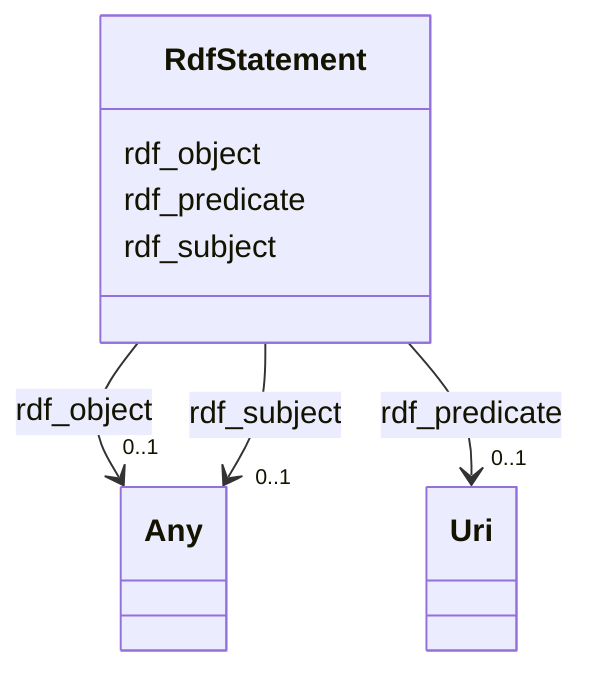

# Class: No class (type) name specified (rdf_Statement)


_No class (type) description specified_


This class occurs 406515 times.


URI: [rdf:Statement](http://www.w3.org/1999/02/22-rdf-syntax-ns#Statement)





<!-- no inheritance hierarchy -->


## Slots

| Name | Cardinality and Range | Description | Inheritance | Occurrences |
| ---  | --- | --- | --- | --- |
| [rdf_subject](../slots/rdf_subject.md) | 0..1 <br/> [HttpsNasa-gesdisc.proto-okn.netKgSchemaPlatform](../classes/HttpsNasa-gesdisc.proto-okn.netKgSchemaPlatform.md)&nbsp;or&nbsp;<br />[HttpsNasa-gesdisc.proto-okn.netKgSchemaScienceKeyword](../classes/HttpsNasa-gesdisc.proto-okn.netKgSchemaScienceKeyword.md)&nbsp;or&nbsp;<br />[HttpsNasa-gesdisc.proto-okn.netKgSchemaDataset](../classes/HttpsNasa-gesdisc.proto-okn.netKgSchemaDataset.md)&nbsp;or&nbsp;<br />[HttpsNasa-gesdisc.proto-okn.netKgSchemaDataCenter](../classes/HttpsNasa-gesdisc.proto-okn.netKgSchemaDataCenter.md)&nbsp;or&nbsp;<br />[HttpsNasa-gesdisc.proto-okn.netKgSchemaPublication](../classes/HttpsNasa-gesdisc.proto-okn.netKgSchemaPublication.md) | No slot (predicate) description specified <br/>  | direct | 406515 |
| [rdf_object](../slots/rdf_object.md) | 0..1 <br/> [HttpsNasa-gesdisc.proto-okn.netKgSchemaInstrument](../classes/HttpsNasa-gesdisc.proto-okn.netKgSchemaInstrument.md)&nbsp;or&nbsp;<br />[HttpsNasa-gesdisc.proto-okn.netKgSchemaProject](../classes/HttpsNasa-gesdisc.proto-okn.netKgSchemaProject.md)&nbsp;or&nbsp;<br />[HttpsNasa-gesdisc.proto-okn.netKgSchemaPlatform](../classes/HttpsNasa-gesdisc.proto-okn.netKgSchemaPlatform.md)&nbsp;or&nbsp;<br />[HttpsNasa-gesdisc.proto-okn.netKgSchemaScienceKeyword](../classes/HttpsNasa-gesdisc.proto-okn.netKgSchemaScienceKeyword.md)&nbsp;or&nbsp;<br />[HttpsNasa-gesdisc.proto-okn.netKgSchemaDataset](../classes/HttpsNasa-gesdisc.proto-okn.netKgSchemaDataset.md)&nbsp;or&nbsp;<br />[HttpsNasa-gesdisc.proto-okn.netKgSchemaPublication](../classes/HttpsNasa-gesdisc.proto-okn.netKgSchemaPublication.md) | No slot (predicate) description specified <br/>  | direct | 406515 |
| [rdf_predicate](../slots/rdf_predicate.md) | 0..1 <br/> [xsd:anyURI](http://www.w3.org/2001/XMLSchema#anyURI) | No slot (predicate) description specified <br/>  | direct | 406515 |


## LinkML Source

<!-- TODO: investigate https://stackoverflow.com/questions/37606292/how-to-create-tabbed-code-blocks-in-mkdocs-or-sphinx -->

### Direct

<details>

```yaml
name: rdf_Statement
conforms_to: No schema conformance document specified
annotations:
  count:
    tag: count
    value: 406515
description: No class (type) description specified
title: No class (type) name specified
from_schema: nasa-gesdisc
rank: 1000
slots:
- rdf_subject
- rdf_object
- rdf_predicate
slot_usage:
  rdf_object:
    name: rdf_object
    annotations:
      https___nasa-gesdisc.proto-okn.net_kg_schema_Dataset:
        tag: https___nasa-gesdisc.proto-okn.net_kg_schema_Dataset
        value: 35695
      https___nasa-gesdisc.proto-okn.net_kg_schema_Instrument:
        tag: https___nasa-gesdisc.proto-okn.net_kg_schema_Instrument
        value: 2526
      https___nasa-gesdisc.proto-okn.net_kg_schema_Platform:
        tag: https___nasa-gesdisc.proto-okn.net_kg_schema_Platform
        value: 10398
      https___nasa-gesdisc.proto-okn.net_kg_schema_Project:
        tag: https___nasa-gesdisc.proto-okn.net_kg_schema_Project
        value: 6378
      https___nasa-gesdisc.proto-okn.net_kg_schema_Publication:
        tag: https___nasa-gesdisc.proto-okn.net_kg_schema_Publication
        value: 208429
      https___nasa-gesdisc.proto-okn.net_kg_schema_ScienceKeyword:
        tag: https___nasa-gesdisc.proto-okn.net_kg_schema_ScienceKeyword
        value: 143089
  rdf_predicate:
    name: rdf_predicate
    annotations:
      uri:
        tag: uri
        value: 406515
  rdf_subject:
    name: rdf_subject
    annotations:
      https___nasa-gesdisc.proto-okn.net_kg_schema_DataCenter:
        tag: https___nasa-gesdisc.proto-okn.net_kg_schema_DataCenter
        value: 9834
      https___nasa-gesdisc.proto-okn.net_kg_schema_Dataset:
        tag: https___nasa-gesdisc.proto-okn.net_kg_schema_Dataset
        value: 38347
      https___nasa-gesdisc.proto-okn.net_kg_schema_Platform:
        tag: https___nasa-gesdisc.proto-okn.net_kg_schema_Platform
        value: 2526
      https___nasa-gesdisc.proto-okn.net_kg_schema_Publication:
        tag: https___nasa-gesdisc.proto-okn.net_kg_schema_Publication
        value: 353985
      https___nasa-gesdisc.proto-okn.net_kg_schema_ScienceKeyword:
        tag: https___nasa-gesdisc.proto-okn.net_kg_schema_ScienceKeyword
        value: 1823
class_uri: rdf:Statement

```
</details>

### Induced

<details>

```yaml
name: rdf_Statement
conforms_to: No schema conformance document specified
annotations:
  count:
    tag: count
    value: 406515
description: No class (type) description specified
title: No class (type) name specified
from_schema: nasa-gesdisc
rank: 1000
slot_usage:
  rdf_object:
    name: rdf_object
    annotations:
      https___nasa-gesdisc.proto-okn.net_kg_schema_Dataset:
        tag: https___nasa-gesdisc.proto-okn.net_kg_schema_Dataset
        value: 35695
      https___nasa-gesdisc.proto-okn.net_kg_schema_Instrument:
        tag: https___nasa-gesdisc.proto-okn.net_kg_schema_Instrument
        value: 2526
      https___nasa-gesdisc.proto-okn.net_kg_schema_Platform:
        tag: https___nasa-gesdisc.proto-okn.net_kg_schema_Platform
        value: 10398
      https___nasa-gesdisc.proto-okn.net_kg_schema_Project:
        tag: https___nasa-gesdisc.proto-okn.net_kg_schema_Project
        value: 6378
      https___nasa-gesdisc.proto-okn.net_kg_schema_Publication:
        tag: https___nasa-gesdisc.proto-okn.net_kg_schema_Publication
        value: 208429
      https___nasa-gesdisc.proto-okn.net_kg_schema_ScienceKeyword:
        tag: https___nasa-gesdisc.proto-okn.net_kg_schema_ScienceKeyword
        value: 143089
  rdf_predicate:
    name: rdf_predicate
    annotations:
      uri:
        tag: uri
        value: 406515
  rdf_subject:
    name: rdf_subject
    annotations:
      https___nasa-gesdisc.proto-okn.net_kg_schema_DataCenter:
        tag: https___nasa-gesdisc.proto-okn.net_kg_schema_DataCenter
        value: 9834
      https___nasa-gesdisc.proto-okn.net_kg_schema_Dataset:
        tag: https___nasa-gesdisc.proto-okn.net_kg_schema_Dataset
        value: 38347
      https___nasa-gesdisc.proto-okn.net_kg_schema_Platform:
        tag: https___nasa-gesdisc.proto-okn.net_kg_schema_Platform
        value: 2526
      https___nasa-gesdisc.proto-okn.net_kg_schema_Publication:
        tag: https___nasa-gesdisc.proto-okn.net_kg_schema_Publication
        value: 353985
      https___nasa-gesdisc.proto-okn.net_kg_schema_ScienceKeyword:
        tag: https___nasa-gesdisc.proto-okn.net_kg_schema_ScienceKeyword
        value: 1823
attributes:
  rdf_subject:
    name: rdf_subject
    annotations:
      https___nasa-gesdisc.proto-okn.net_kg_schema_DataCenter:
        tag: https___nasa-gesdisc.proto-okn.net_kg_schema_DataCenter
        value: 9834
      https___nasa-gesdisc.proto-okn.net_kg_schema_Dataset:
        tag: https___nasa-gesdisc.proto-okn.net_kg_schema_Dataset
        value: 38347
      https___nasa-gesdisc.proto-okn.net_kg_schema_Platform:
        tag: https___nasa-gesdisc.proto-okn.net_kg_schema_Platform
        value: 2526
      https___nasa-gesdisc.proto-okn.net_kg_schema_Publication:
        tag: https___nasa-gesdisc.proto-okn.net_kg_schema_Publication
        value: 353985
      https___nasa-gesdisc.proto-okn.net_kg_schema_ScienceKeyword:
        tag: https___nasa-gesdisc.proto-okn.net_kg_schema_ScienceKeyword
        value: 1823
    description: No slot (predicate) description specified
    examples:
    - object:
        example_object: https://nasa-gesdisc.proto-okn.net/kg/node/6821
        example_object_type: https___nasa-gesdisc.proto-okn.net_kg_schema_DataCenter
        example_predicate: rdf:subject
        example_subject: https://nasa-gesdisc.proto-okn.net/kg/relationship/0
        example_subject_type: rdf_Statement
    - object:
        example_object: https://nasa-gesdisc.proto-okn.net/kg/node/138
        example_object_type: https___nasa-gesdisc.proto-okn.net_kg_schema_Dataset
        example_predicate: rdf:subject
        example_subject: https://nasa-gesdisc.proto-okn.net/kg/relationship/10000
        example_subject_type: rdf_Statement
    - object:
        example_object: https://nasa-gesdisc.proto-okn.net/kg/node/53279
        example_object_type: https___nasa-gesdisc.proto-okn.net_kg_schema_Publication
        example_predicate: rdf:subject
        example_subject: https://nasa-gesdisc.proto-okn.net/kg/relationship/100000
        example_subject_type: rdf_Statement
    - object:
        example_object: https://nasa-gesdisc.proto-okn.net/kg/node/7369
        example_object_type: https___nasa-gesdisc.proto-okn.net_kg_schema_Platform
        example_predicate: rdf:subject
        example_subject: https://nasa-gesdisc.proto-okn.net/kg/relationship/26610
        example_subject_type: rdf_Statement
    - object:
        example_object: https://nasa-gesdisc.proto-okn.net/kg/node/34483
        example_object_type: https___nasa-gesdisc.proto-okn.net_kg_schema_ScienceKeyword
        example_predicate: rdf:subject
        example_subject: https://nasa-gesdisc.proto-okn.net/kg/relationship/54997
        example_subject_type: rdf_Statement
    from_schema: nasa-gesdisc
    rank: 1000
    slot_uri: rdf:subject
    alias: rdf_subject
    owner: rdf_Statement
    domain_of:
    - rdf_Statement
    range: Any
    any_of:
    - range: https___nasa-gesdisc.proto-okn.net_kg_schema_Platform
    - range: https___nasa-gesdisc.proto-okn.net_kg_schema_ScienceKeyword
    - range: https___nasa-gesdisc.proto-okn.net_kg_schema_Dataset
    - range: https___nasa-gesdisc.proto-okn.net_kg_schema_DataCenter
    - range: https___nasa-gesdisc.proto-okn.net_kg_schema_Publication
  rdf_object:
    name: rdf_object
    annotations:
      https___nasa-gesdisc.proto-okn.net_kg_schema_Dataset:
        tag: https___nasa-gesdisc.proto-okn.net_kg_schema_Dataset
        value: 35695
      https___nasa-gesdisc.proto-okn.net_kg_schema_Instrument:
        tag: https___nasa-gesdisc.proto-okn.net_kg_schema_Instrument
        value: 2526
      https___nasa-gesdisc.proto-okn.net_kg_schema_Platform:
        tag: https___nasa-gesdisc.proto-okn.net_kg_schema_Platform
        value: 10398
      https___nasa-gesdisc.proto-okn.net_kg_schema_Project:
        tag: https___nasa-gesdisc.proto-okn.net_kg_schema_Project
        value: 6378
      https___nasa-gesdisc.proto-okn.net_kg_schema_Publication:
        tag: https___nasa-gesdisc.proto-okn.net_kg_schema_Publication
        value: 208429
      https___nasa-gesdisc.proto-okn.net_kg_schema_ScienceKeyword:
        tag: https___nasa-gesdisc.proto-okn.net_kg_schema_ScienceKeyword
        value: 143089
    description: No slot (predicate) description specified
    examples:
    - object:
        example_object: https://nasa-gesdisc.proto-okn.net/kg/node/0
        example_object_type: https___nasa-gesdisc.proto-okn.net_kg_schema_Dataset
        example_predicate: rdf:object
        example_subject: https://nasa-gesdisc.proto-okn.net/kg/relationship/0
        example_subject_type: rdf_Statement
    - object:
        example_object: https://nasa-gesdisc.proto-okn.net/kg/node/7024
        example_object_type: https___nasa-gesdisc.proto-okn.net_kg_schema_Project
        example_predicate: rdf:object
        example_subject: https://nasa-gesdisc.proto-okn.net/kg/relationship/10000
        example_subject_type: rdf_Statement
    - object:
        example_object: https://nasa-gesdisc.proto-okn.net/kg/node/17877
        example_object_type: https___nasa-gesdisc.proto-okn.net_kg_schema_Publication
        example_predicate: rdf:object
        example_subject: https://nasa-gesdisc.proto-okn.net/kg/relationship/100000
        example_subject_type: rdf_Statement
    - object:
        example_object: https://nasa-gesdisc.proto-okn.net/kg/node/7369
        example_object_type: https___nasa-gesdisc.proto-okn.net_kg_schema_Platform
        example_predicate: rdf:object
        example_subject: https://nasa-gesdisc.proto-okn.net/kg/relationship/16212
        example_subject_type: rdf_Statement
    - object:
        example_object: https://nasa-gesdisc.proto-okn.net/kg/node/7820
        example_object_type: https___nasa-gesdisc.proto-okn.net_kg_schema_Instrument
        example_predicate: rdf:object
        example_subject: https://nasa-gesdisc.proto-okn.net/kg/relationship/26610
        example_subject_type: rdf_Statement
    - object:
        example_object: https://nasa-gesdisc.proto-okn.net/kg/node/34554
        example_object_type: https___nasa-gesdisc.proto-okn.net_kg_schema_ScienceKeyword
        example_predicate: rdf:object
        example_subject: https://nasa-gesdisc.proto-okn.net/kg/relationship/286820
        example_subject_type: rdf_Statement
    from_schema: nasa-gesdisc
    rank: 1000
    slot_uri: rdf:object
    alias: rdf_object
    owner: rdf_Statement
    domain_of:
    - rdf_Statement
    range: Any
    any_of:
    - range: https___nasa-gesdisc.proto-okn.net_kg_schema_Instrument
    - range: https___nasa-gesdisc.proto-okn.net_kg_schema_Project
    - range: https___nasa-gesdisc.proto-okn.net_kg_schema_Platform
    - range: https___nasa-gesdisc.proto-okn.net_kg_schema_ScienceKeyword
    - range: https___nasa-gesdisc.proto-okn.net_kg_schema_Dataset
    - range: https___nasa-gesdisc.proto-okn.net_kg_schema_Publication
  rdf_predicate:
    name: rdf_predicate
    annotations:
      uri:
        tag: uri
        value: 406515
    description: No slot (predicate) description specified
    examples:
    - object:
        example_object: https://nasa-gesdisc.proto-okn.net/kg/schema/HAS_DATASET
        example_object_type: uri
        example_predicate: rdf:predicate
        example_subject: https://nasa-gesdisc.proto-okn.net/kg/relationship/0
        example_subject_type: rdf_Statement
    from_schema: nasa-gesdisc
    rank: 1000
    slot_uri: rdf:predicate
    alias: rdf_predicate
    owner: rdf_Statement
    domain_of:
    - rdf_Statement
    range: uri
class_uri: rdf:Statement

```
</details>