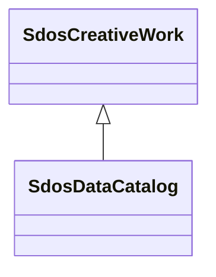

# Class: DataCatalog (sdos_DataCatalog)


_A collection of datasets._


This class occurs 7 times.


URI: [sdos:DataCatalog](https://schema.org/DataCatalog)





## Inheritance
* [SdosThing](../classes/SdosThing.md)
    * [SdosCreativeWork](../classes/SdosCreativeWork.md)
        * **SdosDataCatalog**


## Slots

| Name | Cardinality and Range | Description | Inheritance | Occurrences |
| ---  | --- | --- | --- | --- |


## LinkML Source

<!-- TODO: investigate https://stackoverflow.com/questions/37606292/how-to-create-tabbed-code-blocks-in-mkdocs-or-sphinx -->

### Direct

<details>

```yaml
name: sdos_DataCatalog
description: A collection of datasets.
title: DataCatalog
from_schema: okns:sdo
contributors:
- https://schema.org/docs/collab/DatasetClass
is_a: sdos_CreativeWork
class_uri: sdos:DataCatalog

```
</details>

### Induced

<details>

```yaml
name: sdos_DataCatalog
description: A collection of datasets.
title: DataCatalog
from_schema: okns:sdo
contributors:
- https://schema.org/docs/collab/DatasetClass
is_a: sdos_CreativeWork
class_uri: sdos:DataCatalog

```
</details>