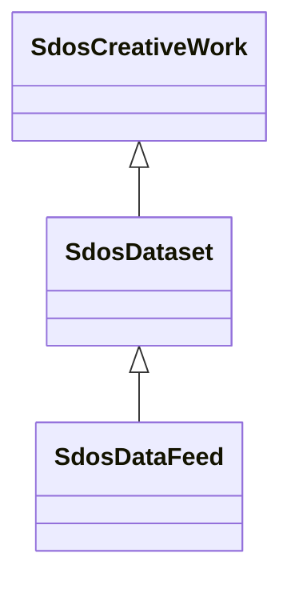

# Class: Dataset (sdos_Dataset)


_A body of structured information describing some topic(s) of interest._


This class occurs 9863 times.


URI: [sdos:Dataset](https://schema.org/Dataset)





## Inheritance
* [SdosThing](../classes/SdosThing.md)
    * [SdosCreativeWork](../classes/SdosCreativeWork.md)
        * **SdosDataset**
            * [SdosDataFeed](../classes/SdosDataFeed.md)


## Slots

| Name | Cardinality and Range | Description | Inheritance | Occurrences |
| ---  | --- | --- | --- | --- |


## LinkML Source

<!-- TODO: investigate https://stackoverflow.com/questions/37606292/how-to-create-tabbed-code-blocks-in-mkdocs-or-sphinx -->

### Direct

<details>

```yaml
name: sdos_Dataset
description: A body of structured information describing some topic(s) of interest.
title: Dataset
from_schema: okns:sdo
contributors:
- https://schema.org/docs/collab/DatasetClass
is_a: sdos_CreativeWork
class_uri: sdos:Dataset

```
</details>

### Induced

<details>

```yaml
name: sdos_Dataset
description: A body of structured information describing some topic(s) of interest.
title: Dataset
from_schema: okns:sdo
contributors:
- https://schema.org/docs/collab/DatasetClass
is_a: sdos_CreativeWork
class_uri: sdos:Dataset

```
</details>