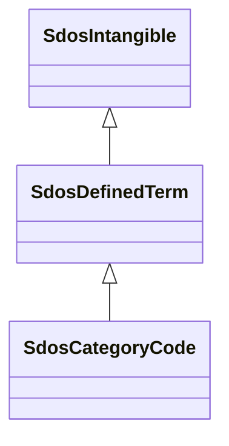

# Class: DefinedTerm (sdos_DefinedTerm)


_A word, name, acronym, phrase, etc. with a formal definition. Often used in the context of category or subject classification, glossaries or dictionaries, product or creative work types, etc. Use the name property for the term being defined, use termCode if the term has an alpha-numeric code allocated, use description to provide the definition of the term._


This class occurs 1275 times.


URI: [sdos:DefinedTerm](https://schema.org/DefinedTerm)





## Inheritance
* [SdosThing](../classes/SdosThing.md)
    * [SdosIntangible](../classes/SdosIntangible.md)
        * **SdosDefinedTerm**
            * [SdosCategoryCode](../classes/SdosCategoryCode.md)


## Slots

| Name | Cardinality and Range | Description | Inheritance | Occurrences |
| ---  | --- | --- | --- | --- |


## LinkML Source

<!-- TODO: investigate https://stackoverflow.com/questions/37606292/how-to-create-tabbed-code-blocks-in-mkdocs-or-sphinx -->

### Direct

<details>

```yaml
name: sdos_DefinedTerm
description: A word, name, acronym, phrase, etc. with a formal definition. Often used
  in the context of category or subject classification, glossaries or dictionaries,
  product or creative work types, etc. Use the name property for the term being defined,
  use termCode if the term has an alpha-numeric code allocated, use description to
  provide the definition of the term.
title: DefinedTerm
from_schema: okns:sdo
source: https://github.com/schemaorg/schemaorg/issues/894
is_a: sdos_Intangible
class_uri: sdos:DefinedTerm

```
</details>

### Induced

<details>

```yaml
name: sdos_DefinedTerm
description: A word, name, acronym, phrase, etc. with a formal definition. Often used
  in the context of category or subject classification, glossaries or dictionaries,
  product or creative work types, etc. Use the name property for the term being defined,
  use termCode if the term has an alpha-numeric code allocated, use description to
  provide the definition of the term.
title: DefinedTerm
from_schema: okns:sdo
source: https://github.com/schemaorg/schemaorg/issues/894
is_a: sdos_Intangible
class_uri: sdos:DefinedTerm

```
</details>