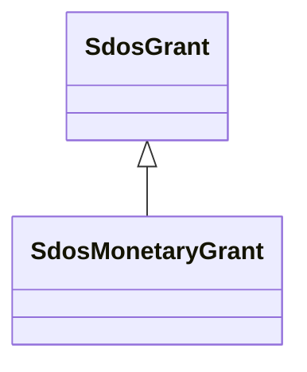

# Class: MonetaryGrant (sdos_MonetaryGrant)


_A monetary grant._


This class occurs 569 times.


URI: [sdos:MonetaryGrant](https://schema.org/MonetaryGrant)





## Inheritance
* [SdosThing](../classes/SdosThing.md)
    * [SdosIntangible](../classes/SdosIntangible.md)
        * [SdosGrant](../classes/SdosGrant.md)
            * **SdosMonetaryGrant**


## Slots

| Name | Cardinality and Range | Description | Inheritance | Occurrences |
| ---  | --- | --- | --- | --- |


## Comments

* source: https://schema.org/docs/collab/FundInfoCollab


## LinkML Source

<!-- TODO: investigate https://stackoverflow.com/questions/37606292/how-to-create-tabbed-code-blocks-in-mkdocs-or-sphinx -->

### Direct

<details>

```yaml
name: sdos_MonetaryGrant
description: A monetary grant.
title: MonetaryGrant
comments:
- 'source: https://schema.org/docs/collab/FundInfoCollab'
from_schema: okns:sdo
source: https://github.com/schemaorg/schemaorg/issues/383
is_a: sdos_Grant
class_uri: sdos:MonetaryGrant

```
</details>

### Induced

<details>

```yaml
name: sdos_MonetaryGrant
description: A monetary grant.
title: MonetaryGrant
comments:
- 'source: https://schema.org/docs/collab/FundInfoCollab'
from_schema: okns:sdo
source: https://github.com/schemaorg/schemaorg/issues/383
is_a: sdos_Grant
class_uri: sdos:MonetaryGrant

```
</details>