# Class: Organization (sdos_Organization)


_An organization such as a school, NGO, corporation, club, etc._


This class occurs 413 times.


URI: [sdos:Organization](https://schema.org/Organization)

```mermaid
 classDiagram
    class SdosOrganization
    click SdosOrganization href "../SdosOrganization"
      SdosThing <|-- SdosOrganization
        click SdosThing href "../SdosThing"
      

      SdosOrganization <|-- SdosAirline
        click SdosAirline href "../SdosAirline"
      SdosOrganization <|-- SdosConsortium
        click SdosConsortium href "../SdosConsortium"
      SdosOrganization <|-- SdosCooperative
        click SdosCooperative href "../SdosCooperative"
      SdosOrganization <|-- SdosCorporation
        click SdosCorporation href "../SdosCorporation"
      SdosOrganization <|-- SdosEducationalOrganization
        click SdosEducationalOrganization href "../SdosEducationalOrganization"
      SdosOrganization <|-- SdosFundingScheme
        click SdosFundingScheme href "../SdosFundingScheme"
      SdosOrganization <|-- SdosGovernmentOrganization
        click SdosGovernmentOrganization href "../SdosGovernmentOrganization"
      SdosOrganization <|-- SdosLibrarySystem
        click SdosLibrarySystem href "../SdosLibrarySystem"
      SdosOrganization <|-- SdosMedicalOrganization
        click SdosMedicalOrganization href "../SdosMedicalOrganization"
      SdosOrganization <|-- SdosNGO
        click SdosNGO href "../SdosNGO"
      SdosOrganization <|-- SdosNewsMediaOrganization
        click SdosNewsMediaOrganization href "../SdosNewsMediaOrganization"
      SdosOrganization <|-- SdosOnlineBusiness
        click SdosOnlineBusiness href "../SdosOnlineBusiness"
      SdosOrganization <|-- SdosPerformingGroup
        click SdosPerformingGroup href "../SdosPerformingGroup"
      SdosOrganization <|-- SdosPoliticalParty
        click SdosPoliticalParty href "../SdosPoliticalParty"
      SdosOrganization <|-- SdosProject
        click SdosProject href "../SdosProject"
      SdosOrganization <|-- SdosResearchOrganization
        click SdosResearchOrganization href "../SdosResearchOrganization"
      SdosOrganization <|-- SdosSearchRescueOrganization
        click SdosSearchRescueOrganization href "../SdosSearchRescueOrganization"
      SdosOrganization <|-- SdosSportsOrganization
        click SdosSportsOrganization href "../SdosSportsOrganization"
      SdosOrganization <|-- SdosWorkersUnion
        click SdosWorkersUnion href "../SdosWorkersUnion"
      
      
      
```





## Inheritance
* [SdosThing](../classes/SdosThing.md)
    * **SdosOrganization**
        * [SdosAirline](../classes/SdosAirline.md)
        * [SdosConsortium](../classes/SdosConsortium.md)
        * [SdosCooperative](../classes/SdosCooperative.md)
        * [SdosCorporation](../classes/SdosCorporation.md)
        * [SdosEducationalOrganization](../classes/SdosEducationalOrganization.md)
        * [SdosFundingScheme](../classes/SdosFundingScheme.md)
        * [SdosGovernmentOrganization](../classes/SdosGovernmentOrganization.md)
        * [SdosLibrarySystem](../classes/SdosLibrarySystem.md)
        * [SdosMedicalOrganization](../classes/SdosMedicalOrganization.md)
        * [SdosNGO](../classes/SdosNGO.md)
        * [SdosNewsMediaOrganization](../classes/SdosNewsMediaOrganization.md)
        * [SdosOnlineBusiness](../classes/SdosOnlineBusiness.md)
        * [SdosPerformingGroup](../classes/SdosPerformingGroup.md)
        * [SdosPoliticalParty](../classes/SdosPoliticalParty.md)
        * [SdosProject](../classes/SdosProject.md)
        * [SdosResearchOrganization](../classes/SdosResearchOrganization.md)
        * [SdosSearchRescueOrganization](../classes/SdosSearchRescueOrganization.md)
        * [SdosSportsOrganization](../classes/SdosSportsOrganization.md)
        * [SdosWorkersUnion](../classes/SdosWorkersUnion.md)


## Slots

| Name | Cardinality and Range | Description | Inheritance | Occurrences |
| ---  | --- | --- | --- | --- |


## Usages

| used by | used in | type | used |
| ---  | --- | --- | --- |
| [SdosCarUsageType](../classes/SdosCarUsageType.md) | [sdos_contributor](../slots/sdos_contributor.md) | any_of[range] | [SdosOrganization](../classes/SdosOrganization.md) |
| [SdosDayOfWeek](../classes/SdosDayOfWeek.md) | [sdos_contributor](../slots/sdos_contributor.md) | any_of[range] | [SdosOrganization](../classes/SdosOrganization.md) |
| [SdosDeliveryMethod](../classes/SdosDeliveryMethod.md) | [sdos_contributor](../slots/sdos_contributor.md) | any_of[range] | [SdosOrganization](../classes/SdosOrganization.md) |
| [SdosDriveWheelConfigurationValue](../classes/SdosDriveWheelConfigurationValue.md) | [sdos_contributor](../slots/sdos_contributor.md) | any_of[range] | [SdosOrganization](../classes/SdosOrganization.md) |
| [SdosLegalForceStatus](../classes/SdosLegalForceStatus.md) | [sdos_contributor](../slots/sdos_contributor.md) | any_of[range] | [SdosOrganization](../classes/SdosOrganization.md) |
| [SdosLegalValueLevel](../classes/SdosLegalValueLevel.md) | [sdos_contributor](../slots/sdos_contributor.md) | any_of[range] | [SdosOrganization](../classes/SdosOrganization.md) |
| [SdosMusicAlbumProductionType](../classes/SdosMusicAlbumProductionType.md) | [sdos_contributor](../slots/sdos_contributor.md) | any_of[range] | [SdosOrganization](../classes/SdosOrganization.md) |
| [SdosMusicAlbumReleaseType](../classes/SdosMusicAlbumReleaseType.md) | [sdos_contributor](../slots/sdos_contributor.md) | any_of[range] | [SdosOrganization](../classes/SdosOrganization.md) |
| [SdosMusicReleaseFormatType](../classes/SdosMusicReleaseFormatType.md) | [sdos_contributor](../slots/sdos_contributor.md) | any_of[range] | [SdosOrganization](../classes/SdosOrganization.md) |
| [SdosSteeringPositionValue](../classes/SdosSteeringPositionValue.md) | [sdos_contributor](../slots/sdos_contributor.md) | any_of[range] | [SdosOrganization](../classes/SdosOrganization.md) |


## LinkML Source

<!-- TODO: investigate https://stackoverflow.com/questions/37606292/how-to-create-tabbed-code-blocks-in-mkdocs-or-sphinx -->

### Direct

<details>

```yaml
name: sdos_Organization
description: An organization such as a school, NGO, corporation, club, etc.
title: Organization
from_schema: okns:sdo
is_a: sdos_Thing
class_uri: sdos:Organization

```
</details>

### Induced

<details>

```yaml
name: sdos_Organization
description: An organization such as a school, NGO, corporation, club, etc.
title: Organization
from_schema: okns:sdo
is_a: sdos_Thing
class_uri: sdos:Organization

```
</details>