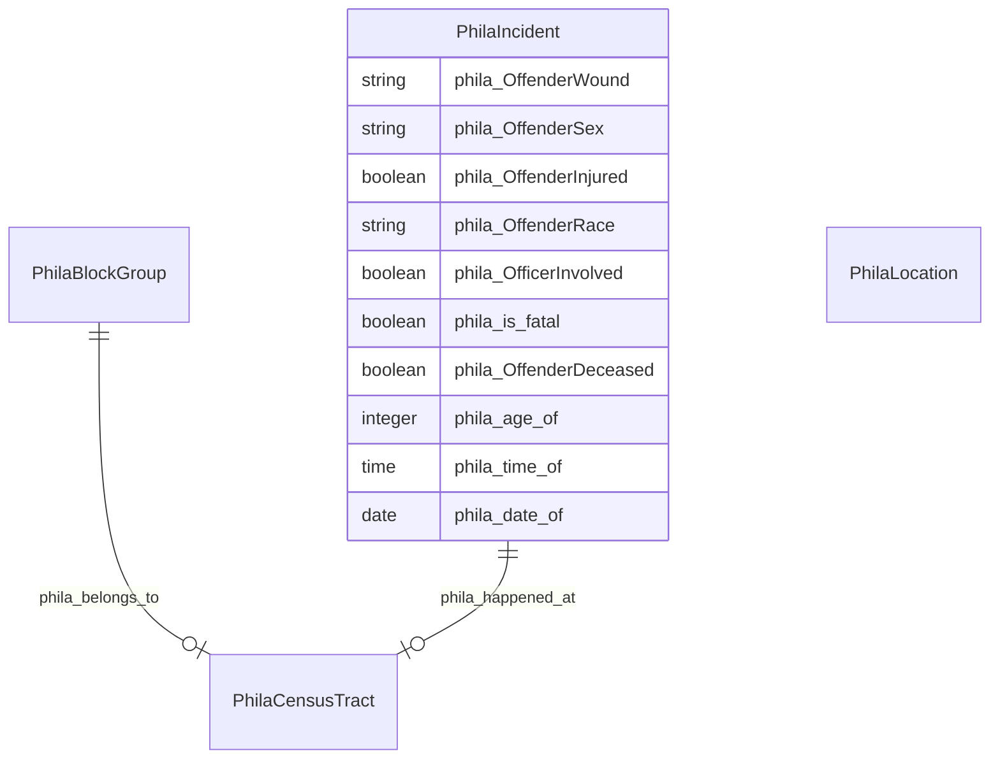

# No schema name specified

No schema description specified

## Schema Diagram

## IRI prefixes

* linkml: https://w3id.org/linkml/
* phila: https://metadata.phila.gov/
* rdf: http://www.w3.org/1999/02/22-rdf-syntax-ns#
* rdfs: http://www.w3.org/2000/01/rdf-schema#

## Classes

| Class | Description |
| --- | --- |
| [PhilaBlockGroup](classes/PhilaBlockGroup.md) | No class (type) description specified Class with 8 occurrences.| 
| [PhilaCensusTract](classes/PhilaCensusTract.md) | No class (type) description specified Class with 361 occurrences.| 
| [PhilaIncident](classes/PhilaIncident.md) | No class (type) description specified Class with 15328 occurrences.| 
| [PhilaLocation](classes/PhilaLocation.md) | No class (type) description specified Class with 9131 occurrences.| 

## Slots

| Slot | Description |
| --- | --- |
| [phila_age_of](slots/phila_age_of.md) | No slot (predicate) description specified 15093 occurrences with subject type phila_Incident and object type integer.|
| [phila_belongs_to](slots/phila_belongs_to.md) | No slot (predicate) description specified 1250 occurrences with subject type phila_BlockGroup and object type phila_CensusTract.|
| [phila_BlockGroup](slots/phila_BlockGroup.md) | No slot (predicate) description specified No occurrences of this slot in the graph.|
| [phila_CensusTract](slots/phila_CensusTract.md) | No slot (predicate) description specified No occurrences of this slot in the graph.|
| [phila_date_of](slots/phila_date_of.md) | No slot (predicate) description specified 15328 occurrences with subject type phila_Incident and object type date.|
| [phila_happened_at](slots/phila_happened_at.md) | No slot (predicate) description specified 15328 occurrences with subject type phila_Incident and object type phila_CensusTract.|
| [phila_Incident](slots/phila_Incident.md) | No slot (predicate) description specified No occurrences of this slot in the graph.|
| [phila_is_fatal](slots/phila_is_fatal.md) | No slot (predicate) description specified 15205 occurrences with subject type phila_Incident and object type boolean.|
| [phila_Location](slots/phila_Location.md) | No slot (predicate) description specified No occurrences of this slot in the graph.|
| [phila_OffenderDeceased](slots/phila_OffenderDeceased.md) | No slot (predicate) description specified 15328 occurrences with subject type phila_Incident and object type boolean.|
| [phila_OffenderInjured](slots/phila_OffenderInjured.md) | No slot (predicate) description specified 15328 occurrences with subject type phila_Incident and object type boolean.|
| [phila_OffenderRace](slots/phila_OffenderRace.md) | No slot (predicate) description specified 15205 occurrences with subject type phila_Incident and object type string.|
| [phila_OffenderSex](slots/phila_OffenderSex.md) | No slot (predicate) description specified 15328 occurrences with subject type phila_Incident and object type string.|
| [phila_OffenderWound](slots/phila_OffenderWound.md) | No slot (predicate) description specified 15200 occurrences with subject type phila_Incident and object type string.|
| [phila_OfficerInvolved](slots/phila_OfficerInvolved.md) | No slot (predicate) description specified 15328 occurrences with subject type phila_Incident and object type boolean.|
| [phila_time_of](slots/phila_time_of.md) | No slot (predicate) description specified 15205 occurrences with subject type phila_Incident and object type time.|

