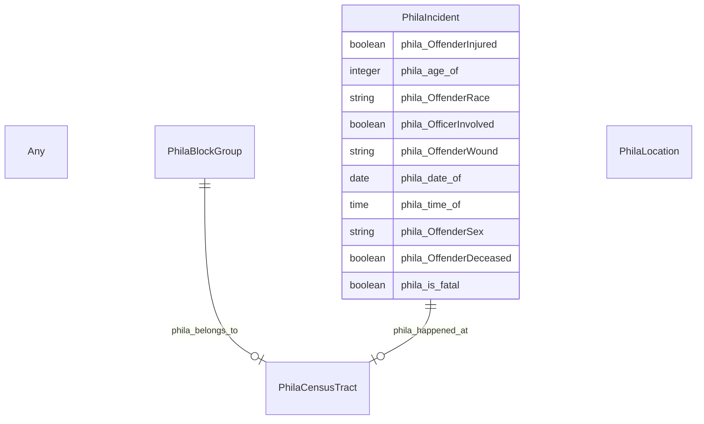

# TODO_Give_this_schema_a_name!

TODO -- tell the world what this schema describes.

URI: neighborhood-kg

Name: neighborhood-kg

## Schema Diagram

## Classes

| Class | Description |
| --- | --- |
| [Any](classes/Any.md) | None |
| [PhilaBlockGroup](classes/PhilaBlockGroup.md) | TODO -- tell the world what this class (type) describes. |
| [PhilaCensusTract](classes/PhilaCensusTract.md) | TODO -- tell the world what this class (type) describes. |
| [PhilaIncident](classes/PhilaIncident.md) | TODO -- tell the world what this class (type) describes. |
| [PhilaLocation](classes/PhilaLocation.md) | TODO -- tell the world what this class (type) describes. |

## Slots

| Slot | Description |
| --- | --- |
| [phila_age_of](slots/phila_age_of.md) | TODO -- tell the world what this slot (predicate) describes |
| [phila_belongs_to](slots/phila_belongs_to.md) | TODO -- tell the world what this slot (predicate) describes |
| [phila_date_of](slots/phila_date_of.md) | TODO -- tell the world what this slot (predicate) describes |
| [phila_happened_at](slots/phila_happened_at.md) | TODO -- tell the world what this slot (predicate) describes |
| [phila_is_fatal](slots/phila_is_fatal.md) | TODO -- tell the world what this slot (predicate) describes |
| [phila_OffenderDeceased](slots/phila_OffenderDeceased.md) | TODO -- tell the world what this slot (predicate) describes |
| [phila_OffenderInjured](slots/phila_OffenderInjured.md) | TODO -- tell the world what this slot (predicate) describes |
| [phila_OffenderRace](slots/phila_OffenderRace.md) | TODO -- tell the world what this slot (predicate) describes |
| [phila_OffenderSex](slots/phila_OffenderSex.md) | TODO -- tell the world what this slot (predicate) describes |
| [phila_OffenderWound](slots/phila_OffenderWound.md) | TODO -- tell the world what this slot (predicate) describes |
| [phila_OfficerInvolved](slots/phila_OfficerInvolved.md) | TODO -- tell the world what this slot (predicate) describes |
| [phila_time_of](slots/phila_time_of.md) | TODO -- tell the world what this slot (predicate) describes |

## Enumerations

| Enumeration | Description |
| --- | --- |

## Types

| Type | Description |
| --- | --- |

## Subsets

| Subset | Description |
| --- | --- |
