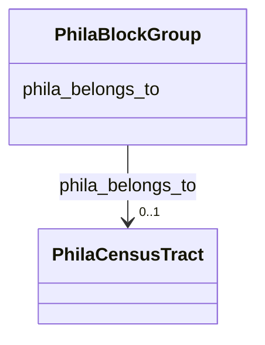

# Class: PhilaBlockGroup


This class occurs 8 times.


URI: [phila:BlockGroup](https://metadata.phila.gov/BlockGroup)





<!-- no inheritance hierarchy -->


## Slots

| Name | Cardinality and Range | Description | Inheritance | Occurrences |
| ---  | --- | --- | --- | --- |
| [phila_belongs_to](../slots/phila_belongs_to.md) | 0..1 <br/> [PhilaCensusTract](../classes/PhilaCensusTract.md) |  <br/>  | direct | 1250 |


## LinkML Source

<!-- TODO: investigate https://stackoverflow.com/questions/37606292/how-to-create-tabbed-code-blocks-in-mkdocs-or-sphinx -->

### Direct

<details>

```yaml
name: phila_BlockGroup
from_schema: okns:neighborhood-kg
rank: 1000
slots:
- phila_belongs_to
class_uri: phila:BlockGroup

```
</details>

### Induced

<details>

```yaml
name: phila_BlockGroup
from_schema: okns:neighborhood-kg
rank: 1000
attributes:
  phila_belongs_to:
    name: phila_belongs_to
    from_schema: okns:neighborhood-kg
    rank: 1000
    slot_uri: phila:belongs_to
    alias: phila_belongs_to
    owner: phila_BlockGroup
    domain_of:
    - phila_BlockGroup
    range: phila_CensusTract
class_uri: phila:BlockGroup

```
</details>