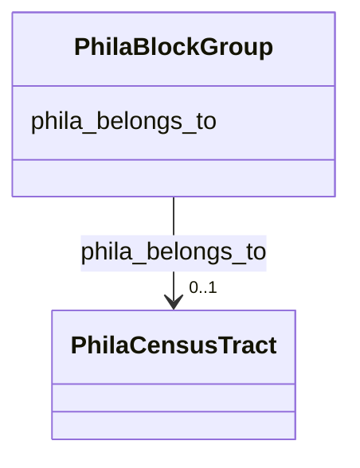

# Class: TODO -- what's a good name for this class (type)? (phila_BlockGroup)


_TODO -- tell the world what this class (type) describes._


URI: [phila:BlockGroup](https://metadata.phila.gov/BlockGroup)





<!-- no inheritance hierarchy -->


## Slots

| Name | Cardinality and Range | Description | Inheritance |
| ---  | --- | --- | --- |
| [phila_belongs_to](../slots/phila_belongs_to.md) | 0..1 <br/> [PhilaCensusTract](../classes/PhilaCensusTract.md) | TODO -- tell the world what this slot (predicate) describes | direct |


## TODOs

* TODO -- Todos for this class go here
* or you can delete the todos
* if you think the class is perfect.

## Identifier and Mapping Information


### Schema Source


* from schema: neighborhood-kg


## Mappings

| Mapping Type | Mapped Value |
| ---  | ---  |
| self | phila:BlockGroup |
| native | neighborhood-kg/:PhilaBlockGroup |


## LinkML Source

<!-- TODO: investigate https://stackoverflow.com/questions/37606292/how-to-create-tabbed-code-blocks-in-mkdocs-or-sphinx -->

### Direct

<details>
```yaml
name: phila_BlockGroup
description: TODO -- tell the world what this class (type) describes.
title: TODO -- what's a good name for this class (type)?
todos:
- TODO -- Todos for this class go here
- or you can delete the todos
- if you think the class is perfect.
notes:
- Class with 8 occurences.
from_schema: neighborhood-kg
slots:
- phila_belongs_to
class_uri: phila:BlockGroup

```
</details>

### Induced

<details>
```yaml
name: phila_BlockGroup
description: TODO -- tell the world what this class (type) describes.
title: TODO -- what's a good name for this class (type)?
todos:
- TODO -- Todos for this class go here
- or you can delete the todos
- if you think the class is perfect.
notes:
- Class with 8 occurences.
from_schema: neighborhood-kg
attributes:
  phila_belongs_to:
    name: phila_belongs_to
    description: TODO -- tell the world what this slot (predicate) describes.
    todos:
    - TODO -- Todos for this slot go here
    - or you can delete the todos
    - if you think the class is perfect.
    comments:
    - 1250 occurrences with subject type phila_BlockGroup and object type phila_CensusTract.
    examples:
    - value: phila:BG_8 phila:belongs_to phila:CT_39000
    from_schema: neighborhood-kg
    rank: 1000
    slot_uri: phila:belongs_to
    alias: phila_belongs_to
    owner: phila_BlockGroup
    domain_of:
    - phila_BlockGroup
    range: phila_CensusTract
class_uri: phila:BlockGroup

```
</details>