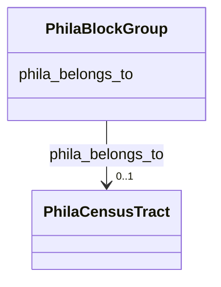

# Class: No class (type) name specified (phila_BlockGroup)


_No class (type) description specified_


URI: [phila:BlockGroup](https://metadata.phila.gov/BlockGroup)





<!-- no inheritance hierarchy -->


## Slots

| Name | Cardinality and Range | Description | Inheritance |
| ---  | --- | --- | --- |
| [phila_belongs_to](../slots/phila_belongs_to.md) | 0..1 <br/> [PhilaCensusTract](../classes/PhilaCensusTract.md) | No slot (predicate) description specified <br/> 1250 occurrences with subject type phila_BlockGroup and object type phila_CensusTract. | direct |


## Identifier and Mapping Information


## Mappings

| Mapping Type | Mapped Value |
| ---  | ---  |
| self | phila:BlockGroup |
| native | neighborhood-information-kg/:PhilaBlockGroup |


## LinkML Source

<!-- TODO: investigate https://stackoverflow.com/questions/37606292/how-to-create-tabbed-code-blocks-in-mkdocs-or-sphinx -->

### Direct

<details>
```yaml
name: phila_BlockGroup
conforms_to: No schema conformance document specified
description: No class (type) description specified
title: No class (type) name specified
notes:
- Class with 8 occurrences.
rank: 1000
slots:
- phila_belongs_to
class_uri: phila:BlockGroup

```
</details>

### Induced

<details>
```yaml
name: phila_BlockGroup
conforms_to: No schema conformance document specified
description: No class (type) description specified
title: No class (type) name specified
notes:
- Class with 8 occurrences.
rank: 1000
attributes:
  phila_belongs_to:
    name: phila_belongs_to
    description: No slot (predicate) description specified
    comments:
    - 1250 occurrences with subject type phila_BlockGroup and object type phila_CensusTract.
    examples:
    - description: phila_BlockGroup → phila_CensusTract
      object:
        example_object: phila:CT_39000
        example_object_type: phila_CensusTract
        example_predicate: phila:belongs_to
        example_subject: phila:BG_8
        example_subject_type: phila_BlockGroup
    from_schema: neighborhood-information-kg
    rank: 1000
    slot_uri: phila:belongs_to
    alias: phila_belongs_to
    owner: phila_BlockGroup
    domain_of:
    - phila_BlockGroup
    range: phila_CensusTract
class_uri: phila:BlockGroup

```
</details>