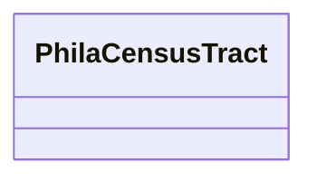

# Class: PhilaCensusTract


This class occurs 361 times.


URI: [phila:CensusTract](https://metadata.phila.gov/CensusTract)





<!-- no inheritance hierarchy -->


## Slots

| Name | Cardinality and Range | Description | Inheritance | Occurrences |
| ---  | --- | --- | --- | --- |


## Usages

| used by | used in | type | used |
| ---  | --- | --- | --- |
| [PhilaBlockGroup](../classes/PhilaBlockGroup.md) | [phila_belongs_to](../slots/phila_belongs_to.md) | range | [PhilaCensusTract](../classes/PhilaCensusTract.md) |
| [PhilaIncident](../classes/PhilaIncident.md) | [phila_happened_at](../slots/phila_happened_at.md) | range | [PhilaCensusTract](../classes/PhilaCensusTract.md) |


## LinkML Source

<!-- TODO: investigate https://stackoverflow.com/questions/37606292/how-to-create-tabbed-code-blocks-in-mkdocs-or-sphinx -->

### Direct

<details>

```yaml
name: phila_CensusTract
from_schema: okns:neighborhood-kg
rank: 1000
class_uri: phila:CensusTract

```
</details>

### Induced

<details>

```yaml
name: phila_CensusTract
from_schema: okns:neighborhood-kg
rank: 1000
class_uri: phila:CensusTract

```
</details>