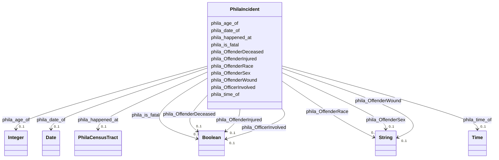

# Class: No class (type) name specified (phila_Incident)


_No class (type) description specified_


URI: [phila:Incident](https://metadata.phila.gov/Incident)





<!-- no inheritance hierarchy -->


## Slots

| Name | Cardinality and Range | Description | Inheritance |
| ---  | --- | --- | --- |
| [phila_OffenderWound](../slots/phila_OffenderWound.md) | 0..1 <br/> [xsd:string](xsd:string) | No slot (predicate) description specified <br/> 15200 occurrences with subject type phila_Incident and object type string. | direct |
| [phila_OffenderSex](../slots/phila_OffenderSex.md) | 0..1 <br/> [xsd:string](xsd:string) | No slot (predicate) description specified <br/> 15328 occurrences with subject type phila_Incident and object type string. | direct |
| [phila_OffenderInjured](../slots/phila_OffenderInjured.md) | 0..1 <br/> [xsd:boolean](xsd:boolean) | No slot (predicate) description specified <br/> 15328 occurrences with subject type phila_Incident and object type boolean. | direct |
| [phila_OffenderRace](../slots/phila_OffenderRace.md) | 0..1 <br/> [xsd:string](xsd:string) | No slot (predicate) description specified <br/> 15205 occurrences with subject type phila_Incident and object type string. | direct |
| [phila_OfficerInvolved](../slots/phila_OfficerInvolved.md) | 0..1 <br/> [xsd:boolean](xsd:boolean) | No slot (predicate) description specified <br/> 15328 occurrences with subject type phila_Incident and object type boolean. | direct |
| [phila_is_fatal](../slots/phila_is_fatal.md) | 0..1 <br/> [xsd:boolean](xsd:boolean) | No slot (predicate) description specified <br/> 15205 occurrences with subject type phila_Incident and object type boolean. | direct |
| [phila_OffenderDeceased](../slots/phila_OffenderDeceased.md) | 0..1 <br/> [xsd:boolean](xsd:boolean) | No slot (predicate) description specified <br/> 15328 occurrences with subject type phila_Incident and object type boolean. | direct |
| [phila_age_of](../slots/phila_age_of.md) | 0..1 <br/> [xsd:integer](xsd:integer) | No slot (predicate) description specified <br/> 15093 occurrences with subject type phila_Incident and object type integer. | direct |
| [phila_time_of](../slots/phila_time_of.md) | 0..1 <br/> [xsd:time](xsd:time) | No slot (predicate) description specified <br/> 15205 occurrences with subject type phila_Incident and object type time. | direct |
| [phila_date_of](../slots/phila_date_of.md) | 0..1 <br/> [xsd:date](xsd:date) | No slot (predicate) description specified <br/> 15328 occurrences with subject type phila_Incident and object type date. | direct |
| [phila_happened_at](../slots/phila_happened_at.md) | 0..1 <br/> [PhilaCensusTract](../classes/PhilaCensusTract.md) | No slot (predicate) description specified <br/> 15328 occurrences with subject type phila_Incident and object type phila_CensusTract. | direct |


## Identifier and Mapping Information


## Mappings

| Mapping Type | Mapped Value |
| ---  | ---  |
| self | phila:Incident |
| native | neighborhood-information-kg/:PhilaIncident |


## LinkML Source

<!-- TODO: investigate https://stackoverflow.com/questions/37606292/how-to-create-tabbed-code-blocks-in-mkdocs-or-sphinx -->

### Direct

<details>
```yaml
name: phila_Incident
conforms_to: No schema conformance document specified
description: No class (type) description specified
title: No class (type) name specified
notes:
- Class with 15328 occurrences.
rank: 1000
slots:
- phila_OffenderWound
- phila_OffenderSex
- phila_OffenderInjured
- phila_OffenderRace
- phila_OfficerInvolved
- phila_is_fatal
- phila_OffenderDeceased
- phila_age_of
- phila_time_of
- phila_date_of
- phila_happened_at
class_uri: phila:Incident

```
</details>

### Induced

<details>
```yaml
name: phila_Incident
conforms_to: No schema conformance document specified
description: No class (type) description specified
title: No class (type) name specified
notes:
- Class with 15328 occurrences.
rank: 1000
attributes:
  phila_OffenderWound:
    name: phila_OffenderWound
    description: No slot (predicate) description specified
    comments:
    - 15200 occurrences with subject type phila_Incident and object type string.
    examples:
    - description: phila_Incident → string
      object:
        example_object: Multiple
        example_object_type: string
        example_predicate: phila:OffenderWound
        example_subject: phila:OBJ_11856539
        example_subject_type: phila_Incident
    from_schema: neighborhood-information-kg
    rank: 1000
    slot_uri: phila:OffenderWound
    alias: phila_OffenderWound
    owner: phila_Incident
    domain_of:
    - phila_Incident
    range: string
  phila_OffenderSex:
    name: phila_OffenderSex
    description: No slot (predicate) description specified
    comments:
    - 15328 occurrences with subject type phila_Incident and object type string.
    examples:
    - description: phila_Incident → string
      object:
        example_object: F
        example_object_type: string
        example_predicate: phila:OffenderSex
        example_subject: phila:OBJ_11856539
        example_subject_type: phila_Incident
    from_schema: neighborhood-information-kg
    rank: 1000
    slot_uri: phila:OffenderSex
    alias: phila_OffenderSex
    owner: phila_Incident
    domain_of:
    - phila_Incident
    range: string
  phila_OffenderInjured:
    name: phila_OffenderInjured
    description: No slot (predicate) description specified
    comments:
    - 15328 occurrences with subject type phila_Incident and object type boolean.
    examples:
    - description: phila_Incident → boolean
      object:
        example_object: 'false'
        example_object_type: boolean
        example_predicate: phila:OffenderInjured
        example_subject: phila:OBJ_11856539
        example_subject_type: phila_Incident
    from_schema: neighborhood-information-kg
    rank: 1000
    slot_uri: phila:OffenderInjured
    alias: phila_OffenderInjured
    owner: phila_Incident
    domain_of:
    - phila_Incident
    range: boolean
  phila_OffenderRace:
    name: phila_OffenderRace
    description: No slot (predicate) description specified
    comments:
    - 15205 occurrences with subject type phila_Incident and object type string.
    examples:
    - description: phila_Incident → string
      object:
        example_object: B
        example_object_type: string
        example_predicate: phila:OffenderRace
        example_subject: phila:OBJ_11856539
        example_subject_type: phila_Incident
    from_schema: neighborhood-information-kg
    rank: 1000
    slot_uri: phila:OffenderRace
    alias: phila_OffenderRace
    owner: phila_Incident
    domain_of:
    - phila_Incident
    range: string
  phila_OfficerInvolved:
    name: phila_OfficerInvolved
    description: No slot (predicate) description specified
    comments:
    - 15328 occurrences with subject type phila_Incident and object type boolean.
    examples:
    - description: phila_Incident → boolean
      object:
        example_object: 'false'
        example_object_type: boolean
        example_predicate: phila:OfficerInvolved
        example_subject: phila:OBJ_11856539
        example_subject_type: phila_Incident
    from_schema: neighborhood-information-kg
    rank: 1000
    slot_uri: phila:OfficerInvolved
    alias: phila_OfficerInvolved
    owner: phila_Incident
    domain_of:
    - phila_Incident
    range: boolean
  phila_is_fatal:
    name: phila_is_fatal
    description: No slot (predicate) description specified
    comments:
    - 15205 occurrences with subject type phila_Incident and object type boolean.
    examples:
    - description: phila_Incident → boolean
      object:
        example_object: 'false'
        example_object_type: boolean
        example_predicate: phila:is_fatal
        example_subject: phila:OBJ_11856539
        example_subject_type: phila_Incident
    from_schema: neighborhood-information-kg
    rank: 1000
    slot_uri: phila:is_fatal
    alias: phila_is_fatal
    owner: phila_Incident
    domain_of:
    - phila_Incident
    range: boolean
  phila_OffenderDeceased:
    name: phila_OffenderDeceased
    description: No slot (predicate) description specified
    comments:
    - 15328 occurrences with subject type phila_Incident and object type boolean.
    examples:
    - description: phila_Incident → boolean
      object:
        example_object: 'false'
        example_object_type: boolean
        example_predicate: phila:OffenderDeceased
        example_subject: phila:OBJ_11856539
        example_subject_type: phila_Incident
    from_schema: neighborhood-information-kg
    rank: 1000
    slot_uri: phila:OffenderDeceased
    alias: phila_OffenderDeceased
    owner: phila_Incident
    domain_of:
    - phila_Incident
    range: boolean
  phila_age_of:
    name: phila_age_of
    description: No slot (predicate) description specified
    comments:
    - 15093 occurrences with subject type phila_Incident and object type integer.
    examples:
    - description: phila_Incident → integer
      object:
        example_object: '64'
        example_object_type: integer
        example_predicate: phila:age_of
        example_subject: phila:OBJ_11856539
        example_subject_type: phila_Incident
    from_schema: neighborhood-information-kg
    rank: 1000
    slot_uri: phila:age_of
    alias: phila_age_of
    owner: phila_Incident
    domain_of:
    - phila_Incident
    range: integer
  phila_time_of:
    name: phila_time_of
    description: No slot (predicate) description specified
    comments:
    - 15205 occurrences with subject type phila_Incident and object type time.
    examples:
    - description: phila_Incident → time
      object:
        example_object: 00:13:00
        example_object_type: time
        example_predicate: phila:time_of
        example_subject: phila:OBJ_11856539
        example_subject_type: phila_Incident
    from_schema: neighborhood-information-kg
    rank: 1000
    slot_uri: phila:time_of
    alias: phila_time_of
    owner: phila_Incident
    domain_of:
    - phila_Incident
    range: time
  phila_date_of:
    name: phila_date_of
    description: No slot (predicate) description specified
    comments:
    - 15328 occurrences with subject type phila_Incident and object type date.
    examples:
    - description: phila_Incident → date
      object:
        example_object: '2022-12-21'
        example_object_type: date
        example_predicate: phila:date_of
        example_subject: phila:OBJ_11856539
        example_subject_type: phila_Incident
    from_schema: neighborhood-information-kg
    rank: 1000
    slot_uri: phila:date_of
    alias: phila_date_of
    owner: phila_Incident
    domain_of:
    - phila_Incident
    range: date
  phila_happened_at:
    name: phila_happened_at
    description: No slot (predicate) description specified
    comments:
    - 15328 occurrences with subject type phila_Incident and object type phila_CensusTract.
    examples:
    - description: phila_Incident → phila_CensusTract
      object:
        example_object: phila:CT_28902
        example_object_type: phila_CensusTract
        example_predicate: phila:happened_at
        example_subject: phila:OBJ_11871866
        example_subject_type: phila_Incident
    from_schema: neighborhood-information-kg
    rank: 1000
    slot_uri: phila:happened_at
    alias: phila_happened_at
    owner: phila_Incident
    domain_of:
    - phila_Incident
    range: phila_CensusTract
class_uri: phila:Incident

```
</details>