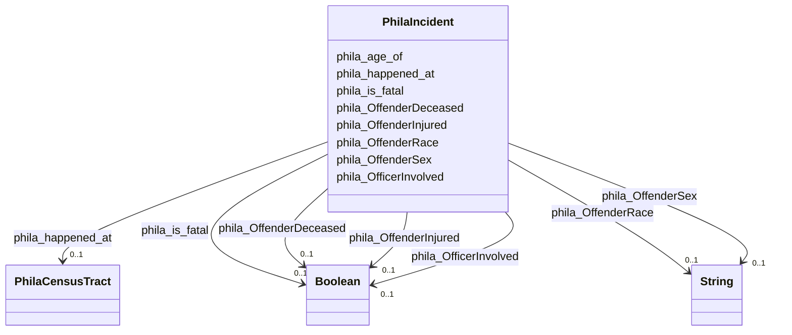

# Class: PhilaIncident


This class occurs 15328 times.


URI: [phila:Incident](https://metadata.phila.gov/Incident)





<!-- no inheritance hierarchy -->


## Slots

| Name | Cardinality and Range | Description | Inheritance | Occurrences |
| ---  | --- | --- | --- | --- |
| [phila_age_of](../slots/phila_age_of.md) | 0..1 <br/> [HttpQudt.orgVocabUnitYR](../types/HttpQudt.orgVocabUnitYR.md) |  <br/>  | direct | 15093 |
| [phila_OffenderInjured](../slots/phila_OffenderInjured.md) | 0..1 <br/> [xsd:boolean](http://www.w3.org/2001/XMLSchema#boolean) |  <br/>  | direct | 15328 |
| [phila_OfficerInvolved](../slots/phila_OfficerInvolved.md) | 0..1 <br/> [xsd:boolean](http://www.w3.org/2001/XMLSchema#boolean) |  <br/>  | direct | 15328 |
| [phila_is_fatal](../slots/phila_is_fatal.md) | 0..1 <br/> [xsd:boolean](http://www.w3.org/2001/XMLSchema#boolean) |  <br/>  | direct | 15328 |
| [phila_OffenderDeceased](../slots/phila_OffenderDeceased.md) | 0..1 <br/> [xsd:boolean](http://www.w3.org/2001/XMLSchema#boolean) |  <br/>  | direct | 15328 |
| [phila_OffenderRace](../slots/phila_OffenderRace.md) | 0..1 <br/> [xsd:string](http://www.w3.org/2001/XMLSchema#string) |  <br/>  | direct | 15328 |
| [phila_happened_at](../slots/phila_happened_at.md) | 0..1 <br/> [PhilaCensusTract](../classes/PhilaCensusTract.md) |  <br/>  | direct | 15328 |
| [phila_OffenderSex](../slots/phila_OffenderSex.md) | 0..1 <br/> [xsd:string](http://www.w3.org/2001/XMLSchema#string) |  <br/>  | direct | 15328 |


## LinkML Source

<!-- TODO: investigate https://stackoverflow.com/questions/37606292/how-to-create-tabbed-code-blocks-in-mkdocs-or-sphinx -->

### Direct

<details>

```yaml
name: phila_Incident
from_schema: okns:neighborhood-kg
rank: 1000
slots:
- phila_age_of
- phila_OffenderInjured
- phila_OfficerInvolved
- phila_is_fatal
- phila_OffenderDeceased
- phila_OffenderRace
- phila_happened_at
- phila_OffenderSex
class_uri: phila:Incident

```
</details>

### Induced

<details>

```yaml
name: phila_Incident
from_schema: okns:neighborhood-kg
rank: 1000
attributes:
  phila_age_of:
    name: phila_age_of
    from_schema: okns:neighborhood-kg
    rank: 1000
    slot_uri: phila:age_of
    alias: phila_age_of
    owner: phila_Incident
    domain_of:
    - phila_Incident
    range: http___qudt.org_vocab_unit_YR
  phila_OffenderInjured:
    name: phila_OffenderInjured
    from_schema: okns:neighborhood-kg
    rank: 1000
    slot_uri: phila:OffenderInjured
    alias: phila_OffenderInjured
    owner: phila_Incident
    domain_of:
    - phila_Incident
    range: boolean
  phila_OfficerInvolved:
    name: phila_OfficerInvolved
    from_schema: okns:neighborhood-kg
    rank: 1000
    slot_uri: phila:OfficerInvolved
    alias: phila_OfficerInvolved
    owner: phila_Incident
    domain_of:
    - phila_Incident
    range: boolean
  phila_is_fatal:
    name: phila_is_fatal
    from_schema: okns:neighborhood-kg
    rank: 1000
    slot_uri: phila:is_fatal
    alias: phila_is_fatal
    owner: phila_Incident
    domain_of:
    - phila_Incident
    range: boolean
  phila_OffenderDeceased:
    name: phila_OffenderDeceased
    from_schema: okns:neighborhood-kg
    rank: 1000
    slot_uri: phila:OffenderDeceased
    alias: phila_OffenderDeceased
    owner: phila_Incident
    domain_of:
    - phila_Incident
    range: boolean
  phila_OffenderRace:
    name: phila_OffenderRace
    from_schema: okns:neighborhood-kg
    rank: 1000
    slot_uri: phila:OffenderRace
    alias: phila_OffenderRace
    owner: phila_Incident
    domain_of:
    - phila_Incident
    range: string
  phila_happened_at:
    name: phila_happened_at
    from_schema: okns:neighborhood-kg
    rank: 1000
    slot_uri: phila:happened_at
    alias: phila_happened_at
    owner: phila_Incident
    domain_of:
    - phila_Incident
    range: phila_CensusTract
  phila_OffenderSex:
    name: phila_OffenderSex
    from_schema: okns:neighborhood-kg
    rank: 1000
    slot_uri: phila:OffenderSex
    alias: phila_OffenderSex
    owner: phila_Incident
    domain_of:
    - phila_Incident
    range: string
class_uri: phila:Incident

```
</details>