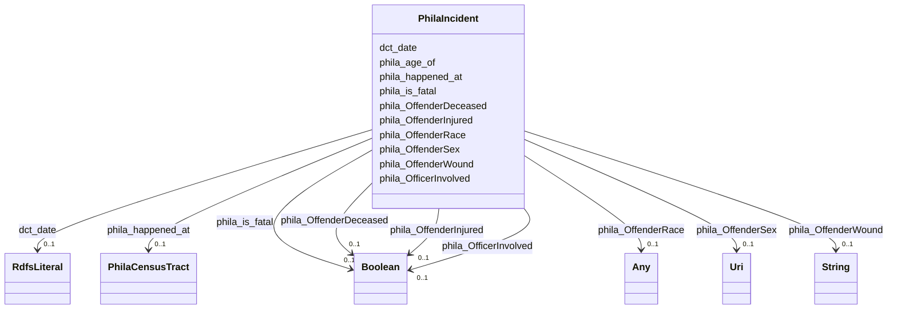

# Class: PhilaIncident


This class occurs 15328 times.


URI: [phila:Incident](https://metadata.phila.gov/Incident)





<!-- no inheritance hierarchy -->


## Slots

| Name | Cardinality and Range | Description | Inheritance | Occurrences |
| ---  | --- | --- | --- | --- |
| [phila_is_fatal](../slots/phila_is_fatal.md) | 0..1 <br/> [xsd:boolean](xsd:boolean) |  <br/>  | direct | 15205 |
| [dct_date](../slots/dct_date.md) | 0..1 <br/> [RdfsLiteral](../classes/RdfsLiteral.md) | Date may be used to express temporal information at any level of granularity <br/> description: A point or period of time associated with an event in the lifecycle of the resource. | direct | 15328 |
| [phila_OffenderWound](../slots/phila_OffenderWound.md) | 0..1 <br/> [xsd:string](xsd:string) |  <br/>  | direct | 15200 |
| [phila_OffenderDeceased](../slots/phila_OffenderDeceased.md) | 0..1 <br/> [xsd:boolean](xsd:boolean) |  <br/>  | direct | 15328 |
| [phila_OffenderSex](../slots/phila_OffenderSex.md) | 0..1 <br/> [xsd:anyURI](xsd:anyURI) |  <br/>  | direct | 15328 |
| [phila_OfficerInvolved](../slots/phila_OfficerInvolved.md) | 0..1 <br/> [xsd:boolean](xsd:boolean) |  <br/>  | direct | 15328 |
| [phila_happened_at](../slots/phila_happened_at.md) | 0..1 <br/> [PhilaCensusTract](../classes/PhilaCensusTract.md) |  <br/>  | direct | 15328 |
| [phila_OffenderInjured](../slots/phila_OffenderInjured.md) | 0..1 <br/> [xsd:boolean](xsd:boolean) |  <br/>  | direct | 15328 |
| [phila_age_of](../slots/phila_age_of.md) | 0..1 <br/> [HttpQudt.orgVocabUnitYR](../types/HttpQudt.orgVocabUnitYR.md) |  <br/>  | direct | 15093 |
| [phila_OffenderRace](../slots/phila_OffenderRace.md) | 0..1 <br/> [xsd:string](xsd:string)&nbsp;or&nbsp;<br />[xsd:anyURI](xsd:anyURI) |  <br/>  | direct | 15205 |


## LinkML Source

<!-- TODO: investigate https://stackoverflow.com/questions/37606292/how-to-create-tabbed-code-blocks-in-mkdocs-or-sphinx -->

### Direct

<details>

```yaml
name: phila_Incident
from_schema: okns:neighborhood-kg
rank: 1000
slots:
- phila_is_fatal
- dct_date
- phila_OffenderWound
- phila_OffenderDeceased
- phila_OffenderSex
- phila_OfficerInvolved
- phila_happened_at
- phila_OffenderInjured
- phila_age_of
- phila_OffenderRace
class_uri: phila:Incident

```
</details>

### Induced

<details>

```yaml
name: phila_Incident
from_schema: okns:neighborhood-kg
rank: 1000
attributes:
  phila_is_fatal:
    name: phila_is_fatal
    from_schema: okns:neighborhood-kg
    rank: 1000
    slot_uri: phila:is_fatal
    alias: phila_is_fatal
    owner: phila_Incident
    domain_of:
    - phila_Incident
    range: boolean
  dct_date:
    name: dct_date
    description: Date may be used to express temporal information at any level of
      granularity.  Recommended practice is to express the date, date/time, or period
      of time according to ISO 8601-1 [[ISO 8601-1](https://www.iso.org/iso-8601-date-and-time-format.html)]
      or a published profile of the ISO standard, such as the W3C Note on Date and
      Time Formats [[W3CDTF](https://www.w3.org/TR/NOTE-datetime)] or the Extended
      Date/Time Format Specification [[EDTF](http://www.loc.gov/standards/datetime/)].  If
      the full date is unknown, month and year (YYYY-MM) or just year (YYYY) may be
      used. Date ranges may be specified using ISO 8601 period of time specification
      in which start and end dates are separated by a '/' (slash) character.  Either
      the start or end date may be missing.
    title: Date
    notes:
    - No occurrences of this slot in the graph.
    comments:
    - 'description: A point or period of time associated with an event in the lifecycle
      of the resource.'
    from_schema: okns:dc
    source: http://purl.org/dc/terms/
    slot_uri: dct:date
    alias: dct_date
    owner: phila_Incident
    domain_of:
    - phila_Incident
    subproperty_of: dc_date
    range: rdfs_Literal
  phila_OffenderWound:
    name: phila_OffenderWound
    from_schema: okns:neighborhood-kg
    rank: 1000
    slot_uri: phila:OffenderWound
    alias: phila_OffenderWound
    owner: phila_Incident
    domain_of:
    - phila_Incident
    range: string
  phila_OffenderDeceased:
    name: phila_OffenderDeceased
    from_schema: okns:neighborhood-kg
    rank: 1000
    slot_uri: phila:OffenderDeceased
    alias: phila_OffenderDeceased
    owner: phila_Incident
    domain_of:
    - phila_Incident
    range: boolean
  phila_OffenderSex:
    name: phila_OffenderSex
    from_schema: okns:neighborhood-kg
    rank: 1000
    slot_uri: phila:OffenderSex
    alias: phila_OffenderSex
    owner: phila_Incident
    domain_of:
    - phila_Incident
    range: uri
  phila_OfficerInvolved:
    name: phila_OfficerInvolved
    from_schema: okns:neighborhood-kg
    rank: 1000
    slot_uri: phila:OfficerInvolved
    alias: phila_OfficerInvolved
    owner: phila_Incident
    domain_of:
    - phila_Incident
    range: boolean
  phila_happened_at:
    name: phila_happened_at
    from_schema: okns:neighborhood-kg
    rank: 1000
    slot_uri: phila:happened_at
    alias: phila_happened_at
    owner: phila_Incident
    domain_of:
    - phila_Incident
    range: phila_CensusTract
  phila_OffenderInjured:
    name: phila_OffenderInjured
    from_schema: okns:neighborhood-kg
    rank: 1000
    slot_uri: phila:OffenderInjured
    alias: phila_OffenderInjured
    owner: phila_Incident
    domain_of:
    - phila_Incident
    range: boolean
  phila_age_of:
    name: phila_age_of
    from_schema: okns:neighborhood-kg
    rank: 1000
    slot_uri: phila:age_of
    alias: phila_age_of
    owner: phila_Incident
    domain_of:
    - phila_Incident
    range: http___qudt.org_vocab_unit_YR
  phila_OffenderRace:
    name: phila_OffenderRace
    from_schema: okns:neighborhood-kg
    rank: 1000
    slot_uri: phila:OffenderRace
    alias: phila_OffenderRace
    owner: phila_Incident
    domain_of:
    - phila_Incident
    range: Any
    any_of:
    - range: string
    - range: uri
class_uri: phila:Incident

```
</details>