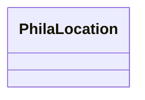

# Class: No class (type) name specified (phila_Location)


_No class (type) description specified_


URI: [phila:Location](https://metadata.phila.gov/Location)





<!-- no inheritance hierarchy -->


## Slots

| Name | Cardinality and Range | Description | Inheritance |
| ---  | --- | --- | --- |


## Identifier and Mapping Information


## Mappings

| Mapping Type | Mapped Value |
| ---  | ---  |
| self | phila:Location |
| native | neighborhood-information-kg/:PhilaLocation |


## LinkML Source

<!-- TODO: investigate https://stackoverflow.com/questions/37606292/how-to-create-tabbed-code-blocks-in-mkdocs-or-sphinx -->

### Direct

<details>
```yaml
name: phila_Location
conforms_to: No schema conformance document specified
description: No class (type) description specified
title: No class (type) name specified
notes:
- Class with 9131 occurrences.
rank: 1000
class_uri: phila:Location

```
</details>

### Induced

<details>
```yaml
name: phila_Location
conforms_to: No schema conformance document specified
description: No class (type) description specified
title: No class (type) name specified
notes:
- Class with 9131 occurrences.
rank: 1000
class_uri: phila:Location

```
</details>