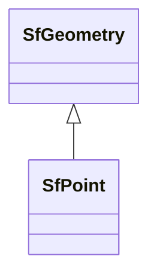

# Class: SfPoint


_A Point is a 0-dimensional geometric object and represents a single location in coordinate space. ␊A Point has an x-coordinate value, a y-coordinate value. If called for by the associated Spatial Reference System, it may also have coordinate values for z and m.␊The boundary of a Point is the empty set._


This class occurs 9133 times.


URI: [sf:Point](http://www.opengis.net/ont/sf#Point)





## Inheritance
* [GeoSpatialObject](../classes/GeoSpatialObject.md)
    * [GeoGeometry](../classes/GeoGeometry.md)
        * [SfGeometry](../classes/SfGeometry.md)
            * **SfPoint**


## Slots

| Name | Cardinality and Range | Description | Inheritance | Occurrences |
| ---  | --- | --- | --- | --- |


## Comments

* source: http://www.opengis.net/ont/sf
* description: A Point is a 0-dimensional geometric object and represents a single location in coordinate space. 
A Point has an x-coordinate value, a y-coordinate value. If called for by the associated Spatial Reference System, it may also have coordinate values for z and m.
The boundary of a Point is the empty set.


## LinkML Source

<!-- TODO: investigate https://stackoverflow.com/questions/37606292/how-to-create-tabbed-code-blocks-in-mkdocs-or-sphinx -->

### Direct

<details>

```yaml
name: sf_Point
description: A Point is a 0-dimensional geometric object and represents a single location
  in coordinate space. ␊A Point has an x-coordinate value, a y-coordinate value. If
  called for by the associated Spatial Reference System, it may also have coordinate
  values for z and m.␊The boundary of a Point is the empty set.
comments:
- 'source: http://www.opengis.net/ont/sf'
- "description: A Point is a 0-dimensional geometric object and represents a single\
  \ location in coordinate space. \nA Point has an x-coordinate value, a y-coordinate\
  \ value. If called for by the associated Spatial Reference System, it may also have\
  \ coordinate values for z and m.\nThe boundary of a Point is the empty set."
from_schema: okns:sf
source: http://www.opengis.net/ont/sf
is_a: sf_Geometry
class_uri: sf:Point

```
</details>

### Induced

<details>

```yaml
name: sf_Point
description: A Point is a 0-dimensional geometric object and represents a single location
  in coordinate space. ␊A Point has an x-coordinate value, a y-coordinate value. If
  called for by the associated Spatial Reference System, it may also have coordinate
  values for z and m.␊The boundary of a Point is the empty set.
comments:
- 'source: http://www.opengis.net/ont/sf'
- "description: A Point is a 0-dimensional geometric object and represents a single\
  \ location in coordinate space. \nA Point has an x-coordinate value, a y-coordinate\
  \ value. If called for by the associated Spatial Reference System, it may also have\
  \ coordinate values for z and m.\nThe boundary of a Point is the empty set."
from_schema: okns:sf
source: http://www.opengis.net/ont/sf
is_a: sf_Geometry
class_uri: sf:Point

```
</details>