# RuralKG Ontology

An ontology which serves the schema for the cross-domain knowledge graph (Rural-KG) to integrate health and justice data for rural resilience.

## Schema Diagram

```mermaid
erDiagram
RuralAdministrativeareaAdministrativeArea {

}
RuralAdministrativeareaCity {
    float rural_administrativearea_latitude  
    float rural_administrativearea_longitude  
    integer rural_administrativearea_ranking  
    string rural_administrativearea_name  
}
RuralAdministrativeareaCounty {
    string rural_administrativearea_fips  
    string rural_administrativearea_name  
}
RuralAdministrativeareaState {
    string rural_administrativearea_abbreviation  
    string rural_administrativearea_fips  
    string rural_administrativearea_name  
}
RuralMentalhealthserviceMentalHealth {

}
RuralMentalhealthserviceMentalHealthService {
    string rural_mentalhealthservice_name  
    string rural_mentalhealthservice_description  
    integer rural_mentalhealthservice_year  
    string rural_mentalhealthservice_code  
}
RuralMentalhealthserviceMentalHealthServiceCategory {
    string rural_mentalhealthservice_name  
    integer rural_mentalhealthservice_year  
    string rural_mentalhealthservice_code  
}
RuralSettlementtypeCountyStatus {
    integer rural_settlementtype_population  
    integer rural_settlementtype_year  
}
RuralSettlementtypeRUCC {
    integer rural_settlementtype_year  
    string rural_settlementtype_code  
    string rural_settlementtype_description  
}
RuralSettlementtypeSettlementType {

}
RuralSubstanceabuseSubstance {
    string rural_substanceabuse_sourceDataset  
    string rural_substanceabuse_code  
    integer rural_substanceabuse_year  
    string rural_substanceabuse_name  
}
RuralSubstanceabuseSubstanceAbuse {

}
RuralSubstanceabuseSubstanceRelatedIncident {
    string rural_substanceabuse_sourceDataset  
    integer rural_substanceabuse_year  
    string rural_substanceabuse_name  
}
RuralTreatmentproviderTreatmentProvider {
    string rural_treatmentprovider_phone  
    string rural_treatmentprovider_alias  
    string rural_treatmentprovider_zipcode  
    uri rural_treatmentprovider_inCity  
    string rural_treatmentprovider_name  
    string rural_treatmentprovider_address  
}

RuralAdministrativeareaCity ||--|o RuralAdministrativeareaCounty : "rural_administrativearea_primaryCounty"
RuralAdministrativeareaState ||--|o RuralAdministrativeareaCounty : "rural_administrativearea_containsPlace"
RuralMentalhealthserviceMentalHealthServiceCategory ||--|o RuralMentalhealthserviceMentalHealthService : "rural_mentalhealthservice_containsService"
RuralSettlementtypeCountyStatus ||--|o RuralAdministrativeareaCounty : "rural_settlementtype_censusCounty"
RuralSettlementtypeCountyStatus ||--|o RuralSettlementtypeRUCC : "rural_settlementtype_hasRUCC"
RuralTreatmentproviderTreatmentProvider ||--|o RuralMentalhealthserviceMentalHealthService : "rural_treatmentprovider_providesService"
RuralTreatmentproviderTreatmentProvider ||--|o RuralAdministrativeareaCity : "rural_treatmentprovider_inCity"

```

## IRI prefixes

* dct: http://purl.org/dc/terms/
* linkml: https://w3id.org/linkml/
* owl: http://www.w3.org/2002/07/owl#
* rdf: http://www.w3.org/1999/02/22-rdf-syntax-ns#
* rdfs: http://www.w3.org/2000/01/rdf-schema#
* rural: http://sail.ua.edu/ruralkg/

## Classes

| Class | Description |
| --- | --- |
| [RuralAdministrativeareaAdministrativeArea](classes/RuralAdministrativeareaAdministrativeArea.md) | No class (type) description specified Class with 0 occurrences.| 
| &nbsp;&nbsp;&nbsp;&nbsp;&nbsp;&nbsp;&nbsp;&nbsp;[RuralAdministrativeareaCity](classes/RuralAdministrativeareaCity.md) | No class (type) description specified Class with 31120 occurrences.| 
| &nbsp;&nbsp;&nbsp;&nbsp;&nbsp;&nbsp;&nbsp;&nbsp;[RuralAdministrativeareaCounty](classes/RuralAdministrativeareaCounty.md) | No class (type) description specified Class with 3253 occurrences.| 
| &nbsp;&nbsp;&nbsp;&nbsp;&nbsp;&nbsp;&nbsp;&nbsp;[RuralAdministrativeareaState](classes/RuralAdministrativeareaState.md) | No class (type) description specified Class with 56 occurrences.| 
| [RuralMentalhealthserviceMentalHealth](classes/RuralMentalhealthserviceMentalHealth.md) | No class (type) description specified Class with 0 occurrences.| 
| &nbsp;&nbsp;&nbsp;&nbsp;&nbsp;&nbsp;&nbsp;&nbsp;[RuralMentalhealthserviceMentalHealthService](classes/RuralMentalhealthserviceMentalHealthService.md) | No class (type) description specified Class with 176 occurrences.| 
| &nbsp;&nbsp;&nbsp;&nbsp;&nbsp;&nbsp;&nbsp;&nbsp;[RuralMentalhealthserviceMentalHealthServiceCategory](classes/RuralMentalhealthserviceMentalHealthServiceCategory.md) | No class (type) description specified Class with 21 occurrences.| 
| [RuralSettlementtypeSettlementType](classes/RuralSettlementtypeSettlementType.md) | No class (type) description specified Class with 0 occurrences.| 
| &nbsp;&nbsp;&nbsp;&nbsp;&nbsp;&nbsp;&nbsp;&nbsp;[RuralSettlementtypeCountyStatus](classes/RuralSettlementtypeCountyStatus.md) | No class (type) description specified Class with 3234 occurrences.| 
| &nbsp;&nbsp;&nbsp;&nbsp;&nbsp;&nbsp;&nbsp;&nbsp;[RuralSettlementtypeRUCC](classes/RuralSettlementtypeRUCC.md) | No class (type) description specified Class with 10 occurrences.| 
| [RuralSubstanceabuseSubstanceAbuse](classes/RuralSubstanceabuseSubstanceAbuse.md) | No class (type) description specified Class with 0 occurrences.| 
| &nbsp;&nbsp;&nbsp;&nbsp;&nbsp;&nbsp;&nbsp;&nbsp;[RuralSubstanceabuseSubstance](classes/RuralSubstanceabuseSubstance.md) | No class (type) description specified Class with 25 occurrences.| 
| &nbsp;&nbsp;&nbsp;&nbsp;&nbsp;&nbsp;&nbsp;&nbsp;[RuralSubstanceabuseSubstanceRelatedIncident](classes/RuralSubstanceabuseSubstanceRelatedIncident.md) | No class (type) description specified Class with 17 occurrences.| 
| [RuralTreatmentproviderTreatmentProvider](classes/RuralTreatmentproviderTreatmentProvider.md) | No class (type) description specified Class with 9037 occurrences.| 

## Slots

| Slot | Description |
| --- | --- |
| [rural_administrativearea_abbreviation](slots/rural_administrativearea_abbreviation.md) | No slot (predicate) description specified 56 occurrences with subject type rural_administrativearea_State and object type string.|
| [rural_administrativearea_containsPlace](slots/rural_administrativearea_containsPlace.md) | No slot (predicate) description specified 3253 occurrences with subject type rural_administrativearea_State and object type rural_administrativearea_County.|
| [rural_administrativearea_fips](slots/rural_administrativearea_fips.md) | No slot (predicate) description specified 3253 occurrences with subject type rural_administrativearea_County and object type string. 56 occurrences with subject type rural_administrativearea_State and object type string.|
| [rural_administrativearea_latitude](slots/rural_administrativearea_latitude.md) | No slot (predicate) description specified 31120 occurrences with subject type rural_administrativearea_City and object type float.|
| [rural_administrativearea_longitude](slots/rural_administrativearea_longitude.md) | No slot (predicate) description specified 31120 occurrences with subject type rural_administrativearea_City and object type float.|
| [rural_administrativearea_name](slots/rural_administrativearea_name.md) | No slot (predicate) description specified 31120 occurrences with subject type rural_administrativearea_City and object type string. 3253 occurrences with subject type rural_administrativearea_County and object type string. 56 occurrences with subject type rural_administrativearea_State and object type string.|
| [rural_administrativearea_primaryCounty](slots/rural_administrativearea_primaryCounty.md) | No slot (predicate) description specified 31120 occurrences with subject type rural_administrativearea_City and object type rural_administrativearea_County.|
| [rural_administrativearea_ranking](slots/rural_administrativearea_ranking.md) | No slot (predicate) description specified 31120 occurrences with subject type rural_administrativearea_City and object type integer.|
| [rural_mentalhealthservice_code](slots/rural_mentalhealthservice_code.md) | No slot (predicate) description specified 176 occurrences with subject type rural_mentalhealthservice_MentalHealthService and object type string. 21 occurrences with subject type rural_mentalhealthservice_MentalHealthServiceCategory and object type string.|
| [rural_mentalhealthservice_containsService](slots/rural_mentalhealthservice_containsService.md) | No slot (predicate) description specified 176 occurrences with subject type rural_mentalhealthservice_MentalHealthServiceCategory and object type rural_mentalhealthservice_MentalHealthService.|
| [rural_mentalhealthservice_description](slots/rural_mentalhealthservice_description.md) | No slot (predicate) description specified 176 occurrences with subject type rural_mentalhealthservice_MentalHealthService and object type string.|
| [rural_mentalhealthservice_name](slots/rural_mentalhealthservice_name.md) | No slot (predicate) description specified 176 occurrences with subject type rural_mentalhealthservice_MentalHealthService and object type string. 21 occurrences with subject type rural_mentalhealthservice_MentalHealthServiceCategory and object type string.|
| [rural_mentalhealthservice_year](slots/rural_mentalhealthservice_year.md) | No slot (predicate) description specified 176 occurrences with subject type rural_mentalhealthservice_MentalHealthService and object type integer. 21 occurrences with subject type rural_mentalhealthservice_MentalHealthServiceCategory and object type integer.|
| [rural_settlementtype_censusCounty](slots/rural_settlementtype_censusCounty.md) | No slot (predicate) description specified 3234 occurrences with subject type rural_settlementtype_CountyStatus and object type rural_administrativearea_County.|
| [rural_settlementtype_code](slots/rural_settlementtype_code.md) | No slot (predicate) description specified 10 occurrences with subject type rural_settlementtype_RUCC and object type string.|
| [rural_settlementtype_description](slots/rural_settlementtype_description.md) | No slot (predicate) description specified 10 occurrences with subject type rural_settlementtype_RUCC and object type string.|
| [rural_settlementtype_hasRUCC](slots/rural_settlementtype_hasRUCC.md) | No slot (predicate) description specified 3234 occurrences with subject type rural_settlementtype_CountyStatus and object type rural_settlementtype_RUCC.|
| [rural_settlementtype_population](slots/rural_settlementtype_population.md) | No slot (predicate) description specified 3234 occurrences with subject type rural_settlementtype_CountyStatus and object type integer.|
| [rural_settlementtype_year](slots/rural_settlementtype_year.md) | No slot (predicate) description specified 10 occurrences with subject type rural_settlementtype_RUCC and object type integer. 3234 occurrences with subject type rural_settlementtype_CountyStatus and object type integer.|
| [rural_substanceabuse_code](slots/rural_substanceabuse_code.md) | No slot (predicate) description specified 25 occurrences with subject type rural_substanceabuse_Substance and object type string.|
| [rural_substanceabuse_name](slots/rural_substanceabuse_name.md) | No slot (predicate) description specified 17 occurrences with subject type rural_substanceabuse_SubstanceRelatedIncident and object type string. 25 occurrences with subject type rural_substanceabuse_Substance and object type string.|
| [rural_substanceabuse_sourceDataset](slots/rural_substanceabuse_sourceDataset.md) | No slot (predicate) description specified 17 occurrences with subject type rural_substanceabuse_SubstanceRelatedIncident and object type string. 25 occurrences with subject type rural_substanceabuse_Substance and object type string.|
| [rural_substanceabuse_year](slots/rural_substanceabuse_year.md) | No slot (predicate) description specified 17 occurrences with subject type rural_substanceabuse_SubstanceRelatedIncident and object type integer. 25 occurrences with subject type rural_substanceabuse_Substance and object type integer.|
| [rural_treatmentprovider_address](slots/rural_treatmentprovider_address.md) | No slot (predicate) description specified 9037 occurrences with subject type rural_treatmentprovider_TreatmentProvider and object type string.|
| [rural_treatmentprovider_alias](slots/rural_treatmentprovider_alias.md) | No slot (predicate) description specified 9037 occurrences with subject type rural_treatmentprovider_TreatmentProvider and object type string.|
| [rural_treatmentprovider_inCity](slots/rural_treatmentprovider_inCity.md) | No slot (predicate) description specified 8117 occurrences with subject type rural_treatmentprovider_TreatmentProvider and object type rural_administrativearea_City. 920 occurrences with subject type rural_treatmentprovider_TreatmentProvider and object type uri.|
| [rural_treatmentprovider_name](slots/rural_treatmentprovider_name.md) | No slot (predicate) description specified 9037 occurrences with subject type rural_treatmentprovider_TreatmentProvider and object type string.|
| [rural_treatmentprovider_phone](slots/rural_treatmentprovider_phone.md) | No slot (predicate) description specified 9037 occurrences with subject type rural_treatmentprovider_TreatmentProvider and object type string.|
| [rural_treatmentprovider_providesService](slots/rural_treatmentprovider_providesService.md) | No slot (predicate) description specified 442841 occurrences with subject type rural_treatmentprovider_TreatmentProvider and object type rural_mentalhealthservice_MentalHealthService.|
| [rural_treatmentprovider_zipcode](slots/rural_treatmentprovider_zipcode.md) | No slot (predicate) description specified 9037 occurrences with subject type rural_treatmentprovider_TreatmentProvider and object type string.|

